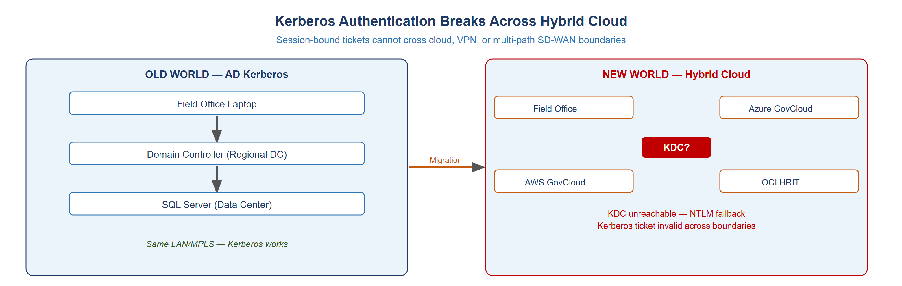
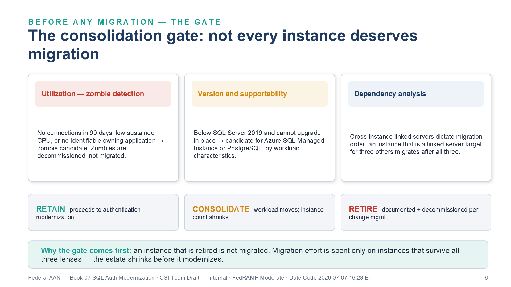
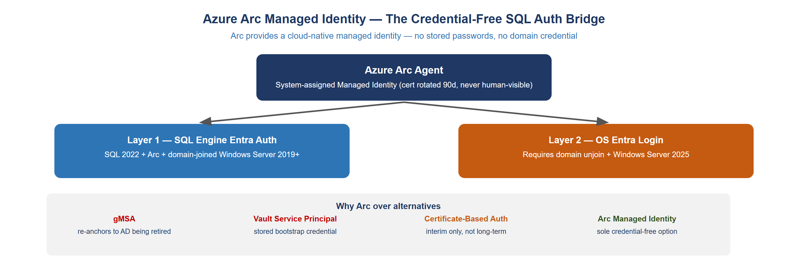
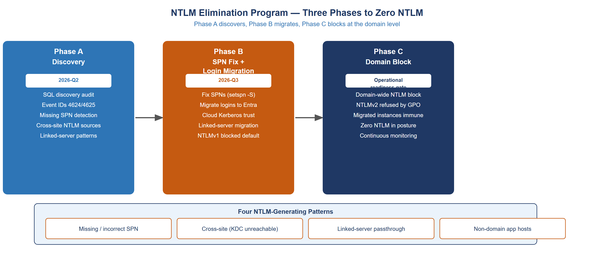
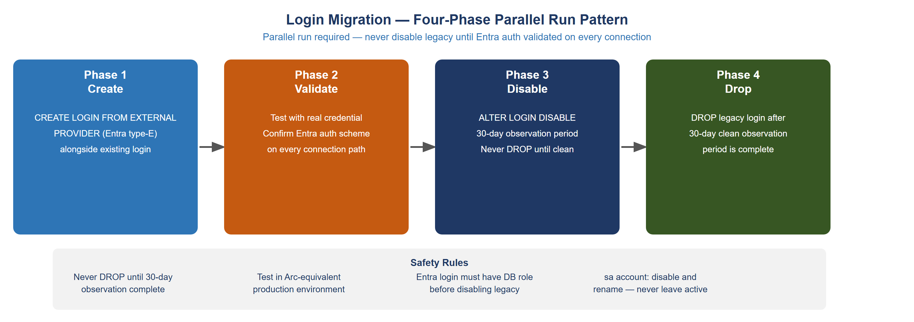
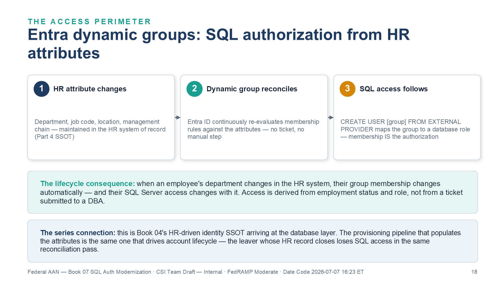
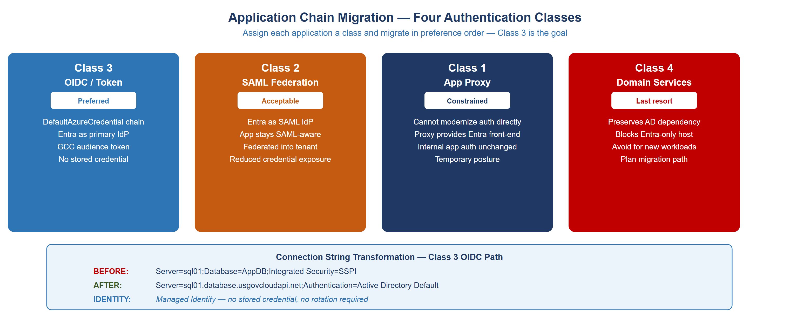
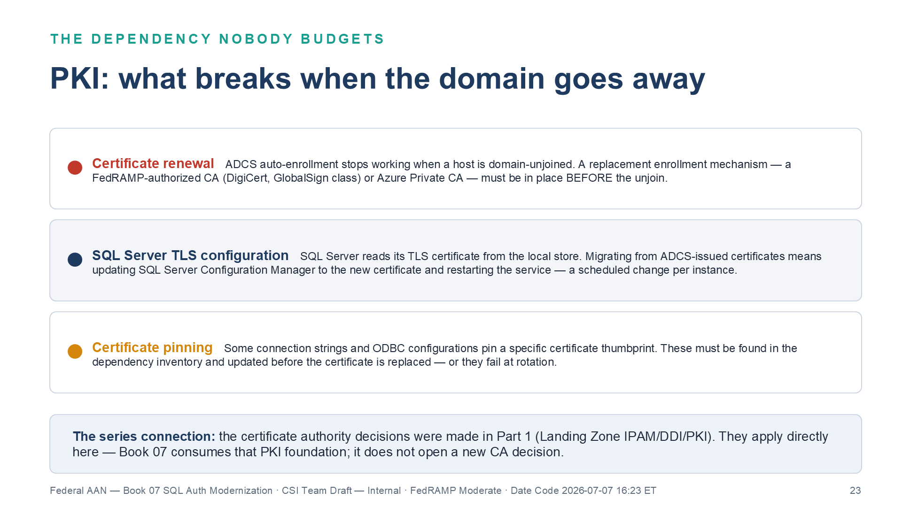
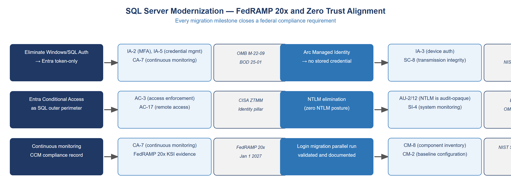

::: {.aan-warning}
## Draft Proposal — Subject to Review

This document is a **draft proposal** developed by the **CSI Team (Cloud Services Infrastructure)**. It is an attempt at a comprehensive -wide technical roadmap and has not been reviewed or approved by the  CIO Office, the Office of Information Security (OIS), or organizational leadership. All recommendations, vendor selections, control mappings, and implementation timelines are subject to revision pending formal review by the  CIO Office and organizational components.

**Date Code:** 2026-07-08 16:07 ET
:::

::: {.aan-important}
**Series Context** — This document is Vol II Book 01 of the Federal Organization Compliance series. Vol I Books 01–06 cover Landing Zone IPAM/DDI/PKI, Network Access Control, Certificates and Tokens, OPM HRIT and the Identity & Organizational SSOT, Network Modernization, and Telecommunications Modernization. This book addresses the authentication layer of SQL Server — the protocol, credential, and identity surface that persists after network controls are in place.
:::

# The Inherited Problem: What Kerberos Actually Does

Every federal SQL Server deployment inherits a credential architecture designed in 1999. Kerberos was built for a world with a single, reachable domain controller and a flat LAN. In that world it worked perfectly: a client obtained a ticket from the KDC, presented it to SQL Server, and SQL Server validated it against the domain — all within milliseconds on the same physical network.

That world ended.

{#fig-san01 fig-alt="Diagram showing Kerberos authentication breaking across hybrid cloud boundaries"}

Federal environments now span multiple cloud regions, SD-WAN fabrics, and government-community cloud tenants. The domain controller that issues Kerberos tickets is not co-located with the SQL Server, the client, or the cloud workload. The result is predictable: Kerberos fails, the stack falls back to NTLM, and the agency unknowingly operates with an authentication protocol that cannot be audited or monitored at the token level.

## What Kerberos Requires

Kerberos requires three things to work:

1. **A reachable KDC.** The client must reach a domain controller to obtain a ticket. Across cloud regions, SD-WAN paths, or VPN tunnels, this often fails silently.
2. **A correct SPN.** SQL Server must have a correctly registered Service Principal Name (SPN) in Active Directory. Missing or duplicate SPNs force NTLM fallback.
3. **Clock synchronization.** Kerberos tickets expire at five minutes of clock skew. In hybrid cloud environments, NTP disciplining is not always consistent.

When any of these three conditions fail, Windows drops to NTLM. NTLM is a challenge-response protocol: it works without a KDC, without an SPN, and without clock sync. It also cannot be monitored, cannot emit token-level audit events, and cannot be gated by Conditional Access.

## The NTLM Problem

NTLM is not merely a legacy protocol. It is an active compliance gap:

- **Audit opacity.** NTLM authentication does not produce token-level event records that SIEM systems can correlate. It produces a successful logon event with no cryptographic binding to a specific user device or location.
- **Pass-the-hash.** NTLM credentials can be captured in memory and replayed without knowing the password. Kerberos tickets are scoped to a service and time window; NTLM hashes are reusable indefinitely.
- **No Conditional Access.** NTLM bypasses Entra ID Conditional Access entirely. A machine compliance check, MFA requirement, or location policy cannot intercept an NTLM authentication.
- **OMB M-22-09 (Zero Trust) and Microsoft's NTLM deprecation.** The federal Zero Trust mandate drives phishing-resistant authentication and the retirement of legacy challenge/response protocols like NTLM, and Microsoft is separately deprecating NTLM at the Windows platform level. (BOD 25-01 governs M365 SCuBA secure baselines and does not itself mandate NTLM elimination.) The transition from Kerberos/NTLM to Entra ID token-based authentication is the mechanism, not the goal. The goal is the elimination of NTLM.

# The Estate: What Must Be Discovered

Before any migration can begin, the SQL Server estate must be fully inventoried. This is not a documentation exercise. The inventory drives every subsequent decision about which instances are retained, which are consolidated, and which are retired.

## Discovery Dimensions

An effective SQL Server estate discovery captures four dimensions for every instance:

**Version and end-of-life posture.** SQL Server 2019 is supported through Extended Security Updates (ESU) via Azure Arc at no additional cost. SQL Server 2017 and earlier require immediate attention — ESU coverage ends on a fixed schedule, and out-of-support instances cannot receive security patches. SQL Server 2022 is the migration target for all retained instances.

**Authentication methods in use.** Every instance is audited for the authentication types in use: Windows Integrated (Kerberos or NTLM), SQL mixed-mode logins, and any service accounts that use stored credentials. The audit must capture both successful and failed authentication events (Event IDs 4624 and 4625) to identify NTLM fallback patterns.

**Service Principal Name registration.** SPNs are checked against the Active Directory record for each SQL Server service account. Missing or duplicate SPNs are the most common cause of silent NTLM fallback in environments where Kerberos is expected. The SPN trail also reveals which service accounts are registered under which context — machine accounts vs. user accounts — which determines the migration approach.

**Dependency mapping.** Linked servers, application connection strings, ODBC data sources, SSIS packages, and SSRS data connections all carry authentication assumptions. These must be inventoried before any login is disabled. A login that appears unused may be the authentication identity for a report that runs monthly.

## The Consolidation Gate

The inventory drives a consolidation gate before any technical migration begins. Every instance is assessed against three lenses:

**Utilization and zombie detection.** Instances with no connections in 90 days, low sustained CPU, or no identifiable owning application are zombie candidates. Zombie instances are decommissioned — they cannot be migrated to a posture that doesn't exist.

**Version and supportability.** Instances below SQL Server 2019 that cannot be upgraded in-place are candidates for migration to Azure SQL Managed Instance or PostgreSQL, depending on workload characteristics.

**Dependency analysis.** Instances with cross-instance linked servers require a migration sequence that respects dependency order. An instance that is a linked-server target for three other instances cannot be migrated until the other three are migrated first.

Instances that survive the consolidation gate proceed to authentication modernization. Instances that do not survive are documented and decommissioned per change management policy.

{#fig-san07 fig-alt="Three lens cards across the top. Utilization and zombie detection in red: no connections in 90 days, low sustained CPU, or no identifiable owning application means zombie candidate — zombies are decommissioned, not migrated. Version and supportability in amber: below SQL Server 2019 and cannot upgrade in place means candidate for Azure SQL Managed Instance or PostgreSQL by workload characteristics. Dependency analysis in navy: cross-instance linked servers dictate migration order — an instance that is a linked-server target for three others migrates after all three. Below, three outcome chips: RETAIN proceeds to authentication modernization; CONSOLIDATE means the workload moves and instance count shrinks; RETIRE means documented and decommissioned per change management. Teal bar: the gate comes first so migration effort is spent only on instances that survive all three lenses — the estate shrinks before it modernizes. White background. Source: Vol II Book 01 SQL Auth Modernization briefing deck, Date Code 2026-07-07 16:23 ET." width="100%"}

# Arc as the Identity Bridge

Azure Arc resolves the SQL Server authentication problem in the most direct way possible: it replaces the domain credential entirely.

{#fig-san02 fig-alt="Diagram showing Azure Arc Managed Identity providing credential-free SQL authentication"}

## What Arc Provides

An Azure Arc agent installed on a Windows Server gives that server a **system-assigned Managed Identity** — a cloud-native identity backed by a certificate in the local store. The certificate is automatically rotated every 90 days. No human ever sees the certificate or its private key. No password is stored in a vault, a connection string, or a service account profile.

The Managed Identity is registered in Entra ID as a service principal. SQL Server 2022 with the Entra authentication extension can use this identity to authenticate database connections from Entra-registered identities — users, groups, and other managed identities — without requiring any Active Directory credential.

## Layer 1: SQL Engine Authentication

The first authentication layer is SQL Engine authentication. This is what most SQL Server migration programs target: replacing Windows Integrated Authentication and SQL logins with Entra ID authentication at the database connection level.

**Requirements:** SQL Server 2022 (or SQL Server 2019 with the Entra extension), Azure Arc agent installed on the host, domain-joined Windows Server 2019 or later. The host does not need to be domain-unjoined for Layer 1.

**What changes:** Database logins are migrated from Windows logins (authenticated via Kerberos/NTLM) and SQL logins (authenticated via stored password) to Entra logins (authenticated via token). Applications authenticate using `DefaultAzureCredential`, `ManagedIdentityCredential`, or an equivalent token provider in the Azure Identity SDK. Connection strings change from `Integrated Security=SSPI` to `Authentication=Active Directory Default`.

**What stays the same:** The host remains domain-joined. Group Policy still applies. SQL Server configuration is unchanged except for the authentication extension. The transition is transparent to the SQL Engine itself.

## Layer 2: OS-Level Entra Login

The second authentication layer is operating system login. This is a more significant transition: the Windows Server host is domain-unjoined and configured for Entra-native OS authentication.

**Requirements:** Windows Server 2025 (the first version with stable Entra ID OS login), domain unjoin, Entra ID Joined enrollment (Entra Join, not Hybrid Join). This is a distinct migration program from Layer 1 and is typically sequenced after all SQL Engine authentication is migrated.

**What changes:** OS logins move from AD user accounts to Entra accounts. RDP and local console access is authenticated against Entra. Group Policy is replaced by Intune or equivalent MDM. The server no longer requires connectivity to an on-premises domain controller.

Most federal SQL Server migration programs implement Layer 1 across the estate and Layer 2 on new deployments and greenfield systems. Legacy hosts that require domain join for other reasons (RADIUS, print services, legacy application hooks) may remain hybrid-joined for an extended transition period while Layer 1 is fully deployed.

## Why Arc, and Not the Alternatives

Four alternatives to Arc Managed Identity are commonly proposed. Each has a disqualifying limitation:

**Group Managed Service Accounts (gMSA).** gMSAs automate password rotation for service accounts. They do not eliminate the dependency on Active Directory — they are an AD construct. Migrating to gMSA re-anchors the service account to the same AD being retired.

**Vault-managed Service Principals.** A credential vault (Azure Key Vault, HashiCorp Vault) manages a service principal secret and rotates it on a schedule. This approach still stores a bootstrap credential: the vault client needs a credential to authenticate to the vault. The bootstrap credential is the problem, not the secret being managed.

**Certificate-Based Authentication.** CBA is an improvement over passwords — certificates can be scoped and time-limited. But certificate distribution, trust chain management, and revocation infrastructure are operational burdens at scale. CBA is a reasonable interim posture, not a target architecture.

**Arc Managed Identity.** The sole credential-free, cloud-native option. No stored secret, no rotation burden, no AD dependency. The certificate is managed by the Arc agent and is not accessible to any user or process outside the agent context.

# NTLM Elimination

NTLM elimination is a three-phase program. Each phase has measurable exit criteria. Phases do not overlap — Phase B does not begin until Phase A is complete across the in-scope estate.

{#fig-san03 fig-alt="Diagram showing three NTLM elimination phases from discovery through domain block"}

## Phase A — Discovery

Phase A maps every NTLM source in the SQL Server estate. The output is a structured list of NTLM-generating patterns, each classified by root cause.

**Event log analysis.** Windows Security log Event IDs 4624 (successful logon) and 4625 (failed logon) are analyzed for authentication type. NTLM logon events have `LogonType = 3` and `AuthenticationPackage = NTLM`. A 30-day event collection baseline is sufficient for most estates.

**SPN audit.** `setspn -L <serviceaccount>` and `setspn -Q MSSQLSvc/*` are run against the domain to identify missing, duplicate, and incorrectly formatted SPNs. Missing SPNs are the most common source of NTLM fallback in environments where Kerberos is expected.

**Four NTLM-generating patterns.** Phase A classifies every NTLM source into one of four patterns:

1. **Missing or incorrect SPN.** The SQL Server service account has no SPN, or the SPN is registered in the wrong format (hostname vs. FQDN, wrong port). Fix: `setspn -S MSSQLSvc/<host>:<port> <serviceaccount>`.
2. **Cross-site connection.** A client in a branch office or cloud region attempts Kerberos but the nearest KDC is unreachable. The fallback to NTLM is silent. Fix: Cloud Kerberos Trust or Entra-native authentication.
3. **Linked-server passthrough.** A linked server passes credentials from the calling context to the remote SQL Server. If the calling context uses NTLM, the linked server passes NTLM. Fix: Migrate the linked server to use a Managed Identity or dedicated service principal.
4. **Non-domain-joined application host.** An application server that is not domain-joined cannot perform Kerberos authentication. It uses NTLM or SQL logins. Fix: Domain join, Arc enrollment, or migration to Entra-native application authentication.

## Phase B — Remediation

Phase B addresses every NTLM source identified in Phase A. The remediation sequence for the most common pattern — missing SPN — is representative:

1. Register the correct SPN: `setspn -S MSSQLSvc/<hostname>.<domain>:<port> <serviceaccount>`
2. Register the short-name variant: `setspn -S MSSQLSvc/<hostname>:<port> <serviceaccount>`
3. Restart the SQL Server service to pick up the new SPN
4. Verify with `klist` that subsequent connections use Kerberos

For cross-site NTLM, Phase B deploys Cloud Kerberos Trust — an Azure AD Kerberos server that issues partial Kerberos tickets satisfied by Entra ID. This allows Kerberos authentication across network boundaries without requiring a reachable on-premises KDC.

For linked servers, Phase B migrates the authentication from passthrough credentials to a dedicated Managed Identity or service principal with the minimum required permissions.

**NTLMv1 block.** At the end of Phase B, NTLMv1 is blocked at the domain level via Group Policy (`Network security: LAN Manager authentication level = Send NTLMv2 response only/refuse LM and NTLM`). NTLMv1 has no legitimate use case in a federal environment; its removal follows Microsoft/DISA STIG hardening guidance and OMB M-22-09 zero-trust doctrine.

## Phase C — Domain-Wide Block

Phase C applies the final Group Policy that refuses all NTLM authentication at the domain level. This is a blocking change — any authentication that still relies on NTLM after Phase C will fail.

Phase C is executed only after Phase B is verified complete. The verification is a 30-day observation period with zero NTLM authentication events in the Security log. If NTLM events appear during the observation period, the source is investigated and remediated before the observation window restarts.

Phase C completion is the evidence baseline for the AU-2/AU-12 controls in the FedRAMP 20x continuous monitoring record.

# The Login Migration

SQL Server logins are the database-level identity records. Migrating logins is the core technical action of the SQL Server modernization program. Every instance that survives the consolidation gate undergoes a login migration.

{#fig-san04 fig-alt="Diagram showing four-phase login migration with parallel run and observation period"}

## Login Types and Migration Targets

SQL Server supports three login types:

**Windows logins.** Authenticated via Kerberos or NTLM. These are the logins being replaced. Each Windows login is matched to an Entra identity (user, group, or service principal) and a corresponding Entra login is created alongside it.

**SQL logins.** Authenticated via stored password hash. SQL logins are a compliance risk regardless of NTLM — they store a credential in the SQL Server instance that is not rotated by any external system. SQL logins are migrated to Entra logins or, for service account contexts, to Managed Identity connections.

**Entra logins.** Created with `CREATE LOGIN [<entra-identity>] FROM EXTERNAL PROVIDER`. Authenticated via Entra ID token. These are the migration target.

## The Four-Phase Parallel Run

Login migration must be executed as a parallel run — not a cutover. The legacy login remains active while the Entra login is created and validated. Only after validation is the legacy login disabled, and only after a 30-day observation period is it dropped.

**Phase 1 — Create.** `CREATE LOGIN [user@] FROM EXTERNAL PROVIDER` — or for a group: `CREATE LOGIN [GroupName] FROM EXTERNAL PROVIDER` with the Entra Object ID.

**Phase 2 — Validate.** The Entra login is tested with real credentials against every connection path: direct connection, application connection string, ODBC data source, linked server. Authentication scheme is confirmed as Entra (not Windows Integrated, not SQL). Database role membership is verified.

**Phase 3 — Disable.** `ALTER LOGIN [domain\user] DISABLE`. The legacy login still exists but cannot be used. This is the critical safety step: if an application was using the legacy login and was missed in the dependency audit, it will fail at this point — but the legacy login can be re-enabled immediately without any data loss or service disruption.

**Phase 4 — Drop.** After a 30-day observation period with no authentication failures traceable to the disabled login, `DROP LOGIN [domain\user]` is executed. The login is gone.

::: {.aan-important}
**Never drop a login until the 30-day observation period is complete.** The observation period is not optional. Applications discover their dependencies against production traffic, not documentation. A login that appears unused in the inventory may be the authentication identity for a monthly process.
:::

## The sa Account

The `sa` (system administrator) account requires special handling. It is a SQL login — a stored password — and it exists in every SQL Server instance regardless of whether it was ever used. Left enabled, it is a standing attack surface.

The sa account cannot be dropped. It must be disabled and renamed:

```sql
ALTER LOGIN sa DISABLE;
ALTER LOGIN sa WITH NAME = [disabled_sa_<instancename>];
```

Disabling sa is a CM-8 inventory action and should be documented in the instance's change record. The renamed, disabled account remains in the login list as evidence that the action was taken.

# Access Control and the Entra Perimeter

Entra ID Conditional Access, when applied to SQL Server connections, creates an authentication perimeter that cannot be expressed in SQL Server itself. SQL Server can grant or deny based on login existence and database role. It cannot enforce MFA, device compliance, or location policy. Entra ID can.

## Entra Dynamic Groups as SQL Authorization Source

SQL Server authorization at the database level maps to Entra group membership via Entra database principals (`CREATE USER [<group>] FROM EXTERNAL PROVIDER`). The group membership is the authorization record — a user in the Entra group has the database role assigned to that group's database principal.

Dynamic groups in Entra ID assign membership based on HR-derived attributes: department, job code, work location, management chain. Dynamic group membership is continuously reconciled by Entra ID — when an employee's department changes in the HR system, their group membership changes automatically, and their SQL Server access changes with it. No manual SQL Server access provisioning is required.

This is the identity lifecycle enforcement mechanism: access is derived from employment status and role, not from a ticket submitted to a DBA.

{#fig-san08 fig-alt="Three numbered step cards left to right with arrows. Step 1, HR attribute changes: department, job code, location, management chain maintained in the HR system of record, the Vol I Book 04 (HRIT Identity & Org SSOT). Step 2, dynamic group reconciles: Entra ID continuously re-evaluates membership rules against the attributes — no ticket, no manual step. Step 3, SQL access follows: CREATE USER group FROM EXTERNAL PROVIDER maps the group to a database role — membership is the authorization. Teal consequence bar: when an employee's department changes in the HR system, group membership changes automatically and SQL Server access changes with it — access derived from employment status and role, not a ticket to a DBA. Blue series bar: this is Vol I Book 04 (HRIT Identity & Org SSOT) arriving at the database layer — the leaver whose HR record closes loses SQL access in the same reconciliation pass. White background. Source: Vol II Book 01 SQL Auth Modernization briefing deck, Date Code 2026-07-07 16:23 ET." width="100%"}

## Conditional Access Policies for SQL

Entra ID Conditional Access policies are applied to the Entra authentication flow that SQL clients use. Policies can enforce:

- **MFA for privileged logins.** DBA logins (members of `sysadmin`, `securityadmin`, or custom privileged groups) require MFA at every authentication.
- **Device compliance.** Connections from devices not enrolled in the MDM system are blocked. This eliminates authentication from unmanaged endpoints.
- **Location restrictions.** Authentication from outside defined trusted IP ranges requires MFA step-up or is blocked entirely. This addresses contractor and vendor access from personal systems.
- **Session time limits.** Access tokens for SQL connections have a configurable lifetime. Privileged sessions are time-limited and require re-authentication after expiry.

Conditional Access policies are configured at the Entra tenant level and apply to all SQL connections authenticated via Entra — there is no per-instance configuration required in SQL Server.

# The Application Chain

Every application that connects to SQL Server carries an authentication assumption. Connection strings, ODBC data sources, service accounts, and application configuration files all encode the authentication method. These must all be updated as part of the login migration program.

{#fig-san05 fig-alt="Diagram showing four application authentication classes from OIDC preferred to Domain Services last resort"}

## Application Authentication Classes

Applications that connect to SQL Server are classified into four categories based on their ability to use modern authentication:

**Class 3 — OIDC/Token (Preferred).** The application uses the Azure Identity SDK and `DefaultAzureCredential` or a `ManagedIdentityCredential`. The connection string specifies `Authentication=Active Directory Default`. No stored credential. Entra ID is the primary IdP. This is the target class for all new development and the migration goal for existing applications that can be modified.

**Class 2 — SAML Federation (Acceptable).** The application uses SAML authentication federated through Entra ID. Entra ID is the IdP; the application remains SAML-aware. The SQL connection is made under a federated identity rather than a directly-issued token. This is acceptable for applications that cannot be modified to use the Azure Identity SDK but are otherwise functional.

**Class 1 — Application Proxy (Constrained).** The application cannot have its authentication modified. An Azure AD Application Proxy or equivalent reverse proxy provides an Entra-authenticated front-end while the application continues to use its internal authentication mechanism to connect to SQL Server. This is a constrained posture — the SQL connection may still use a service account credential — but the user-facing authentication is modernized.

**Class 4 — Domain Services (Last Resort).** The application requires AD for authentication and cannot use any of the above approaches. Azure AD Domain Services preserves the AD dependency in a managed form. This is the last resort — it preserves the AD dependency that the program is trying to eliminate. No new applications should be assigned Class 4.

## Connection String Transformation

The most common transformation in the application chain is connection string modification from Windows Integrated Authentication to Entra Default authentication:

**Before:**
```
Server=sql01.;Database=ApplicationDB;Integrated Security=SSPI;
```

**After:**
```
Server=sql01.;Database=ApplicationDB;Authentication=Active Directory Default;
```

The `Authentication=Active Directory Default` directive instructs the SQL client library to acquire an access token from the available managed identity, environment credential, or interactive login — whichever is available in the execution context — and present it to SQL Server as the authentication credential.

For applications running as Azure resources (App Service, Azure Functions, Container Apps), the available credential is the application's Managed Identity. For applications running on Arc-enrolled servers, the available credential is the server's Managed Identity. No stored credential is required.

## Linked Server Migration

Linked servers that pass authentication credentials from the calling context are a significant risk. The `EXECUTE AS` or `SELF` security context options used in linked server definitions determine whether the calling credential is passed through. In a post-migration posture:

- Linked servers should authenticate using a dedicated service principal or Managed Identity with minimum necessary permissions.
- The `SELF` passthrough option should be disabled in most cases — it passes whatever credential the calling query used, which may be an NTLM credential.
- Linked servers to non-SQL systems (Oracle, PostgreSQL, OData) are audited for credential storage in the linked server definition.

# The Transformed Posture

After a complete migration, the SQL Server authentication posture looks fundamentally different from the inherited state:

| Authentication Surface | Before | After |
|---|---|---|
| User database connections | Windows Integrated (Kerberos/NTLM) | Entra token via Azure Identity SDK |
| Service account connections | SQL login or Windows service account | Managed Identity (credential-free) |
| DBA logins | Windows admin accounts | Entra privileged accounts + MFA |
| sa account | Enabled (often with default password) | Disabled and renamed |
| Application connections | Integrated Security=SSPI | Authentication=Active Directory Default |
| Linked servers | Passthrough or stored credential | Service principal or Managed Identity |
| Group authorization | AD security groups | Entra dynamic groups (HR-derived) |
| MFA enforcement | None | Conditional Access on all privileged logins |
| Access lifecycle | Manual DBA provisioning | HR attribute-driven dynamic group |
| NTLM exposure | Ubiquitous, silent | Zero NTLM (domain-wide block) |

# Certificate Authority and PKI Dependencies

SQL Server uses TLS for transport encryption. The TLS certificate chain anchors to a certificate authority. In federal environments this is typically an internal PKI (usually ADCS) or a FedRAMP-authorized certificate service.

{#fig-san09 fig-alt="Three stacked rows. Certificate renewal in red: ADCS auto-enrollment stops working when a host is domain-unjoined — a replacement enrollment mechanism, a FedRAMP-authorized CA of the DigiCert or GlobalSign class or Azure Private CA, must be in place before the unjoin. SQL Server TLS configuration in navy: SQL Server reads its TLS certificate from the local store — migrating from ADCS-issued certificates means updating SQL Server Configuration Manager to the new certificate and restarting the service, a scheduled change per instance. Certificate pinning in amber: some connection strings and ODBC configurations pin a specific certificate thumbprint — these must be found in the dependency inventory and updated before the certificate is replaced or they fail at rotation. Blue series bar: the certificate authority decisions were made in Vol I Book 01 (Landing Zone, IPAM/DDI, PKI) — this book (Vol II Book 01) consumes that PKI foundation and does not open a new CA decision. White background. Source: Vol II Book 01 SQL Auth Modernization briefing deck, Date Code 2026-07-07 16:23 ET." width="100%"}

When Active Directory is retired or domain-unjoined servers are migrated to Entra, the ADCS infrastructure that issued server certificates must be addressed:

**Certificate renewal.** Domain-joined ADCS certificate auto-enrollment stops working when the host is domain-unjoined. A replacement enrollment mechanism — DigiCert, GlobalSign, or equivalent FedRAMP-authorized CA, or Azure Private CA — must be in place before the domain is unjoined.

**SQL Server TLS configuration.** SQL Server reads its TLS certificate from the local certificate store. The migration from ADCS-issued certificates to a new CA requires updating the SQL Server Configuration Manager to reference the new certificate and restarting the SQL Server service.

**Certificate pinning.** Some connection strings or ODBC configurations pin to a specific certificate thumbprint. These must be identified in the dependency inventory and updated before the certificate is replaced.

The PKI surface is addressed in Vol I Book 01 (Cloud Landing Zone, IPAM/DDI) of this series. The certificate authority decisions made in Vol I Book 01 apply directly to the SQL Server certificate migration described here.

# Database Platform Decisions

The SQL Server modernization program creates a rationalization gate at which the platform decision for each workload is revisited. SQL Server 2022 with Arc Managed Identity is the primary target, but two alternative platforms are worth evaluating:

## PostgreSQL for New Workloads

PostgreSQL on Azure Database for PostgreSQL — Flexible Server supports Entra authentication natively. For new database workloads with no existing PL/SQL or T-SQL corpus, PostgreSQL avoids the SQL Server licensing cost and provides equivalent Entra authentication posture.

For existing workloads, schema migration from SQL Server to PostgreSQL requires the SQL Server Migration Assistant (SSMA) for PostgreSQL and significant testing effort. This is appropriate when the licensing cost savings justify the migration investment — typically when the SQL Server instance is a new deployment or a simple schema with minimal stored procedures.

## Azure SQL Managed Instance

Azure SQL Managed Instance is a fully managed SQL Server deployment in Azure that supports Entra authentication and provides a path to a cloud-native posture without infrastructure management. It is appropriate when the workload can move off on-premises infrastructure entirely and the agency's cloud strategy supports Azure-native hosting.

The authentication migration described in this document applies to Azure SQL Managed Instance identically — Entra logins, Managed Identity connections, and Conditional Access policies work the same way.

# Federal Compliance Alignment

{#fig-san06 fig-alt="Matrix mapping SQL Server migration milestones to NIST controls and federal authority documents"}

## NIST SP 800-53 Rev 5 Control Closure

> **Closure Necessity — IA-2 on multipath transport.** Kerberos binds authentication to a session and a location: the client must reach a KDC, the SPN must resolve unambiguously to one service instance, and the ticket assumes a stable path between client, KDC, and server. On an SD-WAN fabric that steers each flow per-application across multiple paths — and across cloud boundaries where no domain controller is reachable — those assumptions fail, and the stack falls back silently to NTLM, which emits no token-level audit event and admits no Conditional Access gate. The only authentication mechanism that survives application-aware, multipath transport is a cryptographically validated token presented at the endpoint, independent of the path the packets took — the doctrine established in [Vol I Book 03](Vol_I_Book_03_OrgComp_Certificates_Tokens_Cryptographic_Identity.qmd), which this book applies to SQL Server. There is no SPN repair, KDC placement, or clock discipline that makes session-bound authentication path-independent.

| Control | Control Name | Closed By | How |
|---|---|---|---|
| IA-2 | Identification and Authentication — Organizational Users | Entra login migration | Token-based authentication replaces Windows Integrated and SQL auth |
| IA-3 | Device Identification and Authentication | Arc Managed Identity | Server identity is cryptographically bound to Arc enrollment |
| IA-5 | Authenticator Management | Credential elimination | Managed Identity eliminates stored credentials; sa disabled |
| IA-5(1) | Password-Based Authentication | SQL login elimination | SQL logins (stored password hashes) removed from all instances |
| AC-2 | Account Management | Entra dynamic group lifecycle | Access lifecycle driven by HR attributes, not manual DBA requests |
| AC-3 | Access Enforcement | Database role + Entra group | Authorization enforced at Entra group membership level |
| AC-17 | Remote Access | Conditional Access | Remote SQL access gated by device compliance and location policy |
| AU-2 | Event Logging | NTLM elimination | NTLM eliminated; all authentication produces auditable token events |
| AU-12 | Audit Record Generation | Entra token audit trail | Entra sign-in logs provide token-level audit for every connection |
| CA-7 | Continuous Monitoring | CCM compliance record | Continuous monitoring baseline established per FedRAMP 20x requirements |
| CM-2 | Baseline Configuration | Login inventory documentation | Login migration produces a documented baseline of all database identities |
| CM-8 | System Component Inventory | Estate discovery output | All SQL instances, versions, and logins inventoried and documented |
| SC-8 | Transmission Confidentiality and Integrity | TLS + Arc cert | SQL Server TLS with Arc-managed certificate for all connections |
| SI-4 | System Monitoring | Zero NTLM monitoring | Post-Phase C monitoring for any NTLM recurrence |

## FedRAMP 20x Key Security Indicators

FedRAMP 20x replaces annual assessment with continuous machine-readable evidence. The SQL Server migration program produces the following KSI evidence artifacts:

- **Authentication posture report.** Machine-readable export of all database logins, their types, and their last authentication event. Updated daily from SQL Server audit logs.
- **NTLM event count.** Zero-count assertion for NTLM authentication events in the Windows Security log, validated against the Group Policy configuration.
- **Managed Identity coverage.** Percentage of service account connections using Managed Identity vs. stored credential. Target: 100%.
- **Conditional Access compliance.** Percentage of Entra-authenticated SQL connections from compliant devices. Non-compliant connection attempts are blocked and logged.
- **sa account status.** Disabled and renamed on all instances. Continuous check via SQL audit.

These artifacts provide KSI evidence (KSI-IAM for identity and authentication, KSI-MLA for monitoring and logging) toward the IA-2, IA-5, AU-2, AU-12, CA-7, and CM-8 control obligations under FedRAMP 20x.

# Summary

The SQL Server authentication modernization program addresses the credential surface that persists after network controls are in place. Kerberos and NTLM authentication, SQL logins, and stored service account credentials are replaced with Arc Managed Identity, Entra token-based authentication, and dynamic group authorization. The transformation eliminates NTLM, removes all stored credentials from SQL Server, and creates a machine-readable compliance baseline aligned with FedRAMP 20x requirements.

The program is structured as four sequential workstreams: estate discovery and consolidation gate, Arc enrollment and Layer 1 authentication migration, NTLM elimination, and application chain migration. Each workstream has measurable exit criteria. The migration does not require taking systems offline — parallel run patterns ensure continuity throughout.

The certificate authority and PKI decisions from Vol I Book 01 (Cloud Landing Zone, IPAM/DDI) provide the transport encryption foundation. The network segmentation and SD-WAN traffic class controls from Vol I Books 05–06 (Network Modernization and Federal Telecommunications Modernization) provide the network-layer isolation. This book provides the identity and credential foundation. Together they constitute the application-aware networking posture required for FedRAMP 20x authorization.
