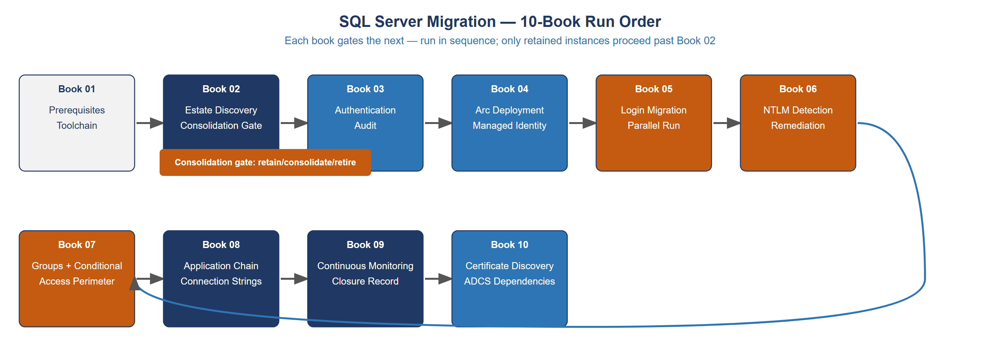
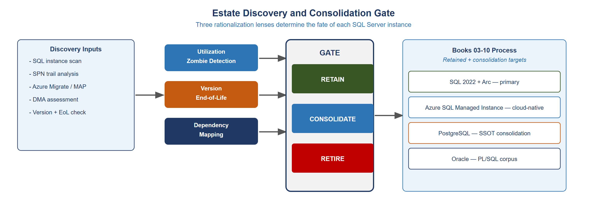

::: {.aan-warning}
## Draft Proposal — Subject to Review

This document is a **draft proposal** developed by the **CSI Team (Cloud Services Infrastructure)**. It is an attempt at a comprehensive -wide technical roadmap and has not been reviewed or approved by the  CIO Office, the Office of Information Security (OIS), or organizational leadership. All recommendations, vendor selections, control mappings, and implementation timelines are subject to revision pending formal review by the  CIO Office and organizational components.

**Date Code:** 2026-07-08 16:07 ET
:::

::: {.aan-important}
**Series Context** — This document is Vol II Book 02 of the Federal Organization Compliance series and the implementation companion to Vol II Book 01 (SQL Server Authentication Modernization). Vol II Book 01 covers the conceptual framework; this document provides the operational runbooks, command references, and configuration templates for execution.
:::

# How to Use This Guide

This guide is organized as ten sequential books. Each book has a defined scope, prerequisites, and measurable completion criteria. Books must be run in order — later books depend on state established by earlier ones.

{#fig-imp01 fig-alt="Flowchart showing 10-book run order with consolidation gate at Book 02"}

**The consolidation gate** at Book 02 is a real gate, not a formality. Instances that do not meet the retain criteria are decommissioned before migration resources are spent on them. An instance that is retired is not migrated — it is turned off, its databases are archived or transferred, and it is removed from the estate inventory.

**Safety model.** Every destructive action in this guide is preceded by a documented undo path. `ALTER LOGIN DISABLE` can be reversed with `ALTER LOGIN ENABLE`. SPNs can be removed with `setspn -D`. Arc enrollment can be unenrolled. Every action up to that point is reversible; the first irreversible action is `DROP LOGIN` in Book 05 — and that action is explicitly gated behind a 30-day observation period.

**Test environment requirement.** Books 03–06 should be validated in a test environment before execution against production instances. The test environment must be Arc-enrolled and running SQL Server 2022 to produce meaningful validation results. Testing against SQL Server 2019 with the Entra extension is acceptable for Book 03 (audit only); Book 04's Entra-enablement and Book 05 (login migration) require 2022.

---

# Book 01 — Prerequisites and Toolchain

## Prerequisites Checklist

Before beginning any migration work, verify the following conditions are met on every instance in scope:

**Licensing and support posture:**

- [ ] SQL Server version identified (2019, 2022, or earlier)
- [ ] All pre-2019 instances have a documented upgrade or migration plan
- [ ] SQL Server 2019 instances have ESU coverage confirmed via Arc enrollment (free via Arc)
- [ ] SQL Server 2022 is the target version for all retained instances

**Azure connectivity:**

- [ ] Outbound HTTPS (port 443) to `management.azure.com`, `login.microsoftonline.com`, `*.his.arc.azure.com` confirmed from each server
- [ ] Azure subscription available in the agency tenant with Arc-enabled servers resource group
- [ ] Service principal or Managed Identity with `Azure Connected Machine Onboarding` role for Arc enrollment

**Active Directory baseline:**

- [ ] Domain joined status confirmed for all in-scope instances
- [ ] Service account identified for each SQL Server service (not `NETWORK SERVICE` or `LOCAL SYSTEM`)
- [ ] SQL Server Configuration Manager accessible on each instance

**Toolchain setup:**

- [ ] Azure CLI (`az`) installed on the management workstation, version 2.50 or later
- [ ] SQL Server Management Studio (SSMS) 19 or later, or Azure Data Studio with SQL extension
- [ ] `sqlcmd` utility available on the management workstation
- [ ] `setspn.exe` available (included in Windows Server RSAT tools)

## Service Account Baseline

Every SQL Server service must run under a dedicated, named service account — not `NETWORK SERVICE`, `LOCAL SYSTEM`, or a shared service account. This baseline is required before SPN registration and before Arc enrollment.

Identify the current service account for each SQL Server instance:

```powershell
Get-WmiObject Win32_Service -Filter "Name LIKE 'MSSQL%'" |
    Select-Object Name, StartName, State |
    Export-Csv "$env:USERPROFILE\Desktop\sql-service-accounts-$(Get-Date -Format yyyyMMdd).csv"
```

For any instance running under `NETWORK SERVICE` or `LOCAL SYSTEM`, create a dedicated domain service account and update the SQL Server service account via SQL Server Configuration Manager before proceeding.

---

# Book 02 — Estate Discovery and Consolidation Gate

{#fig-imp02 fig-alt="Diagram showing estate discovery feeding three-way consolidation gate with output targets"}

## SQL Instance Scan

Run the following against the domain to identify all SQL Server instances registered in Active Directory:

```powershell
# Discover all SQL instances via SPN registration
$domain = (Get-ADDomain).DistinguishedName
$spns = Get-ADObject -Filter { objectClass -eq "computer" } `
    -Properties servicePrincipalName |
    Where-Object { $_.servicePrincipalName -like "MSSQLSvc/*" } |
    Select-Object Name, @{N="SPNs";E={$_.servicePrincipalName -join "; "}}

$spns | Export-Csv "$env:USERPROFILE\Desktop\sql-spn-inventory-$(Get-Date -Format yyyyMMdd).csv" -NoTypeInformation
```

Cross-reference SPN results against Azure Migrate discovery output if available. Instances registered in SPN but not responding to connection attempts are candidates for the zombie classification.

## Authentication Type Audit

For each discovered instance, run the authentication audit to identify NTLM sources:

```sql
-- Run on each instance to identify authentication types in use
-- Requires VIEW SERVER STATE permission
SELECT
    login_name,
    auth_scheme,
    host_name,
    program_name,
    COUNT(*) AS connection_count,
    MAX(connect_time) AS last_connection
FROM sys.dm_exec_sessions
WHERE is_user_process = 1
GROUP BY login_name, auth_scheme, host_name, program_name
ORDER BY auth_scheme, connection_count DESC;
```

Authentication scheme values: `KERBEROS`, `NTLM`, `SQL`, `CERTIFICATE`. Instances with `NTLM` connections are flagged for Phase B remediation. Instances with `SQL` connections are flagged for login migration.

## Utilization Assessment

Identify zombie instances using connection history and SQL Agent job history:

```sql
-- Check for connections in the past 90 days (requires audit enabled)
-- If Ring Buffer is available:
SELECT
    record.value('(./Record/ConnectivityTraceRecord/LoginName)[1]', 'NVARCHAR(128)') AS login_name,
    record.value('(./Record/ConnectivityTraceRecord/ProtocolType)[1]', 'NVARCHAR(128)') AS protocol,
    DATEADD(ms, rb.timestamp - si.ms_ticks, GETDATE()) AS event_time
FROM sys.dm_os_ring_buffers AS rb
CROSS JOIN sys.dm_os_sys_info AS si
CROSS APPLY (SELECT CAST(rb.record AS XML) AS record) AS xRecord(record)
WHERE rb.ring_buffer_type = N'RING_BUFFER_CONNECTIVITY'
AND record.value('(./Record/ConnectivityTraceRecord/RecordType)[1]', 'VARCHAR(50)') = 'LoginTimers'
ORDER BY event_time DESC;
```

## Consolidation Gate Decision

For each instance, assign one of three dispositions:

**RETAIN:** Instance has active workloads, is on a supportable version path, and will be migrated through Books 03–10.

**CONSOLIDATE:** Instance's databases will be migrated to another instance (lateral consolidation) or to a cloud platform (Azure SQL Managed Instance, PostgreSQL). Books 03–10 are applied to the target instance; the source is decommissioned after migration.

**RETIRE:** Instance has no active workloads, no live databases, and no pending dependencies. Decommissioned immediately. Databases archived per records management policy.

Document the disposition decision, authorizing manager, and expected completion date for each instance before proceeding to Book 03.

---

# Book 03 — Authentication Audit

The authentication audit produces the pre-migration baseline: every login, its type, its last use, and its associated permissions. This baseline is the reference document for the login migration in Book 05.

## Login Inventory

```sql
-- Complete login inventory for all instance-level principals
SELECT
    p.name AS login_name,
    p.type_desc AS login_type,
    p.is_disabled,
    p.create_date,
    p.modify_date,
    l.password_hash IS NOT NULL AS has_password_hash,
    l.is_policy_checked,
    l.is_expiration_checked,
    ISNULL(sp.permission_name, '') AS server_permission
FROM sys.server_principals p
LEFT JOIN sys.sql_logins l ON p.principal_id = l.principal_id
LEFT JOIN sys.server_permissions sp ON p.principal_id = sp.grantee_principal_id
WHERE p.type IN ('S', 'U', 'G')  -- SQL, Windows User, Windows Group
ORDER BY p.type_desc, p.name;
```

## Database User Inventory

```sql
-- For each database: all database users and their mappings
EXEC sp_MSforeachdb '
USE [?];
SELECT
    DB_NAME() AS database_name,
    dp.name AS user_name,
    dp.type_desc AS user_type,
    sp.name AS mapped_login,
    dr.name AS database_role
FROM sys.database_principals dp
LEFT JOIN sys.server_principals sp ON dp.sid = sp.sid
LEFT JOIN sys.database_role_members rm ON dp.principal_id = rm.member_principal_id
LEFT JOIN sys.database_principals dr ON rm.role_principal_id = dr.principal_id
WHERE dp.type IN (''S'', ''U'', ''G'')
AND dp.name NOT IN (''guest'', ''INFORMATION_SCHEMA'', ''sys'', ''dbo'')
ORDER BY dp.type_desc, dp.name;
'
```

## NTLM Source Identification

Enable SQL Server Audit to capture authentication events, or use the Windows Security log:

```powershell
# Export NTLM events from Windows Security log (last 30 days)
$startDate = (Get-Date).AddDays(-30)
$events = Get-WinEvent -FilterHashtable @{
    LogName   = 'Security'
    Id        = 4624, 4625
    StartTime = $startDate
} | Where-Object {
    $_.Properties[10].Value -eq 'NTLM'  # AuthenticationPackageName (index 10 in event 4624; index 8 is LogonType)
}

$events | Select-Object TimeCreated,
    @{N="User";E={$_.Properties[5].Value}},
    @{N="Workstation";E={$_.Properties[11].Value}},
    @{N="LogonType";E={$_.Properties[8].Value}} |
Export-Csv "$env:USERPROFILE\Desktop\ntlm-events-$(Get-Date -Format yyyyMMdd).csv" -NoTypeInformation
```

## Five Closure Conditions

The authentication audit is complete when all five closure conditions are documented:

{#fig-imp03 fig-alt="Diagram showing three NTLM elimination phases from discovery through domain block"}

1. **Login inventory complete.** All instance-level logins enumerated, typed, and exported.
2. **Database user mapping complete.** All database users mapped to logins and roles.
3. **NTLM sources classified.** All NTLM authentication events classified by root cause (missing SPN, cross-site, linked server, non-domain host).
4. **Dependency map complete.** All applications, ODBC sources, linked servers, and scheduled jobs that authenticate to this instance are identified.
5. **Migration plan approved.** The login migration plan (which Entra identity replaces each legacy login) is documented and approved by the data owner.

---

# Book 04 — Arc Deployment and Managed Identity

## Arc Agent Installation

Arc enrollment is performed per-server, not per-instance. A Windows Server with multiple SQL Server instances requires only one Arc agent.

**Generate the Arc installation script from the Azure portal:**

1. Navigate to `Azure Arc > Servers > Add`
2. Select `Add a single server`
3. Select `Windows` as the OS
4. Configure the subscription, resource group, and region
5. Download the generated installation script (PowerShell)

**Run the installation script on each server (requires administrator privileges):**

```powershell
# Run the Azure-generated script — example structure:
# $env:SUBSCRIPTION_ID = "<subscription-id>"
# $env:RESOURCE_GROUP  = "<resource-group>"
# $env:TENANT_ID       = "<tenant-id>"
# $env:LOCATION        = "usgovvirginia"

# Invoke-WebRequest -Uri "https://aka.ms/azcmagent-windows" -OutFile "$env:TEMP\install_windows_azcmagent.ps1"
# & "$env:TEMP\install_windows_azcmagent.ps1"
# azcmagent connect --subscription-id $env:SUBSCRIPTION_ID `
#                   --resource-group $env:RESOURCE_GROUP `
#                   --tenant-id $env:TENANT_ID `
#                   --location $env:LOCATION
```

## Verify Arc Enrollment

```powershell
# Verify Arc agent status
azcmagent show

# Expected output includes:
# Status: Connected
# Resource name: <servername>
# Resource group: <resourcegroup>
# Tenant ID: <tenantid>
```

## SQL Server Arc Extension

After Arc enrollment, install the SQL Server Arc extension to enable Entra authentication:

```powershell
# Via Azure CLI (run from management workstation)
az connectedmachine extension create `
    --name "WindowsAgent.SqlServer" `
    --publisher "Microsoft.AzureData" `
    --type "WindowsAgent.SqlServer" `
    --machine-name "<servername>" `
    --resource-group "<resourcegroup>" `
    --location "usgovvirginia" `
    --settings '{"SqlManagement":{"IsEnabled":true}}'
```

## Validate Managed Identity Token

After extension installation, validate that the server can acquire a Managed Identity token:

```powershell
# Test Managed Identity token acquisition (run on the Arc-enrolled server)
$response = Invoke-RestMethod `
    -Uri "http://localhost:40342/metadata/identity/oauth2/token?api-version=2020-06-01&resource=https://management.azure.com/" `
    -Headers @{ Metadata = "true" } `
    -Method GET

if ($response.access_token) {
    Write-Host "Managed Identity token acquired successfully"
    Write-Host "Token type: $($response.token_type)"
    Write-Host "Expires in: $($response.expires_in) seconds"
} else {
    Write-Error "Failed to acquire Managed Identity token"
}
```

## Enable Entra Authentication on SQL Server

```sql
-- Enable Entra authentication on the SQL instance
-- Requires sysadmin role; specify the Arc server's Managed Identity display name
USE master;
GO

-- For SQL Server 2022:
ALTER SERVER CONFIGURATION
    SET EXTERNAL AUTHENTICATION PROVIDER ENABLED = 1;
GO

-- Create the Azure AD admin account (first Entra login must be an admin)
-- Replace with the agency's Entra ID group for SQL DBAs
CREATE LOGIN [SQLDBAs@] FROM EXTERNAL PROVIDER;
ALTER SERVER ROLE sysadmin ADD MEMBER [SQLDBAs@];
GO
```

---

# Book 05 — Login Migration and Parallel Run

This book is the core migration action. Every legacy login on every retained instance is migrated to an Entra login using the four-phase parallel run pattern.

## Migration Sequence per Login

**Phase 1 — Create Entra login:**

```sql
-- For a user login:
CREATE LOGIN [firstname.lastname@] FROM EXTERNAL PROVIDER;

-- For a group login (use Object ID for nested groups):
CREATE LOGIN [SQL-ApplicationName-ReadOnly] FROM EXTERNAL PROVIDER
    WITH OBJECT_ID = 'xxxxxxxx-xxxx-xxxx-xxxx-xxxxxxxxxxxx';

-- Grant database access:
USE [ApplicationDatabase];
CREATE USER [firstname.lastname@] FOR LOGIN [firstname.lastname@];
ALTER ROLE db_datareader ADD MEMBER [firstname.lastname@];
```

**Phase 2 — Validate:**

```powershell
# Test connection using Azure AD authentication (run from workstation enrolled with target identity)
$connectionString = "Server=sql01.;Database=ApplicationDatabase;Authentication=Active Directory Interactive;"
$connection = New-Object System.Data.SqlClient.SqlConnection($connectionString)
$connection.Open()
Write-Host "Authentication scheme: $(
    (New-Object System.Data.SqlClient.SqlCommand(
        'SELECT auth_scheme FROM sys.dm_exec_connections WHERE session_id = @@SPID',
        $connection)).ExecuteScalar()
)"
$connection.Close()
```

Expected output: `Authentication scheme: KERBEROS` (for Entra ID token-based connections on the server side) or `Authentication scheme: NONE` (for Managed Identity connections, which bypass the SQL authentication scheme column).

**Phase 3 — Disable legacy login:**

```sql
-- Disable (not drop) the legacy login
ALTER LOGIN [DOMAIN\username] DISABLE;

-- Document the action in the migration log:
INSERT INTO dba_migration_log (login_name, action, action_date, performed_by)
VALUES ('DOMAIN\username', 'DISABLED', GETDATE(), SYSTEM_USER);
```

**Phase 4 — Drop after observation:**

```sql
-- Only execute after 30-day observation period with zero authentication failures
-- traceable to this disabled login.
DROP LOGIN [DOMAIN\username];

-- Update migration log:
UPDATE dba_migration_log
SET dropped_date = GETDATE()
WHERE login_name = 'DOMAIN\username';
```

## sa Account Handling

```sql
-- Disable sa account
ALTER LOGIN sa DISABLE;

-- Rename to prevent confusion with any other sa accounts
ALTER LOGIN sa WITH NAME = [disabled_sa_sql01_prod];

-- Verify
SELECT name, is_disabled FROM sys.server_principals
WHERE name LIKE 'disabled_sa%';
```

## Migration Tracking Table

Create a migration tracking table in a DBA database on each instance:

```sql
CREATE TABLE dba.login_migration_log (
    id              INT IDENTITY PRIMARY KEY,
    legacy_login    NVARCHAR(256) NOT NULL,
    legacy_type     NVARCHAR(50)  NOT NULL,
    entra_login     NVARCHAR(256) NOT NULL,
    created_date    DATETIME      NOT NULL DEFAULT GETDATE(),
    validated_date  DATETIME      NULL,
    disabled_date   DATETIME      NULL,
    dropped_date    DATETIME      NULL,
    notes           NVARCHAR(MAX) NULL
);
```

---

# Book 06 — NTLM Detection and Remediation

## SPN Fix

For each NTLM source classified as "missing SPN" in Book 03:

```powershell
# Register SPNs for SQL Server service account
# Replace <serviceaccount> with the SQL Server service account (domain\account format)
# Replace <hostname> with the SQL Server host short name
# Replace <fqdn> with the fully qualified domain name
# Replace <port> with the SQL Server port (default 1433)

$serviceAccount = "DOMAIN\svc-sql01"
$hostname = "SQL01"
$fqdn = "sql01."
$port = 1433

# Register both hostname and FQDN variants, with and without port
setspn -S "MSSQLSvc/${hostname}" $serviceAccount
setspn -S "MSSQLSvc/${hostname}:${port}" $serviceAccount
setspn -S "MSSQLSvc/${fqdn}" $serviceAccount
setspn -S "MSSQLSvc/${fqdn}:${port}" $serviceAccount

# Verify
setspn -L $serviceAccount
```

After registering SPNs, restart the SQL Server service and verify the next connection uses Kerberos:

```powershell
# Test Kerberos authentication
$connectionString = "Server=SQL01;Database=master;Integrated Security=SSPI;"
$connection = New-Object System.Data.SqlClient.SqlConnection($connectionString)
$connection.Open()
$authScheme = (New-Object System.Data.SqlClient.SqlCommand(
    "SELECT auth_scheme FROM sys.dm_exec_connections WHERE session_id = @@SPID",
    $connection)).ExecuteScalar()
Write-Host "Auth scheme: $authScheme"  # Expected: KERBEROS
$connection.Close()
```

## Linked Server Remediation

For linked servers using passthrough authentication:

```sql
-- Identify linked server security configuration
SELECT
    ls.name AS linked_server,
    ls.product,
    ls.provider,
    lsl.uses_self_credential,
    lsl.remote_name
FROM sys.servers ls
JOIN sys.linked_logins lsl ON ls.server_id = lsl.server_id
WHERE ls.is_linked = 1;
```

For linked servers with `uses_self_credential = 1`, create a dedicated service principal for the linked server connection and update to explicit credential mapping:

```sql
-- Drop existing linked server login mapping
EXEC sp_droplinkedsrvlogin @rmtsrvname = 'LINKEDSERVER01', @locallogin = NULL;

-- Add explicit mapping to dedicated service principal
EXEC sp_addlinkedsrvlogin
    @rmtsrvname   = 'LINKEDSERVER01',
    @useself      = 'FALSE',
    @locallogin   = NULL,
    @rmtuser      = 'svc-linkedserver@',  -- Entra service account
    @rmtpassword  = NULL;  -- Token authentication — no password
```

## NTLMv1 Block (Phase B completion action)

Apply this Group Policy setting via GPO across all SQL Server hosts after SPN fixes are verified:

```
Computer Configuration > Windows Settings > Security Settings > Local Policies > Security Options
Network security: LAN Manager authentication level
Value: Send NTLMv2 response only. Refuse LM and NTLM.
```

Via PowerShell (for individual server verification):

```powershell
# Check current NTLM policy
Get-ItemProperty -Path "HKLM:\SYSTEM\CurrentControlSet\Control\Lsa" -Name "LmCompatibilityLevel"
# Value 5 = Send NTLMv2 only; refuse LM and NTLM

# Set if not already at 5:
Set-ItemProperty -Path "HKLM:\SYSTEM\CurrentControlSet\Control\Lsa" -Name "LmCompatibilityLevel" -Value 5
```

---

# Book 07 — Groups and Conditional Access Perimeter

## Entra Group Structure for SQL Authorization

Establish a consistent group naming convention for SQL Server authorization:

| Group Purpose | Naming Convention | Example |
|---|---|---|
| Instance administrators | `SQL-{instance}-Admin` | `SQL-SQLPROD01-Admin` |
| Database read-write | `SQL-{database}-ReadWrite` | `SQL-FinancialDB-ReadWrite` |
| Database read-only | `SQL-{database}-ReadOnly` | `SQL-FinancialDB-ReadOnly` |
| Reporting users | `SQL-{database}-Report` | `SQL-FinancialDB-Report` |
| Service accounts | `SQL-SVC-{application}` | `SQL-SVC-PayrollApp` |

Groups are created in Entra ID and assigned membership via dynamic membership rules based on HR-derived attributes where the workload is user access, or manually managed for service account groups.

## Dynamic Group Configuration

For user access groups, configure dynamic membership in Entra ID:

```
Dynamic rule for SQL-FinancialDB-ReadWrite:
(user.department -eq "Finance") and
(user.jobTitle -contains "Analyst") and
(user.accountEnabled -eq true)
```

Dynamic groups sync membership continuously — no manual provisioning when users change roles.

## Conditional Access Policy for SQL

Configure a Conditional Access policy in Entra ID targeted at the SQL Server resource:

```
Policy: SQL Server — Require Compliant Device
Target: Cloud app = Azure SQL (App ID 022907d3-0f1b-48f7-badc-1ba6abab6d66)
Users and groups: SQL-FinancialDB-ReadWrite, SQL-FinancialDB-ReadOnly
Conditions:
  - Device platforms: Windows
  - Client apps: Modern authentication clients
Grant: Require device to be marked as compliant
Session: Sign-in frequency = 8 hours
```

For privileged (admin) logins:

```
Policy: SQL Server — Admin MFA
Target: Cloud app = Azure SQL
Users and groups: SQL-SQLPROD01-Admin, SQL-SQLPROD02-Admin
Grant: Require multi-factor authentication + Require compliant device
Session: Sign-in frequency = 1 hour (persistent browser = disabled)
```

---

# Book 08 — Application Chain and Connection Strings

## Connection String Inventory

Collect all connection strings in use for this instance's databases. Sources include:

- IIS web.config files
- Application configuration files (appsettings.json, app.config)
- ODBC Data Sources (System DSNs via `odbcad32.exe`)
- SSIS packages
- SSRS data sources
- Scheduled task scripts
- Service account registry entries

```powershell
# Search for connection strings in IIS web.config files
Get-ChildItem -Path "C:\inetpub" -Recurse -Filter "web.config" |
    Select-String -Pattern "Integrated Security=SSPI|Trusted_Connection=yes|User Id=sa" |
    Select-Object Path, LineNumber, Line |
    Export-Csv "$env:USERPROFILE\Desktop\connection-strings-$(Get-Date -Format yyyyMMdd).csv"
```

## Connection String Transformation

For each Class 3 application (OIDC/Token path):

**Before:**
```
Data Source=SQL01.;Initial Catalog=ApplicationDB;Integrated Security=SSPI;
```

**After:**
```
Data Source=SQL01.;Initial Catalog=ApplicationDB;Authentication=Active Directory Default;
```

For applications using the Azure Identity SDK, add the credential provider:

```csharp
// .NET application — Azure.Identity package
using Azure.Identity;
using Microsoft.Data.SqlClient;

var credential = new DefaultAzureCredential();
var connection = new SqlConnection("Server=sql01.;Database=ApplicationDB;Authentication=Active Directory Default;");
// DefaultAzureCredential automatically uses the Managed Identity when running on Arc-enrolled server
connection.Open();
```

## ODBC Data Source Migration

```powershell
# List all System DSNs
Get-OdbcDsn -DsnType "System" | Select-Object Name, DriverName, Attribute

# Update ODBC DSN authentication for Entra:
# SQL Server ODBC Driver 18 supports Entra authentication
Set-OdbcDsn -Name "ApplicationDSN" -DsnType "System" -SetPropertyValue @(
    "Authentication=ActiveDirectoryMsi"
)
```

---

# Book 09 — Continuous Monitoring and Compliance Record

> **Closure Necessity — IA-2 evidence on multipath transport.** The compliance record this book produces is closure evidence, not preference. Kerberos is session- and location-bound: it requires a reachable KDC and a stable path between client, KDC, and server, and SD-WAN multipath transport removes both guarantees — the failure mode is silent NTLM fallback, which the queries below exist to detect. No SPN hygiene, KDC placement, or clock discipline makes session-bound authentication path-independent; the token-based authentication these runbooks deploy is the only mechanism that closes IA-2 for SQL Server on modern transport. This guide is the implementation of the cryptographic-identity doctrine in [Vol I Book 03](Vol_I_Book_03_OrgComp_Certificates_Tokens_Cryptographic_Identity.qmd).

## Monitoring Queries

Run these queries on a schedule (daily minimum) to detect authentication posture drift:

```sql
-- Detect any remaining SQL logins (should be zero after migration)
SELECT name, type_desc, is_disabled
FROM sys.server_principals
WHERE type = 'S'  -- SQL login
AND name NOT IN ('sa', 'disabled_sa_sql01_prod', '##MS_PolicyEventProcessingLogin##', '##MS_AgentSigningCertificate##')
AND is_disabled = 0;  -- Alert if any result

-- Detect any active NTLM connections
SELECT session_id, auth_scheme, login_name, host_name, program_name
FROM sys.dm_exec_connections c
JOIN sys.dm_exec_sessions s ON c.session_id = s.session_id
WHERE c.auth_scheme = 'NTLM';  -- Alert if any result

-- Verify sa is disabled and renamed
SELECT name, is_disabled
FROM sys.server_principals
WHERE name LIKE 'sa' OR name LIKE 'disabled_sa%';  -- Alert if 'sa' row has is_disabled = 0
```

## Compliance Record Export

The compliance record is a structured JSON export produced daily and stored in the agency's compliance evidence repository:

```powershell
$instance = "SQL01."
$connectionString = "Server=$instance;Database=master;Authentication=Active Directory Default;"

$record = @{
    instance        = $instance
    timestamp       = (Get-Date).ToUniversalTime().ToString("o")
    sql_logins      = @()
    ntlm_sessions   = @()
    sa_status       = $null
    entra_logins    = @()
}

# Execute queries and populate record
$conn = New-Object System.Data.SqlClient.SqlConnection($connectionString)
$conn.Open()

# Populate from monitoring queries above...
$conn.Close()

$record | ConvertTo-Json -Depth 5 |
    Out-File "C:\ComplianceRecords\sql-auth-$instance-$(Get-Date -Format yyyyMMdd).json"
```

---

# Book 10 — Certificate Discovery and ADCS Dependencies

## TLS Certificate Inventory

```powershell
# Identify the certificate SQL Server is using for TLS
# Check SQL Server Configuration Manager (GUI) or registry
$certThumbprint = (Get-ItemProperty -Path "HKLM:\SOFTWARE\Microsoft\Microsoft SQL Server\MSSQL16.MSSQLSERVER\MSSQLServer\SuperSocketNetLib" -Name "Certificate" -ErrorAction SilentlyContinue).Certificate
Write-Host "SQL Server TLS Certificate Thumbprint: $certThumbprint"

# Look up the certificate details
if ($certThumbprint) {
    Get-ChildItem -Path "Cert:\LocalMachine\My" |
        Where-Object { $_.Thumbprint -eq $certThumbprint } |
        Select-Object Subject, Issuer, NotAfter, Thumbprint
}
```

## ADCS Enrollment Status

```powershell
# Check if the certificate was issued by ADCS (internal CA)
$cert = Get-ChildItem -Path "Cert:\LocalMachine\My" |
    Where-Object { $_.Thumbprint -eq $certThumbprint }

$isAdcs = $cert.Issuer -match "YourAgencyCA"  # Replace with your CA name
if ($isAdcs) {
    Write-Host "Certificate is ADCS-issued — renewal must be addressed before domain unjoin"
    Write-Host "Expiration: $($cert.NotAfter)"
    Write-Host "Action required: Enroll replacement from FedRAMP-authorized CA before domain unjoin"
}
```

## Certificate Pinning Detection

```powershell
# Search connection strings for thumbprint pins
Get-ChildItem -Path "C:\inetpub", "C:\Program Files" -Recurse -Include "*.config", "*.json" -ErrorAction SilentlyContinue |
    Select-String -Pattern "thumbprint|certificate=|sslCert" -CaseSensitive:$false |
    Select-Object Path, LineNumber, Line |
    Export-Csv "$env:USERPROFILE\Desktop\cert-pins-$(Get-Date -Format yyyyMMdd).csv"
```

For any pinned certificates found, update the configuration to reference the new certificate thumbprint after replacement enrollment.

---

# Implementation Checklist Summary

Use this checklist to track progress across the full migration program for each instance:

| Book | Action | Instance: | Instance: | Instance: |
|---|---|---|---|---|
| 01 | Service account baseline documented | ☐ | ☐ | ☐ |
| 01 | Toolchain verified | ☐ | ☐ | ☐ |
| 02 | Estate discovery complete | ☐ | ☐ | ☐ |
| 02 | Consolidation gate decision documented | ☐ | ☐ | ☐ |
| 03 | Login inventory complete | ☐ | ☐ | ☐ |
| 03 | NTLM sources classified | ☐ | ☐ | ☐ |
| 03 | Dependency map approved | ☐ | ☐ | ☐ |
| 04 | Arc agent enrolled | ☐ | ☐ | ☐ |
| 04 | SQL Arc extension installed | ☐ | ☐ | ☐ |
| 04 | Managed Identity token validated | ☐ | ☐ | ☐ |
| 04 | Entra auth enabled, DBA group admin | ☐ | ☐ | ☐ |
| 05 | Entra logins created for all users | ☐ | ☐ | ☐ |
| 05 | Legacy logins validated and disabled | ☐ | ☐ | ☐ |
| 05 | sa disabled and renamed | ☐ | ☐ | ☐ |
| 05 | 30-day observation complete | ☐ | ☐ | ☐ |
| 05 | Legacy logins dropped | ☐ | ☐ | ☐ |
| 06 | SPNs fixed | ☐ | ☐ | ☐ |
| 06 | Linked servers remediated | ☐ | ☐ | ☐ |
| 06 | NTLMv1 blocked | ☐ | ☐ | ☐ |
| 06 | 30-day zero-NTLM observation complete | ☐ | ☐ | ☐ |
| 07 | Entra groups structured and populated | ☐ | ☐ | ☐ |
| 07 | Conditional Access policies applied | ☐ | ☐ | ☐ |
| 08 | Application chain classified | ☐ | ☐ | ☐ |
| 08 | Connection strings updated | ☐ | ☐ | ☐ |
| 08 | ODBC DSNs migrated | ☐ | ☐ | ☐ |
| 09 | Monitoring queries scheduled | ☐ | ☐ | ☐ |
| 09 | Compliance record export operational | ☐ | ☐ | ☐ |
| 10 | TLS certificate inventory complete | ☐ | ☐ | ☐ |
| 10 | ADCS dependencies documented | ☐ | ☐ | ☐ |
| 10 | Certificate pinning cleared | ☐ | ☐ | ☐ |

Upon completion of all 10 books for all retained instances, the SQL Server estate is in the transformed posture described in Vol II Book 01 (SQL Server Authentication Modernization) of this series.
