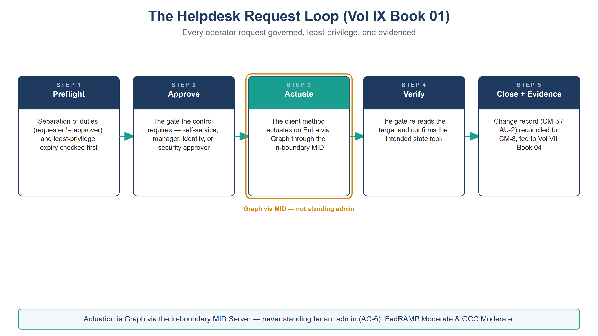

:::: {.content-hidden unless-profile="ssa"}
::: {.fouo-banner}
INTERNAL — NOT FOR PUBLIC DISTRIBUTION
:::
::::

::: {.aan-warning}
## Draft Proposal — Subject to Review
Developed by the **CSI Team (Cloud Services Infrastructure)**; not yet reviewed or approved by the  CIO Office, OIS, or leadership. **Date Code:** 2026-07-12 15:00 ET
:::

::: {.aan-important}
**Series Context** — Volume IX Book 01. The highest-volume day-2 surface: the everyday Entra / M365 / Azure help-desk requests — joiner/mover/leaver, credential resets, group and license grants, guest invites. This book turns each into a typed, control-mapped ServiceNow catalog item actuated through the in-boundary MID, so routine operations produce compliance evidence instead of eroding it.
:::

# What This Document Addresses

A service desk performs hundreds of identity changes a week. Each one — a new account, a password reset, a group add — is a change to an identity-attributed surface that a control governs (AC-2, IA-5, AC-6). Performed as a portal click by a standing-admin operator, it is ungoverned, unevidenced, and least-privilege only by hope. Multiplied across a week, that is the largest continuous source of control erosion in the estate.

This book expresses those requests as governed catalog items. The machine-readable binding lives in **`servicenow-day2/helpdesk-control-map.json`** — each item mapped to its control, approval gate, KSI, and evidence slot, a projection of the compliance spine and CI-checked against it.

# The Catalog

Ten items across three families. Each is a request, not a click; each carries the approval gate its control requires.

| Catalog item | Control | Approval gate | Note |
|---|---|---|---|
| New account (Joiner) | AC-2 | manager + identity | Provision from the HRIT SSOT (Vol I Book 04); least-privilege baseline |
| Role/scope change (Mover) | AC-6 | manager + identity | Access review on change; remove stale entitlements |
| De-provision (Leaver) | AC-2 | manager + identity | Evidenced: disable, revoke sessions, reassign owned objects |
| Password reset | IA-5 | self-service / service-desk | SSPR where policy allows; else identity-verified gate |
| MFA-method reset | IA-5 | service-desk + verify | Identity-proofing required; log + alert (social-engineering target) |
| Account unlock | IA-5 | self-service / service-desk | Repeated unlocks are a Vol VI Book 03 detection signal |
| Group membership | AC-6 | owner + approver | Time-bound where elevated; access-review linked |
| License assignment | AC-2 | manager | Group-based licensing preferred |
| Conditional-Access exception | AC-3 | security approver | **Reuse Vol VII Book 02** — mandatory expiry + review |
| Guest / B2B invite | AC-2 | sponsor + security | Sponsor + expiry |

::: {.aan-note}
**Reuse, don't reinvent.** The Conditional-Access exception item is the same pattern Vol VII Book 02 already models (mandatory break-glass exclusion, expiry, access review). The help-desk catalog *invokes* it; it does not fork a second CA-exception path.
:::

# The Request Loop

{#fig-vol9b01-loop fig-alt="A house-style five-step pipeline titled The Helpdesk Request Loop (Vol IX Book 01), subtitle 'Every operator request governed, least-privilege, and evidenced', on a white background. Five navy-headed cards joined left to right by teal arrows: Step 1 Preflight — separation of duties (requester not equal to approver) and least-privilege expiry checked first; Step 2 Approve — the gate the control requires, self-service, manager, identity, or security approver; Step 3 Actuate, drawn with a teal header and an amber ring labeled 'Graph via MID — not standing admin' — the client method actuates on Entra via Graph through the in-boundary MID; Step 4 Verify — the gate re-reads the target and confirms the intended state took; Step 5 Close plus Evidence — a change record (CM-3 / AU-2) reconciled to CM-8 and fed to Vol VII Book 04. A footer states actuation is Graph via the in-boundary MID Server, never standing tenant admin (AC-6), at FedRAMP Moderate and GCC Moderate. White background. Authored house-style diagram." width="100%"}

Every item runs the same governed loop — the day-2 analogue of the Vol VII compliance loop:

1. **Request** — a typed catalog item against the reconciled identity CI, with the requester, target, and justification.
2. **Approve** — the gate the control requires (self-service, manager, identity, owner, or security approver — per the control map).
3. **Actuate** — Microsoft Graph **through the in-boundary MID Server**; the connector holds scoped, logged, individually-approved write — **never standing tenant admin** (AC-6).
4. **Evidence** — the request, approval, and Graph result become a change record (CM-3 / AU-2) reconciled to the CM-8 CMDB, feeding Vol VII Book 04 attestation.

::: {.aan-important}
**The leaver is the one that fails audits.** De-provisioning is an *evidenced obligation*, not a courtesy: disable the account, revoke active sessions and refresh tokens, and reassign owned objects (groups, app ownerships, mailboxes). A leaver "done" with no evidence trail is an orphaned-credential finding waiting to happen — the exact gap the audited catalog closes.
:::

# Closure Necessity

::: {.aan-tip}
## Closure Necessity — the help desk is a control surface, not a convenience
Volumes I and VII establish that verified identity, phishing-resistant auth, and least privilege are the mechanisms. This book makes the *routine exercise* of those mechanisms governed and evidenced. Without it, AC-2, IA-5, and AC-6 are eroded a hundred small clicks at a time — each unlogged, each least-privilege by hope. The catalog does not add a new control; it stops the highest-frequency operations from quietly dismantling the ones already claimed.
:::

# NIST SP 800-53 Rev 5 Control Closure — Authorities Closed Here

Generated from the compliance spine (`orgcomp-compliance-spine.yml`) by `render_authorities_table.py`; not hand-edited here.

<!-- authorities:book-day2-helpdesk — generated from orgcomp-compliance-spine.yml; do not hand-edit -->
| Control | Title | Closing mechanism (function, not product) | Accreditation gate | Authority drivers | Evidence slot | FedRAMP 20x KSI | Tool-attestable? |
|---|---|---|---|---|---|---|---|
| AC-2 | Account Management | Joiner/mover/leaver, guest invite, and license/group requests as governed ServiceNow catalog items over Entra (Graph via in-boundary MID); leaver de-provisioning evidenced | FedRAMP Moderate | NIST SP 800-53 Rev 5; OMB M-22-09 | Identity | KSI-IAM | No |
| AC-3 | Access Enforcement | Conditional Access exceptions issued only as governed catalog items with a mandatory expiry and a scheduled access review — an exception weakens a blocking enforcement control and is treated as such, never granted standing | FedRAMP Moderate | NIST SP 800-53 Rev 5; OMB M-22-09 | Identity | KSI-IAM | No |
| AC-6 | Least Privilege | Group and privileged-access requests time-bound and access-reviewed; no standing elevation granted by a helpdesk click | FedRAMP Moderate | NIST SP 800-53 Rev 5; OMB M-22-09 | Identity | KSI-IAM | No |
| IA-5 | Authenticator Management | Password reset, MFA-method reset, and account unlock as identity-verified catalog items (self-service via SSPR where policy allows; else approver-gated) | FedRAMP Moderate | NIST SP 800-53 Rev 5 | Identity | KSI-IAM | No |

: Authorities Closed Here — Helpdesk & ITSM Catalog (Entra · M365 · Azure) († = Closure-Necessity anchor: no alternate closure path) {.striped .hover}

# Honest Limits

- Self-service items (SSPR, unlock) are only as strong as the tenant's authentication-method policy; a weak SSPR policy is a Vol VI Book 02 configuration concern, not a catalog fix.
- The catalog governs the *request*; a standing global administrator can still act out of band — Vol VII Book 02 detections and access reviews catch that.
- Substituting the ITSM platform changes the catalog and connector syntax; the request→approve→actuate-via-MID→evidence discipline is invariant.

# Cross-References

- **`servicenow-day2/helpdesk-control-map.json`** — the machine-readable catalog → control binding this book documents.
- **Vol I Book 04 (HRIT Identity SSOT)** — the identity source of truth the JML items provision from.
- **Vol VII Book 02** — the Conditional-Access exception pattern this catalog reuses; **Vol VII Book 04** — where the audited actions become attestation.
- **Vol IX Book 03** — app-registration governance (service-principal identity lifecycle, the machine analogue of JML).

# Provenance

Draft. ServiceNow, Microsoft Graph, and Entra are deployed examples; the request→approve→actuate-native→evidence discipline is the invariant. Vendor claims cite vendor documentation. The figure above is authored as committed house-style SVG, rendered to PNG at 3× for crisp `.docx` zoom.
