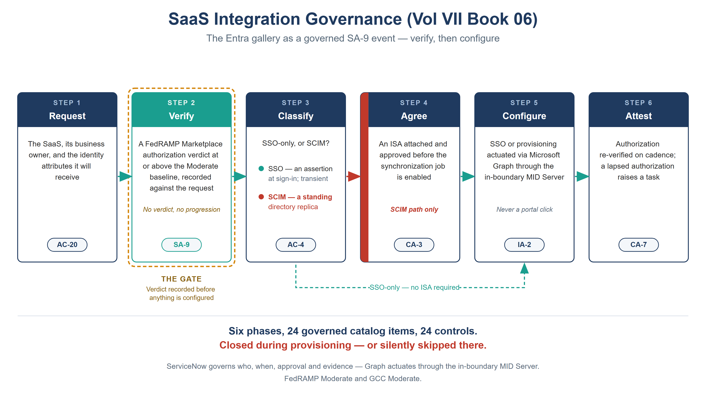

:::: {.content-hidden unless-profile="ssa"}
::: {.fouo-banner}
INTERNAL — NOT FOR PUBLIC DISTRIBUTION
:::
::::

::: {.aan-warning}
## Draft Proposal — Subject to Review
Developed by the **CSI Team (Cloud Services Infrastructure)**; not yet reviewed or approved by the  CIO Office, OIS, or leadership. **Date Code:** 2026-07-21 14:46 ET
:::

::: {.aan-important}
**Series Context** — Volume IX Book 05. Vol VII Books 02 and 03 automate control compliance *on* the M365 and Azure surfaces. This book implements the governed catalog for the moment an administrator connects a **third-party SaaS** to those surfaces. It inherits the coordination doctrine and the boundary treatment from Vol VII Book 00 without restating them, reuses the Vol VII Book 05 scoped-app pattern, and ships as **Lane F** of this volume's day-2 kit (`servicenow-day2/saas-control-map.json`) rather than forking a second app.
:::

# What This Document Addresses

An administrator opens the Entra admin center, searches the application gallery, follows a vendor tutorial, and configures SAML SSO and SCIM provisioning to a third-party SaaS. Fifteen minutes. A continuous outbound replica of the agency directory — names, work emails, employee IDs, manager chains, organizational structure — now lives in that vendor's cloud and stays synced.

The instinct is to read that as a gap: one missing gate, SA-9, to be added. That reading is too small.

**Onboarding a SaaS is the single densest control-closure opportunity in the identity estate.** SCIM provisioning *is* automated account management. The leaver event reaching the vendor *is* account disablement. The signing certificate *is* an authenticator with a lifecycle. The service principal *is* a component to inventory. The assignment *is* access enforcement. Every one of those controls is either **closed during provisioning, or silently skipped there** — and skipped is the default, because the vendor's path has no place to put them.

This book is the implementation that closes them. It is not an argument that a gate is missing; it is the catalog, the control map, the actuation surface, and the tests.

{#fig-vol7b06-gate fig-alt="A house-style six-stage pipeline (a simplified lifecycle view of the seven-phase catalog below) titled SaaS Integration Governance (Vol IX Book 05), subtitle 'The Entra gallery as a governed SA-9 event — verify, then configure', on a white background. Six cards joined left to right by teal arrows, navy-headed except where noted. Phase 1 Request — the SaaS, its business owner, and the identity attributes it will receive (AC-20). Phase 2 Verify, drawn with a teal header and a prominent amber ring labeled 'the gate — verdict recorded before anything is configured' — a FedRAMP Marketplace authorization verdict at or above the Moderate baseline, recorded against the request (SA-9). Phase 3 Classify — SSO-only or SCIM, drawn as a fork with a teal dot for 'SSO, an assertion at sign-in, transient' and a red dot for 'SCIM, a standing directory replica' (AC-4). Phase 4 Agree — an ISA attached and approved before the synchronization job is enabled, shown with a red left edge marking it as the SCIM path only (CA-3). Phase 5 Configure — SSO or provisioning actuated via Microsoft Graph through the in-boundary MID Server, never a portal click (IA-2). Phase 6 Attest — authorization re-verified on cadence; a lapsed authorization raises a task (CA-7). A dashed teal bypass runs beneath from Phase 3 to Phase 5 labelled 'SSO-only — no ISA required'. A footer reads: Six lifecycle stages distilling the seven-phase catalog, 24 governed catalog items, 24 controls — operationalized during provisioning, or silently skipped there. White background, navy and teal ink with amber and red accents only. Authored house-style diagram." width="100%"}

::: {.aan-note}
## Why the gate has to be ours — the motivating measurement, briefly

FedRAMP Moderate for M365 means **GCC Moderate**, which is paired with **Commercial Entra ID on Azure Commercial infrastructure** (only GCC High and DoD sit on Azure Government). So the **full commercial gallery is available**: thousands of apps, full SSO, full provisioning connectors, nothing blocked and nothing marked.

The complete vendor tutorial corpus — **12,940 pages, 1,295 tutorials** — was analyzed term-by-term. It carries **50,172** mentions of single sign-on and **zero** of FedRAMP, authorization boundary, interconnection, ISA, NIST 800-53, CUI, or impact level. The only federal-adjacent sentence, in 18 tutorials (1.4%), is availability boilerplate saying the app is *more* obtainable. Gallery risk scores name SOC 2, ISO 27001, HIPAA and PCI — not FedRAMP — and sit behind additional licensing.

**This is not a criticism of the vendor's documentation.** The tutorials are accurate and correctly scoped to their purpose: making an integration work. Authorization is a customer responsibility and does not travel across a federation trust. The corpus is silent on the boundary because the boundary is not its subject. The consequence is only this: **an administrator following the vendor's own guidance end-to-end never encounters the authorization question** — so the control surface is entirely ours, and there is no technical backstop to inherit. The full analysis, and an independent assessment reaching the same conclusion, are in the series critique record.
:::

# The Implementation — Lane F of the Day-2 Scoped App

This book ships as a **lane in the existing Volume IX day-2 app**, not a new one.

| Decision | Rationale |
|---|---|
| **Lane F in `servicenow-day2`**, not a separate scoped app | `validate_day2_control_maps.py` globs `servicenow-day2/*-control-map.json` — the lane is CI-validated from its first commit with zero wiring |
| Reuse `EntraHelpdeskClient` / `EntraHelpdeskGate` | The Graph-via-MID plumbing and the SoD/least-privilege pre-flight already exist. SaaS provisioning needs new **methods**, not a new app, Flow, ATF harness and update set |
| Same catalog grammar as Lane E | Lane E (App Registration) is request → consent → credential → rotate → attest. Lane F is the same shape for the federation trust — one control map schema, one approval model |

: Why the implementation lands here {.striped}

::: {.aan-important}
**Placement, resolved.** This book lives in Volume IX (Day-2 Operations), alongside the `servicenow-day2` app whose Lane F it implements — correcting the earlier Volume VII placement that put the book a volume away from its own implementation. Forking the scoped app to satisfy a volume label would have duplicated Script Includes, Flow, ATF and update set for one lane, which is exactly what Vol VII Book 05 warns against; keeping the lane in the shared day-2 app, with the book beside it, is the right call.

**Related debt — since paid.** When this book was first drafted, Volume VII registered no kit and the `x_fed_compliance` app Vol VII Book 05 describes existed only as prose. As of 2026-07-14 the DRAFT skeleton ships at `x_fed_compliance/` and is registered in the spine's `kits:` section (`kit-fed-compliance`), so the distribution build bundles it and its control map is CI-validated. Lane F's placement decision stands on its own merits (reuse of the day-2 plumbing), not on the kit's absence.
:::

## The record model

Lane F adds one data file and a set of methods. Everything else it inherits.

| Path (in the kit) | Record / artifact | Status |
|---|---|---|
| [`servicenow-day2/saas-control-map.json`](servicenow-day2/saas-control-map.json) | app data (CI-checked) | **New** — Lane F bindings: 24 catalog items → (control, task type, approval, actuation, KSI, slot) |
| `script-includes/EntraHelpdeskClient.js` | `sys_script_include` | **Extend** — add the Graph surface below |
| `script-includes/EntraHelpdeskGate.js` | `sys_script_include` | **Reuse** — SoD + least-privilege pre-flight, unchanged |
| `flow/flow-blueprint.md` | Flow Designer blueprint | **Extend** — the Governed Day-2 Request flow gains the verify→classify→agree branch |
| `atf/` | ATF test spec | **Extend** — Lane F negative cases below |
| `update-set/` | update set | **Reuse** — the lane assembles into the same importable XML |

: Lane F record model — one new data file, four extensions, one reuse {.striped}

## The Graph surface Lane F needs

`EntraHelpdeskClient` today carries `createUser`, `resetPassword`, `resetMfaMethod`, `assignLicense`, `inviteGuest` — the human JML surface. Lane F adds the integration surface, all routed through the in-boundary MID Server:

| Method | Graph operation | Serves |
|---|---|---|
| `instantiateGalleryApp(templateId, displayName)` | `POST /applicationTemplates/{id}/instantiate` | `saas.register.ci` |
| `getApplicationTemplate(templateId)` | `GET /applicationTemplates/{id}` | `saas.verify.interfaces` (publisher, categories, supported SSO modes) |
| `setSsoMode(spId, mode)` | `PATCH /servicePrincipals/{id}` (`preferredSingleSignOnMode`) | `saas.sso.configure` |
| `setSigningCertificate(spId, cert)` | `POST /servicePrincipals/{id}/addTokenSigningCertificate` | `saas.credential.issue`, `saas.pki` |
| `createSyncJob(spId, templateId)` | `POST /servicePrincipals/{id}/synchronization/jobs` | `saas.scim.enable` |
| `setSyncSecrets(spId, secrets)` | `PUT /servicePrincipals/{id}/synchronization/secrets` | `saas.credential.issue` |
| `getSyncStatus(spId, jobId)` | `GET /servicePrincipals/{id}/synchronization/jobs/{jobId}` | `saas.attest`, drift detection |
| `assignAppRole(spId, principalId, roleId)` | `POST /servicePrincipals/{id}/appRoleAssignedTo` | `saas.assign`, `saas.roles` |
| `disableSyncJob(spId, jobId)` / `deleteServicePrincipal(spId)` | `DELETE …/jobs/{jobId}`, `DELETE /servicePrincipals/{id}` | `saas.offboard` |

: The Graph surface Lane F adds — MID-routed, scoped, individually approved {.striped .hover}

::: {.aan-warning}
**Least-privilege note.** These are write operations on the application layer. The MID-routed service identity holds `Application.ReadWrite.OwnedBy` and `Synchronization.ReadWrite.All` — **not** `Application.ReadWrite.All` — so the app can only act on integrations it owns. Standing tenant admin is never used, per the Book 00 rule. `EntraHelpdeskGate` refuses any Lane F actuation whose change record is unapproved or whose approver equals the requester.
:::

# Federation Closes the Controls — SSO and SCIM Against 800-53 {#federation-controls}

The Entra SaaS app-integration surface (the per-app SSO and provisioning
configuration guides) is not just convenience plumbing — configured under
this book's gate, it is the *technical* closure mechanism for a specific
set of NIST SP 800-53 Rev 5 controls:

- **AC-2 (Account Management)** — SCIM provisioning centralizes account
  creation *and removal* for every federated app: a joiner is provisioned,
  and a leaver is deprovisioned, in the connected SaaS automatically. The
  gap SCIM exists to close is the one audits find first — accounts in a
  SaaS app that outlive the person.
- **AC-3 / AC-6 (Enforcement, Least Privilege)** — with SSO, access to
  each application is an assignment decision in the directory (user/group
  assignment + Conditional Access), not a per-app credential; the
  least-privilege envelope is administered in one place.
- **IA-2 (Identification and Authentication)** — federation means every
  SaaS sign-in is the *agency's* authentication event: phishing-resistant
  MFA and session policy apply universally, including to apps that could
  never enforce them natively.
- **SC-8 (Transmission Confidentiality)** — SAML 2.0 / OpenID Connect
  federation rides TLS with signed assertions; no password ever transits
  to the SaaS side at all.
- **AU groundwork** — every federated sign-in and provisioning action
  lands in the central sign-in and audit logs, feeding the evidence
  fabric; a directly-credentialed app logs to nowhere the agency reads.

**SCIM is what makes identity MACD-R propagate.** Every Move, Add,
Change, Deletion, and Reset executed against the directory (Vol IX
Book 01's five-verb matrix) rides SCIM to every federated application —
one authorized operation, one closure probe, the whole connected estate
converged. The converse is the finding: **an integrated app *without*
SCIM provisioning is a manual-closure island** — its joiners and leavers
are hand-worked tickets whose closures carry no probe, exactly the
class of unverifiable closure the Closure Provenance Doctrine (Vol 0
Book 00) refuses to count. The catalog therefore treats "SSO without
provisioning" as a degraded state that Phase 4 must either remediate or
record as an accepted, visible exception.

::: {.aan-note}
**Configuration is not compliance.** The federation mechanics above close
technical controls; they do not write the policies (AC-1, IA-1), sign the
external-system agreements, or run the access reviews that 800-53 demands
alongside them. This book's own gate closes the external-system direction
(AC-20, SA-9 — the authorization verdict *before* configuration), and the
review-and-certification layer is Vol IX Book 06's subject. Chapter and
verse for the split lives in the Authorities table below.
:::

<!-- catalog:begin — generated by render_book_catalog.py from servicenow-day2/saas-control-map.json; do not hand-edit -->

# The Catalog — 24 Governed Items, 24 Controls

The ordering is the control. **The authorization verdict is recorded before anything is configured**, because a verdict collected afterward is a rationalization, not a gate.

Every row below is generated from `servicenow-day2/saas-control-map.json`, which the CI check validates against the spine — the book cannot drift from the map it describes.

## Phase 1 — Intake and authorization

Nothing is configured here. This phase answers *may this integration happen at all*, and records the answer before anyone can act on the opposite.

| Catalog item | What happens | Approval | Control |
|---|---|---|---|
| `saas.request` | Records the SaaS, its business owner, the business need, and **the specific identity attributes it will receive**. That last field is what makes classification possible; without it, exposure gets reasoned about from vendor marketing | owner | **AC-20** |
| `saas.verify.authorization` | **The gate.** A FedRAMP Marketplace verdict at or above the Moderate baseline, recorded against the request. No verdict, no progression | security approver | **SA-9 †** |
| `saas.verify.interfaces` | The CSO's SSO/SCIM endpoints, ports and protocols recorded; the NGFW allow-list and DDI records derive from this, so an undocumented endpoint is drift | security approver | **SA-9(2)** |
| `saas.classify` | Assertion-only or standing replica? Derived from the attributes captured at request, not judged ad hoc | automated | **AC-4** |
| `saas.isa` | SCIM path only — an ISA attached and approved **before** the sync job is enabled | owner + security | **CA-3** |
| `saas.approve` | Requester may never approve. Privileged scope or any SCIM path requires a security approver distinct from the owner | security approver | **AC-5** |

: Phase 1 — closes **SA-9** †; operationalizes **AC-20**, **SA-9(2)**, **AC-4**, **CA-3**, **AC-5** {.striped .hover}

## Phase 2 — Register and configure

The integration becomes a governed object — a reconciled CI and an approved change — before it becomes a federation trust.

| Catalog item | What happens | Approval | Control |
|---|---|---|---|
| `saas.register.ci` | The service principal, its gallery template id, SSO mode and sync-job state become a CMDB CI **reconciled to the authoritative IPAM/DDI asset identity** (the CM-8 join key, Book 01). An integration absent from the register is drift | automated | **CM-8** |
| `saas.change` | Every compliance-affecting change carries an approved, reviewable change record before actuation | owner + security | **CM-3** |
| `saas.sso.configure` | Federation actuated via Graph through the MID Server — never a portal click. Records that SaaS-local credentials are disabled or exception-approved: *"SSO available" is not "SSO required"* | owner | **IA-2** |
| `saas.identifier` | One enterprise identifier per person from the HR-derived worker record (Book 04). The vendor never mints its own identifier for an organizational user | owner | **IA-4** |

: Phase 2 — operationalizes **CM-8**, **CM-3**, **IA-2**, **IA-4** {.striped .hover}

## Phase 3 — Credentials

The SAML signing certificate and the SCIM bearer token are authenticators with lifecycles, not setup steps. This is Lane E's rule applied to the federation trust.

| Catalog item | What happens | Approval | Control |
|---|---|---|---|
| `saas.credential.issue` | Certificate-based where the SaaS supports it; a secret with a **mandatory expiry** where it does not. No long-lived secret in configuration | owner | **IA-5(2)** |
| `saas.credential.rotate` | Rotation is raised automatically ahead of expiry and approved by the integration owner, with the SaaS-side update tracked as a change. The trust never depends on a human *remembering* a three-year certificate | owner | **IA-5** |
| `saas.pki` | Issuance, publication to the relying party, rollover and revocation under the agency certificate policy — not the IdP's default self-signed certificate accepted at setup | owner | **SC-17** |

: Phase 3 — operationalizes **IA-5(2)**, **IA-5**, **SC-17** {.striped .hover}

## Phase 4 — Provision and authorize

Only now does directory data move, and only under an approved scoping filter and attribute mapping.

| Catalog item | What happens | Approval | Control |
|---|---|---|---|
| `saas.scim.enable` | Creating the sync job **is** automated account management. Blocked until `saas.isa` is approved. Scoping filter and attribute mapping ride in the change record, so *which attributes leave* is reviewable, not discovered later | owner + security | **AC-2(1)** |
| `saas.assign` | User/group assignment required — never "available to all users". The assignment is the enforcement point the agency still controls once the trust exists | owner | **AC-3** |
| `saas.roles` | App roles mapped from the authoritative org model, not a vendor default. Administrative roles inside the SaaS require a security approver | security approver | **AC-6** |

: Phase 4 — operationalizes **AC-2(1)**, **AC-3**, **AC-6** {.striped .hover}

## Phase 5 — Lifecycle (joiner/mover/leaver)

The HR system owns the fact (Book 04); this lane is where the fact reaches the SaaS.

| Catalog item | What happens | Approval | Control |
|---|---|---|---|
| `saas.leaver` | The separation event drives disable/remove in the SaaS **on the effective date**, evidenced per step. Separation-to-revocation interval inside the SaaS becomes a ConMon metric | manager + identity | **AC-2(3)** |
| `saas.mover` | A transfer re-derives entitlements from the new assignment and raises an access review of the residual | owner | **PS-5** |

: Phase 5 — operationalizes **AC-2(3)**, **PS-5** {.striped .hover}

::: {.aan-important}
**This phase is why the others matter.** Without it the directory is clean and the vendor still holds a live account — the precise failure an assessor probes, and the one an ungoverned portal-click integration guarantees. Separation is not network-observable: absence of logins is indistinguishable from leave. Only an event-driven feed from the owner of the fact starts the revocation on time.
:::

## Phase 6 — Evidence

Collection is not review. Both are catalog items, because only an owned task proves somebody looked.

| Catalog item | What happens | Approval | Control |
|---|---|---|---|
| `saas.account.audit` | Account create/modify/enable/disable/remove emit audit records automatically, correlated to the originating HR or catalog event | automated | **AC-2(4)** |
| `saas.logs` | Provisioning and sign-in telemetry routed to the SIEM **at onboarding**, not retrofitted after an incident | automated | **AU-2** |
| `saas.audit.review` | A named reviewer, a cadence, a closure record. Collection is AU-2; evidence that somebody looked is AU-6 | security approver | **AU-6** |

: Phase 6 — operationalizes **AC-2(4)**, **AU-2**, **AU-6** {.striped .hover}

::: {.aan-warning}
**Boundary caveat on `saas.logs`.** This collects what the tenant can see; it does not conjure what the boundary withholds. GCC-Moderate telemetry limits bound what reaches the SIEM in the first place — see the SCuBA boundary-limitations analysis. A ConMon claim built on this must state that limit rather than imply completeness.
:::

## Phase 7 — Attest and exit

Authorization is not a one-time fact, and the step most often skipped is the last one.

| Catalog item | What happens | Approval | Control |
|---|---|---|---|
| `saas.attest` | Cadence re-verification of the marketplace verdict, the owner and the attribute scope. A lapsed authorization or orphaned integration raises a task; feeds Book 04 attestation and the KSI pipeline | owner + security | **CA-7** |
| `saas.retention` | Which attributes flow, from which authoritative source, and the vendor's retention/deletion commitments — recorded where the data originates, because lineage cannot be reconstructed from the vendor's copy at audit time | owner | **SI-12** |
| `saas.offboard` | Disable the sync job, remove assignments, revoke the trust and credential, confirm vendor-side deletion against the retention record, retire the CI | owner + security | **AC-2** |

: Phase 7 — operationalizes **CA-7**, **SI-12**, **AC-2** {.striped .hover}

::: {.aan-note}
**Authorization is not a one-time fact.** A CSO can lose its authorization; an integration can outlive its business need. `saas.offboard` is the step most often skipped — an integration nobody uses still holds a live directory replica and a valid signing certificate.
:::

<!-- catalog:end -->

# The Control Map — Data, Checked Against the Spine

`servicenow-day2/saas-control-map.json` binds each catalog item to `(control, task_type, approval, actuation, ksi, slot)`. It is data, not prose, and `validate_day2_control_maps.py` enforces on every item:

- `boundary == "gcc-moderate"` — the series scope parameter, mechanically;
- required fields present;
- every `slot` is a real evidence slot in `orgcomp-compliance-spine.yml`;
- every `ksi` is a real theme in the **in-repo FedRAMP CR26 OSCAL catalog** — not a plausible-looking invention;
- every `control` parses as a NIST SP 800-53 control id.

The spine's closure rows for this book are **derived from that map**, so the map and the spine cannot disagree at birth: control, KSI and slot are copied, and only the mechanism prose is authored.

::: {.aan-tip}
## Why the lane is validated for free
`validate_day2_control_maps.py` globs `servicenow-day2/*-control-map.json`. Adding Lane F required no wiring — the existing gate picked it up and reported `6 day-2 control maps, 55 catalog items, all consistent with the spine`. That is the concrete payoff of reusing the day-2 app instead of forking one.
:::

# Tests — What Would Falsify This

ATF cases run against `test_mode`, extending the Lane E negative suite. A catalog that only tests the happy path proves nothing:

| Test | Asserts |
|---|---|
| `configure_without_verdict_is_refused` | `saas.sso.configure` and `saas.scim.enable` refuse when no `saas.verify.authorization` verdict is recorded. **The ordering rule, mechanically.** |
| `scim_without_isa_is_refused` | `saas.scim.enable` refuses when `saas.classify` = SCIM and no approved `saas.isa` exists |
| `sso_only_does_not_require_isa` | The SSO-only path completes without an ISA — over-gating the cheap path is how a control gets routed around |
| `self_approval_is_refused` | `saas.approve` refuses when approver == requester |
| `standing_admin_is_refused` | Lane F actuation refuses if the service identity holds `Application.ReadWrite.All` |
| `unreconciled_integration_is_flagged` | An SP present in the tenant with no CI raises drift (the un-governed portal click) |
| `lapsed_authorization_raises_task` | `saas.attest` raises a task when the recorded verdict ages past its cadence |
| `offboard_revokes_trust_and_credential` | `saas.offboard` leaves no enabled sync job, no assignment, no valid signing certificate |

: Lane F ATF cases — the negatives are the point {.striped .hover}

# Closure Necessity

::: {.aan-tip}
## Closure Necessity — consent restriction governs *who* approves, not *what they approve*
The strongest alternative a reviewer will propose is SCuBA's application-consent baseline: restrict who may register applications and who may consent (MS.AAD.5.1v1, 5.2v1, 5.3v1). Those are good controls and this series endorses them — but they do not close SA-9.

Consent restriction governs **who** approves an integration. It says nothing about **whether the service on the far end is authorized to hold federal data**. A tenant fully compliant with admin-only consent, admin consent workflow configured, still has an administrator — correctly, within policy, through every approved gate — consenting to a CSO with no FedRAMP authorization. Every check passes. The boundary still leaks.

That is a *scope* gap, not a configuration gap, and no amount of configuration hardening reaches it. Only an authorization verdict recorded against the integration, before configuration, closes SA-9.
:::

::: {.aan-important}
**What the other 23 closures are, and are not.** Per the Vol 0 Book 02 convention, Volume VII/IX rows record where a control is **coordinated, evidenced and operated** — not a second independent closure claim. The architecture volumes own the primary closure: identity lifecycle in Vol I Book 04, naming and the CM-8 join key in Vol I Book 01, certificates in Vol I Book 03. This lane is the workflow plane where each is *made operational and evidenced during provisioning*. SA-9 is the exception — it is closed here first, because no other book in the series carries it.
:::

# NIST SP 800-53 Rev 5 Control Closure — Authorities Closed Here

Generated from the compliance spine (`orgcomp-compliance-spine.yml`); not hand-edited here.

<!-- authorities:book-sn-saas — generated from orgcomp-compliance-spine.yml; do not hand-edit -->
| Control | Title | Closing mechanism (function, not product) | Accreditation gate | Authority drivers | Evidence slot | FedRAMP 20x KSI | Tool-attestable? |
|---|---|---|---|---|---|---|---|
| CM-8 | System Component Inventory | The service principal, its gallery template id, SSO mode and sync-job state are registered as a CMDB CI reconciled to the authoritative IPAM/DDI asset identity (CM-8 join key); an integration absent from the register is drift | FedRAMP Moderate | NIST SP 800-53 Rev 5; CISA BOD 23-01 | Network | KSI-PIY | No |
| AC-2 | Account Management | Offboarding disables the sync job, removes assignments, revokes the federation trust and credential, confirms vendor-side deletion against the retention record and retires the CI — the step whose omission leaves a live replica behind | FedRAMP Moderate | NIST SP 800-53 Rev 5 | Identity | KSI-IAM | No |
| AC-2(1) | Account Management \| Automated System Account Management | Enabling the synchronization job is automated account management: accounts in the SaaS are created, updated and removed from the authoritative directory, with scoping filter and attribute mapping carried in the approved change record | FedRAMP Moderate | NIST SP 800-53 Rev 5 | Identity | KSI-IAM | No |
| AC-2(3) | Account Management \| Disable Accounts | The HR separation event drives disable/remove in the SaaS on the effective date with per-step evidence; separation-to-revocation interval inside the SaaS becomes a continuous-monitoring metric | FedRAMP Moderate | NIST SP 800-53 Rev 5; OMB M-22-09 | Identity | KSI-IAM | No |
| AC-20 | Use of External Systems | The governed request records which organizational identity data leaves the boundary, to which external system, and under which authorization — closing the outbound direction that inbound-scoped external-access controls do not reach | FedRAMP Moderate | NIST SP 800-53 Rev 5; OMB M-22-09 | Identity | KSI-IAM | No |
| AC-3 | Access Enforcement | User/group assignment is required on the enterprise application — never 'available to all users' — making the assignment the enforcement point the agency still controls once the trust exists | FedRAMP Moderate | NIST SP 800-53 Rev 5 | Identity | KSI-IAM | No |
| AC-4 | Information Flow Enforcement | Each integration is classified from the attributes captured at request as assertion-only (transient) or SCIM (a standing directory replica), determining what organizational data may cross and whether an interconnection agreement applies | FedRAMP Moderate | NIST SP 800-53 Rev 5 | Data | KSI-IAM | No |
| AC-5 | Separation of Duties | Requester may never approve; privileged scopes and any SCIM path require a security approver distinct from the business owner, enforced pre-flight by the gate rather than by convention | FedRAMP Moderate | NIST SP 800-53 Rev 5 | Identity | KSI-IAM | No |
| AC-6 | Least Privilege | App roles are mapped from the authoritative org/assignment model rather than a vendor default; any role carrying administrative authority inside the SaaS requires a security approver | FedRAMP Moderate | NIST SP 800-53 Rev 5 | Identity | KSI-IAM | No |
| IA-2 | Identification and Authentication (Organizational Users) | Federation is configured via Graph through the in-boundary MID Server and the catalog records that SaaS-local credentials are disabled or exception-approved — enforcing 'SSO required', not merely 'SSO available' | FedRAMP Moderate | NIST SP 800-53 Rev 5; OMB M-22-09 | Identity | KSI-IAM | No |
| IA-4 | Identifier Management | One enterprise identifier per person, sourced from the HR-derived worker record, is carried into the SaaS; the vendor never mints its own identifier for an organizational user, preventing per-app identity sprawl | FedRAMP Moderate | NIST SP 800-53 Rev 5 | Identity | KSI-IAM | No |
| IA-5 | Authenticator Management | Federation credentials are rotated automatically ahead of expiry with the SaaS-side update tracked as a change; the trust never depends on a human remembering a three-year certificate | FedRAMP Moderate | NIST SP 800-53 Rev 5 | Identity | KSI-IAM | No |
| IA-5(2) | Authenticator Management \| Public Key-Based Authentication | The SAML token-signing certificate and SCIM bearer token are issued as authenticators with mandatory expiry — certificate-based where the SaaS supports it — never as a long-lived secret pasted into configuration | FedRAMP Moderate | NIST SP 800-53 Rev 5; EO 14028 | Identity | KSI-IAM | No |
| PS-5 | Personnel Transfer | A mover event re-derives SaaS entitlements from the new assignment and raises an access review of the residual — the transfer is only visible to the SaaS because the HR event carries it | FedRAMP Moderate | NIST SP 800-53 Rev 5 | Identity | KSI-IAM | No |
| SI-12 | Information Management and Retention | Which identity attributes flow to the SaaS, from which authoritative source, and the vendor's retention and deletion commitments are recorded where the data originates — lineage cannot be reconstructed from the vendor's copy at audit time | FedRAMP Moderate | NIST SP 800-53 Rev 5; Privacy Act | Data | KSI-PIY | No |
| SA-9(2) | External System Services \| Identification of Functions, Ports, Protocols, and Services | The CSO declares its SSO/SCIM endpoints, ports and protocols as a catalog record; the NGFW allow-list and DDI records derive from that record, so an undocumented endpoint is detectable as drift rather than invisible | FedRAMP Moderate | NIST SP 800-53 Rev 5 | Network | KSI-SCR | No |
| AC-2(4) | Account Management \| Automated Audit Actions | Creation, modification, enable/disable and removal of SaaS accounts emit audit records automatically, correlated to the originating HR or catalog event | FedRAMP Moderate | NIST SP 800-53 Rev 5 | Telemetry | KSI-MLA | No |
| AU-2 | Event Logging | Provisioning and application sign-in telemetry for the integration are routed to the agency SIEM at onboarding rather than retrofitted after an incident — bounded by what the GCC-Moderate boundary permits the tenant to see | FedRAMP Moderate | NIST SP 800-53 Rev 5; CISA CDM | Telemetry | KSI-MLA | No |
| AU-6 | Audit Record Review, Analysis, and Reporting | A named reviewer, a cadence and a closure record over the integration's audit trail — collection is AU-2; evidence that somebody looked is AU-6, and only an owned task produces it | FedRAMP Moderate | NIST SP 800-53 Rev 5 | Telemetry | KSI-MLA | No |
| CA-3 | Information Exchange | SCIM-provisioned integrations are classified as interconnections and gated on an approved ISA before the synchronization job is enabled; SSO-only integrations, which pass assertions without a standing replica, are recorded but do not require one | FedRAMP Moderate | NIST SP 800-53 Rev 5; OMB Circular A-130 | Security / supply chain | KSI-PIY | No |
| CA-7 | Continuous Monitoring | Cadence re-verification of the marketplace verdict, the owner and the attribute scope; a lapsed authorization or orphaned integration raises a task feeding the attestation and KSI evidence pipeline | FedRAMP Moderate | NIST SP 800-53 Rev 5; NIST SP 800-137; FedRAMP 20x KSIs | Telemetry | KSI-MLA | No |
| CM-3 | Configuration Change Control | Every compliance-affecting change to the integration — enabling SSO, enabling SCIM, widening attribute scope, rotating a credential — carries an approved, reviewable change record before actuation | FedRAMP Moderate | NIST SP 800-53 Rev 5; OMB Circular A-130 | Security / supply chain | KSI-CMT | No |
| SA-9 † | External System Services | Every SaaS integration request is gated on a recorded FedRAMP Marketplace authorization verdict at or above the Moderate baseline before SSO or provisioning is configured; the verdict is re-checked on cadence and a lapsed authorization raises a task | FedRAMP Moderate | NIST SP 800-53 Rev 5; FedRAMP 20x KSIs | Security / supply chain | KSI-SCR | No |
| SC-17 | Public Key Infrastructure Certificates | Issuance, publication to the relying party, rollover and revocation of the token-signing certificate run under the agency certificate policy rather than accepting the identity provider's default self-signed certificate at setup | FedRAMP Moderate | NIST SP 800-53 Rev 5 | Security / supply chain | KSI-IAM | No |

: Authorities Closed Here — SaaS Integration Governance (the Entra app gallery as a governed SA-9 event) († = Closure-Necessity anchor: no alternate closure path) {.striped .hover}

**Closure-Necessity — alternate-path rebuttals (†).** For each necessity anchor, the strongest alternative a reviewer might propose and the specific reason it fails to close the control:

- **SA-9** — "Restrict who can consent" (SCuBA MS.AAD.5.1v1/5.2v1) is the nearest alternative and does not close this: consent restriction governs *who* approves an integration, not *whether the service on the far end is authorized to hold federal data*. A tenant fully compliant with admin-only consent still has an administrator correctly consenting to an unauthorized CSO — every gate passes, the boundary still leaks. Only an authorization verdict recorded against the integration closes SA-9.

# Honest Limits

1. **The population is unmeasured.** No inventory has been run against the tenant. This book specifies a gate for a problem whose size is unknown — how many gallery integrations exist, and how many carry SCIM. **Run the read-only inventory before this leaves draft**; if the count is small, scale the prescription down and say so.
2. **The Graph surface is specified, not built.** The methods in §"The Graph surface Lane F needs" are the operations the catalog requires; `EntraHelpdeskClient` does not yet carry them. The control map and the closures are real; the Script Include extension is work.
3. **`x_fed_compliance` is a DRAFT skeleton, not a built app.** Its kit now exists (`x_fed_compliance/`, registered in the spine) with real Script Includes and a CI-validated control map — but the Flows, ATF XML and update set are specs to be built and exported from a sub-prod instance, same disposition as the day-2 kit.
4. **The ISA line is a judgement.** Gating ISAs on SCIM only is asserted, not derived — a password-SSO app stores credentials in Entra and replays them, arguably a standing flow of secrets. CA-3's closure encodes the current answer; revisit it before this leaves draft.
5. **Li-SaaS is not distinguished.** `saas.verify.authorization` records "at or above the Moderate baseline". The marketplace distinguishes Li-SaaS from full authorization; this book does not yet.
6. **The marketplace has no API.** The export is taken by hand from [fedramp.gov/marketplace](https://www.fedramp.gov/marketplace/); the join is only as fresh as the last one, and the catalog date-stamps it. Name-matching is a permanent heuristic — the tooling emits a review queue and **never** an "unauthorized" verdict, because absence of a name match is not evidence of absence of authorization.
7. **The corpus measurement is point-in-time.** The vendor revises those tutorials continuously; the zero-mention finding should be re-measured, not assumed permanent.

# Cross-References

| Topic | Where |
|---|---|
| Coordination doctrine; boundary treatment; MID Server rule | Vol VII Book 00 |
| CMDB reconciliation to the IPAM/DDI CM-8 join key | Vol VII Book 01 |
| M365 surface control automation (AC-2, CM-6, CA-7 over Entra) | Vol VII Book 02 |
| Attestation, evidence, KSI roll-up; POA&M for legacy integrations | Vol VII Book 04 |
| The scoped-app pattern this lane extends | Vol VII Book 05 |
| App registrations as machine identity — the *inbound* counterpart (Lane E) | Vol IX Book 03 |
| The day-2 catalog and kit this lane ships in | Vol IX Book 00 |
| HR-derived identity lifecycle — the owner of the JML facts this lane propagates | Vol I Book 04 |
| Product authorization verification at procurement | Vol 0 Book 01 |

# Provenance

- **Lane F control map:** `servicenow-day2/saas-control-map.json` — 24 catalog items, 24 distinct controls, validated by `validate_day2_control_maps.py` against the spine's slots and the in-repo FedRAMP CR26 catalog's KSI themes.
- **Spine closures:** derived from the control map (control, KSI, slot copied; mechanism authored), so the two cannot disagree.
- **Boundary pairing** (GCC Moderate → Commercial Entra ID on Azure Commercial; GCC High/DoD → Azure Government) verified against Microsoft Learn, not assumed.
- **Gallery detection constant** (`applicationTemplateId` ≠ `8adf8e6e-67b2-4cf2-a259-e3dc5476c621`) verified verbatim against the Graph `applicationTemplate` reference.
- **Vendor corpus:** 12,940 pages / 1,295 tutorials, term frequencies via PyMuPDF, page count independently confirmed with pypdf. The `scuba` hits were manually inspected and confirmed to be the SaaS application *Scuba Analytics*, not CISA SCuBA.
