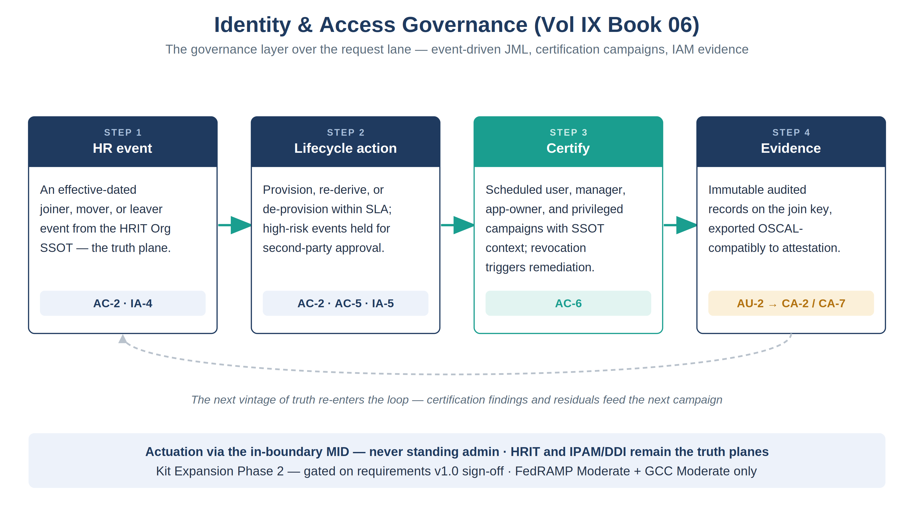

:::: {.content-hidden unless-profile="ssa"}
::: {.fouo-banner}
INTERNAL — NOT FOR PUBLIC DISTRIBUTION
:::
::::

::: {.aan-warning}
## Draft Proposal — Subject to Review
Developed by the **CSI Team (Cloud Services Infrastructure)**; not yet reviewed or approved by the  CIO Office, OIS, or leadership. **Date Code:** 2026-07-21 14:46 ET
:::

::: {.aan-important}
**Series Context** — Volume IX Book 06. Book 01 governs identity *requests*: an operator asks, an approver approves, the MID actuates. This book is the governance layer above that lane — the lifecycle that runs without anyone asking (JML automation from HR events), the review that runs on a calendar (access-certification campaigns), and the evidence both produce (the IAM feed into Vol VII Book 04 attestation). It is the series home for the **Identity & Access Governance Kit — Kit Expansion Phase 2**; the kit realization is gated as stated below.
:::

::: {.aan-warning}
**Phase 2 gates — the kit is not buildable yet.** Three gates precede implementation, per the kit-expansion roadmap: **(1)** the foundation kits (Vol VII, DDI, Day-2) running in sub-production with green ATF; **(2)** Vol I Book 04's HRIT Identity & Org SSOT implemented and providing reliable event data; **(3)** the kit requirements advanced from **Draft v0.9 to a signed-off v1.0** through CSI/OIS workshops. This book records the series home, the control contract, and the design shape so the kit lands into a settled slot when the gates clear — the control closures below are the book's contract, not yet kit-bound.
:::

# What This Document Addresses

Identity governance today is manual where it matters most. Access reviews are
compiled by hand for ConMon. Least-privilege verification is a spreadsheet
exercise. Leaver de-provisioning is evidenced after the fact, if at all. The
Book 01 catalog made identity *requests* governed — but a request lane only
governs what someone remembers to request. The three standing obligations that
run on events and calendars rather than tickets have no automation:

1. **JML from the HRIT Org SSOT.** Joiner provisioning, mover access
   re-derivation and residual review, and leaver de-provisioning within SLA —
   driven by effective-dated HR events, with approval gates on high-risk
   events and bidirectional attribute sync against the truth plane.
2. **Access-certification campaigns.** Scheduled user, manager,
   application-owner, and privileged reviews with SSOT context; bulk decisions
   with an audit trail; every revocation triggering a tracked remediation
   workflow.
3. **IAM evidence generation.** Campaign completion, MFA and Conditional-Access
   coverage, SSOT-versus-directory least-privilege comparison, and immutable
   JML audit logs — exported OSCAL-compatibly into the attestation loop.

# Configuration Is Not Compliance — Why This Book Exists {#config-not-compliance}

The identity stack beneath this book is genuinely strong: federation puts
every SaaS sign-in behind the agency's phishing-resistant MFA (Vol IX
Book 05), SCIM automates provisioning and deprovisioning, and the
five-verb help-desk catalog (Vol IX Book 01) makes routine identity
operations governed and evidenced. It is tempting to conclude the
identity controls are therefore closed. NIST SP 800-53 says otherwise —
deliberately. The control families *begin* with policy and procedure
requirements (AC-1, IA-1), and the account-management family carries the
enhancements configuration cannot reach: **AC-2(5)** and the
review-and-recertification discipline, where a human accountable for an
access decision periodically re-affirms or revokes it against the SSOT.
A perfectly configured tenant with no certification campaigns has
automated its grants and abandoned its reviews — every entitlement is
efficiently provisioned and nobody has confirmed it should still exist.
This book is the layer that closes that split: scheduled campaigns with
SSOT context, revocations that become tracked remediation (not advisory
emails), and evidence that the review *happened and bit* — exported into
the same attestation loop as everything else. Configuration makes
identity controls enforceable; governance makes them true over time.

# The Governance Loop

{#fig-vol9b06-loop fig-alt="A house-style four-step pipeline titled Identity & Access Governance (Vol IX Book 06), subtitle 'The governance layer over the request lane — event-driven JML, certification campaigns, IAM evidence', on a white background. Four navy-headed cards joined left to right by teal arrows: Step 1 HR event — an effective-dated joiner, mover, or leaver event from the HRIT Org SSOT, the truth plane (AC-2, IA-4); Step 2 Lifecycle action — provisioning, access re-derivation, or de-provisioning within SLA, high-risk events gated by a second-party approval (AC-2, AC-5, IA-5); Step 3 Certify, drawn with a teal header — scheduled user, manager, application-owner, and privileged campaigns with SSOT context, revocations triggering tracked remediation (AC-6); Step 4 Evidence — every action and decision an immutable audited record reconciled to the CM-8 join key and exported OSCAL-compatibly to attestation (AU-2). A footer states the discipline: actuation via the in-boundary MID, never standing admin; HRIT and IPAM/DDI remain the truth planes; FedRAMP Moderate and GCC Moderate only. White background. Authored house-style diagram." width="100%"}

| Lane | What runs | Trigger | Control |
|---|---|---|---|
| **JML automation** | Joiner provisioning · mover re-derivation + residual review · leaver de-provisioning within SLA | Effective-dated HR event | AC-2, IA-4, IA-5 |
| **Approval gates** | High-risk lifecycle events (privileged roles, sensitive orgs) held for second-party approval | Risk classification | AC-5 |
| **Certification campaigns** | User / manager / application-owner / privileged reviews; bulk decisions audited; revocation → remediation workflow | Calendar cadence | AC-6 |
| **Evidence feed** | Campaign completion, coverage comparisons, immutable JML logs — OSCAL-compatible export | Every action | AU-2 → CA-2/CA-7 |

::: {.aan-important}
**The truth planes do not move.** The HRIT Org SSOT (Vol I Book 04) remains the
source of employment truth; IPAM/DDI remains the source of asset truth; the
CMDB reconciles and never replaces either. This book automates *consequences*
of truth-plane events — it does not create a second place where identity truth
lives.
:::

# Governance, Not Requests — the Book 01 Seam

Book 01 and this book divide the identity surface cleanly. A password reset is
a request: someone asks, the catalog governs the asking. A leaver
de-provisioning is not a request — nobody asks for their own departure to be
processed — it is a consequence that must fire because the HR record changed.
The request lane cannot close that class of obligation, which is why AC-2's
event-driven half, the certification calendar, and the evidence feed live
here. The seam is the trigger: **tickets govern asks; this book governs
events and calendars.**

# Closure Necessity

::: {.aan-tip}
## Closure Necessity — a review that depends on remembering is not a control
Vol I Book 04 proves the SSOT is the only source that *generates* employment
truth. This book is where that truth becomes enforcement on a schedule no
human sustains: leavers de-provisioned within SLA every time, certifications
that fire on a calendar rather than an audit finding, and evidence produced
by the workflow itself rather than reconstructed for the assessor. Remove the
automation and AC-2/AC-6 regress to whatever the last hand-run review caught;
remove the evidence feed and the controls may hold but cannot be proven.
:::

# NIST SP 800-53 Rev 5 Control Closure — Authorities Closed Here

Generated from the compliance spine (`orgcomp-compliance-spine.yml`); not hand-edited here.

<!-- authorities:book-day2-iam — generated from orgcomp-compliance-spine.yml; do not hand-edit -->
| Control | Title | Closing mechanism (function, not product) | Accreditation gate | Authority drivers | Evidence slot | FedRAMP 20x KSI | Tool-attestable? |
|---|---|---|---|---|---|---|---|
| AC-2 | Account Management | Joiner/mover/leaver executed as lifecycle automation from effective-dated HR events — joiner provisioning, mover access re-derivation, leaver de-provisioning within SLA — with approval gates on high-risk events; extends the Book 01 request lane from operator-requested to event-driven | FedRAMP Moderate | NIST SP 800-53 Rev 5; OMB M-22-09 | Identity | KSI-IAM | No |
| AC-5 | Separation of Duties | Requester, approver, and certifier are distinct roles enforced by the campaign and JML workflows; high-risk lifecycle events require a second-party approval gate | FedRAMP Moderate | NIST SP 800-53 Rev 5 | Identity | KSI-IAM | No |
| AC-6 | Least Privilege | Scheduled user / manager / application-owner / privileged access-certification campaigns with SSOT context; every revocation decision triggers a tracked remediation workflow | FedRAMP Moderate | NIST SP 800-53 Rev 5; OMB M-22-09 | Identity | KSI-IAM | No |
| IA-4 | Identifier Management | Identifiers issued, re-derived, and retired as consequences of the authoritative worker-record lifecycle — no orphaned identifiers because retirement is an HR event, not a hygiene sweep | FedRAMP Moderate | NIST SP 800-53 Rev 5 | Identity | KSI-IAM | No |
| IA-5 | Authenticator Management | Authenticators disabled on the leaver event within the de-provisioning SLA and re-scoped on mover events, closing the ghost-credential window the request lane alone leaves open | FedRAMP Moderate | NIST SP 800-53 Rev 5; EO 14028 | Identity | KSI-IAM | No |
| AU-2 | Event Logging | Every JML action and certification decision an immutable, audited change record reconciled to the join key and exported OSCAL-compatibly into the attestation loop | FedRAMP Moderate | NIST SP 800-53 Rev 5; OMB M-21-31 | Telemetry | KSI-MLA | No |

: Authorities Closed Here — Identity & Access Governance (JML automation · certification campaigns · IAM evidence) († = Closure-Necessity anchor: no alternate closure path) {.striped .hover}

# Honest Limits

- **The kit is gated.** Until the three Phase 2 gates clear — sub-production
  foundation kits with green ATF, an implemented Vol I Book 04 SSOT, and a
  signed-off requirements v1.0 — this book is a contract and a design shape,
  not shippable Flows. Nothing here should be procured against before the
  sign-off.
- Certification quality is bounded by SSOT quality: a campaign with stale
  manager chains produces confident wrong answers. The Vol I Book 04
  reliability gate exists precisely for this reason.
- Bulk certification decisions are efficient and dangerous in equal measure;
  the audit trail records who bulk-approved what, and privileged-access
  campaigns exclude bulk approval entirely.
- The mover event is the hard case — re-derivation plus residual review, not
  a fresh grant — and the SLA that matters most is the leaver's.

# Cross-References

- **Vol I Book 04 (HRIT Identity & Org SSOT)** — the truth plane every lane in
  this book consumes; its AC-2/PS-5 closures are the necessity argument this
  book operationalizes.
- **Vol IX Book 01 (Helpdesk & ITSM Catalog)** — the request lane this book
  governs above; JML *requests* stay there, JML *events* live here.
- **Vol IX Book 03 (App Registration Governance)** — the machine-identity
  mirror of this lifecycle; its attestation cadence is the workload analogue
  of a certification campaign.
- **Vol VII Book 04 (Control Attestation & Evidence)** — where the evidence
  feed lands (CA-2/CA-7) and becomes the FedRAMP 20x KSI submission.

# Provenance

Draft. The series home decided here (Vol IX Book 06, per the kit-expansion
roadmap's Phase 2) and the control contract registered in
`orgcomp-compliance-spine.yml` are the authoritative artifacts; the underlying
requirements document remains **Draft v0.9** pending CSI/OIS sign-off. The
figure above is authored as committed house-style SVG, rendered to PNG at 3×
for crisp `.docx` zoom. This book's own DOCX/PPTX derivatives follow on the
next authoring pass.
