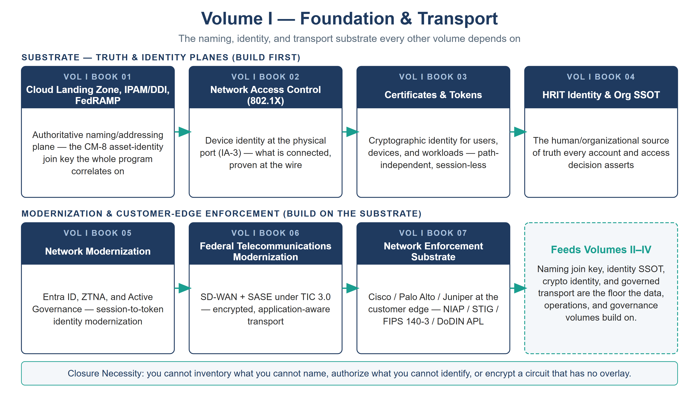

:::: {.content-hidden unless-profile="ssa"}
::: {.fouo-banner}
INTERNAL — NOT FOR PUBLIC DISTRIBUTION
:::
::::

::: {.aan-warning}
## Draft Proposal — Subject to Review

This document is a **draft proposal** developed by the **CSI Team (Cloud Services Infrastructure)**. It has not been reviewed or approved by the  CIO Office, the Office of Information Security (OIS), or organizational leadership.

**Date Code:** 2026-07-19 16:20 ET
:::

# Volume Purpose

**Volume I establishes the substrate every other volume depends on.** Before a
control can be scanned, an identity authorized, a workload consolidated, or an
authorization package assembled, four things must exist and be authoritative:
a **naming and addressing plane** (DNS, DHCP, IPAM, certificate issuance), a
**device and cryptographic identity plane**, an **organizational identity source
of truth**, and an **encrypted, governed transport** between sites and clouds.
This volume builds them.

In the series' Functional Plane Model (Vol 0 Book 00, Executive Summary), Volume
I is where the **truth planes** — naming/addressing and identity — are
established, together with the **transport** and **customer-owned edge
enforcement** that carry and protect everything above. The volume's governing
claim is the series' Closure Necessity doctrine at its foundation: *you cannot
inventory what you cannot name, authorize what you cannot identify, or encrypt a
circuit that has no overlay.* Remove Volume I and the controls claimed in
Volumes II–IV do not degrade — they become unevaluable.

{#fig-vol1-map fig-alt="A house-style volume map for Volume I, Foundation & Transport, on a white background. A navy title and grey subtitle head the figure. Two labeled rows of book nodes are shown. The top row, labeled SUBSTRATE — TRUTH & IDENTITY PLANES (BUILD FIRST), holds four navy-headed nodes connected left to right by teal arrows: Book 01 Cloud Landing Zone, IPAM/DDI, FedRAMP (the CM-8 asset-identity join key); Book 02 Network Access Control 802.1X (device identity at the port, IA-3); Book 03 Certificates & Tokens (cryptographic identity, session-less); and Book 04 HRIT Identity & Org SSOT. The bottom row, labeled MODERNIZATION & CUSTOMER-EDGE ENFORCEMENT, holds Book 05 Network Modernization, Book 06 Federal Telecommunications Modernization, and Book 07 Network Enforcement Substrate, again joined by teal arrows, feeding a dashed teal callout box reading Feeds Volumes II–IV. A footer band states the Closure Necessity doctrine: you cannot inventory what you cannot name, authorize what you cannot identify, or encrypt a circuit that has no overlay. White background. Authored house-style diagram." width="100%"}

# Books in This Volume

| Book | Title | Role |
|---|---|---|
| **Vol I Book 01** | Cloud Landing Zone, IPAM/DDI, FedRAMP | The authoritative naming/addressing plane — the CM-8 asset-identity **join key** the whole program correlates on |
| **Vol I Book 02** | Network Access Control (802.1X) | Device identity at the physical port (IA-3) — what is connected, proven at the wire |
| **Vol I Book 03** | Certificates & Tokens | Cryptographic identity for users, devices, and workloads — path-independent, session-less |
| **Vol I Book 04** | HRIT Identity & Org SSOT | The human/organizational source of truth every account and access decision asserts |
| **Vol I Book 05** | Network Modernization | Entra ID, ZTNA, and Active Governance — session-to-token identity modernization |
| **Vol I Book 06** | Federal Telecommunications Modernization | SD-WAN + SASE under TIC 3.0 — encrypted, application-aware transport (the "DIA is a pipe" doctrine) |
| **Vol I Book 07** | Network Enforcement Substrate | Cisco / Palo Alto / Juniper at the customer edge, accredited via NIAP / DISA STIG / FIPS 140-3 / DoDIN APL |

: Volume I — Foundation & Transport {.striped .hover}

# How This Volume Fits the Program

Volume I feeds everything downstream. The **naming-plane join key** (Vol I Book
01) is what lets the Multi-Cloud Evidence Fabric (Vol III Book 07) correlate five
management stacks into one compliance picture; the **identity SSOT** (Vol I Book
04) is what SailPoint and every access decision sit *on*; the **cryptographic
identity** (Vol I Book 03) is applied to the database tier in Volume II; and the
**transport + edge enforcement** (Vol I Books 06–07) are where the customer-owned
half of SC-7/SC-8 is closed — the half no CSP's FedRAMP authorization covers.
Volume I is the floor; the rest of the series is built on it.

# Where This Volume's Evidence Lands — Volume X (Optional)

Where the closures and evidence this volume produces bind to the governance
substrate — the conformance layer, the surface slots, and the evidence
contract — is documented once, for the whole series, in
**[Vol X Book 00 — Governance-Substrate Integration](Vol_X_Book_00_OrgComp_Governance_Substrate_Integration_Overview.qmd)**.
The binding is **optional and separable**: this volume, and the series it
belongs to, stands complete at FedRAMP Moderate with no substrate engagement
at all; adopting the substrate adds machine-checked scoring and drift-gating
on top of what is already closed, and can be adopted later — or never —
without rework.
