```{=html}
<div class="fouo-banner">UNCLASSIFIED // FOR OFFICIAL USE ONLY —  Cloud Services Team</div>
```

::: {.aan-warning}
## Draft Proposal — Subject to Review

This document is a **draft proposal** developed by the **CSI Team (Cloud Services Infrastructure)**. It is an attempt at a comprehensive -wide technical roadmap and has not been reviewed or approved by the  CIO Office, the Office of Information Security (OIS), or organizational leadership. All recommendations, vendor selections, control mappings, and implementation timelines are subject to revision pending formal review by the  CIO Office and organizational components.

**Date Code:** 2026-07-08 16:07 ET
:::

---

## Executive Summary {.unnumbered}

```{=html}
<div class="exec-summary">
```

The  operates four distinct cloud environments — on-premises VMware Cloud Foundation, Microsoft Azure Government (GCC Moderate), AWS GovCloud, and Oracle Cloud Infrastructure (OCI) for OPM HRIT integration. Each environment uses a different Software Defined Networking fabric that replaces traditional broadcast DHCP with fabric-native IP assignment. Without a unified control layer,  has no cross-environment IP visibility, no unified DNS security policy, no automated certificate lifecycle, and must collect FedRAMP compliance evidence from four separate sources.

**Unified DDI** — an authoritative DNS/DHCP/IPAM plane with DNSSEC and RPZ — solves all four problems from a single control plane. **InfoBlox DDI** is the deployed example this document evaluates for 's estate. Under Path A (cloud-managed, below) the control plane is InfoBlox's FedRAMP-authorized offering, listed on the Marketplace as **Infoblox Government Cloud** (CSO FR2017257053, hosted on AWS GovCloud — verify current scope and authorization date on the FedRAMP Marketplace); under Path B (agency-operated, the better fit for 's topology) the agency carries the component in its own boundary and no inheritance applies.

> **The DDI-specific scope of this authorization is six days old, not three years old.** CSO FR2017257053 was originally authorized December 15, 2022 (Census/Commerce sponsored) for **BloxOne Threat Defense Federal Cloud** — a DNS-security/threat-intelligence service (Cloud Services Portal, TIDE, Dossier), not the DDI/IPAM management plane this book is about. Only on **July 22, 2026** was the same CSO — rebranded Infoblox Government Cloud — recertified FedRAMP Moderate with an expanded boundary adding Universal DDI Management, NIOS-X Servers, and Universal Asset Insights. Every "CSO FR2017257053" citation below refers to that July 2026 event for DDI purposes, not the 2022/2023 Threat Defense authorization.

> **Mechanism, not product.** Per series doctrine (Vol 0 Book 00, Executive Summary), closure necessity names mechanism classes, never products. The mechanism argued for throughout this document is unified DDI; InfoBlox is the deployed example chosen for 's current estate, **BlueCat Integrity** is the principal mechanism-class peer, and the ConMon roadmap's alternatives matrix documents what changes on substitution. Every closure claim below is a claim about the mechanism class.

**The three business outcomes this document demonstrates:**

**1. Operational Risk Elimination.** A single Infoblox deployment replaces four separate DNS systems, four separate IP inventory processes, and four separate certificate-tracking tools. When a new cloud workload spins up in any environment, Infoblox automatically allocates an IP (cross-cloud conflict checked), creates DNS A and PTR records, and enrolls a machine certificate via SCEP — in seconds, without a change ticket. When a workload decommissions, all three are revoked in a single automated pipeline, with a reconciliation check that catches partial failures.

**2. Continuous FedRAMP Compliance.** Infoblox is one of a small number of DDI platforms with its own FedRAMP Moderate CSO authorization (verify current authorization on the FedRAMP Marketplace at time of procurement). Under Path A,  inherits the DDI-layer controls rather than re-proving them; under Path B the same controls are agency-carried, with the evidence generated natively by the platform. Evidence for SC-20/21 (DNSSEC), CM-8 (inventory), IA-5(2) (certificates), AU-12 (audit), and IR-4 (incident response) is generated continuously and automatically — not assembled manually for annual assessments.

**3. M365 GCC Boundary Enforcement.** Microsoft publishes M365 GCC endpoint changes up to 12 times per year. Without automation, each change requires four manual updates across NSG rules, VPC security groups, RPZ policies, and VPN split-tunnel configurations — during which a gap exists between when Microsoft changes an endpoint and when 's controls reflect it. Infoblox polls the Microsoft 365 IP & URL Web Service API daily and pushes all four enforcement updates simultaneously — closing the boundary gap to within minutes of the next daily poll, a worst-case bound of roughly 24 hours versus the 7+ days a manual four-ticket cycle typically takes.

**Vendor relationships:** InfoBlox has formal technology partnerships with all three of 's primary cloud vendors. InfoBlox's own FedRAMP-authorized service (Infoblox Government Cloud) runs *on* AWS GovCloud, making AWS the infrastructure foundation. InfoBlox is a Microsoft Azure Technology Alliance Partner with native Microsoft Sentinel, Defender Threat Intelligence, and Entra ID integrations. InfoBlox is available on the Oracle Cloud Marketplace with OCI connector support for the OPM HRIT integration path.

InfoBlox DDI can be deployed via two architecturally distinct paths; the choice determines the FedRAMP authorization inheritance model:

**Path A — BloxOne DDI (Cloud-Managed, FedRAMP ATO Inherited)**

InfoBlox operates the management control plane on AWS GovCloud (Infoblox Government Cloud, CSO FR2017257053 — verify current scope and authorization date on the FedRAMP Marketplace). The agency deploys BloxOne On-Prem Hosts in each environment; they connect to the InfoBlox-hosted management plane. FedRAMP authorization is inherited from InfoBlox's ATO — the agency does not carry this component independently. Procurement via AWS GovCloud Marketplace (no separate IDIQ required). Best fit if the agency prefers a managed control plane and the simplest FedRAMP inheritance path.

**Path B — NIOS Grid (Agency-Operated, On-Premises Hub)**

The agency deploys an InfoBlox NIOS virtual appliance as the Grid Master on-premises (VMware ESXi or physical InfoBlox appliance). Grid Members are deployed in each environment (AWS GovCloud, Azure Government, Oracle OCI, additional on-premises sites) as spokes. The on-premises Grid Master is the authoritative hub; all Grid Members replicate configuration from it and handle local DNS/DHCP/IPAM for their environment. The agency documents NIOS within its own FedRAMP boundary — no ATO inheritance from InfoBlox's CSO. Procurement via GSA Schedule (GS-35F) or agency IDIQ contract vehicle.

> ** topology note:** For 's multi-cloud architecture spanning AWS GovCloud, Azure Government, Oracle OCI, and on-premises VMware, Path B — NIOS Grid with an on-premises Grid Master — more closely matches 's topology. No single cloud provider is the hub; all four environments are equal spokes of the on-premises control plane. The decision between Path A and Path B should involve OIS and the CIO Office, as it determines whether InfoBlox is a shared-responsibility SaaS or an agency-operated infrastructure component. Agency selection pending.

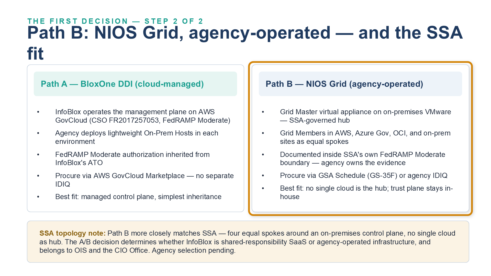{fig-alt="Side-by-side comparison of the two InfoBlox deployment paths. Path A — BloxOne DDI (cloud-managed): InfoBlox operates the management plane on AWS GovCloud (CSO FR2017257053, FedRAMP Moderate); agency deploys lightweight On-Prem Hosts in each environment; FedRAMP Moderate authorization inherited from InfoBlox's ATO; procured via AWS GovCloud Marketplace with no separate IDIQ; best fit for a managed control plane and simplest inheritance. Path B — NIOS Grid (agency-operated, highlighted): Grid Master virtual appliance on on-premises VMware as -governed hub; Grid Members in AWS, Azure Gov, OCI, and on-prem sites as equal spokes; documented inside 's own FedRAMP Moderate boundary with agency-owned evidence; procured via GSA Schedule GS-35F or agency IDIQ; best fit when no single cloud is the hub and the trust plane stays in-house. Amber note: Path B more closely matches  topology; the A/B decision belongs to OIS and the CIO Office; agency selection pending. White background. Source: Book 01 InfoBlox DDI Briefing deck, Date Code 2026-07-07 09:11 ET." width="100%"}

```{=html}
</div>
```

---

## What Is a Federal Cloud Landing Zone? {#sec-landing-zone}

A Cloud Landing Zone is the foundational, pre-configured environment that a federal agency provisions *before* any workload is deployed. It establishes the guardrails — network topology, identity controls, logging pipelines, encryption policies, and security baselines — that every subsequent workload inherits automatically.

For  operating under FedRAMP Moderate, the landing zone must satisfy four overlapping frameworks simultaneously:

- **NIST SP 800-53 Rev 5** — the control catalog from which FedRAMP Moderate baselines are drawn
- **CISA Zero Trust Maturity Model v2.0** — five pillars with three cross-cutting capabilities
- **FedRAMP Moderate** — boundary definition, continuous monitoring, evidence packaging
- **FedRAMP 20x Consolidated Rules (2026)** — automated, machine-readable compliance evidence enforced by infrastructure-as-code; Class A/B/C certification pipelines; mandatory January 1, 2027

::: {.aan-important}
**FedRAMP 20x Consolidated Rules — June 25, 2026:** FedRAMP published its Consolidated Rules for 2026 on June 25, 2026, transitioning 20x from pilot status to a fully available certification path with three classification tiers: Class A (opens August 3, 2026), Class B and C (open August 31, 2026). FedRAMP Ready submissions cease July 28, 2026. The Consolidated Rules become mandatory for all certified systems on **January 1, 2027**. Machine-readable structured rules are available in JSON format via GitHub for AI agent integration. InfoBlox DDI's WAPI REST interface delivers machine-readable KSI evidence — the exact format the 20x framework requires — without manual assembly.
:::

{fig-alt="Timeline showing FedRAMP 20x Consolidated Rules key dates: June 25 2026 rules published, July 6 marketplace opens, July 28 FedRAMP Ready ceases, August 3 Class A opens, August 31 Class B and C open, January 1 2027 rules mandatory, June 11 2027 no new Rev5 certifications. Three class description boxes: Class A lowest complexity, Class B mid-tier with InfoBlox DDI pathway, Class C highest complexity multi-cloud." width="100%"}

::: {.aan-important}
**The Core Insight:** DNS, DHCP, and IP address management (DDI) are not optional infrastructure services — they are foundational security controls. Every device that joins a network, every cloud workload that provisions, every certificate that authenticates a service depends on DNS and IP assignment working correctly. A landing zone without unified DDI has a structural security gap at its foundation.
:::

### 's Multi-Cloud Landing Zone Scope {#sec-scope}

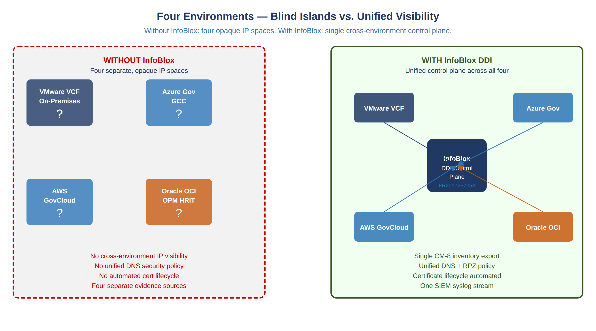{fig-alt="Split comparison showing WITHOUT InfoBlox: four separate opaque environments (VMware VCF, Azure Gov, AWS GovCloud, Oracle OCI) with question marks and no cross-environment visibility. WITH InfoBlox: same four environments connected to a central InfoBlox DDI control plane with bridges providing unified CM-8 inventory, DNS policy, certificate lifecycle, and single SIEM syslog stream." width="100%"}

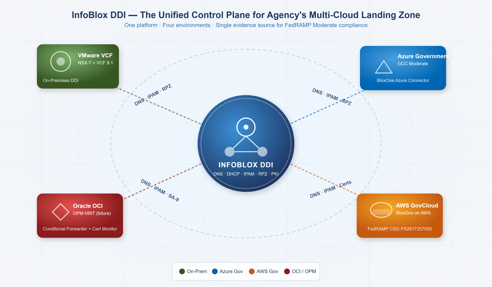{fig-alt="Hub-and-spoke diagram showing InfoBlox DDI at center connected to VMware VCF on-premises, Azure Government GCC, AWS GovCloud, and Oracle OCI" width="100%"}

's landing zone spans four discrete cloud environments that must behave as a single logical security domain:

| Environment | Platform | SDN Technology | DHCP/IP Model | FedRAMP Boundary |
|---|---|---|---|---|
| On-Premises DC | VMware VCF / ESXi | NSX-T overlay (VXLAN/Geneve) | NSX-T DHCP Server Profiles on T1/T0 Gateways | Agency ATO |
| Azure Government GCC | Microsoft Azure | Azure VNet (SDN fabric, no broadcast) | Azure fabric assigns IPs; DHCP is abstracted away | Azure Government FedRAMP High |
| AWS GovCloud | Amazon AWS | VPC with ENI/Nitro hypervisor | VPC DHCP Options Sets; EC2 metadata service | AWS GovCloud FedRAMP High |
| Oracle Cloud OCI (OPM HRIT) | Oracle OCI | VCN with VNIC overlay | OCI DHCP options; instance metadata at 169.254.169.254 | OPM ATO (external) |

:  Multi-Cloud Environments {.striped .hover}

The critical observation: **none of these four environments uses traditional broadcast DHCP.** Each uses a form of SDN where IP address assignment is managed by the hypervisor fabric — not a classic DHCP server. Without a unified IPAM overlay, these four IP spaces are opaque to each other and to 's security operations center.

---

## SDN and the End of Traditional DHCP {#sec-sdn}

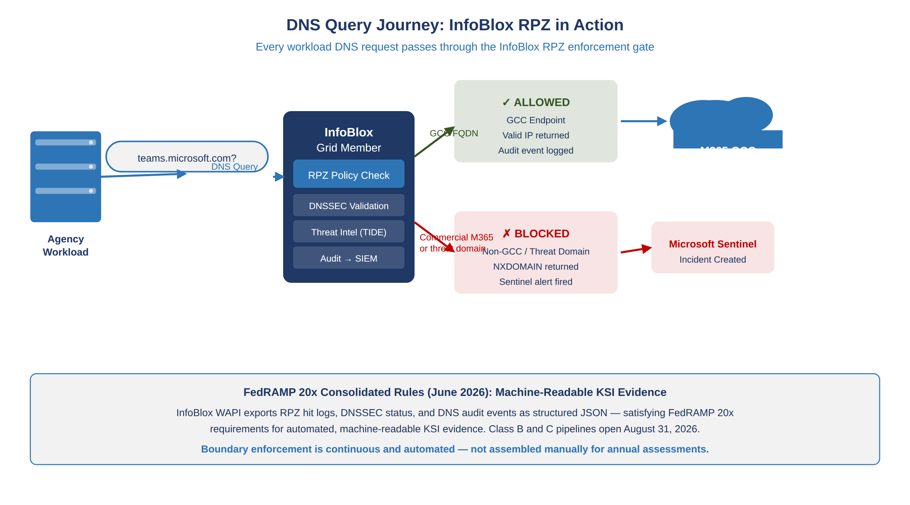{fig-alt="Flow diagram showing an agency workload sending a DNS query to InfoBlox Grid Member which runs RPZ policy check, DNSSEC validation, threat intel lookup, and audit logging. GCC endpoint queries are allowed through to M365 GCC cloud. Non-GCC and threat domains are blocked with NXDOMAIN and Sentinel alert. FedRAMP 20x note: WAPI exports RPZ hit logs as structured JSON satisfying machine-readable KSI requirement." width="100%"}

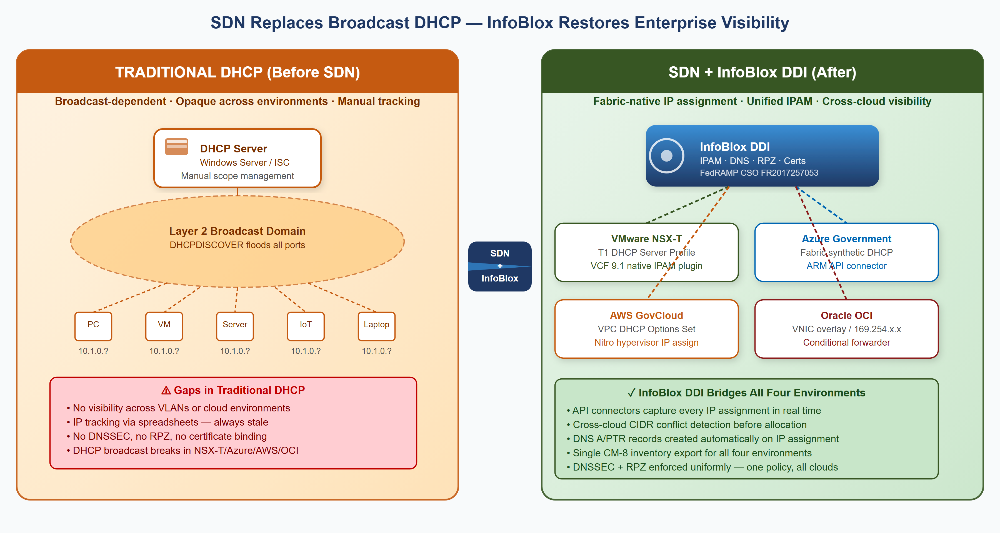{fig-alt="Before/after comparison: traditional DHCP broadcast on left versus SDN fabric-native IP assignment with InfoBlox bridge on right" width="100%"}

Traditional DHCP (RFC 2131) depends on Layer 2 broadcast. This model fundamentally breaks in Software Defined Networking environments because SDN uses overlay protocols (VXLAN, Geneve, STT) that operate at Layer 3 and suppress Layer 2 broadcasts by design.

### VMware NSX-T: DHCP Server Profiles and VCF 9.1 Native Integration {#sec-nsx}

VMware NSX-T replaces broadcast DHCP with **DHCP Server Profiles** attached to T1 Gateways. The NSX-T control plane intercepts DHCP requests at the logical switch level — the request never hits the physical network. Traditional DHCP servers are completely bypassed.

VMware Cloud Foundation **9.1** (released May 2026) introduced native InfoBlox DDI integration as a first-class feature:

1. VCF Automation tenant requests a new network segment
2. VCF background service calls InfoBlox NIOS WAPI or BloxOne REST API to reserve an IP block
3. NSX-T creates the logical segment using the InfoBlox-allocated CIDR
4. InfoBlox records the segment name, CIDR, VLAN/VNI, and tenant as extensible attributes
5. When VMs deploy, NSX-T DHCP assigns IPs; InfoBlox receives assignments via the IPAM plugin
6. DNS A/PTR records for each VM are created automatically — no manual DNS entry required

::: {.aan-tip}
**VCF 9.1 Significance:** Before VCF 9.1, NSX-T InfoBlox integration required custom scripts and manual configuration. VCF 9.1 makes InfoBlox the native, default IPAM backend for VMware Cloud Foundation — meaning every new VCF deployment at  can have InfoBlox IPAM built in from day one.
:::

### Microsoft Azure Government: The Fabric Replaces DHCP {#sec-azure}

Azure Virtual Networks do not use DHCP in the traditional sense. When a VM is deployed, the Azure hypervisor fabric directly assigns the IP — the VM receives the IP via a synthetic DHCP response injected by the Azure host agent. There is no DHCP broadcast.

Azure reserves five IP addresses in every subnet that cannot be assigned (x.x.x.0 network, x.x.x.1 gateway, x.x.x.2–3 Azure DNS, x.x.x.255 broadcast). Beyond these, IP assignment is managed entirely by the Azure control plane.

InfoBlox's **Azure connector** continuously pulls VNet subnet configurations and VM NIC IP assignments via the Azure Resource Manager API, writing every Azure IP into the Azure-GCC Network View in the InfoBlox IPAM database.

### AWS GovCloud: VPC DHCP Options and the Nitro Hypervisor {#sec-aws-dhcp}

AWS VPCs use **DHCP Options Sets** to specify DNS servers and domain names, but the actual IP assignment is managed by the AWS Nitro hypervisor — not a traditional DHCP server. EC2 instances receive IPs via a synthetic DHCP interaction at the VPC CIDR +2 address.

Replacing the default AmazonProvidedDNS with the InfoBlox Grid Member IP in the VPC DHCP Options Set directs all EC2 DNS queries through the enterprise RPZ and DNSSEC validation layer. InfoBlox's **AWS connector** syncs EC2 instance IP assignments, subnet CIDRs, and VPC IPAM pool allocations into the AWS-GovCloud Network View.

### Oracle OCI: VCN DHCP Options and the VNIC Overlay {#sec-oci-dhcp}

OCI uses Virtual Network Interface Cards (VNICs) inside Virtual Cloud Networks. OCI's internal DHCP implementation is fabric-native — the OCI hypervisor responds to DHCP requests on behalf of each subnet from the metadata service at 169.254.169.254.

For OPM HRIT,  cannot control OCI DHCP Options because OPM manages the tenancy. However,  can document all known OPM HRIT service IPs as external host records in InfoBlox (read-only OCI Network View) and configure conditional forwarders for OPM HRIT FQDNs routing through the FastConnect path.

---

## InfoBlox as the SDN-Aware IPAM Control Plane {#sec-infoblox}

InfoBlox DDI operates as a **control plane over SDN environments** — not replacing the SDN fabric's internal IP assignment mechanisms, but serving as the authoritative record and policy engine above them.

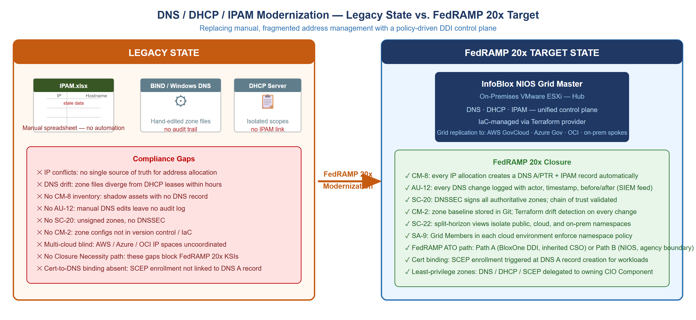{fig-alt="Side-by-side comparison showing Legacy State (manual IPAM spreadsheet, siloed DNS, no audit trail, no multi-cloud visibility, FedRAMP gaps) versus FedRAMP 20x Target State (InfoBlox NIOS Grid Master on-premises VMware as hub, automated A/PTR creation, DNSSEC, IaC/Terraform, Grid Members in each cloud environment, SCEP cert binding, least-privilege zone delegation)" width="100%"}

### What InfoBlox Provides That SDN Cannot {#sec-value}

| Capability | What SDN Platforms Provide | What InfoBlox Adds |
|---|---|---|
| IP assignment | Per-environment only | Cross-cloud conflict detection before allocation |
| DNS | Per-environment resolver | Authoritative + recursive with DNSSEC, unified across all four |
| DHCP inventory | Per-VPC/VNet/segment dashboard | Single CM-8-ready inventory spanning all environments |
| Certificate management | None / per-CA | Certificate Tracker links cert to IP host record, expiry alerts |
| Threat blocking | Per-environment (DNS Firewall, NSG) | Single RPZ policy propagated to all Grid Members in seconds |
| Audit logging | Per-environment log silo | Single syslog stream to SIEM, AU-12 evidence |
| IaC integration | Per-cloud provider only | Terraform InfoBlox provider works across all environments |

: InfoBlox Value-Add Over Native SDN {.striped .hover}

### Grid Master Deployment — On-Premises VMware and the Trust Case {#sec-gridmaster-trust}

For , the InfoBlox NIOS Grid Master should be deployed as a **virtual machine on on-premises VMware infrastructure** (Path B from the Executive Summary). This is not only a technical topology choice — it is a trust architecture decision. DNS, DHCP, and IPAM together constitute the network naming and addressing control plane: every device's address, every workload's hostname, and every certificate's subject name flows through them. Placing the Grid Master on-premises means  retains:

- **Hypervisor-layer control** — the Grid Master VM runs under  infrastructure team governance, not a cloud provider's control plane
- **Physical network isolation** — the master is reachable from all four environments via dedicated management interfaces, not via public internet or cloud-provider backbone
- **No single-cloud dependency** — if any one cloud environment (AWS GovCloud, Azure Government, OCI) experiences an outage or a control-plane incident, the Grid Master continues to function from on-premises
- **Boundary clarity** — the NIOS Grid falls within 's own FedRAMP authorization boundary; the agency controls the ATO evidence rather than inheriting it from a vendor CSO

::: {.aan-important}
**Trust rationale:** DNS poisoning, DHCP scope hijacking, and IPAM record manipulation are among the highest-impact attack vectors against network infrastructure. An adversary who controls the Grid Master can redirect any FQDN, drain any IP subnet, or suppress any workload's DNS record — effectively owning the naming plane for all four  environments simultaneously. On-premises VMware deployment keeps this function under 's direct institutional control.

**OIS and the CIO Office must validate the trust boundary decision and define the Grid Admin role-holder accountability model before the Grid is deployed.**
:::

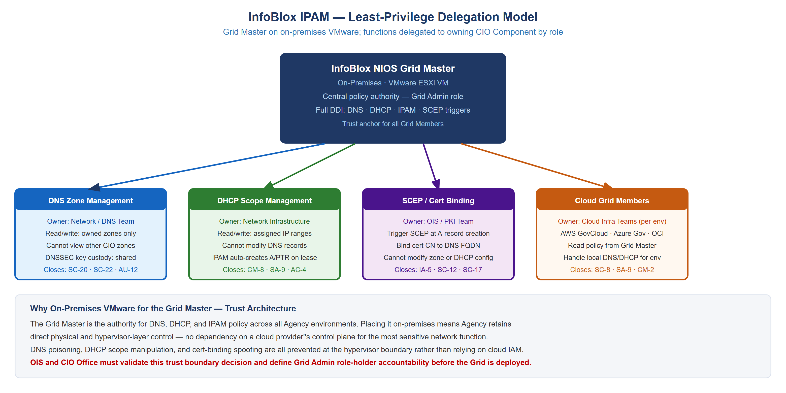{fig-alt="Hub-and-spoke diagram showing InfoBlox NIOS Grid Master on-premises VMware at center, with four delegated function branches: DNS Zone Management (Network/DNS Team), DHCP Scope Management (Network Infrastructure), SCEP/Cert Binding (OIS/PKI Team), and Cloud Grid Members (per-environment Cloud Infra Teams). Each branch shows the NIST control closures and least-privilege boundaries." width="100%"}

### Least-Privilege Role Delegation {#sec-ipam-delegation}

The Grid Master holds total administrative authority over DNS, DHCP, and IPAM. That authority **must not reside in a single operational role**.  should structure InfoBlox administrative access as four delegated function areas, each assigned to the owning CIO Component with read/write access scoped only to their area:

| Function | Delegated To | Scope | Cannot Access |
|---|---|---|---|
| **DNS zone management** | Network / DNS Team | Read/write on assigned DNS zones; DNSSEC key custody shared with OIS | Other CIO Component zones; DHCP config; SCEP triggers |
| **DHCP scope management** | Network Infrastructure Team | Read/write on assigned IP subnets and DHCP scopes | DNS zone records; other teams' subnets; SCEP policy |
| **SCEP / cert binding** | OIS / PKI Team | Trigger SCEP enrollment at A-record creation; bind cert CN to DNS FQDN | Zone configuration; DHCP scopes; other teams' cert policies |
| **Cloud Grid Member management** | Per-environment Cloud Infra Teams (AWS GovCloud, Azure Government, OCI) | Configure local Grid Member for assigned cloud environment | Grid Master policy; other environments' Grid Members |
| **Grid Admin (full authority)** | CIO/OIS-designated Grid Administrator | Full DDI policy control | — (must be protected with MFA + privileged access workstation) |

: InfoBlox Least-Privilege Role Delegation {.striped .hover}

**DNS function separation applies to sub-functions as well.** Within DNS zone management, component-level zone delegation allows different CIO Components to own their sub-namespaces:

- `aws.` sub-zone — delegated to Cloud Infrastructure team (AWS)
- `azure.` sub-zone — delegated to Cloud Infrastructure team (Azure)
- `oci.` sub-zone — delegated to Cloud Infrastructure team (OCI)
- `onprem.` sub-zone — delegated to on-premises Network Infrastructure team
- `apps.` sub-zone — delegated to Application Development / DevOps

Each delegated zone owner can create, modify, and delete records within their zone without touching any other component's DNS namespace. The Grid Master enforces zone-level access control; cross-zone queries still resolve via Grid Member forwarding, but record modification rights are strictly scoped.

### Microsoft Partnership: M365 GCC Endpoint Lifecycle {#sec-microsoft}

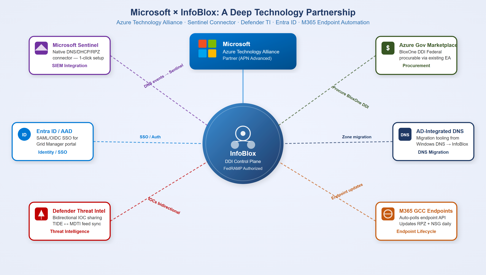{fig-alt="Radial diagram showing InfoBlox at center with six Microsoft integration spokes: Sentinel, Defender TI, Entra ID, Azure Marketplace, AD DNS migration, and M365 endpoint automation" width="100%"}

InfoBlox and Microsoft have a formal **Azure Technology Alliance Partnership** with six distinct integration points:

| Integration | What It Does |
|---|---|
| **Microsoft Sentinel Native Connector** | First-party Sentinel content pack — DNS Security Events, DHCP events, RPZ blocks stream to Sentinel without custom parsing |
| **Defender Threat Intelligence (MDTI)** | Bidirectional IOC sharing between InfoBlox TIDE and MDTI — a domain blocked by MDTI is also blocked by InfoBlox RPZ |
| **Entra ID / Azure AD SSO** | InfoBlox Grid Manager and BloxOne portal support Entra ID SAML/OIDC — Grid admin auth governed by  Conditional Access policies |
| **Azure Government Marketplace** | The Path A cloud-managed offering is procurable via existing Azure EA/ELA agreements — no separate IDIQ |
| **AD-Integrated DNS Migration** | Documented migration tooling from Windows DNS zones to InfoBlox Grid — AD still replicates, InfoBlox serves authoritative records |
| **M365 GCC Endpoint Lifecycle** | InfoBlox polls Microsoft 365 IP & URL Web Service API and auto-updates all enforcement layers |

: Microsoft-InfoBlox Integration Points {.striped .hover}

#### M365 GCC Boundary Enforcement

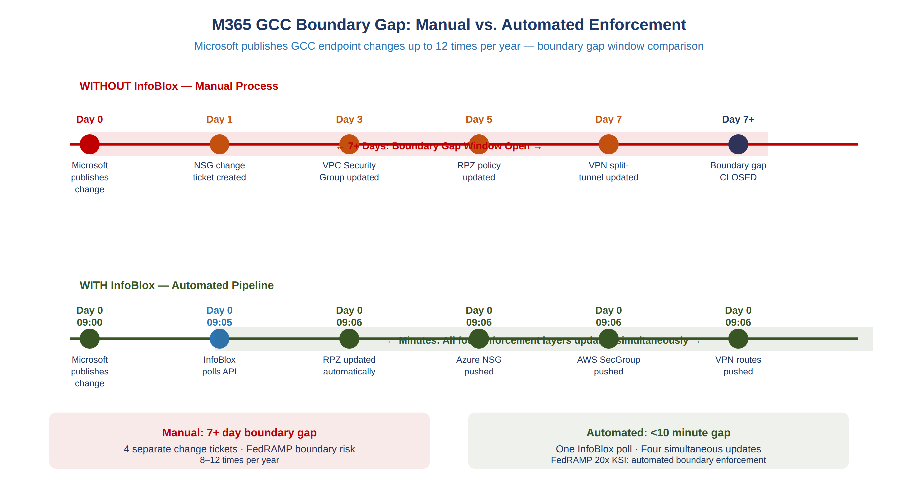{fig-alt="Timeline comparison showing WITHOUT InfoBlox: Microsoft publishes endpoint change on Day 0, four separate change tickets take 7 or more days to close the boundary gap. WITH InfoBlox: same Day 0 change triggers InfoBlox API poll and all four enforcement layers (RPZ, Azure NSG, AWS Security Groups, VPN split-tunnel) update simultaneously within minutes. FedRAMP 20x KSI: automated boundary enforcement." width="100%"}

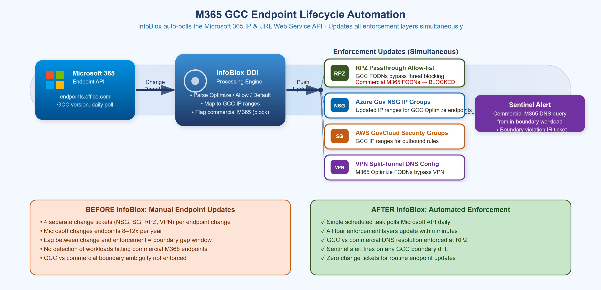{fig-alt="Pipeline diagram showing Microsoft 365 endpoint API on left flowing through InfoBlox processing center to four simultaneous enforcement outputs: RPZ passthrough, Azure NSG, AWS Security Groups, and VPN split-tunnel" width="100%"}

Microsoft publishes M365 endpoint changes (IP ranges + FQDNs) via the Office 365 IP and URL Web Service API. For GCC Moderate specifically, Microsoft publishes a separate GCC endpoint list — the commercial and GCC IP ranges are different and must not be mixed. A workstation accidentally reaching a commercial Microsoft 365 endpoint instead of the GCC endpoint is a **FedRAMP boundary violation**.

InfoBlox provides the automated enforcement pipeline:

1. **Daily poll** of the Microsoft M365 GCC endpoint API (version-change detection)
2. **RPZ passthrough allow-list** — GCC FQDNs explicitly allowed through threat blocking
3. **RPZ block list** — commercial M365 FQDNs (non-GCC) blocked at DNS layer
4. **Azure NSG IP Group** update — GCC Optimize IP ranges pushed to Azure Government
5. **AWS GovCloud Security Group** update — GCC IP ranges for outbound rules
6. **VPN split-tunnel DNS** — M365 Optimize FQDNs route via local interface, not VPN tunnel
7. **Sentinel alert** — any DNS query from an in-boundary workload to a commercial M365 endpoint triggers an IR ticket

::: {.aan-warning}
**Without InfoBlox automation:** Each of Microsoft's 8–12 annual endpoint changes requires four separate change tickets across NSG, Security Groups, RPZ, and VPN config — during which  has a boundary gap window. With InfoBlox, all four update within minutes of the next daily poll of Microsoft's API — a worst-case gap of roughly 24 hours rather than the days-to-weeks a manual four-ticket cycle takes.
:::

### AWS Partnership: BloxOne Runs ON AWS GovCloud {#sec-aws}

{fig-alt="Diagram showing Infoblox Government Cloud (CSO FR2017257053, verify scope and date on the FedRAMP Marketplace) hosted inside AWS GovCloud container, with connections to AWS LZA, Security Hub, ACM, AWS IPAM, and GovCloud Marketplace, plus  environments on the right" width="100%"}

The AWS relationship is the deepest of all three cloud vendors: **InfoBlox's own FedRAMP-authorized cloud service (Infoblox Government Cloud, CSO FR2017257053 — verify current scope and date on the FedRAMP Marketplace) is hosted on AWS GovCloud.** This makes AWS the infrastructure foundation for InfoBlox's SaaS control plane.

::: {.aan-tip}
**Key Point (Path A only):** When  uses the cloud-managed control plane, InfoBlox operates it on AWS GovCloud under **InfoBlox's own FedRAMP Moderate authorization** (CSO FR2017257053) — that CSO's authorization already accounts for its AWS hosting.  inherits the InfoBlox CSO it consumes; it does **not** separately inherit the underlying AWS IaaS authorization (a consumer inherits the service it consumes, not the provider's own supply chain). Under Path B this inheritance does not apply; the agency operates and carries the component itself.
:::

AWS-specific InfoBlox capabilities:

- **AWS Landing Zone Accelerator (LZA) Integration:** LZA is the AWS-published IaC package for FedRAMP-compliant landing zones. InfoBlox integrates as the DNS customization layer, replacing the default Route 53 Resolver-only DNS with Grid Member + RPZ + DNSSEC. FedRAMP 20x KSIs are enforced via SCP + InfoBlox RPZ policy.
- **AWS Security Hub:** InfoBlox RPZ block events flow natively to Security Hub findings and correlate with GuardDuty detections.
- **ACM Private CA Integration:** InfoBlox auto-creates DNS validation CNAME records for ACM certificate issuance; ACM PCA certificate expiry is tracked in InfoBlox Certificate Tracker.
- **AWS IPAM Sync:** AWS IPAM pool allocations are imported into InfoBlox's AWS-GovCloud Network View — cross-cloud CIDR conflict detection includes native AWS IPAM-managed ranges.
- **AWS GovCloud Marketplace Procurement (Path A):** the cloud-managed offering is procurable via the GovCloud Marketplace against existing EA agreements — no separate IDIQ or procurement action required.

::: {.aan-note}
**Route 53 Private Zone DNSSEC Gap:** AWS Route 53 private hosted zones *cannot* be DNSSEC-signed — this is a documented AWS platform limitation as of 2026. InfoBlox Grid Members sign all internal zones including private SDN segments, closing this gap. This is a key differentiator for FedRAMP SC-20/SC-21 evidence.
:::

### Oracle Cloud / OCI: OPM HRIT Future Integration {#sec-oracle}

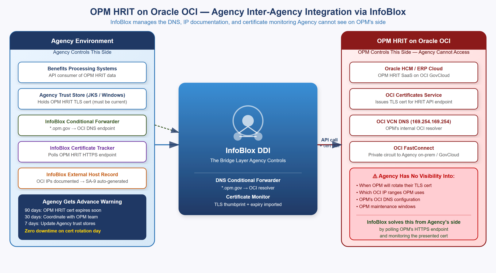{fig-alt="Two-sided diagram with  environment on left and OPM HRIT on Oracle OCI on right, with InfoBlox in the center managing the DNS conditional forwarder, certificate monitor, and IP documentation" width="100%"}

OPM is migrating OPM HRIT (federal HR and benefits processing) to Oracle HCM Cloud on OCI. As OPM's OPM HRIT moves to OCI-hosted SaaS, 's integration path changes from a mainframe handoff to a cloud API call from 's environment to OPM's OCI-hosted service endpoints.

**The challenge:** OPM controls their OCI tenancy.  has no visibility into OPM's certificate rotation schedule, IP range changes, or maintenance windows. When OPM rotates their OPM HRIT API TLS certificate without 's trust stores being updated, the OPM HRIT API call fails — personnel action feeds stop, benefits enrollment breaks.

**InfoBlox manages 's side of the integration:**

| Integration Layer | InfoBlox Capability |
|---|---|
| DNS resolution | Conditional forwarder: `*.opm.gov` → OCI DNS endpoint; InfoBlox resolves from  network |
| IP documentation | OPM HRIT OCI IPs imported as external host records (read-only OCI Network View); SA-9 table auto-generated |
| Certificate monitoring | InfoBlox Certificate Tracker polls OPM HRIT HTTPS endpoints; captures TLS cert thumbprint + expiry |
| Expiry alerting | 90/30/7-day alerts give  advance notice of OPM cert rotation |
| Trust store prep | New OPM cert thumbprint pre-staged in InfoBlox before rotation day — zero-downtime update |

: OPM HRIT Integration via InfoBlox {.striped .hover}

::: {.aan-important}
**The OPM HRIT Pattern Repeats:** OPM HRIT on OCI is the first of many federal inter-agency SaaS integrations (OPM, DHS, IRS, VA are all moving shared services to cloud SaaS). InfoBlox gives  the monitoring layer it needs for every inter-agency dependency: conditional DNS forwarders, Certificate Tracker, and external host records — from 's side, without requiring API access to the partner agency's cloud tenancy.
:::

---

## Certificate Management and Cloud PKI Integration {#sec-certs}

Software Defined Networking eliminates IP address broadcasts but creates a new requirement: in an SDN environment where workloads are ephemeral and IPs change frequently, every service-to-service call must be mutually authenticated with certificates. Certificate subject names (CN and SAN fields) must match DNS names registered in the DNS system — which InfoBlox manages. InfoBlox is therefore the natural integration point for certificate lifecycle management. This is not a convenience pairing: certificate issuance is itself a naming-plane function — CAA records govern which CAs may issue for a zone, and ACME DNS-01 validation proves domain control through the DNS the Grid is authoritative for. The full cryptographic-identity architecture built on this substrate is [Vol I Book 03](Vol_I_Book_03_OrgComp_Certificates_Tokens_Cryptographic_Identity.qmd).

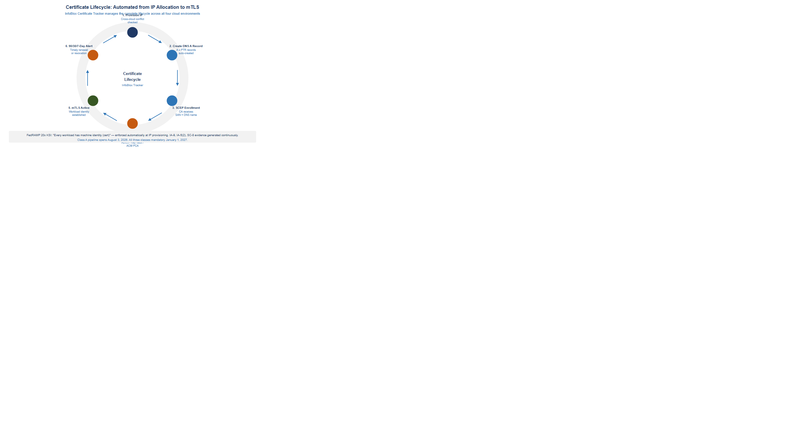{fig-alt="Circular lifecycle wheel showing six stages: 1 Provision IP with cross-cloud conflict check, 2 Create DNS A Record automatically, 3 SCEP Enrollment to CA, 4 CA Signs Cert binding SAN to DNS name, 5 mTLS Active establishing workload identity, 6 90/30/7-day alert triggering timely renewal. FedRAMP 20x KSI: every workload has machine identity enforced automatically at IP provisioning." width="100%"}

### The Certificate Lifecycle in a Multi-Cloud SDN Environment {#sec-cert-lifecycle}

The complete certificate lifecycle for a cloud workload follows this sequence:

1. VM or container provisioned by VCF Automation, Terraform, or cloud-native IaC
2. InfoBlox IPAM allocates an IP from the correct Network View (cross-cloud conflict-checked)
3. InfoBlox Grid automatically creates a DNS A record: `workload-name.environment. → IP`
4. Workload bootstrap sends SCEP or EST enrollment to the agency CA using the DNS name as the certificate SAN
5. CA (ADCS, Azure Key Vault with SCEP, AWS ACM Private CA) issues a certificate binding the SAN to the workload
6. InfoBlox Certificate Tracker receives the certificate thumbprint, expiry, and issuing CA, binding it to the IP host record
7. mTLS is active: the workload presents the certificate to authenticate to other services
8. 90/30/7 days before expiry, InfoBlox Certificate Tracker generates alerts for timely renewal

### Integration with Each Cloud Certificate Manager {#sec-cert-platforms}

| Platform | Integration Method | InfoBlox Role |
|---|---|---|
| **ADCS (On-Prem)** | SCEP/EST connector; InfoBlox SCEP auto-enrollment | Triggers enrollment on IP host record creation; binds cert thumbprint to IP record |
| **Azure Key Vault (GCC)** | Azure Key Vault REST API polling | Imports cert metadata; correlates cert to Azure VM NIC IP; alerts on expiry |
| **AWS ACM Private CA** | ACM API; DNS validation CNAME auto-creation | Creates ACM validation CNAMEs in Grid; tracks ACM PCA cert expiry |
| **Oracle OCI Certificates** | HTTPS endpoint polling (no OCI API needed) | Imports OPM HRIT endpoint cert thumbprint; 90/30/7-day alerts to  team |
| **Keyfactor / Sectigo CLM** | Bidirectional API integration | InfoBlox as DNS name SSOT for cert SAN validation; CLM uses InfoBlox IP ranges for discovery scanning |

: Certificate Manager Integrations {.striped .hover}

::: {.aan-tip}
**Zero Trust Enabler:** Certificate-to-IP binding in InfoBlox is the technical foundation of 'never trust, always verify' at the network layer. When every IP host record carries a certificate thumbprint and expiry date, the network infrastructure itself becomes identity-aware — a core requirement of CISA's Zero Trust Maturity Model Networks pillar at Advanced/Optimal level.
:::

::: {.aan-note}
**Cross-Book Link — NAC Endpoints and DNS/Certificate Binding (Vol I Books 02 and 03):**
The DNS A-record + SCEP certificate compound provisioning described above applies to **cloud workloads** (VMs and containers). For **NAC-enrolled endpoint devices** — laptops, workstations, and managed endpoints that authenticate via 802.1X EAP-TLS — the same compound pattern applies but is triggered differently:

1. **Intune/SCEP enrollment** (covered in [Vol I Book 02](Vol_I_Book_02_OrgComp_Network_Access_Control_802_1X.qmd)) issues the machine certificate with `CN={{DeviceName}}` and SAN bound to the device's Entra ID FQDN.
2. **DNS A/PTR record** for the endpoint should be confirmed or created in InfoBlox at DHCP lease assignment — binding the device's DNS hostname (from Entra ID) to the DHCP-assigned IP address in the IPAM record.
3. Together, steps 1 and 2 produce a device where **name, address, and key are bound at admission** — the same compound guarantee that workload provisioning achieves, extended to the endpoint population.

This linkage — that every NAC-admitted device carries both a DNS hostname and a machine certificate, and that InfoBlox holds the authoritative binding record — is the shared foundation of [Vol I Book 02](Vol_I_Book_02_OrgComp_Network_Access_Control_802_1X.qmd) (NAC/802.1X) and [Vol I Book 03](Vol_I_Book_03_OrgComp_Certificates_Tokens_Cryptographic_Identity.qmd) (Cryptographic Identity). The design decision for this binding must be validated with OIS.
:::

---

## Subdomain Strategy and Namespace Design {#sec-subdomain}

A unified DDI control plane governs DNS only as well as the namespace it manages. InfoBlox can enforce policy, automate lifecycle, and generate compliance evidence across every zone it is authoritative for — but the structure of those zones determines whether the platform scales cleanly or accumulates the same sprawl it was deployed to fix. Subdomain strategy is the architectural decision that makes the DDI investment operationally sustainable.

In modern hybrid multi-cloud environments, DNS is a **control plane** — not merely a name-to-IP directory. The namespace structure determines security policy scope (which RPZ rules apply to which services), certificate coverage (what wildcards are valid and at what depth), split-horizon resolution boundaries (which records are private vs. public), and the granularity of observability (whether a DNS query log entry identifies a cloud, environment, and service from the FQDN alone). Without deliberate namespace design, the outcome is DNS sprawl, certificate chaos, and opaque logs.

### Why Legacy DNS Fails in Multi-Cloud {#sec-subdomain-why}

Legacy DNS was designed for a flat environment: one zone, manual A records, a single trust boundary. (The full strategic argument — why per-CSP DNS sync fails structurally, the AD DNS departure, the certificate-DNS surface, and DNS as the Layer 7 application surface — is developed in the companion whitepaper [Next Generation DNS](../whitepapers/infoblox-hybrid-dns-unified-ddi.qmd); this book owns the landing-zone build and control closure.)  now operates across four cloud environments with dynamic workloads, ephemeral IPs, and a security model where every service-to-service call is mutually authenticated by certificate. Three failure modes emerge without namespace governance:

**Certificate chaos.** Wildcard certificates (`*.`) match one label to the left of the wildcard per RFC 6125 — they cover `api.` but not `prod.api.`. Without consistent subdomain depth, every new workload either requires a dedicated SAN certificate or causes a multi-SAN certificate to be manually updated. Structured subdomains enable structured wildcards: `*.api.` covers all API workloads at one wildcard.

**Uncontrolled split-brain.** When internal and external DNS are not deliberately separated, the same FQDN resolves to different addresses by accident. Controlled split-horizon DNS is the same mechanism — intentional. Internal users get private resolution; external users get public resolution; InfoBlox view policy enforces both. Accidental split-brain is a misconfiguration; deliberate split-horizon is a security boundary.

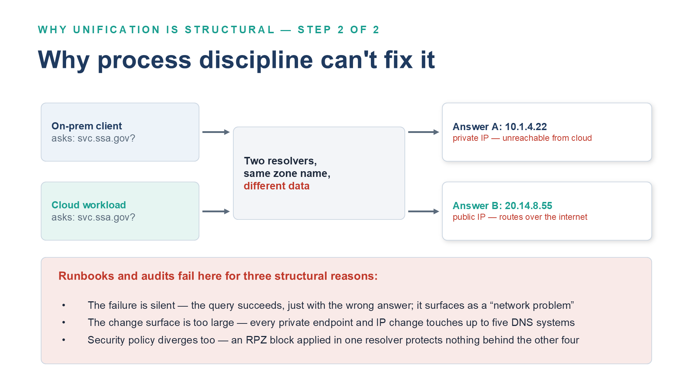{fig-alt="Diagram showing split-brain DNS failure. Left: an on-prem client and a cloud workload both ask for svc.. Center: two resolvers with the same zone name but different data. Right: Answer A returns 10.1.4.22, a private IP unreachable from cloud; Answer B returns 20.14.8.55, a public IP that routes over the internet. Red panel below lists three structural reasons runbooks and audits fail: the failure is silent — the query succeeds with the wrong answer and surfaces as a network problem; the change surface is too large — every private endpoint and IP change touches up to five DNS systems; and security policy diverges too — an RPZ block applied in one resolver protects nothing behind the other four. White background. Source: Book 01 InfoBlox DDI Briefing deck, Date Code 2026-07-07 09:11 ET." width="100%"}

**Opaque observability.** When all workloads resolve through undifferentiated names, a DNS query log cannot identify the cloud, environment, or service from the FQDN. `prod.api.azure.` is self-documenting. `svc-443-node7.` is not.

###  Namespace Structure {#sec-subdomain-structure}

The following hierarchy applies five patterns — functional, geographic, environment, cloud-provider, and hybrid split-horizon — to 's four-environment topology. Each leaf is a separately delegated zone in InfoBlox with its own DNSSEC signing policy, RBAC delegation, and RPZ attachment.

```
                           (root — public, DNSSEC-signed, minimal records)
├── internal.              (split-view — private resolution only, never public)
│   ├── vmw.internal.     (VMware VCF on-premises workloads)
│   ├── azure.internal.   (Azure Government private endpoints, Arc-enrolled servers)
│   ├── aws.internal.     (AWS GovCloud VPC workloads)
│   └── oci.internal.     (Oracle OCI / OPM HRIT resources)
├── api.                   (backend services — split-view or public)
│   ├── prod.api.
│   └── staging.api.
├── auth.                  (Entra ID, SAML, OIDC endpoints)
├── vc.                    (video conferencing — Pexip, Teams Connector)
├── mgmt.                  (Azure Arc, Intune enrollment, management plane)
└── mon.                   (monitoring — ThousandEyes, Azure Monitor)
```

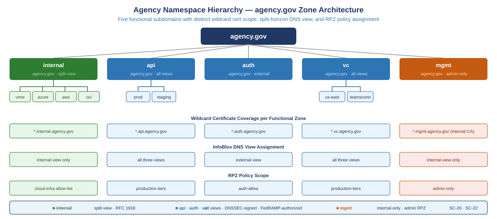{fig-alt="Tree diagram showing  as root with five functional first-level subdomains: internal (split-view, green), api, auth, vc (blue), and mgmt (orange, admin-only). Each L1 zone shows its wildcard cert scope, DNS view assignment, and RPZ policy. Sub-zone pills under internal show cloud platforms vmw/azure/aws/oci; under api show env tiers prod/staging; under vc show geographic nodes us-east and teamsconn." width="100%"}

**Depth guideline:** Prefer three labels or fewer. `prod.api.` is preferable to `us-east.prod.api.` unless geography carries an independent operational meaning (separate certificate, separate RPZ policy, separate routing). Each additional label multiplies certificate scope complexity and diagnostic friction.

### Wildcard Certificate Alignment {#sec-subdomain-certs}

The namespace structure directly determines certificate coverage. Each functional subdomain enables one wildcard covering all workloads in that function:

| Wildcard | Covers | Does Not Cover |
|---|---|---|
| `*.` | `api.`, `vc.`, `auth.` | `prod.api.`, `us-east.vc.` |
| `*.api.` | `prod.api.`, `staging.api.` | deeper labels |
| `*.internal.` | `vmw.internal.`, `azure.internal.` | deeper labels |
| `*.vc.` | all video conferencing endpoints | deeper labels |

: Wildcard certificate scope by namespace level {.striped .hover}

The certificate lifecycle described in [Section -@sec-certs] — SCEP enrollment triggered by InfoBlox IP host record creation — follows this wildcard boundary. When a new workload provisions in `azure.internal.`, InfoBlox creates the DNS record and triggers SCEP enrollment against the Azure GCC private CA, issuing a certificate with a SAN valid under `*.azure.internal.`. The namespace zone determines the CA path; no per-workload certificate configuration is required.

### Split-Horizon DNS — InfoBlox View Configuration {#sec-subdomain-split}

Split-horizon DNS configures InfoBlox to return different answers to the same query depending on the requestor's source network. Internal  users receive private IP addresses; external internet requestors receive public IPs or NXDOMAIN for private-only zones. The application FQDN is identical in both cases — the split is enforced at the InfoBlox view layer, transparent to clients.

InfoBlox DNS views for 's four-environment topology:

| View | Source Networks | Zones Served | Private IPs Exposed |
|---|---|---|---|
| `internal-view` | 10.0.0.0/8, VPN pool CIDRs | `internal.`, `` (private records) | Yes |
| `cloud-internal-view` | Azure VNet CIDRs, AWS VPC CIDRs, OCI VCN CIDRs | `*.internal.`, conditional forwarders to cloud-native DNS | Yes |
| `external-view` | All other sources (internet) | `` public records only, DNSSEC-signed | No |

: InfoBlox DNS view configuration for  {.striped .hover}

The `internal.` zone exists **only** in the `internal-view`. A request from an internet source hits the `external-view`, which has no `internal.` zone — the response is NXDOMAIN. Private IP space never appears in the external view.

**Integration with cloud-native DNS:** Azure Private DNS Zones (e.g., `privatelink.database.windows.net` for SQL managed instances) are reachable from on-premises via conditional forwarders in InfoBlox — queries for `*.privatelink.database.windows.net` are forwarded to the Azure Private DNS Resolver inbound endpoint in 's Azure VNet. AWS Route 53 Resolver inbound endpoints serve the same function for GovCloud VPC private zones. Legacy Active Directory DNS servers forward queries for modern subdomains (`api.`, `vc.`) to InfoBlox via stub zones — AD DNS remains authoritative only for Kerberos and LDAP SRV records.

**M365 GCC boundary enforcement via split-horizon:** The `external-view` resolves M365 endpoints to public Microsoft IPs. The `internal-view` enforces the M365 GCC allow-list via RPZ — clients inside 's network that resolve a Microsoft endpoint not on the current GCC allow-list receive an RPZ block response before any TCP connection is attempted. The split-horizon view is the enforcement boundary; the allow-list is the policy.

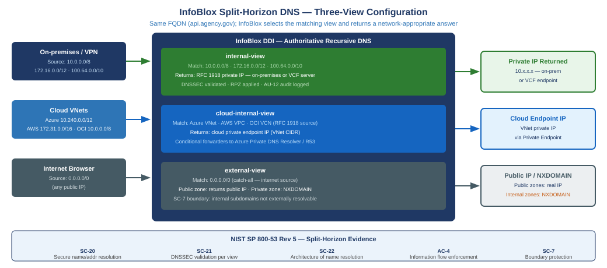{fig-alt="Three-column flow diagram. Left column shows three requestor types: on-premises/VPN (10.0.0.0/8 source), cloud VNets (Azure/AWS/OCI RFC 1918), and internet browsers (0.0.0.0/0). Center InfoBlox DDI box contains three stacked view boxes: internal-view (green, matches private CIDRs, returns RFC 1918 private IP), cloud-internal-view (blue, matches cloud VNet CIDRs, returns cloud private endpoint IP), and external-view (gray, catch-all, returns public IP or NXDOMAIN for private zones). Right column shows three answer boxes with corresponding responses. Footer lists NIST controls SC-20, SC-21, SC-22, AC-4, SC-7." width="100%"}

### IaC and Automation Integration {#sec-subdomain-iac}

The InfoBlox Terraform provider (`infoblox/infoblox`) manages zones, records, and views as infrastructure-as-code. All zone creation and delegation follows the same GitOps pipeline as 's cloud infrastructure.

```hcl
# Functional zone for video conferencing — delegated with RBAC to AV team
resource "infoblox_zone_auth" "vc_zone" {
  fqdn    = "vc."
  view    = "external"
  comment = "Pexip and Teams Connector endpoints"
}

# Blue/green Teams Connector — low TTL for fast cutover
resource "infoblox_cname_record" "teamsconn_active" {
  alias     = "teamsconn.vc."
  canonical = "blue.teamsconn.vc."  # swap to green.teamsconn.vc. for cutover
  view      = "internal-view"
  ttl       = 60
}
```

**vDiscovery naming templates:** InfoBlox vDiscovery continuously scans all four cloud environments and auto-populates DNS records and IPAM entries. The naming template determines which zone receives the auto-populated record:

| Platform | vDiscovery Template | Zone |
|---|---|---|
| VMware vSphere | `{vm_name}.vmw.internal.` | `vmw.internal.` |
| Azure Government | `{resource_name}.azure.internal.` | `azure.internal.` |
| AWS GovCloud | `{instance_name}.aws.internal.` | `aws.internal.` |
| Oracle OCI | `{instance_name}.oci.internal.` | `oci.internal.` |

: vDiscovery naming templates by cloud platform {.striped .hover}

When a new VM provisions in any environment, InfoBlox creates the DNS record in the correct zone, allocates the IPAM entry in the correct Network View, and triggers SCEP enrollment in the correct CA — all from the zone the record belongs to. The namespace is the configuration.

**Kubernetes `external-dns`:** For Kubernetes workloads on any platform, the `external-dns` controller creates and removes InfoBlox DNS records as services come and go. A Service annotated with `external-dns.alpha.kubernetes.io/hostname: payments.api.` results in an A record in `prod.api.` pointing to the load balancer IP — created on Service creation, removed on Service deletion, with no manual DNS management required.

### RPZ Policy Scoping by Subdomain {#sec-subdomain-rpz}

DNS Firewall RPZ policies in InfoBlox attach at the zone level. The subdomain structure determines the security policy granularity:

| Zone | RPZ Policy |
|---|---|
| `` external view | CISA threat intelligence feed + M365 GCC allow-list |
| `vc.` | SIP/H.323 federation allow-list; block unapproved conferencing endpoints |
| `internal.` | Internal-only flag — NXDOMAIN for any external resolution attempt |
| `mgmt.` | Strict: allow-list of management-plane destinations only; block all others |

: RPZ policy attachment by subdomain zone {.striped .hover}

A query resolving through `mgmt.` that does not match the management-plane allow-list returns an RPZ NXDOMAIN before any TCP connection is attempted. The subdomain boundary is the security boundary — without it, RPZ policy must be applied at the individual record level, which is operationally unmanageable at scale.

### Additional NIST Controls from Namespace Design {#sec-subdomain-nist}

The subdomain strategy adds one new control — AC-4 — to the NIST mapping in [Section -@sec-nist] and deepens two rows already present there (SC-22 and SA-9):

| Control | Title | Contribution |
|---|---|---|
| SC-22 | Architecture and Provisioning for Name/Address Resolution Service | Zone hierarchy with delegated authority and view separation enforcing internal/external boundary |
| AC-4 | Information Flow Enforcement | Internal views prevent DNS resolution from cloud environments to unapproved external destinations; RPZ at zone level enforces M365 GCC allow-list |
| SA-9 | External System Services | Conditional forwarders to Azure Private DNS Resolver and AWS Route 53 Resolver are documented zone-level dependencies with per-forwarder audit trail |

: Additional controls from subdomain namespace design {.striped .hover}

---

## DNS-Based Traffic Steering as a DDI Function {#sec-dns-steering}

Global server load balancing has always been a DNS function wearing an appliance badge. When a hardware GSLB appliance decides which data center or cloud region answers a user's request, the mechanism it uses is a DNS response: the appliance acts as an authoritative name server that answers the same query differently depending on endpoint health, requestor topology, and policy weight. Strip away the chassis, and what remains is health-checked, policy-driven authoritative DNS — a control-plane function of the naming and addressing layer, not a data-plane function of any appliance tier.

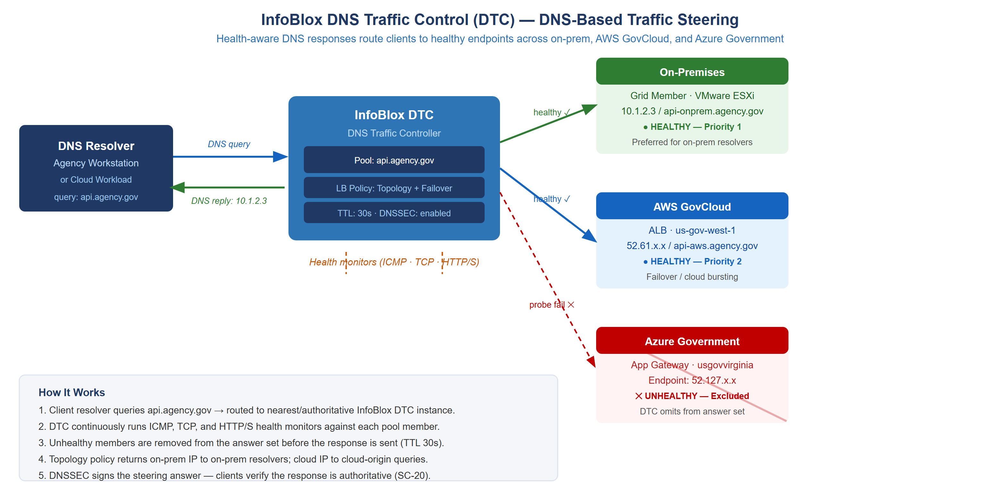{fig-alt="Flow diagram showing a DNS client on the left querying api.; InfoBlox DTC at center checking ICMP/TCP/HTTPS health monitors against three endpoint pools on the right: On-Premises (healthy, priority 1), AWS GovCloud (healthy, priority 2), and Azure Government (unhealthy, excluded from answer set). The DNS response returns the IP of the highest-priority healthy pool member." width="100%"}

Modern DDI platforms implement this function natively. InfoBlox DNS Traffic Control (DTC) attaches health monitors (ICMP, TCP, HTTP/S) to pools of service endpoints and computes each A/AAAA response at query time from pool member health, topology rules, and weighted ratios — a degraded endpoint simply stops appearing in answers, within one TTL, with no traffic ever passing through the Grid Member. The cloud providers expose the same function as DNS routing policy: Route 53 weighted, latency-based, geolocation, and failover routing policies; Azure Traffic Manager profiles; OCI Traffic Management steering policies. In every case the steering decision executes in the resolution path, and the "load balancer" is the answer itself.

This matters to the landing zone because the hardware application-delivery tier is dissolving, and its two halves land in two different places. The *local* half — reverse proxy, TLS offload, per-request distribution — dissolves into cloud-native delivery services provisioned in the landing zone (Azure Application Gateway and Front Door, AWS ALB/NLB, OCI Load Balancer), deployed per workload through the same IaC pipeline as everything else in this document. The *global* half — steering users between sites, regions, and clouds — dissolves into the DNS control plane this book builds. Neither half survives as an appliance tier to migrate; the forty-year history of how that tier accumulated, and why SD-WAN retires the WAN edge rather than replacing the load balancer, is told in [Vol I Book 05](Vol_I_Book_05_OrgComp_Network_Modernization.qmd).

Because global steering is DNS, every property this document establishes for the DDI plane applies to it automatically. Steering responses are served from zones the Grid signs, so DNSSEC covers the steering answer (SC-20). Steering configuration is managed as code through the same Terraform provider that manages zones and records (CM-2). Every steering decision is a logged DNS response in the unified syslog stream — a regional failover event is not an invisible appliance state change but an auditable sequence of answer changes with timestamps (AU-12, CA-7). And split-horizon views scope steering policy exactly as they scope every other record: internal requestors can be steered to private endpoints while external requestors are steered across public ones, from the same LBDN object.

The practical consequence for the buildout roadmap: when application teams ask where global traffic steering lives in the target architecture, the answer is not "procure a GSLB replacement." The answer is that the capability is already present in the DDI layer deployed in Phases 1–4 — it is a policy configuration on the naming plane, inheriting the DNSSEC, IaC, and audit posture the landing zone already established.

---

## NIST SP 800-53 Rev 5 Control Mapping {#sec-nist}

The following table maps InfoBlox DDI landing zone capabilities to specific NIST SP 800-53 Rev 5 controls. A single InfoBlox deployment provides evidence across 15 control rows covering 17 distinct NIST SP 800-53 Rev 5 controls that would otherwise require separate evidence collection from four separate platforms.

| Control | What InfoBlox DDI Provides | Evidence Artifact | Satisfies |
|---|---|---|---|
| **SC-20** | DNSSEC signing of all DNS zones including internal SDN segments | DNSSEC key log; DS record at .gov registrar | SC-20 |
| **SC-21** | Recursive DNSSEC validation on all Grid Members; RPZ with CISA Protective DNS feed | RPZ hit log → SIEM; validation failure alert | SC-21 |
| **SC-22** | Network Insight auto-generates DDI topology; Grid Master-to-Member map | Network Insight export; SSP Appendix J | SC-22 |
| **SC-7** | RPZ enforces domain-level egress blocking across all four SDN environments; DNS exfiltration detection | RPZ block rate dashboard; exfil alert config | SC-7, SC-7(7) |
| **SC-8** | mTLS between workloads via certificate-to-IP binding; SCEP/EST enrollment before service traffic | Certificate Tracker report; mTLS config | SC-8, SC-8(1) |
| **CM-8** | Every IP host record = CM-8 inventory item; SDN connector enriches with VM name, OS, owner, cloud region | IP host record export to ServiceNow CMDB | CM-8, CM-8(1) |
| **CM-2** | IaC integration creates IP+DNS+cert records atomically and destroys them on decommission | Terraform state; IP lifecycle audit log | CM-2, CM-6 |
| **SA-9** | External DNS registered as governed external services; all forwarded queries logged; OPM HRIT documented | Forwarder config export; SSP SA-9 table | SA-9 |
| **IA-5(2)** | Certificate Tracker links cert thumbprint+expiry+issuer to IP host record; ADCS/Key Vault/ACM/OCI cert metadata | Cert inventory report; expiry alert log | IA-5(2) |
| **IA-9** | Every SDN workload receives a certificate via SCEP/EST automation at provisioning time | SCEP enrollment log; cert-to-IP binding report | IA-9 |
| **AU-2** | DNS query events, DHCP lease events, IP allocation events, and cert enrollment events defined and logged | SIEM event catalog; AU-2 event list | AU-2 |
| **AU-12** | Single syslog stream from all Grid Members across all four SDN environments; RFC 5424 format; 3-year retention | SIEM dashboards; retention policy | AU-12 |
| **IR-4** | RPZ block events auto-generate SIEM IR tickets; DNSSEC failure triggers SOC alerts; DNS exfil detection | IR playbook; RPZ alert→ticket pipeline | IR-4, IR-5 |
| **SI-3** | DNS-layer malware blocking via RPZ prevents resolution of C2 domains, ransomware, phishing | RPZ block count by threat category | SI-3 |
| **PL-8** | Unified DDI architecture in SSP; InfoBlox FedRAMP ATO cited as inherited control for DDI layer | SSP Section 13 architecture narrative | PL-8 |

: NIST SP 800-53 Rev 5 Control Coverage {.striped .hover}

::: {.aan-important}
**Closure Necessity — SC-20 / SC-21 (authoritative DNS).** SC-20 requires the system to *provide* origin authentication and integrity verification artifacts with authoritative name resolution responses; SC-21 requires requesting systems to *perform* validation on the responses they receive. Both controls presuppose an authoritative naming plane, because there is nothing else that can close them: you cannot attest authoritative name resolution without an authoritative resolver. (SC-22 — the fault-tolerant, role-separated resolution architecture — is closed by the same Grid, but its closure-necessity anchor is registered for the cross-cloud build-out in Vol VIII rather than here.) No scanner creates a source of truth — a scanner, a compliance dashboard, or a conformance tool can only measure drift *from* a source of truth that must already exist. The DNSSEC-signed, view-separated Grid described in this document is not one implementation option among several; it is the class of mechanism these controls name.
:::

---

## CISA Zero Trust Maturity Model v2.0 Alignment {#sec-ztmm}

CISA's Zero Trust Maturity Model v2.0 (April 2023) defines five pillars and three cross-cutting capabilities across four maturity stages: Traditional → Initial → Advanced → Optimal.

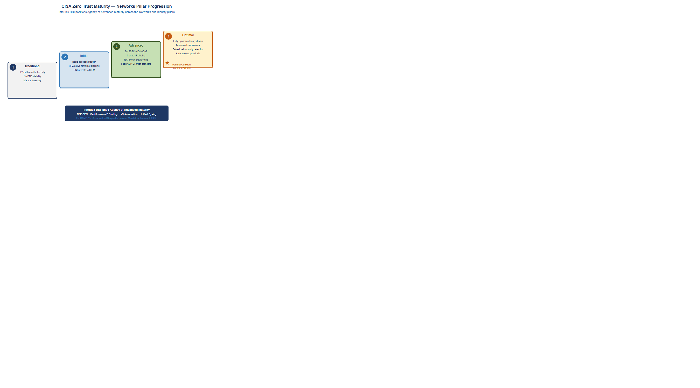{fig-alt="Staircase diagram showing four maturity levels. Traditional: IP and port firewall rules only, no DNS visibility, manual inventory. Initial: Basic app identification, RPZ active for threat blocking, DNS events to SIEM. Advanced: DNSSEC plus DoH/DoT, cert-to-IP binding, IaC-driven provisioning, FedRAMP ConMon standard — marked with Federal ConMon Standard Posture star. Optimal: Fully dynamic identity-driven, automated cert renewal, behavioral anomaly detection, autonomous guardrails. InfoBlox DDI lands  at Advanced maturity through DNSSEC, certificate-to-IP binding, IaC automation, and unified syslog. FedRAMP 20x: Advanced equals AO-signable posture, mandatory January 1 2027." width="100%"}

### Networks Pillar (Deepest Alignment) {#sec-zt-networks}

| CISA ZT Network Requirement | InfoBlox DDI Implementation | ZT Maturity Level |
|---|---|---|
| Encrypt DNS traffic (DoH/DoT) | Grid Members support DoH/DoT for client queries; DNSSEC validates response integrity end-to-end | Advanced → Optimal |
| Implement Protective DNS | RPZ with CISA Protective DNS feed + TIDE commercial threat intel; blocks C2, phishing, DNS tunneling across all SDN environments | Initial → Advanced |
| DNS visibility for all workloads | Unified syslog from all Grid Members; every DNS query logged with client IP, query name, response, latency | Initial → Advanced |
| IPAM as segmentation enforcement | Network Views enforce CIDR segregation; IaC cannot allocate overlapping CIDRs; segment-level records map to NSX-T security groups and Azure NSGs | Advanced |
| SDN micro-segmentation integration | NSX-T security groups can reference InfoBlox IPAM tags (workload classification, owner) as dynamic membership criteria | Advanced → Optimal |
| Certificate-based network authentication | Certificate Tracker ensures every IP host record has a bound certificate; IP reputation replaced by certificate identity | Advanced → Optimal |

: CISA Zero Trust Networks Pillar Alignment {.striped .hover}

### Identity Pillar (Network-Layer Support) {#sec-zt-identity}

InfoBlox supports the Identity pillar through certificate lifecycle management — the mechanism by which workload identity is established at the network layer:

- SCEP/EST automation issues certificates to every new workload at provisioning time, establishing machine identity before the first connection
- Certificate-to-IP binding enables network devices to verify workload identity from the DNS/IPAM layer without agent deployment
- Certificate expiry alerting prevents identity credential expiration — a common cause of authentication outages

### Cross-Cutting: Visibility and Analytics {#sec-zt-visibility}

InfoBlox contributes three telemetry streams to CISA's Visibility and Analytics capability:

- **DNS query telemetry:** every DNS resolution event from every SDN workload, with client IP, query type, response, latency, and RPZ action
- **DHCP/IP event telemetry:** every IP allocation, renewal, and release with device metadata
- **Certificate telemetry:** every expiry warning and enrollment event

All three streams flow to the SIEM in consistent syslog format — enabling correlation across DNS, IP, and certificate events that individually appear innocuous but together may indicate lateral movement or data exfiltration.

### Cross-Cutting: Automation and Orchestration {#sec-zt-automation}

InfoBlox's IaC integrations directly enable the CISA Automation and Orchestration capability:

- Network resource provisioning (IP, DNS, cert) is automated in IaC pipelines — no manual steps that bypass policy
- VCF 9.1 native InfoBlox integration automates DDI for VMware workloads from day one
- RPZ updates are automated from threat intelligence feeds — human review required only for false positive exceptions

---

## FedRAMP Boundary Enforcement {#sec-boundary}

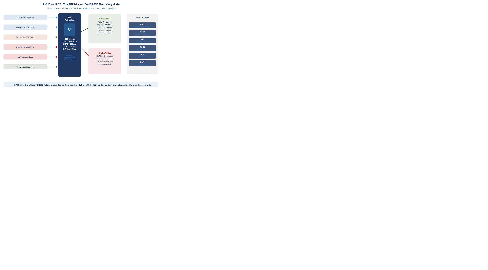{fig-alt="Traffic checkpoint diagram showing DNS queries entering from left (teams.microsoft.com GCC allowed, sharepoint.com GCC allowed, commercial M365 blocked, malware C2 domain blocked, DNS tunnel blocked, approved vendor allowed). InfoBlox RPZ gate in center checks against GCC allowlist, blocklist, CISA Protective DNS feed, TIDE threat intelligence, and DNS tunnel detection. Allowed queries reach authorized services. Blocked queries receive NXDOMAIN and trigger Sentinel alerts and IR tickets. NIST controls covered: SC-7, SC-21, SI-3, AU-12, IR-4, CA-7. FedRAMP 20x: RPZ hit logs exported as machine-readable JSON via WAPI." width="100%"}

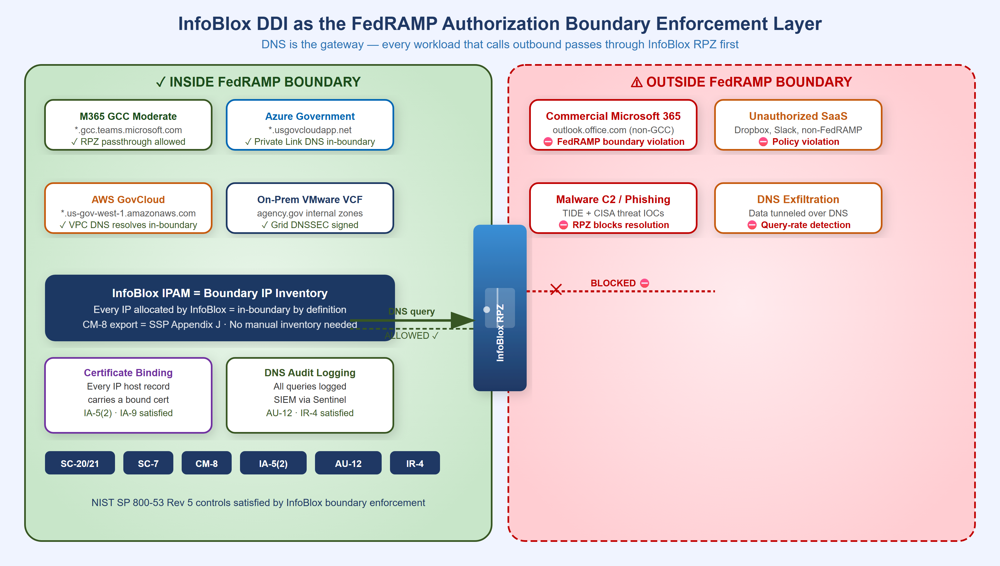{fig-alt="Fortress-wall style diagram with FedRAMP-authorized services inside the boundary on the left and unauthorized services on the right; InfoBlox DNS/RPZ acts as the enforcement gate between them" width="100%"}

InfoBlox DDI enforces the FedRAMP authorization boundary at three layers simultaneously:

**Layer 1 — IP inventory feeds the boundary and asset documentation.** A FedRAMP authorization boundary is defined by its components, services, interconnections, and data flows — **not** by IP address ranges (SaaS components and external services inside the boundary hold no agency IP). What InfoBlox IPAM provides is the authoritative record of every *agency-addressed* asset inside the boundary: the CM-8 IP/asset inventory export is a primary input to the boundary's component inventory and network diagram, reconciled against the service and interconnection catalog rather than standing in for it.

::: {.aan-important}
**Closure Necessity — CM-8 (system component inventory).** CM-8 requires an inventory that accurately reflects the system and includes all components within its boundary. You cannot inventory what you cannot enumerate — and the only layer that observes every component at the moment it joins the network is the addressing plane, because every component must take an address before it can do anything else. Discovery scanners enumerate what answered a probe during a scan window; an IPAM database enumerates what was *allocated*, which is the population the scanner's results must be reconciled against. Without the enumeration substrate, a scan result is a sample with no denominator. DHCP fingerprinting extends the same substrate downward to device identity at the moment of lease — the port-level device inventory built on it is the subject of [Vol I Book 02](Vol_I_Book_02_OrgComp_Network_Access_Control_802_1X.qmd).
:::

**Layer 2 — DNS = Boundary Enforcement at Egress.** Every DNS query from every workload passes through the InfoBlox Grid Member (because all VPC/VNet/NSX-T DHCP Options point to it). InfoBlox enforces:

- RPZ blocks commercial M365 endpoints (prevents FedRAMP data reaching non-GCC Microsoft infrastructure)
- RPZ blocks non-FedRAMP SaaS FQDNs (prevents workloads from reaching unauthorized cloud services)
- Conditional forwarders for external services generate the SA-9 documentation automatically
- DNSSEC validation required — DNS spoofing that could redirect traffic outside the boundary is rejected
- Query logging for all workloads — AU-12 evidence: every external communication visible in DNS logs

**Layer 3 — Certificate Binding = Boundary Identity.** Only IP host records within the InfoBlox IPAM database can receive certificates via SCEP/EST enrollment automation. Certificate possession = boundary membership — a powerful assertion for boundary documentation and IA-9 satisfaction.

---

## FedRAMP Moderate and FedRAMP 20x Controls {#sec-fedramp}

### FedRAMP Moderate: The Evidence Package {#sec-fedramp-moderate}

InfoBlox DDI produces a complete evidence package for FedRAMP Moderate annual assessments without manual evidence collection:

| Control Family | Evidence Source | Format | Collection |
|---|---|---|---|
| SC-20 / SC-21 | InfoBlox DNSSEC key rotation log; RPZ hit log | Grid audit log export | Automated |
| CM-8 | InfoBlox IP host record database | CSV / ServiceNow CMDB sync | API export on demand |
| IA-5(2) | InfoBlox Certificate Tracker | Certificate inventory report | API export on demand |
| AU-2 / AU-12 | SIEM fed by InfoBlox syslog stream | SIEM query results | Pre-built SIEM dashboards |
| IR-4 | SIEM IR playbook execution logs; RPZ alert ticket history | ServiceNow tickets | ITSM integration |
| SA-9 | InfoBlox External DNS Server config; SSP SA-9 table | InfoBlox config export | Grid config snapshot |
| SC-22 | InfoBlox Network Insight topology report | PDF / JSON topology export | Network Insight scheduler |

: FedRAMP Moderate Evidence Package {.striped .hover}

### FedRAMP 20x: Automated KSI Enforcement {#sec-fedramp-20x}

FedRAMP published its **Consolidated Rules for 2026** on June 25, 2026, establishing a single stable ruleset that supersedes the 20x pilot framework. Three classification tiers replace the single 20x path: **Class A** (simplest CSPs, opens August 3, 2026), **Class B** and **Class C** (open August 31, 2026). The Consolidated Rules become **mandatory for all certified systems on January 1, 2027**. New Rev5 certifications will no longer be accepted after June 11, 2027. Machine-readable rules are published in JSON format via GitHub, enabling AI agent integration and automated compliance verification.

For 's multi-environment landing zone, InfoBlox DDI is well-positioned for the **Class B or Class C pathway** given its multi-cloud scope. The WAPI REST interface delivers structured JSON evidence for every KSI — no manual assembly required.

FedRAMP 20x replaces periodic evidence collection with continuously-verified Key Security Indicators enforced by infrastructure-as-code guardrails:

| KSI-supporting capability | InfoBlox Enforcement | Automated? |
|---|---|---|
| All DNS traffic encrypted or integrity-protected | DNSSEC on all zones; DoH/DoT endpoint on Grid Members | **Yes** — Grid policy |
| Protective DNS for all workloads | Grid Member = resolver for all VPC/VNet DHCP options; RPZ active | **Yes** — DHCP Options + RPZ |
| IP address inventory current and complete | API connectors sync in near-real-time; CM-8 report on demand | **Yes** — API connectors |
| No CIDR overlap between environments | Terraform InfoBlox provider blocks overlapping allocation at request time | **Yes** — Terraform |
| Certificate expiry monitored and auto-renewed | Certificate Tracker 90/30/7-day alerts; SCEP/EST auto-renewal workflow | **Yes** — Certificate Tracker |
| Every workload has machine identity (cert) | SCEP/EST enrollment triggered at IP host record creation | **Yes** — Auto-enrollment |
| DNS change events auditable | All DNS/DHCP/IP changes logged; syslog to SIEM in real time | **Yes** — Syslog + SIEM |

: FedRAMP 20x KSI Automation {.striped .hover}

::: {.aan-tip}
**FedRAMP 20x Positioning:** InfoBlox DDI positions  ahead of the FedRAMP 20x transition. The machine-readable IP inventory (WAPI), automated KSI enforcement via IaC, and real-time SIEM integration align directly with FedRAMP 20x's shift from periodic assessment to continuous automated verification.
:::

---

## Inter-Agency SaaS Integration: The OPM HRIT Template {#sec-interagency}

OPM HRIT on OCI is the **first of many** federal inter-agency SaaS integrations. OPM, , DHS, IRS, and VA are all moving shared services to cloud-hosted SaaS platforms. The pattern repeats every time:

1. Agency A moves a shared service to cloud SaaS (OPM HRIT → OCI)
2. Agency B () becomes an API consumer of that SaaS
3. Agency B has no visibility into Agency A's certificate rotation, endpoint changes, or IP range changes
4. InfoBlox gives Agency B the monitoring layer it needs — **from 's side, without requiring access to the partner agency's cloud**

**InfoBlox's inter-agency integration toolkit:**

- **Conditional DNS forwarders** — always know where the service resolves, even when the partner agency changes DNS
- **Certificate Tracker endpoint polling** — always know when the partner's TLS cert will expire
- **External host records** — always document the partner's IP ranges for SA-9 without API access to their cloud
- **RPZ passthrough entries** — ensure InfoBlox RPZ does not block the inter-agency API calls
- **Sentinel alerts** — detect if the inter-agency connection's certificate has changed unexpectedly (potential MITM)

---

## System Component Inventory — IPAM, CMDB, and the CM-8 Gap {#sec-cmdb}

### IPAM Is Not an Asset Manager

InfoBlox IPAM is the **network-layer addressing authority**: every IP allocation, every DNS hostname, every DHCP lease, every machine certificate binding — from this plane's point of view. It sees every device that has an IP address. It does not see:

- What software is installed on a device
- Whether a device's OS is patched
- The organizational owner or data classification of a workload
- The FedRAMP boundary membership of an asset
- Relationships between assets (which application runs on which server, which server supports which system)
- Non-IP assets (smart cards, HSMs, air-gapped devices, physical media)

NIST SP 800-53 **CM-8 (System Component Inventory)** requires an inventory that includes hardware, software, firmware, and system interconnections — not just IP address records. InfoBlox satisfies the addressing dimension of CM-8; it does not satisfy the full control without a complementary CMDB.

 currently operates **four asset management surfaces** with no unified coordinator:

| Surface | Scope | What It Misses |
|---|---|---|
| **Microsoft Intune** | Windows, macOS, iOS, Android managed endpoints | AWS EC2, OCI workloads, non-enrolled VMware VMs, network devices, IoT |
| **Azure Arc (servers)** | Windows Server + Linux on any cloud/on-prem — Arc-enrolled only | Workloads not explicitly Arc-onboarded; OCI-native resources; non-server assets |
| **AWS Systems Manager (SSM)** | AWS EC2 instances (agent-installed) | Azure, OCI, on-prem VMs; endpoint devices; network gear |
| **VMware vCenter** | On-premises VMware VMs and ESXi hosts | Cloud-native workloads; endpoints; network devices |

InfoBlox IPAM **bridges these surfaces at the IP layer** — every asset managed by any of the four platforms above will have a DHCP/DNS record in InfoBlox. But correlating IP records to organizational ownership, FedRAMP boundary membership, patch state, and software inventory requires a platform above the addressing layer.

::: {.aan-warning}
## Open Decision — Asset Manager / CMDB Platform

 has not yet selected a unified Asset Manager / CMDB for cross-platform inventory coordination. **This decision must be made by the CIO Office with OIS input** — it is architecturally significant (determines the CM-8 evidence strategy) and has procurement implications. The requirements below define what the selected platform must satisfy. Specific product selection is pending agency review.
:::

---

### Requirements for the Asset Manager / CMDB {#sec-cmdb-requirements}

The following requirements must be satisfied by whichever platform  selects. Requirements are grouped by compliance driver. **All requirements must be satisfied regardless of product selection.**

| ID | Requirement | Control | Priority |
|---|---|---|---|
| **R-01** | **Cross-platform automated discovery** — must ingest asset records from Intune, Azure Arc, AWS Systems Manager, OCI Management Agent, VMware vCenter, InfoBlox IPAM, and network device management platforms without manual data entry | CM-8 | Must |
| **R-02** | **IP/IPAM correlation** — every asset record must link to an InfoBlox IPAM record; the IP address, DNS FQDN, and DHCP lease state from InfoBlox are the authoritative network-layer identity for each asset | CM-8, SC-22 | Must |
| **R-03** | **Machine certificate binding** — asset records must carry the machine certificate thumbprint and expiry for managed devices, populated from Intune SCEP enrollment (endpoint devices) and from InfoBlox Certificate Tracker (workloads) | IA-5, SC-12, SC-17 | Must |
| **R-04** | **FedRAMP boundary classification** — each asset record must carry environment tag (AWS GovCloud, Azure Government, OCI, on-prem VMware) and FedRAMP system boundary membership; assets in-boundary vs. out-of-boundary must be queryable | CM-8, CA-3 | Must |
| **R-05** | **Component owner assignment** — each asset must be assignable to a CIO Component owner; Component owners have read/write access scoped to their own assets and read-only access to nothing beyond their scope | CM-8, AC-3, AC-6 | Must |
| **R-06** | **Audit trail for asset record changes** — every discovery-driven or manual change to an asset record must produce a log entry with timestamp, change source, before/after state, and actor identity; logs must feed the SIEM | AU-3, AU-12, CM-8(1) | Must |
| **R-07** | **Network device coverage** — must discover and maintain records for switches, routers, firewalls, load balancers, and wireless access points via SNMP, NetFlow, REST, or CDP/LLDP | CM-8 | Must |
| **R-08** | **Unmanaged / IoT / OT device visibility** — devices identified by MAC address and DHCP fingerprint in InfoBlox that have no MDM enrollment must appear in the inventory as "unmanaged — device class: [fingerprint]"; these are CM-8 scope items even if they cannot be fully managed | CM-8, IA-3 | Must |
| **R-09** | **Software inventory per managed asset** — installed software, version, and patch state linked to the asset record for all Intune-managed and Arc-enrolled assets | CM-8(1) | Should |
| **R-10** | **Deduplication across sources** — when Intune, Arc, AWS SSM, and InfoBlox all report the same physical or virtual asset, the platform must produce a single normalized canonical record, not four separate entries | CM-8 | Must |
| **R-11** | **FedRAMP Moderate or High authorization** — the platform must carry its own FedRAMP ATO at Moderate or High impact, or be deployed within 's own FedRAMP boundary with appropriate documentation | FedRAMP | Must |
| **R-12** | **SIEM integration** — must export asset inventory and change events to the SIEM (Vol III Book 06, SIEM/XDR Detection) for enrichment of security alerts with asset context | SI-4, CA-7 | Must |
| **R-13** | **ConMon evidence generation** — must produce CM-8-compliant inventory exports (OSCAL format preferred) for the ConMon pipeline (Vol IV Book 06, Authorization Package & ConMon) | CA-7 | Must |
| **R-14** | **API-first** — all discovery, query, and reporting functions must be available via documented REST API for integration with the IaC pipeline and ConMon toolchain | CM-8 | Should |
| **R-15** | **Lifecycle tracking** — asset records must carry lifecycle state (provisioning / active / decommissioning / retired) and must support automated decommission notification from InfoBlox (DHCP lease release triggers review) | CM-8(1) | Should |

: Asset Manager / CMDB Requirements {.striped .hover}

---

### FedRAMP-Authorized Product Candidates {#sec-cmdb-products}

The following platforms have federal government deployments and FedRAMP authorization status relevant to this requirement. ** must verify current FedRAMP Marketplace listings at time of procurement** — authorization status changes and this list reflects a point-in-time assessment. No selection is made here; this is a landscape to inform the CIO Office's evaluation.

| Platform | FedRAMP Status | Primary Strength | Key Gap for  | Requirements Met |
|---|---|---|---|---|
| **ServiceNow Now Platform** (ITOM + CMDB) | FedRAMP **High** — ServiceNow Government Cloud (High authorization encompasses the Moderate baseline this series targets; see Vol 0 Book 01 Questionnaire §product-status SSOT and Vol VII Book 00 boundary-treatment subsection). Verify on FedRAMP Marketplace at procurement | Broadest CMDB capability; native Discovery across cloud APIs, VMware, network, and MDM; widely deployed across federal civilian agencies; full lifecycle, ownership, and relationship tracking | High cost; complexity of implementation; Discovery requires agent or network-based scanning agents in each environment | R-01 through R-15 (all, with proper configuration) |
| **Axonius Cybersecurity Asset Management** | FedRAMP authorization — verify current status on FedRAMP Marketplace | Purpose-built for exactly this problem: correlates 800+ adapters (Intune, Arc, AWS SSM, OCI, VMware, InfoBlox, Qualys, Tenable) into a single deduplicated asset record; no agents required; fastest time-to-value for cross-platform correlation | Less mature CMDB lifecycle and change management than ServiceNow; ITSM integration requires connector work | R-01, R-02, R-03, R-05, R-06, R-08, R-10, R-11, R-12, R-14 |
| **Qualys Global Asset Inventory (GAI) / VMDR** | FedRAMP Moderate (JAB P-ATO) | Strong cloud connector coverage (AWS, Azure, GCP); vulnerability context tied to asset record; agentless cloud scanning | Weaker normalization across MDM (Intune) and IPAM sources; primarily vulnerability-centric rather than CMDB-centric; limited certificate tracking | R-01 (partial), R-04, R-06, R-08, R-09, R-11 |
| **Tenable.sc (Security Center)** | FedRAMP Moderate (JAB P-ATO) | Deep vulnerability and asset discovery; strong network device and IoT/OT coverage via passive network analysis (Nessus Network Monitor); widely deployed in federal agencies | Not a CMDB — does not support organizational ownership hierarchy, lifecycle tracking, or ITSM-style asset management; certificate tracking limited | R-01 (partial), R-06, R-07, R-08, R-09 |
| **Microsoft Defender for Cloud** (GCC High) | FedRAMP High (as part of Microsoft GCC High) | Native integration with Azure Arc, Intune, Defender for Endpoint; cloud security posture management for Azure, AWS, GCP; no additional procurement for Microsoft-licensed agencies | Limited coverage of OCI, VMware non-Arc, network devices; not a general-purpose CMDB; strong for Microsoft estate, weak outside it | R-01 (partial — Microsoft scope), R-04, R-06, R-11 |
| **AWS Config + Systems Manager Inventory** | FedRAMP High (AWS GovCloud) | Native AWS asset inventory; configuration history; Config Rules for compliance; no additional cost beyond AWS usage | AWS-only — no coverage for Azure, OCI, on-prem, or endpoint devices; cannot serve as the unified cross-environment coordinator | R-01 (AWS scope only), R-04, R-06, R-14 |
| **Ivanti Neurons for ITSM + Asset Management** | FedRAMP Moderate (verify current status on FedRAMP Marketplace) | Comprehensive ITSM + CMDB + discovery; strong on endpoint asset management and patch management; federal deployments | Less cloud-native than ServiceNow for multi-cloud asset correlation; verify current FedRAMP scope and boundary | R-01 (partial), R-05, R-06, R-09, R-10, R-15 |

: FedRAMP-Authorized Asset Manager Candidates *(verify FedRAMP Marketplace at time of procurement — status changes)* {.striped .hover}

### Recommended Evaluation Approach

 should evaluate candidates against requirements R-01 through R-15 in a structured proof-of-concept across three specific scenarios:

1. **Correlation test** — take a single managed Windows laptop; confirm that the candidate platform produces one deduplicated asset record that includes the Intune MDM record, the InfoBlox DHCP record, the machine certificate from Intune SCEP, and the DNS FQDN. This is R-01, R-02, R-03, and R-10 simultaneously.

2. **Unmanaged device test** — connect an IoT device (or a device not enrolled in Intune) to a NAC-controlled port; confirm that the device appears in the inventory within one DHCP lease cycle as an unmanaged asset with InfoBlox DHCP fingerprint data. This is R-08.

3. **Component owner scoping test** — create two CIO Component owners in the candidate platform; confirm that each owner sees only their assigned assets and cannot access the other's records. This is R-05.

Until a platform is selected and deployed, InfoBlox IPAM serves as the **best-available addressing proxy for CM-8** — every in-scope IP address is documented, every DNS hostname is authoritative, and DHCP fingerprinting provides unmanaged device classification. This is not a full CM-8 closure; it is the network-layer foundation on which the CMDB will be built.

---

## Architecture Summary {#sec-summary}

| Layer | On-Premises VMware | Azure Government | AWS GovCloud | Oracle OCI (OPM) | InfoBlox Role |
|---|---|---|---|---|---|
| **IP Assignment** | NSX-T DHCP Profiles (VCF 9.1) | Azure fabric / ARM API | VPC DHCP Options / Nitro | OCI VNIC / 169.254.169.254 | IPAM SSOT via connectors |
| **DNS Resolver** | Grid Member (replaces AD DNS) | Azure DNS Private Resolver → Grid | VPC DHCP Options → Grid | OCI resolver → Grid forwarder | Unified recursive + DNSSEC |
| **DNS Authority** | Grid Master () | Grid Member + Azure Private DNS | Grid Member + Route 53 private | Grid forwarder + OCI DNS | Grid Master as SSOT |
| **DHCP** | InfoBlox Grid DHCP (HA pair) | Azure fabric (no Grid DHCP) | AWS VPC DHCP | OCI DHCP | On-prem native; cloud via API |
| **IPAM** | On-Premises Network View | Azure-GCC Network View | AWS-GovCloud Network View | OCI-OPM Network View (RO) | Single DB, 4 Network Views |
| **Certificates** | ADCS via SCEP/EST | Azure Key Vault; ARM API polling | ACM Private CA; validation CNAMEs | OCI Certs (OPM); cert polling | Certificate Tracker |
| **Threat / RPZ** | RPZ on Grid Members; TIDE + CISA | RPZ on Azure Grid Member | RPZ on AWS Grid Member | Grid forwarder RPZ | Single policy, all environments |
| **Audit / SIEM** | Syslog from Grid Members | Syslog from Azure Grid Member | Syslog from AWS Grid Member | Syslog from Grid forwarder | One syslog stream |
| **FedRAMP Controls** | SC-20/21, CM-8, AU-12, IR-4 | SC-20/21, SA-9, IA-5(2), CM-8 | SC-20/21, SA-9, IA-5(2), CM-8 | SA-9, IA-5(2) | Single evidence source |

: Full Landing Zone Architecture Summary {.striped .hover}

---

## Recommended Buildout Roadmap {#sec-roadmap}

Each phase produces immediately usable compliance evidence and security value — there is no 'big bang' dependency before the first phase delivers results.

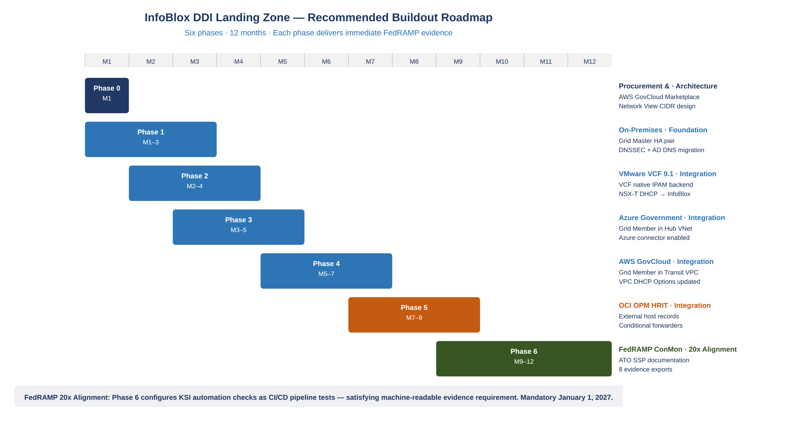{fig-alt="Gantt-style roadmap showing six phases across 12 months. Phase 0 Month 1 Procurement and Architecture in Navy. Phase 1 Months 1-3 On-Premises Foundation in Teal. Phase 2 Months 2-4 VMware VCF 9.1 Integration in Teal. Phase 3 Months 3-5 Azure Government Integration in Teal. Phase 4 Months 5-7 AWS GovCloud Integration in Teal. Phase 5 Months 7-9 OCI OPM HRIT Integration in Amber. Phase 6 Months 9-12 FedRAMP ConMon and 20x Alignment in Green. Phase 6 configures KSI automation checks as CI/CD pipeline tests satisfying machine-readable evidence requirement mandatory January 1 2027." width="100%"}

### Phase 0 — Procurement and Architecture (Month 1) {.unnumbered}

- Path A: procure the InfoBlox cloud-managed offering (Infoblox Government Cloud) via **AWS GovCloud Marketplace** against existing EA (no new IDIQ); Path B: procure NIOS via GSA Schedule GS-35F or agency IDIQ
- Reference FedRAMP Marketplace CSO **FR2017257053** in procurement documentation
- Design Network View CIDR allocation plan: audit all existing IP ranges across on-prem, Azure VNet, AWS VPC, OCI VCN for overlaps
- Engage InfoBlox Professional Services for VCF 9.1 DDI integration workshop

### Phase 1 — On-Premises Foundation (Months 1–3) {.unnumbered}

- Deploy Grid Master HA pair; import all AD DNS zones; enable DNSSEC for 
- Submit DS record to .gov TLD registrar (closes SC-20 gap)
- Migrate Windows Server DHCP scopes to InfoBlox Grid DHCP; enable DHCP fingerprinting (the device-identity feed that [Vol I Book 02](Vol_I_Book_02_OrgComp_Network_Access_Control_802_1X.qmd) builds the NAC device inventory on)
- Configure syslog forwarding from all Grid Members to SIEM (Splunk/Sentinel); verify AU-12 event receipt
- Deploy SCEP connector to ADCS; test automated cert enrollment from new IP host record
- Generate first CM-8 IP inventory export; reconcile against existing CMDB

### Phase 2 — VMware VCF 9.1 Integration (Months 2–4) {.unnumbered}

- Update VCF to 9.1; configure VCF-A to use InfoBlox WAPI as external IPAM backend
- Update NSX-T DHCP Server Profiles to route DNS to InfoBlox Grid Member IP
- Verify NSX-T VM IP assignments appear in InfoBlox On-Premises Network View within 60 seconds

### Phase 3 — Azure Government Integration (Months 3–5) {.unnumbered}

- Deploy InfoBlox Grid Member as Azure VM in Hub VNet; configure Azure DNS Private Resolver to forward to Grid Member
- Register all Azure VNet/subnet CIDRs in InfoBlox Azure-GCC Network View; enable Azure connector
- Configure Azure Key Vault Certificate Manager polling in InfoBlox Certificate Tracker
- Configure M365 GCC endpoint API polling; test RPZ passthrough and commercial M365 RPZ block

### Phase 4 — AWS GovCloud Integration (Months 5–7) {.unnumbered}

- Deploy InfoBlox Grid Member as EC2 instance in Transit VPC
- Update VPC DHCP Options Sets to use Grid Member IP as domain-name-server
- Enable InfoBlox AWS connector; register all VPC CIDR allocations in AWS-GovCloud Network View
- Configure ACM DNS validation CNAME automation; test certificate issuance for an internal ALB
- Integrate InfoBlox RPZ events with AWS Security Hub findings

### Phase 5 — OCI OPM HRIT Integration (Months 7–9) {.unnumbered}

- Import all known OPM HRIT service endpoint IPs and FQDNs as external host records
- Configure InfoBlox conditional forwarder for OPM HRIT FQDNs through FastConnect path
- Connect InfoBlox Certificate Tracker to OPM HRIT HTTPS endpoints; verify 90-day cert expiry alert fires
- Document OCI integration in SSP SA-9 external services table with OPM as system owner

### Phase 6 — FedRAMP Continuous Monitoring (Months 9–12) {.unnumbered}

- Complete InfoBlox FedRAMP documentation in SSP; reference CSO FR2017257053 for DDI-layer control inheritance (Path A only — Path B documents NIOS as an agency-operated component)
- Configure all seven FedRAMP control evidence exports as scheduled reports
- Implement IaC Terraform pipeline: IP allocation → DNS record → SCEP cert enrollment as single atomic pipeline
- Configure FedRAMP 20x KSI automation checks (DNSSEC status, RPZ coverage, cert expiry, CIDR conflict) as CI/CD pipeline tests

---

## References {.unnumbered}

| Source | URL |
|---|---|
| Infoblox Government Cloud — FedRAMP Marketplace listing (CSO FR2017257053) — authorized Dec 15, 2022 for BloxOne Threat Defense Federal Cloud; Universal DDI Management added Jul 22, 2026 | [fedramp.gov/marketplace/products/FR2017257053](https://www.fedramp.gov/marketplace/products/FR2017257053/) |
| Infoblox's BloxOne Threat Defense Federal Cloud Clears FedRAMP Authorization (Jan 26, 2023 press release — scopes the Dec 2022 CSO to threat-defense, not DDI) | [infoblox.com/news](https://www.infoblox.com/news/news-events/press-releases/infobloxs-bloxone-threat-defense-federal-cloud-clears-fedramp-authorization-for-data-security/) |
| Infoblox Government Cloud Achieves FedRAMP Moderate Certification (Jul 22, 2026 — Universal DDI Management, NIOS-X Servers, Universal Asset Insights) | [infoblox.com/blog](https://www.infoblox.com/blog/company/infoblox-universal-ddi-comes-to-infoblox-government-cloud/) |
| VMware VCF 9.1 InfoBlox DDI Integration (May 2026) | [blogs.vmware.com/cloud-foundation](https://blogs.vmware.com/cloud-foundation/2026/05/15/vcf-networking-9-1-seamless-ddi-integration-with-infoblox/) |
| Register InfoBlox NIOS DDI with NSX — Broadcom TechDocs | [techdocs.broadcom.com/.../integrate-nsx-with-infoblox](https://techdocs.broadcom.com/us/en/vmware-cis/vcf/vcf-9-0-and-later/9-1/advanced-network-management/ip-address-management-ipam/integrate-nsx-with-infoblox.html) |
| Microsoft 365 IP and URL Web Service | [docs.microsoft.com/en-us/microsoft-365/enterprise/microsoft-365-ip-web-service](https://docs.microsoft.com/en-us/microsoft-365/enterprise/microsoft-365-ip-web-service) |
| AWS VPC IP Address Manager (IPAM) | [docs.aws.amazon.com/vpc/latest/ipam](https://docs.aws.amazon.com/vpc/latest/ipam/what-it-is-ipam.html) |
| Azure Virtual Network Manager IPAM (preview) | [learn.microsoft.com/en-us/azure/virtual-network-manager/concept-ip-address-management](https://learn.microsoft.com/en-us/azure/virtual-network-manager/concept-ip-address-management) |
| CISA Zero Trust Maturity Model v2.0 (April 2023) | [cisa.gov/sites/default/files/2023-04/zero_trust_maturity_model_v2_508.pdf](https://www.cisa.gov/sites/default/files/2023-04/zero_trust_maturity_model_v2_508.pdf) |
| FedRAMP 20x KSI Enforcement — AWS Public Sector | [aws.amazon.com/blogs/publicsector/preventive-controls-for-fedramp-20x](https://aws.amazon.com/blogs/publicsector/preventive-controls-for-fedramp-20x-using-scps-and-guardrails-to-enforce-ksis/) |
| InfoBlox NIOS 9.0 Certificate Management | [docs.infoblox.com/space/nios90/280266962](https://docs.infoblox.com/space/nios90/280266962) |
| AWS Landing Zone Accelerator on AWS (LZA) | [github.com/awslabs/landing-zone-accelerator-on-aws](https://github.com/awslabs/landing-zone-accelerator-on-aws) |
| InfoBlox IPAM and DHCP Solutions | [infoblox.com/solutions/ipam-dhcp](https://www.infoblox.com/solutions/ipam-dhcp/) |
| Configure DHCP for Azure VMware Solution (NSX-T) | [learn.microsoft.com/en-us/azure/azure-vmware/configure-dhcp-azure-vmware-solution](https://learn.microsoft.com/en-us/azure/azure-vmware/configure-dhcp-azure-vmware-solution) |

: References {.striped .hover}

---

```{=html}
<div class="fouo-banner">UNCLASSIFIED // FOR OFFICIAL USE ONLY —  Cloud Services Team — Cloud Landing Zone IPAM/DDI/PKI Architecture — July 8, 2026</div>
```
