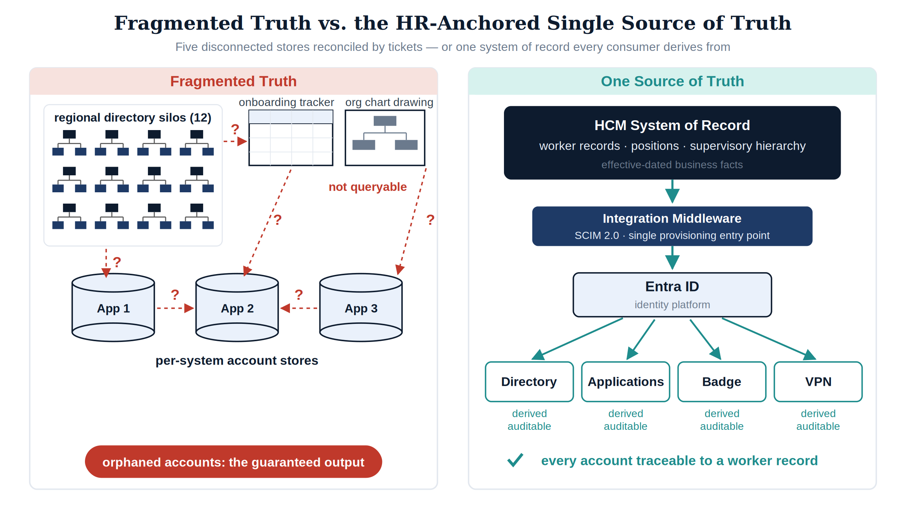
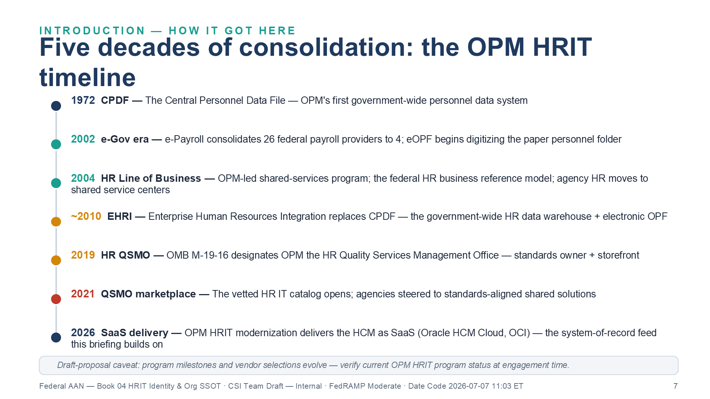
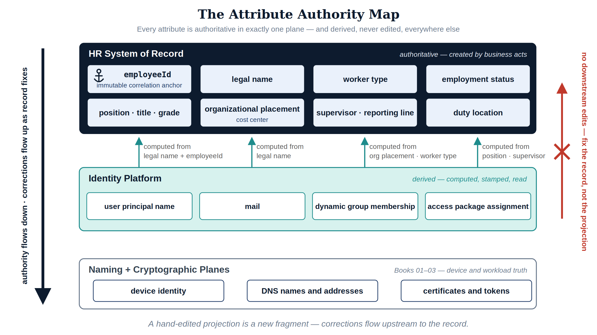
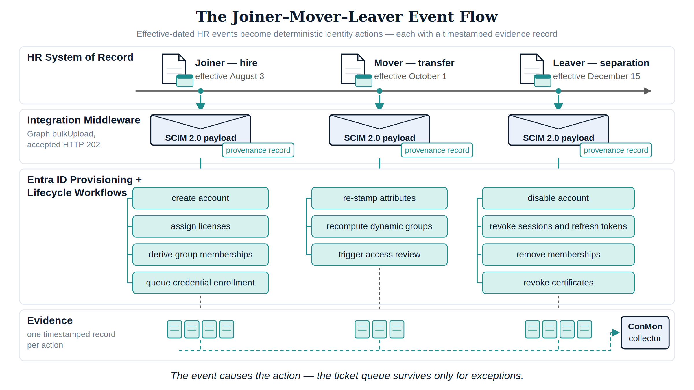
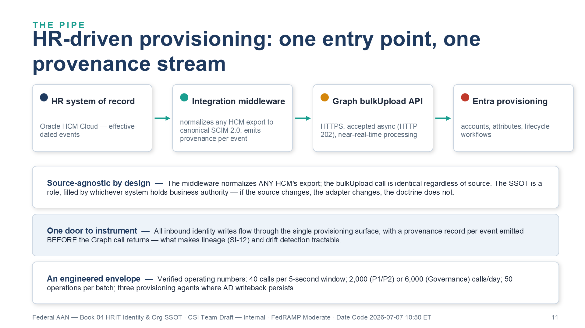
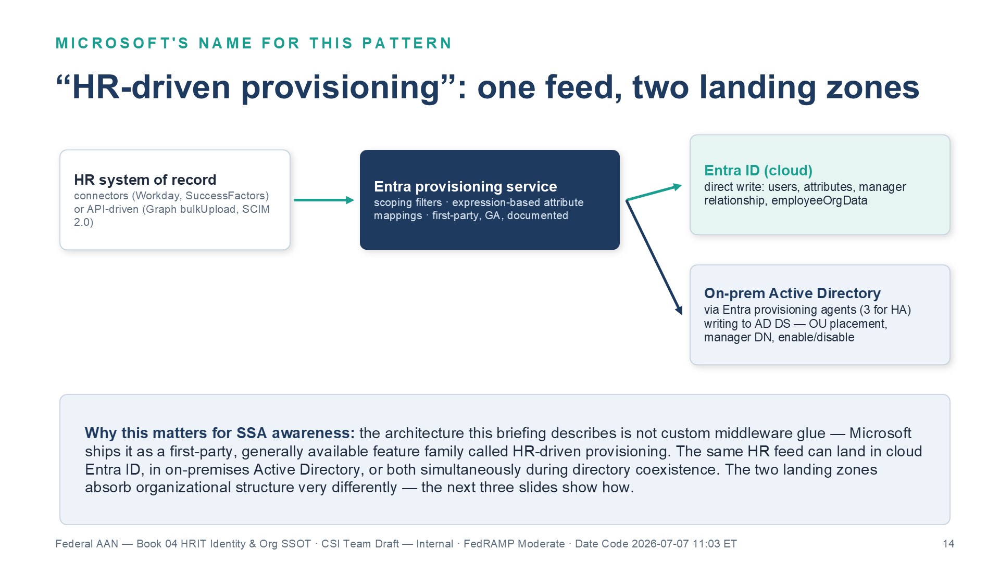
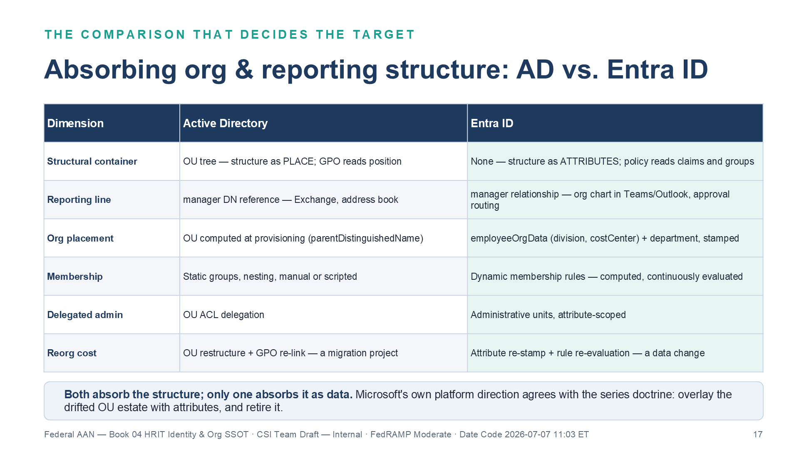
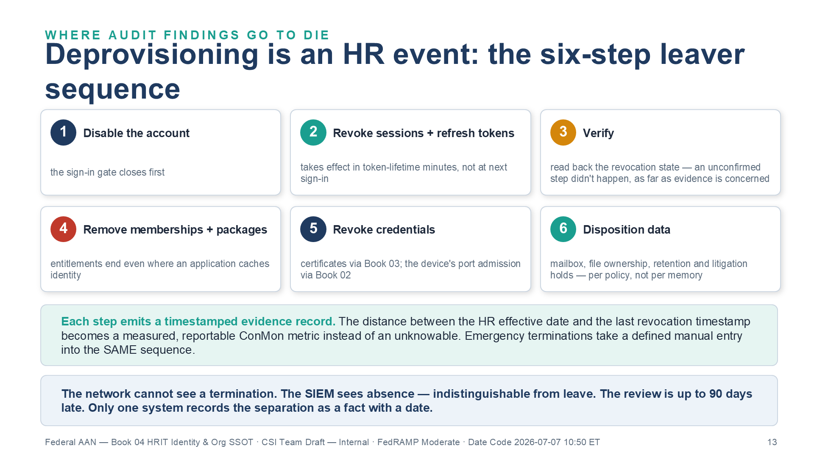
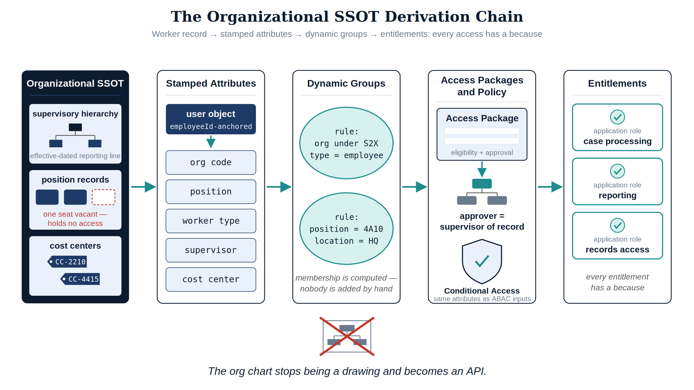
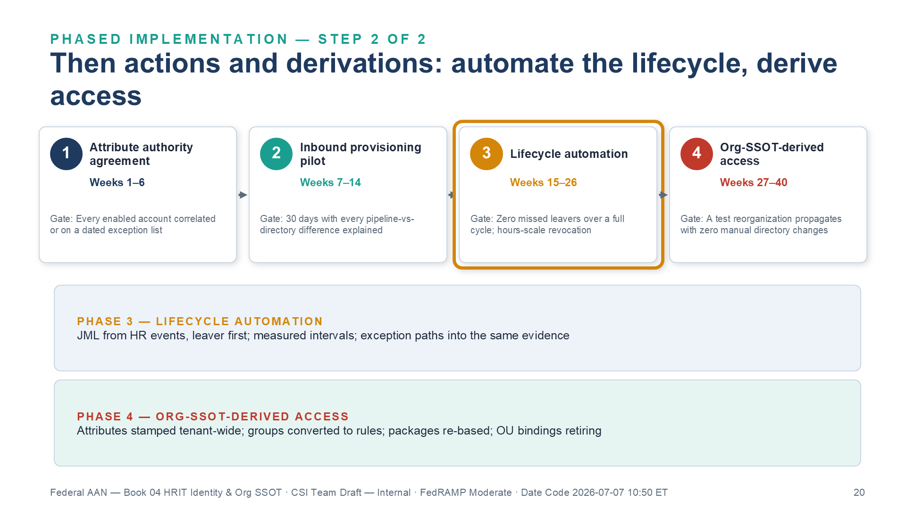

:::: {.content-hidden unless-profile="ssa"}
::: {.fouo-banner}
INTERNAL — NOT FOR PUBLIC DISTRIBUTION
:::
::::

::: {.aan-warning}
## Draft Proposal — Subject to Review

This document is a **draft proposal** developed by the **CSI Team (Cloud Services Infrastructure)**. It is an attempt at a comprehensive -wide technical roadmap and has not been reviewed or approved by the  CIO Office, the Office of Information Security (OIS), or organizational leadership. All recommendations, vendor selections, control mappings, and implementation timelines are subject to revision pending formal review by the  CIO Office and organizational components.

**Date Code:** 2026-07-08 16:07 ET
:::

::: {.aan-important}
**Series Context** — This document is Vol I Book 04 of the Federal Organization Compliance series, and the last of the four substrate books. [Vol I Book 01](Vol_I_Book_01_OrgComp_SSA_Landing_Zone_IPAM_FedRAMP.qmd) established the naming and addressing plane — what things are called and where they live. [Vol I Book 02](Vol_I_Book_02_OrgComp_Network_Access_Control_802_1X.qmd) established device identity at the port. [Vol I Book 03](Vol_I_Book_03_OrgComp_Certificates_Tokens_Cryptographic_Identity.qmd) established cryptographic identity — certificates and tokens as the path-independent carriers of every identity claim. This part establishes what none of them can: **the truth those claims assert.** A token proves that an assertion was signed; it cannot prove the assertion describes a real, current employee with a real, current role. That fact originates in exactly one place — the human capital system of record — and this book makes it the authoritative source for the identity and organizational attributes every later part consumes. The modernization tracks from Vol I Book 05 onward depend on this substrate; in particular, the identity-modernization program of [Vol I Book 05](Vol_I_Book_05_OrgComp_Network_Modernization.qmd) executes Principle 1 (single source of truth) against the directory estate, and Vol I Book 03's tokens assert what *this* book makes true.
:::

::: {.exec-summary}
**For decision makers: read this page first.**

Your agency has spent three books building an identity architecture that can prove, cryptographically and at every hop, *that a claim was made by the party authorized to make it*. None of those three books can tell you whether the claim is **true** — whether the person behind the credential still works for the agency, still holds the position the access was granted for, still reports to the supervisor who approved it. That truth is not a network fact, a certificate fact, or a directory fact. It is an employment fact, and it lives in exactly one system: the human capital system of record.

**Four things this document establishes:**

1. **Vol I Books 01-03 built the courier; this part writes the letter.** [Vol 0 Book 00](Vol_0_Book_00_OrgComp_Executive_Summary.qmd) states the structural dependency: *Principle 3 (token-based identity) depends on Principle 1 (single source of truth). Tokens work only if the authorization they assert is correct.* Replacing session-based authentication while authorization remains encoded in twelve regional OU trees means signing broken authorizations efficiently. This book is the source of truth that dependency requires.

2. **Account lifecycle is an HR event stream, not a ticket queue.** Hire, transfer, and separation are recorded as business events in the HR system before any administrator hears about them. An event-driven provisioning feed makes account creation, access re-derivation, and same-day revocation *consequences* of those records. A ticket queue makes them *rumors* of those records — days late, sometimes never.

3. **The org chart must stop being a drawing and become an API.** Supervisory hierarchy, positions, and cost centers exist today as OU paths, Visio diagrams, and spreadsheets — none of which a policy engine can query. When organizational structure is a governed, queryable record, group membership is *computed* from attributes, access packages route approvals to the supervisor of record, and a reorganization is a data change instead of a migration project.

4. **A SaaS system of record integrates entirely through truth-plane surfaces.** The deployed human capital platform — Oracle HCM Cloud, in the externally managed tenancy Vol I Book 01 placed as the fourth landing-zone environment — touches the enterprise through federation (SAML/OIDC), provisioning protocol (SCIM 2.0), DNS resolution, and evidence export. Outbound HTTPS, no network adjacency, no agents, no domain join. Every one of those surfaces is an identity-plane or naming-plane function the substrate parts already govern.

The controls this document closes — AC-2, IA-4, SI-12 — and the personnel-security controls whose automation evidence it supplies — PS-4, PS-5 — have no alternate closure path, because every one of them ultimately requires a fact that only the HR system of record possesses. AC-2(1) automated account management is realized by the same pipeline but does not carry a standalone necessity anchor. Each claim is demonstrated against control text in the closure table at the end.
:::

# What This Document Addresses

Every preceding part of this series has hardened *how* identity is asserted: names resolve authoritatively (Vol I Book 01), devices authenticate at the wire (Vol I Book 02), and users and workloads carry cryptographic credentials no network path can break (Vol I Book 03). This part addresses *what the assertions say*. An access token carries claims — an identifier, group memberships, role assignments. Those claims are projections of upstream facts: this person is employed; this person holds this position; this person reports to this supervisor; this person's affiliation ended on this date. If the upstream facts are stale, scattered, or unrecorded, the whole cryptographic apparatus notarizes fiction.

The argument proceeds in five movements:

1. **The fragmented truth problem.** Identity truth today is scattered across regional OU trees, per-system account stores, and spreadsheets; organizational truth is encoded in OU paths and drawings. Orphaned accounts are the visible symptom of a missing source, not an operational lapse.
2. **OPM HRIT as the system of record.** What a human capital platform actually owns — worker records, positions, assignments, supervisory hierarchy, effective dating — and the discipline of authoritative versus derived attributes.
3. **The identity SSOT.** The joiner-mover-leaver lifecycle as an event stream: HR-driven provisioning into the identity platform, one identifier per person for the life of the affiliation, and deprovisioning as an HR event rather than a ticket.
4. **The organizational SSOT.** Supervisory org, position management, and cost centers as queryable truth; dynamic groups, access packages, and ABAC attributes derived from HR records instead of assigned by hand.
5. **The integration surface.** Why a SaaS system of record couples to the enterprise exclusively through identity-plane and naming-plane functions — and why that is an architectural feature, not a limitation.

::: {.aan-note}
**Where this sits in the Functional Plane Model** — The HR system of record is **identity-plane truth**: the human and organizational half of plane 3, alongside the cryptographic half Vol I Book 03 established. Per the series hierarchy rule, truth planes can only be depended on. The directory, the dynamic groups, the access packages, and the conditional access policies of later parts are *derivations and enforcements* of what this plane asserts. When a downstream attribute disagrees with the HR record, the HR record wins and the downstream value is corrected — the correction never flows the other way. Fix the record, not the projection.
:::

::: {.aan-note}
**What this document does not cover** — Credential mechanics (how the identity is *carried*) are [Vol I Book 03](Vol_I_Book_03_OrgComp_Certificates_Tokens_Cryptographic_Identity.qmd); the directory-consolidation program that executes Principle 1 against twelve regional AD silos is [Vol I Book 05](Vol_I_Book_05_OrgComp_Network_Modernization.qmd); privileged access built on these identities is Vol III Book 01 (Privileged Access Management); the privacy controls governing the HR data itself as PII are Vol IV Book 04 (PII Processing & Transparency). This document is the truth layer those parts assume: where the facts about people and organizational structure originate, how they flow, and why no other origin can substitute.
:::

# The Fragmented Truth Problem

## Where Identity Truth Lives Today

Ask a federal estate three questions — *who works here, what do they do, and who do they report to* — and no single system answers. The answers are distributed across:

- **Twelve regional Active Directory OU trees**, each built when compute was regional, each drifted through decades of reorganizations, ad-hoc container moves, and administrator judgment calls. The OU estate was originally a downstream projection of organizational truth; nobody maintained the projection, and the source it projected was never machine-readable to begin with.
- **Per-system account stores.** Every application old enough to predate federation keeps its own user table: database logins, mainframe RACF profiles, contact-center agent rosters, badge systems. Each is a private, unsynchronized opinion about who exists.
- **Spreadsheets and email.** The onboarding tracker, the contractor roster, the separation checklist — operational documents that carry authoritative-grade decisions (who gets an account, when access ends) with none of the properties of an authoritative source: no schema, no lineage, no events, no audit.
- **Drawings.** The organizational chart itself lives in Visio and briefing slides. It is read by humans, cited in memos, and queryable by absolutely no policy engine anywhere in the enterprise.

Each fragment is *locally* maintained and *globally* wrong. The regional OU tree knows an account exists but not whether its owner is still employed. The application user table knows a login works but not what position justified it. The spreadsheet knows a contractor started but is a copy the moment it is saved. Fragmented truth is not partial truth — it is contradiction with no arbiter, because no fragment is designated to win.

## The Visible Symptom: Orphaned Accounts

The measurable consequence is the orphaned account: an enabled credential whose human justification has ended. Every audit finds them; every remediation sweep removes a batch; every year they return — because sweeps treat the symptom. An orphaned account is not an administrator's mistake. It is the *structurally guaranteed output* of an architecture in which the system that knows a person left (HR) and the systems that must act on it (directory, applications, badge, VPN, database) share no event channel. The information exists on day zero; it arrives — by ticket, by email, by quarterly review, or by audit finding — days to months later, or never. No amount of process discipline closes a gap whose cause is the absence of a wire.

The anatomy is worth one concrete timeline, because it shows *where the information is* at every point during the gap:

| Day | What the HR System Knows | What the Fragments Know | Exposure |
|---|---|---|---|
| −14 | Separation recorded, effective day 0 | Nothing — no fragment subscribes to HR events | None yet; the fact exists and is actionable |
| 0 | Separation effective | Directory: account enabled. Applications: logins valid. Badge: active | Credentials of a former worker are fully live |
| +3 | Unchanged | Supervisor emails a ticket; the directory account is disabled; nine application accounts are not | Partial: the fragments deprovision independently, in whatever order tickets are worked |
| +45 | Unchanged | A quarterly review flags two of the nine; nobody is sure who owns the rest | The finding is now aging toward an audit |
| +180 | Unchanged | A penetration test authenticates to a case system with an orphaned service-desk account | The gap is now an incident narrative |

: The orphan timeline — the fact exists on day −14; the fragments learn it by accident {.striped .hover}

Nothing in that timeline is a failure of diligence. It is the *wiring diagram working as built*: a system that records the truth, five systems that need it, and no channel between them. The same anatomy produces the quieter failures: the transferred employee who keeps the old division's access for years (the access-accretion problem PS-5 exists to stop), the contractor converted to staff who now has two identities, the rehired annuitant with three.

## The Statutory Frame

This series has already cited the two federal frames that make the fix a mandate rather than a preference. The **Evidence Act (2018)** and the Federal Data Strategy require that agency data trace to a single authoritative system of record for each data type, with documented lineage from source to decision. The **FICAM Architecture** requires that every governed identity carry a complete, authoritative set of identity attributes *derived from authoritative sources such as HR systems* ([Vol I Book 05](Vol_I_Book_05_OrgComp_Network_Modernization.qmd) develops both against the directory estate; [Vol 0 Book 00](Vol_0_Book_00_OrgComp_Executive_Summary.qmd) binds them to AC-2 and SI-12). Neither frame is satisfied by cleaning the fragments. Both are satisfied only by designating the source — and for facts about people and organizational placement, the only candidate system that records hire, position, reporting line, and separation *as a matter of business authority* is the human capital system.

{#fig-hrit01 fig-alt="Two-panel before-and-after architecture comparison. Left panel labeled Fragmented Truth shows identity facts scattered across five disconnected stores: twelve small Active Directory OU tree icons grouped as regional silos, a spreadsheet grid icon labeled onboarding tracker, a Visio-style org chart drawing icon labeled not queryable, and three application cylinders labeled per-system account stores, all cross-connected by dotted red conflict arrows with question marks; a red badge at the bottom reads orphaned accounts: the guaranteed output. Right panel labeled One Source of Truth shows a single HCM system-of-record block at top containing worker records, positions, and supervisory hierarchy, flowing down through an integration middleware bar into an Entra ID block, then fanning out with clean solid teal arrows to directory, applications, badge, and VPN consumers, each marked derived and auditable; a green annotation reads every account traceable to a worker record. Navy, teal, amber palette on white background." width="100%"}

## Why This Cannot Be Patched

Three remediation strategies are regularly proposed to fix fragmented identity truth without designating a source. Each fails for a structural reason, and — as with the authentication patches [Vol I Book 03](Vol_I_Book_03_OrgComp_Certificates_Tokens_Cryptographic_Identity.qmd) dismantled — naming the reason is what the series' Closure Necessity doctrine requires:

- **"Clean up the directory."** A directory-hygiene project produces a correct *snapshot* with no event source behind it. Drift resumes the day the project ends, because hires, transfers, and separations keep happening in a system the directory still cannot hear. Cleanup is a measurement, not a source — the identity-plane restatement of the series' axiom that no scanner creates a source of truth; it can only measure drift from one.
- **"Make the directory the master."** Elevating the directory to authority inverts causation. Employment facts would then have to be *entered into* the directory by administrators — that is, by tickets — which re-creates the ticket queue as the source of truth, now with a grander title and still with no effective dating, no positions, no supervisory hierarchy, and no business authority behind any entry. Nothing that happens inside a directory *is* a hire or a separation. The directory can hold truth; it cannot originate it.
- **"Review our way to correctness."** Quarterly access reviews sample state; they cannot observe transitions. A review that runs ninety days after a separation certifies an orphan for a quarter, and a reviewer confronted with four hundred entitlements approves them in bulk — the rubber-stamp failure mode every assessor recognizes. Reviews are AC-2(j)'s verification layer and this architecture keeps them (sharper — see the organizational SSOT below); but a detective control needs a truth to detect drift *from*, and reviews cannot manufacture the truth they check against.

Every patch preserves the premise — that identity truth can be maintained where it is consumed rather than where it originates — and the premise is the defect. The remediation is not a cleaner copy; it is a designated origin with an event feed.

# OPM HRIT: The Program and Its Timeline

Before this book can designate OPM HRIT as the system of record, it owes the reader an introduction — awareness of the program cannot be assumed, and the architecture that follows makes considerably more sense once its fifty-year backstory is visible.

**What it is.** OPM HRIT is the Office of Personnel Management's Human Resources Information Technology line — the shared-services program through which OPM delivers HR systems and workforce data services across the federal government: personnel action processing (the SF-50 pipeline), the electronic Official Personnel Folder (eOPF), and the government-wide HR data backbone, Enterprise Human Resources Integration (EHRI). Since December 2025 the program has a directing instrument: the joint OMB/OPM memorandum *Creating "Federal HR 2.0" by Consolidating Core Human Capital Management Across the Federal Government* (December 10, 2025), which consolidates 100+ agency Core HCM systems onto one government-wide platform and — significant for integration planning — schedules eOPF and EHRI to become **redundant and decommissioned** once the Core HCM platform absorbs their function. Anything built against the EHRI/eOPF feed shapes is building against systems the program has already scheduled for retirement; the durable integration surface is the Core HCM platform's own (federation, SCIM provisioning, extracts).

**Who OPM is in this story.** Not just a policy shop. Under OMB M-19-16 (*Centralized Mission Support Capabilities for the Federal Government*, April 2019), OPM was designated the **HR Quality Services Management Office (HR QSMO)** — the government-wide standards owner and storefront for HR IT. The policy direction is explicit: agencies procure HR technology through the QSMO's vetted marketplace rather than building bespoke systems.

**Why  touches it.**  consumes OPM HRIT services for personnel actions and workforce records today. As OPM modernizes delivery to SaaS — Oracle HCM Cloud, from the externally managed OCI tenancy [Vol I Book 01](Vol_I_Book_01_OrgComp_SSA_Landing_Zone_IPAM_FedRAMP.qmd) placed as the fourth landing-zone environment — 's integration surface changes from file and mainframe handoffs to a federated API surface, which is exactly the provisioning feed this book turns into the identity SSOT.

## Fifty Years of Consolidation

Every milestone in the program's history moves the same direction: fewer systems, more authoritative data, shared delivery. The SSOT architecture in this book is not a novel invention — it is the landing point that five decades of federal HR consolidation policy have been driving toward.

| Year | Milestone | What Changed |
|---|---|---|
| 1972 | **CPDF** | The Central Personnel Data File — OPM's first government-wide personnel data system |
| 2002 | **e-Gov era** | e-Payroll consolidates 26 federal payroll providers to 4; eOPF begins digitizing the paper personnel folder |
| 2004 | **HR Line of Business** | OPM-led shared-services program; the federal HR business reference model; agency HR moves to shared service centers |
| ~2010 | **EHRI** | Enterprise Human Resources Integration replaces CPDF — the government-wide HR data warehouse plus electronic OPF |
| 2019 | **HR QSMO** | OMB M-19-16 designates OPM the HR Quality Services Management Office — standards owner and storefront |
| 2021 | **QSMO marketplace** | The vetted HR IT catalog opens; agencies steered to standards-aligned shared solutions |
| 2025 | **Federal HR 2.0** | The joint OMB/OPM memorandum (December 10, 2025) directs one government-wide Core HCM platform; agencies pause their own Core HCM modernization |
| 2026 | **Core HCM award** | The Federal HRIT Modernization Core HCM contract is awarded to Oracle (June 11, 2026) — **Oracle Fusion Cloud HCM**, SaaS, the system-of-record feed this book builds on; Wave 1 agency transitions begin |
| 2027 | **Wave transitions** | Wave 2 — the wave that includes  — completes in FY 2027; each agency's onboarding runs ~8 months with interconnections live around month 5 |
| 2028 | **One system** | Government-wide adoption goal (FY 2028); eOPF and EHRI become redundant and are decommissioned |

: The OPM HRIT timeline — five decades of consolidation {.striped .hover}

{#fig-hrit08 fig-alt="Vertical timeline with seven milestones. 1972 CPDF: the Central Personnel Data File, OPM's first government-wide personnel data system. 2002 e-Gov era: e-Payroll consolidates 26 federal payroll providers to 4; eOPF begins digitizing the paper personnel folder. 2004 HR Line of Business: OPM-led shared-services program, the federal HR business reference model, agency HR moves to shared service centers. Around 2010 EHRI: Enterprise Human Resources Integration replaces CPDF as the government-wide HR data warehouse plus electronic OPF. 2019 HR QSMO: OMB M-19-16 designates OPM the HR Quality Services Management Office, standards owner and storefront. 2021 QSMO marketplace: the vetted HR IT catalog opens, agencies steered to standards-aligned shared solutions. 2026 SaaS delivery: OPM HRIT modernization delivers the HCM as SaaS (Oracle HCM Cloud, OCI), the system-of-record feed this book builds on. Caveat footer: program milestones and vendor selections evolve — verify current OPM HRIT program status at engagement time. White background. Source: Vol I Book 04 HRIT SSOT briefing deck, Date Code 2026-07-07 11:03 ET." width="100%"}

::: {.aan-note}
**Program-status caveat** — as of 2026-07-23 the directing memo (December 10, 2025) and the Core HCM award (Oracle Fusion Cloud HCM, June 11, 2026) are on the record; the 2027–2028 rows are the program's *announced* schedule, and wave assignments, onboarding timing, and the post-award integration surfaces still evolve — verify current Federal HR 2.0 program status at engagement time. The timeline figure above predates the award rows and carries its own caveat. The doctrine of this book is deliberately source-agnostic (see the provisioning pipeline below): if the deployed platform changes, the adapter changes and nothing else does. The execution of this book's provisioning feed against the awarded program — waves, interfaces, phases, and gates — is the companion [HRIT to HR-Driven IAM Execution Plan](OrgComp_HRIT_HR_Driven_IAM_Execution_Plan.qmd).
:::

# OPM HRIT as the System of Record

## What a Human Capital System Actually Owns

The human capital platform — OPM HRIT, in federal shorthand; the deployed instance in this architecture is **Oracle HCM Cloud**, delivered SaaS from the externally managed OCI tenancy that [Vol I Book 01](Vol_I_Book_01_OrgComp_SSA_Landing_Zone_IPAM_FedRAMP.qmd) placed as the fourth landing-zone environment — is not "the payroll system" any more than the DDI platform of Vol I Book 01 is "the DHCP server." It is the system where four categories of fact are *created* rather than copied:

| Record | What It Asserts | Why It Cannot Originate Anywhere Else |
|---|---|---|
| **Worker record** | A person exists as a worker: identifier, legal name, worker type (employee, contractor, intern), employment status | Hiring is an HR business act; the record is created *by* the act, not in response to it |
| **Position** | A seat exists in the organization with a title, grade, and organizational placement — independent of any incumbent | Positions are established and abolished by organizational authority; a vacancy is a real, recorded state |
| **Assignment** | A worker holds a position, in an organization, at a location, under a supervisor, effective on a date | The assignment *is* the employment relationship; every downstream access decision is a projection of it |
| **Supervisory hierarchy** | Who reports to whom — the reporting line from any worker to the head of the agency | Reporting relationships are established by the same business acts that create assignments; the directory's `manager` field is at best a copy |

: The four record families the system of record owns {.striped .hover}

## The Division of Labor: System of Record Versus Identity Provider

Naming the HCM as the identity SSOT invites a predictable misreading — that it competes with the identity platform. It does not, and the boundary between them is worth stating precisely, because each is authoritative for a different category of fact:

| Function | System of Record (HCM) | Identity Platform (Entra ID) |
|---|---|---|
| Who a worker *is* — existence, status, type | **Authoritative** | Derived: account state follows the record |
| Where a worker *sits* — position, org, supervisor | **Authoritative** | Derived: attributes stamped, memberships computed |
| How identity is *proven* — credentials, MFA, device binding | — | **Authoritative** (Vol I Book 03's plane) |
| Whether a request is *permitted now* — conditional access, sessions | — | **Authoritative** (policy enforcement) |
| Token issuance and claims format | — | **Authoritative**; claim *values* trace upstream |

: The division of labor between the system of record and the identity platform {.striped .hover}

The HCM never authenticates a user to an application; the identity platform never decides whether someone is employed. The pipeline in this book is the seam between them, and the direction of authority across that seam never reverses: the HCM asserts *facts about people and structure*; the identity platform asserts *facts about credentials and sessions* and derives everything else. The two-authority model is the same truth-plane discipline the series applied between DDI and the certificate estate in Vol I Books 01 and 03 — different planes own different verbs, and no plane edits another's nouns.

## Effective Dating: Truth With a Timeline

The property that separates a system of record from a directory is **effective dating**. An HCM record does not say "Jane is in the Program Integrity division"; it says "Jane's assignment to Program Integrity is effective 2026-08-03, superseding her prior assignment, which ended 2026-08-02." Future-dated hires, transfers, and separations exist in the system *before they are true*, with the date on which they become true.

This is not a bookkeeping nicety — it is what makes proactive automation possible. Day-one readiness (account, licenses, and group memberships waiting when a new hire badges in) requires knowing the hire *before* the start date. Same-day revocation requires knowing the separation *on* its effective date, not when the paperwork finishes circulating. A directory records state; the system of record records **state transitions with timestamps**, which is exactly the shape an event-driven lifecycle consumes.

## Authoritative Versus Derived Attributes

The discipline that makes the SSOT operable is a written, governed answer to one question per attribute: *which plane owns this?* An attribute is **authoritative** where it is created by a business act, and **derived** everywhere else. Derived attributes are computed, stamped, and read — never edited in place.

| Attribute | Authoritative Plane | Derived Consumers |
|---|---|---|
| Worker identifier (`employeeId`) | HR system of record — the immutable correlation anchor, assigned at first affiliation | Directory correlation key, audit joins, per-system account linkage |
| Legal name, worker type, employment status | HR system of record | Display name, account enable/disable state, guest-versus-member classification |
| Position, title, grade | HR system of record | Role-eligible access packages, approval routing |
| Organizational placement (department, org code, cost center) | HR system of record | Dynamic group membership, ABAC attributes, chargeback |
| Supervisor / reporting line | HR system of record | `manager` attribute, access-package approval routing, attestation campaigns |
| Duty location | HR system of record | Conditional access named-location context, E911 records ([Vol I Book 06](Vol_I_Book_06_OrgComp_Federal_Telecommunications_Modernization.qmd)) |
| User principal name, mail, group memberships | Identity platform — *derived* from HR attributes by rule | Applications, token claims |
| Device identity, names, addresses, certificates | Naming and addressing plane (Vol I Books 01-03) | NAC admission, workload identity, TLS |
| Credential strength, token claims format | Identity plane, cryptographic half (Vol I Book 03) | Policy enforcement plane |

: The attribute authority map — which plane owns which fact {.striped .hover}

The map has one rule with no exceptions: **corrections flow upstream.** When a token carries a wrong department, the fix is a correction to the HR record (or to the derivation rule) — never a hand-edit of the directory attribute, because a hand-edited projection is a new fragment, and fragments are the disease this part cures.

{#fig-hrit03 fig-alt="Layered ownership diagram in three horizontal bands. Top band labeled HR System of Record, navy, contains attribute chips for employeeId with a small anchor icon labeled immutable correlation anchor, legal name, worker type, employment status, position and grade, organizational placement with cost center, supervisor reporting line, and duty location. Middle band labeled Identity Platform derived, teal, contains chips for user principal name, mail, dynamic group membership, and access package assignment, each connected upward by a solid arrow labeled computed from with the source attribute named. Bottom band labeled Naming and Cryptographic Planes Books 01 to 03, amber, contains chips for device identity, DNS names and addresses, and certificates and tokens. A bold one-way arrow on the left edge points downward only, labeled authority flows down, corrections flow up as record fixes. A crossed-out red arrow pointing upward from the middle band is labeled no downstream edits: fix the record, not the projection. Navy, teal, amber palette on white background." width="100%"}

# The Identity SSOT

## The Lifecycle Is an Event Stream

Joiner, mover, leaver — plus the two transitions estates forget until they hurt, **rehire** and **conversion** (contractor to employee) — are the five state transitions a worker record undergoes. Each is recorded in the HR system as an effective-dated event, and each maps to a deterministic set of identity actions:

| HR Event | Recorded Fact | Identity Actions Derived From It |
|---|---|---|
| **Joiner** | Future-dated hire: worker record + assignment created | Account created ahead of start date, disabled until effective date; licenses and baseline group memberships derived from assignment attributes; credential enrollment (Vol I Book 02 device, Vol I Book 03 authenticator) queued for day one |
| **Mover** | Assignment change: new position, organization, location, or supervisor | Attributes re-stamped; dynamic memberships re-computed — old division's access *leaves* as the new division's arrives; access review triggered on the residual (PS-5); approval routing follows the new supervisor of record |
| **Leaver** | Effective-dated separation | On the effective date: account disabled, sessions and refresh tokens revoked, group memberships removed, credentials revoked through the Vol I Book 03 lifecycle, mailbox and data handled per retention policy — as one automated sequence with one timestamped evidence trail (PS-4) |
| **Rehire** | Returning worker matched to prior worker record | Prior identifier re-linked — the person resumes their identity rather than acquiring a second one (IA-4) |
| **Conversion** | Worker type changes; affiliation continuous | Same identifier, re-derived access; the contractor-to-employee seam stops minting duplicate identities |

: The five lifecycle events and their derived identity actions {.striped .hover}

The load-bearing property is the direction of causation. Nobody *requests* an account for a new hire; the hire *causes* the account. Nobody *remembers* to disable a leaver; the separation record *is* the disablement, with an effective date the automation honors to the day. The ticket queue survives only for exceptions — and every exception is visible as a deviation from a computed baseline, which is what makes the exceptions auditable.

Consider the two architectures side by side in the completed series, in the paired-scenario form [Vol I Book 02](Vol_I_Book_02_OrgComp_Network_Access_Control_802_1X.qmd) used for the port:

**Scenario A — separation under fragmented truth.** A worker separates on a Friday. Their FIDO2 key, machine certificate, and enrolled device are all *valid* — Vol I Books 02 and 03 built them well, and nothing about the separation touches any of them. Conditional access evaluates a compliant device and a phishing-resistant credential and correctly allows. Every control fires correctly, because every control is asserting exactly what its plane knows — and no plane knows the one fact that matters. The strength of the substrate now works for the former worker.

**Scenario B — separation under the identity SSOT.** The same Friday, the effective-dated record initiates the leaver sequence: the account disables, sessions and refresh tokens revoke, memberships drop, the certificate revokes through the Vol I Book 03 lifecycle, and the device's admission credential dies with it — so Monday's port authentication fails at the wire per Vol I Book 02. Each step leaves a timestamp. The substrate's strength now works for the agency, because the truth plane finally told it the truth.

The pair is the whole book in miniature: Vol I Books 01-03 determine how *forcefully* the architecture asserts identity; this part determines whether what it asserts is *still true*.

{#fig-hrit02 fig-alt="Horizontal swim-lane event-flow diagram with four lanes. Top lane labeled HR System of Record shows a timeline with three effective-dated event markers: joiner hire effective August 3, mover transfer effective October 1, leaver separation effective December 15, each drawn as a document icon with a calendar stamp. Second lane labeled Integration Middleware shows each event becoming a SCIM 2.0 payload envelope with a provenance-record side stub. Third lane labeled Entra ID Provisioning and Lifecycle Workflows shows the joiner payload fanning into create account, assign licenses, derive group memberships, queue credential enrollment; the mover payload fanning into re-stamp attributes, recompute dynamic groups, trigger access review; the leaver payload fanning into disable account, revoke sessions and refresh tokens, remove memberships, revoke certificates. Bottom lane labeled Evidence shows one timestamped evidence record per action flowing to a ConMon collector. A caption reads: the event causes the action; the ticket queue survives only for exceptions. Navy, teal, amber palette on white background." width="100%"}

## HR-Driven Provisioning Into the Identity Plane

The pipeline that carries events from the system of record into the identity platform follows the **API-driven inbound provisioning architecture** — the HR-agnostic pattern this series adopts, verified against Microsoft Learn. Its shape:

> **HR system of record → integration middleware → Microsoft Graph `bulkUpload` API → Entra ID provisioning service** — SCIM 2.0 (RFC 7643/7644) as the wire format, submitted over HTTPS, accepted asynchronously with HTTP 202, processed in near real time.

Three properties of this design are doctrine, not implementation detail:

- **The architecture is source-agnostic; the deployed source is a configuration.** The middleware normalizes any HCM's export into the canonical SCIM payload, so the `bulkUpload` call is identical regardless of HR source. Oracle HCM Cloud is the *deployed* system of record in this architecture — named here the way the series names InfoBlox and Entra ID — but nothing in the design depends on it. If the source ever changes, the adapter changes; the doctrine, the pipeline, and every downstream derivation do not. That is what "HR-agnostic" buys: the SSOT is a *role*, filled by whichever system holds business authority.
- **One entry point, therefore one provenance stream.** All inbound identity writes flow through the single provisioning surface, and the middleware emits a provenance record per provisioning event *before* the Graph call returns. One entry point is what makes lineage (SI-12) and drift detection tractable — there is exactly one door to instrument.
- **The envelope is engineered, not assumed.** The verified operating numbers: throttling at 40 API calls per 5-second window; tenant daily caps of 2,000 calls per 24 hours (Entra ID P1/P2) or 6,000 (Entra ID Governance); batch payloads of up to 50 operations per call; Entra ID P1 as the licensing floor; and, where on-premises AD writeback persists during directory coexistence, three active provisioning agents for high availability. Worth one sentence of series doctrine: the spec's own correction history records that its first draft overstated the throttling envelope five-fold and was corrected on verification against the authoritative source — which is precisely the falsifiability discipline this series demands of every load-bearing number.

Native HR connectors, where they exist for a given HCM, are permitted as accelerators — but the API-driven path is the canonical architecture, because it is the one that works for *any* source and the only one whose middleware layer can compute organizational attributes and emit provenance before the identity platform ever sees the record.

{#fig-hrit06 fig-alt="Four-node pipeline flow: HR system of record (Oracle HCM Cloud, effective-dated events) → integration middleware (normalizes any HCM export to canonical SCIM 2.0, emits provenance per event) → Microsoft Graph bulkUpload API (HTTPS, accepted asynchronously with HTTP 202, near-real-time processing) → Entra ID provisioning (accounts, attributes, lifecycle workflows). Three property bars below: source-agnostic by design — the middleware normalizes any HCM's export, the bulkUpload call is identical regardless of source, the SSOT is a role; one door to instrument — all inbound identity writes flow through the single provisioning surface with a provenance record per event emitted before the Graph call returns, making lineage (SI-12) and drift detection tractable; an engineered envelope — verified operating numbers: 40 calls per 5-second window, 2,000 (P1/P2) or 6,000 (Governance) calls per day, 50 operations per batch, three provisioning agents where AD writeback persists. White background. Source: Vol I Book 04 HRIT SSOT briefing deck, Date Code 2026-07-07 10:50 ET." width="100%"}

## Microsoft's HR-Driven Provisioning: Two Landing Zones

The pattern this book describes has a first-party name in the Microsoft documentation: **HR-driven provisioning**. Awareness of this cannot be assumed, so it is worth stating plainly — the architecture above is not custom middleware glue. Microsoft ships it as a generally available, documented feature family in which the HR system is the start-of-authority for identity lifecycle and the Entra provisioning service carries its records into the directory targets.

Two on-ramps exist: prebuilt cloud-HR connectors (Workday, SAP SuccessFactors), and the **API-driven inbound provisioning** path — the Graph `bulkUpload` endpoint accepting SCIM 2.0 payloads — which is source-agnostic and is the canonical Spec2-D3.1 architecture above. In both cases the provisioning service applies **scoping filters** (who provisions at all) and **expression-based attribute mappings** (how HR fields become directory attributes).

The consequential fact for a coexisting estate: the same HR feed can land in **two different zones**, separately or simultaneously —

- **API-driven inbound provisioning to Entra ID** writes users directly in the cloud directory.
- **API-driven inbound provisioning to on-premises Active Directory** delivers the same payloads through Entra provisioning agents (deploy three for high availability) that write to AD DS.

{#fig-hrit09 fig-alt="Flow diagram: HR system of record (connectors for Workday and SuccessFactors, or API-driven via Graph bulkUpload with SCIM 2.0) feeds the Entra provisioning service (scoping filters, expression-based attribute mappings — first-party, generally available, documented), which fans out to two landing zones: Entra ID (cloud) with direct write of users, attributes, manager relationship, and employeeOrgData; and on-premises Active Directory via Entra provisioning agents (three for high availability) writing to AD DS — OU placement, manager DN, enable/disable. Banner: the architecture is not custom middleware glue — Microsoft ships it as a first-party feature family called HR-driven provisioning; the same HR feed can land in cloud Entra ID, on-premises AD, or both simultaneously during directory coexistence. White background. Source: Vol I Book 04 HRIT SSOT briefing deck, Date Code 2026-07-07 11:03 ET." width="100%"}

### Landing in Active Directory: Containers and the Manager Chain

Most of the estate still lives in on-premises AD, so the AD landing zone deserves detail. Four mechanics:

- **Where the account lands — the OU is computed, not hand-picked.** The `parentDistinguishedName` attribute mapping derives the destination container from HR attributes; Microsoft's planning guidance shows expression rules (a `Switch` over department or location) selecting the OU. Placement by rule ends the drag-and-drop tradition that produced the twelve drifted regional trees.
- **The reporting line becomes a queryable chain.** The provisioning service resolves the supervisor by `employeeId` match against already-provisioned users and writes AD's `manager` attribute as a DN reference. Exchange, the address book, and approval tooling read that chain; manager updates flow on mover events.
- **The attribute surface carries the worker record.** `department`, `title`, `division`, `company`, `employeeId`, `employeeType`, and `extensionAttributes` project the worker record into AD; scoping filters exclude populations that should not provision, and expressions construct UPNs and display names consistently.
- **The operational floor.** Entra provisioning agents — three, for high availability, per the verified envelope above — perform the AD DS writes from inside the agency network. Accounts enable on the hire date and disable on the leave date: effective dating flows all the way down to the domain controller.

The caveat that motivates the rest of this book: **AD stores structure as *place*.** An OU is a container, and Group Policy that reads OU position inherits every reorganization. HR-driven provisioning keeps AD *correct*; it cannot make AD's model attribute-native.

### Landing in Entra ID: Attributes, Not Containers

Entra ID has no OUs. The worker record lands as **first-class attributes**, and organizational structure becomes data:

- **The attribute surface.** `manager` (a directory *relationship*, not a string — it powers the organization chart in Teams and Outlook profile cards), `department`, `jobTitle`, `employeeId`, `employeeType`, `employeeHireDate` / `employeeLeaveDateTime`, and `employeeOrgData` with `costCenter` and `division`. The attribute authority map earlier in this book, realized in Microsoft's own schema.
- **Structure becomes computation.** Dynamic membership rules evaluate those attributes continuously — nobody joins a group and nobody forgets to leave one. Access packages route approvals to the `manager` relationship (the supervisor of record). Administrative units scope delegated administration by attribute — the OU's one legitimate remaining job, reimplemented without making policy read a container path.
- **Lifecycle is platform-native.** Entra Lifecycle Workflows trigger directly off `employeeHireDate` and `employeeLeaveDateTime`: pre-hire onboarding, day-one enablement, and leaver revocation run as first-class platform features keyed to the HR effective dates — not as scheduled scripts someone maintains.

The visible payoff for every employee: the org chart in Teams and Outlook stops being decorative. When `manager` and `employeeOrgData` derive from the HR record, the profile card *is* the supervisory org — the same truth that routes approvals and computes access.

### Absorbing Organizational and Reporting Structure: AD versus Entra ID

| Dimension | Active Directory | Entra ID |
|---|---|---|
| Structural container | OU tree — structure as *place*; GPO reads position | None — structure as *attributes*; policy reads claims and groups |
| Reporting line | `manager` DN reference — Exchange, address book | `manager` relationship — org chart in Teams/Outlook, approval routing |
| Org placement | OU computed at provisioning (`parentDistinguishedName`) | `employeeOrgData` (division, costCenter) + `department`, stamped |
| Membership | Static groups, nesting, manual or scripted | Dynamic membership rules — computed, continuously evaluated |
| Delegated admin | OU ACL delegation | Administrative units, attribute-scoped |
| Reorg cost | OU restructure + GPO re-link — a migration project | Attribute re-stamp + rule re-evaluation — a data change |

: Absorbing organizational and reporting structure — AD versus Entra ID {.striped .hover}

{#fig-hrit10 fig-alt="Six-row comparison table between Active Directory and Entra ID. Structural container: OU tree, structure as place, GPO reads position — versus none, structure as attributes, policy reads claims and groups. Reporting line: manager DN reference consumed by Exchange and the address book — versus manager relationship powering the org chart in Teams and Outlook and approval routing. Org placement: OU computed at provisioning via parentDistinguishedName — versus employeeOrgData (division, costCenter) plus department, stamped. Membership: static groups, nesting, manual or scripted — versus dynamic membership rules, computed and continuously evaluated. Delegated admin: OU ACL delegation — versus administrative units, attribute-scoped. Reorg cost: OU restructure plus GPO re-link, a migration project — versus attribute re-stamp plus rule re-evaluation, a data change. Banner: both absorb the structure; only one absorbs it as data — Microsoft's own platform direction agrees with the series doctrine: overlay the drifted OU estate with attributes, and retire it. White background. Source: Vol I Book 04 HRIT SSOT briefing deck, Date Code 2026-07-07 11:03 ET." width="100%"}

Both directories can absorb the org chart via HR-driven provisioning — but only one absorbs it as data. The row that decides the argument is the last one: an AD reorganization is a migration project with months of drift; an Entra reorganization is a data change. Microsoft's platform direction and this series' overlay-and-retire doctrine point the same way: provision **both** zones during coexistence, read structure from attributes, and retire OU-bound policy deliberately (Phase 4 below, in coordination with [Vol I Book 05](Vol_I_Book_05_OrgComp_Network_Modernization.qmd)).

## One Person, One Identifier

IA-4 requires managing identifiers by receiving authorization to assign them, selecting and assigning them to the intended entity, and **preventing their reuse** for a defined period. The enterprise discipline this architecture implements is stricter and simpler: **one person, one identifier, for the life of the affiliation — across every account, system, rehire, and conversion.**

The `employeeId` assigned at first affiliation is the immutable correlation anchor. It never changes with name, position, region, or worker type; every account in every system that belongs to the person carries it; and when the person returns after a break in service, the rehire event re-links the *same* identifier rather than minting a fresh identity. This is only possible where the *person* — not the account — is the tracked entity. A directory cannot do it: directories track accounts, and an account deleted at separation takes its history with it. The worker record persists across affiliations, which is why identifier non-reuse and rehire correlation are properties of the HR plane, projected downward.

The same anchor is what makes audit joins possible at all: the token event in the SIEM, the database login, the badge swipe, and the personnel action resolve to one person only because one identifier threads them.

## The Worker-Type Boundary

One authoritative attribute deserves special notice because entire policy families hang from it: **worker type.** Employee, contractor, intern, volunteer — the classification determines member-versus-guest treatment in the tenant, license assignment, access ceilings, and which conditional-access baseline applies. When worker type is a directory field someone sets at account creation, it is wrong exactly as often as staffing paperwork is ambiguous, and the errors are invisible because nothing reconciles them. When it is derived from the worker record, the contractor whose engagement ends loses access on the engagement's end date (a leaver event for a non-employee), and the conversion seam — contractor on Friday, employee on Monday — is a re-derivation on the same identifier rather than a second identity with a second, forgotten first account. IA-4(4)'s status characterization (identifying each individual as, for example, a contractor) falls out of the same attribute for free: the characteristic is asserted by the system that classifies workers as a business act, not annotated by an administrator who heard about it.

## Deprovisioning Is an HR Event, Not a Ticket

The leaver sequence deserves its own statement, because it is where the fragmented-truth architecture kills its audit findings — and occasionally its incident reports. In the target state, separation processing is initiated by the effective-dated termination record, and the automated sequence executes on that date, in order, as one workflow:

1. **Disable the account** — the sign-in gate closes first.
2. **Revoke active sessions and refresh tokens** — disabling prevents *new* tokens; revocation ends the ones already issued, so the control takes effect in token-lifetime minutes rather than at next sign-in.
3. **Verify** — read back the revocation state; a step that cannot be confirmed is a step that did not happen, as far as evidence is concerned.
4. **Remove group memberships and access-package assignments** — entitlements end even where a downstream application caches identity.
5. **Revoke credentials** — certificates through the Vol I Book 03 lifecycle; the device's admission credential through the Vol I Book 02 pipeline, so the port stops trusting the hardware too.
6. **Disposition data** — mailbox archive or conversion, file ownership transfer, retention and litigation-hold exceptions applied per policy rather than per memory.

Each step emits a timestamped evidence record; the *distance between the HR effective date and the last revocation timestamp* becomes a measured, reportable ConMon metric instead of an unknowable. Emergency terminations take a defined manual entry into the *same* sequence — the trigger is human, the execution and the evidence are identical.

{#fig-hrit05 fig-alt="Six numbered step cards in two rows: 1 disable the account — the sign-in gate closes first; 2 revoke sessions and refresh tokens — takes effect in token-lifetime minutes, not at next sign-in; 3 verify — read back the revocation state, an unconfirmed step didn't happen as far as evidence is concerned; 4 remove memberships and packages — entitlements end even where an application caches identity; 5 revoke credentials — certificates via Book 03, the device's port admission via Book 02; 6 disposition data — mailbox, file ownership, retention and litigation holds per policy, not per memory. Teal banner: each step emits a timestamped evidence record — the distance between the HR effective date and the last revocation timestamp becomes a measured ConMon metric; emergency terminations take a defined manual entry into the same sequence. Blue banner: the network cannot see a termination, the SIEM sees absence indistinguishable from leave, the review is up to 90 days late — only one system records the separation as a fact with a date. White background. Source: Vol I Book 04 HRIT SSOT briefing deck, Date Code 2026-07-07 10:50 ET." width="100%"}

Contrast the input signals available to any alternative mechanism. The network cannot see a termination — the leaver's laptop authenticates on their last day exactly as it did the day before. The SIEM sees *absence of activity*, which is indistinguishable from leave. The quarterly access review discovers the account up to ninety days late. Only one system in the enterprise records the separation as a first-class fact with an effective date — and once it does, everything downstream is a subscription.

## The Measured Lifecycle

An event-driven lifecycle is also, incidentally but not accidentally, a *measured* one — every event-to-action interval is a number, and the numbers are the slot-01 evidence stream:

| Metric | Definition | What It Evidences |
|---|---|---|
| Separation-to-revocation interval | HR effective date/time → last revocation timestamp in the leaver sequence | PS-4's disable-within-time-period, continuously |
| Transfer-to-review interval | Transfer effective date → residual-access review completion | PS-5's initiate-within-time-period |
| Joiner readiness rate | Share of new hires whose account, licenses, and baseline access exist at start-of-day one | AC-2 lifecycle automation working in the creation direction |
| Correlation coverage | Share of enabled accounts resolvable to a current worker record | The orphan population, as a query instead of a hunt |
| Derivation purity | Share of group memberships computed by rule versus assigned by hand | How much of the estate still runs on fragments |

: The lifecycle metrics the event-driven architecture makes measurable {.striped .hover}

None of these numbers exists in a ticket-driven estate — not because nobody computes them, but because the events they measure are not recorded as events. The metric *is* the argument: an architecture that cannot measure its own revocation latency is asserting PS-4 compliance on faith.

# The Organizational SSOT

## Structure as Queryable Truth

The second half of this book's title is the one estates habitually skip. Identity SSOT projects say "HR drives accounts" and stop — leaving *organizational* truth (who reports to whom, which positions exist, which cost center pays) in the OU paths and the Visio files. The result is an identity plane that knows who exists but not where they sit, which forces every access decision back onto hand-maintained groups — and hand-maintained groups are per-system account stores wearing a nicer name.

The organizational SSOT makes three record families queryable:

- **Supervisory organization.** The reporting hierarchy as effective-dated records: any worker's chain of command, resolvable by API at decision time. This is the fact that access-package approvals, attestation campaigns, and separation-of-duties checks all silently depend on — and today mostly fake with a stale directory `manager` field.
- **Position management.** Positions as records independent of incumbents. Access eligibility attaches to the *position* ("this seat is entitled to the case-processing system"), so a vacancy holds no access, an incumbent inherits the seat's baseline on assignment, and a mover sheds it on reassignment — automatically, because the assignment is the membership rule's input.
- **Cost centers.** The financial dimension of placement, driving license chargeback and scoping the blast radius of any entitlement to the organizational unit that owns it.

[Vol I Book 05](Vol_I_Book_05_OrgComp_Network_Modernization.qmd)'s history explains why this matters at reorganization time. Under fragmented truth, a reorganization is a *migration project*: OU restructuring, group renames, GPO re-links, months of drift. Under the organizational SSOT, a reorganization is a *data change* — the HR records change, the attributes re-stamp, the memberships recompute — and the doctrinal corollary follows: a drifted OU estate is **overlaid and retired, not remediated**. Rebuilding OU trees to match reality is expensive, high-risk, and pointless once no policy reads OU position; the truth is stamped as attributes, policy re-bases onto attribute-driven groups, and the residual OU bindings are inventoried and decommissioned deliberately.

## From HR Attributes to Access: The Derivation Chain

The organizational SSOT earns its keep through one repeatable chain:

**Worker record → stamped attributes → dynamic groups → entitlements.**

Dynamic groups are membership *rules* over HR-derived attributes ("all workers whose org code is under X and worker type is employee"), evaluated continuously by the identity platform. Access packages bundle entitlements behind eligibility rules and approval flows that route to the supervisor *of record*. Conditional access and application roles consume the same attributes as ABAC inputs, and role assignments — RBAC — are granted through the packages rather than by direct assignment. The properties that follow:

- **Nobody joins these groups; membership is computed.** There is no group owner to lobby, no ticket to lose, no offboarding step to forget. The mover's access converges on the new assignment's derivation within the provisioning cycle.
- **Every entitlement has a *because*.** Access exists because an attribute satisfied a rule; the attribute exists because an HR record asserted it; the record has an author, a date, and a business act behind it. That chain *is* the access authorization data AC-2 wants, and it is queryable end to end.
- **ABAC and RBAC stop being rival religions.** Roles define what a position may touch; attributes prove which position the person holds. Both resolve against the same upstream truth, which is the only arrangement in which they cannot disagree.

## Attestation Lands on the Same Rail

The access reviews this book declined to accept as a *source* of truth return here as a sharpened *verification* of it. Once entitlements derive from the organizational SSOT, AC-2(j)'s periodic review stops being a spreadsheet mailed to whoever a stale directory field names, and becomes a campaign the org SSOT itself scopes and routes:

- **The reviewer is the supervisor of record** — resolved from the reporting hierarchy at campaign launch, not from a `manager` field last edited during a previous administration.
- **The review population is attribute-scoped** — "all workers in this organization with access outside its derivation baseline" is a query, so reviewers see the *exceptions* rather than four hundred rubber-stampable rows.
- **The review outcome is a record correction** — a rejected entitlement is removed by fixing the attribute, the rule, or the exception entry that produced it, so the same wrong answer cannot regrow from the same wrong input.

The separation-of-duties checks of later parts read the same rails: conflicting-role detection needs to know that two roles are held by the same *person* (the IA-4 anchor) and whether an approver *reports to* the requester (the supervisory org). Both facts are queries against this book's records; neither is answerable from a directory that tracks accounts and drawings that track boxes.

{#fig-hrit04 fig-alt="Left-to-right pipeline diagram in five stages connected by solid arrows. Stage one, navy block labeled Organizational SSOT, shows three stacked record cards: supervisory hierarchy drawn as a small org tree, position records drawn as labeled seats with one marked vacant holds no access, and cost centers drawn as ledger tags. Stage two labeled Stamped Attributes shows a user object with attribute chips for org code, position, worker type, supervisor, cost center. Stage three labeled Dynamic Groups shows two group circles with rule expressions printed on them, annotated membership is computed, nobody is added by hand. Stage four labeled Access Packages and Policy shows a package box with an approval arrow routing to a supervisor icon labeled approver equals supervisor of record, plus a conditional access shield consuming the same attributes as ABAC inputs. Stage five labeled Entitlements shows application role badges. Beneath the whole pipeline a caption in italic reads: the org chart stops being a drawing and becomes an API; above it a small inset shows a crossed-out Visio-style drawing. Navy, teal, amber palette on white background." width="100%"}

# A SaaS Integration Surface Is an Identity-Plane Surface

The system of record in this architecture is SaaS-delivered from a tenancy the agency does not operate, under an external authorization boundary ([Vol I Book 01](Vol_I_Book_01_OrgComp_SSA_Landing_Zone_IPAM_FedRAMP.qmd) placed it as the fourth landing-zone environment; [Vol I Book 03](Vol_I_Book_03_OrgComp_Certificates_Tokens_Cryptographic_Identity.qmd) already observed that the externally managed tenancy has no domain controller and never will). For an estate whose integration reflexes were formed by IaaS and on-premises systems, this looks like a constraint. Examined against the Functional Plane Model, it is the opposite: **every surface a SaaS system of record exposes is a function of the truth planes the substrate parts already govern.**

| Integration Function | SaaS System of Record | IaaS / VM-Centric System | Functional Plane |
|---|---|---|---|
| Sign-in | Federation — SAML/OIDC assertion from the agency identity provider; trust anchored in exchanged signing keys | OS-level credentials, domain join, local accounts | Identity plane (Vol I Book 03's tokens, verbatim) |
| Data flow out (workers, org) | SCIM 2.0 / REST extract into the provisioning pipeline over outbound HTTPS | Agents installed on hosts; file drops on shares; database links | Identity plane (this book's pipeline) |
| Reachability | DNS resolution of the tenancy's published service names — through the validating resolvers of Vol I Book 01 | Routes, peering, firewall rules, network adjacency | Naming and addressing plane |
| Evidence | API export of audit and provenance records into the ConMon pipeline | Log agents, collectors, syslog adjacency | Evidence and telemetry plane |
| Patch/operate | The provider's obligation inside its own authorization boundary | The agency's obligation, host by host | — (the boundary is the point) |

: The SaaS integration surface decomposed into functional planes {.striped .hover}

The structural contrast is what matters. An IaaS integration couples through the *enforcement* planes — network adjacency, host agents, OS credentials — so every integration widens the attack surface the enforcement planes must then police. The SaaS system of record couples through the *truth* planes: it is reached by name, trusted by federation, integrated by provisioning protocol, and audited by evidence export, over outbound HTTPS and nothing else. There is no network path to segment, no host to patch inside the agency boundary, no stored OS credential to rotate. The coupling is thin precisely where couplings are dangerous — which is why an externally authorized tenancy can hold the enterprise's most authoritative records and still leave the agency's own boundary smaller than before, and why no organizational diagram is needed to reason about it: the plane model, not an org chart, states which function talks to which.

Two consequences follow. First, the substrate parts are *literally* the integration prerequisites: the federation trust is a Vol I Book 03 token relationship; the provisioning pipeline authenticates with a Vol I Book 03 workload credential; the tenancy's endpoints resolve through Vol I Book 01's validating resolvers; and the DNS names those endpoints use are exactly the class of external dependency the naming plane's egress policies already govern. An agency that built Vol I Books 01-03 has already built everything this integration touches. Second, the pattern generalizes: every future SaaS adoption should be evaluated on the same four surfaces — how it federates, how it provisions, how it resolves, how it exports evidence — and a candidate that demands enforcement-plane coupling (a site-to-site tunnel, an installed agent inside the boundary, a shared OS credential) is asking to be treated as infrastructure, with infrastructure's obligations. The system of record is the template, not the exception.

## What This Sets Up

This is the hinge from substrate to application. Every later part consumes this book's truth in a specific, checkable way — none of them can substitute for it, and several silently presume it:

| Downstream Part | What It Consumes From This Book |
|---|---|
| [Vol I Book 05](Vol_I_Book_05_OrgComp_Network_Modernization.qmd) — network and identity modernization | The authoritative HR-derived identity model that Principle 1 restores against twelve regional silos; the overlay-not-remediate doctrine for the drifted OU estate |
| [Vol II Book 01](Vol_II_Book_01_OrgComp_SQL_Server_Authentication_Modernization.qmd) — SQL authentication modernization | Database access derived from HR-driven dynamic groups, so the DBA ticket queue and the orphaned SQL login end together |
| Vol III Book 01 — privileged access management | Eligibility for privileged roles scoped by position and worker type; JIT activation approvals routed by the supervisory org; the leaver sequence as the floor under every standing privilege |
| Vol III Book 06 — SIEM / detection | The `employeeId` join key that threads token events, host logs, and personnel context into one investigable person; separation events as detection context (activity from a separated worker's identity is a first-class alert, not an anomaly score) |
| Vol IV Book 04 — PII processing | The HR data flows this book creates are themselves governed PII flows; the provenance stream doubles as the processing record |
| [Vol IV Book 06](Vol_IV_Book_06_OrgComp_Authorization_Package_ConMon.qmd) — authorization package | The measured-lifecycle metrics as continuous AC-2/PS-4/PS-5 evidence, packaged through slot-01 |

: Downstream consumers of the identity and organizational SSOT {.striped .hover}

::: {.aan-warning}
**The honest caveat, stated once and governing everything:** designating an authoritative source does not make it correct — it makes its errors *authoritative*. A drifted HR feed produces a drifted SSOT with excellent lineage. That is why Phase 1 below is source-data remediation rather than integration, why Phase 2 runs in shadow mode until every difference is explained, and why the data-quality obligation lands on the record's owner rather than on the pipeline. The series' rule that no scanner creates a source of truth has a corollary: no pipeline launders one.
:::

# Phased Implementation

The sequencing principle is inherited from Vol I Book 03 and sharpened: **designate truth, prove the pipe, automate the lifecycle, then derive access.** Each phase's gate is the next phase's precondition; the ordering is not optional, because deriving access from attributes nobody has agreed to trust is how fragmented truth gets rebuilt with better tooling. One honest caveat governs the whole program: the authoritative source must be *correct*, not merely *designated* — a drifted HR feed produces a drifted SSOT, so data-quality remediation is Phase 1 work, not a someday.

{#fig-hrit07 fig-alt="Four-phase implementation flow with gates. Phase 1, attribute authority agreement (weeks 1-6): signed authority map, source data remediated, every account correlated to a worker record; gate — every enabled account correlated or on a dated exception list. Phase 2, inbound provisioning pilot (weeks 7-14): Spec2-D3.1 pipeline in shadow mode, provenance stream, envelope sized against verified limits; gate — 30 days with every pipeline-versus-directory difference explained. Phase 3 (highlighted), lifecycle automation (weeks 15-26): joiner-mover-leaver from HR events, leaver first, measured intervals, exception paths into the same evidence; gate — zero missed leavers over a full cycle, hours-scale revocation. Phase 4, org-SSOT-derived access (weeks 27-40): attributes stamped tenant-wide, groups converted to rules, packages re-based, OU bindings retiring; gate — a test reorganization propagates with zero manual directory changes. White background. Source: Vol I Book 04 HRIT SSOT briefing deck, Date Code 2026-07-07 10:50 ET." width="100%"}

## Phase 1 — Attribute Authority Agreement (Weeks 1–6)

Produce the attribute authority map as a governed artifact: every attribute consumed by any access decision, its authoritative plane, its derivation rule if derived, and its data-quality owner. Baseline the HR data against reality for the load-bearing fields (worker type, org placement, supervisor, status) and remediate at the source. Reconcile the existing directory population against worker records: every account matched to an `employeeId`, or flagged as an orphan candidate with an owner and a deadline.

**Gate:** the authority map is signed; every enabled account is either correlated to a worker record or on a dated exception list.

## Phase 2 — Inbound Provisioning Pilot (Weeks 7–14)

Stand up the Spec2-D3.1 pipeline — source adapter, middleware normalization and provenance emission, `bulkUpload` submission — against a pilot population, in shadow mode first: the pipeline computes what it *would* do, and its output is diffed against the directory's actual state. Shadow-mode drift reports are the last data-quality net before automation acts. Size the envelope against the verified limits (batching toward 50 operations per call; daily call budget against the tenant cap) and deploy the provisioning-agent tier where AD writeback persists during coexistence.

**Gate:** thirty days of shadow operation in which every pipeline-versus-directory difference is explained — either a directory error (fixed downstream) or a source error (fixed in HR); provenance records emitted for 100% of events.

## Phase 3 — Lifecycle Automation (Weeks 15–26)

Turn causation on: joiner, mover, and leaver actions execute from HR events, leaver first — revocation is where the risk lives and where the evidence is most valuable. Wire lifecycle workflows to the effective dates; measure the separation-to-revocation interval from day one; route exceptions (emergency terminations, litigation holds) through defined manual paths that end in the same evidence stream. Rehire and conversion matching rules are validated here, against history, before they act.

**Gate:** separation-to-revocation measured in hours across a full pay-period cycle with zero missed leavers; joiner day-one readiness demonstrated; the account-creation ticket queue retired for covered populations.

## Phase 4 — Organizational-SSOT-Derived Access (Weeks 27–40)

Load the supervisory organization and position records; stamp organizational attributes tenant-wide; convert hand-maintained groups to dynamic membership rules, group by group, with report-only diffs preceding each cutover; re-base access packages so eligibility and approval routing read the org SSOT. Begin the OU-dependency inventory and retire OU-bound policy per the overlay-not-remediate doctrine, in coordination with [Vol I Book 05](Vol_I_Book_05_OrgComp_Network_Modernization.qmd)'s directory program.

**Gate:** for covered applications, no direct group-membership assignments remain — every entitlement resolves to a rule, an attribute, and a worker record; a test reorganization (one division renamed and re-parented in HR) propagates to groups and approvals with zero manual directory changes.

## The Program at a Glance

| Phase | Output | Gate |
|---|---|---|
| 1 — Attribute authority agreement | Signed authority map; source data remediated; account-to-worker correlation baseline | Every enabled account correlated or on a dated exception list |
| 2 — Inbound provisioning pilot | Spec2-D3.1 pipeline live in shadow mode; provenance stream; sized throttling envelope | 30 days with every pipeline-versus-directory difference explained |
| 3 — Lifecycle automation | Joiner/mover/leaver executing from HR events; measured intervals; exception paths | Zero missed leavers over a full cycle; hours-scale revocation; creation tickets retired |
| 4 — Org-SSOT-derived access | Attributes stamped; dynamic groups and access packages re-based; OU dependencies retiring | Test reorganization propagates with zero manual directory changes |

: Implementation phases, outputs, and gates {.striped .hover}

The sequence deliberately front-loads the unglamorous work. Phases 1 and 2 produce no visible change for end users — which is precisely why estates skip them, automate against unverified data in month one, and spend year two explaining to their assessor why the automation deprovisioned a regional director. Truth first, pipe second, actions third, derivations last.

# NIST SP 800-53 Rev 5 Control Closure

The table maps each control to its state without the architecture, its state with it, and — per the series' Closure Necessity doctrine — why no alternate mechanism closes it. Control language follows NIST SP 800-53 Rev 5. One scoping note, stated plainly so the necessity claims stay falsifiable: **PS-4 and PS-5 are personnel-security controls.** Their procedural elements (exit interviews, property retrieval, the personnel actions themselves) are human obligations no platform performs. What this architecture supplies — and what has no alternate source — is the *machine-readable initiating fact and the automation evidence*: the timestamped chain from personnel action to access revocation that PS-4(2)'s automated mechanisms and every assessor's evidence request presume.

| Control | Title | Without This Architecture | With This Architecture | Why No Alternative Closes It |
|---------|-------|---------------------------|------------------------|------------------------------|
| **AC-2** | Account Management | Accounts created, modified, and disabled by ticket against twelve regional OU trees; access authorizations undocumented or encoded in group names; AC-2(l)'s required alignment with termination and transfer processes exists as a memo; orphaned accounts recur after every sweep | Every account traceable to an authoritative worker record; creation, modification, disablement, and removal executed as consequences of hire, transfer, and separation events; access authorizations resolvable to attribute, rule, and record; alignment with personnel processes is structural because the personnel event *is* the trigger | AC-2 requires accounts managed in accordance with defined prerequisites and criteria, and requires account management aligned with personnel termination and transfer processes. Alignment presumes a machine-readable personnel truth to align *to*. Employment facts originate in the HR system as business acts; no scanner, review cadence, or directory hygiene project can generate the fact of employment — they can only copy it, late |
| **AC-2(1)** | Automated System Account Management | Either no automation, or automation wired to the directory itself — which automates the propagation of stale truth | Automated mechanisms (inbound provisioning pipeline + lifecycle workflows) support the full account lifecycle, keyed to effective-dated HR events, with provenance per action | The enhancement requires automated mechanisms to support account management. Automation is exactly as correct as its input; the only input that is authoritative for existence, status, and placement of workers is the system of record. Automating from any downstream copy is drift at machine speed — signing broken authorizations efficiently |
| **PS-4** | Personnel Termination | Termination communicated by email and checklist; access disabled days or weeks after the effective date, or never; each system deprovisioned independently; evidence assembled by hand for each audit | The effective-dated separation record initiates the automated sequence — disable, session and token revocation, membership removal, credential revocation — on the effective date, per PS-4(2) automated actions, with a timestamped evidence record per step; the separation-to-revocation interval becomes a measured ConMon metric | PS-4 requires disabling system access within an organization-defined period of termination. The clock starts at an event only the HR system records as a first-class fact — termination is not network-observable, and absence of logins is indistinguishable from leave. Only an event-driven feed from the system that owns the fact can start the automation on time, and only automation produces the within-time-period evidence |
| **PS-5** | Personnel Transfer | Transfers invisible to the identity plane; access accretes across reassignments; the confirmation of ongoing operational need that the control requires has no trigger, so it happens annually or not at all | The mover event triggers re-derivation of access from the new assignment and an access review on the residual, within the organization-defined period of the formal transfer action; old-division access leaves as new-division access arrives | PS-5 requires reviewing and confirming ongoing operational need when individuals are reassigned or transferred, and initiating actions within a defined period after the formal transfer action. The formal transfer action *is* an HR record; to the network and the directory, the transferred person is the same account on the same laptop. No mechanism that cannot see the transfer can start the required review on time |
| **IA-4** | Identifier Management | Identifiers minted per system; conversions and rehires create duplicate identities; reuse prevention unenforceable because no system remembers identifiers across account deletion; audit joins across systems impossible | One identifier per person, assigned from the worker record at first affiliation, carried by every account, preserved across rehire and conversion; reuse structurally prevented because the worker record — and therefore the identifier's history — persists after every account is gone; worker type available as the IA-4(4) status characteristic | IA-4 requires authorized assignment, correct binding to the intended individual, and prevention of identifier reuse for a defined period. Non-reuse and rehire correlation require durable memory of *persons*, not accounts; directories track accounts and forget them at deletion. The only system whose records survive the end of every account — because its subject is the person — is the HR system of record |
| **SI-12** | Information Management and Retention | Identity and organizational data scattered across stores with incompatible schemas and no lineage; the same fact exists in five places with five values; retention unenforceable because ownership is undefined | One designated authoritative source per identity and organizational data type, with documented lineage from HR record through middleware provenance to every downstream consumer; retention applied at the source per applicable requirements; Evidence Act posture demonstrable | SI-12 requires managing and retaining information in accordance with applicable laws, directives, and operational requirements. Lineage cannot be reconstructed afterward from copies — provenance must be emitted where the data originates and flows. Designating and instrumenting one source is the only mechanism that produces lineage rather than asserting it |

: NIST SP 800-53 Rev 5 control closure for Vol I Book 04 — OPM HRIT and the Identity & Organizational SSOT {.striped .hover}

> **Closure Necessity — AC-2 from an authoritative source.** AC-2 and AC-2(1) close only with automated account management from an authoritative source — and you cannot automate a lifecycle from a source of truth that does not exist. The directory is not that source: it is the *object* of account management, not the authority for it, and provisioning against twelve drifted regional OU trees automates the drift. [Vol 0 Book 00](Vol_0_Book_00_OrgComp_Executive_Summary.qmd) states the structural dependency for the whole series: tokens work only if the authorization they assert is correct, and a token pipeline atop a broken authorization model signs broken authorizations efficiently. No scanner creates a source of truth; no review cadence generates the fact of employment. The only closure path runs through the system where hire, transfer, and separation are recorded as business acts — which is what makes the HR feed a control mechanism, not an HR convenience.

> **Closure Necessity — PS-4 same-day revocation.** PS-4 requires disabling access within a defined period of termination, and the period is measured from an event that is invisible to every technical sensor the agency owns. No scanner detects that someone left: the leaver's credentials are valid, their device is enrolled, their token requests are well-formed — on their last day and every day after. The SIEM sees silence, which is what vacation looks like. Exactly one system records the separation as a first-class, effective-dated fact, and only an event-driven feed from that system can start the revocation clock on time. Everything else — tickets, checklists, quarterly reviews — is the same fact arriving late through humans, and the control's time period does not pause for the mail.

> **Closure Necessity — IA-4 across affiliations.** IA-4's identifier discipline — one person, one identifier, no reuse — must hold across events that *end accounts*: separation, rehire, contractor conversion. Any mechanism that tracks accounts loses its memory at exactly the moment the control is tested, because a deleted account takes its identifier history with it. Preventing reuse and re-linking a returning person to their prior identifier require a durable record of the *person* that persists when every account is gone. The worker record is the only artifact in the enterprise with that lifespan; identifier management is therefore an HR-plane property projected into the directory, and nothing projected can substitute for the projector.

::: {.aan-note}
**FedRAMP 20x KSI Alignment — slot-01 identity**

In the series' continuous-monitoring architecture, this book's evidence binds to the **slot-01 identity** evidence slot, which carries the **KSI-IAM** theme rules in the evaluation engine. Under the volume restructure, slot-01 — already fed by the cryptographic-identity evidence of Vol I Book 03 and the identity-plane parts downstream — additionally binds this book's lifecycle evidence: the middleware's per-event provisioning provenance records, lifecycle-workflow execution logs, the measured separation-to-revocation and transfer-to-review intervals, and the account-to-worker-record correlation state that makes orphan detection a query instead of a hunt.

Per the series' conformance-tooling doctrine (Theme E): configuration baselines can attest that the identity platform's *settings* match an intended state; they cannot attest that the accounts in it correspond to people the agency actually employs, in the roles it actually assigned them. That correspondence is authored by the pipeline in this book, and the slot-01 evidence stream is what makes the authored state continuously attestable. The authoritative KSI Closure Necessity Matrix lives in [Vol 0 Book 00](Vol_0_Book_00_OrgComp_Executive_Summary.qmd); [Vol IV Book 06](Vol_IV_Book_06_OrgComp_Authorization_Package_ConMon.qmd) carries the evidence procedures behind it.
:::

# Series Context — Vol I Book 04

This part completes the substrate on which the volumes that follow are built:

- **[Vol I Book 01](Vol_I_Book_01_OrgComp_SSA_Landing_Zone_IPAM_FedRAMP.qmd)** — the naming and addressing plane: what things are called, where they live, and the DDI source of truth that makes the estate enumerable.
- **[Vol I Book 02](Vol_I_Book_02_OrgComp_Network_Access_Control_802_1X.qmd)** — device identity at the port: what is physically connected, proven at the wire.
- **[Vol I Book 03](Vol_I_Book_03_OrgComp_Certificates_Tokens_Cryptographic_Identity.qmd)** — cryptographic identity: how every claim is carried, signed, and verified, path-independently.
- **Vol I Book 04 (this document)** — the human and organizational truth those claims assert: who works here, in what role, under whom, until when — recorded once, derived everywhere.

The substrate in one line per plane: *the naming plane knows what exists, the device plane knows what is connected, the cryptographic plane knows the claim is intact, and the HR plane knows the claim is true.* Everything after this point is modernization and evidence. [Vol I Book 05](Vol_I_Book_05_OrgComp_Network_Modernization.qmd)'s identity-modernization program executes Principle 1 against the directory estate using this book's source; [Vol II Book 01](Vol_II_Book_01_OrgComp_SQL_Server_Authentication_Modernization.qmd)'s database authentication modernization inherits accounts whose lifecycle this book automates; Vol III Book 01's privileged access assumes the joiner-mover-leaver discipline as its floor; and [Vol IV Book 06](Vol_IV_Book_06_OrgComp_Authorization_Package_ConMon.qmd) packages the lifecycle evidence this book emits.

## How the Series Doctrine Lands in This Part

For readers tracking the six doctrine themes across the series:

| Theme | Its Expression in This Book |
|---|---|
| **A — Closure Necessity** | AC-2, PS-4, PS-5, IA-4, SI-12 each closed by a mechanism with no alternative: employment facts originate only in the system of record; termination is not network-observable; identifier non-reuse requires memory of persons, not accounts; lineage must be emitted at the origin. AC-2(1) automated account management rides the same pipeline but is not a standalone necessity anchor |
| **B — DIA Fixes Nothing** | The same argument one plane up: a faster, flatter network moves authorization decisions everywhere — and thereby makes a wrong authorization available everywhere. Transport modernization raises the price of fragmented truth; it cannot pay it |
| **C — The ADC/Proxy Dissolution** | The hand-maintained security group is this book's dissolving middlebox: a stateful, manually tended artifact that dissolves upward into attribute-driven rules and downward into the HR records that feed them |
| **D — Functional Planes, Not Divisions** | The system of record is named as a deployed technology (Oracle HCM Cloud), never as an owner; the SaaS integration section reasons entirely in plane functions — federation, provisioning, resolution, evidence — and needs no organizational chart to do it |
| **E — Conformance Tooling Coverage Gap** | Baselines attest settings; they cannot attest that accounts correspond to employed people in assigned roles. That correspondence is authored here and attested continuously through the slot-01 evidence stream |
| **F — Accreditation Substrate** | Does not land in this book. Theme F — the accreditation and ConMon gates that turn control closure into an authorization package — is carried by the governance volumes; this book supplies the lifecycle evidence those gates consume |

: The six doctrine themes as they appear in Vol I Book 04 {.striped .hover}

The doctrine in one paragraph: **names are authoritative (Vol I Book 01), devices prove themselves at the wire (Vol I Book 02), every claim travels in a credential mathematics can verify (Vol I Book 03) — and this part supplies the one thing mathematics cannot: a true sentence to sign.** The token asserts; the worker record is what makes the assertion true. After this part, the series stops building sources of truth, because there are none left to build.

---

*Federal Organization Compliance — Vol I Book 04. Vol I Books 01-03 established the naming plane, device identity, and cryptographic identity; Vol I Book 04 establishes the human and organizational source of truth they assert. The books from Vol I Book 05 through Vol IV apply this four-book substrate to transport, applications, operations, and the authorization package.*
