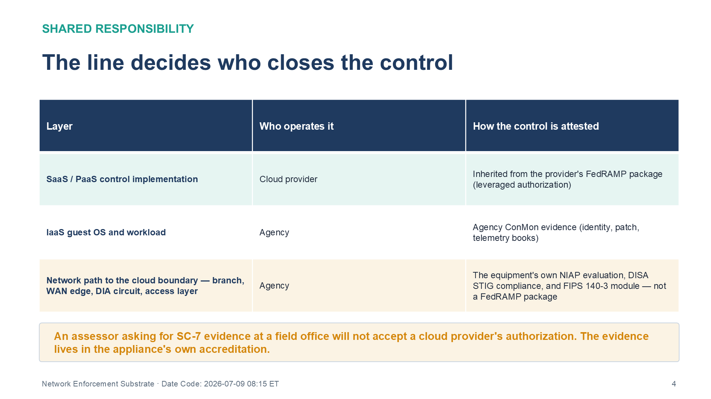
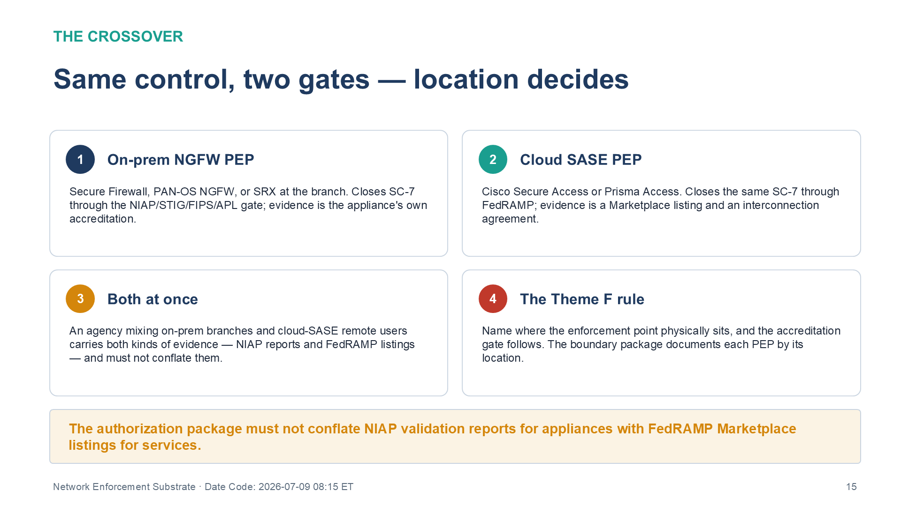

:::: {.content-hidden unless-profile="ssa"}
::: {.fouo-banner}
INTERNAL — NOT FOR PUBLIC DISTRIBUTION
:::
::::

::: {.aan-warning}
## Draft Proposal — Subject to Review

This document is a **draft proposal** developed by the **CSI Team (Cloud Services Infrastructure)**. It is an attempt at a comprehensive -wide technical roadmap and has not been reviewed or approved by the  CIO Office, the Office of Information Security (OIS), or organizational leadership. All recommendations, vendor selections, control mappings, and implementation timelines are subject to revision pending formal review by the  CIO Office and organizational components.

**Date Code:** 2026-07-09 08:41 ET
:::

::: {.aan-important}
**Provisional position.** This book was drafted at temporary series slot 20 to
avoid renumbering the series while the Vulnerability Management book is under
active edit. Its intended home is with the network cluster (immediately after
the Telecommunications Modernization book); the series-wide renumber will move
it there. Cross-references in this document name other books by **title and
role**, not by number, so the move does not break them.
:::

::: {.aan-important}
**Series Context** — The naming/addressing, identity, and transport planes
established earlier in this series describe *what* each network function must
do — resolve a name, authenticate a device, encrypt a circuit, enforce a flow.
This book describes the **customer-owned equipment that performs those functions
at the network edge**, and the federal accreditation gate that lets an agency
buy and field it. It is the *realization* layer for the network side of the
Functional Plane Model: the transport (plane 1), identity (plane 3), and
policy-enforcement (plane 4) planes made of metal, at the part of the
architecture the cloud provider's authorization does not reach.
:::

# What This Document Addresses

Every control-closure argument in this series that ends in a cloud service —
InfoBlox DDI, Entra ID, Sentinel, a SASE point of presence — inherits its
federal authorization from the cloud provider's **FedRAMP** package. That
inheritance is real, and it is clean, right up to the edge of the provider's
boundary. It stops there.

The network between a field office and that boundary — the switch in the wiring
closet, the firewall at the branch, the router terminating the DIA circuit, the
NAC appliance authenticating the port — is **customer-premises equipment**. No
cloud provider's FedRAMP authorization covers it, because the provider does not
operate it. Yet this equipment is exactly what closes a specific, enumerable set
of NIST SP 800-53 Rev 5 controls at the edge:

- **SC-7 / SC-7(8)** — boundary protection and forced-proxy egress, at the branch
- **SC-8 / SC-8(1)** — network-layer encryption on the circuit itself
- **AC-4** — information-flow enforcement where the traffic actually egresses
- **IA-3** — device identity at the physical port, before any user authenticates
- **AC-17** — remote access termination
- **SI-4** — the telemetry that proves any of the above happened

These controls cannot be inherited. They must be *closed by gear the agency
owns* — and that gear is accredited on an entirely different registry than a
cloud service, with different evidence. This book states that gate (Theme F of
the series), then maps it across the three network-equipment manufacturers a
federal agency is most likely to field: **Cisco, Palo Alto Networks, and
Juniper Networks.**

# The Shared-Responsibility Line Decides Who Closes the Control

FedRAMP answers "is this cloud service authorized for federal use?" It does not,
and cannot, answer "is the firewall in your branch office hardened and
validated?" The shared-responsibility model draws the line:

| Layer | Who operates it | How the control is attested |
|---|---|---|
| SaaS / PaaS control implementation | Cloud provider | Inherited from the provider's **FedRAMP** package (leveraged authorization) |
| IaaS guest OS and workload | Agency | Agency ConMon evidence (see the identity, patch, and telemetry books) |
| **Network path to the cloud boundary — branch, WAN edge, DIA circuit, access layer** | **Agency** | **The equipment's own NIAP evaluation, DISA STIG compliance, and FIPS 140-3 module — not a FedRAMP package** |

The line matters because an assessor asked to see evidence for SC-7 at a field
office will not accept "our cloud provider is FedRAMP-authorized." The boundary
protection at that office is enforced by an appliance the agency bought,
configured, and operates — and the evidence lives in that appliance's
accreditation, not the provider's.

{#fig-nes-shared fig-alt="A three-row responsibility table under the heading The line decides who closes the control, with columns Layer, Who operates it, and How the control is attested. Row one: SaaS / PaaS control implementation is operated by the cloud provider and attested by inheriting from the provider's FedRAMP package (leveraged authorization). Row two: IaaS guest OS and workload is operated by the agency and attested with agency ConMon evidence drawn from the identity, patch, and telemetry books. Row three, highlighted in amber: the network path to the cloud boundary — branch, WAN edge, DIA circuit, access layer — is operated by the agency and attested by the equipment's own NIAP evaluation, DISA STIG compliance, and FIPS 140-3 module, not a FedRAMP package. A footer banner warns that an assessor asking for SC-7 evidence at a field office will not accept a cloud provider's authorization — the evidence lives in the appliance's own accreditation. White background. Source: Vol I Book 07 — Network Enforcement Substrate briefing deck, Date Code 2026-07-09 17:00 ET." width="100%"}

# Theme F Formalized — The Accreditation Gate for Network Gear

{#fig-nes-gate fig-alt="Four cards on a white background: (1) NIAP Common Criteria — independent evaluation against a federal Protection Profile; (2) DISA STIG — the hardened configuration baseline, with STIG-compliance scans as the operational evidence; (3) FIPS 140-3 — NIST CMVP-validated cryptographic module for SC-8/SC-13 encryption; (4) DoDIN APL — approval to connect to DoD networks. A banner notes that edge-control evidence is assembled from the NIAP validation report, the STIG scan output, the CMVP certificate number, and the APL listing." width="100%"}

A cloud service passes one gate: FedRAMP. Network and endpoint *gear* passes a
composed gate of four federal mechanisms, each certifying a different property.

| Mechanism | Registry / authority | What it certifies |
|---|---|---|
| **NIAP Common Criteria** | NIAP Product Compliant List (Protection Profiles for Network Devices, Stateful Firewalls, etc.) | The product was independently evaluated against a federal Protection Profile — its security functions work as claimed in an evaluated configuration |
| **DISA STIG** | DoD Cyber Exchange | The hardened configuration baseline the device must run in; STIG-compliance scans are the operational evidence |
| **FIPS 140-3** | NIST Cryptographic Module Validation Program (CMVP) | The cryptographic module performing SC-8/SC-13 encryption is validated — not merely "AES-capable" |
| **DoDIN APL** | DISA Approved Products List | The product is approved to connect to DoD networks (the strictest federal fielding gate; civilian agencies frequently treat APL listing as an assurance signal) |

: The Four-Part Accreditation Gate for Network Gear {.striped .hover}

These compose: an appliance may be **NIAP-evaluated** (its design was assessed),
running a **DISA STIG** baseline (it is hardened), with a **FIPS 140-3** module
(its crypto is validated), and **DoDIN APL-listed** (it is approved to field).
An agency's control evidence for edge-enforced controls is assembled from these
four sources — the NIAP validation report, the STIG scan output, the CMVP
certificate number, and the APL listing — none of which appears in any cloud
provider's FedRAMP package.

::: {.aan-note}
## FedRAMP scope reminder

This series targets **FedRAMP Moderate**. Where a vendor also offers a
cloud-delivered capability that carries its own FedRAMP authorization (for
example, a SASE service — see *Where Gear Becomes a Cloud Service* below), state
the CSO's actual authorization status verified on the FedRAMP Marketplace at
procurement, and never claim a level above Moderate.
:::

# The Enforcement Substrate — Vendor Realization

The series rule holds: **mechanism, not product.** The function is the control;
the vendor product is a deployed *example* of the mechanism. The matrix below
maps each edge function to how each of the three manufacturers realizes it, and
to the NIST control it closes. Every cell is a candidate implementation, not a
recommendation; final selection is a procurement decision validated against the
NIAP PCL, the CMVP list, and the DoDIN APL at time of buy.

| Function / NIST control | Cisco | Palo Alto Networks | Juniper Networks |
|---|---|---|---|
| **Boundary protection — SC-7, SC-7(8), AC-4** | Secure Firewall (Firepower) | NGFW / PAN-OS + Panorama | SRX Series / Junos + Security Director |
| **Encrypted overlay — SC-8, SC-8(1)** | Catalyst SD-WAN (Viptela) | Prisma SD-WAN | Session Smart Router (128T) |
| **Distributed PEP / TIC 3.0 — SC-7, AC-4** | Secure Access / Umbrella (cloud) | Prisma Access (cloud SASE) | — (partners for SASE) |
| **Device identity / NAC — IA-3, AC-19** | ISE + TrustSec | — (integrates 802.1X) | Mist Access Assurance |
| **Config-as-truth — CM-2, CM-6** | Catalyst Center | — | Apstra (intent-based) |
| **Detection / telemetry — SI-4, AU-6** | Secure Network Analytics, XDR | Cortex XDR / XSIAM | — (flow export to SIEM) |
| **Remote access — AC-17** | Secure Client (AnyConnect) | GlobalProtect | — |

: Edge Function → Vendor Realization → NIST Control {.striped .hover}

## Worked closures — the functions that must be gear

Three functions in the matrix are *necessity closures*: no cloud inheritance and
no scanner can substitute for the equipment.

**SC-8 network-layer encryption on the circuit (necessity).** A DIA or MPLS
circuit carries traffic that is unencrypted at the network layer unless an
overlay encrypts it. Application-layer TLS is not a substitute — it covers only
TLS-aware flows and provides no network-layer integrity for the rest. The only
mechanism that encrypts *all* traffic on the path is an IPsec (or MACsec,
hop-by-hop) overlay terminated on customer edge equipment — Catalyst SD-WAN,
Prisma SD-WAN, or Session Smart Router. The cipher must be a **FIPS 140-3
validated** module, which is a property of the appliance, not of the protocol.

**IA-3 device identity at the port (necessity).** Before any user authenticates,
the network must know what is physically connected. That is an 802.1X
authenticator function performed by the access switch, paired with a NAC policy
service — ISE on-premises, or a cloud-hosted service such as Mist Access
Assurance. The authenticator itself is always on the wire, in gear the agency
owns; the port-level enforcement cannot move off the switch. Where the NAC policy
service is cloud-delivered it is a second gear-becomes-cloud-service crossover
alongside the SASE PEP below, carrying FedRAMP-side evidence for its policy plane
even though the IA-3 authenticator anchored here stays on-premises under the
NIAP/STIG/FIPS gate.

**SC-7 boundary protection at the branch (necessity under TIC 3.0).** Under TIC
3.0, a branch running Direct Internet Access requires a distributed enforcement
point providing protection *commensurate with the agency's risk tolerance* — in
practice the applicable security-capabilities catalog entries.
That PEP is either an on-premises NGFW (Secure Firewall, PAN-OS NGFW, SRX) or a
cloud-delivered SASE service — and which one it is determines which gate applies
(next section).

# Where Gear Becomes a Cloud Service — the FedRAMP ↔ NIAP Crossover

Two of the functions above have a cloud-delivered form. When the distributed PEP
is an on-premises appliance, it passes the NIAP/STIG/FIPS/APL gate. When it is a
cloud-delivered SASE service — Cisco Secure Access, Palo Alto Prisma Access — it
passes the **FedRAMP** gate instead, and the boundary documentation treats it as
an external service (interconnection agreement, Marketplace verification). The
same control (SC-7) is closed by different equipment with different accreditation
depending on where the enforcement point physically sits.

{#fig-nes-crossover fig-alt="A four-card layout under the heading Same control, two gates — location decides. Card one, On-prem NGFW PEP: a Secure Firewall, PAN-OS NGFW, or SRX at the branch closes SC-7 through the NIAP/STIG/FIPS/APL gate, and the evidence is the appliance's own accreditation. Card two, Cloud SASE PEP: Cisco Secure Access or Prisma Access closes the same SC-7 through FedRAMP, and the evidence is a Marketplace listing and an interconnection agreement. Card three, Both at once: an agency mixing on-prem branches and cloud-SASE remote users carries both kinds of evidence — NIAP reports and FedRAMP listings — and must not conflate them. Card four, The Theme F rule: name where the enforcement point physically sits and the accreditation gate follows; the boundary package documents each PEP by its location. A footer banner states the authorization package must not conflate NIAP validation reports for appliances with FedRAMP Marketplace listings for services. White background. Source: Vol I Book 07 — Network Enforcement Substrate briefing deck, Date Code 2026-07-09 17:00 ET." width="100%"}

This crossover is the single most common source of federal boundary confusion,
and stating it explicitly is the point of Theme F: **name the enforcement
point's location, and the accreditation gate follows from it.** An agency that
mixes on-premises NGFW branches and cloud-SASE remote users will carry *both*
kinds of evidence — NIAP validation reports for the appliances and FedRAMP
Marketplace listings for the service — and its authorization package must not
conflate them.

# Interoperability Seams — Why Multi-Vendor Is the Normal Case

Federal networks are rarely single-vendor, and the enforcement substrate is
designed around open seams rather than a single manufacturer's fabric:

- **802.1X** separates the *authenticator* (any vendor's access switch) from the
  *authentication server* (RADIUS — ISE, Mist, or a third-party). A Cisco switch
  can authenticate against a policy service that also serves Juniper access
  points; the supplicant, authenticator, and server need not share a vendor.
- **MACsec (SC-8, hop-by-hop)** encrypts link-by-link at Layer 2 between
  compliant devices and is standardized (IEEE 802.1AE), so a mixed-vendor access
  layer can still encrypt every hop.
- **RADIUS / TACACS+** carry policy and device-administration authentication
  across vendors, binding the whole substrate to the identity plane established
  earlier in the series.

The seams are why the series speaks of a *substrate* rather than a *platform*:
the functions compose across manufacturers precisely because they rest on open
protocols, not a proprietary controller.

# Closure Necessity — The Edge Controls With No Alternate Path

> **Closure Necessity — SC-8 on a bare circuit.** There is no configuration
> setting, scanner finding, or cloud authorization that encrypts a DIA circuit
> at the network layer. Only an IPsec/MACsec overlay terminated on FIPS 140-3
> validated customer edge equipment does. Inherit nothing here — the control is
> closed by gear or it is open.

> **Closure Necessity — IA-3 at the port.** You cannot inventory or authenticate
> what you cannot see at Layer 2. Device identity at the physical port is an
> 802.1X authenticator function on customer-owned access gear; the switchport
> enforcement cannot be relocated to the cloud, even when the NAC policy service
> that decides the outcome is cloud-hosted (Mist Access Assurance). This is the
> same necessity the Network Access Control book argues, viewed from the
> equipment that performs it.

# NIST SP 800-53 Rev 5 Control Closure — Authorities Closed Here

The table below is **generated from the series compliance spine**
(`orgcomp-compliance-spine.yml`) and regenerated by `render_authorities_table.py`;
it is not hand-maintained. Each row names the closing mechanism as a function,
the accreditation gate (all NIAP/STIG/FIPS/APL for this book's customer-owned
gear), the authority drivers, the evidence slot, and whether conformance tooling
alone can attest it (uniformly **No** here — edge-gear evidence is assembled from
NIAP/STIG/FIPS/APL sources, not a SCuBA-style tenant scan).

<!-- authorities:book-net-enforce — generated from orgcomp-compliance-spine.yml; do not hand-edit -->
| Control | Title | Closing mechanism (function, not product) | Accreditation gate | Authority drivers | Evidence slot | FedRAMP 20x KSI | Tool-attestable? |
|---|---|---|---|---|---|---|---|
| SC-8 † | Transmission Confidentiality and Integrity | IPsec/MACsec overlay on customer-premises transport (function: network-layer encryption) | NIAP CC + DISA STIG + FIPS 140-3 + DoDIN APL | NIST SP 800-53 Rev 5; EO 14028 | Network | KSI-CNA | No |
| SC-8(1) | Cryptographic Protection | FIPS 140-3 validated cipher suite on the overlay | NIAP CC + DISA STIG + FIPS 140-3 + DoDIN APL | NIST SP 800-53 Rev 5 | Network | KSI-CNA | No |
| AC-19 | Access Control for Mobile Devices | NAC posture gating at the access layer | NIAP CC + DISA STIG + FIPS 140-3 + DoDIN APL | NIST SP 800-53 Rev 5; OMB M-22-09 | Endpoint | KSI-IAM | No |
| IA-3 † | Device Identification and Authentication | 802.1X authenticator + NAC at the port (function: device identity at the edge) | NIAP CC + DISA STIG + FIPS 140-3 + DoDIN APL | NIST SP 800-53 Rev 5; NIST SP 800-207; CISA ZTMM v2.0 | Network | KSI-IAM | No |
| AC-17 | Remote Access | Vendor ZTNA/remote-access gateway (function: per-session remote access) | NIAP CC + DISA STIG + FIPS 140-3 + DoDIN APL | NIST SP 800-53 Rev 5; OMB M-22-09; CISA ZTMM v2.0 | Network | KSI-CNA | No |
| AC-4 | Information Flow Enforcement | Application-aware flow policy at the NGFW/SASE PEP | NIAP CC + DISA STIG + FIPS 140-3 + DoDIN APL | NIST SP 800-53 Rev 5; NIST SP 800-207; CISA TIC 3.0 | Network | KSI-CNA | No |
| SC-7 | Boundary Protection | NGFW boundary enforcement at the customer-owned edge (function: distributed policy enforcement point) | NIAP CC + DISA STIG + FIPS 140-3 + DoDIN APL | NIST SP 800-53 Rev 5; CISA TIC 3.0; NIST SP 800-207 | Network | KSI-CNA | No |
| SC-7(8) | Route Traffic to Authenticated Proxy Servers | Forced-proxy egress through the SASE/SWG enforcement point | NIAP CC + DISA STIG + FIPS 140-3 + DoDIN APL | NIST SP 800-53 Rev 5; CISA TIC 3.0 | Network | KSI-CNA | No |
| SI-4 | System Monitoring | Network detection/telemetry export from the enforcement substrate to the evidence contract | NIAP CC + DISA STIG + FIPS 140-3 + DoDIN APL | NIST SP 800-53 Rev 5; OMB M-21-31 | Telemetry | KSI-MLA | No |

: Authorities Closed Here — Network Enforcement Substrate (Cisco/Palo Alto/Juniper) († = Closure-Necessity anchor: no alternate closure path) {.striped .hover}

# FedRAMP 20x KSI Alignment

The edge substrate feeds two KSI themes. **KSI-CNA** (Cloud Native
Architecture / network segmentation and boundary) draws its edge evidence from
the boundary, overlay, and flow-enforcement controls above — the on-premises
half of the same theme the cloud SASE service serves. **KSI-IAM** gains its
device-identity evidence (IA-3) from the NAC substrate, complementing the user-
and workload-identity evidence the identity books provide. **KSI-MLA** receives
the SI-4 network telemetry export. In every case the KSI is attested from the
gear's own accreditation and telemetry, not from a tenant-configuration scan —
which is why the *Tool-attestable?* column is uniformly **No** and the evidence
routes through the unified compliance contract described in the coordination
doctrine (Executive Summary).

::: {.aan-note}
## Vendor Selection Status

Network-equipment manufacturer selections are pending agency procurement review.
The three manufacturers mapped here (Cisco, Palo Alto Networks, Juniper Networks)
reflect federal fielding prevalence and Protection-Profile coverage at time of
writing; other NIAP-evaluated, DoDIN APL-listed manufacturers (e.g., Fortinet,
Arista) satisfy the same mechanism classes. Final selection requires validation
against the current NIAP Product Compliant List, the NIST CMVP validated-modules
list, the applicable DISA STIG, and the DoDIN APL, plus agency-specific
environment testing and procurement authority.
:::

# References

| Reference | Description |
|---|---|
| NIST SP 800-53 Rev 5 | Security and Privacy Controls — SC-7, SC-8, AC-4, IA-3, AC-17, SI-4 |
| NIST SP 800-207 | Zero Trust Architecture |
| CISA TIC 3.0 | Trusted Internet Connections — distributed enforcement / DIA permissibility |
| NIAP Product Compliant List | Common Criteria evaluated products — <https://www.niap-ccevs.org/Product/> |
| NIST CMVP (FIPS 140-3) | Cryptographic Module Validation Program — <https://csrc.nist.gov/projects/cryptographic-module-validation-program/validated-modules> |
| DISA STIGs | Security Technical Implementation Guides — <https://public.cyber.mil/stigs/> |
| DoDIN APL | DoD Information Network Approved Products List — <https://aplits.disa.mil/> |
| FedRAMP Marketplace | Cloud service authorization verification — <https://marketplace.fedramp.gov/> |
| Cisco Identity Services Engine (ISE) | 802.1X / NAC / TrustSec — <https://www.cisco.com/site/us/en/products/security/identity-services-engine/index.html> |
| Cisco Secure Firewall | NGFW boundary protection — <https://www.cisco.com/site/us/en/products/security/firewalls/index.html> |
| Cisco Catalyst SD-WAN | Encrypted overlay (Viptela) — <https://www.cisco.com/site/us/en/solutions/networking/sdwan/index.html> |
| Palo Alto Networks NGFW / PAN-OS | Boundary protection, App-ID flow enforcement — <https://www.paloaltonetworks.com/network-security/next-generation-firewall> |
| Palo Alto Networks Prisma Access | Cloud-delivered SASE PEP (FedRAMP-gated) — <https://www.paloaltonetworks.com/sase/access> |
| Juniper SRX Series | NGFW / Junos boundary protection — <https://www.juniper.net/us/en/products/security/srx-series.html> |
| Juniper Mist Access Assurance | Cloud-based NAC / 802.1X — <https://www.juniper.net/us/en/products/cloud-services/access-assurance.html> |
| Juniper Apstra | Intent-based config-as-truth (CM-2/CM-6) — <https://www.juniper.net/us/en/products/network-automation/apstra.html> |

: Reference Documents and Vendor Sources {.striped .hover}
