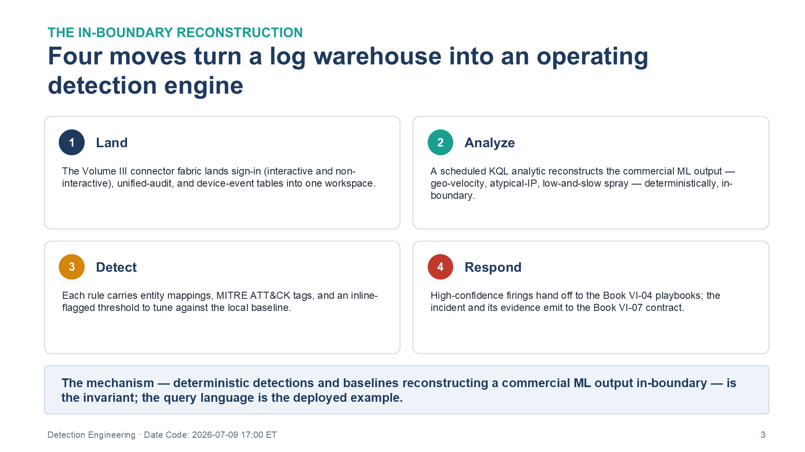
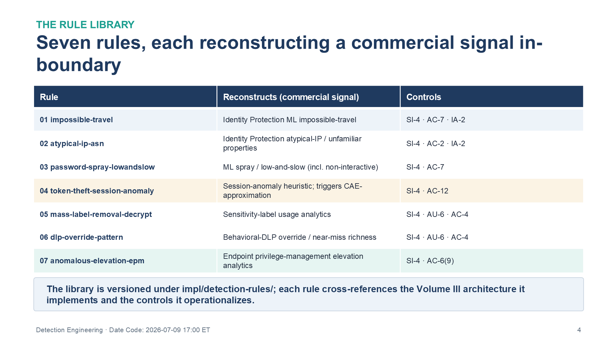
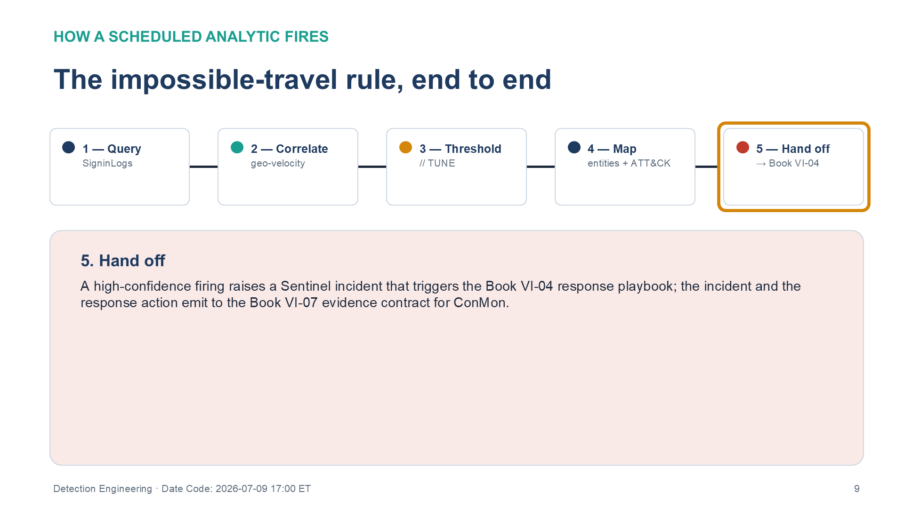

:::: {.content-hidden unless-profile="ssa"}
::: {.fouo-banner}
INTERNAL — NOT FOR PUBLIC DISTRIBUTION
:::
::::

::: {.aan-warning}
## Draft Proposal — Subject to Review

This document is a **draft proposal** developed by the **CSI Team (Cloud Services Infrastructure)** and has not been reviewed or approved by the  CIO Office, the Office of Information Security (OIS), or organizational leadership. All recommendations, vendor selections, control mappings, and thresholds are subject to revision.

**Date Code:** 2026-07-09 15:13 ET
:::

::: {.aan-important}
**Series Context** — This is Volume VI Book 03 of the Federal Organization Compliance series. The Volume III SIEM/XDR Detection book establishes the *architecture*: the connector fabric that lands every log source into a single analytics workspace and the requirement that a connected SIEM carry configured detection rules, not a passive archive. This book is the *deployable realization* of that architecture — the versioned analytics-rule library an engineering team applies to the workspace to turn the log warehouse into an operating detection engine.
:::

# What This Document Addresses

The Volume III SIEM/XDR book makes the assessor-facing argument that AU-6 is not satisfied by log collection alone: a SIEM with zero configured analytics rules, or every rule disabled pending tuning, fails the control. It stops at the architecture. This book carries the rules.

The specific engineering problem it solves is this: the richest behavioral and real-time detections a modern cloud offers — machine-learning risk scoring, impossible-travel, sub-second session revocation, behavioral data-loss analytics — are computed in the vendor's **commercial multi-tenant** analytics pipeline. Inside a federal authorization boundary, that pipeline is frequently out of scope: the raw telemetry may not leave the boundary for commercial multi-tenant ML. The detection capability is therefore degraded not because the data is missing, but because the analytic layer over it sits outside the boundary.

The rules in this book **reconstruct that analytic layer inside the agency's own boundary**. They run over the telemetry the Volume III connector fabric already lands — sign-in logs, unified audit, device events — and produce rule-and-baseline equivalents of the commercial ML outputs, feeding the result back into the agency's own access and response decisions.

{#fig-vol6b03-moves fig-alt="A two-by-two grid of four numbered cards describing how the in-boundary detection engine is reconstructed. Card 1, Land — the Volume III connector fabric lands sign-in (interactive and non-interactive), unified-audit, and device-event tables into one analytics workspace. Card 2, Analyze — a scheduled KQL analytic reconstructs the commercial machine-learning output, such as geo-velocity, atypical-IP, and low-and-slow spray, deterministically and in-boundary. Card 3, Detect — each rule carries entity mappings, MITRE ATT&CK tags, and an inline-flagged threshold to tune against the local baseline. Card 4, Respond — high-confidence firings hand off to the Book VI-04 playbooks, and the incident and its evidence emit to the Book VI-07 contract. A banner beneath the grid states the mechanism, deterministic detections and baselines reconstructing a commercial ML output in-boundary, is the invariant, and the query language is the deployed example. White background. Source: Vol VI Book 03 — Federal Organization Compliance — Detection Engineering briefing deck, Date Code 2026-07-09 17:00 ET." width="100%"}

::: {.aan-note}
**Deployed example** — The rule library ships in the Microsoft Sentinel scheduled-analytics-rule format (`kind: Scheduled`), because Sentinel is the deployed example for the  estate and its KQL runs directly over the Volume III tables. The *mechanism* — deterministic detections and baselines reconstructing a commercial ML output in-boundary — is portable; the same detections are portable to Splunk (SPL) and Elastic (EQL/ES|QL) so a different SIEM realizes them (the library README documents the portability; the shipped rules are authored in the Sentinel format). The mechanism is the invariant; the query language is the deployed example.
:::

# The In-Boundary Principle

The single fact that makes this library lawful where inheriting the commercial analytic is not: the boundary constrains the **destination** of raw telemetry, not the data itself. The blocked flow is raw, identity-attributed behavioral telemetry leaving the boundary for a commercial multi-tenant analytics service. The rebuild flow is the *same* telemetry routed to the agency's own analytics workspace **inside its own authorized boundary** — exactly the in-boundary monitoring SI-4 and AU-2/AU-3 contemplate. Every component the library depends on (the workspace, any model-training compute) must itself be authorized and in-boundary; the moment the telemetry is shipped to an out-of-scope service for convenience, the library has recreated the flow the boundary forbids.

# The Rule Library

The library is a versioned set of analytics rules under `impl/detection-rules/`. Each rule carries entity mappings, MITRE ATT&CK tags, tuning thresholds flagged inline, and a cross-reference to the architecture book it implements and the controls it operationalizes.

{#fig-vol6b03-library fig-alt="A three-column table listing the seven detection rules in the library. Columns are Rule, Reconstructs (commercial signal), and Controls. Rows: 01 impossible-travel — reconstructs Identity Protection ML impossible-travel — controls SI-4, AC-7, IA-2. 02 atypical-ip-asn — reconstructs Identity Protection atypical-IP / unfamiliar properties — controls SI-4, AC-2, IA-2. 03 password-spray-lowandslow — reconstructs ML spray / low-and-slow including non-interactive — controls SI-4, AC-7. 04 token-theft-session-anomaly — reconstructs a session-anomaly heuristic that triggers CAE-approximation — controls SI-4, AC-12. 05 mass-label-removal-decrypt — reconstructs sensitivity-label usage analytics — controls SI-4, AU-6, AC-4. 06 dlp-override-pattern — reconstructs behavioral-DLP override / near-miss richness — controls SI-4, AU-6, AC-4. 07 anomalous-elevation-epm — reconstructs endpoint privilege-management elevation analytics — controls SI-4, AC-6(9). A banner states the library is versioned under impl/detection-rules/, and each rule cross-references the Volume III architecture it implements and the controls it operationalizes. White background. Source: Vol VI Book 03 — Federal Organization Compliance — Detection Engineering briefing deck, Date Code 2026-07-09 17:00 ET." width="100%"}

| Rule | Reconstructs (commercial signal) | Implements (Vol III) | Controls operationalized |
|---|---|---|---|
| `01-impossible-travel` | Identity Protection ML impossible-travel | SIEM/XDR | SI-4, AC-7, IA-2 |
| `02-atypical-ip-asn` | Identity Protection atypical-IP / unfamiliar properties | SIEM/XDR | SI-4, AC-2, IA-2 |
| `03-password-spray-lowandslow` | ML spray / low-and-slow (incl. non-interactive) | SIEM/XDR | SI-4, AC-7 |
| `04-token-theft-session-anomaly` | Session-anomaly heuristic; triggers CAE-approximation response | SIEM/XDR | SI-4, AC-12 |
| `05-mass-label-removal-decrypt` | Sensitivity-label usage analytics | SIEM/XDR + Data Protection | SI-4, AU-6, AC-4 |
| `06-dlp-override-pattern` | Behavioral-DLP override / near-miss richness | SIEM/XDR + Data Protection | SI-4, AU-6, AC-4 |
| `07-anomalous-elevation-epm` | Endpoint privilege-management elevation analytics | SIEM/XDR + PAM | SI-4, AC-6(9) |

## Illustrative rule shape

Each rule is a scheduled KQL analytic over the Volume III tables. The impossible-travel rule is representative: a geo-velocity correlation across successful sign-ins, firing when the implied travel speed exceeds a commercial flight.

```kql
SigninLogs
| where ResultType == 0
| extend Lat = todouble(LocationDetails.geoCoordinates.latitude),
         Lon = todouble(LocationDetails.geoCoordinates.longitude)
| sort by UserPrincipalName asc, TimeGenerated asc
| serialize
| extend PrevLat = prev(Lat), PrevLon = prev(Lon),
         PrevTime = prev(TimeGenerated), PrevUser = prev(UserPrincipalName)
| where UserPrincipalName == PrevUser
| extend Hours = datetime_diff('minute', TimeGenerated, PrevTime) / 60.0
| extend Km = geo_distance_2points(PrevLon, PrevLat, Lon, Lat) / 1000.0
| where Hours > 0 and (Km / Hours) > 900   // faster than a commercial flight — TUNE per estate
```

The full, deployable rules — with entity mappings, ATT&CK tags, and per-rule tuning notes — are in the `impl/detection-rules/` catalog alongside this book.

{#fig-vol6b03-rule fig-alt="A horizontal five-stage pipeline diagram showing how the impossible-travel scheduled analytic fires, left to right. Stage 1, Query — the rule reads successful sign-ins from the Volume III SigninLogs table (ResultType == 0) and extracts the geo-coordinates the sign-in event already carries, so no new telemetry leaves the boundary. Stage 2, Correlate — serialized and sorted per user, the rule compares each sign-in to the previous one and computes implied travel speed with geo_distance_2points over the elapsed time, the deterministic equivalent of the commercial impossible-travel model. Stage 3, Threshold — a conservative velocity threshold flagged inline for tuning per estate. Stage 4, Map — entity mappings and MITRE ATT&CK tags are attached. Stage 5, Hand off — a high-confidence firing raises a Sentinel incident that triggers the Book VI-04 response playbook, and the incident and response action emit to the Book VI-07 evidence contract for continuous monitoring. All five stages are shown connected in sequence. White background. Source: Vol VI Book 03 — Federal Organization Compliance — Detection Engineering briefing deck, Date Code 2026-07-09 17:00 ET." width="100%"}

# Deployment

The rules use the Sentinel scheduled-analytics-rule YAML schema and deploy through the SIEM's repository connection (GitHub / Azure DevOps), a PowerShell module, or ARM conversion — through the change-controlled pipeline of Book VI-00, never by click-path. **Every threshold is a conservative starting point flagged `// TUNE:` and must be calibrated against the agency's own baseline before the rule is enabled.** The prerequisite is the Volume III connector fabric: the sign-in (interactive *and* non-interactive), unified-audit, and device-event tables the rules query must already be landing.

# Closure Necessity

::: {.aan-tip}
## Closure Necessity — the rule is what makes AU-6 assessable

The Volume III architecture proves a connected SIEM is the mechanism that satisfies AU-6/SI-4. This book is what makes that closure *demonstrable*: an assessor's actual evidence request is "show me an alert that fired in the last 30 days and the incident it generated." A SIEM with no rules cannot produce that artifact. The rules here are not an alternate closure path — they are the deployed form of the one the architecture names. Without them, the SSP describes a detection control no assessor can exercise.
:::

# Honest Limits

Carry these into any assessment; the library does not pretend to commercial parity.

- These are **minutes-to-hours** detections, not the continuously-tuned commercial-minutes fidelity of the vendor's pipeline.
- They carry **no global threat intelligence** — the agency sees only its own tenant. The atypical-IP and leaked-credential joins are bounded by whatever threat-intel feed the agency subscribes to.
- The session-anomaly rule (`04`) triggers a response playbook (Book VI-04) that approximates real-time session revocation at **minutes, not sub-second**.
- Detections **rot**: thresholds drift and sources silently stop emitting. The operate-and-tune capability — the standing detection- and data-engineering that maintains and re-tunes the library — is the real cost and the precondition for the maturity claim holding over time. Book VI-08 carries the validation harnesses that catch silent decay.

# Cross-References

- **Volume III — SIEM/XDR Detection** — the connector architecture and the AU-6 argument this library deploys.
- **Book VI-04 — Response Automation (SOAR)** — the playbooks high-confidence firings trigger.
- **Book VI-07 — Evidence & ConMon Pipeline** — where rule firings and incidents emit to the evidence contract.
- **Book VI-08 — Validation & Test Harnesses** — detection-efficacy and telemetry-completeness testing.
- **Rule catalog:** `impl/detection-rules/`.

# Provenance

This book operationalizes the detection layer of the Volume III SIEM/XDR architecture. Vendor-specific claims (table schemas, KQL functions, Sentinel rule format) are sourced to Microsoft Learn, whose links are carried in the briefing deck spec and the Volume III architecture book rather than inline here; the reconstruction logic and thresholds are agency-authored and must be tuned to the local estate. Products named are deployed examples of the deterministic-detection mechanism, not the mechanism itself.
