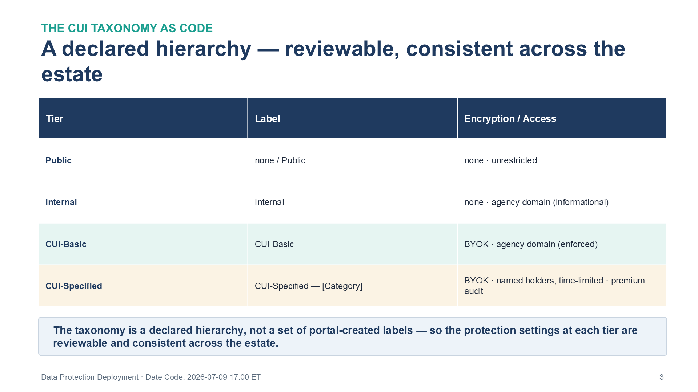
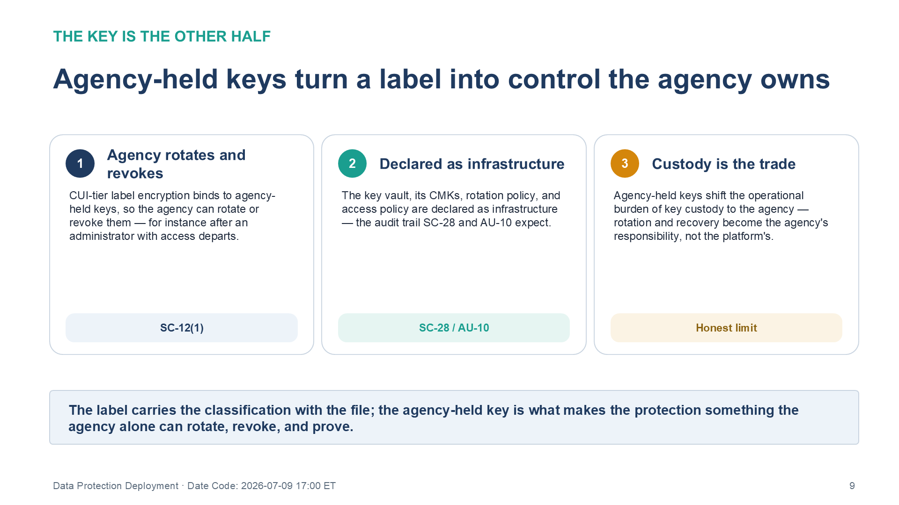
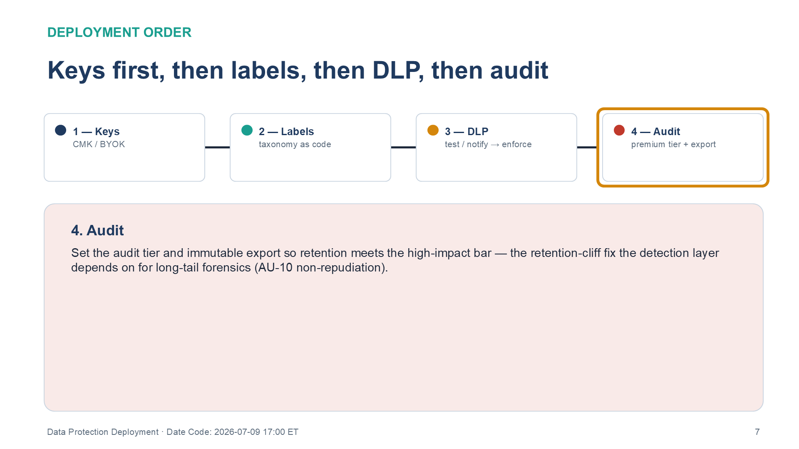

:::: {.content-hidden unless-profile="ssa"}
::: {.fouo-banner}
INTERNAL — NOT FOR PUBLIC DISTRIBUTION
:::
::::

::: {.aan-warning}
## Draft Proposal — Subject to Review
Developed by the **CSI Team (Cloud Services Infrastructure)**; not yet reviewed or approved by the  CIO Office, OIS, or leadership. **Date Code:** 2026-07-09 15:13 ET
:::

::: {.aan-important}
**Series Context** — Volume VI Book 05. Deployable realization of **Volume III (Data Protection)**: the federal CUI sensitivity-label taxonomy, DLP policy packs, and agency-controlled cryptographic key management, expressed as code and applied through the Book VI-00 pipeline.
:::

# What This Document Addresses

Volume III establishes that the payload — not the pipe — is the unprotected surface: a network boundary can see a file move but cannot tell whether it is a press release or a Privacy Act record, so it cannot enforce "block external sharing of CUI." Classification, movement restriction, and agency-controlled encryption are the closing mechanisms.

This book deploys them as code: the CUI label taxonomy, DLP policies as versioned packs, and key management (customer-managed keys, rotation, revocation) as infrastructure. Deploying the taxonomy as code is what makes the classification *travel with the payload* and the enforcement *reproducible* — the label is the machine-readable signal every downstream control (DLP, the CASB, the Book VI-03 detections) acts on.

# The Federal CUI Taxonomy as Code

The taxonomy is a declared hierarchy, not a set of portal-created labels, so that the protection settings at each tier are reviewable and consistent across the estate.

{#fig-vol6b05-taxonomy fig-alt="A three-column table titled 'A declared hierarchy — reviewable, consistent across the estate' with a dark navy header row labeled Tier, Label, and Encryption / Access. Four tier rows descend in sensitivity. Public: label 'none / Public', encryption none, access unrestricted. Internal: label 'Internal', encryption none, access agency domain (informational). CUI-Basic (shaded light teal): label 'CUI-Basic', encryption BYOK, access agency domain (enforced). CUI-Specified (shaded light amber): label 'CUI-Specified — [Category]', encryption BYOK, access named holders, time-limited, with premium audit. A callout beneath the table states the taxonomy is a declared hierarchy, not a set of portal-created labels, so the protection settings at each tier are reviewable and consistent across the estate. White background. Source: Vol VI Book 05 — Federal Organization Compliance — Data Protection Deployment briefing deck, Date Code 2026-07-09 17:00 ET." width="100%"}

| Tier | Label | Encryption | Access scope | Audit |
|---|---|---|---|---|
| Public | none / "Public" | none | unrestricted | standard |
| Internal | "Internal" | none | agency domain (informational) | standard |
| CUI-Basic | "CUI-Basic" | yes — BYOK | agency domain (enforced) | standard + label events |
| CUI-Specified | "CUI-Specified — [Category]" | yes — BYOK | named holders, time-limited | premium |

## Illustrative artifact — label taxonomy and BYOK protection as code

```powershell
# Sensitivity label taxonomy (deployed example: Purview, applied via PowerShell) — AC-4 / SC-28
New-Label -Name "CUI-Basic" -DisplayName "CUI-Basic" `
  -EncryptionEnabled $true -EncryptionProtectionType "Template" `
  -EncryptionRightsDefinitions $agencyDomainRights `        # access scope = agency domain (enforced)
  -ContentType "File, Email, Site, UnifiedGroup"
New-Label -Name "CUI-Specified-PrivacyAct" -DisplayName "CUI-Specified — Privacy Act" `
  -ParentId (Get-Label "CUI-Specified").Guid `              # child of the Specified parent
  -EncryptionEnabled $true -EncryptionContentExpiredOnDateInDaysOrNever "90"  # time-limited holders
# Keys are agency-held (BYOK): rotation and revocation live in the key-vault module below.
```

The key material is the other half: sensitivity-label encryption for the CUI tiers binds to **agency-held keys**, so the agency can rotate or revoke them — for instance after an administrator with access departs. The key vault, its customer-managed keys, rotation policy, and access policy are declared as infrastructure (SC-12/12(1)), giving the audit trail SC-28 and AU-10 expect.

{#fig-vol6b05-keys fig-alt="A three-card panel titled 'Agency-held keys turn a label into control the agency owns.' Card 1, numbered in navy, 'Agency rotates and revokes': CUI-tier label encryption binds to agency-held keys, so the agency can rotate or revoke them — for instance after an administrator with access departs; tagged SC-12. Card 2, numbered in teal, 'Declared as infrastructure': the key vault, its CMKs, rotation policy, and access policy are declared as infrastructure — the audit trail SC-28 and AU-10 expect; tagged SC-28 / AU-10. Card 3, numbered in amber, 'Custody is the trade': agency-held keys shift the operational burden of key custody to the agency — rotation and recovery become the agency's responsibility, not the platform's; tagged Honest limit. A summary bar beneath states the label carries the classification with the file, and the agency-held key is what makes the protection something the agency alone can rotate, revoke, and prove. White background. Source: Vol VI Book 05 — Federal Organization Compliance — Data Protection Deployment briefing deck, Date Code 2026-07-09 17:00 ET." width="100%"}

# Deployable Artifacts

| Artifact | Realizes (Vol III) | Deployed example | Multi-CSP substitution |
|---|---|---|---|
| Sensitivity-label taxonomy (CUI tiers, parent/child, protection settings) | Information classification & marking | Purview labels via PowerShell/Graph as code | AWS Macie classifications; data-tagging policy |
| DLP policy packs (service/endpoint/network) | AC-4 movement restriction | Purview DLP as code | Symantec/Forcepoint DLP policy-as-code |
| Key management (CMK/BYOK, rotation, access policy) | SC-12/12(1), SC-28 | Key Vault + CMK Terraform | AWS KMS + CloudHSM as code |
| Audit-retention configuration | AU-10 non-repudiation (agency-elected, above the Moderate baseline), retention | Purview Audit tier + export as code | CloudTrail Lake retention config |

# Deployment

{#fig-vol6b05-order fig-alt="A four-step horizontal sequence titled 'Keys first, then labels, then DLP, then audit,' with the fourth step highlighted and all connectors filled to show the completed order. Step 1 (navy), Keys — CMK / BYOK. Step 2 (teal), Labels — taxonomy as code. Step 3 (amber), DLP — test / notify then enforce. Step 4 (red, highlighted), Audit — premium tier plus export. The detail panel for step 4 reads: set the audit tier and immutable export so retention meets the OMB M-26-14 event-logging maturity level and the Volume III audit-retention rationale — the fix for the retention cliff, the point at which standard audit retention lapses, that the detection layer depends on for long-tail forensics (AU-10 non-repudiation). The sequence encodes the dependency chain: labels' encryption depends on the keys, DLP acts on the labels, and audit retention closes the evidence trail. White background. Source: Vol VI Book 05 — Federal Organization Compliance — Data Protection Deployment briefing deck, Date Code 2026-07-09 17:00 ET." width="100%"}

1. Deploy the key vault and customer-managed keys first (the labels' encryption depends on them); set the rotation policy and restrict key access to a minimal, audited set.
2. Apply the label taxonomy as code, then the label auto-labeling / publishing policy scoped to the pilot before tenant-wide.
3. Apply DLP policy packs in **test/notify** mode, measure false positives, then enforce — the Book VI-03 DLP-override detection (rule 06) watches for abuse of the override path once enforcing.
4. Set the audit tier and export so retention meets the OMB M-26-14 event-logging maturity level and the Volume III audit-retention rationale (this is also the fix for the retention cliff, the point at which standard audit retention lapses, that the detection layer depends on for long-tail forensics).

# Closure Necessity

::: {.aan-tip}
## Closure Necessity — a label the pipe can read is what makes payload control possible
Volume III shows a network boundary cannot enforce "block external sharing of CUI" because it cannot read the payload. This book deploys the label that carries the classification *with* the file, and the keys the agency alone can rotate — the deployed form of the payload-protection mechanism. Without a machine-readable label taxonomy and agency-held keys, AC-4 and SC-12 are policy statements no control enforces, and the CASB has no payload signal to act on.
:::

# Controls Operationalized

| Control | Title | How this book deploys it |
|---|---|---|
| AC-4 | Information Flow Enforcement | Label-derived DLP movement restriction |
| SC-12/12(1) | Cryptographic Key Establishment & Management | CMK/BYOK, rotation, revocation as code |
| SC-28 | Protection of Information at Rest | CMK-backed encryption of classified stores |
| AU-10 | Non-repudiation (agency-elected, above the Moderate baseline) | Premium audit tier + immutable export |
| MP-3 | Media Marking | Label-driven electronic marking of CUI; physical-media controls (MP-2/4/5) out of scope |

# Honest Limits

- Auto-labeling accuracy is bounded by the classifier; manual-label discipline and the Book VI-03 mass-label-removal detection are the compensations for mislabeled or stripped content.
- Agency-held keys shift the operational burden of key custody to the agency — rotation and recovery become the agency's responsibility, not the platform's.
- DLP pattern packs restrict movement of *matched* content; they do not reconstruct a content-fingerprint behavioral model (see Book VI-03 rule 06 residual).

# Cross-References

- **Volume III — Data Protection (Purview)** — the architecture this book deploys.
- **Book VI-03** — the label/DLP detections that watch this deployment for abuse.
- **Book VI-01** — the landing zone and authorized boundary the key vault is deployed inside.
- **Book VI-07** — label and key events emit to the evidence contract.

# Provenance

Draft. Products are deployed examples; substitution columns preserve the mechanism. The PowerShell is an illustrative pattern to adapt, not a drop-in script — validate against current cmdlet schemas and the agency's CUI category set. Vendor capability claims name deployed examples and substitution candidates; their Microsoft Learn and AWS documentation sources are carried in the briefing deck spec (Vol_VI_Book_05.yaml), not inline here.
