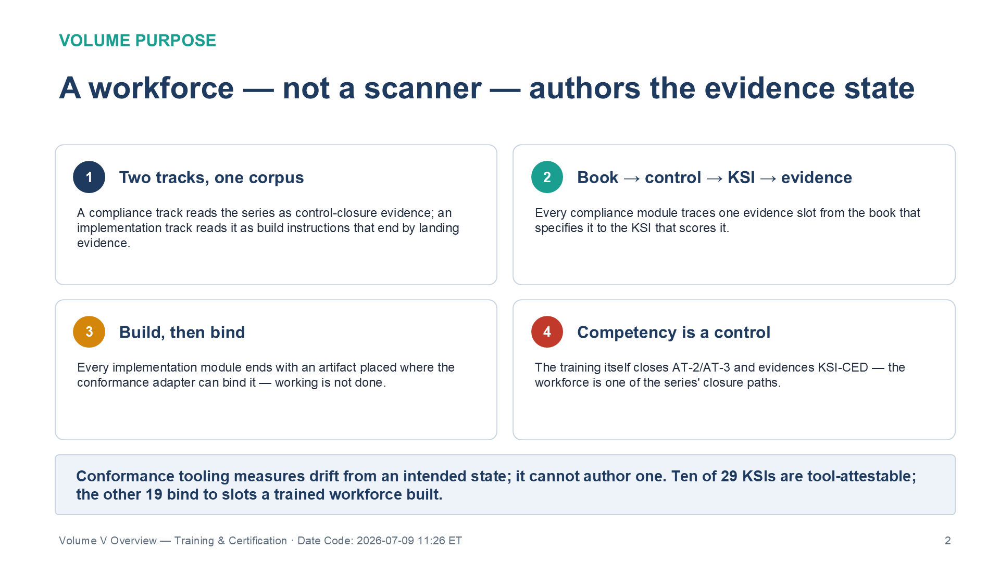
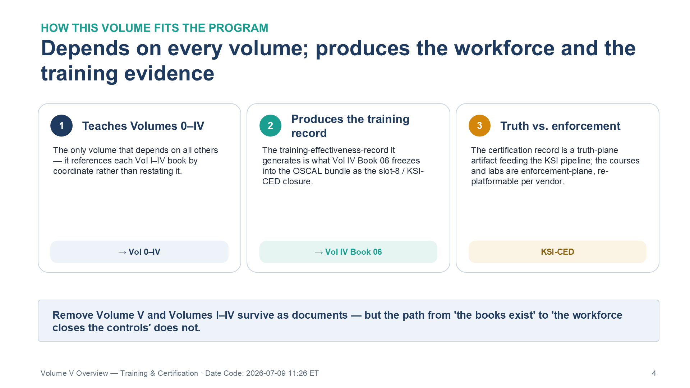

:::: {.content-hidden unless-profile="ssa"}
::: {.fouo-banner}
INTERNAL — NOT FOR PUBLIC DISTRIBUTION
:::
::::

::: {.aan-warning}
## Draft Proposal — Subject to Review

This document is a **draft proposal** developed by the **CSI Team (Cloud Services Infrastructure)**. It has not been reviewed or approved by the  CIO Office, the Office of Information Security (OIS), or organizational leadership.

**Date Code:** 2026-07-09 11:26 ET
:::

# Volume Purpose

**Volume V is where the series becomes a workforce.** Volumes 0–IV describe the
naming and identity substrate, the data platform, the security-operations planes,
and the governance and authorization machinery. None of that closes a control
until someone can **build the mechanism, land its evidence, and trace it** from
the book that specifies it, through the NIST SP 800-53 Rev 5 control it satisfies,
to the FedRAMP 20x KSI that scores it. Volume V builds that competency — and, in
doing so, operationalizes the training program that produces the
`training-effectiveness-record`: proof that the people running the program are trained.

The volume is organized as two tracks over the same corpus. A **compliance
track** reads the series as control-closure evidence — one module per evidence
slot, book → control → KSI → evidence. An **implementation track** reads it as
build instructions — one module per book cluster, each ending by *landing an
evidence artifact* where the conformance adapter can bind it. The volume's
governing claim is the series' Conformance-Tooling Coverage Gap (Vol 0 Book 00,
Executive Summary) turned into a curriculum: **conformance tooling measures
drift from an intended state; it cannot author one. Ten of the series' twenty-nine internal KSI
rules are attestable by ScuBA-class tooling alone; the other nineteen bind to
evidence slots that exist only because a trained workforce built the
architecture in Volumes I–IV.** A workforce, not a scanner, authors the evidence
state — and that competency is itself a control (AT-2/AT-3, KSI-CED).

{#fig-vol5b00-01 fig-alt="A four-panel numbered grid stating why the volume exists. Panel 1, Two tracks, one corpus: a compliance track reads the series as control-closure evidence, while an implementation track reads it as build instructions that end by landing evidence. Panel 2, Book to control to KSI to evidence: every compliance module traces one evidence slot from the book that specifies it to the KSI that scores it. Panel 3, Build then bind: every implementation module ends with an artifact placed where the conformance adapter can bind it — working is not done. Panel 4, Competency is a control: the training itself closes AT-2/AT-3 and evidences KSI-CED, making the workforce one of the series' closure paths. A footer banner states that conformance tooling measures drift from an intended state but cannot author one — ten of twenty-nine KSIs are tool-attestable and the other nineteen bind to slots a trained workforce built. White background. Source: Vol V Book 00 Training & Certification Overview briefing deck, Date Code 2026-07-09 17:00 ET." width="100%"}

# Books in This Volume

| Book | Title | Role |
|---|---|---|
| **Vol V Book 01** | The Compliance Track | The eight evidence slots taught as curriculum — book → NIST control → FedRAMP 20x KSI → evidence — capped by the eight-slot walk |
| **Vol V Book 02** | The Implementation Track | Building the Volumes I–IV architectures and *landing the evidence* Track A consumes; the lab exercises as worked builds |
| **Vol V Book 03** | Assessment, Rubrics & Certification | The four-level rubric ladder, the eight-slot-walk capstone, and the KSI Closure Necessity Matrix as the certification exam |
| **Vol V Book 04** | Vendor Training & Lab Environments | The realization layer — external courses mapped per volume, and scripted fixture / tenant / eval lab environments |

: Volume V — Training & Certification {.striped .hover}

::: {.aan-note}
**Relationship to Vol IV Book 05 (Cybersecurity Training & Awareness)** — Vol IV Book 05 specifies the **AT-family training program and its control closure** (AT-2/3/4, CP-3, IR-2). This volume is the **academy** that operationalizes that program at manuscript depth — the two tracks, labs, and certification — and produces the `training-effectiveness-record` / KSI-CED evidence the program depends on. The division is deliberate: Vol IV Book 05 states *what the program must be and close*; Volume V *teaches it, runs the labs, and certifies competency*. The two cross-reference rather than duplicate.
:::

# How This Volume Fits the Program

Volume V **depends on every architecture volume it teaches (Volumes 0–IV)** — it
teaches them, referencing each Vol I–IV book by its coordinates rather than
restating it. It **produces** two things the program depends on:
**trained operators and assessors**, and the **`training-effectiveness-record`**
that Volume IV's Authorization Package & ConMon book (Vol IV Book 06) freezes
into the OSCAL bundle as the slot-8 / KSI-CED closure. The truth-versus-
enforcement separation holds here as everywhere: the **certification record is a
truth-plane artifact** — it attests competency and feeds the KSI pipeline —
while the **courses and labs are enforcement-plane**, re-platformable per vendor
(Theme F, the realization layer). Remove Volume V and Volumes I–IV survive as
documents, but the path from "the books exist" to "the workforce closes the
controls and the training KSI evaluates" does not.

{#fig-vol5b00-02 fig-alt="A three-panel numbered diagram showing how Volume V fits the program. Panel 1, Teaches Volumes 0 to IV: it is the only volume that depends on all the others, referencing each Vol I–IV book by coordinate rather than restating it; tagged 'to Vol 0–IV.' Panel 2, Produces the training record: the training-effectiveness-record it generates is what Vol IV Book 06 freezes into the OSCAL bundle as the slot-8 / KSI-CED closure; tagged 'to Vol IV Book 06.' Panel 3, Truth vs. enforcement: the certification record is a truth-plane artifact feeding the KSI pipeline, while the courses and labs are enforcement-plane and re-platformable per vendor; tagged 'KSI-CED.' A footer banner notes that removing Volume V leaves Volumes I–IV as documents, but the path from 'the books exist' to 'the workforce closes the controls' does not survive. White background. Source: Vol V Book 00 Training & Certification Overview briefing deck, Date Code 2026-07-09 17:00 ET." width="100%"}
