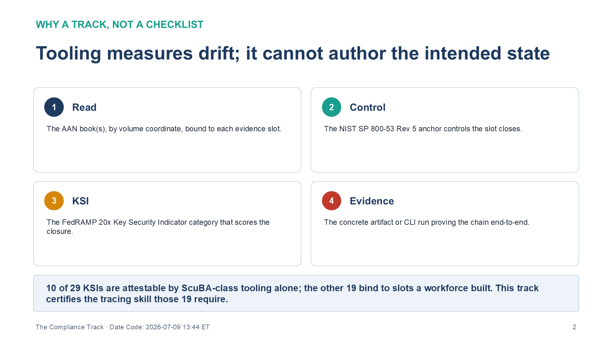
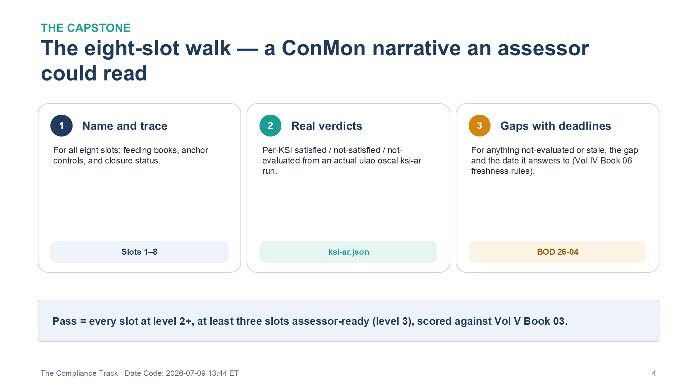

:::: {.content-hidden unless-profile="ssa"}
::: {.fouo-banner}
INTERNAL — NOT FOR PUBLIC DISTRIBUTION
:::
::::

::: {.aan-warning}
## Draft Proposal — Subject to Review

This document is a **draft proposal** developed by the **CSI Team (Cloud Services Infrastructure)**. It has not been reviewed or approved by the  CIO Office, the Office of Information Security (OIS), or organizational leadership.

**Date Code:** 2026-07-18 06:20 ET
:::

# What This Document Addresses

Volumes I–IV of this series build a system; Volume V teaches it. This book is
the **compliance track** of that teaching — the reading of the corpus that a
FedRAMP 20x assessor, an ISSO, or a ConMon operator needs. It does not build
anything new. It takes the eight evidence slots the conformance adapter
evaluates and turns each one into a module: which books close it, which NIST
SP 800-53 Rev 5 controls they close, which FedRAMP 20x Key Security Indicator
(KSI) scores the closure, and what artifact proves the chain end-to-end.

The track exists because of a fact the series states in Vol 0 Book 00 and this
book operationalizes: **conformance tooling measures drift from an intended
state; it cannot author one.** Ten of the series' twenty-nine internal KSI rules are attestable
by ScuBA-class tooling alone (KSI-001..010, via the CISA ScuBA adapter). The
other nineteen bind to evidence slots that exist only because a workforce built
the architecture in Volumes I–IV — and an assessor can only score those slots if
someone can trace the book that produced the evidence to the control it closes
to the KSI rule that reads it. That tracing skill is what this track certifies.

**Audience.** ISSOs / ISSMs, 3PAO assessors, ConMon operators, and compliance
leads. Product-level engineering skill is optional here — it is the concern of
Vol V Book 02 (The Implementation Track). What this book demands is fluency in
the evidence model: the eight slots, the controls under each, and the KSI
verdicts the OSCAL emitter produces from them.

::: {.aan-note}
**Closure claims are advisory.** Every control-closure statement in this track
is a self-assessment pending independent security control assessment (SCA) and
formal FedRAMP PMO / AO review. The track teaches how to *trace and evidence* a
closure claim, not how to assert one as adjudicated fact.
:::

# How to Read This Track

Each module below gives you four things, in the same order:

1. **Read** — the OrgComp book(s), by volume coordinate, bound to the slot.
2. **Controls** — the NIST SP 800-53 Rev 5 anchor controls the slot closes.
3. **Evaluate** — the FedRAMP 20x KSI category that scores the closure.
4. **Checkpoint** — a concrete artifact or CLI run proving you can trace
   book → control → KSI → evidence for that slot.

{#fig-vol5b01-01 fig-alt="A four-panel numbered grid defining the four things each compliance module gives, in order. Panel 1, Read: the OrgComp book or books, cited by volume coordinate, bound to each evidence slot. Panel 2, Control: the NIST SP 800-53 Rev 5 anchor controls the slot closes. Panel 3, KSI: the FedRAMP 20x Key Security Indicator category that scores the closure. Panel 4, Evidence: the concrete artifact or CLI run proving the chain end-to-end. A footer banner states that ten of twenty-nine KSIs are attestable by ScuBA-class tooling alone while the other nineteen bind to slots a workforce built — the tracing skill this track certifies. The title reads 'Tooling measures drift; it cannot author the intended state.' White background." width="100%"}

The slots are the eight evidence-slot mappings in the conformance adapter's
[`fedramp_aan_catalog`](https://github.com/WhalerMike/uiao/tree/main/src/uiao/adapters/fedramp_aan_catalog/mappings)
— the same YAML the pipeline evaluates, so the curriculum cannot silently drift
from the evidence model. Run the pipeline pieces as you go:

```bash
# Plane 2: evaluate an IR file against the KSI rules
<engine> ksi evaluate --ir ./output/ir/tenant.ir.json --out ./output/ksi/tenant.ksi.json

# Assessment Results from the OrgComp slot evidence bindings
# (per-KSI satisfied / not-satisfied / not-evaluated verdicts)
<engine> oscal ksi-ar --output exports/oscal/ksi-ar.json

# POA&M + SSP from an evidence bundle
<engine> oscal generate --help
```

> **Closure Necessity — why a track, not a checklist.** A checklist asserts that
> a control is met; it cannot show *why no alternate mechanism would meet it*.
> The compliance track's core discipline is the series' Closure Necessity
> doctrine (Vol 0 Book 00, Theme A): for each slot, name the mechanism that
> closes the control and the reason — control text, physics, or protocol
> behavior — that no scanner finding or policy document substitutes for it. An
> assessor who can only recite that a slot is "satisfied" has not closed it; an
> assessor who can state why the closure is the only path has.

# Module A0 — Orientation: the Compliance Shape of the Corpus

- **Read:** Vol 0 Book 00 (Executive Summary) and the
  [OrgComp / ConMon Compliance Gap Roadmap](https://github.com/WhalerMike/uiao/blob/main/docs/customer-documents/orgcomp-series/federal-orgcomp-conmon-gap-roadmap.md).
- **Learn:** the FedRAMP 20x timeline — the Class A pipeline opens August 3, 2026,
  CR26 mandatory January 1, 2027 (existing Rev5 Certifications must adopt; FedRAMP
  stops accepting new Rev5 Certifications after June 11, 2027) — the
  BOD 26-04 VDR/VER deadline (December 7, 2026), and the split the whole program
  turns on — the **evidence
  generation layer** (the books of Volumes I–IV) versus the **evidence
  governance layer** (the conformance adapter and OSCAL emitter that this track
  reads).
- **Checkpoint:** write a one-page brief stating which control families the
  corpus closes today, which were structurally absent until the governance and
  training books (SR, PM, PT, AT — Vol IV Books 02, 03, 04, 05), and how Vol IV
  Book 06 (Authorization Package & ConMon) assembles the AP/AR/POA&M package now
  that all 29 internal KSI-decomposition rules are evaluable.

Orientation is the one module with no slot of its own. Its product is the mental
model every later module assumes: the corpus is a stack of *truth planes* and
*enforcement planes* (Vol 0 Book 00's Functional Plane Model), and evidence
flows from the truth planes into the eight slots. Get the timeline and the
generation-versus-governance split in your head before touching a slot.

# Module A1 — Identity Control Plane (Slot 1)

- **Read:** Vol I Book 03 (Certificates & Tokens — the cryptographic credential
  plane), Vol I Book 04 (HRIT Identity & Org SSOT — the authoritative lifecycle
  source), Vol I Book 05 (Network Modernization — Entra ID, ZTNA, active
  governance), Vol II Book 01 (SQL Server Authentication Modernization), and
  Vol III Book 01 (Privileged Access Management). Vol II Book 02 (SQL Server
  Implementation) is the procedural companion.
- **Controls:** IA-2 (+enhancements 1, 2, 6), IA-5, IA-11, AC-2 (+1), AC-3,
  AC-5, the AC-6 family, AC-17, CA-7.
- **Evaluate:** **KSI-IAM** — anchor `IA-2 / AC-2`; evidence source:
  identity-provider sign-in and risk logs.
- **Checkpoint:** for one privileged role, trace the full chain — Vol III
  Book 01's PIM design → the AC-6 enhancement it closes → the KSI-IAM rule that
  scores it → the sign-in/audit-log evidence the collector ingests.

Slot 1 is where the series' identity doctrine lands as evidence. Two books bind
it by their own control-closure statements: Vol I Book 03 supplies the
credential layer (IA-5(2), SC-12/SC-17 — certificates, tokens, and
phishing-resistant MFA), and Vol I Book 04 supplies the lifecycle source of
truth (AC-2, PS-4/PS-5, IA-4 — HR-driven joiner/mover/leaver). The remaining
books apply that identity: Entra/ZTNA modernization, database authentication,
and the elimination of standing privilege.

> **Closure Necessity — IA-2 cannot be closed by a scanner.** IA-2 requires the
> system to uniquely identify and authenticate organizational users. A scanner
> can report that MFA *policy* exists; it cannot produce the sign-in evidence
> that a specific authentication was phishing-resistant and risk-evaluated. Only
> the identity provider that performed the authentication emits that record — so
> the closure is bound to the IdP's sign-in and risk logs, and the KSI-IAM rule
> reads exactly those. No configuration export substitutes for the event.

# Module A2 — Addressing Control Plane (Slot 2)

- **Read:** Vol I Book 01 ( Landing Zone, IPAM & FedRAMP) — the Infoblox DDI
  naming/addressing plane: IPAM, DNS, DHCP, PKI issuance.
- **Controls:** CM-8, AC-4 anchors; Vol I Book 01 closes sixteen controls per the
  gap roadmap.
- **Evaluate:** **KSI-PIY** (addressing/inventory evidence).
- **Checkpoint:** produce the address-inventory evidence statement — what the DDI
  platform attests (authoritative IPAM inventory), which CM-8 requirements that
  satisfies, and where the evidence lands in the slot-02 mapping.

Slot 2 is the join key for the whole program. The naming/addressing plane is the
one plane every component must touch to function at all, so it is the only
authoritative CM-8 inventory — the correlation anchor the Multi-Cloud Evidence
Fabric (Vol III Book 07) later reconciles five management stacks against. Vol I
Book 02 (Network Access Control) feeds this slot the device-identity-at-the-port
surface (IA-3, CM-8); its formal slot binding is pending the adapter mapping
refresh, so teach it as the enumeration-completeness argument, not yet as a
bound evidence source.

# Module A3 — Network Control Plane (Slot 3)

- **Read:** Vol I Book 05 (Network Modernization — SD-WAN, SASE, UC), Vol I
  Book 06 (Federal Telecommunications Modernization — TIC 3.0), Vol I Book 07
  (Network Enforcement Substrate — the customer-owned edge), and Vol II Book 03
  (Database Consolidation & Network Physics).
- **Controls:** SC-8, SC-7, CA-7 anchors; SC/SI depth from Vol II Book 03.
- **Evaluate:** **KSI-CNA** (network architecture evidence).
- **Checkpoint:** map one application-aware path policy (SD-WAN/SASE) to SC-8
  transmission protection and show which continuous-monitoring signal (CA-7)
  proves it stays enforced.

Slot 3 is where the series' hardest doctrine lives: **DIA fixes nothing** (Vol 0
Book 00, Theme B). A bare internet circuit satisfies zero controls; every
control claimed near it — SC-7, SC-8, AC-4, SI-4, CA-7 — is closed by the
SD-WAN/SASE/TIC 3.0 stack that governs the pipe, never by the pipe. Vol I
Book 07 is the customer-owned half of SC-7/SC-8 that no CSP's FedRAMP
authorization covers — the branch firewall and WAN edge the agency accredits
through NIAP / DISA STIG / FIPS 140-3 / DoDIN APL (Theme F). Teach slot 3 as the
proof that transport policy is a control surface and the pipe is not.

# Module A4 — Telemetry Control Plane (Slot 4)

- **Read:** Vol III Book 02 (Vulnerability Management — Defender VM + KEV),
  Vol III Book 05 (Data Protection — Purview + Key Vault CMK), Vol III Book 06
  (SIEM / XDR Detection — Sentinel), and Vol III Book 07 (Multi-Cloud Evidence
  Fabric — the correlated evidence lake).
- **Controls:** CA-7, SI-4 anchors; the RA-5 family, SI-2, AU-6/7/8/11,
  IR-4/6/8.
- **Evaluate:** **KSI-MLA** (monitoring / logging / audit evidence).
- **Checkpoint:** pick one KEV-listed CVE scenario and trace — Defender VM
  finding (Vol III Book 02) → Sentinel analytic + incident (Vol III Book 06) →
  the SI-4 / RA-5 closure statement, with the audit-retention argument from
  AU-11.

Slot 4 is the telemetry spine, and Vol III Book 07 is what makes it evaluable
across a genuinely multi-cloud estate: five native stacks actuate, but their
records join one machine-readable evidence lake that flows to CISA CDM and the
KSI pipeline. The assessor's skill here is following a single finding across the
seam from actuation to correlated evidence.

# Module A5 — Endpoint Control Plane (Slot 5)

- **Read:** Vol I Book 02 (NAC — device identity at the port), Vol III Book 01
  (PAW sections), Vol III Book 03 (Patch & Systems Management), Vol III Book 04
  (Cloud-Native Security Posture), and Vol IV Book 04 (PII Processing &
  Transparency).
- **Controls:** CM-8, IA-3 anchors; SI-2 (remediation) from Vol III Book 03;
  CSPM/CNAPP exposure from Vol III Book 04; PT-family entry points from Vol IV
  Book 04.
- **Evaluate:** **KSI-PIY** (endpoint inventory evidence).
- **Checkpoint:** write the endpoint-inventory evidence statement covering device
  identity (IA-3), inventory completeness (CM-8), remediation actuation (SI-2),
  and where PII-handling endpoints get the Vol IV Book 04 transparency treatment.

Slot 5 is the *close-it* counterpart to slot 4's *scan-it*: Vol III Book 02
assesses and prioritizes (RA-5), Vol III Book 03 remediates across the CSP × OS
matrix (SI-2), and Vol III Book 04 covers the container and posture surface the
OS-level view misses. The endpoint inventory is only authoritative when it
enumerates managed and unmanaged devices alike — the enumeration-completeness
argument that ties back to the slot-2 addressing plane.

# Module A6 — Security Configuration & Change Control Plane (Slot 6)

- **Read:** Vol III Book 04 (secure configuration / posture surface), Vol III
  Book 06 (detection as change evidence), Vol IV Book 02 (Supply Chain Risk
  Management), and Vol IV Book 03 (Program Management & Governance).
- **Controls:** CM-2, AC-4 anchors; SR-1/2/3/5/6/8/10/11 from Vol IV Book 02;
  the PM family from Vol IV Book 03.
- **Evaluate:** **KSI-CMT** (configuration / change-management evidence);
  KSI-011–014 were activated by the Vol IV Book 02 SBOM/VDR/VER evidence
  contract — the BOD 26-04 VDR/VER in-force date (December 7, 2026) remains the
  operational cadence Vol IV Book 06 runs.
- **Checkpoint:** state the Vol IV Book 02 SBOM evidence-contract story — which
  SBOM artifacts Vol IV Book 02 requires, which KSI rules they activated, and how the Vol IV
  Book 06 ConMon calendar keeps that evidence fresh.

Slot 6 is where configuration truth and supply-chain provenance meet governance.
The SBOM/VDR/VER contract is the concrete artifact chain (Syft → Grype → OpenVEX);
the PM family is the charter that makes the whole program auditable. Teach the
BOD 26-04 clock as the forcing function that turned KSI-011–014 from scaffold
into evaluable rules.

# Module A7 — Continuity Control Plane (Slot 7)

- **Read:** Vol IV Book 01 (Business Continuity).
- **Controls:** CP-2 (+3 enhancements), CP-3, CP-4 (+1), CP-6, CP-7 (+3),
  CP-8 (+2).
- **Evaluate:** **KSI-RPL** (recovery / resilience evidence).
- **Checkpoint:** map one contingency-test exercise to CP-4 and show the slot-07
  continuity binding that carries it into the KSI evaluation. A tabletop
  after-action report with findings and named owners is the evidence; a
  zero-finding report is not evidence of resilience, it is evidence the test was
  not real.

Slot 7 is the smallest by book count and the easiest to fake. The discipline the
module teaches is that continuity evidence is the *test result*, not the plan —
CP-4 closure is a contingency exercise that produced findings, bound to slot-07,
not a CP-2 document that asserts a capability.

# Module A8 — Training Control Plane (Slot 8)

- **Read:** Vol IV Book 05 (Cybersecurity Training & Awareness). Vol IV Book 06's
  freshness rules and ConMon calendar are the operating context.
- **Controls:** AT-2 (+1, +2), AT-3 (+3, +5), AT-4, CP-3, IR-2; SA-16 for
  secure-delivery training.
- **Evaluate:** **KSI-CED** — KSI-CED-RAT (KSI-022), the last CR26 rule to
  activate; evidence source: the machine-readable `training-effectiveness-record`
  JSON exported monthly from the LMS.
- **Checkpoint:** trace one role tier through the four training dimensions — the
  AT-3 matrix row → the completion thresholds (≥95%) → the JSON record fields
  that carry it → the KSI-022 PASS logic.

Slot 8 is the slot Volume V both teaches and *is*: this compliance track and its
implementation counterpart are the training program whose completion record
closes AT-2/AT-3 and evaluates KSI-CED. The module's discipline is that the
evidence is per-identity and machine-readable — aggregate completion statistics
do not satisfy KSI-022; the record must carry per-role, per-identity results with
dates inside the freshness window.

# The Capstone — the Eight-Slot Walk

Produce a single document (or an annotated `<engine> oscal ksi-ar` export) that, for
**all eight slots**:

1. names the feeding books by volume coordinate,
2. lists the anchor controls and the closure status,
3. shows the per-KSI verdict (satisfied / not-satisfied / not-evaluated) from a
   real `<engine> oscal ksi-ar` run, and
4. states the gap and its deadline for anything not-evaluated or stale (Vol IV
   Book 06 defines per-slot evidence freshness rules).

{#fig-vol5b01-02 fig-alt="A three-panel numbered diagram describing the compliance-track capstone, the eight-slot walk. Panel 1, Name and trace: for all eight slots, name the feeding books, the anchor controls, and the closure status; tagged 'Slots 1–8.' Panel 2, Real verdicts: give the per-KSI satisfied / not-satisfied / not-evaluated verdicts from an actual <engine> oscal ksi-ar run; tagged 'ksi-ar.json.' Panel 3, Gaps with deadlines: for anything not-evaluated or stale, state the gap and the date it answers to under Vol IV Book 06 freshness rules; tagged 'BOD 26-04.' A footer banner states the pass bar — every slot at level 2 or higher, at least three slots assessor-ready at level 3, scored against Vol V Book 03. White background. Source: Vol V Book 01 The Compliance Track briefing deck, Date Code 2026-07-09 17:00 ET." width="100%"}

That document is the Track A completion artifact — it is, deliberately, the
skeleton of a ConMon narrative an assessor could read. Score it against Vol V
Book 03 (Assessment, Rubrics & Certification): a pass is every slot at level 2 or
higher, with at least three slots assessor-ready (level 3).

# The Eight Evidence Slots — Controls and KSIs

The reference map for the track. "Feeding books" are volume coordinates; the KSI
category is the rule family the OSCAL emitter scores; the last column is the
Theme E split — whether ScuBA-class tooling alone can attest the slot, or whether
it depends on architecture a workforce built. The column is reproducible: a slot
is *Partial* when it binds at least one ScuBA-attestable rule (KSI-001..010) and
*No* when it binds none; no slot is fully tool-attestable, since every slot also
carries workforce-built evidence.

| Slot | Feeding books | Anchor controls | KSI category | Tool-attestable alone? |
|---|---|---|---|---|
| 1 — Identity | Vol I Bk 03/04/05 · Vol II Bk 01 · Vol III Bk 01 | IA-2, AC-2 | KSI-IAM | Partial |
| 2 — Addressing | Vol I Bk 01 (Bk 02 pending) | CM-8, AC-4 | KSI-PIY | No |
| 3 — Network | Vol I Bk 05/06/07 · Vol II Bk 03 | SC-8, SC-7, CA-7 | KSI-CNA | Partial |
| 4 — Telemetry | Vol III Bk 02/05/06/07 | CA-7, SI-4 | KSI-MLA | Partial |
| 5 — Endpoint | Vol I Bk 02 · Vol III Bk 01/03/04 · Vol IV Bk 04 | CM-8, IA-3 | KSI-PIY | No |
| 6 — Security / Change | Vol III Bk 04/06 · Vol IV Bk 02/03 | CM-2, AC-4 | KSI-CMT | No |
| 7 — Continuity | Vol IV Bk 01 | CP-2, CP-4 | KSI-RPL | No |
| 8 — Training | Vol IV Bk 05 (Bk 06 context) | AT-2, AT-3, AT-4 | KSI-CED | No |

: The eight evidence slots — feeding books, anchor controls, and KSI categories {.striped .hover}

With slot 8 active, all 29 internal KSI-decomposition rules are evaluable. Ten are
attestable by the ScuBA adapter alone (KSI-001..010); the nineteen bound to the
slots above (KSI-011..029) are the coverage gap this track closes by producing
assessors who can trace their evidence — advisory pending formal PMO / AO review.

# Series Context — Vol V Book 01

The compliance track is the first of Volume V's four content books and the one
that reads the series from the assessor's chair. It depends on all of Volumes
I–IV — it cites their books as the evidence sources for the eight slots — and it
pairs with Vol V Book 02 (The Implementation Track), which builds those same
sources from the engineer's chair and lands the artifacts this track scores.
Vol V Book 03 (Assessment, Rubrics & Certification) grades the capstone this book
sets, and Vol V Book 04 (Vendor Training & Lab Environments) supplies the
external skills. Read together, the track turns the corpus from a set of
documents into a workforce that can trace book → control → KSI → evidence for
every slot — which is itself the closure of the training control (AT-2/AT-3,
KSI-CED) the program's own authorization package depends on.

---

*Federal Organization Compliance — Vol V Book 01 of the series. Volume V is
the enablement layer: it teaches Volumes 0–IV and produces the training evidence
that Vol IV Book 06 freezes into the OSCAL authorization bundle. This book is the
compliance track; Vol V Book 02 is its implementation counterpart. Control-closure
and KSI claims are self-assessed against the series' internal KSI decomposition (modeled on
the FedRAMP 20x CR26 KSI schema), pending independent security control assessment
(SCA) and formal FedRAMP PMO / AO review.*
