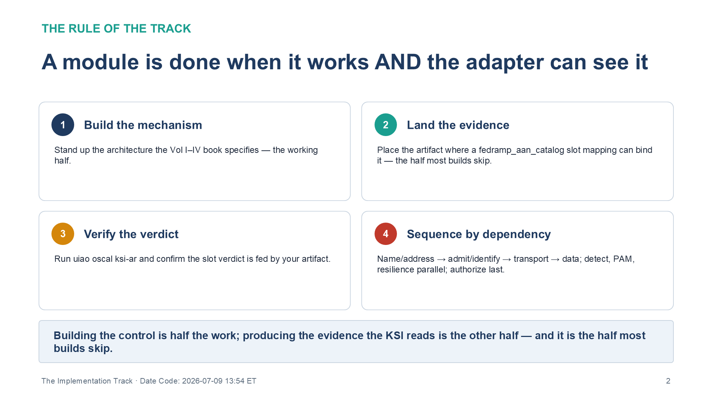
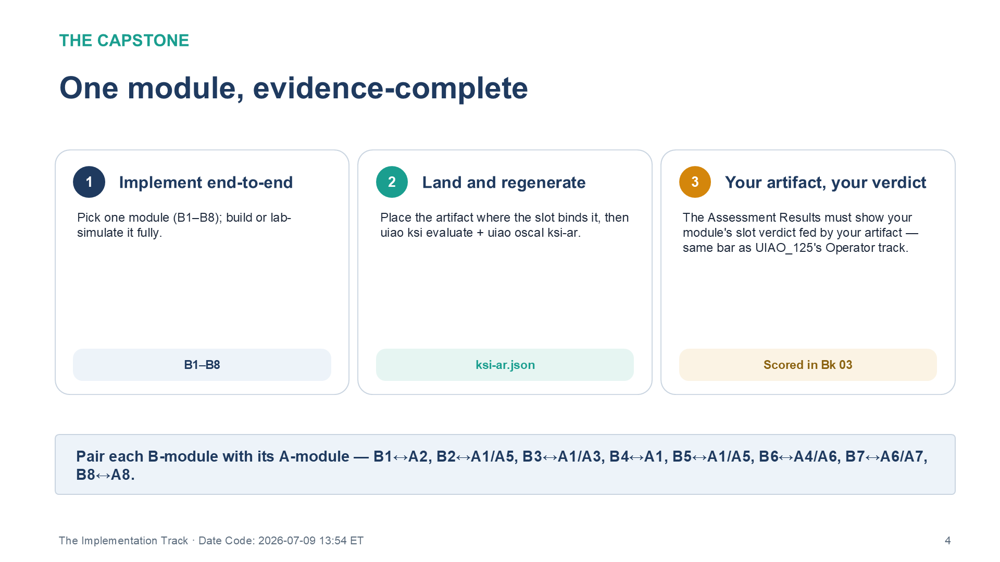

:::: {.content-hidden unless-profile="ssa"}
::: {.fouo-banner}
INTERNAL — NOT FOR PUBLIC DISTRIBUTION
:::
::::

::: {.aan-warning}
## Draft Proposal — Subject to Review

This document is a **draft proposal** developed by the **CSI Team (Cloud Services Infrastructure)**. It has not been reviewed or approved by the  CIO Office, the Office of Information Security (OIS), or organizational leadership.

**Date Code:** 2026-07-18 06:20 ET
:::

# What This Document Addresses

Vol V Book 01 taught the corpus from the assessor's chair — the eight evidence
slots, read as `book → control → KSI → evidence`. This book teaches the same
corpus from the engineer's chair: how to **build** the architectures Volumes
I–IV describe, and — the part that makes the difference — how to **land the
evidence** that Book 01's slots score. It is the implementation track of the
Academy, aimed at network, platform, database, identity, and security engineers.

The track has one rule, and it is the rule that separates a working system from
an authorizable one:

> **The rule of the track.** A module is done when the thing works **and** the
> conformance adapter can see it. Every lab ends with an evidence artifact placed
> where a `fedramp_aan_catalog` slot mapping can bind it, and a `<engine> oscal
> ksi-ar` run that shows the slot's verdict fed by *that* artifact. Building the
> control is half the work; producing the evidence the KSI reads is the other
> half, and it is the half most builds skip.

The eight modules below are grouped by build cluster and sequenced by real
dependency: you name and address before you admit and identify, identify before
you shape transport, and shape transport before you place data. Detection,
privileged access, and resilience run in parallel once the identity floor
exists; authorize-and-operate assembles what every other module produced.

{#fig-vol5b02-01 fig-alt="A four-panel numbered grid stating the rule of the implementation track. Panel 1, Build the mechanism: stand up the architecture the Vol I–IV book specifies — the working half. Panel 2, Land the evidence: place the artifact where a fedramp_aan_catalog slot mapping can bind it — the half most builds skip. Panel 3, Verify the verdict: run <engine> oscal ksi-ar and confirm the slot verdict is fed by your artifact. Panel 4, Sequence by dependency: name/address, then admit/identify, then transport, then data, with detect, PAM, and resilience in parallel and authorize last. A footer banner states that building the control is half the work and producing the evidence the KSI reads is the other half — and it is the half most builds skip. White background. Source: Vol V Book 02 The Implementation Track briefing deck, Date Code 2026-07-09 17:00 ET." width="100%"}

::: {.aan-note}
**Prerequisite — Module A0 of Book 01.** You need the FedRAMP 20x timeline and
the evidence-slot model in your head before you build, because every build here
ends by landing evidence, not just by working. Read Book 01's orientation module
first.
:::

# Module B1 — Landing Zone, IPAM & DDI (Vol I Book 01)

- **Read:** Vol I Book 01 ( Landing Zone, IPAM & FedRAMP).
- **Build:** the DDI core — authoritative IPAM, DNS, DHCP, and PKI issuance for
  the landing zone. The reference stack is Infoblox; the reference implementation's
  modernization adapters for BlueCat and Infoblox cover directory migration into it.
- **Lab:** stand up (or simulate with fixtures) an IPAM inventory export and bind
  it as **slot-03 network** evidence (the CM-8 addressing anchor).
- **Vendor training:** Infoblox education, BlueCat learning, Microsoft AZ-700 —
  see Vol V Book 04 §Networking & DDI.

B1 is first because it is the join key for everything downstream: the CM-8
asset-identity anchor the Multi-Cloud Evidence Fabric later correlates against.
No inventory, no correlation — so the module is not done until the IPAM export is
bound and the slot-03 verdict reads it.

# Module B2 — Access & Identity Foundations (Vol I Books 02–04)

- **Read:** Vol I Book 02 (Network Access Control — 802.1X), Vol I Book 03
  (Certificates & Tokens), Vol I Book 04 (HRIT Identity & Org SSOT).
- **Build:** the admission-and-identity layer everything after B1 assumes —
  802.1X EAP-TLS port/wireless authentication with the five-tier VLAN model and
  CoA (Book 02); the cryptographic credential plane, offline-root + name-
  constrained issuing CAs, ACME/SCEP at short lifetimes, phishing-resistant MFA,
  and workload identity federation (Book 03); and the HR-driven SSOT pipeline —
  the authoritative source, effective-dated records, and the SCIM/Graph
  `bulkUpload` provisioning flow with the six-step leaver (Book 04).
- **Lab:** three worked exercises. Deploy EAP-TLS **in monitor mode first** with
  an Intune SCEP profile, review the would-have-failed log, then enforce one
  switch/SSID. Stand up the CAA + ACME DNS-01 issuance chain and rotate a
  certificate inside its lifetime. Run the six-step leaver in shadow mode and
  capture the deprovisioning evidence. The Book 03/04 artifacts bind as
  **slot-01 identity** evidence; Book 02's port-authentication evidence is held
  pending the adapter mapping refresh.
- **Vendor training:** Cisco U / Networking Academy (ISE, NAC), Microsoft SC-300
  (Entra identity & lifecycle), AZ-500, SailPoint Identity University — see Vol V
  Book 04 §Identity & zero trust.

> **Closure Necessity — monitor mode is not optional.** 802.1X enforced on day
> one is the classic NAC lockout. The build discipline the module enforces is
> monitor-mode-first: collect the would-have-failed data, fix supplicant and
> certificate coverage, *then* enforce. An assessor reading the slot-05 evidence
> should see the pre-enforcement readiness report, not just the enforcing config.

# Module B3 — Network & Telecommunications Modernization (Vol I Books 05–07)

- **Read:** Vol I Book 05 (Network Modernization — SD-WAN, SASE, UC), Vol I
  Book 06 (Federal Telecommunications Modernization — TIC 3.0), Vol I Book 07
  (Network Enforcement Substrate — the customer-owned edge).
- **Build:** application-aware transport — SD-WAN path policy keyed to
  application identity, SASE enforcement under TIC 3.0, and the customer-owned
  edge gear (Cisco / Palo Alto / Juniper) accredited through NIAP / DISA STIG /
  FIPS 140-3 / DoDIN APL. This is where the customer-owned half of SC-7/SC-8 —
  the half no CSP's FedRAMP authorization covers — is actually built.
- **Lab:** author one application-aware path policy and one ZTNA access policy;
  export the policy state and bind it as **slot-03 network** evidence.
- **Vendor training:** Cisco U / Networking Academy (SD-WAN), Fortinet / Palo
  Alto (SASE), AWS Skill Builder (Amazon Connect) — see Vol V Book 04
  §Networking & DDI and §Identity & zero trust.

The module's doctrine is Theme B: the circuit fixes the geographic hairpin and
nothing else; every control lives in the overlay and the PEP. Build the overlay,
not the pipe, and prove SC-8 with the CA-7 signal that shows it stays enforced.

# Module B4 — Data Platform Modernization (Vol II Books 01–03)

- **Read:** Vol II Book 01 (SQL Server Authentication Modernization), Vol II
  Book 02 (SQL Server Implementation Guide — the runbook), Vol II Book 03
  (Database Consolidation & Network Physics).
- **Build:** Entra-integrated SQL Server authentication (no SQL logins), then the
  consolidation architecture Book 03 derives from network physics (latency
  budgets, placement, failure domains).
- **Lab:** execute the Book 02 runbook against a lab instance; capture the
  authentication-mode evidence and bind it as **slot-01 identity** evidence.
- **Vendor training:** Microsoft DP-300, SQL Server security learning paths — see
  Vol V Book 04 §Data platform.

# Module B5 — Privileged Access (Vol III Book 01)

- **Read:** Vol III Book 01 (Privileged Access Management — Entra PIM + PAW).
- **Build:** role-activation workflows in PIM (eligibility, activation, approval,
  review) and the privileged-access-workstation tier model, break-glass first.
- **Lab:** configure one eligible role with activation approval + access review;
  export the PIM audit trail and bind it as **slot-01/slot-05** evidence.
- **Vendor training:** Microsoft SC-300, AZ-500; SANS privileged-access
  coursework — see Vol V Book 04 §Identity & zero trust.

The build order is the security outcome: create the break-glass accounts *before*
removing standing access, deploy Conditional Access in report-only for 14+ days
before enforcing. The evidence is the PIM audit trail showing activation
ceremonies, not the policy definition.

# Module B6 — Detect & Protect (Vol III Books 02–07)

- **Read:** Vol III Book 02 (Vulnerability Management — Defender VM + KEV),
  Vol III Book 03 (Patch & Systems Management — platform-native remediation),
  Vol III Book 04 (Cloud-Native Security Posture), Vol III Book 05 (Data
  Protection — Purview + Key Vault CMK), Vol III Book 06 (SIEM / XDR — Sentinel),
  and Vol III Book 07 (Multi-Cloud Evidence Fabric).
- **Build:** the telemetry spine — Defender VM assessment with KEV
  prioritization; the platform-native patch orchestration that actuates the
  remediation the scan measures (SI-2 — Book 03 closes the gap Book 02 finds);
  CSPM/CNAPP posture and container runtime coverage; Purview
  sensitivity labeling + customer-managed keys; Sentinel analytics, incidents,
  and automation; and the evidence fabric that correlates every source's record
  into one lake bound for CDM and the KSI pipeline.
- **Lab:** one end-to-end detection — seed a vulnerable/exposed condition, watch
  it surface in Defender VM, alert in Sentinel, remediate it through the
  platform-native patch stack and export the remediation-status record as
  **slot-05 endpoint** evidence, and close with an evidence export
  bound to **slot-04 telemetry** (and slot-06 for the configuration-drift angle).
- **Vendor training:** Microsoft SC-200 (Sentinel/Defender), SC-401 (Purview),
  Splunk & Elastic for portable SIEM fundamentals — see Vol V Book 04 §Security
  operations.

# Module B7 — Resilience & Governance (Vol IV Books 01–04)

- **Read:** Vol IV Book 01 (Business Continuity), Vol IV Book 02 (Supply Chain
  Risk Management), Vol IV Book 03 (Program Management & Governance), Vol IV
  Book 04 (PII Processing & Transparency).
- **Build:** the contingency architecture (alternate processing/storage, CP-4
  test harness); the SBOM pipeline (Syft/Grype-class generation, CycloneDX/SPDX
  VDR, OpenVEX VER for BOD 26-04); the PM governance charter artifacts; PII
  processing-transparency records.
- **Lab:** generate an SBOM for a real service, produce the VDR document, and
  bind it as **slot-06** evidence; run one tabletop contingency test and bind the
  after-action findings as **slot-07 continuity** evidence.
- **Vendor training:** CISA Learning, FedRAMP PMO materials, OWASP / Linux
  Foundation SBOM resources — see Vol V Book 04 §Federal & compliance.

# Module B8 — Authorize & Operate (Vol IV Books 05–06)

- **Read:** Vol IV Book 05 (Cybersecurity Training & Awareness) and Vol IV
  Book 06 (Authorization Package & ConMon).
- **Build:** the four-dimension training program with its monthly LMS export
  (Viva Learning Graph API → `training-effectiveness-record` JSON), then the
  authorization mechanics — the OSCAL AP/AR/POA&M bundle, the CA-7 ConMon
  calendar with per-slot evidence freshness rules, and the BOD 26-04 VDR/VER
  submission flow.
- **Lab:** produce a `training-effectiveness-record` JSON that passes the KSI-022
  thresholds and bind it as **slot-08** evidence; then run `<engine> oscal
  bundle`-style generation, trace the AP→AR→POA&M UUID links, and simulate a
  completion-rate drop below 95% to watch the POA&M entry auto-populate.
- **Vendor training:** CISA Learning and SANS (awareness program design),
  FedRAMP PMO materials, NIST NICE (role mapping) — see Vol V Book 04 §Federal &
  compliance.

B8 runs last because it assembles what every other module produced. Its evidence
is the whole bundle: 29/29 KSI verdicts self-assessed against the series'
internal KSI decomposition (pending CR26 reconciliation and independent SCA),
a zero-item POA&M as the *target* state (expected non-empty until then),
and the training record that closes the slot Volume V both teaches and is.

# The Capstone — One Module, Evidence-Complete

Pick one module (B1–B8). Implement or lab-simulate it end-to-end, land the
evidence where the slot mapping binds it, then regenerate the verdicts:

```bash
<engine> ksi evaluate --ir ./output/ir/tenant.ir.json --out ./output/ksi/tenant.ksi.json
<engine> oscal ksi-ar --output exports/oscal/ksi-ar.json
```

Completion means the Assessment Results show your module's slot verdict fed by
**your** artifact — the same bar as the governance substrate's Operator track ("clean
walker/drift run"), applied to the OrgComp vertical. Score the result against Vol V
Book 03's rubric ladder.

{#fig-vol5b02-02 fig-alt="A three-panel numbered diagram describing the implementation-track capstone. Panel 1, Implement end-to-end: pick one module from B1 through B8 and build or lab-simulate it fully; tagged 'B1–B8.' Panel 2, Land and regenerate: place the artifact where the slot binds it, then run <engine> ksi evaluate and <engine> oscal ksi-ar; tagged 'ksi-ar.json.' Panel 3, Your artifact, your verdict: the Assessment Results must show your module's slot verdict fed by your artifact — the same bar as the governance substrate's Operator track; tagged 'Scored in Bk 03.' A footer banner pairs each B-module with its A-module: B1 with A2, B2 with A1/A5, B3 with A1/A3, B4 with A1, B5 with A1/A5, B6 with A4/A6, B7 with A6/A7, and B8 with A8. White background. Source: Vol V Book 02 The Implementation Track briefing deck, Date Code 2026-07-09 17:00 ET." width="100%"}

# Module Sequencing and Track Pairing

B1 → B2 → B3 → B4 is a real dependency chain: addressing before admission and
identity, identity before transport policy, transport before data placement.
B5–B7 run in parallel once B2's identity layer exists; B8 runs last. Track A
(Book 01) modules interleave freely; many teams pair each B-module with its
A-module — B1↔A2, B2↔A1/A5, B3↔A1/A3, B4↔A1, B5↔A1/A5, B6↔A4/A6, B7↔A6/A7,
B8↔A8.

| Module | Builds | Lands evidence in |
|---|---|---|
| B1 | Vol I Bk 01 | slot 3 (network — CM-8 addressing anchor) |
| B2 | Vol I Bk 02–04 | slot 1 (identity); slot 5 pending |
| B3 | Vol I Bk 05–07 | slot 3 (network) |
| B4 | Vol II Bk 01–03 | slot 1 (identity) |
| B5 | Vol III Bk 01 | slots 1 + 5 |
| B6 | Vol III Bk 02–07 | slots 4 + 5 + 6 |
| B7 | Vol IV Bk 01–04 | slots 6 + 7 |
| B8 | Vol IV Bk 05–06 | slot 8; assembles all eight |

: Track B modules — build cluster and the evidence slot each lands {.striped .hover}

# Series Context — Vol V Book 02

The implementation track is the engineer's half of Volume V. It builds the same
Volumes I–IV sources the compliance track (Vol V Book 01) reads, and it exists to
enforce one discipline the rest of the series assumes but never states as a rule:
a control is not closed until its evidence is bound where the KSI can read it.
The lab environments the modules call for — fixture, trial-tenant, and
product-eval tiers — are stood up in Vol V Book 04; the artifacts the modules
produce are scored against Vol V Book 03. Build it, land it, and the training
slot (KSI-CED) that Volume V both teaches and is closes on the evidence of the
work itself.

---

*Federal Organization Compliance — Vol V Book 02 of the series. Volume V is
the enablement layer; this book is its implementation track, the counterpart to
Vol V Book 01 (the compliance track). Every module ends by landing an evidence
artifact a `fedramp_aan_catalog` slot mapping can bind. Control-closure and KSI
claims are self-assessed against the series' internal KSI decomposition (modeled on the
FedRAMP 20x CR26 KSI schema), pending independent security control assessment
(SCA) and formal FedRAMP PMO / AO review.*
