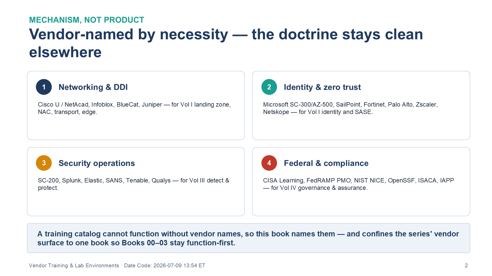
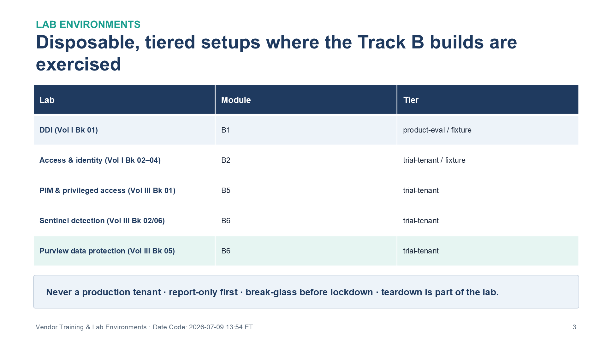

:::: {.content-hidden unless-profile="ssa"}
::: {.fouo-banner}
INTERNAL — NOT FOR PUBLIC DISTRIBUTION
:::
::::

::: {.aan-warning}
## Draft Proposal — Subject to Review

This document is a **draft proposal** developed by the **CSI Team (Cloud Services Infrastructure)**. It has not been reviewed or approved by the  CIO Office, the Office of Information Security (OIS), or organizational leadership.

**Date Code:** 2026-07-18 06:20 ET
:::

::: {.aan-important}
**Operational appendix — vendor-named by necessity.** The rest of Volume V is
function-first. This book is the series' **realization layer** (Vol 0 Book 00,
Theme F: *Mechanism, Not Product*): one mechanism is realized by N products, each
carrying a federal accreditation. A training catalog cannot function without
naming the vendors whose products the books deploy, so this book names them —
courses, portals, and eval licenses. It assigns no organizational owner and
recommends no procurement; it maps existing external training to the volume it
supports. Verify every vendor's FedRAMP / accreditation status on the
[FedRAMP Marketplace](https://www.fedramp.gov/) at procurement time.
:::

# What This Document Addresses

The four preceding Volume V books teach the corpus and grade the learner; none of
them teaches a product. This book supplies the two things a learner needs to
actually acquire the skills: **external vendor training** mapped to the volume it
supports, and **lab environments** — scripted, disposable setups where the
implementation-track builds can be exercised without a production footprint.

It is a living catalog. As research continues it expands; rows carry the volume
they support so the other books can link here stably, and external URLs are
re-verified by the repo's link-check CI so link rot surfaces automatically.

{#fig-vol5b04-01 fig-alt="A four-panel numbered grid grouping the external vendor training catalog into four domains, with the doctrine that this realization-layer book names vendors while the rest of the series stays function-first. Panel 1, Networking & DDI: Cisco U / NetAcad, Infoblox, BlueCat, and Juniper — for the Vol I landing zone, NAC, transport, and edge. Panel 2, Identity & zero trust: Microsoft SC-300/AZ-500, SailPoint, Fortinet, Palo Alto, Zscaler, and Netskope — for Vol I identity and SASE. Panel 3, Security operations: SC-200, Splunk, Elastic, SANS, Tenable, and Qualys — for Vol III detect and protect. Panel 4, Federal & compliance: CISA Learning, FedRAMP PMO, NIST NICE, OpenSSF, ISACA, and IAPP — for Vol IV governance and assurance. A footer banner states that a training catalog cannot function without vendor names, so this book names them and confines the series' vendor surface to one book so Books 00–03 stay function-first. White background. Source: Vol V Book 04 Vendor Training & Lab Environments briefing deck, Date Code 2026-07-09 17:00 ET." width="100%"}

# How to Use This Catalog

Each implementation module (Vol V Book 02) and each compliance module (Vol V
Book 01) points at a section here. Certifications are listed where a role-based
cert is the natural packaging; free learning-path options are noted where they
exist. "Volumes" columns refer to the volume/book a course supports.

# Microsoft Role-Based Training {#microsoft}

The OrgComp reference stack is Microsoft-heavy (Entra, Defender, Sentinel, Purview,
SQL Server, Azure networking), so Microsoft Learn role paths cover the largest
share of Track B. Microsoft Learn content is free; certification exams are paid.

| Certification / path | Exam | Volumes | Why it maps |
|---|---|---|---|
| [Azure Network Engineer Associate](https://learn.microsoft.com/en-us/credentials/certifications/azure-network-engineer-associate/) | AZ-700 | Vol I Bk 01, 05 | Landing-zone networking, hybrid connectivity, private access |
| [Identity and Access Administrator](https://learn.microsoft.com/en-us/credentials/certifications/identity-and-access-administrator/) | SC-300 | Vol I Bk 03/04/05 · Vol III Bk 01 | Entra ID, conditional access, PIM, lifecycle — the identity spine |
| [Security Operations Analyst](https://learn.microsoft.com/en-us/credentials/certifications/security-operations-analyst/) | SC-200 | Vol III Bk 02, 06 | Sentinel + Defender XDR detection and Defender VM |
| [Information Security Administrator](https://learn.microsoft.com/en-us/credentials/certifications/information-security-administrator/) | SC-401 | Vol III Bk 05 · Vol IV Bk 04 | Purview information protection, DLP, insider risk (successor to SC-400) |
| [Azure Database Administrator Associate](https://learn.microsoft.com/en-us/credentials/certifications/azure-database-administrator-associate/) | DP-300 | Vol II Bk 01–03 | SQL Server / Azure SQL administration and authentication modernization |
| [Azure Security Engineer Associate](https://learn.microsoft.com/en-us/credentials/certifications/azure-security-engineer/) | AZ-500 | Vol I Bk 03 · Vol III Bk 05 | Key Vault, CMK, workload identity, platform security controls |
| [Cybersecurity Architect Expert](https://learn.microsoft.com/en-us/credentials/certifications/cybersecurity-architect-expert/) | SC-100 | Vol 0 Bk 00 · Vol IV Bk 03 | Whole-of-estate security architecture — the leadership view |
| [Microsoft Learn training browser](https://learn.microsoft.com/en-us/training/) | — | all | Free modular learning paths under every product above |

: Microsoft role-based training mapped to the series volumes {.striped .hover}

# Networking & DDI {#networking-ddi}

| Vendor | Offering | Volumes | Notes |
|---|---|---|---|
| Cisco | [Cisco U.](https://u.cisco.com/) | Vol I Bk 02, 05, 07 | SD-WAN (ENSDWI-track), ISE/802.1X NAC, enterprise routing; subscription with free tiers |
| Cisco | [Networking Academy](https://www.netacad.com/) | Vol I Bk 02, 05, 06 | Free foundational networking incl. switching/802.1X basics |
| Juniper | [Juniper Networks](https://www.juniper.net/) | Vol I Bk 07 | SD-WAN/routing and Mist Access Assurance NAC where Juniper gear is in scope |
| Infoblox | [Infoblox Education](https://www.infoblox.com/infoblox-education/) | Vol I Bk 01 | DDI (IPAM/DNS/DHCP) training for the reference stack — role-based courses + free Launchpad |
| BlueCat | [BlueCat Training](https://bluecatnetworks.com/services/training/) | Vol I Bk 01 | DDI learning paths for the BlueCat migration path covered by the reference implementation's adapter |
| CompTIA | [CompTIA (Network+, Security+)](https://www.comptia.org/) | Vol 0–I | Vendor-neutral baseline for staff entering without a networking background |

: Networking & DDI training {.striped .hover}

# Identity & Zero Trust {#identity-zero-trust}

| Vendor | Offering | Volumes | Notes |
|---|---|---|---|
| Microsoft | SC-300 / AZ-500 (see [§Microsoft](#microsoft)) | Vol I Bk 03/04/05 · Vol III Bk 01 | Primary identity stack incl. the credential plane and lifecycle provisioning |
| SailPoint | [Identity University](https://www.sailpoint.com/university) | Vol I Bk 04 · Vol III Bk 01 | Joiner-mover-leaver governance for the HRIT lifecycle; NERM boundary exception documented in Vol III Bk 01 |
| Fortinet | [Fortinet Training Institute](https://training.fortinet.com/) | Vol I Bk 05, 06 | Free NSE-track courses; SASE/ZTNA modules |
| Palo Alto Networks | [Education services](https://www.paloaltonetworks.com/services/education) | Vol I Bk 05, 06, 07 | SASE (Prisma-track) coursework where Palo Alto is the SASE vendor |
| Zscaler | [Zscaler Cyber Academy](https://www.zscaler.com/zscaler-cyber-academy) | Vol I Bk 05, 06 | ZDTA/ZTCA-track SASE and zero-trust; separate Government Academy for federal |
| Netskope | [Netskope Training](https://www.netskope.com/training) | Vol I Bk 05, 06 | Netskope One administrator/professional and SASE accreditation |

: Identity & zero-trust training {.striped .hover}

# Data Platform {#data-platform}

| Vendor | Offering | Volumes | Notes |
|---|---|---|---|
| Microsoft | DP-300 + SQL learning paths (see [§Microsoft](#microsoft)) | Vol II Bk 01–03 | Authentication modernization, managed instance patterns, HA/DR for consolidation |

: Data-platform training {.striped .hover}

# Security Operations {#security-operations}

| Vendor | Offering | Volumes | Notes |
|---|---|---|---|
| Microsoft | SC-200 (see [§Microsoft](#microsoft)) | Vol III Bk 02, 06 | Sentinel + Defender — the reference SIEM/XDR |
| Splunk | [Splunk training](https://www.splunk.com/en_us/training.html) | Vol III Bk 06 | Portable SIEM/detection fundamentals for mixed SIEM estates |
| Elastic | [Elastic training](https://www.elastic.co/training/) | Vol III Bk 06 | Detection-engineering concepts transfer; same rationale as Splunk |
| SANS | [SANS course catalog](https://www.sans.org/cyber-security-courses/) | Vol III Bk 01, 02, 06 · Vol IV Bk 05 | Instructor-led depth (detection, vuln mgmt, privileged access); GIAC-certifiable |
| ISC2 | [ISC2 certifications](https://www.isc2.org/) | Vol 0 Bk 00 · Vol IV Bk 03 | CISSP/CGRC-track governance framing for program leads |
| Tenable | [Tenable education](https://www.tenable.com/education) | Vol III Bk 02 | Nessus / Tenable VM — alternative vuln-management stack |
| Qualys | [Qualys training](https://www.qualys.com/training/) | Vol III Bk 02 | Free certified courses with labs (VMDR, CSAM) — alternative-stack rationale |

: Security-operations training {.striped .hover}

# Federal & Compliance {#federal-compliance}

| Source | Offering | Volumes | Notes |
|---|---|---|---|
| CISA | [CISA Learning](https://learning.cisa.gov/) | Vol III Bk 02, 06 · Vol IV Bk 01, 05 | Free federal cyber training (successor to FedVTE) — IR, vuln mgmt, continuity |
| CISA | [Training resources index](https://www.cisa.gov/resources-tools/training) | Vol III Bk 02, 06 · Vol IV Bk 01, 02 | KEV-driven vulnerability response and SCuBA-adjacent material |
| FedRAMP PMO | [fedramp.gov](https://www.fedramp.gov/) | Vol 0 Bk 00 · Vol IV Bk 02, 03, 06 | 20x program docs, KSI definitions, submission process — the Track A authority |
| NIST | [NICE Workforce Framework](https://www.nist.gov/itl/applied-cybersecurity/nice) | Vol IV Bk 03, 05 | Role/competency framework — maps program roles to workforce categories |
| AWS | [AWS Skill Builder](https://skillbuilder.aws/) | Vol I Bk 06 | Amazon Connect training for the N8NN contact-center boundary exception |
| OpenSSF | [OpenSSF training](https://openssf.org/training/) | Vol IV Bk 02 | Developing Secure Software (LFD121) — supply-chain fundamentals for the SBOM pipeline |
| Linux Foundation | [Automating Supply Chain Security: SBOMs and Signatures (LFEL1007)](https://training.linuxfoundation.org/express-learning/automating-supply-chain-security-sboms-and-signatures-lfel1007/) | Vol IV Bk 02 | Matches the Syft/SBOM/signing pipeline (CycloneDX, attestation, signing) |
| ISACA | [ISACA credentialing](https://www.isaca.org/credentialing/certifications) | Vol IV Bk 03 | CISM / CRISC governance and risk tracks for PM-governance roles |
| IAPP | [IAPP certification](https://iapp.org/certify) | Vol IV Bk 04 | CIPP/US and CIPM privacy training for the PT-family work |
| ServiceNow | [ServiceNow University](https://learning.servicenow.com/) | Vol III Bk 06 · Vol IV Bk 03 | ITSM/CMDB training — the incident-ticket and evidence-workflow side; the reference implementation ships a ServiceNow adapter |

: Federal & compliance training {.striped .hover}

# Lab Environments

Each Track B module ends with labs; the environments below stand up what those
labs need. Scripts are embedded in the manuscripts — this is documentation
source, not a runnable tree; copy the blocks into your own shell/tenant.

{#fig-vol5b04-02 fig-alt="A three-column table mapping lab environments to their implementation modules and lab tier. Row 1: the DDI lab (Vol I Book 01) maps to module B1 at the product-eval / fixture tier. Row 2: the Access & identity lab (Vol I Books 02–04) maps to module B2 at the trial-tenant / fixture tier. Row 3: the PIM & privileged access lab (Vol III Book 01) maps to module B5 at the trial-tenant tier. Row 4: the Sentinel detection lab (Vol III Books 02/06) maps to module B6 at the trial-tenant tier. Row 5: the Purview data protection lab (Vol III Book 05) maps to module B6 at the trial-tenant tier. A footer banner states the safety rules — never a production tenant, report-only first, break-glass before lockdown, and teardown is part of the lab. White background. Source: Vol V Book 04 Vendor Training & Lab Environments briefing deck, Date Code 2026-07-09 17:00 ET." width="100%"}

## Lab Tiers

| Tier | What it needs | Use when |
|---|---|---|
| **Tier F — fixture** | Nothing but this repo and Python | You want the evidence-binding mechanics (slot YAML → `<engine> oscal ksi-ar`) with no cloud footprint |
| **Tier T — trial tenant** | A Microsoft 365 developer/trial tenant + Azure trial | The access/identity, PIM, Sentinel, and Purview labs — full behavior, disposable blast radius |
| **Tier P — product eval** | A vendor eval (Infoblox/BlueCat) or containerized DNS/DHCP | The DDI lab's split-horizon and provisioning exercises |

: The three lab tiers {.striped .hover}

## Safety Rules (Read Before Any Lab)

1. **Never a production tenant.** Every lab assumes a disposable tenant or
   subscription you can delete. PIM changes, CA policies, and DLP enforcement are
   exactly the things that lock organizations out.
2. **Report-only first.** Where a lab creates a Conditional Access or DLP policy,
   it is created in report-only/simulation mode — the discipline Vol III Books 01
   and 05 mandate for production.
3. **Break-glass before lockdown.** The PIM lab creates its excluded emergency
   account *first*, mirroring Vol III Book 01's ordering.
4. **Teardown is part of the lab.** Each lab ends with a teardown block; run it.
   Orphaned trial resources are how "labs" become shadow IT.

## Lab Environment Setups

| Lab | Module | Stack | Tier |
|---|---|---|---|
| DDI (Vol I Bk 01) | B1 | Infoblox eval or BIND/Kea containers + IPAM fixture | P / F |
| Access & identity (Vol I Bk 02–04) | B2 | NPS/RADIUS + Intune SCEP; lab CA + ACME DNS-01; SCIM shadow-mode | T / F |
| Data platform (Vol II Bk 01–03) | B4 | SQL Server 2022 container or Azure SQL trial + Entra-integrated auth | T / F |
| PIM & privileged access (Vol III Bk 01) | B5 | Entra ID P2, Intune, Graph PowerShell | T |
| Sentinel detection (Vol III Bk 02/06) | B6 | Log Analytics + Sentinel, one forwarder VM | T |
| Purview data protection (Vol III Bk 05) | B6 | Purview labels/DLP, Key Vault Premium | T |

: Lab environment setups by module {.striped .hover}

Modules B3 (network/telecom SD-WAN/SASE), B7 (resilience/governance), and B8
(authorize & operate) intentionally have no tenant lab: B3 needs vendor SD-WAN
gear or eval licenses (track via the vendor tables above), while B7 and B8 are
document- and CI-shaped (SBOM workflow on any repo, tabletop exercise, OSCAL
bundle generation, training-record JSON validation) — they run anywhere, Tier F.

## The Common Final Step — Bind the Evidence

Every lab ends the same way, regardless of tier: place the produced artifact
where a slot mapping can reference it, then regenerate verdicts:

```bash
<engine> oscal ksi-ar --output exports/oscal/ksi-ar.json
```

The Vol V Book 03 rubrics score what you produce.

# Cost Notes

- M365 E5 developer/trial tenants cover Entra ID P2 (PIM), Purview, and Defender
  features for the trial window.
- Sentinel bills per GB ingested — the lab keeps ingestion in the free-tier range
  by using a single VM/forwarder and seeded events.
- Infoblox/BlueCat evals are vendor-arranged; the Tier-F fixture path needs no
  license.

# Research Queue {#research-queue}

Candidates identified but not yet verified — next expansion pass:

- **Instructor-led OrgComp cohort design** — whether any vendor offers
  application-aware-networking-specific curriculum worth licensing, vs. composing
  from the product training above.
- **Zscaler Government Academy** — the federal-specific variant vs. the
  commercial Cyber Academy for GCC boundary relevance.
- **CDM program training** — DHS/CISA Continuous Diagnostics and Mitigation
  training for the Vol III Book 02 KEV-upload workflow.
- **Security-awareness platforms (KnowBe4, Proofpoint)** — Vol IV Book 05 names
  them in its delivery trade-space; verify their academy portals and GCC
  suitability before adding rows.

# Series Context — Vol V Book 04

This book is the realization layer of Volume V and the one place the volume names
vendors — deliberately, as Theme F prescribes: one mechanism, N accredited
products. It supplies the external training the implementation track (Vol V
Book 02) points to for product skill, and the lab environments where that track's
builds are exercised and their evidence produced. The artifacts the labs generate
are bound per the common final step and scored against Vol V Book 03's rubrics.
Kept function-first everywhere else, the series confines its vendor surface here —
so the doctrine of Books 00–03 stays clean while the learner still gets a
concrete, buyable path to the skills.

---

*Federal Organization Compliance — Vol V Book 04 of the series. Volume V is
the enablement layer; this book is its realization layer — external vendor
training mapped per volume and the scripted lab environments for the
implementation track. Vendor names appear here by necessity (Theme F, Mechanism
Not Product) and imply no endorsement or procurement decision; verify FedRAMP /
federal accreditation status at procurement time. This is companion training
material, self-assessed and advisory, pending independent review.*
