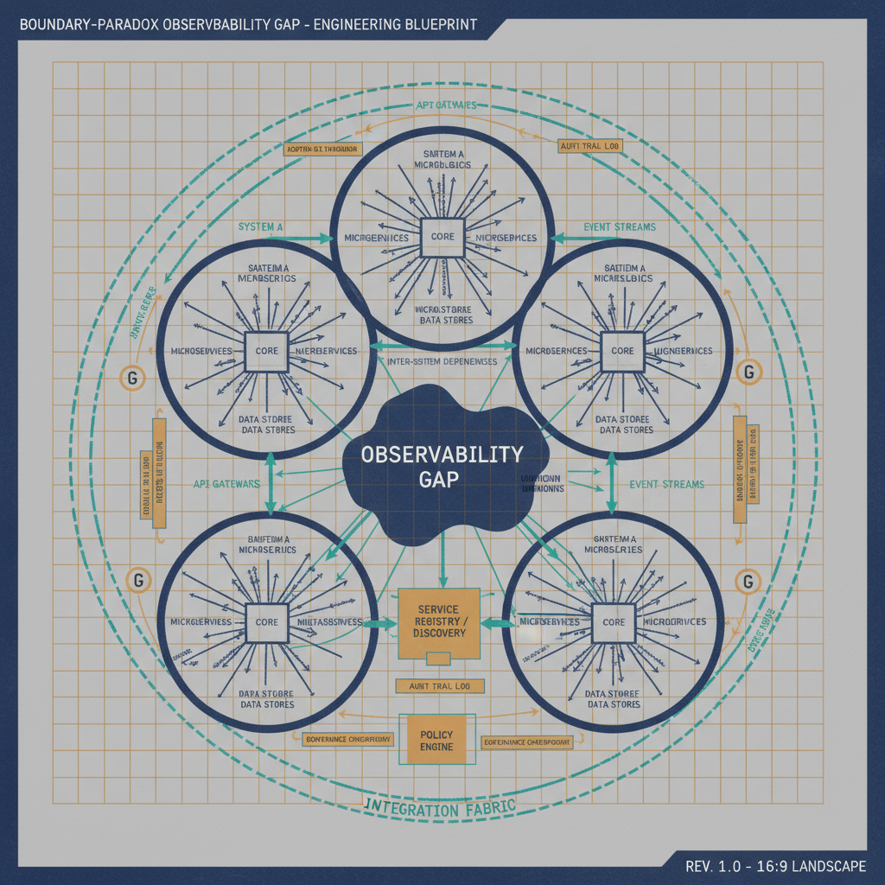
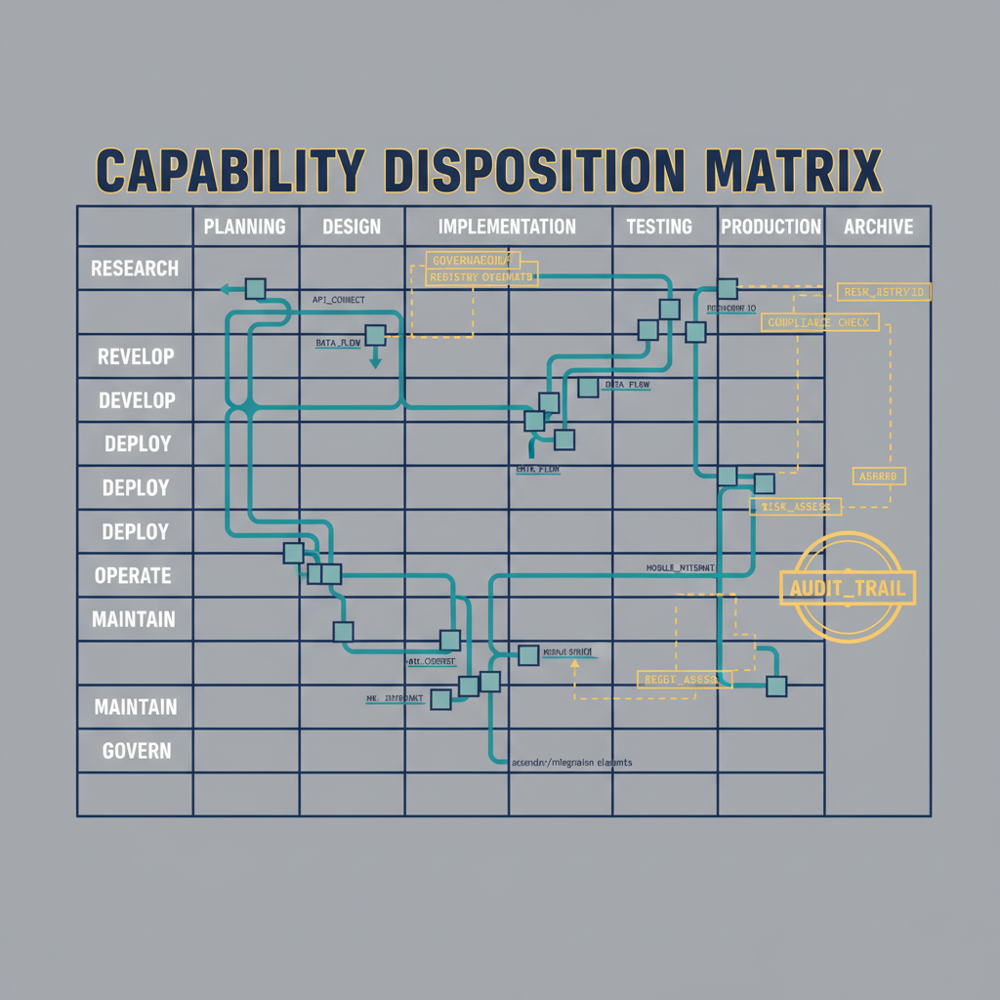
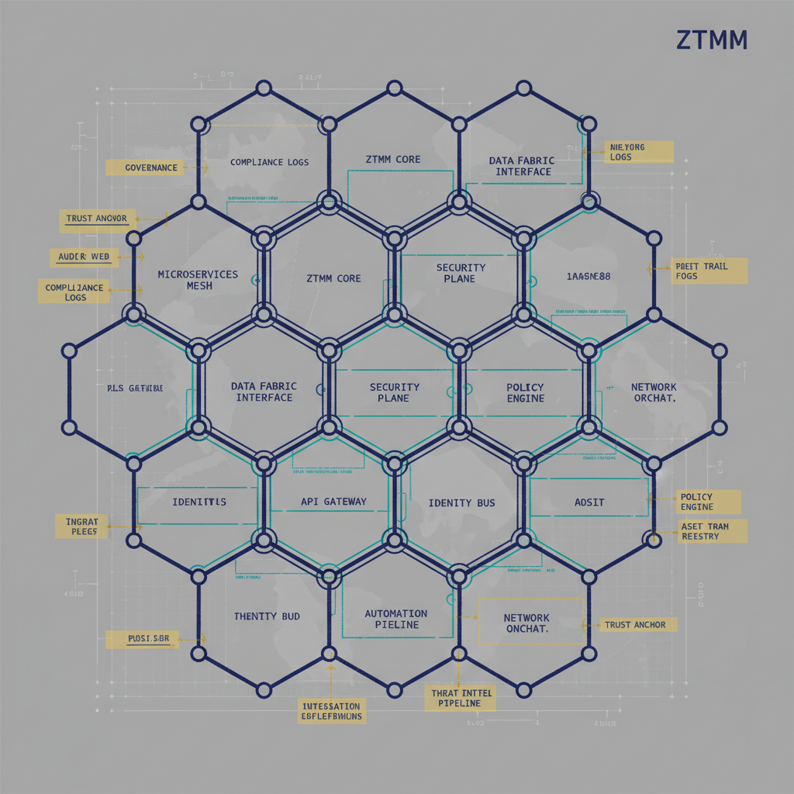

**CONTROLLED**

# B.1 GCC-Moderate Boundary Model

{#fig-B1-gcc-moderate-boundary-model-image-01 fig-alt="Boundary-paradox observability gap visualization. Engineering blueprint style, neutral slate background, federal navy (#1F3A5F) for primary structural elements, teal (#1A9E8F) for secondary/integration elements, amber (#D4A017) for governance/audit/registry overlays, monospace labels for identifiers, no human figures, 16:9 landscape." width="100%"}

{#fig-B1-gcc-moderate-boundary-model-image-02 fig-alt="capability disposition matrix. Engineering blueprint style, neutral slate background, federal navy (#1F3A5F) for primary structural elements, teal (#1A9E8F) for secondary/integration elements, amber (#D4A017) for governance/audit/registry overlays, monospace labels for identifiers, no human figures, 16:9 landscape." width="100%"}

{#fig-B1-gcc-moderate-boundary-model-image-03 fig-alt="ZTMM ceiling chart. Engineering blueprint style, neutral slate background, federal navy (#1F3A5F) for primary structural elements, teal (#1A9E8F) for secondary/integration elements, amber (#D4A017) for governance/audit/registry overlays, monospace labels for identifiers, no human figures, 16:9 landscape." width="100%"}

## 0. What "GCC-Moderate" names here {#gcc-moderate-terminology}

::: {.callout-important}
**"GCC-Moderate" is this substrate's own label, not a Microsoft
designation.** It names a *tier* — Office 365 Government Community Cloud —
paired with the FedRAMP impact level this program assumes for it. Microsoft
does not publish "GCC-Moderate" as a product or authorization name, and
Microsoft's own documentation does not agree with itself on the level:

- The **Office 365 GCC service description** says the environment supports
  FedRAMP accreditation *"at a High Impact level."*
- The **Purview GCC deployment guidance** and the **Copilot government
  overview** say FedRAMP **Moderate**.

GCC is listed on the FedRAMP Marketplace as *"Office 365
(Commercial)/Multitenant"* and **rides agency ATOs** rather than carrying a
single published level of its own. Two further facts a reader will
otherwise assume the other way: Intune has no separate GCC instance — GCC is
the same instance as Intune in the commercial space — and Office 365 GCC
pairs with Entra ID in **Azure Public**, while GCC High and DoD pair with
Entra ID in Azure Government. GCC also has no separate endpoint list; it is
served by Microsoft's Worldwide list.

**The rule this doc sets for the corpus: name the tier, never the level.**
Write "GCC" when you mean the environment. Where an impact level is
load-bearing for a claim, say whose authorization you are relying on — the
agency's — rather than asserting a published level Microsoft has not
published.

The `gcc-boundary: gcc-moderate` value in `adapter-registry.yaml` and the
`gcc-moderate-*` filenames throughout this repository are **internal
identifiers for this boundary model**, not assertions about a FedRAMP
listing. They are deliberately left unchanged: renaming ~2,750 references
across ~694 files would churn every emitted artifact and every gap register
without making a single claim more accurate. This footnote is the
correction; the identifier is a name.

**Open item.** The FedRAMP Marketplace is a single-page application that
returns nothing to automated retrieval, so M365 GCC's currently listed
impact level could not be read from the authoritative source. A human
should open the Marketplace listing and close this. Until then, no document
in this corpus should state a FedRAMP level for GCC as settled fact.
:::

## 1. Position

Microsoft 365 GCC-Moderate provides the same nominal product set as M365
commercial, but the FedRAMP Moderate authorization boundary materially
constrains the outbound telemetry that drives many of the platform's
higher-order analytics. The result is a structural reduction in the
fidelity of signals available for Zero Trust decisions, anomaly detection,
insider-risk detection, and forensic reconstruction.

The paradox: agencies in GCC-Moderate can be technically compliant with
FedRAMP Moderate yet structurally less observable than commercial
enterprises that have full access to Microsoft's commercial telemetry
stack. Closing this observability gap is an agency responsibility, not a
Microsoft platform feature.

## 2. The Boundary-Inference Framework

The single most important methodological position taken in this assessment
is that **absence of an explicit "not available in GCC-Moderate" statement
is not evidence of availability**. Many telemetry-dependent capabilities
are constrained by the FedRAMP Moderate authorization boundary itself,
regardless of what any product page says.

The constraining controls are:

| NIST 800-53 control | Constraint applied to outbound telemetry |
|---|---|
| **SI-4** Information System Monitoring | Monitoring data must remain within the authorized boundary unless explicitly scoped and authorized for export. |
| **AU-2 / AU-3** Audit Events / Content of Audit Records | Audit content shipped off-boundary to commercial multi-tenant analytics may exceed authorized export scope. |
| **SC-7** Boundary Protection | Continuous, rich telemetry to multi-tenant analytics services is exactly the cross-boundary flow SC-7 forces agencies to constrain. |

**Reverse-inference rule.** If a feature requires telemetry to flow to
Microsoft's commercial multi-tenant processing pipeline, and the FedRAMP
Moderate boundary restricts that outbound flow under SI-4, AU-2, AU-3, or
SC-7, then the signal is blocked or degraded *by architecture* — even when
no Microsoft product page explicitly says so. Such findings are labeled
**Inferred blocked by FedRAMP boundary architecture** rather than asserted
documented unavailability.

## 3. Capability Dispositions

Each row of the gap matrix carries one of four `documented` dispositions.

| Disposition | Meaning | Count |
|---|---|---|
| `confirmed` | Microsoft documentation explicitly states unavailability | 8 |
| `inferred` | No explicit doc; blocked by SI-4 / AU-2 / AU-3 / SC-7 architecture | 15 |
| `restricted` | Available with restrictions (e.g., Office Optional defaults to Required) | 1 |
| `retention-limited` | Available but data lifetime caps create a forensic cliff | 2 |

The two confirmed-unavailable headline capabilities are:

- **Microsoft Adoption Score** — *"This feature isn't available in GCC
  High, GCC, and DOD tenants."* The "GCC" item in that list is
  GCC-Moderate.
- **Microsoft Informed Network Routing (INR)** — *"supports tenants in WW
  Commercial cloud but not the GCC Moderate, GCC High, DoD, Germany, or
  China clouds."*

**Attribution note (INR and Adoption Score).** For these two `confirmed`
capabilities, Microsoft's documentation establishes *unavailability* in
GCC-Moderate as fact but does **not** name the FedRAMP Moderate boundary as
the cause; the mechanism — FedRAMP boundary definition, Microsoft
engineering sequencing, or another constraint — is unstated in public
documentation. Both are SaaS features whose telemetry exchange occurs inside
Microsoft's commercial backend, so their absence is at least as consistent
with a Microsoft platform-scope decision as with the agency's authorization
boundary, and is therefore **not** recoverable by any change to the agency's
network path. The `confirmed` disposition records that the capability is
unavailable; it does not assert the boundary as the cause. See
[B.1.2 §4](B1-2-teams-phone-tic2-centralized-dia.qmd),
[B.1.3](B1-3-rebuilding-boundary-blocked-analytics.qmd), and
[FINDING-001](../../findings/fedramp-gcc-moderate-informed-network-routing.html),
which adopt the same careful causation language.

Capabilities incorrectly listed as unavailable in earlier analyses but
which **are** available with caveats:

- **Teams Call Quality Dashboard (CQD)** — available with 28-day EUII
  retention as the operational constraint.
- **Microsoft 365 Usage Analytics** — available via the GCC-specific
  Power BI connector; only the Marketplace template-app variant is
  missing.

For per-row detail, see
[`https://github.com/WhalerMike/uiao/blob/main/src/uiao/canon/data/gcc-moderate-telemetry-gaps.yaml`](https://github.com/WhalerMike/uiao/blob/main/src/uiao/canon/data/gcc-moderate-telemetry-gaps.yaml)
and
[`https://github.com/WhalerMike/uiao/blob/main/src/uiao/canon/compliance/reference/gcc-moderate-boundary-assessment/capabilities.md`](https://github.com/WhalerMike/uiao/blob/main/src/uiao/canon/compliance/reference/gcc-moderate-boundary-assessment/capabilities.md).

## 4. ZTMM Maturity Ceiling

CISA Zero Trust Maturity Model v2.0 pillar achievability under GCC-Moderate
without agency-side analytics:

| Pillar | Achievable without agency analytics | Gating gap | Achievable with agency analytics |
|---|---|---|---|
| Identity | Initial | Real-time Identity Protection ML risk + CAE | Advanced |
| Devices | Initial | Endpoint Analytics Advanced + Intune behavioral analytics | Advanced |
| Networks | Initial | INR + CQD long-retention EUII | Advanced (with third-party SD-WAN or SASE) |
| Applications & Workloads | Initial → Advanced | Office Optional diagnostic + Copilot telemetry | Advanced |
| Data | Initial → Advanced | Adoption Score collaboration baselines + rich DLP context | Advanced |
| Visibility & Analytics | Initial → Advanced | All of the above | Advanced |
| Automation & Orchestration | Initial | Real-time CAE; automated risk-based response | Advanced |

**The structural ceiling.** Without agency-side analytics, GCC-Moderate
caps near Initial maturity in Identity, Devices, and Networks; reaching
Advanced requires meaningful agency engineering investment; Optimal in any
pillar requires either Microsoft scope changes under the now-live MAS
2026 rules (§6) or substantial agency-built equivalents to Microsoft's
commercial ML pipelines.

## 5. Compliance Posture Under the Boundary

| Mandate | Met by GCC-Moderate alone? | Closing the gap requires |
|---|---|---|
| CISA [BOD 25-01](https://cyber.dhs.gov/bod/25-01/) (logging and visibility) | Core logging met if all available logs export to Sentinel / Log Analytics. The "rapid detection and investigation" intent is not. | Agency-built local analytics, custom KQL / SIEM rules, third-party UEBA. |
| OMB M-22-09 (Federal Zero Trust) | Identity continuous-monitoring intent not met without compensating analytics. | Equivalent agency risk scoring; third-party SASE / SD-WAN; behavior-aware DLP overlay. |
| OMB M-26-14 (maturity Level 3, Advanced) | Met if all categories enabled and routed. | Telemetry completeness scorecard with quarterly verification. |
| NIST SP 800-207 (ZTA) | Architecture consistent; PE / PA require continuous trust signals. | Trust-algorithm overlay in agency SIEM. |

For the deeper finding-shape treatment of the three-way compliance
conflict between TIC 3.0, the CISA Zero Trust Maturity Model, and
FedRAMP 20x continuous monitoring — including the Purview Information
Protection telemetry constraint and the Evidence Bundle finding shape
the substrate emits — see
[B.1.1 The Three-Way GCC-Moderate Compliance Conflict](B1-1-gcc-moderate-three-way-conflict.qmd).

## 6. Boundary Modernization Path — MAS 2026

FedRAMP's Minimum Assessment Scope (MAS) rules officially launched
2026-06-24 as part of the Consolidated Rules for 2026 and became required
for 20x authorizations on 2026-07-04 (required to maintain for 20x, and
required to obtain for Rev5, on 2027-01-01) — this is now a live scope
refinement an agency can invoke, not a forthcoming one. MAS 2026 scope
refinement is the path to recovering some currently-blocked telemetry by
**removing Microsoft's commercial telemetry pipelines from the agency's
authorization scope** rather than blocking the data flow at the network
boundary, provided the pipeline passes MAS-CSO-IIR's own two-prong test.
This shifts the conversation from "can the data leave?" to "is the
receiving service in scope of my ATO?"

For the FedRAMP 20x framing of the same shift — all five MAS-CSO rules
(MAS-CSO-IIR / MAS-CSO-FLO / MAS-CSO-TPR / MAS-CSO-MDI / MAS-CSO-SUP) and
the Rev5 Balance Improvement Releases — see
[`docs/docs/04_FedRAMP20x_Phase2_Summary.qmd`](../../docs/04_FedRAMP20x_Phase2_Summary.html).
For the specific, scoped petition this refinement supports for the
GCC-Moderate telemetry gaps — and what it does not support — see
[B.1.3 §12](B1-3-rebuilding-boundary-blocked-analytics.qmd).

## 7. Sub-leaves

This leaf describes the boundary model in the abstract. Sub-leaves cover
specific findings under the boundary and specific agency network
configurations the same boundary model applies to:

- **B.1.1** [The Three-Way GCC-Moderate Compliance Conflict (TIC 3.0 × Zero Trust × FedRAMP 20x)](B1-1-gcc-moderate-three-way-conflict.qmd) — the structural compliance finding the boundary produces when an agency is simultaneously subject to TIC 3.0, the CISA Zero Trust Maturity Model, and FedRAMP 20x continuous-monitoring requirements; includes the Purview Information Protection telemetry constraint and the Evidence Bundle finding shape the substrate emits.
- **B.1.2** [Teams Phone Under TIC 2.0 Centralized DIA, F5 Removed, No SD-WAN](B1-2-teams-phone-tic2-centralized-dia.qmd) — what F5 retirement fixes for Teams Phone telephony, what the topology still costs, and what the boundary is doing independent of either; includes the residual E911 dispatchable-location obligation that is unaffected by network architecture changes.
- **B.1.3** [Rebuilding Boundary-Blocked Analytics In-Boundary](B1-3-rebuilding-boundary-blocked-analytics.qmd) — the detailed, phased implementation plan for reconstructing the boundary-blocked SaaS analytics inside the agency's own authorization boundary; the *how* for the agency-built-analytics path from Initial to Advanced ZTMM maturity, with the honest limits on what cannot be rebuilt at any investment.

## 8. Cross-References

- **Methodology**: [`https://github.com/WhalerMike/uiao/blob/main/src/uiao/canon/compliance/reference/gcc-moderate-boundary-assessment/methodology.md`](https://github.com/WhalerMike/uiao/blob/main/src/uiao/canon/compliance/reference/gcc-moderate-boundary-assessment/methodology.md)
- **Per-capability dispositions**: [`capabilities.md`](https://github.com/WhalerMike/uiao/blob/main/src/uiao/canon/compliance/reference/gcc-moderate-boundary-assessment/capabilities.md)
- **MITRE Chains A & B**: [`mitre-chains.md`](https://github.com/WhalerMike/uiao/blob/main/src/uiao/canon/compliance/reference/gcc-moderate-boundary-assessment/mitre-chains.md)
- **Resolved positions on disputed questions**: [`resolved-positions.md`](https://github.com/WhalerMike/uiao/blob/main/src/uiao/canon/compliance/reference/gcc-moderate-boundary-assessment/resolved-positions.md)
- **Machine-readable gap matrix**: [`canon/data/gcc-moderate-telemetry-gaps.yaml`](https://github.com/WhalerMike/uiao/blob/main/src/uiao/canon/data/gcc-moderate-telemetry-gaps.yaml)
- **INR finding (FINDING-001)**: [`docs/findings/fedramp-gcc-moderate-informed-network-routing.md`](../../findings/fedramp-gcc-moderate-informed-network-routing.html)
- **Source memo**: [M365 GCC-Moderate Telemetry & Boundary Assessment (external)](../../../../inbox/New_FedRAMP_Boundary/M365_GCC-Moderate_Telemetry_and_Boundary_Assessment_External_with_images.docx)

## 9. Provenance

This leaf is the customer-doc realization of the M365 GCC-Moderate
Telemetry & Boundary Assessment (External v1.0, 2026-04-25). The narrative
above is condensed; the canon reference holds the full analytical content
and the yaml holds the per-row matrix that adapters and validators
consume.
