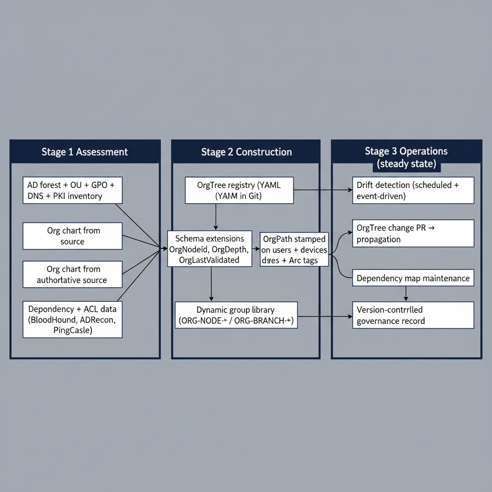
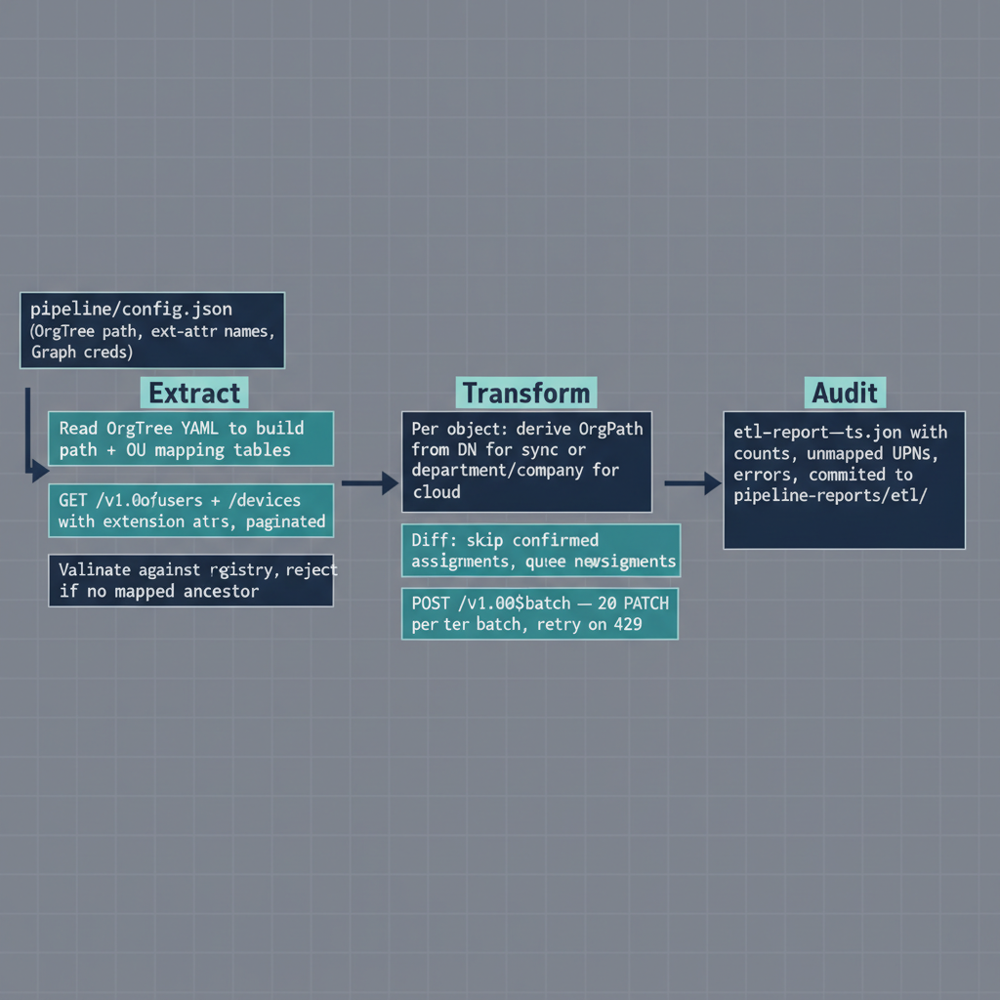

## Chapter 1 — Laying the Foundation — What Must Be in Place Before Implementation Begins

This document describes how to build OrgTree and OrgPath. The proposal in Part Three described both constructs as architectural ideas — OrgTree as a versioned, authoritative registry of organizational structure, and OrgPath as a validated attribute stamped on every identity and resource object in the environment to express that object's position in the registry. Those descriptions were necessarily abstract. Architecture describes what a system is and why it should exist. An implementation guide describes how to make it real, in sequence, with specific tools, specific commands, and specific decisions that carry consequences. That is the purpose of this document.

The implementation proceeds in three broad stages. The first stage is assessment. Assessment captures the current state of the Active Directory environment and produces the raw material from which the initial OrgTree is derived. It is not a bureaucratic formality — it is the foundation on which the entire construction depends. An OrgTree built without a rigorous assessment of the existing directory will misrepresent the organization's actual governance boundaries, and that misrepresentation will propagate through every subsequent stage, producing invalid OrgPath values, misconfigured policy groups, and a governance model that the engineering team will spend months correcting after the fact. The second stage is construction. Construction builds the OrgTree registry, registers the OrgPath directory schema extensions, populates the initial attribute values across the user and device object populations, and establishes the dynamic group library that translates OrgPath values into policy-targetable group memberships. The third stage is operations. Operations puts the drift detection pipeline, the automation layer, and the version-controlled governance record into steady-state production — the running configuration that maintains the model's accuracy over time as the organization changes. None of these stages can be skipped, and they cannot be run out of order. The assessment produces the data the construction depends on. The construction produces the substrate the operations layer maintains. This document works through all three in sequence.

{#fig-04-implementing-orgtree-and-orgpath-diagram-01 fig-alt="Stage 1 \"Assessment\" contains three input boxes: AD forest + OU + GPO + DNS + PKI inventory; Org chart from authoritative source; Dependency + ACL data (BloodHound, ADRecon, PingCastle). Stage 2 \"Construction\" contains four boxes: OrgTree registry (YAML in Git); Schema extensions (OrgPath, OrgNodeId, OrgDepth, OrgLastValidated); OrgPath stamped on users + devices + Arc tags; Dynamic group library (ORG-NODE-* / ORG-BRANCH-*). Stage 3 \"Operations (steady state)\" contains four boxes: Drift detection (scheduled + event-driven); OrgTree change PR → propagation; Dependency map maintenance; Version-controlled governance record. All three Assessment boxes converge into the OrgTree registry box in Stage 2. Stage 2 internal flow: registry → schema extensions → stamped attribute, and registry → dynamic group library. Stage 2 outputs (stamped attribute, group library) feed Stage 3's drift detection. Stage 3 OrgTree change PR loops back to Stage 2 to update the stamped attribute. Drift detection and dependency map maintenance both terminate at the version-controlled governance record. Engineering blueprint style, neutral slate, federal navy (#1F3A5F) for stage frames, 16:9 landscape." width="85%"}

Before any implementation work begins, three conditions must be in place. The first is intellectual: the engineering team must have read and internalized the full content of Parts One, Two, and Three of this series. This is not a formality. The implementation decisions made throughout this document are traceable to the requirements established in Part Two and the design choices resolved in Part Three. A team that begins implementation without that context will encounter decision points — about node naming conventions, about which OUs to promote into the OrgTree, about how to handle synchronized versus cloud-only objects, about what to do with users whose AD organizational placement is ambiguous — and will make those decisions inconsistently, without the benefit of the reasoning that went into the design. The implementation will still proceed, but it will accumulate technical debt at every ambiguous decision point, and that debt will compound. The investment in reading the prior parts pays back immediately.

The second precondition is organizational: the engineering team needs an authoritative description of the organization's own structure, independent of any current state in Active Directory. The initial OrgTree will be informed by the AD OU structure, but it is not a mirror of it. Active Directory OU structures frequently contain artifacts, legacy containers, and administrative groupings that do not reflect the organization's actual governance boundaries. An OU named after a GPO it was created to host. An OU created years ago to give a specific administrator a delegation scope and now containing a mix of objects from three different business units. An OU whose name reflects a department that was reorganized out of existence. These are normal features of any mature Active Directory environment, not signs of negligence, and they are not useful inputs to OrgTree construction. The engineering team needs access to whoever maintains the organization's authoritative organizational chart — in whatever form that exists — and needs to schedule working sessions with that person before the OrgTree construction phase begins. Without that input, the OrgTree will inherit the directory's accumulated confusion rather than correcting it.

The third precondition is infrastructural: the platform infrastructure described in Chapter 2 must be provisioned and validated before any schema registration or attribute population begins. Schema extension registration in Entra ID is a tenant-level operation with lasting consequences. OrgPath attribute population at scale places real load on the Microsoft Graph API. Neither should be run for the first time on an unvalidated platform. The infrastructure provisioning and validation work documented in Chapter 2 is not a long process, but it is a necessary one, and it should be completed and signed off before the team moves to Chapter 7.

::: {.callout-note title="Three Preconditions Checklist"}
Before advancing beyond this chapter: (1) confirm that all team members have read Parts One through Three; (2) confirm that an authoritative organizational chart or structure document has been obtained and a working session with its owner has been scheduled; and (3) confirm that the infrastructure provisioning plan from Chapter 2 has been drafted and approved. All three must be satisfied before implementation work begins.
:::

## Chapter 2 — Infrastructure Requirements for the Governance Pipeline

### Architectural Shape of the Platform

The OrgTree and OrgPath system requires three categories of infrastructure: a governance repository server that hosts the version-controlled OrgTree registry and all pipeline outputs; an automation execution environment that runs the ETL processes, drift detection workflows, and event-triggered pipeline jobs; and the assessment workstation environment from which the Active Directory assessment tools are executed interactively before the pipeline is fully automated. In small to medium deployments, the repository server and automation execution environment can be provisioned on the same physical or virtual machine. In larger deployments, or those with strict separation of duties requirements that prohibit colocating a version-controlled data store with an execution environment that writes to it, the two roles are separated onto dedicated machines. The assessment workstation is always separate from both, because it must be domain-joined and must operate under the assessment service account — conditions that would be inappropriate on the repository or automation server.

### Governance Repository Server

The repository server requires a minimum of four virtual CPUs, sixteen gigabytes of RAM, and two hundred gigabytes of SSD-backed storage. The storage should be provisioned as two volumes: a system volume for the operating system and installed software, and a data volume for all governance pipeline content. The data volume hosts the Git repository storage directory, the assessment output archive, the drift detection report history, and the pipeline execution log directory. These are distinct from one another in growth pattern — assessment output archives grow in bounded bursts at assessment time, drift detection report history grows incrementally every day, and pipeline logs grow continuously — and separating them from the system volume protects against the data volume filling and impacting system operation.

The operating system for the repository server is Windows Server 2022 or Windows Server 2025, or a supported Linux distribution. Ubuntu 22.04 LTS and Red Hat Enterprise Linux 9 are both appropriate Linux choices; both have long-term support windows that extend beyond any reasonable deployment horizon for this infrastructure. The repository server does not need to be domain-joined. A domain-joined deployment simplifies Kerberos-based authentication integration if the engineering team prefers to use Windows Integrated Authentication for repository access, but an HTTPS-based authentication model using personal access tokens or SSH keys is equally valid and requires no domain membership. The server must be reachable by the automation execution environment and by the workstations of all engineers and administrators who will commit changes to the OrgTree registry or review pipeline outputs.

### Automation Execution Environment

The automation execution environment must run Windows Server 2022 or Windows Server 2025. The requirement for Windows on this machine is not a preference — it is driven by the PowerShell execution model. The Active Directory module, the Microsoft Graph PowerShell SDK, and the Azure PowerShell module all execute correctly on Windows PowerShell 5.1 or PowerShell 7.x on Windows. The Active Directory module in particular has dependency chains on Windows-native COM interfaces and ADSI providers that are not present on Linux; running that module on a Linux host is not supported and produces silent failures in attribute enumeration that are difficult to diagnose. The automation server must be domain-joined to at least one domain in the forest being assessed, because the assessment service account must be able to authenticate via Kerberos to query directory objects. It requires a minimum of four virtual CPUs, eight gigabytes of RAM, and one hundred gigabytes of storage to accommodate the PowerShell module cache, temporary assessment output files during pipeline execution, and the running pipeline execution log.

### Assessment Workstation

The assessment workstation is the machine from which Active Directory assessment commands are executed interactively, before the pipeline is fully automated and before the engineering team trusts the automated output enough to rely on it without manual verification. It must be Windows 10 version 21H2 or later, or Windows 11, and must be domain-joined. Windows PowerShell 5.1 is present on all supported Windows versions by default and requires no installation. PowerShell 7.x should be installed alongside it — the installer from the PowerShell GitHub releases page deploys to C:\Program Files\PowerShell\7\\ without displacing the Windows PowerShell installation at C:\Windows\System32\WindowsPowerShell\v1.0\\ and both are available in parallel. The Remote Server Administration Tools package must be installed to provide the Active Directory module, the Group Policy Management module, the DNS Server module, and the Certificate Authority module. On Windows 11, RSAT features are installed through Settings, Optional Features, or through DISM at an administrative command prompt.

### Network Connectivity Requirements

The automation server's network access requirements are specific and must be validated before pipeline execution begins. Outbound HTTPS on port 443 must reach the Microsoft Graph API endpoint at graph.microsoft.com, the Azure Resource Manager endpoint at management.azure.com, the Entra ID token endpoint at login.microsoftonline.com, and the target Git repository host — whether that is a self-hosted Gitea instance on the repository server or a hosted service. The automation server must have bidirectional LDAP access on port 389 and LDAPS access on port 636 to the domain controllers it will query. Kerberos authentication traffic on port 88, both UDP and TCP, must be allowed between the automation server and the domain controllers. DNS resolution of the domain's SRV record infrastructure — specifically the \_ldap.\_tcp.{domain} and \_kerberos.\_tcp.{domain} records that direct clients to domain controllers — must work correctly from the automation server's network position. If the deployment includes Azure Arc-managed servers, the automation server must also reach the Azure Arc service endpoints documented in the Azure Arc network requirements reference in the Microsoft documentation. Every one of these connectivity requirements should be tested explicitly — using Test-NetConnection for TCP ports, Resolve-DnsName for DNS records, and a lightweight LDAP bind test using the System.DirectoryServices.DirectoryEntry constructor — during the platform provisioning phase, before any assessment or pipeline work begins.

::: {.callout-note title="Connectivity Validation Is Not Optional"}
Connectivity failures discovered during pipeline execution are dramatically more disruptive than connectivity failures discovered during the provisioning validation phase. A pipeline that silently fails to reach a domain controller will produce assessment output that appears complete but is missing objects from unreachable sites. Validate every connection requirement explicitly before proceeding.
:::

## Chapter 3 — The Software Layer — What Must Be Installed and Configured

### Version Control Platform

The governance repository is a Git repository, and Git must be installed on the repository server and on every workstation that will contribute commits. The minimum Git version is 2.40, which introduced improvements to partial clone and sparse checkout that are useful for large repository management, and which is the baseline for the hook behaviors the pipeline depends on. On Windows, Git for Windows is the standard distribution, available from git-scm.com; on Linux, the distribution package manager provides it — apt install git on Ubuntu, dnf install git on RHEL 9. The repository server must expose the Git repository over HTTPS with authentication. The recommended approach for self-hosted deployments is Gitea, which is a lightweight, open-source Git service that provides a web interface for repository browsing and pull request review, a REST API for programmatic repository interaction, and webhook support for event-driven pipeline triggering. Gitea is a single binary deployment on Linux and installs with minimal dependencies; its configuration file at /etc/gitea/app.ini controls all server behavior including authentication methods, repository storage paths, and webhook delivery settings.

Regardless of the hosting approach, the repository must be configured with branch protection rules that require at least one review approval for any commit to the main branch, which is where the authoritative OrgTree registry and pipeline configurations live. This is a governance control, not just a development best practice. An unreviewed commit to the OrgTree registry can trigger the propagation pipeline and stamp incorrect OrgPath values on thousands of identity objects before anyone notices the error. The protection rule prevents that class of incident. A pre-receive hook installed at the repository level — a server-side script that runs before accepting a push — should validate the YAML syntax of any modified OrgTree file before accepting the commit. A malformed YAML file will crash the propagation pipeline at parse time; catching it at commit time is far preferable. The hook script can be a simple Python or PowerShell script that attempts to parse the submitted YAML and exits with a non-zero code if parsing fails.

### PowerShell Requirements

The governance pipeline runs on PowerShell 7.4 or later on Windows — the current stable release in the PowerShell 7.x series at the time of writing. PowerShell 7.x installs alongside Windows PowerShell 5.1 without replacing it; the two coexist on the same machine and are invoked through different executables: powershell.exe for Windows PowerShell 5.1 and pwsh.exe for PowerShell 7.x. Both are required because certain modules, particularly the legacy Active Directory module distributed with RSAT, are built against Windows PowerShell compatibility layers and execute correctly only under powershell.exe. Attempting to import the Active Directory module under pwsh.exe may succeed through the Windows PowerShell compatibility shim, but the shim serializes objects across a process boundary and strips PowerShell type accelerators, which means that pipeline operations that depend on the type of objects returned — such as using -is \[Microsoft.ActiveDirectory.Management.ADUser\] in a filter — will behave unexpectedly. The correct architecture for the pipeline is to run all Active Directory module interactions under an explicitly invoked Windows PowerShell 5.1 process and to handle all Microsoft Graph SDK, Azure module, and pipeline orchestration work under PowerShell 7.4. The orchestration layer can invoke a Windows PowerShell child process using Start-Process powershell.exe -ArgumentList "-File .\collect-ad.ps1" -Wait and capture output through a file handoff, which is straightforward and reliable.

### Remote Server Administration Tools

The RSAT installation on the assessment workstation requires four specific feature sets. On Windows 11, these are installed using the DISM command line or through the Windows Settings Optional Features interface. The required features are RSAT.ActiveDirectory.DS-LDS.Tools\~\~\~~0.0.1.0, which provides the Active Directory module and the Get-AD\* cmdlet family; RSAT.GroupPolicy.Management.Tools\~\~\~~0.0.1.0, which provides the Group Policy Management module, including the Get-GPOReport cmdlet that is essential for the GPO assessment; RSAT.DNS.Tools\~\~\~~0.0.1.0, which provides the DNS Server module for DNS infrastructure assessment; and RSAT.CertificateServices\~\~\~~0.0.1.0, which provides the PKI assessment cmdlets including Get-CACrlDistributionPoint and access to the Active Directory Certificate Services snap-in. On Windows Server 2022 or 2025, the equivalent features are installed using Add-WindowsFeature with the feature names RSAT-AD-PowerShell, GPMC, RSAT-DNS-Server, and RSAT-ADCS-Mgmt. After installation, the Active Directory module is imported with Import-Module ActiveDirectory and the Group Policy Management module with Import-Module GroupPolicy; both should be tested by running a simple Get-ADDomain and Get-GPO -All command before proceeding.

### Microsoft Graph PowerShell SDK

The Microsoft Graph PowerShell SDK is installed from the PowerShell Gallery using Install-Module Microsoft.Graph under PowerShell 7.4. The full SDK is modular — the metapackage installs over thirty-five sub-modules covering the breadth of the Graph API surface — and on the automation server, installing the full metapackage is appropriate because the disk cost is modest and it eliminates the risk of missing a dependency. For the assessment workstation where disk economy matters more, the minimum sub-modules required for OrgPath work are Microsoft.Graph.Users for reading and writing user directory attributes, Microsoft.Graph.Groups for creating and managing dynamic groups, Microsoft.Graph.Applications for registering the schema extension application and creating extension properties, Microsoft.Graph.DeviceManagement for reading Intune device objects, and Microsoft.Graph.Identity.DirectoryManagement for working with Administrative Units and directory schema extensions. These sub-modules are installed individually using Install-Module Microsoft.Graph.Users and so on. All modules should be installed in the AllUsers scope on the automation server — using Install-Module -Scope AllUsers — to ensure they are available to the service account that runs the pipeline jobs, not only to the administrative account that installed them.

### Azure PowerShell Module

The Az module is installed from the PowerShell Gallery using Install-Module Az under PowerShell 7.4. As with the Graph SDK, the Az metapackage installs all sub-modules; on the automation server this is appropriate. The sub-modules specifically required for Arc server tag management and Azure Policy compliance queries are Az.ConnectedMachine for reading and writing Arc machine properties and tags, Az.PolicyInsights for querying Azure Policy compliance state, and Az.Resources for general resource management operations including resource group queries. Authentication to Azure from the automation server should use a Managed Identity where the server is enrolled in Azure Arc and has been assigned a system-assigned managed identity — this eliminates credential management entirely for Azure operations. Where Managed Identity is not available, a service principal with a certificate credential is the appropriate mechanism: create the service principal using New-AzADServicePrincipal, generate a self-signed certificate or obtain one from the organization's certificate authority, and associate it with the service principal using New-AzADSpCredential -ObjectId {spObjectId} -CertValue {base64Cert}. Password-based service principal authentication must not be used in production; the credential rotation burden and the risk of credential exposure in pipeline logs are both unacceptable.

### Schema Extension Registration Prerequisite

Before any OrgPath attribute value can be written to a user or device object in the Entra ID directory, the schema extension that defines that attribute must be registered through the Microsoft Graph API against an application registration. This is a prerequisite operation, not a pipeline step — it must complete successfully and its output must be recorded in the pipeline configuration before the ETL pipeline is run for the first time. The application registration that owns the schema extension must exist in the Entra ID tenant before the extension property can be created. It is created through the Entra ID portal under App Registrations, or through a POST to /v1.0/applications with a JSON body containing only a displayName field. The application needs no redirect URIs, no API permissions for user sign-in, and no client secrets for its own authentication needs — it exists solely as an ownership anchor for the schema extension. Its application object ID and application client ID must be recorded in the pipeline configuration file immediately after creation.

With the application registered, each extension property is created by posting to /v1.0/applications/{applicationObjectId}/extensionProperties with a JSON body specifying the name, the dataType as String, and the targetObjects array. The response body contains the name property of the registered extension, which takes the form extension\_{appIdWithoutHyphens}\_{propertyName}. For a property named OrgPath on an application with client ID a1b2c3d4-e5f6-a1b2-c3d4-e5f6a1b2c3d4, the registered name would be extension_a1b2c3d4e5f6a1b2c3d4e5f6a1b2c3d4_OrgPath. This full name is what the pipeline uses in every subsequent read and write operation and must be stored in the pipeline configuration. The registration operation should create all required extension properties in a single session: a minimum set of four properties — OrgPath, OrgNodeId, OrgDepth, and OrgLastValidated — covering the full path string, the leaf node identifier, the integer hierarchy depth, and the ISO 8601 last-validation timestamp. The application registration must not be deleted at any future point as long as any extension attribute values derived from it exist on directory objects. Deleting the application orphans every extension value in the directory — the values remain on the objects but become unreadable through the API, because the schema that defines them no longer exists.

### Scheduling and Automation Platform

Pipeline jobs are scheduled using Windows Task Scheduler on the automation server. The Task Scheduler library should contain a dedicated folder named GovernancePipeline with separate tasks for the daily drift detection run (scheduled at a consistent off-peak time, such as 02:00 local time), the weekly full assessment refresh run (scheduled for a weekend morning), the event-triggered OrgPath propagation job (triggered by a webhook delivery from the Git repository when the OrgTree file is committed to main), and the monthly dependency map reconciliation. Windows Task Scheduler supports both time-based triggers and custom event triggers, but it does not natively handle inbound webhook calls. The event-triggered propagation job requires a small listener component — a minimal HTTP endpoint running on the automation server that receives the webhook POST from the Git service and invokes the PowerShell propagation script. This listener can be implemented as a Windows service using the HttpListener class in a compiled .NET application, or as a simple NSSM-wrapped PowerShell HTTP server for less demanding deployments. Organizations with an existing automation platform — Jenkins, Azure Automation, GitHub Actions, or Gitea Actions — may prefer to run pipeline jobs there instead. The pipeline scripts are platform-agnostic PowerShell that accept parameters; the scheduling mechanism is an operational choice. What is not optional is the event-driven trigger for OrgTree changes: when the OrgTree registry is updated and committed to main, the OrgPath propagation must begin within minutes. A fixed polling schedule that checks for changes every hour introduces unacceptable lag when a large organizational restructuring event is committed and thousands of users need their OrgPath values updated simultaneously.

## Chapter 4 — Capturing Current State — What Microsoft Provides for AD Discovery

### The Purpose of the Assessment Phase

The initial OrgTree cannot be constructed from imagination. It must be derived from a rigorous inventory of the current Active Directory environment, combined with the organization's authoritative description of its own structure. The assessment phase uses tooling to extract the raw facts of the AD environment — the forest topology, the domain structure, the OU hierarchy, the GPO library, the DNS configuration, the certificate services infrastructure, the computer object population, the user population, the group structure, the trust relationships, the service account inventory, and the access control model — and produces structured output that the OrgTree construction process consumes. A thorough assessment takes time. That investment is not avoidable and should not be compressed. Every shortcut taken in the assessment phase will surface as a construction error or an operations incident later. This chapter covers the Microsoft native toolset. Chapter 5 covers the third-party and open-source tools that complement it.

### The PowerShell Active Directory Module

The Active Directory module, distributed with RSAT, is the primary native assessment instrument for the directory structure itself. It exposes the complete directory through a family of Get- cmdlets that return strongly typed PowerShell objects, each carrying the full attribute set of the queried object type. Get-ADForest returns the forest structure: the forest root domain FQDN, all child and tree domain FQDNs, the UPN suffix list, the site list, the forest functional level, and the distinguished names of the Sites, Schema, and Configuration naming contexts. Get-ADDomain returns domain-level detail: the PDC Emulator, RID Master, and Infrastructure Master FSMO role holders, the domain functional level, the linked GPO list, the domain SID, the default password policy settings (minimum password length, lockout threshold, observation window, and lockout duration), and the DistinguishedName of the domain's well-known containers. Get-ADDomainController -Filter \* enumerates all domain controllers in the queried domain, returning for each one its operating system version, its site membership, its FSMO role assignments, its global catalog status, its LDAPS certificate thumbprint (where applicable), and its replication partner list.

Get-ADOrganizationalUnit -Filter \* -SearchBase {domainDN} -SearchScope Subtree -Properties \* returns the complete OU tree for a domain, with each OU object carrying its DistinguishedName (which encodes its position in the tree — the DN is the OU path expressed in LDAP notation), its linked GPO list via the gpLink attribute, its managedBy attribute (which identifies the account or group responsible for the OU), its description attribute, and its gPOptions attribute (which controls GPO inheritance blocking). The DistinguishedName of each OU is the primary key that the OrgTree construction pipeline uses to map OUs to OrgTree nodes. Get-ADUser -Filter \* -Properties \* retrieves all user objects with their complete attribute sets, including attributes that are not returned by default — the -Properties \* parameter is essential and should not be omitted, as the default attribute set excludes several fields relevant to the assessment, including PasswordLastSet, LastLogonDate, PasswordNeverExpires, ServicePrincipalNames, and msDS-SupportedEncryptionTypes. Get-ADComputer -Filter \* -Properties \* and Get-ADGroup -Filter \* -Properties \* apply the same pattern to computer and group objects respectively. Get-ADReplicationSite -Filter \* and Get-ADReplicationSiteLink -Filter \* return the site topology and the inter-site replication transport configuration. Get-ADTrust -Filter \* returns all trust relationships visible from the queried domain, including the trust type, direction, transitivity, and the SID filter status of each trust.

### The Group Policy Management Module

The Group Policy Management module provides the cmdlets needed to fully inventory the GPO library. Get-GPO -All returns all GPO objects in the domain, each carrying a GUID identifier, a display name, a creation timestamp, a modification timestamp, and a status indicating whether the computer settings, user settings, or both are enabled. The GPO object returned by Get-GPO does not contain the policy settings themselves — it is a metadata object. The actual settings are extracted using Get-GPOReport -Guid {gpoGuid} -ReportType Xml, which returns an XML document containing the complete configuration of every setting in the GPO, organized by Computer Configuration and User Configuration extension. This XML document is machine-parseable and should be the output format used for all pipeline consumption — the HTML output format produced by the ReportType Html option is easier to read but harder to parse. Running Get-GPOReport for every GPO in the domain — which may be dozens or hundreds of GPOs in a mature environment — should be scripted as a loop that iterates through the output of Get-GPO -All, invokes Get-GPOReport for each GUID, and writes the output to a file named with the GPO's GUID in the assessment output directory. Get-GPLink applied to each OU DistinguishedName returns the GPO links active at that OU, including the link order (which determines precedence when multiple GPOs are linked at the same level) and the enforcement and enabled status of each link.

### DCDiag and RepAdmin

DCDiag is the domain controller diagnostic tool included with Windows Server and RSAT. It executes a battery of tests against a specified domain controller and reports pass or fail for each test, with diagnostic detail for any test that fails. The relevant invocation for the assessment is dcdiag /test:all /s:{DCHostname} /v, where the /v flag enables verbose output that includes diagnostic detail even for passing tests. Running this against every domain controller in the forest — iterating over the output of Get-ADDomainController -Filter \* -Properties \* — produces a per-DC diagnostic record covering DNS registration accuracy, AD replication health, SYSVOL replication status, Kerberos connectivity, LDAP connectivity, LDAPS availability, RID pool allocation, machine account health, and the accessibility of all FSMO role holders from each DC's perspective. DCDiag produces text output; the assessment pipeline should capture this output to per-DC text files and, where automated parsing is needed, process it using PowerShell string parsing or a structured wrapper script that invokes dcdiag and classifies its output by test name and result. RepAdmin is the replication administration tool. The command repadmin /replsummary produces a per-domain-controller summary of replication success and failure counts across all replication connections in the forest, making it the fastest way to identify DCs with active replication problems that would affect the consistency of the assessment data collected from them.

### Microsoft Assessment and Planning Toolkit

The MAP Toolkit is a free agentless assessment tool from Microsoft that discovers hardware inventory, software inventory, and readiness information across a domain by connecting to domain-joined machines using WMI without requiring any agent installation on the target. The MAP Toolkit installer deploys a SQL Server Express instance on the assessment workstation to serve as the data store for its collected information. After running a discovery job scoped to the target domain — configured in the MAP Toolkit wizard to use Active Directory-based machine discovery with the assessment service account's credentials — it produces a comprehensive inventory of all reachable machines, including their operating system version and service pack level, hardware specifications (CPU count, RAM, disk), installed applications and their versions, and running services. For the OrgPath implementation, the MAP Toolkit's most valuable output is its computer inventory: a comprehensive enumeration of all machines in the domain that were reachable at assessment time, their operating systems, their network addresses, and their installed workloads. This data supplements the Active Directory computer object inventory — which records what the directory believes about each machine — by adding hardware detail and reachability confirmation that the directory cannot provide. MAP Toolkit reports are generated from the embedded SQL Server Express database using the tool's built-in reporting interface or through direct T-SQL queries against the MAPToolkit database, which can be exported to CSV for pipeline ingestion.

### Group Policy Analytics in the Intune Portal

Group Policy Analytics is a feature of Microsoft Intune that accepts GPO XML exports — exactly the XML files produced by Get-GPOReport — and analyzes them to determine which policy settings have direct equivalents in the Intune Settings Catalog, which have functional equivalents that require manual mapping work, and which have no cloud-native equivalent and will require an alternative approach. The workflow is to export every GPO from the domain using Get-GPOReport -Guid {guid} -ReportType Xml -Path .\gpo-{guid}.xml, then import each XML file into the Group Policy Analytics tool. The import can be done through the Intune admin center portal at endpoint.microsoft.com under Devices, Group Policy Analytics, or programmatically through the Microsoft Graph API at the beta endpoint /beta/deviceManagement/groupPolicyMigrationReports. The API approach is preferable for large GPO sets because it can be scripted to process all GPO exports without manual portal interaction. After import, the analysis report for each GPO is retrieved from the same endpoint and records, for each setting in the GPO, whether a Settings Catalog equivalent exists, what that equivalent's name and category path are, and what the migration complexity classification is. This analysis is a critical input to the migration planning layer of the governance model: it identifies which on-premises policy surface can be replicated in Intune and at what effort level.

### Microsoft Defender for Identity

Microsoft Defender for Identity, when deployed with sensors on the domain controllers in the forest, analyzes Kerberos, NTLM, LDAP, and SAM-R traffic at the wire level and builds a behavioral and configuration model of the directory. For assessment purposes, its point-in-time security posture reports are the most valuable output. The Identity Security Posture Management assessments in the Defender for Identity portal enumerate specific misconfigurations across the domain, each assigned to a Microsoft Secure Score category: accounts with unconstrained Kerberos delegation configured on them, accounts with constrained delegation to a sensitive resource, accounts enrolled in AS-REP Roasting vulnerability (that is, accounts with the DONT_REQ_PREAUTH flag set in their userAccountControl attribute), accounts with Kerberoastable service principal names registered, accounts with non-expiring passwords, domain controllers that do not enforce SMB signing, and the coverage of the Protected Users security group across privileged accounts. These findings are directly relevant to the OrgTree implementation because they identify the highest-risk objects in the directory — the ones whose migration must be prioritized and whose on-premises footprint must be remediated before infrastructure decommissioning can safely proceed. An account with unconstrained delegation that is not migrated before decommissioning is an account that either blocks decommissioning or creates an unacceptable security exposure.

### Azure Migrate

Azure Migrate serves two assessment functions. The Azure Migrate appliance — a lightweight virtual machine deployed in the environment — performs agentless discovery of servers, applications, and their dependencies using API-level integration with vCenter Server for VMware environments and WMI-based collection for physical or Hyper-V environments. It collects server hardware specifications, operating system versions, installed applications, and running process inventories without requiring agents on the target machines. In addition to the inventory function, Azure Migrate's dependency analysis feature maps the actual network communication patterns between servers by capturing network flow data — which server is communicating with which other server, over which ports, and at what frequency, measured over a configurable collection window of typically thirty to sixty days. This produces the dependency graph that is the foundation of the infrastructure dependency map described in Part Three and implemented in Chapter 13 of this document. The Azure Migrate project stores its collected data in an Azure-hosted Log Analytics workspace and exposes it through the Azure Migrate portal and through the Azure REST API at the Microsoft.Migrate resource provider endpoints, enabling programmatic retrieval of the dependency data for pipeline ingestion. The dependency data from Azure Migrate should be treated as a starting point, not a complete picture: it captures network connections that were active during the collection window and will miss connections that were dormant, seasonal, or triggered by events that did not occur during collection.

### Microsoft Entra Connect Health

For environments using Entra Connect sync — the hybrid identity synchronization service that replicates on-premises Active Directory objects into Entra ID — the Entra Connect Health service provides monitoring of the synchronization agent's health and, critically for the assessment, detailed visibility into the attribute flow between the on-premises directory and the cloud directory. The Connect Health portal displays the synchronization rules in effect, the objects in scope for synchronization, and the attribute-level flow details for each synchronized object type. Most relevantly for the OrgPath implementation, it surfaces synchronization errors: objects in the on-premises directory that are failing to synchronize because of attribute conflicts, duplicate attribute values, format violations, or scoping rules that exclude the object. These errors represent objects that will not receive OrgPath values through the synchronization pipeline even after the attribute is populated on the on-premises AD object — they are exceptions that must be handled separately. Reviewing the Connect Health error dashboard before beginning OrgPath implementation identifies the scale of this exception population and allows the engineering team to remediate the underlying synchronization problems before the OrgPath ETL pipeline runs, rather than discovering them as silent failures after the fact.

## Chapter 5 — Beyond the Native Toolset — Specialized Assessment Instruments

### Why the Native Toolset Is Insufficient on Its Own

The Microsoft native toolset is comprehensive for enumeration. It can list every object in the directory, every setting in every GPO, every replication partner and replication status, and every site and subnet in the forest topology. What it does not do well — and in some cases does not attempt — is risk analysis, attack path characterization, relationship mapping at graph depth, and the identification of emergent security properties that arise from combinations of individual configurations that are each individually unremarkable. Several third-party and open-source tools have been built specifically to fill these analytical gaps, and a complete assessment uses them alongside the native toolset. The output of these tools feeds the same structured assessment archive as the native tool output; they are not separate workstreams.

PingCastle

PingCastle is a free-to-use Active Directory security assessment tool that produces a risk score for the Active Directory domain based on a weighted analysis of security misconfigurations, privilege escalation paths, account hygiene problems, and infrastructure weaknesses. It runs as a standalone executable — PingCastle.exe --healthcheck --server {domainFQDN} — from any domain-joined machine with standard authenticated user credentials, without requiring domain administrator or elevated privileges for its core analysis. This makes it practical as a Phase Zero assessment instrument — something the engineering team can run immediately, without waiting for the elevated service account provisioning that Phase One requires. Its output is an HTML report organized into four risk categories: StaleObjects, which covers user and computer accounts that have not authenticated recently and represent orphaned or unmanaged credentials; Trusts, which covers inter-domain and inter-forest trust relationships and their specific security implications, including whether SID filtering is enforced and whether the trust is bidirectional when it should be unidirectional; Anomalies, which covers unusual configurations, inherited security exceptions, and deviations from hardening best practices; and PrivilegedAccounts, which covers account and group configurations that create excessive privilege, including direct Domain Admins group membership for service accounts, nested groups in privileged roles, and accounts protected by AdminSDHolder that carry unexpected OU placement. PingCastle also produces a machine-readable XML report at --xmls output mode that is suitable for pipeline ingestion and comparison between assessment runs. For the OrgTree implementation specifically, PingCastle's AdminSDHolder-protected account analysis is particularly valuable: accounts protected by AdminSDHolder have their ACL overwritten periodically by the SDProp process, which means their OU placement in the directory does not necessarily reflect their governance context — they are a class of object that requires special handling in the OrgTree assignment logic.

### BloodHound and SharpHound

BloodHound is an open-source attack path analysis tool that models Active Directory as a property graph and finds shortest paths from any starting node to any target node — most commonly from a compromised standard user account to a Domain Admin equivalent. It was built for adversarial security analysis but its data model is equally useful for governance work, because understanding what administrative relationships exist in the directory is a prerequisite for representing them correctly in the OrgTree. SharpHound is BloodHound's data collection component. It runs as a .NET executable — SharpHound.exe --CollectionMethods All --Domain {domainFQDN} — or as a PowerShell script on a domain-joined machine, and it collects group membership data via LDAP, session data via SMB-based enumeration of logged-in users on domain computers, ACL data by reading the nTSecurityDescriptor attribute on directory objects, trust relationships, and GPO linkage data. It produces a set of JSON files — one for users, one for groups, one for computers, one for domains, one for GPOs, one for OUs, and one for ACLs — that are loaded into the BloodHound Neo4j database for visualization and Cypher query. For the OrgTree implementation, the ACL data is the most valuable output: BloodHound identifies every instance where a non-privileged account has write permissions over a sensitive object — GenericAll, GenericWrite, WriteDACL, WriteOwner, or AllExtendedRights — and displays the path from that account to the sensitive target. This data reveals administrative relationships that exist in the directory but are not visible in the OU structure, and those relationships must be modeled in the OrgTree dependency map rather than ignored.

ADRecon

ADRecon is an open-source PowerShell script, available from the GitHub repository at github.com/adrecon/ADRecon, that collects a comprehensive set of Active Directory data and outputs it to a structured Excel workbook and a parallel set of CSV files. Unlike the raw Get-AD\* cmdlets, ADRecon applies post-processing logic to its collected data — it calculates password age distributions across the user population, identifies accounts with specific risky configurations such as PASSWD_NOTREQD or DES_KEY_ONLY in their userAccountControl flags, summarizes the OU tree with object counts at each level (which is valuable for understanding the density of objects at different levels of the hierarchy), and produces a GPO summary cross-referenced with link counts and scope analysis. The Excel output is intended for human review by the organizational stakeholders who will participate in OrgTree construction; the CSV outputs are suitable for pipeline ingestion and should be included in the structured assessment archive. ADRecon requires standard domain user credentials for the majority of its data collection, and domain administrator credentials only for the sections that read ACL data and privileged group membership. The script is written entirely in PowerShell and should be reviewed before being run in a production environment — not because it is known to be malicious, but because the assessment workstation's execution policy should be set to RemoteSigned at minimum, and any script introduced to that environment should be code-reviewed before trust is extended to it.

### Tenable Identity Exposure

Tenable Identity Exposure — formerly known as Alsid for Active Directory before the Tenable acquisition — is a commercial product that performs continuous, agentless monitoring of Active Directory by collecting and analyzing changes from the directory replication stream without requiring agents on domain controllers. For the assessment phase, its point-in-time assessment capability is what matters: it evaluates the directory against a library of more than one hundred indicators of exposure, each corresponding to a specific Active Directory configuration or state that is known to be exploitable or represents a deviation from security best practice. The indicator library includes attack techniques that neither the Microsoft native toolset nor PingCastle surfaces at the same depth — including DCSync delegation misconfigurations, Kerberos delegation attack paths targeting resource-based constrained delegation, AdminSDHolder propagation anomalies where the SDProp timer has not run recently, Protected Users group coverage gaps for Tier Zero accounts, and Active Directory Certificate Services template misconfigurations that enable ESC1 through ESC8 class certificate-based privilege escalation attacks. For the OrgTree implementation, the AD CS template findings are particularly important: they identify certificate templates that can be used to impersonate any user in the domain, which are a class of infrastructure dependency that must be explicitly captured in the dependency map and resolved before decommissioning proceeds.

### Semperis Directory Services Protector

Semperis Directory Services Protector is a commercial Active Directory security and recovery platform whose assessment mode evaluates the security posture of the directory across categories including privileged access, delegation configuration, password policy adequacy, Kerberos configuration, and Active Directory Certificate Services exposure. For organizations that have already deployed DSP as part of their existing security program, its value for the OrgTree assessment is in its export capability: DSP can export its collected object and relationship data in structured formats — JSON and CSV — that can be consumed directly by the dependency mapping component of the governance pipeline without requiring the engineering team to run a separate collection pass. If the organization has DSP deployed and has been collecting data for at least thirty days before the assessment begins, the DSP export can partially replace the BloodHound collection and some of the ADRecon collection, reducing the assessment workload for those sections.

LDAPDomainDump

LDAPDomainDump is an open-source Python tool available from the GitHub repository at github.com/dirkjanm/ldapdomaindump that performs a bulk LDAP dump of an Active Directory domain and outputs the results as JSON files organized by object type: separate files for users, groups, computers, GPOs, OUs, and trusts. It is particularly useful for large domains — environments with tens of thousands of objects — where running interactive PowerShell queries against a domain controller carries real performance concerns, because LDAPDomainDump performs a single bulk LDAP query for each object type using the python-ldap library and writes all results to disk for offline analysis, rather than maintaining a persistent session against the domain controller for the duration of the collection. It runs on any platform with Python 3 installed and connects to any LDAP-accessible domain controller using credentials provided on the command line: python ldapdomaindump.py -u DOMAIN\\username -p password ldap://{dcIPAddress}. The JSON output format is directly consumable by the OrgTree construction pipeline without transformation. For very large environments — domains with more than fifty thousand objects — LDAPDomainDump's bulk collection approach produces consistent results more reliably than iterating through PowerShell pipelines that may timeout or be interrupted by session limits on busy domain controllers.

## Chapter 6 — Running the Assessment — Sequence, Privilege, and Output Structure

### A Phased Approach to Privilege

The assessment methodology is structured as a phased approach that begins with the minimum privilege level and expands as authorization permits and as the output of earlier phases justifies. This structure is not a bureaucratic formality — it is a practical recognition that assessment work in a production directory carries real risk. An assessment script that is misconfigured, run under the wrong account, or directed at the wrong domain controller can generate LDAP query load that degrades authentication performance for the users it serves. Beginning with low-privilege collection minimizes that risk while producing output that informs exactly what elevated access is needed and provides documentation to support the access request. The higher-privilege phases are also the phases that collect the most sensitive data — ACL contents, LAPS passwords, service account credentials in attribute form — and limiting their blast radius to an explicitly authorized service account is a security control as well as an operational one.

### Phase Zero: The Read-Only Assessment

Phase Zero begins immediately and uses only the credentials of a standard domain-joined user account — the engineer's own account, or any account in the Authenticated Users group. The tools executable in this phase include PingCastle, which requires only Authenticated Users access for its core health check analysis; the Get-ADForest, Get-ADDomain, Get-ADOrganizationalUnit, Get-ADDomainController, Get-ADTrust, Get-ADReplicationSite, and Get-ADReplicationSiteLink cmdlets, all of which return their primary data to Authenticated Users without requiring elevated access; and LDAPDomainDump with standard credentials, which performs a bulk LDAP query using the same access level. Phase Zero should be completed before any elevated access is requested, for two reasons. First, its output is the justification for the elevated access: the PingCastle report identifies which privileged account categories require closer examination, the OU structure output identifies which domains and OUs require deeper assessment, and the replication and trust output identifies which domain controllers and remote domains must be reachable from the Phase One service account. Second, it provides a baseline snapshot of the directory's structure at the point in time when the assessment began — a record that is valuable if the directory changes significantly during the assessment period. The Phase Zero output should be committed to the governance repository in a dedicated assessment/phase-zero directory as a timestamped baseline.

### Phase One: The Full Elevated Assessment

Phase One runs under a purpose-created assessment service account that has been delegated read access to all objects in the directory — specifically, the permission to read all attributes on all object classes, including attributes that are restricted from Authenticated Users by default, such as the ms-MCS-AdmPwd attribute (the LAPS-managed local administrator password), the unixUserPassword attribute where it is populated, the nTSecurityDescriptor attribute on sensitive objects, and any confidential attributes marked with the ATTRIBUTE_CACHE_VALID flag in the schema. This account should not be a member of Domain Admins, Schema Admins, or any other privileged group — it should be a purpose-created account with precisely the permissions needed for the assessment delegated through Active Directory's ACL mechanism, applied at the domain root with inheritance. Specifically, the account requires the Allow Read permission on all objects, applied at the domain root with the This Object and All Descendant Objects scope, and the Allow Read All Properties permission on all object types. These delegations are made using dsacls.exe or through the Active Directory Users and Computers Delegation of Control Wizard.

Phase One runs the full Get-ADUser -Filter \* -Properties \*, Get-ADComputer -Filter \* -Properties \*, Get-ADGroup -Filter \* -Properties \*, and Get-ADObject -Filter \* -Properties \* collection sweeps, directing each query to a specific domain controller using the -Server parameter to ensure data consistency across the collection. It runs Get-GPOReport for every GPO in every domain, dcdiag /test:all against every domain controller, and repadmin /replsummary and repadmin /showrepl for the forest. It runs ADRecon with the -DomainController parameter pointing to the same specific DC used for the PowerShell collection. It runs SharpHound for relationship and ACL mapping. The Phase One output should be committed to the governance repository in an assessment/phase-one directory, and the commit message should record the service account used, the domain controllers queried, the timestamp of each collection, and the tool version for every tool invoked. This provenance information is part of the governance record.

### Assessment Output Organization

Assessment output should be organized in a directory structure that reflects the assessment surface. Forest-level data — the output of Get-ADForest, the site topology, the trust inventory — lives in assessment/forest/. Per-domain data — the domain object, domain controller inventory, OU hierarchy — lives in assessment/domains/{domainFQDN}/. GPO data lives in assessment/gpo/{domainFQDN}/, with one file per GPO named by GPO GUID. DNS infrastructure assessment output lives in assessment/dns/{domainFQDN}/. PKI data lives in assessment/pki/. Computer object data lives in assessment/computers/{domainFQDN}/. User data lives in assessment/users/{domainFQDN}/. Group data lives in assessment/groups/{domainFQDN}/. Trust data lives in assessment/trusts/. Every output file is produced in JSON format for pipeline consumption, with a parallel CSV file for human review. Every output file carries a metadata header — implemented as the first object in the JSON array for array-format files, or as a top-level \_metadata key for object-format files — that records the collection timestamp in ISO 8601 format, the tool name and version, the collecting account UPN, and the target domain controller's FQDN. This metadata structure ensures that any future reader of the assessment archive can determine when and how each file was produced.

::: {.callout-note title="Commit Early, Commit Often"}
Assessment output should be committed to the governance repository as each phase and each tool completes, not accumulated and committed in bulk at the end of the assessment. Intermediate commits allow the team to review progress, identify gaps in coverage while the assessment is still running, and preserve partial output if the assessment must be interrupted and resumed. Each commit message should be descriptive: "Phase Zero: PingCastle health check, corp.contoso.com, 2026-05-08" rather than "assessment data."
:::

## Chapter 7 — Constructing the Initial OrgTree — From Assessment Data to Authoritative Registry

### The Intellectual Work That Precedes the Technical Work

Building the OrgTree is not a mechanical transformation of the OU hierarchy into a YAML file. It is a deliberate, intellectually demanding exercise in organizational modeling that requires active collaboration between the engineering team and the people who understand the organization's structure from the inside. The OU hierarchy extracted during the assessment is the starting point, not the answer. Every large Active Directory environment contains OUs that were created for administrative convenience rather than organizational structure: OUs named after the GPO that required them, OUs created to host a specific software deployment scope, OUs used as a delegated administrator's management boundary, OUs that are historical artifacts of a reorganization that happened years ago and were never cleaned up after the new structure was established. These OUs are real objects in the directory and they appear in the assessment output — but they do not represent governance boundaries, and encoding them in the OrgTree would produce a governance model that is as confused as the directory it is trying to replace.

The first task in building OrgTree is a structured review session — ideally one or more working sessions with the organizational stakeholders who can authoritatively distinguish between OUs that represent genuine organizational governance boundaries and OUs that are administrative artifacts. The output of the assessment OU inventory should be presented to these stakeholders as a flat list of OU DistinguishedNames, with each OU's object counts (derived from the ADRecon output) and its linked GPO count. The stakeholders are asked to mark each OU as either a governance boundary (it maps to a real division, department, unit, team, site, or other organizational segment that the organization formally recognizes) or an administrative container (it exists for operational reasons and does not represent a named organizational unit). OUs marked as governance boundaries become candidate OrgTree nodes. OUs marked as administrative containers are noted in the assessment record but excluded from the OrgTree. This distinction is the intellectual core of the entire implementation; everything downstream depends on making it correctly.

### The OrgTree Node Schema

Each node in the OrgTree registry is a structured record defined by seven fields. The id field is a stable, unique identifier for the node — a short alphanumeric code, between two and eight characters, uppercase, derived conceptually from the node's name but not required to be identical to it. The Marketing department might receive the id MKT; its Digital sub-department might receive MKTDIG. The id is the most important field in the schema: it appears in every OrgPath value that includes this node, and it must never change once assigned, even if the node is renamed, reorganized, or absorbed into another unit. The id is the stable handle that all downstream pipeline references carry. Changing it after OrgPath values have been stamped would require a full re-derivation and re-stamping of all objects whose OrgPath includes this node. The name field is the human-readable display name of the organizational segment — this can change freely without affecting OrgPath values. The type field classifies the segment using a vocabulary defined in a types section of the OrgTree schema: valid values might include Division, Department, Unit, Team, Region, Site, Function, and any other category the organization recognizes. The types vocabulary should be small — fewer than ten types — and should reflect the organization's actual naming conventions for its structural levels.

The parentId field references the id of this node's parent — the node one level above it in the hierarchy. The root node of the OrgTree, which represents the organization itself at its highest level, has no parentId and is the only node permitted to omit this field. The path field is computed, not manually set. The pipeline derives it by traversing the parent chain from the root to this node and concatenating the ids with a forward-slash delimiter, prefixed with a leading forward slash. This field must not be set manually in the YAML file — any manually set value will be overwritten by the pipeline's path derivation step. The status field carries the node's lifecycle state. Valid values are Active, indicating the node is in full effect; Pending, indicating the node has been approved for creation but its effective date has not yet arrived; Deprecated, indicating the node is no longer actively used but is retained in the registry because historical OrgPath values reference it; and Archived, indicating the node is fully retired and no new or existing objects should carry a path that includes it. The effectiveDate and retiredDate fields carry the governance dates for the node's lifecycle, in ISO 8601 format. The owner field records the name or identifier of the role — not a specific individual, but a role — responsible for attesting to this node's accuracy during governance reviews.

### File Format and Versioning

The OrgTree is stored as a YAML document whose top-level structure is a mapping named nodes, containing an array of node objects each conforming to the schema described above. YAML is preferred over JSON for the OrgTree registry because its human readability makes the review and approval workflow that governs changes to the registry more effective. A reviewer examining a pull request that modifies registry/orgtree.yaml can read the YAML diff in the pull request interface and understand exactly what changed — a node was renamed, a node's parentId was changed to reflect a reorganization, a node's status was updated to Deprecated — without needing any specialized tool. JSON diffs are syntactically noisier and harder to read in standard diff views because of trailing commas, bracket positioning, and the absence of comments. The OrgTree file lives at the path registry/orgtree.yaml in the governance repository root. This path is fixed and is referenced by all pipeline scripts through the pipeline configuration file — changing it requires updating every pipeline script that reads it. Alongside the OrgTree file, a schema file at registry/orgtree-schema.yaml defines the structure that the pre-receive hook validates incoming commits against.

### The Initial Population Process

The initial OrgTree population proceeds in four steps. In the first step, the OU hierarchy from the assessment — the complete set of OU DistinguishedName strings from the Get-ADOrganizationalUnit output — is loaded into a spreadsheet alongside each OU's object counts and GPO link count from the ADRecon output. The engineering team and organizational stakeholders review this spreadsheet in working sessions and classify each OU as a governance boundary candidate or an administrative container, adding notes for ambiguous cases. In the second step, the governance boundary candidates are mapped to the OrgTree schema. Each candidate receives an id — determined collaboratively, with attention to uniqueness, brevity, and recognizability — a type, and a parentId that reflects the candidate's position in the organizational hierarchy. This mapping should be done in the spreadsheet before the YAML is written, to allow stakeholders to validate the structure before it is committed. In the third step, the initial YAML file is constructed from the mapped nodes, reviewed by the governance team lead, and committed to the governance repository as the version 1.0 OrgTree, with a commit message that records the date and the participants in the construction process. In the fourth step, the pipeline's validation script reads the committed OrgTree and performs four checks: it confirms that every parentId references a node that exists in the registry, that there are no cycles in the parent chain (a node that is its own ancestor), that every id is unique within the registry, and that every id matches the required character format. It then computes the path field for every node and writes a validated, path-enriched artifact to the pipeline output directory for human review. Any validation failures are reported as pipeline errors and must be resolved before the ETL phase begins.

## Chapter 8 — The OrgPath Attribute — Registration, Format, and Validation

### Schema Extension Registration

The OrgPath attribute is stored in Entra ID as a directory schema extension registered to an application. The registration sequence begins with confirming that the schema extension application was created during the platform setup phase described in Chapter 3, and that its application object ID and client ID are recorded in the pipeline configuration file at pipeline/config.json. With that confirmation, the extension property creation proceeds by posting to the Microsoft Graph API endpoint /v1.0/applications/{applicationObjectId}/extensionProperties. The POST body for the OrgPath extension property is a JSON object with three fields: "name": "OrgPath", "dataType": "String", and "targetObjects": \["User", "Device"\]. The response includes the full registered attribute name in the name field of the response body — this is the string that all subsequent read and write operations must use, and it must be stored in the pipeline configuration immediately. Additional extension properties are created in separate POST requests to the same endpoint: OrgNodeId with dataType: "String" and targetObjects: \["User", "Device"\], to carry the leaf node id for efficient point-lookup queries; OrgDepth with dataType: "Integer" and targetObjects: \["User", "Device"\], to carry the integer depth of the node in the hierarchy for depth-bounded filtering; and OrgLastValidated with dataType: "String" and targetObjects: \["User", "Device"\], to carry the ISO 8601 timestamp of the last drift detection run that confirmed this object's OrgPath value against the current OrgTree. All four extension properties should be created in a single session and their registered names recorded in the pipeline configuration before any ETL work begins.

::: {.callout-note title="Do Not Delete the Schema Extension Application"}
The application registration that owns the schema extension must not be deleted for as long as any extension attribute values exist in the directory — and in practice, for the full operational life of the governance substrate. Deleting the application orphans every OrgPath, OrgNodeId, OrgDepth, and OrgLastValidated value in the tenant. The values remain physically on the directory objects but become unreadable through the Graph API because the schema definition no longer exists. Recovery requires recreating the application with the same application ID, which Microsoft does not support — the application ID is globally unique and cannot be reused. Protect the application registration through the Entra ID Conditional Access policy and through role assignment reviews that prevent accidental deletion.
:::

### The OrgPath String Format

The OrgPath value is a forward-slash-delimited string of node ids, ordered from the root node to the leaf node, with a mandatory leading forward slash. A user who belongs to the Digital Marketing team, which sits within the Marketing department, which sits within the Commercial division, would carry the OrgPath value /COMM/MKT/MKTDIG. The leading forward slash is mandatory — it is not a separator between root and first segment; it is a format marker that distinguishes an OrgPath value from a plain string and enables prefix matching using the -startsWith operator in dynamic group membership rules. The node ids within the path are uppercase alphanumeric strings between two and eight characters in length. No spaces are permitted within a node id. No special characters other than the forward-slash delimiter are permitted anywhere in the value. The maximum length of an OrgPath value is 256 characters — this accommodates up to approximately twenty hierarchy levels with average node id lengths of twelve characters including the delimiter, which is more than sufficient for any real organizational hierarchy. The minimum length is three characters, representing a root-level node with a two-character id: /XX.

Every OrgPath value written to the directory is validated against the regular expression ^\\(\[A-Z0-9\]{2,8})(\\\[A-Z0-9\]{2,8})\*\$ before the write is submitted to the Graph API. Any value that does not match this expression is rejected by the pipeline's validation layer and logged as a write error — the rejection occurs at the Transform stage of the ETL pipeline, before the Load stage submits any API calls, so a validation failure for one object does not prevent processing of other objects. The pipeline's validation layer also confirms that the OrgPath value being written corresponds to a node that exists in the current OrgTree registry with an Active or Pending status — a value that is syntactically valid but references a node that does not exist in the registry, or that references a node with Deprecated or Archived status, is rejected with an InvalidPath error and logged as an unmapped object for manual review.

### The OrgNodeId, OrgDepth, and OrgLastValidated Attributes

The three supplementary extension attributes are written alongside OrgPath in every ETL operation. The OrgNodeId value is the id of the leaf node in the OrgPath — the last segment of the path string, extractable by splitting on the forward-slash delimiter and taking the last element. It is stored as a separate attribute to support efficient Graph API filter queries against a specific node without requiring a string suffix match, which is not supported by the Graph API's \$filter syntax. A query to retrieve all users at exactly the MKTDIG node uses the filter extension\_{appId}\_OrgNodeId eq 'MKTDIG', which is a supported equality filter and executes efficiently at directory scale. The OrgDepth value is the count of segments in the OrgPath — for /COMM/MKT/MKTDIG, the depth is three. It is stored to support depth-bounded queries: retrieving all users at depth two or shallower retrieves only division and department-level placements, which is useful for organizational reporting that needs a coarse-grained view of the population distribution. The OrgLastValidated value is the ISO 8601 timestamp of the most recent drift detection run that successfully validated this object's OrgPath value against the current OrgTree. Objects whose OrgLastValidated value is more than forty-eight hours old at drift detection time are flagged as potentially stale, even if their OrgPath value itself appears valid, because it is possible that the OrgTree was updated in a way that retroactively invalidated the path without the pipeline successfully re-validating the object.

## Chapter 9 — The ETL Pipeline — Deriving and Stamping OrgPath Values at Scale

### The Initial Population Challenge

In a mature Active Directory environment that has been synchronized to Entra ID through Entra Connect, the initial OrgPath population must process potentially tens of thousands of user objects, thousands of device objects enrolled in Intune, and hundreds or thousands of server objects registered with Azure Arc. The pipeline must derive the correct OrgPath value for each object, validate it against the OrgTree registry, write it to the directory object through the Microsoft Graph API, and log every result — all without disrupting the live directory environment or exceeding the Graph API's throttling limits in a way that impacts other services consuming the API concurrently. The ETL pipeline is the most operationally consequential script in the entire governance implementation, and it must be built with the care appropriate to that consequence.

### Pipeline Architecture: The Four Stages

{#fig-04-implementing-orgtree-and-orgpath-diagram-02 fig-alt="A leading config box on the far left labeled \"pipeline/config.json (OrgTree path, ext-attr names, Graph creds)\" feeds into the first stage. Four labeled stages follow sequentially: Extract (two boxes — Read OrgTree YAML to build path + OU mapping tables; GET /v1.0/users + /devices with extension attrs, paginated); Transform (two boxes — Per object: derive OrgPath from DN for sync or department/company for cloud; Validate against registry, reject if no mapped ancestor); Load (two boxes — Diff: skip confirmed assignments, queue new assignments; POST /v1.0/$batch — 20 PATCH per batch, retry on 429); Audit (one box — etl-report-{ts}.json with counts, unmapped UPNs, errors, committed to pipeline-reports/etl/). Single solid arrow connects each box to the next, advancing through the four stages. Engineering blueprint style, monospace API paths and filenames, neutral slate, federal navy (#1F3A5F) and teal (#1A9E8F) accents, 16:9 landscape." width="85%"}

The ETL pipeline is a PowerShell script named Invoke-OrgPathETL.ps1 that reads all of its configuration from a JSON file at pipeline/config.json and executes in four sequential stages. The configuration file records the OrgTree registry path, the schema extension application id, the registered names of all four extension attributes, the Graph API authentication parameters, the maximum batch size for Graph API batch requests, the retry parameters for throttle handling, and the path to the output directory for the audit report.

In the Extract stage, the pipeline reads the OrgTree registry YAML from the governance repository's local clone and builds two in-memory hash tables: one that maps each OrgTree node id to its computed path value, and one that maps each OU DistinguishedName — derived from the OU-to-OrgTree mapping produced during the construction phase — to its corresponding OrgPath value. This OU-to-OrgPath mapping is the bridge between the on-premises directory structure and the cloud identity model. It is stored in the governance repository as a YAML file at registry/ou-mapping.yaml, where each entry associates a specific OU DistinguishedName with the id of the OrgTree node it maps to. This file is produced during the OrgTree construction phase and committed alongside the initial OrgTree. With the mapping tables built, the pipeline queries the Microsoft Graph API to retrieve all user objects from the Entra ID directory using GET /v1.0/users?\$select=id,userPrincipalName,onPremisesDistinguishedName,department,companyName,{orgPathExtAttr},{orgNodeIdExtAttr},{orgDepthExtAttr},{orgLastValidatedExtAttr}&\$top=999, following the @odata.nextLink pagination chain until all pages are consumed. It performs a parallel query for device objects: GET /v1.0/devices?\$select=id,displayName,onPremisesDistinguishedName,{orgPathExtAttr},{orgNodeIdExtAttr}&\$top=999. The results of both queries are stored in memory as arrays of objects.

In the Transform stage, the pipeline iterates through every retrieved object and derives its target OrgPath value. For synchronized objects — those with a non-null onPremisesDistinguishedName field — the derivation parses the OU path from the DistinguishedName string by extracting the sequence of OU components from the DN (the OU= segments in reverse order, since DNs are expressed from leaf to root), constructs the OU DistinguishedName of the object's direct parent OU, and looks up that DN in the OU-to-OrgPath mapping hash table. If the direct parent OU is not in the mapping — because it was classified as an administrative container during the OrgTree construction — the pipeline walks up the DN hierarchy, checking each successive parent OU until it finds one that is in the mapping or exhausts the hierarchy. If a mapped ancestor is found, the object receives that ancestor's OrgPath value, and the pipeline logs a note that the assignment was resolved at an ancestor level. If no mapped ancestor is found, the object is classified as Unmapped and excluded from the Load stage. For cloud-only objects — those with a null or empty onPremisesDistinguishedName — the derivation falls back to the department attribute and the companyName attribute, which are checked against a separate cloud-provisioning mapping table in the configuration file that maps known department and companyName values to OrgTree node ids. Objects that cannot be resolved through either mechanism are classified as Unmapped.

In the Load stage, the pipeline collects all objects for which a valid OrgPath value was derived and sorts them into two groups: new assignments (objects whose current OrgPath extension attribute is null or does not match the derived value) and confirmed assignments (objects whose current OrgPath extension attribute already matches the derived value and whose OrgLastValidated timestamp is current). Confirmed assignments are skipped — the pipeline is idempotent with respect to objects that are already correctly attributed. New assignments are submitted to the Graph API using the batch endpoint at POST /v1.0/\$batch, with each batch containing up to twenty individual PATCH requests. Each PATCH request body contains the four extension attribute values as a JSON object: the OrgPath string, the OrgNodeId string, the OrgDepth integer, and the OrgLastValidated ISO 8601 timestamp. The batch response is checked for per-request errors: a 200 or 204 response indicates success; a 429 response indicates throttling; a 400 response indicates a malformed request body; and a 500-series response indicates a server error. All non-success responses are logged with the object id, the response status code, the response body, and the derived OrgPath value that was attempted.

In the Audit stage, the pipeline produces a summary JSON report named etl-report-{YYYYMMDD-HHMM}.json containing the run start and end timestamps, the OrgTree version hash used for derivation, the total objects processed, the count of new assignments written, the count of confirmed assignments skipped, the count of unmapped objects, the count of write failures, and the list of unmapped object UPNs or device names for manual review. This report is written to the pipeline output directory and committed to the governance repository in the pipeline-reports/etl/ subdirectory.

### Throttle Handling and Retry Logic

The Microsoft Graph API enforces throttling at the tenant level, with limits that vary by endpoint and by the number of concurrent callers. When the pipeline receives a 429 response from a batch request, it reads the Retry-After header value from the response — which specifies the number of seconds the client must wait before retrying — and pauses execution for that duration using Start-Sleep -Seconds \$retryAfterValue. After the pause, it retries the failed batch. The pipeline implements a maximum of five retry attempts per batch before marking all objects in the batch as failed and proceeding. The retry logic is implemented as a function Invoke-GraphBatchWithRetry that accepts a batch request array and returns a result array with per-request success or failure status. This function is called by the Load stage for every batch. The pipeline is also designed to be re-run safely from any point of failure: because the Extract stage reads the current extension attribute values on all objects and the Transform stage skips objects that already carry a current, valid value, a pipeline run that fails at the Load stage due to an unrecoverable error can be restarted from scratch without re-processing the objects that were successfully written in the partial run.

## Chapter 10 — From OrgPath to Policy Targeting — The Dynamic Group Library

### What the Dynamic Group Library Accomplishes

The dynamic group library is the set of Entra ID security groups — one pair per OrgTree node — that translates OrgPath attribute values into group memberships that policy surfaces can target. The OrgPath attribute, by itself, is a label on an identity object. A label alone cannot be consumed by Intune, Conditional Access, Azure Policy, or Entitlement Management — those tools work with group memberships, not with arbitrary attribute values. The dynamic group library is the translation layer: it creates the groups whose membership rules reference the OrgPath extension attribute, ensuring that every identity in a given organizational position automatically becomes a member of the appropriate groups, and that any change to an identity's OrgPath value — triggered by the ETL pipeline — is automatically reflected in group membership within the Entra ID directory's asynchronous group processing window. Once the library is in place, policy targeting becomes a declaration of organizational position: an Intune device compliance policy targeted at the ORG-BRANCH-MKTDIG group applies to every device in the Digital Marketing team and every device in any sub-team beneath it, automatically, without any manual group management.

### Naming Convention and Group Design

Each node in the OrgTree generates exactly two Entra ID security groups. The first is the node group, named ORG-NODE-{nodeId}, whose dynamic membership rule selects every user and device whose OrgPath extension attribute equals exactly the path of that specific node. For the node with id MKTDIG at path /COMM/MKT/MKTDIG, the node group is named ORG-NODE-MKTDIG and its membership rule is (user.extension\_{appIdWithoutHyphens}\_OrgPath -eq "/COMM/MKT/MKTDIG"). The second is the branch group, named ORG-BRANCH-{nodeId}, whose dynamic membership rule selects every user and device at that node or at any descendant node — that is, any object whose OrgPath equals the node's path exactly, or whose OrgPath begins with the node's path followed by a forward slash. For the same MKTDIG node, the branch group is named ORG-BRANCH-MKTDIG and its membership rule is (user.extension\_{appIdWithoutHyphens}\_OrgPath -eq "/COMM/MKT/MKTDIG") -or (user.extension\_{appIdWithoutHyphens}\_OrgPath -startsWith "/COMM/MKT/MKTDIG/"). The node group is used for policies that should apply only to a specific level of the hierarchy — for example, a compliance policy specific to the Digital Marketing team but not to its sub-teams. The branch group is used for policies that should apply to an entire subtree — for example, an Intune configuration profile that applies to everyone in Commercial and all of its descendant units, targeted at ORG-BRANCH-COMM.

### The Group Creation Pipeline

The dynamic group library is created by the pipeline script New-OrgGroupLibrary.ps1, which reads the OrgTree registry from the governance repository, enumerates all nodes with Active or Pending status, and for each node makes two POST requests to the Microsoft Graph API endpoint /v1.0/groups. Each POST request body specifies the displayName, the mailNickname (a URL-safe version of the display name, required by the API even for non-mail-enabled groups), the groupTypes array containing the single value DynamicMembership, the securityEnabled flag set to true, the mailEnabled flag set to false, and the membershipRule string. The membershipRuleProcessingState property should be set to On to activate the rule immediately upon group creation; a value of Paused creates the group with an inactive rule, which is useful for staged deployment scenarios where the engineering team wants to validate the group definition before membership processing begins. After each group is created, the pipeline records the group's id (the Entra object ID returned in the creation response) against the corresponding OrgTree node id in a group registry file at registry/group-registry.yaml. This file is the authoritative mapping between OrgTree node ids and Entra group object IDs and is committed to the governance repository after every group creation or modification operation.

### Group Library Maintenance Lifecycle

The group library is a living construct that changes as the OrgTree changes. When a new node is added to the OrgTree and the change is merged to main, the post-receive webhook fires the propagation pipeline. The propagation pipeline reads the new OrgTree, identifies nodes that do not have corresponding entries in the group registry, creates the node and branch groups for those new nodes using the same POST sequence described above, and updates the group registry with the new group IDs. When a node is renamed in the OrgTree — its name field changes but its id field does not — the propagation pipeline updates the displayName of both associated groups using a PATCH to /v1.0/groups/{groupObjectId} with a JSON body containing only the updated displayName. The membershipRule does not change, because it is based on the node's id and path, neither of which changes when the display name changes. When a node is deprecated in the OrgTree, the propagation pipeline updates the description field of both groups to include a deprecation notice including the effective date, but does not delete the groups — active policy assignments may reference them during the transition period, and deleting them would immediately remove those policy targets. When a node is archived, the propagation pipeline first queries the Graph API to confirm that neither group is referenced in any current Conditional Access policy, Intune assignment, or Entitlement Management access package — using the /v1.0/groups/{groupId}/transitiveMemberOf endpoint and the policy assignment endpoints — and only proceeds with deletion after confirming no active references exist.

## Chapter 11 — Keeping the Model True — Implementing Continuous Drift Detection

### Drift as Operational Reality

The OrgPath attribute stamped on every identity object will drift from the OrgTree registry over time. This is not a failure of the implementation — it is the natural consequence of operating a governance model in a live environment that changes continuously. Users are provisioned through automated workflows that do not invoke the OrgPath assignment pipeline. Devices are enrolled in Intune through self-service enrollment flows that have no OrgPath awareness. Organizational changes happen and are communicated informally — a manager sends an email asking for a user to be moved to a new team — and the person who acts on that change updates the user's group memberships but does not know to update their OrgPath value. A webhook delivery fails and the propagation pipeline does not run after an OrgTree commit. Each of these events is a drift source, and in any active environment they accumulate faster than they are manually corrected. Drift detection is the mechanism that catches these deviations systematically and brings the live environment back into alignment with the governed model before they compound into governance failures — compliance exceptions, misconfigured policy targets, or identity objects that are invisible to organizational reporting because their OrgPath value references a node that no longer exists.

### Drift Detection Script Architecture

The drift detection script, Invoke-DriftDetection.ps1, runs as a scheduled task on the automation server at 02:00 every morning. It accepts two parameters: -RepositoryPath, pointing to the local clone of the governance repository from which it reads the current OrgTree and group registry; and -OutputPath, pointing to the directory where it writes the drift report. The script executes in a defined sequence. It reads the OrgTree registry and computes the complete set of valid OrgPath values — the universe of paths that any object may legitimately carry — as a hash set for O(1) membership testing. It reads the group registry to build the mapping from OrgPath values to expected group IDs. It queries the Graph API for all users and all devices with their current extension attribute values. It queries the current dynamic group membership state for each node and branch group in the library using GET /v1.0/groups/{groupId}/members?\$select=id&\$top=999, following pagination. It then performs three comparisons: first, it checks each object's OrgPath attribute value against the valid-path hash set; second, it checks each object's OrgNodeId value against the expected node id derived from its OrgPath; and third, it computes the expected group memberships for each object based on its OrgPath value and the OrgTree hierarchy, and compares that expected membership set to the actual membership set returned from the Graph API queries. Discrepancies in any of these three comparisons generate findings.

### Finding Categories and Severity Assignments

The drift detection output organizes its findings into four categories, each with a defined severity level. An object whose current OrgPath value is not a member of the valid-path hash set — that is, whose OrgPath references a node id combination that does not exist in the current OrgTree registry — is classified as InvalidPath and assigned a severity of Critical. This finding indicates that the object's OrgPath value was set incorrectly — either through a pipeline error, a manual edit mistake, or a race condition during an OrgTree restructuring event. A Critical finding must be investigated and corrected before the next governance review cycle. An object with a null, empty, or entirely absent OrgPath extension attribute is classified as Unpositioned and assigned a severity of High. Unpositioned objects are invisible to the governance model — they do not appear in any OrgTree-based report, they are not members of any dynamic group in the library, and any policy that requires organizational position cannot evaluate them correctly. An object whose OrgPath value is valid but whose dynamic group memberships do not match the expected memberships derived from that path is classified as MembershipLag and assigned a severity of Low. This condition occurs normally when an OrgPath value has been recently updated and the Entra ID directory's asynchronous group membership processing has not yet completed — it is expected to resolve itself within minutes to hours without intervention. An object whose OrgPath value references a node that exists in the OrgTree with a status of Deprecated is classified as StalePosition and assigned a severity of Medium. This indicates that the object has not yet been reassigned following an organizational restructuring event.

### Drift Report Format and Disposition

The drift report is a JSON file named drift-report-{YYYYMMDD-HHMM}.json written to the -OutputPath directory and then committed to the governance repository under drift-reports/{YYYY}/{MM}/. The report's JSON structure contains a header object with the run start timestamp, the run end timestamp, the SHA-256 hash of the OrgTree YAML file used for the comparison (which binds the report to a specific version of the organizational model), and summary counts for each severity level. Below the header is an array of finding objects, each containing the Entra object ID, the user principal name or device name, the object type (User or Device), the current OrgPath value (or null if the attribute is absent), the OrgNodeId value, the finding category, the severity, and a recommendedAction string that describes the corrective action: for InvalidPath findings, the recommendation is to investigate provisioning records and apply the correct OrgPath using the manual remediation script; for Unpositioned findings, the recommendation is to determine the object's organizational assignment from HR or provisioning records and run the assignment pipeline; for StalePosition findings, the recommendation is to identify the new node assignment resulting from the deprecation event and update the OrgPath. Critical and High findings trigger an email notification through the Graph API to the governance team's distribution list within five minutes of the script completing, using a PATCH to /v1.0/users/{serviceAccountId}/sendMail with a structured HTML email body summarizing the Critical and High finding counts and linking to the drift report in the repository.

## Chapter 12 — OrgPath as a Resource Tag — Extending the Model to Arc-Managed Servers

### The Arc-Specific Implementation

For servers managed through the Azure hybrid management plane — servers enrolled in Azure Arc and represented as Microsoft.HybridCompute/machines resources in Azure Resource Manager — the OrgPath value is expressed as a resource tag rather than as a directory schema extension attribute. This is not a design compromise; it is the correct choice for the Azure management plane. Azure resource tags are the native mechanism for attaching governance metadata to Azure resources. They are queryable across the entire resource graph using Azure Resource Graph queries, they are enforced and audited through Azure Policy, and they are exposed in every Azure cost management, compliance, and reporting surface. Storing OrgPath as a tag on Arc machine resources integrates the governance substrate with the Azure management plane in the same way that storing it as an extension attribute on directory objects integrates it with the identity management plane.

Three tags are applied to every Arc machine resource. The OrgPath tag carries the same forward-slash-delimited node id string used in the directory extension attribute — for example, /OPS/INFRA/SVCTIER1. The OrgNodeId tag carries the leaf node id — SVCTIER1 in the example — for efficient tag-based filtering in Azure Resource Graph queries. The OrgTier tag carries the server's management tier classification: Tier0 for servers that are part of the identity infrastructure itself (domain controllers, PKI servers, ADFS servers), Tier1 for servers hosting line-of-business applications and services, and Tier2 for servers supporting end-user workloads and departmental functions. The OrgTier classification is determined during the assessment phase and recorded in the server's provisioning record in the governance repository, not derived from the OrgTree. It is a separate governance dimension that sits alongside OrgPath rather than being derived from it. Tags are applied to Arc machine resources using the Update-AzConnectedMachine cmdlet from the Az.ConnectedMachine module with the -Tag parameter, or through a PATCH request to the Azure Resource Manager API at https://management.azure.com/subscriptions/{subId}/resourceGroups/{rgName}/providers/Microsoft.HybridCompute/machines/{machineName}?api-version=2023-10-03-preview with a JSON body containing the updated tags object.

### The Tag Population Pipeline

The Arc tag population pipeline is a component of the daily drift detection and remediation run, implemented in Invoke-ArcTagPipeline.ps1. It reads the governance repository to determine the authoritative OrgPath assignment for each Arc-enrolled server. The assignment record for each server is created during the Arc onboarding process and committed to the governance repository as a YAML record at registry/servers/{serverName}.yaml, containing the server's Arc resource ID, its OrgPath node id assignment, its OrgTier classification, and the date and approver of the assignment. The pipeline reads these records, builds a mapping from Arc resource ID to the expected tag set, calls the Azure Resource Graph API using Get-AzResourceGraphQuery or directly through the POST https://management.azure.com/providers/Microsoft.ResourceGraph/resources?api-version=2022-10-01 endpoint to retrieve the current tags on all Arc machine resources in scope, compares the current tags against the expected tags from the assignment records, and applies corrections where they diverge. All tag write operations use the Azure REST API PATCH endpoint rather than a full tag replacement operation, to avoid overwriting non-governance tags that other teams may have applied to the same resources.

### Three-Surface Reconciliation

For servers that are simultaneously domain-joined on-premises, registered in Entra ID as hybrid-joined devices, and enrolled in Azure Arc, the OrgPath value exists on all three management surfaces: the Active Directory computer object (in a custom attribute populated by the on-premises pipeline), the Entra ID device object (in the directory schema extension attribute), and the Arc resource tag. The drift detection run's three-surface reconciliation check queries all three sources for each qualifying server and confirms that all three carry the same OrgPath value. Any divergence between the three values generates a High severity finding in the drift report. Divergence is most commonly caused by a race condition during an OrgPath update — one surface is updated by the ETL pipeline before the others, and the drift detection run executes during the window between the first write and the last — but it can also indicate a more serious problem: a server that was manually re-enrolled in Entra ID (losing its extension attribute values), an Arc resource that was deleted and re-created (losing its tags), or a domain computer object that was moved to a different OU and had its on-premises custom attribute reset. The three-surface check is what makes these edge cases visible, and its High severity classification ensures they receive attention at the next morning's review.

## Chapter 13 — Building and Maintaining the Infrastructure Dependency Map

### Initializing the Dependency Map from Assessment Data

The infrastructure dependency map is initialized from three data sources produced during the assessment phase. The Azure Migrate dependency analysis output provides the network-layer dependency data: which servers communicate with which other servers, on which protocols and ports, at what frequency. This data is retrieved from the Azure Migrate project through the Azure REST API and processed into a set of candidate dependency records, each representing a directional communication relationship between two servers. The BloodHound/SharpHound output provides the identity-layer dependency data: which accounts have administrative relationships over which objects, which service accounts are used by which applications, which Kerberos service principal names map to which server accounts, and which trust relationships enable cross-domain authentication flows. The Active Directory service account inventory — the set of user accounts in the directory that carry populated ServicePrincipalNames attributes or that are members of service-account organizational units — provides the identity-to-service mapping layer: which accounts are used as service identities, and which are used for specific application integrations. These three data sources are processed by a Python or PowerShell initialization script that merges them into a unified set of dependency records organized by dependency type and writes the initial dependency map YAML files to the governance repository.

### The Dependency Record Schema

Each record in the dependency map YAML files contains six mandatory fields. The id field is a unique identifier for the dependency record — a short string that the engineering team generates by concatenating the provider node id, the consumer node id, and a sequence number: for example, INFRA-COMM-001 for the first dependency between the infrastructure and commercial units. The provider field is the OrgPath value of the organizational unit that owns the infrastructure component being depended upon — the server, service, or identity that the consumer relies on. The consumer field is the OrgPath value of the organizational unit that owns the consuming identity, application, or service. The dependencyType field classifies the dependency as Protocol (a specific authentication or communication protocol dependency), Application (an application-to-application integration), Infrastructure (a server-to-server dependency such as a backup relationship or a DNS dependency), or Identity (a service account or credential dependency). The mechanism field specifies the concrete mechanism: valid values include Kerberos, LDAP, NTLM, CertificateEnrollment, DNS, DatabaseConnection, WebServiceCall, NFS, SMB, RPC, or ServiceAccountCredential. The status field tracks the dependency's migration state: Active (the dependency exists and is in use), InRemediation (the dependency has been identified and a remediation project is underway), or Resolved (the dependency has been successfully eliminated). When a record transitions to Resolved status, three additional fields are populated: resolvedDate in ISO 8601 format, resolvedBy identifying the engineer or team who completed the remediation, and migrationTarget describing the mechanism that replaced the dependency — for example, OAuth 2.0 replacing Kerberos, or a managed identity replacing a service account credential.

### Ongoing Dependency Map Maintenance

The dependency map is maintained through two concurrent mechanisms that together keep it accurate as the environment evolves. The first is the planned maintenance workflow. When the engineering team resolves a dependency — migrating an application from NTLM to modern authentication, replacing a service account credential with a managed identity, decommissioning a server whose consumers have been migrated to a new endpoint — the resolving engineer updates the dependency record in the YAML file, sets the status to Resolved, populates the resolution fields, and commits the change to the governance repository with a commit message that references the associated change management ticket. The change is reviewed in the next governance team meeting to confirm the resolution is complete and that no residual consumer traffic has been observed in the network monitoring data. The second mechanism is the discovery workflow. The drift detection pipeline includes a dependency discovery component that runs weekly. It calls the Azure Migrate API to retrieve the most recent network flow data collected by the Migrate appliance, compares the observed server communication patterns against the current dependency map records, and identifies flows that are not represented in any existing record. Each newly discovered flow generates a draft dependency record with status Active and a discoveredBy field noting that the record was pipeline-created, and commits it to the governance repository as an open finding for the engineering team to classify, annotate, and assign for remediation. This continuous discovery approach ensures that the dependency map stays comprehensive even as new integrations are created outside of the formal change management process.

## Chapter 14 — Running the Governance Pipeline — Operational Procedures and Ongoing Maintenance

### What Steady-State Operation Looks Like

Once the governance substrate is fully deployed — the OrgTree is published, OrgPath values are stamped on all objects, the dynamic group library is in place, and the drift detection pipeline is running on schedule — the system operates largely autonomously. Daily drift detection runs without human intervention and produces a report. The OrgPath propagation pipeline runs whenever an OrgTree change is committed and triggers the webhook. The Arc tag pipeline runs alongside drift detection and maintains tag accuracy on server resources. The engineering team's operational role in steady state is not to operate the pipeline — the pipeline runs itself. It is to review the pipeline's output, act on its findings, and govern the changes that flow through the OrgTree change process. These are qualitatively different activities from running scripts manually, and they require a different operational posture: less about execution and more about judgment.

### Drift Finding Review Procedure

Each morning, the on-call governance engineer opens the most recent drift report committed to the governance repository. The review begins with the summary header: if the Critical count is zero and the High count is below a threshold defined in the governance team's SLA — typically five or fewer for a mid-sized deployment — the morning review is brief. If Critical findings are present, the on-call engineer begins investigating immediately. A Critical finding is an object with an invalid OrgPath value. The investigation follows a fixed sequence: retrieve the object's provisioning record from the provisioning system to determine when and how it was created; identify whether the OrgPath value it carries was written by the pipeline (in which case there is a derivation error in the OU-to-OrgPath mapping or a race condition during a recent OrgTree update) or was written by something else (in which case there is a process gap — something in the environment has write access to the OrgPath extension attribute that the pipeline does not control). Once the cause is determined, the correct OrgPath value is derived from the current OrgTree and applied using the manual remediation script Set-OrgPathManual.ps1, which accepts an object ID and an OrgPath value, validates the value against the current OrgTree, writes it to the directory, and logs the manual write to the governance repository with the engineer's identity and the reason for the manual override. High findings — Unpositioned objects — are reviewed to determine whether they represent provisioning process failures (the object was created without invoking the OrgPath assignment pipeline, which indicates a gap in the provisioning automation) or legitimate new objects that have not yet been processed (in which case running the ETL pipeline against the specific object resolves the finding).

### OrgTree Change Request Process

Organizational restructuring events — a new division is created, two departments are merged, a team is moved from one unit to another, a regional office is established — are submitted as pull requests against the registry/orgtree.yaml file in the governance repository. The pull request is submitted by the engineer who has been tasked with implementing the structural change, and it includes in its description field the change management ticket number, a plain-language description of what is changing, the business reason for the change, the effective date on which the change takes effect, and the names and OrgPath values of all nodes affected — both the nodes being added, modified, or deprecated, and any nodes whose parentId changes as a result of the restructuring. The pull request is reviewed by the governance team lead, who confirms that the structural change is consistent with the organization's authoritative chart, that all affected node ids are correct and unique, that the effective date is appropriate, and that the pull request description is complete. Approved pull requests are merged by the governance team lead, not by the submitting engineer. On merge, the Gitea post-receive webhook delivers a payload to the webhook listener on the automation server. The listener validates the webhook signature using the HMAC-SHA256 secret configured in the Gitea repository's webhook settings, confirms that the push modified registry/orgtree.yaml, and invokes Invoke-OrgPathPropagation.ps1 with the repository path as a parameter. The propagation script runs the full derivation logic for all objects whose expected OrgPath changes as a result of the structural change and writes the updated values to the directory. It then runs the group library maintenance logic to update, create, or archive the affected dynamic groups. Finally, it commits a propagation report to the governance repository recording the number of objects updated, the number of groups modified, and the elapsed time for the full operation.

### Pipeline Infrastructure Maintenance

The governance pipeline infrastructure requires periodic maintenance to remain operational. The schema extension application registration in Entra ID must be monitored to ensure its credentials — whether client secrets or certificate credentials — remain valid. If the application uses a client secret, the secret's expiration date must be tracked and the secret must be rotated before it expires, because an expired secret prevents the pipeline from authenticating to the Graph API and causes all attribute write operations to fail silently. Certificate credentials are preferable because they can be renewed with longer validity periods. The assessment service account used for Active Directory queries must have its password rotated according to the organization's standard password rotation schedule, and the pipeline configuration must be updated with the new credential wherever it is stored — in a protected credential store, not in the configuration file in clear text. The Git repository on the repository server must be backed up using a mechanism outside of the repository itself — a daily backup of the repository storage directory to a separate backup target — because the repository is the authoritative record of all governance decisions and its loss would be a significant governance incident. The PowerShell modules used by the pipeline — the Graph SDK, the Az module, the AD module — must be reviewed periodically for updates. Module updates should be tested in a non-production environment before being applied to the production automation server, because breaking changes in major module versions — particularly in the Microsoft Graph PowerShell SDK, which has a history of significant API changes between major versions — can cause pipeline failures that are not immediately obvious from the module's release notes alone. A monthly infrastructure maintenance task, added to the governance team's operational calendar, should review all of these components and confirm they are current, valid, and operational.

::: {.callout-note title="The Governance Record as Operational Byproduct"}
One of the most valuable properties of the governance pipeline is that it produces a complete, version-controlled governance record as a natural byproduct of its normal operation — not as a separate reporting effort. Every OrgTree change, every ETL run, every drift report, every propagation event, and every manual remediation is committed to the repository with authorship, timestamp, and context. This record is the organization's governance audit trail. It can answer questions that would otherwise require reconstructing history from scattered logs: when was the Marketing department split into two units? Which objects were Unpositioned for more than a week after the last major provisioning event? When did the OrgPath value for a specific user change, and why? The record exists without any special effort to create it, because the pipeline creates it as it operates. Protecting and retaining this record is an operational responsibility with governance consequences.
:::

## Chapter 15 — What Has Been Built — A Summary of the Governance Substrate in Operation

Consider what the organization now possesses that it did not possess before this implementation. The starting point was an Active Directory environment whose structural model — the OU hierarchy that organized everything the directory governed — existed only inside the directory itself, was never formally versioned, was never change-controlled in a way that preserved the reasons for each structural decision, and could not be projected beyond the boundary of AD-aware tools. That model had served well for everything it was designed to serve. But the tools the organization now relies on for endpoint management, identity governance, conditional access, and hybrid server management do not read the OU hierarchy. They have no equivalent construct. They cannot natively answer the question of where an identity belongs in the organization's structure, because that structure was never expressed in a form they could consume.

OrgTree is the answer to that problem. It is a versioned, validated, authoritative registry of every division, department, unit, and team that the organization formally recognizes as a governance boundary — maintained in a Git repository, changed through a reviewed pull request process, and carrying the complete history of every structural decision ever made: what was created, what was renamed, what was deprecated, and when each of those events was approved. OrgTree does not live inside any management tool. It lives above them, in a repository that every tool can read from but that no tool owns. The organization's structure is no longer a fact that must be reconstructed from whatever the directory happens to contain. It is a first-class, explicitly governed artifact.

OrgPath is the projection of OrgTree into the identity plane. Every user object in the Entra ID directory now carries an extension attribute — OrgPath — that expresses that user's position in the OrgTree as a validated, formatted string. Every device object carries the same attribute. Every Arc-managed server carries the equivalent value as a resource tag. The attribute was not set manually; it was derived from the OrgTree by an automated pipeline that consulted the authoritative registry and applied a defined mapping logic. It is validated on every write and re-validated on every drift detection run. An identity object whose OrgPath value does not correspond to a valid, active node in the current OrgTree is identified as a governance finding within twenty-four hours at most. The live environment stays aligned with the governed model not because of manual discipline but because of automated detection and correction.

The dynamic group library translates OrgPath values into group memberships that every policy surface in the Microsoft stack can target. Intune, Conditional Access, Azure Policy, Entitlement Management, Administrative Units — all of them can now express organizational-position-based policy without any manual group management. A compliance policy for a specific department targets the department's branch group. A conditional access policy for the entire commercial division targets the division's branch group. When an organizational restructuring event moves a team from one division to another and the OrgTree is updated to reflect it, every policy that targets the affected groups automatically applies to the correct population the next time the dynamic group membership processing completes. The policy configuration does not change. The group membership rules do not change. Only the OrgPath values on the affected identity objects change, and the groups follow automatically.

The drift detection pipeline is the mechanism that makes the model self-correcting. It runs every night and produces a report of every identity object whose OrgPath value does not match the current OrgTree — whether because the object was provisioned outside of the governed pipeline, because an organizational change was not propagated correctly, or because the OrgPath value was modified by something the pipeline does not control. Critical and High findings reach the on-call engineer before business hours begin. The governance model does not drift silently; it drifts detectably, with every deviation surfaced, categorized, and recommended for remediation before it can compound into a larger governance failure.

The infrastructure dependency map records every infrastructure relationship that must be resolved before legacy on-premises infrastructure can be decommissioned, and tracks the resolution status of each dependency from Active through InRemediation to Resolved. The decommissioning plan is not a project that exists in a separate document that someone must keep manually up to date. It is a set of YAML records in the governance repository whose status fields tell the engineering team exactly how much work remains, where it is concentrated, and what the blocking dependencies for each decommissioning milestone are. When the last dependency record for a given infrastructure component transitions to Resolved, the decommissioning of that component can proceed with confidence.

The version-controlled repository contains the complete history of all of it. Every OrgTree change, with the approver's commit identity and the business reason. Every ETL run report, with the count of objects processed and any unmapped exceptions. Every drift report, with the finding counts and the object-level detail. Every propagation report, recording what changed and how many objects were updated. Every manual remediation, with the engineer's identity and the justification. This is a governance audit trail that exists as a byproduct of operating the pipeline — not a special reporting effort, not a separate system, not something that requires manual entry. It is simply what the repository accumulates as the pipeline runs, day after day, governance decision after governance decision.

What the organization has built is the layer that the Microsoft identity and governance stack does not provide. The cloud identity platform, the endpoint management system, the hybrid server management plane, the policy engine, the compliance reporting service — each of these tools is powerful in its own domain, and each is more capable than its on-premises predecessor in the ways it was designed to be. What none of them provides is a shared organizational model that spans all of them and gives them a common vocabulary for expressing where an identity belongs in the organization's structure. That shared model had to be built separately, above the tools, in a form that each tool can consume. OrgTree and OrgPath are that model. They are not a product. They are not a feature of any of the tools in the stack. They are an implementation that the engineering team built, deliberately and precisely, from the design established in Part Three of this series, using the assessment data gathered in the earliest chapters of this document and the construction steps that followed. The governance substrate now exists. The migration from the on-premises directory can proceed with the confidence that comes from knowing the governance model has not been abandoned — it has been rebuilt in a form that will outlast the infrastructure it was originally expressed through.

::: {.callout-note title="Series Summary"}
Part One established why the Microsoft identity stack's native constructs do not provide a sufficient organizational governance model for enterprises in transition. Part Two defined the requirements that a purpose-built governance substrate must meet. Part Three proposed OrgTree and OrgPath as the architectural response to those requirements. Part Four — this document — built the system from the proposal forward: assessment, construction, and operations, in sequence, with specific tools, specific commands, and the operational model that keeps the system accurate over time. The governance substrate is now operational.
:::
