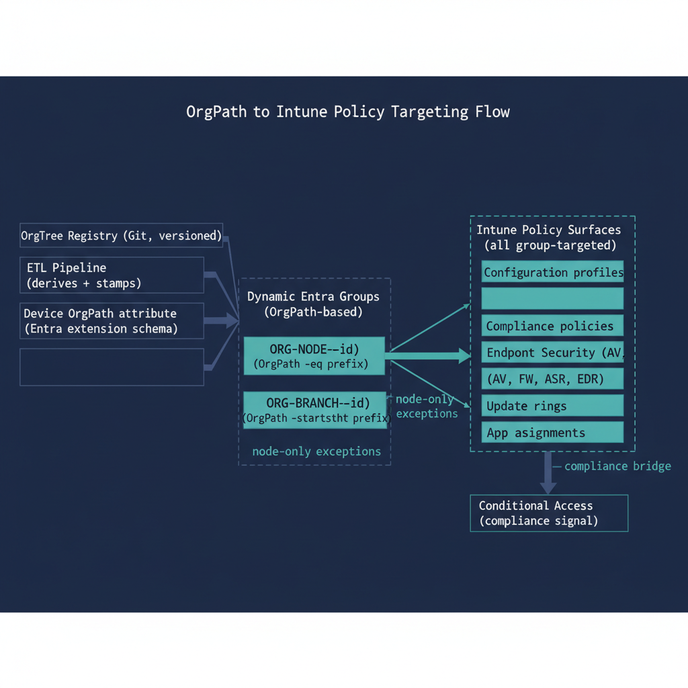

::: {.callout-note title="Authoritative canon"}
The substrate-internal canonical specification for OrgPath-driven Intune
targeting is [UIAO_011 — OrgPath in Intune & Device Governance](https://github.com/WhalerMike/uiao/blob/main/src/uiao/canon/UIAO_011_OrgPath_in_Intune_and_Device_Governance.md),
which wraps [ADR-036](https://github.com/WhalerMike/uiao/blob/main/src/uiao/canon/adr/adr-036-dynamic-group-provisioning.md)
and [ADR-039](https://github.com/WhalerMike/uiao/blob/main/src/uiao/canon/adr/adr-039-policy-targeting.md)
plus [`canon/data/orgpath/policy-targets.yaml`](https://github.com/WhalerMike/uiao/blob/main/src/uiao/canon/data/orgpath/policy-targets.yaml).
This chapter is the customer-facing narrative; the canon doc is the
operator/spec reference.
:::

## Chapter 2 — Node Groups and Branch Groups: The Foundation of Structural Intune Targeting

### 2.1 The Two-Group Pattern

### 2.2 Naming Convention

### 2.3 Dynamic Membership Rule Syntax

### 2.4 New-OrgPathDeviceGroupLibrary.ps1

## Chapter 3 — Assigning Every Intune Policy Surface to the Right Group

### 3.1 The Targeting Principle

### 3.2 Configuration Profile Targeting

### 3.3 Compliance Policy Targeting

### 3.4 Endpoint Security Policy Targeting

### 3.5 Update Ring Targeting

## Chapter 4 — Getting OrgPath Right at Zero Touch: Enrollment Integration

### 4.1 The Autopilot OrgPath Challenge

### 4.2 Strategy One: User-Derivation During Enrollment

### 4.3 Strategy Two: Hardware Hash Mapping for Shared Devices

## Chapter 5 — Organizational-Position-Aware Device Posture Enforcement

### 5.1 What the Bridge Achieves

### 5.2 The Combined Policy Pattern

### 5.3 Programmatic Compliance Policy Creation

## Chapter 6 — Extending the ETL Pipeline: Intune-Specific Post-Stamp Operations

### 6.1 What Changes When Intune Is in Scope

### 6.2 The Post-Stamp Pipeline Extension Script

## Chapter 7 — Aligning Intune Administration Boundaries with OrgPath

### 7.1 Scope Tags and Their Relationship to OrgPath

### 7.2 Scope Tag Naming and Creation

### 7.3 Scope Tag Assignment Script

## Chapter 8 — Monitoring Device Compliance Through the Organizational Lens

### 8.1 What OrgPath Adds to Intune Compliance Reporting

### 8.2 Query 1: Compliance by OrgPath

### 8.3 Query 2: Unpositioned and Mismatched Devices

### 8.4 Query 3: Compliance Drift Trend

### 8.5 Operationalizing the Queries

## Chapter 9 — Implementation Order and Production Readiness

### 9.1 Rollout Sequence

### 9.2 Drift Detection Extensions

### 9.3 Series Closure

## Chapter 1 — The Missing Inheritance Layer in Intune Device Management

### The Structural Problem Intune Presents for Organizations That Have Built the OrgTree Substrate

### 1.1   The Structural Problem Intune Presents

Microsoft Intune is a mature and capable device management platform. Its policy model is comprehensive: configuration profiles covering the full Settings Catalog, Administrative Templates that mirror Group Policy preferences, custom OMA-URI profiles for settings not yet surfaced in the UI, endpoint security policies for antivirus, firewall, attack surface reduction, account protection, and endpoint detection and response, compliance policies that evaluate device health against an organizational standard, application deployments for Win32, Microsoft Store, and line-of-business packages, and update rings that stage Windows Update for Business delivery across the device population. Across every dimension of Windows device governance that a mature enterprise requires, Intune has a policy instrument for it.

What Intune lacks, entirely and by design, is any native concept of organizational structure. This is not an oversight or a gap that a product update will close. It is a consequence of the architectural assumptions Intune was built on: devices are managed as individuals or as collections, collections are groups, and groups are either static or dynamic. No policy inherits from any other policy. No group contains another group in a way that causes policy to flow downward from a parent group to its children. No Intune policy surface has an equivalent to the Group Policy OU linkage model that caused a policy linked to a parent OU to apply automatically to every object in every child OU beneath it.

The practical consequence of this gap for an organization that has built the OrgTree and OrgPath substrate is stark. The OrgTree represents the organization as a hierarchy of nodes — divisions, departments, units, and sub-units — and the governance team's intent is that policy should cascade through that hierarchy the same way that Active Directory Group Policy cascaded through the OU hierarchy in the domain-joined model. A security baseline defined at the division level should apply to every device in every department and unit beneath that division. A configuration profile that establishes department-specific settings should apply to every device in every unit within that department. A site-specific network profile should apply to every device at every unit located at that site.

In Intune, without OrgPath, achieving this requires manual construction. If an organization has forty-two organizational units in its OrgTree and wants to apply a division-level security baseline that cascades to all units below the division node, the administrator must manually populate a group with devices from all forty-two units. When a new unit is added to the OrgTree, the administrator must manually add a representation of that unit's devices to the group. When a device is reassigned from one unit to another, the administrator must manually remove it from the old group and add it to the new one. When a department is reorganized and three units move from one division to another, the administrator must update every group that expressed the old organizational structure. The manual maintenance burden is not merely inconvenient — it is structurally incompatible with a governance model that is supposed to be deterministic, auditable, and driven by the OrgTree registry as its single source of truth.

There is an additional problem beyond maintenance burden. Groups maintained manually are not auditable in any meaningful sense. A static group's membership may have been correct when it was created and wrong six months later due to device assignments that occurred through channels that did not update the group. A compliance policy assigned to a manually maintained group may be applying to a device population that no longer reflects the intended organizational scope. The governance team cannot detect this drift without a separate reconciliation process, and reconciliation against a manually maintained group is itself a manual process. The structural integrity of the governance model depends on the membership of every group being derivable from the OrgTree registry — and that derivability is possible only if group membership is defined by a rule that evaluates the OrgPath attribute, not by a list of device objects that someone last updated at some undetermined point in the past.

### 1.2   What OrgPath Changes About the Intune Model

OrgPath changes the nature of device groups in Entra ID from collections to structural expressions. Because the Part Four ETL pipeline stamped the OrgPath schema extension attribute on every device object as part of its enrollment-time processing, every managed device already carries its organizational position as a machine-readable, queryable attribute directly on the directory object. That attribute is readable by the Entra ID dynamic group membership evaluation engine. A dynamic group whose membership rule evaluates the OrgPath attribute will automatically contain every device whose OrgPath value satisfies the rule — and that membership is maintained in real time by Entra ID itself, not by any manual process.

When a device is reassigned from one unit to another, the ETL pipeline updates its OrgPath value. Within minutes of that update, the dynamic group membership engine re-evaluates the device's group memberships. The device leaves every group whose rule no longer matches its new OrgPath and joins every group whose rule now matches. No administrator touches any group. No pipeline step explicitly removes or adds the device to any group. The group memberships are a pure function of the OrgPath value and the membership rules, and both of those are under version-controlled governance control.

The combination of OrgPath stamped on device objects and a properly designed dynamic group library restores to Intune the structural inheritance that Active Directory's OU model provided through Group Policy linkage. A policy assigned to a group whose membership rule matches all devices in a division will automatically apply to every device in every unit beneath that division, because every one of those devices carries an OrgPath value that satisfies the rule. When a new unit is added to the OrgTree beneath the division, devices enrolled in that unit receive OrgPath values that satisfy the division-level group rule, and those devices automatically receive the division-level policy without any policy assignment change. The OrgTree registry drives group membership, group membership drives policy targeting, and policy targeting is therefore a deterministic extension of the organizational structure defined in the registry.

::: {.callout-note title="Critical Prerequisite"}
All implementation steps in this document assume that the OrgPath schema extension has been registered in the Entra ID tenant, that the ETL pipeline from Part Four is stamping OrgPath on device objects, and that the OrgTree registry JSON file is current and accessible to the automation service account. None of the scripts in this document will function correctly if OrgPath is not present on device objects.
:::

### 1.3   Architecture Overview for This Document

This document builds the Intune integration layer of the OrgPath governance model in a sequence of eight chapters, each addressing a specific component of the integration. The sequence is designed so that each chapter's output is a prerequisite for the next: Chapter Two must complete before Chapter Three can be executed correctly, and so on through Chapter Nine.

Chapter Two creates the dynamic device group library — the node and branch group pattern that expresses every node in the OrgTree as a pair of Entra ID dynamic security groups with membership rules that evaluate the OrgPath attribute. These groups are the universal targeting mechanism for every Intune policy surface. Chapter Three covers Intune policy targeting: how each policy surface in Intune — configuration profiles, compliance policies, endpoint security policies, application deployments, and update rings — maps to the group library, and what the correct targeting decision is for each. Chapter Four covers Autopilot enrollment integration: the specific challenge of stamping OrgPath on a device during Autopilot provisioning, before the device has completed enrollment, so that it enters the governance model correctly positioned from its first policy evaluation cycle. Chapter Five covers the Compliance and Conditional Access bridge: the pattern through which OrgPath-derived compliance policies become the device posture signal in organizationally contextual Conditional Access rules, so that the compliance standard a device is evaluated against reflects its organizational position. Chapter Six covers the pipeline extension: the additional operations the Part Four ETL pipeline must execute after stamping OrgPath, specifically requesting a device policy sync and updating the Intune device category to match the OrgTree node type. Chapter Seven covers scope tag administration delegation: the mapping of OrgPath segments to Intune scope tags for administrative boundary enforcement, so that divisional and departmental IT administrators can manage exactly their segment's devices and policies. Chapter Eight covers KQL dashboards: the Sentinel and Log Analytics queries that surface OrgPath-aware device compliance visibility, enabling the governance team to answer organizational questions about device posture that the native Intune compliance dashboard cannot answer. Chapter Nine covers the rollout sequence and operational notes for production deployment.

{#fig-05-orgpath-and-intune-diagram-01 fig-alt="On the far left, three sequential boxes: OrgTree Registry (Git, versioned) → ETL Pipeline (derives + stamps) → Device OrgPath attribute (Entra extension schema). The Device OrgPath attribute fans rightward into a labeled group containing two dynamic group rows: ORG-NODE-{id} (OrgPath -eq prefix) and ORG-BRANCH-{id} (OrgPath -startsWith prefix). The Branch group fans rightward into a second labeled cluster \"Intune policy surfaces (all group-targeted)\" containing five boxes arranged vertically: Configuration profiles, Compliance policies, Endpoint Security (AV, FW, ASR, EDR), Update rings, App assignments. A dashed arrow from the Node group to Configuration profiles labeled \"node-only exceptions\". A separate downstream box \"Conditional Access (compliance signal)\" receives a single arrow from Compliance policies, indicating the bridge from device compliance into CA evaluation. Engineering blueprint style, monospace group names, federal navy (#1F3A5F) for substrate stages and teal (#1A9E8F) for Intune surfaces, 16:9 landscape." width="85%"}

## Chapter 2 — The Dynamic Device Group Library

### Node Groups and Branch Groups — The Foundation of Structural Intune Targeting

### 2.1   The Two-Group Pattern

For each node in the OrgTree, the governance pipeline creates two dynamic security groups in Entra ID. These two groups serve different and complementary purposes, and understanding the distinction between them is essential before any policy assignment decisions are made.

The first group is the **node group**. The node group contains every device whose OrgPath value exactly equals the path of that node. These are devices assigned precisely to that organizational unit and no others. A device in the Finance department whose OrgPath is /Root/Finance is in the Finance node group. A device in the Finance Accounts Payable unit whose OrgPath is /Root/Finance/AccountsPayable is not in the Finance node group — it is in the Accounts Payable node group. The node group is used for policies that must apply to one specific unit without cascading downward to subordinate units. This is the exception case, not the rule.

The second group is the **branch group**. The branch group contains every device whose OrgPath value either exactly equals the path of that node or begins with the node path followed by the path delimiter. This means the branch group contains the node group's population plus every device in every organizational unit descended from the node in the hierarchy. A device in /Root/Finance/AccountsPayable is in the Finance branch group. A device in /Root/Finance/AccountsPayable/Invoicing is also in the Finance branch group. The branch group is the correct targeting choice for the vast majority of Intune policies because it replicates the inheritance behavior of Group Policy Object linkage to an OU in Active Directory. A policy assigned to the Finance branch group applies to every Finance device at every level of the Finance subtree, including units not yet created at the time the policy is assigned.

The two-group pattern is not optional. Creating only one group type for each node destroys either the cascading behavior (if only node groups are created) or the unit-specific targeting capability (if only branch groups are created). The governance pipeline creates both groups for every active node in the OrgTree registry, even for leaf nodes where the branch group and the node group will initially have identical membership. Leaf node branch groups will diverge from their corresponding node groups if subordinate units are added beneath the leaf in the future, and having the branch group pre-created means no policy assignment changes are needed when that happens.

### 2.2   Naming Convention

Node groups are named ORG-NODE-{NodeId} where NodeId is the unique identifier of the node from the OrgTree registry. Branch groups are named ORG-BRANCH-{NodeId}. The NodeId is the same identifier used in the OrgTree registry's nodes array — typically a short alphanumeric slug that is stable across renames of the organizational unit itself (since organizational units can be renamed without changing their structural position in the hierarchy).

This naming convention is deterministic and reversible in both directions. Given a group name, the NodeId can be recovered by stripping the ORG-NODE- or ORG-BRANCH- prefix. Given a NodeId, both group names can be constructed without any additional directory lookup. The governance pipeline uses this convention exclusively and never creates device groups with ad-hoc names outside this scheme. Any Intune policy found to be assigned to a group whose name does not match the ORG-NODE-\* or ORG-BRANCH-\* pattern is flagged in the daily drift detection report as a governance exception, because its assignment target is not managed by the pipeline and may have drifted from the intended organizational scope.

::: {.callout-note title="Why NodeId, Not NodeName?"}
Group names are based on NodeId rather than NodeName because organizational units are frequently renamed. If groups were named after the unit's display name, a departmental rename would require renaming the group, which would invalidate any Intune policy assignments, Conditional Access policy references, or RBAC role assignments that reference the group by name. NodeId is assigned once when the node is created in the registry and never changes, making it safe to use as a durable identifier in group names and all downstream references.
:::

### 2.3   Dynamic Membership Rule Syntax

The dynamic membership rules for both group types use the OrgPath schema extension attribute name, which is constructed from the Application ID of the Entra ID app registration that owns the OrgPath schema extension. Entra ID schema extension attribute names take the form extension\_{AppIdWithoutHyphens}\_{AttributeName}. The Application ID used when defining the schema extension in Part Three is used here, with all hyphens removed from the GUID. This is the same App ID used in the Part Four ETL pipeline when stamping OrgPath values, and it must be consistent across all components of the governance model.

Using the Finance division node as the concrete example, where the Finance node's OrgPath is /Root/Finance and the App ID (hyphens removed) is the tenant-specific value substituted into every script in this document, the node group membership rule is:

```
(device.extension_{AppIdWithoutHyphens}_OrgPath -eq "/Root/Finance")
```

The branch group membership rule for the same node, which covers the Finance node itself and every organizational unit at any depth beneath it, is:

```
(device.extension_{AppIdWithoutHyphens}_OrgPath -eq "/Root/Finance")
    -or
(device.extension_{AppIdWithoutHyphens}_OrgPath -startsWith "/Root/Finance/")
```

The trailing slash in the -startsWith clause of the branch group rule is critical and must not be omitted. Without the trailing slash, a branch group for /Root/Finance would incorrectly include devices whose OrgPath begins with /Root/FinanceAdjacent or any other path that starts with the string /Root/Finance but represents a different organizational unit. The trailing slash ensures that the match is structural — it matches only paths that are genuinely subordinate to the Finance node in the hierarchy.

In both rules, {AppIdWithoutHyphens} must be substituted with the Application ID of the Entra ID app registration used to define the OrgPath schema extension, with all hyphens removed. The script in Section 2.4 constructs this substitution programmatically from the \$OrgPathAppId parameter, so the raw GUID with hyphens is the only value that needs to be supplied as input. The script derives the hyphen-free form automatically.

### 2.4   New-OrgPathDeviceGroupLibrary.ps1

The following script creates and maintains the full dynamic device group library. It is named New-OrgPathDeviceGroupLibrary.ps1 and is stored in the governance repository under governance/intune/groups/. It runs as a pipeline step immediately after any change to the OrgTree registry is committed and validated. The script is designed to be fully idempotent: running it multiple times against the same registry state produces the same result as running it once, and it never creates duplicate groups or corrupts existing groups whose membership rules are already correct.

```powershell
<# data-id="133"
.SYNOPSIS
    Creates and maintains the OrgPath dynamic device group library in Entra ID.

.DESCRIPTION
    Reads the OrgTree registry and ensures that every active node has both a
    node group and a branch group with the correct dynamic membership rules.
    Creates missing groups, updates stale membership rules, and archives groups
    for nodes that have been removed from the registry.

.PARAMETER OrgTreeRegistryPath
    Local path to the OrgTree registry JSON file, checked out from the
    governance repository before this script runs.
    Example: "C:\governance\orgtree\registry.json"

.PARAMETER OrgPathAppId
    The Application ID (with hyphens) of the Entra ID app registration that
    owns the OrgPath schema extension. Used to construct the extension attribute
    name in dynamic membership rules.
    Example: "a1b2c3d4-e5f6-a1b2-c3d4-e5f6a1b2c3d4"
    Substitute your tenant's actual App ID for this value.

.PARAMETER WhatIf
    When set, reports what would be created or updated without making changes.

.NOTES
    Requires Microsoft.Graph PowerShell SDK 2.x or later.
    Required Graph permission scopes: Group.ReadWrite.All, Directory.ReadWrite.All
    Run under the automation service account (Managed Identity preferred in CI/CD).
    PowerShell 7.4 or later recommended.
    This script is safe to run on every OrgTree change — it will not create
    duplicate groups or overwrite correct membership rules unnecessarily.
#>
param(
    [string] $OrgTreeRegistryPath = "C:\governance\orgtree\registry.json",
    # Substitute with your tenant's OrgPath app registration Application ID (with hyphens):
    [string] $OrgPathAppId        = "a1b2c3d4-e5f6-a1b2-c3d4-e5f6a1b2c3d4",
    [switch] $WhatIf
)

Set-StrictMode -Version Latest
$ErrorActionPreference = "Stop"

# --- Build the extension attribute name from the App ID ---
# Entra ID schema extension names require the App ID with NO hyphens.
# This derivation must match exactly what was used in the Part Four ETL pipeline.
$appIdNoHyphens    = $OrgPathAppId -replace "-", ""
$extensionAttrName = "extension_${appIdNoHyphens}_OrgPath"

Write-Host "[$(Get-Date -f 'HH:mm:ss')] Extension attribute name: $extensionAttrName"

# --- Authentication ---
# In production CI/CD pipelines, replace with Managed Identity or
# certificate-based authentication. Do not use interactive browser auth
# in unattended automation contexts.
Connect-MgGraph -Scopes "Group.ReadWrite.All", "Directory.ReadWrite.All" -NoWelcome

# --- Load OrgTree Registry ---
$registry    = Get-Content -Path $OrgTreeRegistryPath -Raw | ConvertFrom-Json
$activeNodes = $registry.nodes | Where-Object { $_.Status -eq "Active" }
Write-Host "[$(Get-Date -f 'HH:mm:ss')] OrgTree loaded: $($activeNodes.Count) active nodes."

# --- Load Existing ORG-NODE and ORG-BRANCH Groups ---
# This retrieves ALL governance-managed device groups in a single batched call
# rather than querying per-node, which is significantly more efficient for
# large OrgTrees with hundreds of nodes.
$existingGroups = Get-MgGroup `
    -Filter "startsWith(displayName,'ORG-NODE-') or startsWith(displayName,'ORG-BRANCH-')" `
    -All `
    -Property "Id,DisplayName,MembershipRule,Description"

# Index existing groups by display name for O(1) lookup during the sync loop.
$groupIndex = @{}
foreach ($g in $existingGroups) { $groupIndex[$g.DisplayName] = $g }

Write-Host "[$(Get-Date -f 'HH:mm:ss')] Existing governance groups found: $($existingGroups.Count)"

# --- Helper: Build Node Group Membership Rule ---
# Returns the rule that matches ONLY devices assigned exactly to this node.
function Build-NodeRule {
    param([string]$NodePath, [string]$ExtAttr)
    return "(device.${ExtAttr} -eq `"${NodePath}`")"
}

# --- Helper: Build Branch Group Membership Rule ---
# Returns the rule that matches devices at this node OR any descendant node.
# The trailing slash in the -startsWith clause is mandatory — see Section 2.3.
function Build-BranchRule {
    param([string]$NodePath, [string]$ExtAttr)
    return "(device.${ExtAttr} -eq `"${NodePath}`") " +
           "-or (device.${ExtAttr} -startsWith `"${NodePath}/`")"
}

# --- Helper: Create or Update a Dynamic Device Group ---
# This function is the core idempotency mechanism. It checks existence and
# rule correctness before making any write calls to the Graph API.
function Sync-DeviceGroup {
    param(
        [string]    $DisplayName,
        [string]    $MembershipRule,
        [string]    $Description,
        [hashtable] $GroupIndex,
        [switch]    $WhatIf
    )

    if ($GroupIndex.ContainsKey($DisplayName)) {
        $existing = $GroupIndex[$DisplayName]
        if ($existing.MembershipRule -ne $MembershipRule) {
            # Rule has drifted — update it.
            if ($WhatIf) {
                Write-Host "  [WHATIF] Would update rule for: $DisplayName"
                Write-Host "    Old rule: $($existing.MembershipRule)"
                Write-Host "    New rule: $MembershipRule"
            } else {
                Update-MgGroup -GroupId $existing.Id -MembershipRule $MembershipRule
                Write-Host "  [UPDATED] $DisplayName"
            }
        } else {
            # Rule is correct. No action needed.
            Write-Host "  [OK]      $DisplayName (rule current, no change)"
        }
    } else {
        # Group does not yet exist — create it.
        if ($WhatIf) {
            Write-Host "  [WHATIF] Would create: $DisplayName"
        } else {
            # MailNickname must be unique. Strip non-alphanumeric characters.
            # The ORG-NODE- and ORG-BRANCH- prefixes contain hyphens which are removed here.
            $mailNick = $DisplayName -replace "[^a-zA-Z0-9]", ""

            $params = @{
                DisplayName                        = $DisplayName
                Description                        = $Description
                MailEnabled                        = $false
                MailNickname                       = $mailNick
                SecurityEnabled                    = $true
                GroupTypes                         = @("DynamicMembership")
                MembershipRule                     = $MembershipRule
                MembershipRuleProcessingState      = "On"
            }
            $null = New-MgGroup -BodyParameter $params
            Write-Host "  [CREATED] $DisplayName"
        }
    }
}

# --- Main Loop: Synchronize Groups for Every Active OrgTree Node ---
foreach ($node in $activeNodes) {
    $nodeGroupName   = "ORG-NODE-$($node.Id)"
    $branchGroupName = "ORG-BRANCH-$($node.Id)"

    # Build membership rules for this node.
    $nodeRule   = Build-NodeRule   -NodePath $node.Path -ExtAttr $extensionAttrName
    $branchRule = Build-BranchRule -NodePath $node.Path -ExtAttr $extensionAttrName

    Write-Host ""
    Write-Host "Node: $($node.Id) | Name: $($node.Name) | Path: $($node.Path)"

    Sync-DeviceGroup `
        -DisplayName    $nodeGroupName `
        -MembershipRule $nodeRule `
        -Description    "OrgPath node group — devices assigned exactly to $($node.Name) [$($node.Path)]" `
        -GroupIndex     $groupIndex `
        -WhatIf:$WhatIf

    Sync-DeviceGroup `
        -DisplayName    $branchGroupName `
        -MembershipRule $branchRule `
        -Description    "OrgPath branch group — devices at $($node.Name) and all descendant units [$($node.Path)]" `
        -GroupIndex     $groupIndex `
        -WhatIf:$WhatIf
}

Write-Host ""
Write-Host "=== Device Group Library Synchronization Complete ==="
Write-Host "    Active nodes processed : $($activeNodes.Count)"
Write-Host "    Groups before sync     : $($existingGroups.Count)"
Write-Host "    Run timestamp (UTC)    : $(Get-Date -f 'o')"

Disconnect-MgGraph
```

The script's processing logic deserves detailed attention because several of its decisions are not obvious from reading the code alone. The extension attribute name is constructed from the App ID by removing hyphens and prepending the extension\_ prefix and appending the attribute name — this is the format Entra ID uses internally for all schema extension attributes, and the dynamic group membership rule must use exactly this format or the rule will evaluate as invalid and the group will have zero members regardless of how many devices carry an OrgPath value. The App ID used here must be the same one used in the Part Four ETL pipeline when stamping OrgPath values; using a different App ID produces a different extension attribute name and the group rule will never match anything in the directory.

The bulk retrieval of existing groups using the startsWith filter is a deliberate efficiency choice. An alternative implementation would query for each group individually within the node loop, but that produces one Graph API call per node per group type — two calls per node, and potentially hundreds of calls for a large OrgTree. Retrieving all governance-managed groups in a single batched operation and then using an in-memory hashtable for lookup reduces the API call count dramatically and avoids throttling on tenants with large group directories.

The Sync-DeviceGroup function's rule comparison check — comparing the stored rule against the computed rule before issuing an update — is the mechanism that makes the script safe to run repeatedly. Without this check, every pipeline execution would issue an unnecessary update call for every group, which would trigger Entra ID's dynamic membership engine to re-evaluate membership for every group on every run, creating unnecessary processing load and audit log noise. With the check, the engine is triggered only when a rule genuinely changes, which occurs only when the OrgTree registry changes in a way that affects a node's path.

## Chapter 3 — Intune Policy Targeting with OrgPath Groups

### Assigning Every Intune Policy Surface to the Right Group

### 3.1   The Targeting Principle

Every Intune policy in the governance model is assigned to one or more OrgPath-derived groups — never to manually maintained static groups, never to all-device groups unless the policy genuinely applies to every device in the organization without exception, and never to individual devices outside of documented emergency remediation scenarios. This constraint is not merely a preference: it is the rule that makes the governance model auditable. If a policy can be assigned to groups outside the ORG-NODE-\* and ORG-BRANCH-\* scheme, then the pipeline cannot determine the effective scope of any policy by inspecting the registry, and the deterministic relationship between the OrgTree and the device governance model breaks down.

The branch group is the default assignment target for any policy that should apply to an organizational segment and cascade downward to all subordinate units. The node group is the exception assignment target, used only when a policy must apply to exactly one unit without cascading. The governance team documents the rationale for every node group assignment in the governance repository's policy assignment manifest, because node group assignments represent organizational specificity that should be periodically reviewed — the condition that required a unit-specific policy may resolve over time, and the policy may then become a candidate for promotion to the branch level.

### 3.2   Configuration Profile Targeting

Configuration profiles represent the largest volume of Intune policy assignments and the closest analogue to Group Policy in the OrgPath governance model. Settings Catalog profiles, Administrative Templates, custom OMA-URI profiles, certificate profiles, and email profiles all belong to this category. Every configuration profile in the library is assigned to at least one branch group. The assignment level — which branch group — depends on the intended scope of the profile's settings.

A profile that enforces a division-wide security baseline — BitLocker drive encryption, Windows Defender Antivirus real-time protection, audit policy settings, and SmartScreen configuration — is assigned to the division-level branch group. Every device in every department and unit beneath the division receives this profile. A profile that configures a department-specific VPN connection, including the VPN server address, authentication method, and traffic routing rules for that department's network segment, is assigned to the department-level branch group. Only devices in that department and its subordinate units receive the VPN profile. A profile that establishes a site-specific Wi-Fi connection, with an SSID and credential appropriate for a particular physical location, is assigned to the site-level branch group, which may span multiple divisions or departments if the site contains mixed organizational populations.

The cascade behavior that results from this assignment pattern mirrors Group Policy inheritance precisely. A device enrolled in a unit that sits beneath both a division and a department in the OrgTree receives the division-level profile because it is in the division branch group, the department-level profile because it is in the department branch group, and any unit-level profile assigned to its specific unit's branch group. Settings from these profiles are evaluated according to Intune's conflict resolution rules — for most settings, the last-applied value wins when profiles conflict, with the exception of settings governed by endpoint security policies, which follow their own conflict resolution logic discussed in Section 3.4.

The governance pipeline maintains a policy assignment manifest at governance/intune/policy-assignments.json that records every configuration profile and its assigned group. This manifest is the authoritative record of the intended assignment state. A pipeline step that runs after every OrgTree change reads the manifest and reconciles the actual assignment state in Intune against the intended state, flagging any deviation as drift. This reconciliation is the mechanism that prevents assignment drift from accumulating silently through manual portal changes.

### 3.3   Compliance Policy Targeting and Programmatic Assignment

Compliance policies determine whether a device is considered compliant, which feeds Conditional Access grant controls and therefore directly governs whether a user can access organizational resources from that device. Every compliance policy in the governance model is assigned to a branch group. The governance team faces one critical design decision when laying out compliance policies: whether to maintain a single organization-wide baseline compliance policy or to maintain differentiated compliance policies for organizational segments with different security requirements.

The OrgPath model supports both approaches and allows them to coexist. A single baseline compliance policy that expresses the organization's minimum acceptable device posture is assigned to the root-level branch group, which contains every managed device in the organization. Supplementary compliance policies for high-security organizational segments — executive leadership, financial data processing, security operations, and any other segment with elevated data classification — are assigned to their respective branch groups. A device in the Finance division is covered by both the baseline compliance policy and the Finance segment compliance policy. Intune evaluates a device as compliant only if it satisfies all applicable compliance policies. If the Finance segment policy requires a stricter BitLocker encryption standard than the baseline, the device must meet the stricter standard to be marked compliant, even though both policies apply.

Intune policy assignments made through the portal are not version-controlled, not auditable in the governance repository, and will drift from the intended assignment state over time as administrators make manual changes. The governance pipeline must manage all compliance policy assignments through the Graph API. The following script establishes the pattern for programmatic compliance policy assignment and is called by the pipeline whenever a new compliance policy is introduced or an existing assignment needs to change:

```powershell
<# data-id="159"
.SYNOPSIS
    Assigns an Intune compliance policy to an OrgPath branch group via Graph API.

.DESCRIPTION
    Used by the governance pipeline to ensure that compliance policy assignments
    are managed programmatically and match the OrgTree registry rather than
    being configured manually through the Intune portal.
    This script is idempotent: re-running it with the same parameters produces
    the same assignment state without creating duplicate assignments.

.PARAMETER PolicyId
    GUID of the target Intune compliance policy.
    Retrieve via: Get-MgDeviceManagementDeviceCompliancePolicy -All |
                  Where-Object { $_.DisplayName -eq "Your Policy Name" }

.PARAMETER GroupId
    GUID of the ORG-BRANCH-{NodeId} group to assign the policy to.
    Retrieve via: Get-MgGroup -Filter "displayName eq 'ORG-BRANCH-{NodeId}'"

.NOTES
    Required Graph scope: DeviceManagementConfiguration.ReadWrite.All
    Assignment is a POST to the /assign endpoint. This replaces ALL existing
    assignments on the policy with the assignments specified in the body.
    If the policy should be assigned to multiple branch groups, pass all group
    IDs in the same call rather than calling this script multiple times.
    Calling /assign multiple times with different groups will overwrite the
    previous call's assignments.
#>
param(
    [Parameter(Mandatory=$true)]
    [string]$PolicyId,   # GUID of the target Intune compliance policy

    [Parameter(Mandatory=$true)]
    [string[]]$GroupIds  # One or more ORG-BRANCH-{NodeId} group GUIDs
)

Connect-MgGraph -Scopes "DeviceManagementConfiguration.ReadWrite.All" -NoWelcome

# Build the assignments array with one entry per group.
# The @odata.type for a standard included group assignment is:
#   #microsoft.graph.groupAssignmentTarget
# For excluded groups, use: #microsoft.graph.exclusionGroupAssignmentTarget
$assignmentTargets = $GroupIds | ForEach-Object {
    @{
        target = @{
            "@odata.type" = "#microsoft.graph.groupAssignmentTarget"
            groupId       = $_
        }
    }
}

$assignmentBody = @{
    assignments = @($assignmentTargets)
}

# POST to the /assign action. This is a full replace, not an additive merge.
Invoke-MgGraphRequest `
    -Method      POST `
    -Uri         "https://graph.microsoft.com/v1.0/deviceManagement/deviceCompliancePolicies/$PolicyId/assign" `
    -Body        ($assignmentBody | ConvertTo-Json -Depth 10) `
    -ContentType "application/json"

Write-Host "Compliance policy '$PolicyId' assigned to $($GroupIds.Count) group(s):"
$GroupIds | ForEach-Object { Write-Host "  - $_" }

Disconnect-MgGraph
```

One behavioral detail of the Graph API /assign endpoint warrants emphasis: it performs a full replace of all existing assignments, not an additive merge. Calling the endpoint with a single group ID when the policy was previously assigned to three groups will result in the policy being assigned to only one group after the call. The governance pipeline must always supply the complete intended assignment list for a policy when calling this endpoint, which is why the policy assignment manifest is the authoritative record — the pipeline reads the full intended assignment state for each policy from the manifest and passes the complete list in every assignment call.

### 3.4   Endpoint Security Policy Targeting

Endpoint security policies cover antivirus settings, firewall rules, attack surface reduction rules, account protection policies, and endpoint detection and response configuration. These policies follow the same branch group targeting pattern as configuration profiles and compliance policies: each policy is assigned to the branch group that corresponds to the organizational scope it is intended to cover. A firewall rule set that applies to all devices in the organization is assigned to the root branch group. A stricter attack surface reduction configuration for the security operations division is assigned to the security operations division's branch group.

Endpoint security policies have one important behavioral difference from configuration profiles that the governance team must account for during policy design. When a device receives settings from multiple endpoint security policies assigned to overlapping branch groups — as will happen for any device that is in both the root branch group and a division-level branch group — the conflict resolution behavior is not uniform across setting categories. For most endpoint security settings, the more restrictive value wins when two policies specify conflicting values. For some settings, the most recently applied policy wins. For a small number of settings, a merge occurs: values from multiple policies are combined rather than one winning over the other. The Intune documentation for each endpoint security profile type specifies the conflict behavior for each setting category, and the governance team must review this documentation when designing layered endpoint security policies.

The diagnostic instrument for verifying effective endpoint security configuration is the Get-MgDeviceManagementManagedDeviceConfigurationState cmdlet, which retrieves the applied configuration state — including the applied value and the policy that supplied it — for a specific managed device. The governance team should run this cmdlet against representative devices in each organizational segment after the policy library is deployed and during periodic governance audits to verify that the layered policy application produces the intended result rather than a conflict-resolution outcome that deviates from the design intent.

### 3.5   Update Ring Targeting

Windows Update for Business update rings are the most naturally suited Intune policy type for branch group targeting, because the primary use case for update rings — staged rollout by organizational segment to validate compatibility before broad deployment — maps directly and exactly to the OrgTree hierarchy. A well-designed update ring library in the OrgPath model has three to four rings with progressively broader organizational coverage.

The Targeted ring is assigned to a specific technology unit's node group: the devices operated by engineers, developers, and systems administrators who have the expertise and tolerance for compatibility issues to serve as the earliest validators of a new Windows build. Because it is a node group assignment, only devices in that specific unit receive updates immediately. The Pilot ring is assigned to a specific department-level branch group selected for its organizational diversity and its members' technical literacy: it covers a meaningful cross-section of device configurations and applications without exposing the entire division to a potentially incompatible update. The Broad ring is assigned to the root-level branch group, which covers every managed device in the organization. Devices in the Broad ring receive updates only after the Targeted and Pilot rings have completed their validation waves without triggering a rollback or a pause. The ring assignments can optionally include a deadline-and-grace-period configuration that ensures devices in the Broad ring do not defer updates indefinitely if users repeatedly dismiss update prompts.

The branch group targeting of the Broad ring has a particularly valuable operational property: new organizational units added to the OrgTree automatically receive the Broad ring's update cadence without any update ring assignment change. A device enrolled in a newly created department is in the root branch group from the moment its OrgPath is stamped, and therefore immediately in scope for the Broad ring update policy. The alternative — manually adding each new organizational unit's devices to the Broad ring's assignment — creates the risk that new devices are orphaned from update governance until the assignment is made, which in practice can mean weeks of unmanaged Windows Update behavior.

## Chapter 4 — Autopilot Enrollment and OrgPath Stamping

### Getting OrgPath Right at Zero Touch — Enrollment Integration

### 4.1   The Autopilot OrgPath Challenge

In the steady-state operation of the governance model, OrgPath is stamped on device objects by the ETL pipeline after the device is enrolled and its organizational assignment is determined through the standard provisioning record. This post-enrollment stamping works correctly for devices that are already enrolled when the governance model is first deployed, and for devices enrolled through standard IT provisioning processes where the device is handed to the ETL pipeline before the user begins working on it. Autopilot presents a different and more constrained timing problem.

During Autopilot provisioning, the device must receive its OrgPath value before any user signs in and before the Enrollment Status Page (ESP) completes its device setup phase. This constraint exists because the dynamic group memberships that determine which configuration profiles, compliance policies, and endpoint security policies apply during enrollment all depend on OrgPath being present on the device object. Entra ID's dynamic group membership engine evaluates device objects against group membership rules continuously, but it can only evaluate the OrgPath attribute if the attribute has already been written to the device object. A device completing the ESP without an OrgPath value is evaluated by every dynamic group rule in the library and fails every rule — which means it is a member of no ORG-NODE-\* or ORG-BRANCH-\* group during the enrollment session, receives no organization-defined configuration profiles, and is evaluated by no compliance policy. It leaves the ESP in an ungoverned state.

The gap between the device object appearing in Entra ID (which happens early in Autopilot provisioning, when the device registers with the service using its hardware hash) and the ETL pipeline's next scheduled run may be hours. If Autopilot provisioning runs overnight or during a bulk deployment event, the ETL pipeline may not run until the following morning, by which point the device has already completed provisioning with incorrect policy coverage. The solution is to stamp OrgPath during the Autopilot provisioning session itself, using a script that runs during the ESP and writes OrgPath to the device object before configuration profile processing begins in earnest.

### 4.2   Strategy One — User-Derivation During Enrollment

The first strategy derives the device's OrgPath from the provisioning user's OrgPath. When a user is assigned as the primary user for a device during Autopilot provisioning, the device's appropriate organizational position is typically the same as the user's organizational position — both should map to the same OrgTree node. Because OrgPath is already stamped on user objects by the Part Four ETL pipeline, the device-side script can read the provisioning user's OrgPath attribute via the Graph API and write the same value to the device object. This strategy is appropriate for personally assigned devices where the device's organizational position is definitionally the position of its assigned user.

The script below is deployed as a PowerShell script in the Intune script library and associated with the Autopilot profile's enrollment status page. It runs during the Account Setup phase, at which point the provisioning user has authenticated and the device object exists in Entra ID. The script authenticates using a certificate-based service principal — the same service account identity used by the ETL pipeline — whose certificate is pre-provisioned on the device through a configuration profile applied during the Device Setup phase of the ESP.

```powershell
<# data-id="184"
.SYNOPSIS
    Stamps OrgPath on the device object during Autopilot provisioning
    by deriving the device's organizational position from the provisioning user.

.DESCRIPTION
    This script is deployed as a PowerShell script in Microsoft Intune and
    executed during the Autopilot enrollment status page (Account Setup phase).
    It authenticates as a governance service principal (certificate-based),
    reads the provisioning user's OrgPath extension attribute, and writes
    the same value to the device object.

    Deploy via: Intune > Devices > Scripts > Add > Windows 10 and later
      - Run this script using the logged-on credentials : No
        (Script runs as SYSTEM; certificate must be in the LocalMachine store)
      - Run script in 64-bit PowerShell host             : Yes
      - Enforce script signature check                   : Yes (sign before production deployment)

.NOTES
    The provisioning user account must have been assigned OrgPath by the
    ETL pipeline before Autopilot provisioning begins. If the user has no
    OrgPath, the device is stamped as /UNPOSITIONED and queued for review.

    The governance service principal requires the following Graph permissions:
      Device.ReadWrite.All   — to write OrgPath to the device object
      User.Read.All          — to read the provisioning user's OrgPath attribute

    The service principal's certificate must be available in the machine
    certificate store (LocalMachine\My) under the thumbprint specified below.
    Pre-provision the certificate via a PKCS certificate profile in Intune
    targeted to the Autopilot pre-provisioning device group.
#>

# --- Configuration: Substitute all values below for your environment ---

# The Application (client) ID of the governance service principal.
# This is the same App ID used by the Part Four ETL pipeline.
$OrgPathAppId    = "a1b2c3d4-e5f6-a1b2-c3d4-e5f6a1b2c3d4"  # SUBSTITUTE: Your App ID

# Your Entra ID tenant ID.
$TenantId        = "f1e2d3c4-b5a6-f1e2-d3c4-b5a6f1e2d3c4"  # SUBSTITUTE: Your Tenant ID

# Thumbprint of the governance service principal's certificate,
# pre-provisioned into the LocalMachine\My certificate store.
$ClientCertThumb = "AABBCCDDEEFF112233445566778899AABBCCDDEE" # SUBSTITUTE: Your cert thumbprint

# --- Derive extension attribute names from App ID ---
$appIdNoHyphens    = $OrgPathAppId -replace "-", ""
$userOrgPathAttr   = "extension_${appIdNoHyphens}_OrgPath"
$deviceOrgPathAttr = "extension_${appIdNoHyphens}_OrgPath"

# --- Authenticate to Graph using certificate-based service principal ---
# This avoids storing client secrets on the device and survives offline re-enrollment.
try {
    Connect-MgGraph `
        -ClientId              $OrgPathAppId `
        -TenantId              $TenantId `
        -CertificateThumbprint $ClientCertThumb `
        -NoWelcome
} catch {
    Write-Error "Authentication to Microsoft Graph failed: $_"
    exit 1
}

# --- Determine the provisioning user's UPN ---
# During the Autopilot Account Setup phase, the signed-in user is the provisioning user.
# Get-MgContext returns the identity of the current Graph session.
# Because this script runs as SYSTEM with a service principal, we need to
# identify the provisioning user from the Windows session instead.
$currentUserUPN = (Get-WmiObject -Class Win32_ComputerSystem).UserName
# Strip the domain prefix if present (DOMAIN\username format)
if ($currentUserUPN -like "*\*") {
    $currentUserUPN = $currentUserUPN.Split("\")[1]
}
# If UPN lookup fails, query Entra ID for the user based on the signed-in account.
# In practice, supplement this with the Intune enrollment user API if needed.
if (-not $currentUserUPN) {
    Write-Error "Could not determine provisioning user UPN. Cannot derive OrgPath."
    Disconnect-MgGraph
    exit 1
}

Write-Host "Provisioning user identified: $currentUserUPN"

# --- Read the user's OrgPath attribute ---
try {
    $user = Get-MgUser `
        -UserId     $currentUserUPN `
        -Property   "id,displayName,$userOrgPathAttr"
} catch {
    Write-Error "Failed to retrieve user object for '$currentUserUPN': $_"
    Disconnect-MgGraph
    exit 1
}

$userOrgPath = $user.AdditionalProperties[$userOrgPathAttr]

if (-not $userOrgPath) {
    Write-Warning "User '$currentUserUPN' has no OrgPath attribute."
    Write-Warning "Stamping device as /UNPOSITIONED. Queue for governance review."
    $deviceOrgPath = "/UNPOSITIONED"
} else {
    # Device inherits the provisioning user's OrgPath.
    # For shared or kiosk devices, replace this with the hardware hash mapping
    # strategy described in Section 4.3 instead of this user-derivation path.
    $deviceOrgPath = $userOrgPath
    Write-Host "Derived device OrgPath from user: $deviceOrgPath"
}

# --- Find this device's Entra ID object by computer name ---
# The device registers with Entra ID during the Device Setup phase of Autopilot,
# using the displayName assigned by the Autopilot naming template. By the time
# this script runs in Account Setup, the device object exists in Entra ID.
$deviceName = $env:COMPUTERNAME
try {
    $device = Get-MgDevice `
        -Filter   "displayName eq '$deviceName'" `
        -Property "id,displayName"
} catch {
    Write-Error "Error querying Entra ID for device '$deviceName': $_"
    Disconnect-MgGraph
    exit 1
}

if (-not $device) {
    Write-Error "Device '$deviceName' not found in Entra ID. OrgPath stamp cannot proceed."
    Disconnect-MgGraph
    exit 1
}

Write-Host "Entra device object located: $($device.DisplayName) (ID: $($device.Id))"

# --- Stamp OrgPath on the device object ---
# The AdditionalProperties dictionary is used for schema extension attributes.
# The attribute name must match exactly what the ETL pipeline writes —
# any discrepancy produces a second attribute rather than overwriting the first.
$updateBody = @{
    AdditionalProperties = @{
        $deviceOrgPathAttr = $deviceOrgPath
    }
}

try {
    Update-MgDevice -DeviceId $device.Id -BodyParameter $updateBody
    Write-Host "SUCCESS: OrgPath '$deviceOrgPath' stamped on device '$deviceName'."
} catch {
    Write-Error "Failed to write OrgPath to device object: $_"
    Disconnect-MgGraph
    exit 1
}

Disconnect-MgGraph
exit 0
```

### 4.3   Strategy Two — Hardware Hash Mapping for Shared and Kiosk Devices

The user-derivation strategy is not appropriate for shared devices, kiosk devices, dedicated purpose devices, or any device whose organizational position is defined by the physical location or functional role of the device rather than by the identity of the user who provisions it. A reception kiosk device is assigned to the Front Office unit regardless of which IT administrator performed the Autopilot provisioning. A shared workstation in a laboratory is assigned to the laboratory unit regardless of which user first signs in. For these devices, a hardware hash to OrgPath mapping table is the correct source of organizational position.

The governance repository contains a mapping file at governance/autopilot/orgpath-mapping.csv with the following columns: SerialNumber (the device's serial number as it appears in the Autopilot hardware hash registration), OrgPath (the fully-qualified OrgPath to stamp on this device), and OrgNodeId (the NodeId of the leaf node, for cross-reference to the OrgTree registry). This file is managed by the governance team and is the authoritative source for pre-assigned device positions. When a new device is purchased and registered in Autopilot, the procurement team adds a row to this file as part of the intake process, before the device ships to the provisioning location. The file is committed to the governance repository, reviewed by a second governance team member, and merged before the device arrives.

A device's serial number is available during Autopilot provisioning via the Get-WmiObject -Class Win32_BIOS call, which returns the SerialNumber property. The provisioning script reads the mapping CSV from a pre-staged location on the device (copied during the Device Setup phase of the ESP from a storage account accessible by the device's Managed Identity or from a UNC path accessible during setup) and looks up the device's serial number. If a match is found, the OrgPath from the mapping table is used. If no match is found, the script falls back to the user-derivation strategy if the device is a personal assignment, or stamps the device as a quarantine-node path if neither source of organizational position is available.

The quarantine node is a dedicated OrgTree node created specifically for devices that cannot be automatically positioned. Its OrgPath, /UNPOSITIONED, does not resolve to any productive organizational unit. The ORG-BRANCH-UNPOSITIONED group is assigned only a minimal configuration profile that does nothing harmful and a compliance policy that marks every member device as non-compliant immediately on evaluation. A Conditional Access policy blocks all resource access from non-compliant devices, which means any device that completes Autopilot without a valid OrgPath is automatically blocked from accessing organizational resources until the governance team reviews the device, assigns the correct OrgPath through the ETL pipeline, and the device re-evaluates its compliance state. The quarantine mechanism is not a punishment — it is the safety valve that ensures the governance model's integrity is never silently violated by a device that fell through the positioning logic.

## Chapter 5 — The Compliance and Conditional Access Bridge

### Organizational-Position-Aware Device Posture Enforcement

### 5.1   What the Bridge Achieves

Conditional Access in Entra ID can require device compliance as a grant control: a user cannot complete an authentication to a resource unless the device they are authenticating from is marked compliant by Intune. This is a foundational security control and its presence in a mature identity governance model is not optional. What is not obvious from the compliance grant control alone is the question it leaves unanswered: compliant according to which compliance policy? In an Intune environment without OrgPath, the compliance policy that governs a device is whichever policy happened to be assigned to whichever groups the device happened to be in, as a consequence of however the Intune administrator configured those groups at some point in the past. The compliance standard is not a function of the device's organizational role. It is a function of historical group assignment decisions, and those decisions may not reflect the security requirements of the organizational position the device actually occupies.

The OrgPath compliance bridge changes this. When compliance policies are assigned to OrgPath-derived branch groups, the compliance standard a device is evaluated against is determined entirely by its OrgPath value — which is determined by the OrgTree registry — which is managed by the governance team as a version-controlled, reviewed artifact. A device in the Finance division is evaluated by the Finance segment compliance policy because its OrgPath resolves to a branch group that carries that policy. A device in the Executive segment is evaluated by the Executive compliance policy because its OrgPath resolves to the Executive branch group. When Conditional Access requires compliance as a grant control, it is requiring compliance with the standard appropriate for that device's organizational context. The compliance requirement is organizationally contextual rather than uniformly permissive.

::: {.callout-note title="Important: Multiple Compliance Policies and the AND Logic"}
When a device is assigned multiple compliance policies, Intune evaluates the device as compliant only if it satisfies every assigned policy. The Finance device covered by both the baseline and the Finance segment policy must pass both. This AND evaluation logic is correct for the governance model and is the intended behavior. However, it means that the Finance segment compliance policy settings must be a strict superset of or at minimum consistent with the baseline policy settings. Specifying a weaker value in the segment policy than in the baseline does not weaken the requirement — the baseline still applies — but it can create confusing compliance state reporting if the reason for non-compliance is the baseline rather than the segment policy the team intended to configure.
:::

### 5.2   The Combined Policy Pattern

Implementing the compliance bridge follows a precise sequence of steps. The steps are ordered so that each one's output is the input for the next, and no step should be marked complete until its output has been verified.

**Step One** is to define a compliance policy for each organizational segment that requires stricter-than-baseline controls. The Finance segment policy, as an example, requires BitLocker encryption with a minimum cipher strength, Microsoft Defender Antivirus in active mode with real-time protection enabled, signatures that are not out of date, secure boot enabled, TPM 2.0 required, a minimum Windows build of 22621 (Windows 11 22H2), and a twelve-character minimum password with complexity. The specific values are determined by the governance team in consultation with the security team and, for regulated industries, the compliance team. The policy is defined in the governance repository as a JSON document before it is created in Intune, so the intended configuration is version-controlled and reviewable before it is deployed.

**Step Two** is to assign the segment compliance policy to the appropriate OrgPath branch group, using the programmatic assignment approach from Chapter Three. The Finance segment policy is assigned to ORG-BRANCH-FINANCE. The Executive segment policy is assigned to ORG-BRANCH-EXECUTIVE. The assignment is committed to the policy assignment manifest in the governance repository.

**Step Three** is to define a Conditional Access policy that targets users in an OrgPath-derived user group. The Conditional Access policy for Finance resource access uses the Finance user branch group (the user-object branch group corresponding to the Finance OrgTree node, created by the user-side OrgPath pipeline) as its user scope. The grant control requires both MFA and device compliance. Because the device's compliance state reflects the Finance compliance policy, the combination of these two grant controls means that access to Finance resources requires authentication from a Finance-segmented device that has satisfied Finance-appropriate security standards.

**Step Four** is to validate the bridge end-to-end by authenticating to a Finance-protected resource from a device whose OrgPath is within the Finance branch, from a device whose OrgPath is outside the Finance branch, and from an unpositioned device. The expected results are: access granted for the correctly positioned and compliant Finance device, access denied for the out-of-scope device (the Conditional Access policy's user scope does not include non-Finance users, so this test validates user scope rather than device scope), and access denied for the unpositioned device (non-compliant due to the quarantine compliance policy).

### 5.3   Programmatic Compliance Policy Creation for an Organizational Segment

The following script creates the Finance segment compliance policy in Intune via the Graph API. It is stored in the governance repository under governance/intune/compliance/ and is the canonical definition of the Finance compliance standard. When the Finance compliance requirements change — for example, when the minimum Windows build is raised to a newer release — the script is updated in the repository, reviewed, and re-executed to update the policy in Intune. The pipeline uses the policy's ID, stored in the governance repository after first creation, to issue update calls for subsequent changes.

```powershell
<# data-id="223"
.SYNOPSIS
    Creates an Intune device compliance policy for the Finance organizational segment.

.DESCRIPTION
    This script creates a Windows 10/11 compliance policy targeting the Finance
    branch group (ORG-BRANCH-FINANCE) with settings appropriate for financial
    data processing workstations. After creation, the policy ID is written to
    the governance repository so subsequent pipeline runs can reference it
    for updates and assignment reconciliation.

    To update an existing policy rather than creating a new one, use:
      Update-MgDeviceManagementDeviceCompliancePolicy -DeviceCompliancePolicyId $PolicyId

.PARAMETER FinanceBranchGroupId
    GUID of the ORG-BRANCH-FINANCE group in Entra ID.
    Retrieve via: Get-MgGroup -Filter "displayName eq 'ORG-BRANCH-FINANCE'"

.NOTES
    Required Graph scope: DeviceManagementConfiguration.ReadWrite.All
    Store the created policy ID in the governance repository:
      governance/intune/compliance/finance-policy-id.txt
    This ID is required for all subsequent assignment and update operations.
#>
param(
    [Parameter(Mandatory=$true)]
    [string]$FinanceBranchGroupId  # GUID of the ORG-BRANCH-FINANCE Entra ID group
)

Connect-MgGraph -Scopes "DeviceManagementConfiguration.ReadWrite.All" -NoWelcome

# --- Compliance Policy Settings ---
# All values below should be reviewed and confirmed by the security and
# compliance teams before this script is executed against the production tenant.
# Substitute osMinimumVersion with the minimum build your organization supports.
# 10.0.22621.0 = Windows 11 22H2. Raise this as new baselines are adopted.
$policyBody = @{
    "@odata.type"                         = "#microsoft.graph.windows10CompliancePolicy"
    displayName                           = "Compliance — Finance Branch (ORG-BRANCH-FINANCE)"
    description                           = "OrgPath-derived compliance policy for the Finance division and all subordinate organizational units. Managed by the governance pipeline — do not modify directly in the portal."

    # OS version floor. Update when the minimum supported build changes.
    osMinimumVersion                      = "10.0.22621.0"  # SUBSTITUTE: Your org's minimum build

    # Encryption requirements
    bitLockerEnabled                      = $true

    # Secure Boot — required for TPM-attested device health
    secureBootEnabled                     = $true

    # Code Integrity — verifies that only signed, unmodified code runs
    codeIntegrityEnabled                  = $true

    # Defender Antivirus requirements
    defenderEnabled                       = $true
    defenderVersion                       = ""              # Any current version accepted
    signatureOutOfDate                    = $false          # Signatures must be current; $false = current required
    rtpEnabled                            = $true           # Real-time protection must be active
    antivirusRequired                     = $true
    antiSpywareRequired                   = $true

    # Firewall
    firewallRequired                      = $true

    # TPM 2.0 — required for Secure Boot attestation and BitLocker key binding
    tpmRequired                           = $true

    # Password / PIN requirements
    passwordRequired                      = $true
    passwordMinimumLength                 = 12              # SUBSTITUTE: Your org's minimum (12 recommended for Finance)
    passwordRequiredType                  = "alphanumericWithSymbols"
    passwordMinutesOfInactivityBeforeLock = 10
    passwordExpirationDays                = 90
    passwordPreviousPasswordBlockCount    = 10

    # Non-compliance action: block access immediately, no grace period.
    # Adjust gracePeriodHours if the organization requires a remediation window.
    scheduledActionsForRule = @(
        @{
            ruleName = "FinanceComplianceRule"
            scheduledActionConfigurations = @(
                @{
                    actionType                = "block"   # Immediately revoke access token on non-compliance
                    gracePeriodHours          = 0         # SUBSTITUTE: Set to 24 or 48 if a remediation window is required
                    notificationTemplateId    = ""        # SUBSTITUTE: GUID of your Intune notification template, if configured
                    notificationMessageCCList = @()
                }
            )
        }
    )
}

# --- Create the Policy ---
$policy = New-MgDeviceManagementDeviceCompliancePolicy -BodyParameter $policyBody
Write-Host "Policy created:"
Write-Host "  ID          : $($policy.Id)"
Write-Host "  DisplayName : $($policy.DisplayName)"

# --- Assign to the Finance Branch Group ---
# This POST replaces all existing assignments. If this policy should also be
# assigned to additional groups (e.g., a secondary Finance contractor group),
# include all group GUIDs in the assignments array here.
$assignBody = @{
    assignments = @(
        @{
            target = @{
                "@odata.type" = "#microsoft.graph.groupAssignmentTarget"
                groupId       = $FinanceBranchGroupId
            }
        }
    )
}

Invoke-MgGraphRequest `
    -Method      POST `
    -Uri         "https://graph.microsoft.com/v1.0/deviceManagement/deviceCompliancePolicies/$($policy.Id)/assign" `
    -Body        ($assignBody | ConvertTo-Json -Depth 10) `
    -ContentType "application/json"

Write-Host "Policy assigned to ORG-BRANCH-FINANCE (Group ID: $FinanceBranchGroupId)."
Write-Host ""
Write-Host "IMPORTANT: Store the following policy ID in the governance repository:"
Write-Host "  governance/intune/compliance/finance-policy-id.txt"
Write-Host "  Policy ID: $($policy.Id)"

Disconnect-MgGraph
```

After the script runs, the policy ID is stored in the governance repository so that the pipeline can reference it for subsequent update and assignment operations without performing a display-name lookup on every run. Display-name lookups are fragile because policy display names can be edited through the portal, while the policy ID is immutable once assigned. The governance repository stores one policy ID file per managed compliance policy, and the pipeline fails with an explicit error if a required ID file is absent — which would indicate that either the policy has not yet been created or the ID file was accidentally deleted, both of which require a human decision before the pipeline can proceed.

## Chapter 6 — Governance Pipeline Extension for Intune

### Extending the ETL Pipeline — Intune-Specific Post-Stamp Operations

### 6.1   What Changes When Intune Is in Scope

The Part Four ETL pipeline performs OrgPath stamping as its primary operation: it reads the OrgTree registry, evaluates each device object's current organizational assignment, and writes the correct OrgPath value to the device's directory object. When Intune was not in scope, this stamping operation was sufficient. The OrgPath value was written, the downstream systems that depended on it — Conditional Access, PIM, Sentinel — would pick it up through their own polling mechanisms, and no further pipeline action was needed for those systems.

Intune is different in two ways that require additional pipeline steps. First, Intune policy delivery depends on dynamic group membership, and dynamic group membership in Entra ID is evaluated asynchronously. After OrgPath is stamped on a device object, the Entra ID dynamic membership engine must re-evaluate the device against all group membership rules that reference the OrgPath extension attribute. For large groups with many members, this evaluation can take several minutes. For unusually large or complex rule sets, it can take longer. The device is not in its new groups — and therefore not in scope for its new policies — until the membership engine completes its evaluation. The pipeline cannot directly accelerate the membership engine's processing, but it can request an Intune device sync, which instructs the Intune service to push a check-in request to the device at its next available opportunity rather than waiting for the standard check-in interval, which may be hours away.

Second, Intune maintains a device category field that provides a secondary classification layer independent of group membership. Device categories are visible in the Intune device list, filterable in reports, and can be used as an additional targeting dimension for some Intune operations. The OrgTree node type field in the registry — Division, Department, Unit, Kiosk, Server — maps naturally to a set of Intune device categories that give the Intune administrative team a human-readable classification view that complements the OrgPath-derived group membership. Updating this field is a low-cost operation that adds visibility without adding complexity, and the pipeline extension handles it as part of the same post-stamp processing step.

### 6.2   The Post-Stamp Pipeline Extension Script

The following script runs immediately after the ETL pipeline stamps OrgPath on a device object. It is passed the device's Entra ID object ID, the new OrgPath value, and the OrgTree node type of the leaf node. It resolves the Intune managed device record from the Entra ID device ID, requests a policy sync, updates the device category, and writes a governance audit log entry. The script is called once per device per ETL pipeline run where OrgPath changed — it is not called for devices whose OrgPath value did not change, to avoid unnecessary sync requests and API calls for the steady-state population.

```powershell
<# data-id="235"
.SYNOPSIS
    Post-OrgPath-stamp Intune operations: triggers policy sync and
    updates the device category to reflect the OrgTree node type.

.DESCRIPTION
    Runs immediately after the Part Four OrgPath ETL pipeline stamps a device object.
    Must be called only for devices whose OrgPath value changed in the current run.
    Three operations are performed in sequence:
      1. Resolve the Intune managed device record from the Entra device ID.
      2. Request an immediate policy sync to minimize the policy coverage gap.
      3. Update the Intune device category to match the OrgTree node type.
      4. Write a structured audit log entry to the governance audit trail.

.PARAMETER DeviceId
    The Entra ID device object ID (a GUID — not the Intune managed device ID,
    not the Azure AD device ID displayed in the Intune portal, but the
    object ID from the Entra ID device object).

.PARAMETER OrgPath
    The OrgPath value just stamped on the device. Used for the audit log.

.PARAMETER OrgNodeType
    The node type of the leaf node from the OrgTree registry.
    Valid values: Division, Department, Unit, Kiosk, Server, Default.
    Extend the $categoryMap hashtable below to add additional types.

.NOTES
    Required Graph scopes:
      DeviceManagementManagedDevices.ReadWrite.All
      DeviceManagementConfiguration.ReadWrite.All
    The Intune managed device ID differs from the Entra ID device object ID.
    Resolution is performed via the azureADDeviceId filter on managedDevices.
    Script produces a JSONL audit entry appended to .\audit\intune-post-stamp.jsonl.
    The pipeline commits this file to the governance repository at run end.
#>
param(
    [Parameter(Mandatory=$true)] [string]$DeviceId,
    [Parameter(Mandatory=$true)] [string]$OrgPath,
    [Parameter(Mandatory=$true)] [string]$OrgNodeType
)

$ErrorActionPreference = "Stop"
$SyncSuccess           = $false
$CategorySuccess       = $false

Connect-MgGraph `
    -Scopes "DeviceManagementManagedDevices.ReadWrite.All",
            "DeviceManagementConfiguration.ReadWrite.All" `
    -NoWelcome

# --- Step 1: Resolve the Intune Managed Device Record ---
# azureADDeviceId on the managedDevices endpoint corresponds to the
# Entra ID device object ID, which is what the ETL pipeline passes as $DeviceId.
$managedDevice = Get-MgDeviceManagementManagedDevice `
    -Filter   "azureADDeviceId eq '$DeviceId'" `
    -Property "id,deviceName,complianceState,managedDeviceOwnerType,azureADDeviceId" `
    -ErrorAction SilentlyContinue

if (-not $managedDevice) {
    Write-Warning "Device with Entra ID '$DeviceId' is not enrolled in Intune."
    Write-Warning "Post-stamp Intune operations skipped. ETL pipeline will retry on next run."
    Disconnect-MgGraph

    # Write a partial audit entry indicating the skip.
    @{
        Timestamp     = (Get-Date).ToUniversalTime().ToString("o")
        Operation     = "IntunePostStamp"
        DeviceId      = $DeviceId
        IntuneId      = $null
        DeviceName    = $null
        NewOrgPath    = $OrgPath
        OrgNodeType   = $OrgNodeType
        Category      = $null
        SyncRequested = $false
        Skipped       = $true
        SkipReason    = "Not enrolled in Intune"
    } | ConvertTo-Json -Compress |
        Out-File -FilePath ".\audit\intune-post-stamp.jsonl" -Append -Encoding utf8

    return
}

$intuneDeviceId = $managedDevice.Id
Write-Host "Intune device resolved: $($managedDevice.DeviceName) | Intune ID: $intuneDeviceId"
Write-Host "  Compliance state     : $($managedDevice.ComplianceState)"
Write-Host "  Owner type           : $($managedDevice.ManagedDeviceOwnerType)"

# --- Step 2: Request an Immediate Policy Sync ---
# syncDevice instructs Intune to schedule the next MDM sync as soon as
# the device checks in, rather than waiting for the standard check-in interval.
# This does NOT guarantee immediate sync — it guarantees the sync occurs at
# the next check-in, which may still be minutes away if the device is sleeping.
try {
    Invoke-MgGraphRequest `
        -Method POST `
        -Uri    "https://graph.microsoft.com/v1.0/deviceManagement/managedDevices/$intuneDeviceId/syncDevice"
    Write-Host "Policy sync requested for $($managedDevice.DeviceName)."
    $SyncSuccess = $true
} catch {
    # Sync request failure is non-fatal. The device will sync on its next scheduled interval.
    Write-Warning "Sync request failed for device $intuneDeviceId: $_"
    Write-Warning "Device will sync on its next scheduled MDM check-in interval."
}

# --- Step 3: Update Device Category ---
# Map OrgTree node types to Intune device category display names.
# Extend this map to include additional node types your OrgTree uses.
# Category names here must exactly match the display names of categories
# configured in Intune (Tenant Administration > Device Categories).
$categoryMap = @{
    "Division"   = "Corporate — Division Level"    # SUBSTITUTE: Must match Intune category names exactly
    "Department" = "Corporate — Department Level"  # SUBSTITUTE: Must match Intune category names exactly
    "Unit"       = "Corporate — Unit Level"        # SUBSTITUTE: Must match Intune category names exactly
    "Kiosk"      = "Kiosk Device"                  # SUBSTITUTE: Must match Intune category names exactly
    "Server"     = "Managed Server"                # SUBSTITUTE: Must match Intune category names exactly
    "Default"    = "Corporate — Unclassified"      # SUBSTITUTE: Must match Intune category names exactly
}

$categoryName = if ($categoryMap.ContainsKey($OrgNodeType)) {
    $categoryMap[$OrgNodeType]
} else {
    $categoryMap["Default"]
}

# Verify the category exists in Intune before attempting assignment.
$category = Get-MgDeviceManagementDeviceCategory `
    -Filter "displayName eq '$categoryName'" `
    -ErrorAction SilentlyContinue

if ($category) {
    try {
        Invoke-MgGraphRequest `
            -Method      PATCH `
            -Uri         "https://graph.microsoft.com/v1.0/deviceManagement/managedDevices/$intuneDeviceId" `
            -Body        (@{ deviceCategoryDisplayName = $categoryName } | ConvertTo-Json) `
            -ContentType "application/json"
        Write-Host "Device category updated to: '$categoryName'."
        $CategorySuccess = $true
    } catch {
        Write-Warning "Category update failed for $($managedDevice.DeviceName): $_"
    }
} else {
    Write-Warning "Category '$categoryName' not found in Intune device categories."
    Write-Warning "Create this category in Intune before rerunning the pipeline."
}

# --- Step 4: Governance Audit Log Entry ---
# Append a structured JSON line to the governance audit file.
# The pipeline commits this file to the governance repository after the full run.
# Each line is a self-contained JSON object (JSONL format) for streaming compatibility.
$auditEntry = @{
    Timestamp        = (Get-Date).ToUniversalTime().ToString("o")
    Operation        = "IntunePostStamp"
    DeviceId         = $DeviceId
    IntuneId         = $intuneDeviceId
    DeviceName       = $managedDevice.DeviceName
    NewOrgPath       = $OrgPath
    OrgNodeType      = $OrgNodeType
    Category         = $categoryName
    SyncRequested    = $SyncSuccess
    CategoryUpdated  = $CategorySuccess
    ComplianceBefore = $managedDevice.ComplianceState
}

$null = New-Item -ItemType Directory -Path ".\audit" -Force
$auditEntry | ConvertTo-Json -Compress |
    Out-File -FilePath ".\audit\intune-post-stamp.jsonl" -Append -Encoding utf8

Write-Host "Audit entry written for $($managedDevice.DeviceName)."
Disconnect-MgGraph
```

The audit log produced by this script serves two purposes. First, it creates a time-stamped record of every OrgPath change on Intune-enrolled devices, which is required for compliance reporting in environments where device governance decisions must be auditable. Second, it provides the raw data for the compliance-state-before-and-after analysis that the governance team runs quarterly to measure whether OrgPath reassignments are being handled correctly — whether devices that moved from a lenient segment to a stricter segment are showing the expected compliance state change within a reasonable time after the OrgPath stamp.

## Chapter 7 — Scope Tags and Administrative Delegation

### Aligning Intune Administration Boundaries with OrgPath

### 7.1   Scope Tags and Their Relationship to OrgPath

Scope tags in Intune define administrative visibility boundaries. A policy, device, or application assigned a scope tag is visible only to administrators whose Intune role assignment includes that scope tag. A divisional IT administrator whose role assignment includes only the Finance scope tag can see and manage Finance-scoped devices, compliance policies, and configuration profiles. They cannot see devices, policies, or applications scoped to other divisions, which means they cannot accidentally modify resources outside their area of responsibility, and a compromise of their account cannot be used to modify governance controls for other organizational segments.

Without OrgPath, scope tags accumulate inconsistencies because there is no systematic mechanism for assigning them. A device enrolled six months ago may carry a Finance scope tag because someone remembered to set it during enrollment. A device enrolled last month may carry no scope tag because the administrator who provisioned it was not aware of the convention. A compliance policy may be scoped to Finance but assigned to a group that includes non-Finance devices, which is a contradiction that is invisible unless someone explicitly audits the intersection of scope tag assignments and group membership rules.

With OrgPath, scope tags are derived from the organizational hierarchy and assigned by the same pipeline that assigns OrgPath values. Every device's scope tag membership is a deterministic function of its OrgPath value. Every policy's scope tag is a deterministic function of the OrgPath segment it governs. The governance team can verify the entire scope tag configuration by comparing the pipeline's intended output against the actual state in Intune — a comparison the pipeline performs automatically as a drift detection step.

### 7.2   Scope Tag Naming and Creation

Scope tags are not created for every node in the OrgTree. Creating a scope tag for every node in a large OrgTree would produce hundreds of scope tags and make the administrative delegation model so fine-grained as to be unmanageable. Scope tags are created for the subset of OrgTree nodes at which meaningful administrative delegation occurs — typically division-level nodes and, for divisions with significant IT management complexity, department-level nodes. The governance team identifies these nodes by adding a ScopeTagEnabled: true field to the relevant node entries in the OrgTree registry.

Scope tags are named using the convention OrgPath-{NodeId}, which is consistent with the group naming convention and allows the governance pipeline to derive the scope tag name from the NodeId without any additional lookup. An Intune administrator whose role assignment shows a scope tag named OrgPath-FINANCE can immediately identify that this scope corresponds to the Finance node in the OrgTree, and can look up the full organizational scope by finding the FINANCE node in the registry.

### 7.3   Scope Tag Assignment Script

The following script creates scope tags for all scope-tag-enabled OrgTree nodes and assigns them to all managed devices whose OrgPath falls within each node's branch. It is run after the ETL pipeline's OrgPath stamping phase completes, so scope tag assignments reflect the current OrgPath state of the device population.

```powershell
<# data-id="254"
.SYNOPSIS
    Creates Intune scope tags from OrgTree registry nodes and assigns them
    to managed devices based on OrgPath values.

.DESCRIPTION
    Reads OrgTree registry nodes where ScopeTagEnabled is true. Creates scope
    tags for any that do not yet exist. Assigns each scope tag to all Intune
    managed devices whose OrgPath begins with the corresponding node's path.
    Scope tag assignment is additive for devices in multiple branches; this
    script does not remove previously assigned scope tags except through
    a full-replace PATCH, which would require loading the existing scope tag
    list per device. For simplicity this script sets the single authoritative
    scope tag per device based on the most specific matching node.

.NOTES
    Required Graph scope: DeviceManagementConfiguration.ReadWrite.All
    For large device populations, the inner device loop may be slow.
    Consider parallelizing with ForEach-Object -Parallel in PowerShell 7+,
    adding a -ThrottleLimit parameter to control concurrency.
    Run after OrgPath stamping is complete for the current pipeline run.
#>
param(
    [string]$OrgTreeRegistryPath = "C:\governance\orgtree\registry.json",
    # SUBSTITUTE: Your OrgPath App Registration Application ID (with hyphens)
    [string]$OrgPathAppId        = "a1b2c3d4-e5f6-a1b2-c3d4-e5f6a1b2c3d4"
)

$appIdNoHyphens    = $OrgPathAppId -replace "-", ""
$deviceOrgPathAttr = "extension_${appIdNoHyphens}_OrgPath"

Connect-MgGraph -Scopes "DeviceManagementConfiguration.ReadWrite.All" -NoWelcome

$registry      = Get-Content -Path $OrgTreeRegistryPath -Raw | ConvertFrom-Json
# Filter to only nodes that have ScopeTagEnabled set to true and are Active.
$scopeTagNodes = $registry.nodes | Where-Object {
    $_.ScopeTagEnabled -eq $true -and $_.Status -eq "Active"
}

Write-Host "Scope-tag-enabled nodes: $($scopeTagNodes.Count)"

# Load all existing scope tags once for efficient lookup.
$existingScopeTags = Get-MgDeviceManagementRoleScopeTag -All
$scopeTagIndex     = @{}
foreach ($st in $existingScopeTags) { $scopeTagIndex[$st.DisplayName] = $st }

foreach ($node in $scopeTagNodes) {
    $tagName = "OrgPath-$($node.Id)"

    # --- Create scope tag if it does not exist ---
    if (-not $scopeTagIndex.ContainsKey($tagName)) {
        $newTag = New-MgDeviceManagementRoleScopeTag `
            -DisplayName $tagName `
            -Description "OrgPath administrative scope for $($node.Name) [$($node.Path)] and all subordinate units."
        $scopeTagIndex[$tagName] = $newTag
        Write-Host "  [CREATED] Scope tag: $tagName (ID: $($newTag.Id))"
    } else {
        Write-Host "  [EXISTS]  Scope tag: $tagName (ID: $($scopeTagIndex[$tagName].Id))"
    }

    $scopeTagId = $scopeTagIndex[$tagName].Id

    # --- Find managed devices in this node's branch ---
    # The filter uses startsWith on the OrgPath extension attribute.
    # Note: Graph API filter support for extension attributes varies by tenant
    # configuration. If the startsWith filter returns an error, retrieve all
    # managed devices and filter client-side as the fallback approach.
    try {
        $devices = Get-MgDeviceManagementManagedDevice `
            -Filter   "startsWith($deviceOrgPathAttr,'$($node.Path)')" `
            -Property "id,deviceName,$deviceOrgPathAttr" `
            -All
    } catch {
        Write-Warning "  Graph filter on OrgPath not supported — falling back to client-side filter."
        $allDevices = Get-MgDeviceManagementManagedDevice `
            -Property "id,deviceName,$deviceOrgPathAttr" -All
        $devices = $allDevices | Where-Object {
            $_.AdditionalProperties[$deviceOrgPathAttr] -like "$($node.Path)*"
        }
    }

    Write-Host "  Assigning scope tag '$tagName' to $($devices.Count) device(s) in $($node.Name) branch..."

    foreach ($device in $devices) {
        # roleScopeTagIds is a full-replace array — not additive per call.
        # If a device should carry multiple scope tags (e.g., from nested
        # scope-tag-bearing nodes), load the existing list first and append.
        # For the common case of one scope tag per device, this direct set is correct.
        $patchBody = @{
            roleScopeTagIds = @($scopeTagId)
        }
        try {
            Invoke-MgGraphRequest `
                -Method      PATCH `
                -Uri         "https://graph.microsoft.com/v1.0/deviceManagement/managedDevices/$($device.Id)" `
                -Body        ($patchBody | ConvertTo-Json) `
                -ContentType "application/json"
        } catch {
            Write-Warning "    Scope tag assignment failed for $($device.DeviceName): $_"
        }
    }
    Write-Host "  Complete for $($node.Name)."
}

Write-Host ""
Write-Host "=== Scope Tag Assignment Complete ==="
Disconnect-MgGraph
```

After scope tags are created and assigned to devices, the Intune role assignment configuration must be updated to associate each scope tag with the appropriate delegated administrator role and the appropriate user or group representing the divisional IT administrators. This step is performed once after the scope tags are created and is updated whenever the governance team adds a new scope-tag-bearing node to the OrgTree or changes the membership of a delegated administrator group. The role assignment configuration is documented in the governance repository's RBAC manifest and is managed using the same Graph API patterns established in the Part Five Azure RBAC integration.

## Chapter 8 — KQL Dashboards for Intune and OrgPath Visibility

### Monitoring Device Compliance Through the Organizational Lens

### 8.1   What OrgPath Adds to Intune Compliance Reporting

The native Intune compliance dashboard is device-centric and policy-centric. It shows which devices are compliant, which are not, and which compliance policy produced each result. It cannot answer the question that organizational governance actually requires: which organizational units have devices that are out of compliance, what is the compliance rate within each division, which segments are trending toward a compliance degradation that will trigger Conditional Access blocks, and which specific devices are ungoverned because their OrgPath is missing or invalid? These are governance questions, not device questions, and answering them requires joining Intune compliance data with OrgPath values.

OrgPath makes this join possible. Because every managed device carries an OrgPath value as a device object attribute, and because Intune device data is exported to Log Analytics through the Intune diagnostic settings, KQL queries in Log Analytics workspaces and Microsoft Sentinel can join compliance state with OrgPath values to produce organizationally structured compliance reports. The queries that follow are designed for the Log Analytics workspace configured as the destination for Intune diagnostic exports. The workspace must have the IntuneDeviceComplianceOrg table populated, which requires enabling the corresponding Intune diagnostic setting under Tenant Administration in the Intune portal.

::: {.callout-note title="Prerequisite: Intune Diagnostic Settings"}
Before these queries will return results, Intune diagnostic settings must be configured to export device compliance data to the Log Analytics workspace. Navigate to: Intune portal &gt; Tenant Administration &gt; Diagnostic Settings &gt; Add diagnostic setting. Select <strong>DeviceComplianceOrg</strong> as the data category. Select the target Log Analytics workspace. Allow up to 48 hours for the first data to appear after enabling the export.
:::

### 8.2   Query 1 — Device Compliance by OrgPath

This query produces a compliance rate summary organized by organizational division and OrgPath segment. It is the primary governance dashboard query and is intended to be run on a 24-hour lookback window as the top-level view in a Log Analytics workbook. Divisions with compliance rates below the governance threshold appear at the top of the result set because the query orders by ascending compliance rate.

```kql
// ---------------------------------------------------------------
// Query 1: Intune Device Compliance by OrgPath
// Purpose : Compliance rate per organizational segment, updated daily.
// Table   : IntuneDeviceComplianceOrg
//           (requires Intune > Tenant Admin > Diagnostic Settings >
//            DeviceComplianceOrg export to this Log Analytics workspace)
// OrgPath : Populated via the OrgPath ETL pipeline on device objects.
//           Flows into the compliance export via the device record.
// Lookback: 24 hours (adjust the ago() parameter to change the window)
// ---------------------------------------------------------------

IntuneDeviceComplianceOrg
| where TimeGenerated >= ago(24h)
| extend
    // column_ifexists() handles tenants where OrgPath is not yet in all records
    OrgPath         = tostring(column_ifexists("OrgPath", "")),
    DeviceName      = tostring(DeviceName),
    ComplianceState = tostring(ComplianceState),
    OS              = tostring(OS)
// Normalize missing OrgPath values to the UNPOSITIONED sentinel
| extend OrgPathDisplay = iif(isempty(OrgPath), "UNPOSITIONED", OrgPath)
// Extract the division segment from the OrgPath
// OrgPath format: /Root/Division/Department/Unit (leading slash, slash-delimited)
// split() on "/" produces: ["", "Root", "Division", "Department", "Unit"]
// Index 2 is the Division segment; adjust for your OrgTree's root depth.
| extend Division = tostring(split(OrgPathDisplay, "/")[2])
| extend Division = iif(isempty(Division) or Division == "UNPOSITIONED",
                        "UNPOSITIONED", Division)
// Aggregate by Division and full OrgPath for drill-down capability
| summarize
    TotalDevices      = count(),
    CompliantCount    = countif(ComplianceState == "Compliant"),
    NonCompliantCount = countif(ComplianceState == "NonCompliant"),
    UnknownCount      = countif(ComplianceState == "Unknown")
    by Division, OrgPathDisplay, OS, bin(TimeGenerated, 1d)
| extend ComplianceRate = round(100.0 * CompliantCount / TotalDevices, 1)
// Surface lowest-compliance segments first for governance prioritization
| order by ComplianceRate asc, Division asc
```

### 8.3   Query 2 — Unpositioned and Mismatched Devices

This query identifies managed devices that represent governance gaps: devices with no OrgPath, devices stamped with the /UNPOSITIONED quarantine value, and devices whose OrgPath value does not correspond to any node in the OrgTree registry. The third category is particularly important because it catches OrgPath values that were once valid but are now stale — for example, a device that still carries the OrgPath of a unit that has since been decommissioned from the OrgTree. This query requires that the OrgTree registry has been imported as a Microsoft Sentinel Watchlist named OrgTreeNodes with at minimum a NodePath column containing the fully-qualified path of each active node.

```kql
// ---------------------------------------------------------------
// Query 2: Unpositioned and Mismatched Devices
// Purpose : Identify managed devices with missing, quarantine, or
//           invalid OrgPath values. Results drive a daily Sentinel
//           incident when count > 0.
// Requires: Microsoft Sentinel Watchlist named "OrgTreeNodes"
//           with column NodePath (string) — one row per active
//           OrgTree node path. Populated by the governance pipeline
//           after every OrgTree change.
// ---------------------------------------------------------------

// Load valid OrgPath values from the OrgTree Watchlist.
// This Watchlist is refreshed by the governance pipeline after every
// OrgTree registry change. If the Watchlist is stale, this query
// will produce false positives for recently decommissioned paths.
let ValidPaths = _GetWatchlist("OrgTreeNodes")
    | project NodePath;

IntuneDeviceComplianceOrg
| where TimeGenerated >= ago(24h)
| extend OrgPath = tostring(column_ifexists("OrgPath", ""))
// Identify the two primary gap types
| extend
    IsUnpositioned = (isempty(OrgPath) or OrgPath == "/UNPOSITIONED"),
    OrgPathPresent = isnotempty(OrgPath)
// Left join to check whether the OrgPath is in the valid registry
| join kind=leftouter (
    ValidPaths | extend ValidPath = NodePath
) on $left.OrgPath == $right.ValidPath
// An invalid path is: OrgPath is present AND not the quarantine sentinel
// AND did NOT match any row in the Watchlist join
| extend IsInvalidPath = (OrgPathPresent
                           and OrgPath != "/UNPOSITIONED"
                           and isempty(ValidPath))
// Keep only gap devices
| where IsUnpositioned or IsInvalidPath
| project
    TimeGenerated,
    DeviceName,
    OrgPath,
    ComplianceState,
    OS,
    // ProblemType drives the incident severity classification
    ProblemType = iif(IsUnpositioned, "UNPOSITIONED", "INVALID_PATH")
| order by ProblemType asc, DeviceName asc
```

### 8.4   Query 3 — Compliance Drift Trend by Organizational Division

This query tracks compliance rates by division over a thirty-day window, producing a time series that reveals whether any division's device compliance posture is degrading. A division whose compliance rate was 98% three weeks ago and is 91% today is on a trajectory toward triggering Conditional Access blocks unless the governance team intervenes. This query is rendered as a multi-line time series chart in the Log Analytics workbook, with one line per division and a horizontal threshold line marking the governance minimum compliance rate. Divisions whose lines cross below the threshold trigger an alert.

```kql
// ---------------------------------------------------------------
// Query 3: Compliance Drift Trend by Organizational Division
// Purpose : Track compliance rate per division over 30 days.
//           Rendered as a time-series line chart in the governance
//           workbook. Alert threshold line set at 95.0%.
//           Adjust the governance threshold value in the
//           BelowThreshold extend expression to match your SLA.
// ---------------------------------------------------------------

IntuneDeviceComplianceOrg
| where TimeGenerated >= ago(30d)
| extend
    OrgPath  = tostring(column_ifexists("OrgPath", "/Unknown")),
    Division = tostring(split(column_ifexists("OrgPath", "/Unknown"), "/")[2])
// Normalize missing or malformed division segments
| extend Division = iif(isempty(Division) or Division == "Unknown",
                        "UNPOSITIONED", Division)
// Aggregate per division per day
| summarize
    TotalDevices     = count(),
    CompliantDevices = countif(ComplianceState == "Compliant")
    by Division, bin(TimeGenerated, 1d)
| extend ComplianceRate = round(100.0 * CompliantDevices / TotalDevices, 1)
// Flag days where compliance fell below the governance SLA threshold.
// SUBSTITUTE 95.0 with your organization's minimum compliance rate SLA.
| extend BelowThreshold = (ComplianceRate < 95.0)
| order by Division asc, TimeGenerated asc
```

### 8.5   Operationalizing the Queries

The three queries above are not intended to be executed ad hoc from the Log Analytics query editor. They are intended to be deployed as persistent, operationalized monitoring artifacts that produce continuous governance visibility without requiring manual analyst action.

Query One is added to a Log Analytics workbook that serves as the primary governance dashboard for Intune device compliance. In the workbook, it is rendered as a tile matrix with Division as the row axis and OrgPath as the drill-down axis. The ComplianceRate column is displayed as a colored bar within the cell — green for rates above the governance threshold, amber for rates within ten percentage points of the threshold, and red for rates below the threshold. Governance team members can expand any division row to see the full OrgPath breakdown within that division, identifying whether a compliance problem is division-wide or isolated to a specific unit.

Query Two is saved as a Microsoft Sentinel Analytics Rule with a daily scheduled frequency. The rule is configured to trigger an incident whenever the query returns one or more rows — that is, whenever any managed device has a missing, quarantine, or invalid OrgPath. The incident is assigned directly to the governance queue, not to the security operations queue, because it represents a governance gap rather than a security threat in the traditional sense. The incident description includes the full result set from the query, giving the governance team the device names and OrgPath values they need to begin remediation without running the query manually. The governance team's SLA for resolving Query Two incidents is defined in the governance charter from Part One.

Query Three is rendered as a time series line chart in the same governance workbook as Query One, positioned below the compliance tile matrix. The workbook renders one line per division, with the ComplianceRate on the Y axis and the date on the X axis. A horizontal reference line drawn at the governance threshold value provides an immediate visual indicator of which division lines have crossed into the below-threshold zone and when the crossing occurred. Governance team members reviewing the workbook weekly can identify degradation trends early enough to intervene before Conditional Access blocks begin affecting user productivity.

The OrgTree Watchlist referenced in Query Two is a critical operational dependency. The governance pipeline includes a step that exports the active node paths from the OrgTree registry to a CSV file and uploads it to Microsoft Sentinel as a Watchlist update using the Sentinel Watchlist API after every OrgTree change. If this Watchlist update step fails — due to an API error, a permissions issue, or a pipeline configuration problem — Query Two will produce false positives for every device in the organization, because no OrgPath value will match any row in the Watchlist. The pipeline monitors for Watchlist update success and raises a pipeline alert if the step fails, so the governance team can remediate before the nightly Query Two analytics rule runs and generates a spurious incident wave.

## Chapter 9 — Rollout Sequence and Operational Notes

### Implementation Order and Production Readiness

### 9.1   Rollout Sequence

The recommended rollout sequence for the Intune integration layer is a six-step progression. The ordering is not arbitrary — it reflects the dependency chain between the components built throughout this document, and skipping steps or reordering them will produce intermediate states in which the governance model is partially deployed in ways that create real policy gaps or compliance state inconsistencies.

The first step is to populate OrgPath on all device objects that are already enrolled in Intune. This is accomplished by running the Part Four ETL pipeline in device mode against the full Intune managed device population. Devices that have a known organizational assignment from the provisioning record, from the hardware hash mapping table, or from their primary user's OrgPath receive their OrgPath values immediately. Devices with no clear assignment source are stamped as /UNPOSITIONED and queued for manual review by the governance team. This step is deliberately limited to reading device records and writing OrgPath attribute values — no Intune policy changes occur, no group assignments change, and no compliance state changes for any device. The step is low-risk and reversible: if the OrgPath values written during this step are found to be incorrect, the ETL pipeline can be re-run with corrected assignment logic, and the new OrgPath values will overwrite the incorrect ones.

The second step is to run New-OrgPathDeviceGroupLibrary.ps1 in WhatIf mode first. The WhatIf output lists every group that would be created and every existing group whose membership rule would be updated. The engineering team reviews this output to verify that the group names and membership rules correspond correctly to the OrgTree registry before any groups are actually created. Once the WhatIf output has been reviewed and approved, the script is re-run in production mode. Dynamic group membership processing in Entra ID begins immediately after the groups are created, but the membership engine evaluates large groups asynchronously and may take anywhere from twenty minutes to several hours to reach a stable membership state for large device populations. The governance team must not proceed to the third step until a spot-check confirms that a representative sample of devices from each organizational segment appear in their expected branch groups. The spot-check is performed by querying the transitive members of a representative set of branch groups using Get-MgGroupTransitiveMember and verifying that the returned device objects carry OrgPath values that satisfy the group's membership rule.

The third step is to migrate existing Intune policy assignments from manually maintained static groups to the OrgPath-derived branch groups. This migration must be executed policy by policy, not in bulk. For each policy, the engineering team identifies the device population currently covered by the existing static group assignment and confirms that the intended OrgPath branch group covers the same population. When the populations match, the assignment is migrated using the programmatic assignment scripts from Chapter Three, and the static group assignment is removed from the policy simultaneously — not in sequence — to avoid a window where either no group or two conflicting groups are assigned. Policies whose static groups cannot be cleanly mapped to a single OrgPath branch group require a governance decision before migration: they represent either organizational ambiguity in the OrgTree structure (which the OrgTree registry should be updated to resolve) or policies that are genuinely cross-organizational in scope (which should be assigned to the root branch group or to the lowest common ancestor node in the hierarchy that covers all intended targets).

The fourth step is to deploy the Autopilot OrgPath stamping script. The user-derivation version of the script is uploaded to the Intune script library and associated with the enrollment status page configuration for each Autopilot profile that targets personally assigned devices. The hardware hash mapping strategy is configured for Autopilot profiles that target shared devices, kiosk devices, and purpose-built workstations. The quarantine node is configured and its branch group is assigned the minimal configuration profile and the non-compliant compliance policy before this step runs, so that any device that completes Autopilot without a valid OrgPath immediately enters a governed (if restricted) state. This step affects only future enrollments — previously enrolled devices already have their OrgPath from the first step.

The fifth step is to create the segment-level compliance policies for every organizational segment that requires differentiated compliance standards, assign them to their respective branch groups, and validate the Conditional Access bridge end-to-end. Validation is performed by authenticating to a resource protected by a segment-specific Conditional Access policy from four device states: a correctly positioned and compliant device (access expected), a correctly positioned but non-compliant device (access denied), a correctly positioned device with a pending compliance evaluation (access depends on CA policy grace period configuration), and an unpositioned device (access denied). All four outcomes must match expectations before the fifth step is marked complete.

The sixth step is to create scope tags, assign them to devices by OrgPath, assign the scope tags to the Intune policies and applications that fall within each segment's administrative boundary, and configure role assignments for divisional and departmental IT administrators. Validation for this step requires signing in as a delegated administrator account that has been granted an Intune role with a specific scope tag, verifying that only the devices and policies bearing that scope tag are visible, and verifying that devices bearing a different scope tag are invisible. The validation must also confirm that the delegated administrator cannot escalate their own scope tag assignments — a misconfigured role that allows scope tag self-assignment would allow a divisional IT administrator to grant themselves access to resources outside their segment.

### 9.2   Drift Detection Extensions

The drift detection run that the Part Four pipeline established must be extended to include four Intune-specific gap categories. These categories join the original OrgPath attribute drift categories — devices missing OrgPath, devices with OrgPath values not matching any active registry node, devices whose OrgPath value changed since the last run — in the daily drift detection report, and findings from all categories are committed together to the governance repository's drift detection log at the end of each pipeline run.

The first Intune-specific drift category is **unenrolled devices with OrgPath**: device objects in Entra ID that carry an OrgPath value but have no corresponding Intune managed device record. These represent either devices that were un-enrolled from Intune without going through the offboarding pipeline (which should have cleared the OrgPath value) or devices that were assigned OrgPath values speculatively before enrollment. Both conditions require investigation.

The second category is **compliance policies assigned to non-OrgPath groups**: compliance policies in Intune whose assignment targets include any group whose name does not match the ORG-NODE-\* or ORG-BRANCH-\* convention. Any such policy has escaped the governance pipeline's assignment management and may be applying to a device population that diverges from the intended organizational scope.

The third category is **devices whose scope tags do not match their OrgPath**: managed devices whose Intune scope tag assignments do not correspond to the scope tag that the OrgPath model prescribes for their OrgPath value. Scope tag mismatches create administrative visibility inconsistencies — a divisional administrator may be able to see a device they should not manage, or unable to see one they should.

The fourth category is **devices whose OrgPath changed but whose device category was not updated**: devices that were reassigned to a new OrgTree node of a different type (for example, from a Unit node to a Kiosk node) but whose Intune device category field still reflects the old node type. This category is detected by comparing the device category value in the Intune managed device record against the expected category for the device's current OrgTree node type using the category map from Chapter Six.

### 9.3   Series Closure

The Intune integration layer is now complete. The dynamic device group library expresses the OrgTree hierarchy in terms that Intune's policy targeting engine can consume, the policy assignment model restores the structural inheritance that Active Directory's Group Policy OU linkage provided for domain-joined devices, Autopilot enrollment is wired to stamp OrgPath during provisioning so that devices enter the governance model correctly positioned before their first policy evaluation cycle, the compliance bridge makes device posture evaluation organizationally contextual rather than uniformly permissive, the pipeline extension handles the Intune-specific post-stamp operations that reduce the policy coverage gap after an OrgPath change, scope tags enforce administrative delegation boundaries that align with the organizational hierarchy, and KQL dashboards surface the compliance questions that organizational governance actually requires answers to.

Together with the privileged identity management, Lifecycle Workflow, Microsoft Sentinel, and Azure role-based access control integrations built in Part Five, the OrgPath substrate now drives governance coherently and deterministically across every major dimension of the enterprise's identity and device management landscape: user identities positioned in the OrgTree, device objects carrying the same structural attribute, policy targeting derived from that attribute, compliance measurement contextual to organizational position, administrative delegation bounded by organizational structure, and all of it monitored through an organizational lens that the native tooling could not provide without OrgPath as the connective tissue.

The governance gap that Part One established, the requirements that Part Two specified, the OrgTree and OrgPath design that Part Three defined, the build that Part Four delivered, and the security operations integrations that Part Five wired together have now been extended through the device management layer. The governance model is structurally complete. Parts Seven and Eight of this series address the governance model's operational maturity: the change management procedures for OrgTree modifications, the decommissioning procedures for retired nodes, the reporting cadence for governance posture reviews, and the audit evidence package the model produces for compliance assessments.

### Appendix — Quick Reference: Graph API Scopes Required by Component

| **Component / Script** | **Required Graph Permission Scopes** | **Chapter Reference** |
|----|----|----|
| New-OrgPathDeviceGroupLibrary.ps1 | Group.ReadWrite.All, Directory.ReadWrite.All | Chapter 2 |
| Compliance Policy Assignment | DeviceManagementConfiguration.ReadWrite.All | Chapter 3 |
| Autopilot OrgPath Stamp (User Derivation) | Device.ReadWrite.All, User.Read.All | Chapter 4 |
| Compliance Policy Creation (Finance) | DeviceManagementConfiguration.ReadWrite.All | Chapter 5 |
| Post-Stamp Intune Extension | DeviceManagementManagedDevices.ReadWrite.All, DeviceManagementConfiguration.ReadWrite.All | Chapter 6 |
| Scope Tag Creation and Assignment | DeviceManagementConfiguration.ReadWrite.All | Chapter 7 |

### Appendix — Quick Reference: OrgPath Group Naming Convention

| **Group Type** | **Name Pattern** | **Membership Rule Behavior** | **Primary Use** |
|----|----|----|----|
| Node Group | ORG-NODE-{NodeId} | Exact OrgPath match only | Unit-specific policies without cascade |
| Branch Group | ORG-BRANCH-{NodeId} | Exact match OR startsWith {NodePath}/ | Division/department policies that cascade downward (default) |

### Appendix — Quick Reference: Pipeline Step Sequence After an OrgTree Change

| **Step** | **Action** | **Script / Tool** | **Blocking?** |
|----|----|----|----|
| 1 | Validate OrgTree registry JSON schema | Registry validator (Part Four) | Yes — halt on failure |
| 2 | Stamp OrgPath on affected user and device objects | ETL pipeline (Part Four) | Yes — halt on failure |
| 3 | Synchronize dynamic device group library | New-OrgPathDeviceGroupLibrary.ps1 | Yes — halt on failure |
| 4 | Request policy sync for OrgPath-changed devices | Post-stamp extension script | No — continue on sync failure |
| 5 | Update device categories for type-changed nodes | Post-stamp extension script | No — continue on category failure |
| 6 | Assign scope tags to newly positioned devices | Scope tag assignment script | No — log failures and continue |
| 7 | Reconcile compliance policy assignments against manifest | Assignment reconciliation script | Yes — alert on drift |
| 8 | Update OrgTree Watchlist in Microsoft Sentinel | Sentinel Watchlist API call | Yes — alert on failure |
| 9 | Run drift detection across all categories | Drift detection report script | No — report findings |
| 10 | Commit audit and drift logs to governance repository | Git commit in pipeline CI/CD | Yes — halt on commit failure |

Governance Architecture Series — Part Six of Eight \| OrgPath and Microsoft Intune — Structural Device Governance at Enterprise Scale \| Document date: 08 May 2026 \| Classification: Internal — Engineering Restricted \| This document is version-controlled in the governance repository. Do not distribute externally.
