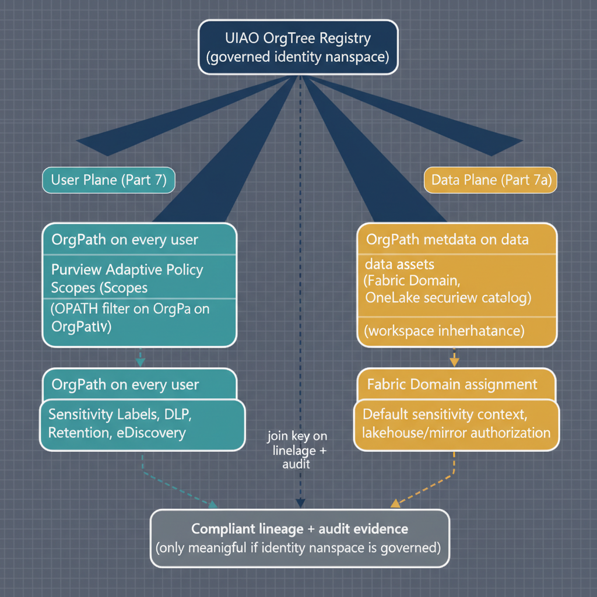

## Chapter 1 — The Asymmetry Part Seven Leaves Open

### What the Purview Chapter Governs and What It Does Not

Part Seven of this series, *OrgPath and Microsoft Purview*, established the
mechanism by which OrgPath becomes the dynamic targeting attribute for every
user-facing policy plane Microsoft Purview manages. Adaptive Policy Scopes
evaluate an OPATH filter expression against the OrgPath extension attribute,
and the policies attached to those scopes — sensitivity labels, data loss
prevention, retention, eDiscovery — follow the user through every
organizational change without a single line of group membership maintenance.
The chapter described the model in continuous detail across four capability
areas and four scripts, and it closed with the operational cadence by which
the substrate keeps Purview's user-facing policies aligned to the
organization's structural state.

The model in Part Seven is complete and correct for what it governs. But it
governs only one half of the data governance problem. Purview's Adaptive
Scopes scope user-facing policy decisions: who can label, who can share, who
can be subject to retention, who can be a custodian in an eDiscovery case.
The other half of data governance is data-facing rather than user-facing:
where does the data live, what domain owns it, which workspace can read it,
which lakehouse mirrors it, which sensitivity context is inherited by
default when an item is created in that domain. That half is governed by a
different Microsoft scoping mechanism — Fabric Domains and OneLake security
— that does not consume OrgPath through an Adaptive Scope, because Adaptive
Scopes are a user-attribute filter and Fabric Domains are a data-asset
hierarchy. The two are not the same plane, and they are not the same
inheritance model.

This chapter develops the second half. It establishes OrgPath as the join
key across two parallel policy planes — the user plane, governed by Adaptive
Scopes as Part Seven described, and the data plane, governed by Fabric
Domain assignment and OneLake security — and it works through the discovery,
enrichment, registration, and ongoing governance steps that bind a hybrid
SQL Server estate into a coherent governed substrate beneath the Microsoft
Fabric, OneLake, and Purview stack. The chapter also makes explicit the
identity-substrate role that the UIAO canon plays beneath that stack: the
trust assertions Purview makes about data assets are only as reliable as the
identity namespace those assertions rest on, and the identity namespace is
exactly what UIAO governs.

### The Architectural Boundary That Microsoft Will Not Cross

Microsoft's answer to federal data sprawl is now well-defined. The Fabric +
OneLake + Purview stack provides a unified, next-generation SSOT platform
for data assets. OneLake provides a single logical data lake per tenant,
with zero-copy shortcuts and near-real-time mirroring that eliminate
duplicate SQL Server instances without rip-and-replace. Microsoft Purview
provides the governance and metadata control plane: catalog, lineage,
sensitivity labels, data products, and authoritative-record designations.
Fabric SQL and Azure SQL provide the operational and transactional layer,
with geographic replication and Arc-managed coordination for on-premises
estates. This stack is architecturally sound, directly aligned with the
Federal Data Strategy, the Evidence Act, the Data Center Optimization
Initiative, and CDO mandates, and any agency moving to Azure Government
should plan around it.

The stack has a foundational dependency that it does not govern itself: the
identity namespace. Every capability in the Fabric + OneLake + Purview stack
depends on a trusted, consistent, and continuously verified Entra ID
identity plane. OneLake access control resolves to Entra ID security groups
and service principals. Purview sensitivity labels evaluate Entra ID user
and group classification bindings. Fabric workspace permissions are Entra
ID role assignments. Shortcut and mirror authorizations consume Entra ID
managed identity credentials. The lineage record that attributes a change
to a principal is meaningful only if that principal is itself meaningful in
the current state of the identity directory.

If the Entra ID tenant is in a post-migration state with ungoverned drift
between the COR baseline and the live directory, every trust assertion in
the Purview governance layer becomes suspect. A sensitivity label applied
to a data product by a principal whose authorization state has drifted is
not a compliant control. An audit lineage record attributing a change to a
principal that no longer exists in its migrated form is not a reliable
evidence artifact. This is not a flaw in Azure's design — it is an
architectural boundary. Purview governs data assets. The substrate beneath
it governs the identity namespace Purview's governance depends on. The
correct architecture is not UIAO instead of Fabric + OneLake + Purview. It
is UIAO beneath it — as the identity governance substrate that makes the
Azure data SSOT trustworthy.

## Chapter 2 — OrgPath as the Join Key Across Two Policy Planes

{#fig-07a-uiao-beneath-the-azure-ssot-stack-diagram-01 fig-alt="Single root box at top: UIAO OrgTree Registry (governed identity namespace). Two parallel columns below: Left column \"User Plane (Part 7)\" stacks three boxes top-to-bottom — OrgPath on every user → Purview Adaptive Policy Scopes (OPATH filter on OrgPath) → Sensitivity Labels, DLP, Retention, eDiscovery. Right column \"Data Plane (Part 7a)\" stacks three boxes — OrgPath metadata on data assets (Fabric Domain, OneLake security, Purview catalog) → Fabric Domain assignment (workspace inheritance) → Default sensitivity context, lakehouse/mirror authorization. The root Registry fans down to the top of each lane. A separate \"Compliant lineage + audit evidence (only meaningful if identity namespace is governed)\" box at the bottom receives dashed arrows from the registry (labeled \"join key on lineage + audit\") and from each lane's bottom box. Engineering blueprint style, neutral slate, federal navy (#1F3A5F) for registry, teal (#1A9E8F) for user plane, amber (#D4A017) for data plane, 16:9 landscape." width="85%"}

### The User Plane and the Data Plane Are Not the Same Plane

The single most important conceptual move in this chapter is to refuse the
shortcut of treating Purview Adaptive Scopes and Fabric Domain assignment
as a single inheritance chain. They are two distinct scoping mechanisms,
they have different evaluation models, and they target different objects.
Conflating them produces architectures that work in demonstration and break
under audit.

Purview Adaptive Policy Scopes are user-attribute filters. The OPATH
expression `extension_{AppId}_OrgPath -like '/Root/Finance/*'` evaluates
against user objects in Entra ID and produces a dynamic set of users whose
OrgPath places them under the Finance branch. The policies attached to that
scope — a Finance label policy, a Finance DLP policy, a Finance retention
policy, a Finance eDiscovery custodian query — apply to the users in that
set, wherever those users go in Microsoft 365. The scope is a user-plane
construct. It says nothing about which data assets are Finance data.

Fabric Domains are a data-asset hierarchy. A workspace is assigned to a
domain through the Fabric admin portal or the Fabric Admin REST API, and
every item in that workspace — lakehouses, warehouses, semantic models,
mirrored databases, reports — inherits the domain assignment as metadata.
The domain hierarchy can mirror the OrgPath hierarchy, and items in a
Finance domain workspace can be expected to carry Finance default
sensitivity context, but the inheritance is from the domain, not from any
user's OrgPath. The mechanism that decides which workspace belongs to which
domain is a separate provisioning step from the mechanism that decides which
OrgPath a user carries.

OrgPath is the join key that lets both planes share a hierarchy. The same
string path that the OrgTree pipeline writes to a user's extension attribute
also names the Fabric Domain that workspaces are assigned to, and also
populates the custom metadata field that a Purview data-map collection or
data product carries to identify its owning organizational segment. When
all three planes reference the same hierarchy through OrgPath as a string
key, the substrate is coherent. When any one of them maintains its own
hierarchy independently, the substrate drifts, and the drift is the
condition `DRIFT-PROVENANCE` is designed to surface.

### Three Surfaces, One Hierarchy

The substrate this chapter describes binds three Microsoft surfaces through
OrgPath. The Entra ID user plane carries OrgPath as the extension attribute
the OrgTree pipeline maintains, exactly as Part Seven described, and exactly
as the existing pipelines for Intune, Defender, Application Identity, and
the other planes covered in the preceding chapters of this series already
manage. The Purview data map carries OrgPath as a custom metadata field on
data assets, applied either by Purview scan post-processing or by an
explicit tagging operation tied to the asset's owning workspace. The Fabric
Domain hierarchy carries OrgPath as the domain name itself, with each
Fabric workspace assigned to the domain whose path matches the workspace's
owning organizational segment.

The three surfaces are not synchronized through a single inheritance
mechanism. They are kept aligned by the OrgTree pipeline producing the
canonical hierarchy and three independent reconciliation jobs reading the
same OrgTree registry to drive their respective surfaces. The user
extension attribute is maintained by the pipeline established in Part Four.
The Purview data-map custom metadata is maintained by a reconciliation job
that reads the OrgTree registry and the Purview data map and emits
tagging operations against the data map's REST API. The Fabric Domain
hierarchy is maintained by a reconciliation job that reads the OrgTree
registry and the Fabric Admin API and emits domain creation, update, and
workspace assignment operations. Each job is idempotent in the same
pattern Part Seven established for Adaptive Scopes and label policies, and
each job emits the same drift findings into the substrate's Evidence
Bundle when reality diverges from the canonical state.

## Chapter 3 — Discovering the SQL Estate and Enriching It With OrgPath

### Where the On-Premises Half Begins

The substrate for SQL governance begins with discovery of the operational
estate the agency is actually running, not with an idealized inventory of
what the agency wishes it were running. In most federal environments, that
estate is decades of organic growth: regional SQL Server instances
installed for projects whose owners have rotated out, instances that were
never decommissioned after the workload moved, instances whose service
accounts are no longer attributable to a current owner, and instances whose
SPN registrations bind them to Active Directory in ways nobody documented
and nobody currently understands. The on-premises half of the SSOT story
begins by enumerating that estate honestly, before any data product can be
mirrored into OneLake or any domain can be assigned in Fabric.

Active Directory itself is the most reliable source of this enumeration.
SQL Server instances register Service Principal Names under the `MSSQLSvc/*`
prefix in the directory partition, and a single LDAP query against the
forest's Global Catalog returns every instance that is currently registered
to provide Kerberos authentication to clients. The UIAO Active Directory
survey adapter at
[`src/uiao/adapters/modernization/active_directory/survey.py`](../../../src/uiao/adapters/modernization/active_directory/survey.py)
performs this enumeration as part of its broader service-account scan, and
the canonical contract for the scan is recorded in
[`Spec3-D1.1`](../../../src/uiao/canon/specs/Spec3-D1.1-Get-ServiceAccountScan.md)
(`UIAO_139`). The output is structured: every SQL instance is recorded with
its hosting computer account, its SPN list, the service account that holds
the SPN write permission, and the registration state that indicates whether
the SPN was set automatically by the service installer or manually through
`setspn`. The eleven AD object types enumerated in the directory-migration
canon's
[`ad-dependency-inventory.md`](../../../src/uiao/modernization/directory-migration/ad-dependency-inventory.md)
include SPNs explicitly, because the SPN registration is the single
identity-layer artifact that breaks Kerberos authentication silently when
it is not re-registered against the migrated service account.

The discovery output is the raw material. It does not yet carry the
hierarchical attribution that connects each SQL instance to the
organizational segment whose work the instance supports. That attribution
is the enrichment step.

### Enriching Discovery With OrgPath

Every SQL instance discovered by the AD survey adapter has at least two
hooks into the identity namespace. The first is the hosting computer
account, which carries its own OrgPath if the OrgTree pipeline has been
applied to the device plane (as Chapter 12 of this series describes for
infrastructure services). The second is the service account principal that
holds the SPN write permission, which carries OrgPath if the OrgTree
pipeline has been applied to the application identity plane (as Chapter 8
describes). Either hook is sufficient to resolve the SQL instance to an
OrgPath value, and the join logic prefers the service account hook when
both are present, because the service account is the persistent identity
that survives a server replacement while the hosting computer account is
not.

When neither hook resolves cleanly, the instance is flagged as
`DRIFT-IDENTITY` by the drift taxonomy formalized in
[`16_DriftDetectionStandard`](../../docs/16_DriftDetectionStandard.qmd) —
the instance exists in the directory but cannot be attributed to a verified
organizational position, and that condition is the explicit signal the CDO
office needs that the instance has no current owner and cannot be safely
migrated or mirrored without owner reassignment first. The drift finding is
not an error in the substrate; it is the substrate doing its job.

The enriched discovery output — every SQL instance with its resolved
OrgPath, or its `DRIFT-IDENTITY` flag — is the artifact that drives the
remaining steps. It feeds Purview data-map registration, Fabric Domain
assignment, OneLake mirroring decisions, and the Evidence Bundle output the
agency's authorizing official consumes during the FedRAMP cycle.

## Chapter 4 — Purview Registration With OrgPath as the Collection Key

### The Data-Map Collection Hierarchy

The Purview data map is the federated catalog beneath which every governed
data asset in the agency's estate is described. Collections in the data
map are the organizational containers for those assets, and the collection
hierarchy can be defined by the data-governance team independently of any
other Microsoft surface. The convention this chapter recommends is to
mirror the collection hierarchy directly to the OrgPath hierarchy: a
`/Root/Finance/Accounting` OrgPath segment corresponds to a Purview
collection of the same name, and every SQL instance whose enriched
discovery output places it under that OrgPath is registered into the
matching collection.

The mirroring is enforced by a reconciliation job that reads the OrgTree
registry and emits collection creation and update operations against the
Purview data-map REST API. The job runs on the same cadence as the
existing OrgTree pipelines this series has described, and the job is
idempotent in the same pattern: existing collections are detected and
preserved, missing collections are created, and collections whose canonical
name has changed are updated. Collections are not deleted automatically
when an OrgTree node is retired; instead the retirement is recorded in the
provenance chain, and an explicit retention decision is required from the
data-governance steward before the collection is removed from the data map.
This preserves the auditability of historical assets registered under the
retired collection.

When a SQL instance is registered into the data map, the enriched
discovery output also tags the asset with a custom metadata field —
`uiao_orgpath`, by convention — whose value is the canonical OrgPath string
the discovery resolved. The custom metadata is what enables downstream
Purview Adaptive Scopes and policy logic to identify the segment the asset
belongs to without re-deriving the attribution from the collection
hierarchy at every evaluation. The custom metadata is also what lets the
Evidence Bundle output for the FedRAMP cycle prove that the asset's
attribution is currently aligned with the identity-layer canon.

### Scan Configuration and Sensitivity Inheritance

The Purview scan that pulls schema and content metadata from the registered
SQL instance is configured against the same OrgPath-derived collection.
Scan results — table inventories, column-level sensitivity classifications,
lineage relationships to upstream and downstream assets — populate the
collection automatically and are visible to the data-governance team as the
collection's contents grow over time. Sensitivity labels applied through
scan-driven classification inherit the collection's default sensitivity
context, which is configured to match the segment's organizational risk
profile in the same OrgTree node metadata that the Part Seven label
policies consumed for users.

The result is a data-map state where every SQL instance, every database
within an instance, every schema, and every table is attributable to an
OrgPath segment, sensitivity-classified according to that segment's risk
profile, and visible to the steward responsible for that segment's data
governance. The state is maintained by the same OrgTree pipeline that
maintains every other Microsoft surface in this series, and it drifts only
when reality drifts from canon — which is the condition the substrate
exists to surface.

## Chapter 5 — OneLake Mirroring and Fabric Domain Assignment

### The Domain Hierarchy as the Data-Plane Twin of OrgPath

Fabric Domains are the data-plane construct that lets a tenant impose a
governance hierarchy over workspaces and the items those workspaces
contain. A domain is named, has an owner, can carry default sensitivity
labels, and can be configured with subdomain hierarchies that nest beneath
it. The convention this chapter recommends is to create one Fabric Domain
per OrgPath node that carries a `FabricDomainBoundary` flag in the OrgTree
registry, and to name the domain after the OrgPath segment it represents.
The flag is metadata in the OrgTree node, set by the governance team
during the OrgTree change process, and consumed by a reconciliation job
that reads the registry and emits domain creation operations through the
Fabric Admin API. The pattern matches the `LabelPolicyBoundary` and
`SegmentLabels` metadata flags described in Part Seven for Purview Adaptive
Scopes; the principle is the same: OrgTree nodes carry the metadata that
declares which Microsoft surfaces require segment-specific governance, and
the reconciliation jobs read that metadata to drive their respective
surfaces.

Workspace assignment to a domain is the operation that binds individual
Fabric workspaces — and the lakehouses, warehouses, and mirrored databases
they contain — to the domain hierarchy. The reconciliation job that
maintains domain assignment reads the OrgTree registry for each workspace's
owning segment (recorded as workspace metadata when the workspace is
provisioned), looks up the corresponding Fabric Domain by OrgPath, and
issues an assignment operation through the Admin API. The job runs
idempotently and emits a `DRIFT-PROVENANCE` finding when a workspace's
assigned domain does not match the OrgPath its metadata claims.

### Mirroring SQL Estates Into OneLake Under the Domain Hierarchy

OneLake mirroring brings the operational SQL estate into the Fabric data
plane without copying data and without disrupting the operational systems
that continue to serve the agency's transactional workloads. The mirroring
operation is configured against a Fabric workspace, the workspace is
assigned to a Fabric Domain whose name matches the segment that owns the
SQL instance, and the mirrored database appears as an item in that
workspace with the domain's metadata and default sensitivity context
inherited. Shortcuts perform a similar function for storage-based sources;
the assignment to a domain is the same operation.

The combination of OneLake mirroring with OrgPath-derived domain assignment
produces a data-plane substrate where every operational SQL instance is
represented in OneLake under a workspace assigned to a domain whose name
encodes the segment's organizational position. Analytical workloads,
reporting, and AI applications consume the mirrored data from OneLake
through the same Entra ID identity plane that the operational systems use
for authentication, and the consumption is governed by the segment's
domain-level policies. The operational SQL instances continue to run; they
are not retired by the mirroring operation. They are made governable.

## Chapter 6 — The Evidence Bundle the Auditor Sees

### A Single Coherent Artifact Across Three Surfaces

The substrate's compliance value is not the existence of the three
reconciliation jobs in isolation. It is the existence of a single coherent
artifact — the Evidence Bundle — that the agency's authorizing official can
hand to a 3PAO and that the assessor can interpret without reverse-engineering
three separate Microsoft consoles to reconstruct the picture. The Evidence
Bundle for the data plane is structured around the same OrgPath join key
that the rest of the substrate uses.

For each OrgPath segment, the Evidence Bundle records the SPN inventory the
AD survey adapter produced (the pre-migration baseline and the
post-migration verification), the OrgPath attribution that resolves each
discovered SQL instance to the segment, the Purview collection registration
state with its custom metadata tagging, the Fabric Domain assignment with
the workspaces that belong to it, the OneLake mirroring configuration for
each mirrored database, the sensitivity classification results from the
Purview scan, and the drift findings — `DRIFT-IDENTITY`, `DRIFT-PROVENANCE`,
`DRIFT-AUTHZ` — that the substrate has surfaced since the last evidence
emission. The bundle is structured as OSCAL artifacts where the OSCAL
schema permits, and as JSON Schema-validated UIAO artifacts elsewhere; the
substrate manifest declares the artifact types it emits.

The bundle proves four things to the assessor. First, the agency knew what
SQL instances existed at the start of the assessment window. Second, every
instance is attributed to an organizational position that is itself
attributable through the OrgTree registry. Third, the user-plane and
data-plane policies that govern each instance are sourced from the same
hierarchy that governs the rest of the agency's data governance posture.
Fourth, the substrate has surfaced and resolved the drift conditions that
would otherwise have become compliance findings during the assessment
itself.

The bundle is a byproduct of the substrate's normal operation. It is not
assembled at assessment time. The artifacts accumulate continuously, the
drift findings are timestamped and remediation-contracted as the drift
standard requires, and the assessor sees a continuous record of the
substrate's state rather than a point-in-time attestation.

## Chapter 7 — GCC Moderate Boundary Caveats for the Azure SSOT Stack

### What Works at GCC Moderate and What Does Not

The Fabric + OneLake + Purview stack runs in Azure Government, in Azure
Commercial, and at the M365 GCC Moderate boundary that overlays Azure
Commercial infrastructure for federal civilian agencies. The substrate
this chapter describes applies coherently in all three deployments, but the
GCC Moderate boundary introduces compliance constraints that the substrate
must surface explicitly rather than let pass silently. The canonical
description of the boundary is in
[`B1-gcc-moderate-boundary-model`](../compliance/boundary-authorization/B1-gcc-moderate-boundary-model.qmd),
and the structural three-way conflict between TIC 3.0, Zero Trust, and
FedRAMP 20x that the boundary creates is the subject of a separate
compliance artifact that the substrate's Evidence Bundle references.

The relevant constraint for the Azure SSOT stack is that Microsoft Purview
information protection features — the scan-driven sensitivity
classification, the lineage attribution to Entra ID principals, the
adaptive policy evaluation — rely on telemetry and policy signals that
traverse the Azure Commercial boundary when running under GCC Moderate.
The substrate cannot remediate that boundary; the boundary is structural.
What the substrate can do, and does, is record the boundary as a
first-class compliance finding in the Evidence Bundle, document the
compensating controls the agency has put in place, and demonstrate that
the controls are continuously verified through the same drift mechanism
that governs the rest of the identity-substrate state. The Compliance
Control Plane is where these boundary conditions are surfaced and
documented, and the boundary-authorization canon family is where the
authorization-package material is maintained.

The agency that adopts the substrate does not adopt it to make the GCC
Moderate boundary disappear. The agency adopts it to make the boundary
visible, attributed, and continuously monitored — which is what the open
governance posture the substrate exists to deliver actually means.

### Positioning Summary

Microsoft Purview governs data assets. The Fabric + OneLake stack provides
the data SSOT platform federal agencies are correctly converging on. UIAO
is the open canon that describes how to compose those capabilities, at the
identity layer, into a substrate that survives an audit and survives the
migration boundary the entire Azure SSOT stack is built on. The substrate
is not an alternative to the Microsoft stack; it is the identity governance
layer the Microsoft stack assumes and does not provide.

For the federal mandate alignment that makes this substrate necessary, see
the companion whitepaper
[*Federal SSOT Alignment*](../whitepapers/federal-ssot-alignment.qmd) in
the Whitepapers section.
