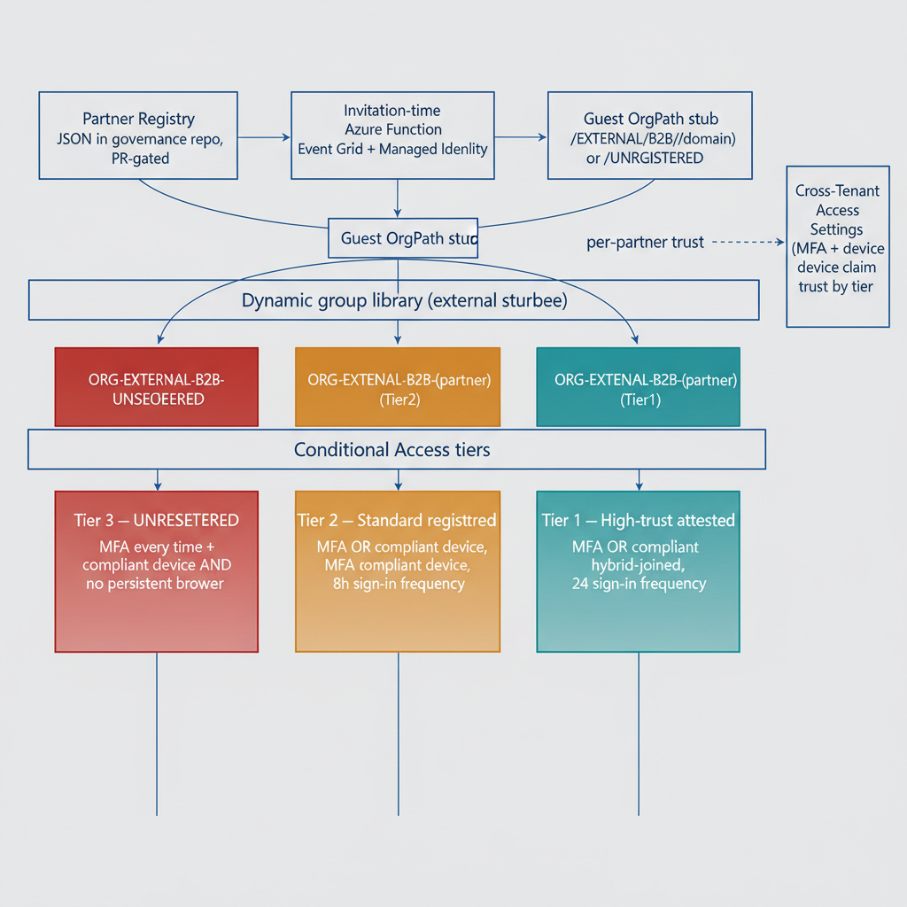

## Chapter 1 — The Guest Identity Problem

### The Governance Blind Spot

Every architectural decision made across the first nine parts of this series rests on a single foundational assumption: every identity in scope carries an OrgPath attribute that encodes its position within the organizational hierarchy. That attribute is the predicate for every Conditional Access condition, every Lifecycle Workflow trigger, every Sentinel analytic rule join, every Purview DLP scope, and every Intune assignment filter documented to this point. The assumption holds cleanly for internal users, whose OrgPath is stamped at provisioning time and maintained by the mover pipeline thereafter. It holds for managed devices, whose OrgPath tag is written at Autopilot enrollment. It holds for servers and Arc machines, whose OrgPath resource tag flows from the infrastructure-as-code pipeline. There is, however, a class of identity for which the assumption fails entirely: the B2B guest user introduced through Entra External ID collaboration.

When an external partner, contractor, or vendor is invited to collaborate with a team in the host tenant, Entra ID creates a guest object in the host tenant directory. That object carries the invited user's display name, email address, and a UserType value of Guest. It does not carry an OrgPath. No provisioning flow stamps one. No Lifecycle Workflow has been configured to write one, because guest users are not members of any node in the OrgTree. The result is a structural gap at the boundary of the governance architecture. The guest object exists inside the same directory that every OrgPath-based policy queries, but it is invisible to every predicate that reads the OrgPath extension attribute. The attribute is simply absent on the object.

This invisibility has two failure modes, and understanding both is prerequisite to appreciating why a purpose-built solution is necessary rather than a workaround. The first failure mode is over-application: policies scoped to "all users" unintentionally capture guest objects. An Intune compliance policy, a Conditional Access grant control requiring a compliant device, or a Purview DLP rule that blocks download of sensitivity-labeled documents may have been designed with internal users in mind, but because guest objects satisfy the "all users" predicate and fail to match any OrgPath exclusion (since OrgPath is absent, not equal to some excluded value), those policies apply to guests in ways that were never intended and were never tested against the external use case. The second failure mode is under-application: policies that explicitly exclude guests by checking for UserType eq Guest leave that entire population ungoverned by the OrgPath-based policy engine. They may fall under a separate, far simpler policy set, but that set cannot benefit from the organizational structure context that the OrgPath model provides. The guest population becomes a governance island, managed by cruder instruments than the rest of the directory.

Neither failure mode is acceptable for a production governance architecture. The first creates policy violations and potential compliance findings when internal controls are applied to external identities with different contractual and regulatory contexts. The second creates a monitoring and access control gap at precisely the boundary where external threat actors operate. B2B guests represent the most frequently exploited vector in cross-organizational compromise scenarios, and they are the population with the thinnest behavioral baseline in the tenant's identity protection signals.

### The Guest OrgPath Stub

The solution introduced in this document is the Guest OrgPath Stub. Rather than forcing guest identities into the internal OrgTree — which would be architecturally incorrect, since guests are not members of the organizational hierarchy — the stub model defines a reserved, well-known path segment outside the organizational tree but within the same attribute namespace. Every guest object receives an OrgPath value in the form /EXTERNAL/B2B/{PartnerDomain}, where PartnerDomain is the registered internet domain of the partner organization from which the guest originates. A guest from contoso-partner.com receives the stub /EXTERNAL/B2B/contoso-partner.com. A guest from an unrecognized or unregistered domain receives the stub /EXTERNAL/B2B/UNREGISTERED.

This single design decision closes the governance gap in four dimensions simultaneously. First, because the stub begins with /EXTERNAL, every policy that uses a startsWith("/EXTERNAL") predicate can now correctly identify all guest identities as a class, enabling accurate inclusion or exclusion without relying on UserType. Second, because the stub encodes the partner domain, policies can be differentiated by partner, applying stricter controls to unknown or high-risk partners and relaxed controls to partners who have completed security attestation. Third, because the stub is stored in the same OrgPath extension attribute used by internal users, no new attribute schema is required; existing dynamic group membership rules, Sentinel WatchLists, and assignment filters that already read OrgPath can be extended to cover the external population with minimal modification. Fourth, because the stub is a structured path string, the same OrgTree toolchain — the governance repository, the PR-based approval process, and the pipeline CI/CD — can govern the partner registry that maps domains to stubs, applying the same change-control rigor to partner classification changes as to internal organizational restructuring.

The stub encodes four distinct pieces of information in a single string. The first element, /EXTERNAL, declares that the identity is not a member of the internal organizational hierarchy. The second element, /B2B, declares that the identity is a B2B collaboration identity created through Entra External ID invitation, distinguishing it from other external identity types that may be introduced in future series parts. The third element, {PartnerDomain}, identifies the originating organization. The fourth element, present only in the special case value /EXTERNAL/B2B/UNREGISTERED, signals that the partner has not been registered in the governance partner registry and requires remediation action from the governance team before the guest can be properly classified.

### Document Scope

This document covers seven chapters. Chapter Two defines the Guest OrgPath Stub model in full, including the partner registry schema, the invitation-time automation function that stamps the stub on newly created guest objects, and the dynamic group library that consumes the stub for policy targeting. Chapter Three defines the three-tier Conditional Access architecture enabled by OrgPath stub differentiation, with complete policy definitions for unregistered, standard, and high-trust guest populations. Chapter Four addresses device governance for guest users, explaining why Intune enrollment is unavailable to guests and how Cross-Tenant Access Settings and Mobile Application Management policies fill that gap, driven by the partner registry's risk tier classification. Chapter Five covers the guest lifecycle through Access Reviews, describing the sponsor linkage mechanism and the automated quarterly review configuration that ensures guest accounts are actively re-validated by internal stakeholders who own each partner relationship. Chapter Six presents the Sentinel monitoring architecture for the external OrgPath subtree, including a governance WatchList and three production-ready KQL queries. Chapter Seven addresses the pipeline handling of partner-level change events — reclassification, domain reassignment, and partner offboarding — and closes with a synthesis of how the stub model completes the governance substrate across all identity classes in the tenant.

## Chapter 2 — The Guest OrgPath Stub Model

### Stub Anatomy and Information Encoding

The Guest OrgPath Stub is not a freeform label. It is a structured, hierarchical path string governed by the same versioning and change-control rules as every internal OrgTree node path. Its four information elements are arranged in a fixed positional schema. The first element, /EXTERNAL, is a reserved root segment that is explicitly absent from all valid internal OrgPath values. Internal OrgPath values begin with /ORG or a tenant-specific root segment defined at OrgTree initialization. This exclusivity ensures that a simple startsWith predicate is sufficient to partition the directory into internal and external populations without ambiguity. The second element, /B2B, identifies the collaboration modality. The series anticipates that future modalities — such as Entra External ID with self-service sign-up flows, or SAML-federated partner identities — will each occupy a distinct second-level segment, so that policy targeting can differentiate collaboration types without requiring changes to the first-level predicate. The third element is the fully qualified domain name of the partner organization, lowercased and normalized, as extracted from the invited user's email address. This element is the primary lookup key against the partner registry. The fourth element exists only as a special case: when the partner domain is not found in the registry, the stub is written as /EXTERNAL/B2B/UNREGISTERED rather than /EXTERNAL/B2B/{unknown-domain}, because unregistered domains must not create unique stub values that proliferate silently in the directory. All unregistered guests converge on a single well-known value, making them trivially queryable and preventing governance drift from domain enumeration.

### The Partner Registry

The partner registry is a JSON file, partner-registry.json, stored in the OrgTree governance repository alongside the organizational node definitions. It is subject to the same pull request and approval process as OrgTree node changes: a proposed addition or modification to a partner entry must pass automated JSON schema validation, must include the approval of the designated governance stakeholder for external partnerships, and must be merged by the pipeline runner account rather than by an individual contributor. This change-control requirement is non-negotiable: the partner registry controls trust tier assignment, and a trust tier controls which Cross-Tenant Access Settings apply, which Conditional Access tier is enforced, and what the Access Review interval is. An unreviewed change to a partner's RiskTier field is equivalent to an unreviewed change to a Conditional Access policy. The registry's schema enforces the following fields on every entry. The Domain field is the fully qualified partner domain, lowercased. The TenantId field is the Entra ID tenant ID of the partner organization, used for Cross-Tenant Access Settings configuration; this value is resolved by querying the partner tenant's OpenID Connect metadata endpoint during the registration process. The OrgPathStub field is the exact string to be written to the guest object's OrgPath extension attribute, following the /EXTERNAL/B2B/{Domain} convention. The RiskTier field accepts two values: Tier1, indicating a high-trust partner that has completed the organization's security attestation process, and Tier2, indicating a standard registered partner. The AccessCategory field is a free-text classification label used for audit reporting and Purview sensitivity label scoping, distinguishing categories such as StrategicVendor, ContractStaff, and TechnologyPartner. The SponsorGroupName field is the display name of the internal security group whose members serve as reviewers in the quarterly Access Review for that partner's guests. The MaxReviewIntervalDays field enforces the outer bound on how long a guest from this partner can remain active without an explicit review decision; the Access Review configuration uses this value to compute recurrence intervals, and the default for all registered partners is ninety days.

### Invitation-Time Automation

The mechanism that stamps the OrgPath stub on a guest object at invitation time is an Azure Function operating under a system-assigned Managed Identity. The function is triggered either by an Event Grid subscription on the Entra ID audit log event for "Invite external user," or by a Logic App custom task connector that fires from the Entra ID Lifecycle Workflows invitation flow. Upon invocation, the function receives the invited user's object ID and email address, extracts the partner domain from the email address, queries the partner registry JSON file from a governance storage account, and performs a Microsoft Graph PATCH operation against the user object to write the resolved OrgPath stub to the OrgPath extension attribute. If the partner domain is not found in the registry, the function assigns /EXTERNAL/B2B/UNREGISTERED and enqueues a notification to the governance team for registration review. Every invocation emits a structured audit record to a governance log sink, recording the timestamp, the guest object ID, the resolved domain, the assigned stub, and whether the domain was registered. This audit record is consumed by the governance pipeline's compliance reporting queries in Chapter Six.

The function requires the User.ReadWrite.All application permission granted to the Managed Identity via a Microsoft Graph application permission assignment. It requires no client secret or certificate, because Managed Identity token acquisition uses the Azure Instance Metadata Service endpoint. The partner registry file must be accessible from the function's network path; the recommended configuration is a storage account in the same resource group as the function app, with the Managed Identity granted the Storage Blob Data Reader role on the container that holds the registry file. The function does not cache the registry between invocations; it fetches the current version on each call, ensuring that partner registration changes take effect immediately for new invitations without requiring a function restart.

```powershell
#
# .SYNOPSIS
#     Azure Function — Guest OrgPath Stamp on B2B Invitation
# .DESCRIPTION
#     Triggered by Event Grid event for "Invite external user" in Entra ID audit log,
#     or via Logic App HTTP trigger. Extracts the partner domain from the invited
#     user's email, looks up the OrgTree partner registry, and stamps OrgPath on the
#     guest object via Microsoft Graph.
#     Authentication: System-assigned Managed Identity with User.ReadWrite.All (application).
#     Runtime: PowerShell 7.4 on Azure Functions v4.
# .NOTES
#     Set environment variables in Function App Configuration:
#     TENANT_ID              - Your Entra ID tenant ID
#     ORGPATH_EXTENSION_NAME - e.g. extension_abc123def456_OrgPath (no hyphens in app ID)
#     PARTNER_REGISTRY_URI   - URL to partner-registry.json in your governance storage account
#
using namespace System.Net
param($Request, $TriggerMetadata)

$tenantId             = $env:TENANT_ID
$orgPathExtensionName = $env:ORGPATH_EXTENSION_NAME
$partnerRegistryUri   = $env:PARTNER_REGISTRY_URI

$body       = $Request.Body | ConvertFrom-Json
$userId     = $body.userId
$guestEmail = $body.invitedUserEmailAddress   # e.g. alice@contoso-partner.com

if (-not $userId -or -not $guestEmail) {
    Push-OutputBinding -Name Response -Value ([HttpResponseContext]@{
        StatusCode = [HttpStatusCode]::BadRequest
        Body       = '{"error":"Missing userId or invitedUserEmailAddress"}'
    })
    return
}

$partnerDomain = ($guestEmail -split "@")[-1].ToLower()
Write-Host "Guest invitation: userId=$userId domain=$partnerDomain"

# Load partner registry from governance storage
try {
    $registry     = Invoke-RestMethod -Uri $partnerRegistryUri -Method Get
    $partnerEntry = $registry | Where-Object { $_.Domain -eq $partnerDomain }
} catch {
    Write-Warning "Partner registry unavailable: $_"
    $partnerEntry = $null
}

$orgPathValue = if ($partnerEntry) {
    Write-Host "Matched partner registry entry for $partnerDomain"
    $partnerEntry.OrgPathStub
} else {
    Write-Warning "Domain '$partnerDomain' not in partner registry — assigning UNREGISTERED"
    # TODO: Send alert to governance team queue for partner registration review
    "/EXTERNAL/B2B/UNREGISTERED"
}

# Obtain Managed Identity token for Microsoft Graph
$tokenUri    = "http://169.254.169.254/metadata/identity/oauth2/token" +
               "?api-version=2018-02-01&resource=https%3A%2F%2Fgraph.microsoft.com%2F"
$tokenResp   = Invoke-RestMethod -Uri $tokenUri -Headers @{ Metadata = "true" }
$bearerToken = $tokenResp.access_token

$patchPayload = @{ $orgPathExtensionName = $orgPathValue } | ConvertTo-Json

try {
    Invoke-RestMethod `
        -Uri     "https://graph.microsoft.com/v1.0/users/$userId" `
        -Method  PATCH `
        -Headers @{ Authorization = "Bearer $bearerToken"; "Content-Type" = "application/json" } `
        -Body    $patchPayload
    Write-Host "OrgPath stamped: $userId => $orgPathValue"
} catch {
    Write-Error "Graph PATCH failed for $userId : $_"
    Push-OutputBinding -Name Response -Value ([HttpResponseContext]@{
        StatusCode = [HttpStatusCode]::InternalServerError
        Body       = "{`"error`":`"Graph PATCH failed`"}"
    })
    return
}

# Emit structured audit record for the governance pipeline log
$auditRecord = [ordered]@{
    Timestamp   = (Get-Date -Format "o")
    Event       = "GuestOrgPathStamp"
    UserId      = $userId
    GuestEmail  = $guestEmail
    Domain      = $partnerDomain
    OrgPath     = $orgPathValue
    Registered  = ($null -ne $partnerEntry)
} | ConvertTo-Json -Compress
Write-Host "AUDIT: $auditRecord"

Push-OutputBinding -Name Response -Value ([HttpResponseContext]@{
    StatusCode = [HttpStatusCode]::OK
    Body       = "{`"orgPath`":`"$orgPathValue`"}"
})
```

### Dynamic Group Library for the External Subtree

The dynamic group library for the /EXTERNAL subtree follows the identical structural pattern established in Part Two for internal organizational groups: one branch group covering the entire subtree, and one node group per partner domain. This consistency is intentional. Every policy targeting mechanism in the series — Conditional Access include/exclude groups, Intune assignment filters, Lifecycle Workflow scope conditions, and Access Review scopes — uses Entra ID dynamic security groups as the policy attachment point. By maintaining the same group naming convention and membership rule pattern across internal and external populations, policies can be composed uniformly without requiring separate targeting logic for guests.

The all-external branch group, named ORG-BRANCH-EXTERNAL-B2B, uses the membership rule user.extension\_{AppIdWithoutHyphens}\_OrgPath -startsWith "/EXTERNAL/B2B", where {AppIdWithoutHyphens} is the application ID of the directory extension registration with all hyphens removed, as required by Entra ID dynamic membership rule syntax. This group is used as the include scope for any policy that should apply uniformly to all guests regardless of partner, such as MAM App Protection Policies in Chapter Four. Each per-partner node group is named following the convention ORG-EXTERNAL-B2B-{PartnerDomainNormalized}, where the partner domain is normalized to uppercase with dots and hyphens replaced by hyphens for readability — for example, ORG-EXTERNAL-B2B-CONTOSO-PARTNER for the partner domain contoso-partner.com. The membership rule for this group is an equality match: user.extension\_{AppIdWithoutHyphens}\_OrgPath -eq "/EXTERNAL/B2B/contoso-partner.com". The unregistered group, named ORG-EXTERNAL-B2B-UNREGISTERED, uses the equality rule user.extension\_{AppIdWithoutHyphens}\_OrgPath -eq "/EXTERNAL/B2B/UNREGISTERED". This group is the highest-priority targeting scope in the Conditional Access tier structure, because unregistered guests represent the highest-risk population and must receive the most restrictive controls regardless of any other group membership.

Dynamic group membership evaluation for OrgPath extension attributes is subject to the same propagation latency applicable to all Entra ID dynamic groups: membership is typically computed within minutes of the attribute write, but policy enforcement at the Conditional Access layer does not wait for group membership to settle before evaluating the session. For this reason, the invitation-time function stamps the OrgPath attribute before the guest's first sign-in attempt whenever possible. The Event Grid trigger path, which fires on the invitation audit event before the guest receives the invitation email, provides a sufficient window for group membership to propagate before the guest activates the invitation link. The Logic App custom task path, which fires synchronously during the invitation workflow, provides the same guarantee for invitation flows initiated through Lifecycle Workflow custom extensions.

## Chapter 3 — Conditional Access for Guests by OrgPath Stub

### The Limitation of UserType-Based Targeting

Before OrgPath stub assignment, the only Conditional Access targeting predicate available to distinguish guests from internal users is the UserType attribute, which accepts the value Guest for all B2B invitees. A Conditional Access policy scoped to all guests via UserType eq Guest applies identical controls to every external identity in the directory: the high-trust partner who has been collaborating with the organization for three years under a formal security agreement receives the same restrictions as the vendor whose domain was registered in the partner registry forty-eight hours ago and the unrecognized user whose email domain has never appeared in the registry. This bluntness is not an acceptable governance posture. Overly restrictive controls applied uniformly to high-trust partners create friction that drives shadow-IT collaboration patterns. Insufficiently restrictive controls applied uniformly to accommodate high-trust partners leave the unregistered population with inadequate protection.

With OrgPath stubs assigned, three differentiated Conditional Access tiers become implementable using the dynamic group targeting established in Chapter Two. Each tier maps to a specific OrgPath stub classification and applies controls calibrated to the trust level encoded in that stub. The three tiers are ordered by restriction level, and the Conditional Access engine evaluates them in that order: a guest who matches multiple groups will receive the most restrictive applicable policy, a behavior enforced by targeting each tier at the appropriate group exclusively rather than using broad include-with-exclude patterns.

{#fig-10-orgpath-and-cross-tenant-collaboration-diagram-01 fig-alt="Top row, three sequential boxes: Partner Registry (JSON in governance repo, PR-gated) → Invitation-time Azure Function (Event Grid + Managed Identity) → Guest OrgPath stub (/EXTERNAL/B2B/{domain} or /UNREGISTERED). Middle band labeled \"Dynamic group library (external subtree)\" with three group boxes side-by-side: ORG-EXTERNAL-B2B-UNREGISTERED, ORG-EXTERNAL-B2B-{partner} (Tier2), ORG-EXTERNAL-B2B-{partner} (Tier1). The stub box fans down to each of the three groups. Bottom band labeled \"Conditional Access tiers\" with three policy boxes vertically aligned beneath their groups: Tier 3 — UNREGISTERED (MFA every time + compliant device AND no persistent browser); Tier 2 — Standard registered (MFA OR compliant device, 8h sign-in frequency); Tier 1 — High-trust attested (MFA OR compliant OR hybrid-joined, 24h sign-in frequency). Each group connects vertically to its matching CA tier. A separate side box \"Cross-Tenant Access Settings (MFA + device claim trust by tier)\" connects to the Partner Registry via a dashed arrow labeled \"per-partner trust\". Engineering blueprint style, deepening red-to-amber-to-teal severity gradient on the three CA tiers (with red for Tier 3 reserved for highest restriction), 16:9 landscape." width="85%"}

### Tier Three — Unregistered Guests

The strictest tier targets the ORG-EXTERNAL-B2B-UNREGISTERED dynamic group. Guests in this group have arrived at the tenant boundary without a corresponding partner registration in the governance registry. Their presence may be the result of an ad-hoc invitation sent by an internal user without following the formal partner onboarding process, a domain change at the partner organization that invalidated their previous stub, or a genuine security concern. Until the governance team classifies the guest's domain, these users are treated as maximally untrusted. Every session requires MFA re-authentication, enforced through a sign-in frequency of one hour with a frequency interval of everyTime, meaning MFA is required on every token issuance, not merely at the start of a session window. Device compliance or hybrid-join is required in addition to MFA, with grant controls combined by the AND operator rather than OR. Persistent browser sessions are blocked. Because unmanaged personal devices cannot satisfy the device compliance requirement and no Cross-Tenant Access trust is configured for unregistered partners, this tier effectively forces unregistered guests into a browser-only path that requires MFA on every interaction and cannot maintain a persistent session. This is not a usable collaboration posture, which is intentional: the policy creates pressure on internal sponsors to complete the partner registration process rather than allowing unregistered guests to operate indefinitely in a degraded-access state.

### Tier Two — Standard Registered Partners

The second tier targets the group set that maps to RiskTier = Tier2 partners. These are registered partners who have been accepted into the partner registry through the governance approval process but have not yet completed the organization's security attestation program. They receive MFA as a mandatory control, applied at an eight-hour sign-in frequency window rather than per-session. The grant control uses an OR operator between MFA and device compliance, meaning a guest who presents from a compliant device registered in their home tenant — when Cross-Tenant Access Settings for that partner include device compliance trust — can satisfy the grant control without a separate MFA prompt. Session persistence is permitted within the eight-hour window. The mobileAppsAndDesktopClients client app type is included in scope, allowing native client access alongside browser sessions, subject to the device compliance or MFA requirement.

### Tier One — High-Trust Partners

The third tier targets the group set that maps to RiskTier = Tier1 partners. These partners have completed the security attestation process, which includes verification of their own identity security posture, confirmation of MFA enforcement in their home tenant, and demonstration of device compliance standards equivalent to the host organization's requirements. The Conditional Access policy for this tier mirrors the controls applied to internal Tier-2 users from Part Three of this series: MFA or compliant device or hybrid-joined device, combined by OR, with a twenty-four-hour sign-in frequency window. The parity with internal controls is deliberate and communicates a meaningful governance statement: a partner who has met the attestation bar is treated as organizationally equivalent to a trusted internal collaborator for the purpose of access controls, even though their OrgPath stub keeps them structurally segregated from the internal tree for all other governance purposes.

All three policies are created in enabledForReportingButNotEnforced (Report-Only) mode. This is not optional. Activating a Conditional Access policy against a guest population without first observing its effect in sign-in logs is an operational risk: guests from a specific partner may be using application types, locations, or device configurations that trigger unexpected deny conditions. The recommended observation period is fourteen days of sign-in log review per policy before promotion to enabled state. The promotion itself should be a pipeline-controlled change, gated by the same approval process as partner registry modifications.

```powershell
#
# .SYNOPSIS
#     Creates three-tier Conditional Access policies for external B2B guests,
#     differentiated by their OrgPath stub (partner trust classification).
# .NOTES
#     Requires: Connect-MgGraph -Scopes "Policy.ReadWrite.ConditionalAccess","Group.Read.All"
#     All policies are created in Report-Only mode (enabledForReportingButNotEnforced).
#     Review sign-in logs for 14 days before switching each policy state to "enabled."
#     Dynamic group IDs must exist before running — retrieve with:
#       Get-MgGroup -Filter "displayName eq 'ORG-EXTERNAL-B2B-UNREGISTERED'" | Select-Object Id
#
param(
    [string]$GroupId_Unregistered = "00000000-0000-0000-0000-aaaaaaaaaaaa",  # Substitute
    [string]$GroupId_Standard     = "00000000-0000-0000-0000-bbbbbbbbbbbb",  # Substitute
    [string]$GroupId_HighTrust    = "00000000-0000-0000-0000-cccccccccccc"   # Substitute
)

Connect-MgGraph -Scopes "Policy.ReadWrite.ConditionalAccess" -NoWelcome

function New-CaPolicy([hashtable]$Body) {
    Invoke-MgGraphRequest `
        -Method      POST `
        -Uri         "https://graph.microsoft.com/v1.0/identity/conditionalAccess/policies" `
        -Body        ($Body | ConvertTo-Json -Depth 10) `
        -ContentType "application/json"
}

# Tier 3 — UNREGISTERED guests (maximum restriction)
$result1 = New-CaPolicy @{
    displayName = "CA-EXT-001 — Unregistered B2B Guests — Maximum Restriction"
    state       = "enabledForReportingButNotEnforced"
    conditions  = @{
        users        = @{ includeGroups = @($GroupId_Unregistered) }
        applications = @{ includeApplications = @("All") }
        clientAppTypes = @("all")
    }
    grantControls = @{
        operator        = "AND"
        builtInControls = @("mfa", "compliantDevice")
    }
    sessionControls = @{
        signInFrequency = @{
            value             = 1; type = "hours"
            frequencyInterval = "everyTime"; isEnabled = $true
        }
        persistentBrowser = @{ mode = "never"; isEnabled = $true }
    }
}
Write-Host "[CREATED] CA-EXT-001: $($result1.id)"

# Tier 2 — Standard registered partners
$result2 = New-CaPolicy @{
    displayName = "CA-EXT-002 — Standard B2B Partners — Compliant MFA"
    state       = "enabledForReportingButNotEnforced"
    conditions  = @{
        users        = @{ includeGroups = @($GroupId_Standard) }
        applications = @{ includeApplications = @("All") }
        clientAppTypes = @("browser", "mobileAppsAndDesktopClients")
    }
    grantControls = @{
        operator        = "OR"
        builtInControls = @("mfa", "compliantDevice")
    }
    sessionControls = @{
        signInFrequency = @{
            value             = 8; type = "hours"
            frequencyInterval = "timeBased"; isEnabled = $true
        }
    }
}
Write-Host "[CREATED] CA-EXT-002: $($result2.id)"

# Tier 1 — High-trust partners
$result3 = New-CaPolicy @{
    displayName = "CA-EXT-003 — High-Trust B2B Partners — Standard Internal Controls"
    state       = "enabledForReportingButNotEnforced"
    conditions  = @{
        users        = @{ includeGroups = @($GroupId_HighTrust) }
        applications = @{ includeApplications = @("All") }
        clientAppTypes = @("browser", "mobileAppsAndDesktopClients")
    }
    grantControls = @{
        operator        = "OR"
        builtInControls = @("mfa", "compliantDevice", "domainJoinedDevice")
    }
    sessionControls = @{
        signInFrequency = @{
            value             = 24; type = "hours"
            frequencyInterval = "timeBased"; isEnabled = $true
        }
    }
}
Write-Host "[CREATED] CA-EXT-003: $($result3.id)"
Write-Host "All external CA policies created in Report-Only mode."
```

::: {.callout-note title="⚠ Operational Note — CA Policy Ordering and Exclusion Hygiene"}
Each tier policy must include the emergency access (break-glass) accounts in its exclude list, consistent with the exclusion pattern applied to all CA policies in the series. Confirm that the ORG-EXTERNAL-B2B-UNREGISTERED, standard-tier, and high-trust-tier groups are mutually exclusive by construction — a guest can only hold one OrgPath value, so membership in these groups is already exclusive. No additional exclusion logic between policies is required.
:::

## Chapter 4 — Device Governance and Cross-Tenant Access Settings

### Why Device Enrollment Is Unavailable to Guests

The Intune device enrollment architecture established in Part Six of this series is scoped to identities that are members of the host tenant as full users. Guests cannot enroll devices into the host tenant's Intune because the enrollment process requires a user identity in the host tenant with a sufficient license assignment, and guest objects are not eligible for Intune license assignment under the B2B collaboration model. This is a Microsoft-imposed boundary, not a local configuration decision, and it is architecturally correct: the host organization should not be responsible for managing the device lifecycle of an external contractor's personal or employer-issued laptop. The device management responsibility remains with the guest's home organization or the guest themselves.

This boundary creates a device posture gap. Every internal Conditional Access grant control that requires a compliant device is satisfied by the Intune compliance policy infrastructure documented in Part Six. For guests, that infrastructure is inaccessible. Three mechanisms are available to address this gap, and the correct choice depends on the partner's risk tier as encoded in the OrgPath stub. Understanding all three mechanisms and their applicability is essential before configuring either Cross-Tenant Access Settings or Conditional Access grant controls for the guest population.

### Device Trust Mechanisms for Guests

The first mechanism is Cross-Tenant Access Settings with inbound trust for device compliance claims. When a partner organization manages their devices in their own Intune and marks those devices as compliant, Entra ID in the partner's home tenant issues a device compliance claim in the access token presented to the host tenant. By default, the host tenant does not trust this claim — it originated from an external authority and has not been verified against the host tenant's own compliance policies. Cross-Tenant Access Settings for a specific partner tenant can be configured to accept inbound device compliance claims, at which point the host tenant's Conditional Access engine treats the compliance claim from the partner tenant as equivalent to a compliance claim from the host tenant's own Intune. This mechanism is only appropriate for Tier1 high-trust partners who have demonstrated that their device management policies meet the host organization's security standards. Accepting compliance claims from a partner whose device management posture has not been verified is equivalent to accepting unverified security attestations as access control inputs.

The second mechanism is hybrid-joined device trust. If the partner's devices are hybrid-joined to an on-premises Active Directory domain and that join claim is presented in the token, the host tenant can be configured to trust inbound hybrid-join claims from specific partner tenants. This mechanism is applicable where partner organizations operate hybrid environments and where the host organization has verified the partner's domain join security posture. Like compliance trust, hybrid-join trust is available in Cross-Tenant Access Settings and is appropriate only for Tier1 partners.

The third mechanism is Conditional Access App Control with Microsoft Defender for Cloud Apps session policies applied through the reverse proxy. When a guest accesses a web application through a browser session, Conditional Access can route the session through the Defender for Cloud Apps reverse proxy. Session policies applied at the proxy layer enforce data protection controls regardless of the device's management state: document downloads can be blocked or watermarked, copy-paste from web applications to unmanaged clipboard targets can be blocked, and upload operations from unverified locations can be restricted. This is the mechanism of last resort for unregistered guests and Tier2 standard partners who present from devices that cannot satisfy either compliance or hybrid-join requirements. Browser sessions through the proxy are more secure than allowing uncontrolled native client access, and session policies can be differentiated by the OrgPath stub of the authenticated guest identity, enabling stricter policies for unregistered guests than for registered Tier2 partners.

### Cross-Tenant Access Settings Synchronization

Cross-Tenant Access Settings must be configured per partner tenant ID, not per domain. The partner registry includes the TenantId field for exactly this reason. The following script reads the partner registry and creates or updates one Cross-Tenant Access Settings entry per registered partner, setting inbound trust flags based on the partner's RiskTier classification. Tier1 partners receive both MFA claim trust and device compliance trust (both compliance and hybrid-join). Tier2 partners receive MFA claim trust only. The B2B collaboration inbound policy is set to allow all users and all applications for all registered partners, because access restriction at the application level is handled by the Conditional Access tier policies and by application assignment rather than by the Cross-Tenant Access blunt instrument. Unregistered partners, by definition, have no Cross-Tenant Access Settings entry, which means the default Cross-Tenant Access policy applies to them. The default policy should be configured to trust no claims from unverified external tenants, reinforcing the unregistered tier's maximum-restriction posture.

```powershell
#
# .SYNOPSIS
#     Synchronizes Entra ID Cross-Tenant Access Settings from the OrgTree
#     partner registry. Creates or updates one partner configuration per
#     registry entry based on RiskTier.
# .NOTES
#     Requires: Connect-MgGraph with scopes:
#     "Policy.ReadWrite.CrossTenantAccess","CrossTenantInformation.ReadBasic.All"
#     TenantId for each partner must be in the registry.
#     If unknown, resolve with:
#       (Invoke-RestMethod "https://login.microsoftonline.com/{domain}/v2.0/.well-known/openid-configuration").issuer
#
param(
    [string]$PartnerRegistryPath = "C:\governance\orgtree\partner-registry.json"  # Substitute
)

Connect-MgGraph -Scopes "Policy.ReadWrite.CrossTenantAccess" -NoWelcome

$registry = Get-Content $PartnerRegistryPath -Raw | ConvertFrom-Json

foreach ($partner in $registry) {
    if (-not $partner.TenantId) {
        Write-Warning "No TenantId for $($partner.Domain) — skipping"
        continue
    }

    # Tier1 = high-trust: trust both MFA and device compliance claims from partner
    # Tier2 = standard:   trust MFA claims only
    $trustMfa         = $true
    $trustCompliance  = ($partner.RiskTier -eq "Tier1")
    $trustHybridJoin  = ($partner.RiskTier -eq "Tier1")

    $policyBody = @{
        tenantId     = $partner.TenantId
        inboundTrust = @{
            isMfaAccepted                       = $trustMfa
            isCompliantDeviceAccepted           = $trustCompliance
            isHybridAzureADJoinedDeviceAccepted = $trustHybridJoin
        }
        b2bCollaborationInbound = @{
            usersAndGroups = @{
                accessType = "allowed"
                targets    = @(@{ target = "AllUsers"; targetType = "user" })
            }
            applications = @{
                accessType = "allowed"
                targets    = @(@{ target = "AllApplications"; targetType = "application" })
            }
        }
    }

    # Check if policy already exists
    try {
        Get-MgPolicyCrossTenantAccessPolicyPartner `
            -CrossTenantAccessPolicyPartnerTenantId $partner.TenantId -ErrorAction Stop | Out-Null
        Update-MgPolicyCrossTenantAccessPolicyPartner `
            -CrossTenantAccessPolicyPartnerTenantId $partner.TenantId `
            -BodyParameter $policyBody
        Write-Host "[UPDATED] $($partner.Domain) (Tier: $($partner.RiskTier))"
    } catch {
        New-MgPolicyCrossTenantAccessPolicyPartner -BodyParameter $policyBody | Out-Null
        Write-Host "[CREATED] $($partner.Domain) (Tier: $($partner.RiskTier))"
    }
}
Write-Host "Cross-Tenant Access Settings synchronization complete."
```

### MAM-Only Policy Targeting for Guest Devices

Because guest users cannot enroll in the host tenant's Intune, the mobile device management (MDM) enrollment-based App Protection Policy assignment model used for internal users is unavailable for the guest population. However, App Protection Policies configured for Mobile Application Management without enrollment (MAM-WE) can target any Entra ID identity in the directory, including guests, because they are enforced at the application layer by the Intune SDK built into managed applications rather than at the device layer by the MDM agent. The host organization's Intune instance can therefore publish MAM-WE App Protection Policies targeting the ORG-BRANCH-EXTERNAL-B2B dynamic group, and those policies will be delivered to managed applications — Microsoft Teams, Microsoft 365 apps, SharePoint — running on the guest's unmanaged device the next time the guest authenticates to that application.

The MAM-WE policy targeting guests should enforce the following data protection controls at minimum: block clipboard operations from policy-managed applications to unmanaged applications on the device, require a PIN or biometric for application launch, disable backup of managed application data to personal cloud storage services, restrict screen capture within managed applications, and block the "Save As" function to locations not controlled by the host organization's managed storage policies. These controls do not require device enrollment, do not require the device to appear in Intune's device list, and do not conflict with the guest's home organization's MDM policy on the same device. They operate as an additional application-layer containment boundary for data accessed through the collaboration platform, ensuring that even if the guest's device is compromised or unmanaged, data accessed through managed applications cannot be trivially exfiltrated to unmanaged storage or applications on the same device.

## Chapter 5 — Guest Lifecycle: Access Reviews and Expiration

### Three Lifecycle Stages

Every B2B guest identity passes through three lifecycle stages, and governance failures at any stage produce materially different risk profiles. The first stage is invitation. The access that a guest receives at invitation time is the access they will hold until something explicitly removes it. If the invitation process does not record who initiated the collaboration relationship and why, there is no internal stakeholder who can be held accountable for reviewing that access when circumstances change. The second stage is the active relationship. During this stage, the guest is actively collaborating, accessing resources, and generating activity signals in the tenant's logs. The governance question is not whether the guest should have access — that was answered at invitation — but whether the access scope and trust level remain appropriate as time passes, personnel at the partner organization change, and the nature of the collaboration evolves. The third stage is expiration. Partner contracts end, projects conclude, and vendor relationships are replaced. Without an explicit expiration mechanism, guest accounts survive indefinitely after the relationship that created them has ended. Stale guest accounts are a persistent attack surface: they maintain access to resources associated with their original invitation, they may hold group memberships accumulated over the course of the relationship, and they are rarely monitored because their owners have disengaged.

### Sponsor Linkage at Invitation Time

The invitation-time automation function documented in Chapter Two writes the OrgPath stub to the OrgPath extension attribute. A second extension attribute, configured on the same directory extension registration and named with a GuestSponsorPath suffix, records the OrgPath value of the internal user who initiated the invitation. This attribute is populated from the audit event payload, which includes the initiating user's object ID. The function resolves that object ID to an OrgPath value using a Graph GET against the initiating user's profile, then writes the resolved OrgPath to the GuestSponsorPath attribute on the guest object. The result is a permanent, queryable link between the guest identity and the internal organizational position responsible for the relationship. When an Access Review is initiated for that guest, the system knows which internal team sponsored the relationship and can route review responsibility to the appropriate group. When a guest's OrgPath stub changes due to a partner reclassification event, the system can notify the sponsor OrgPath node that the relationship has been reclassified and that a review may be warranted outside the normal quarterly cycle.

### Quarterly Access Review Configuration

For each registered partner domain, the governance pipeline creates one recurring Access Review definition targeting the partner's dynamic group. The review is scoped to the transitive members of the ORG-EXTERNAL-B2B-{PartnerDomain} group, which is to say all guests carrying the corresponding OrgPath stub. Reviewers are the members of the partner's SponsorGroupName security group from the registry, fetched as a Microsoft Graph transitive members query at review time so that sponsor group membership changes are reflected without requiring review definition updates. If the sponsor group cannot be resolved at review creation time — because the named group does not exist in the directory — the script falls back to the partner dynamic group's owners as reviewers, which typically includes the governance administrator account that created the group, and logs a warning for remediation.

The review instance duration is fourteen days, giving sponsors a two-week window to complete their decisions. The defaultDecision is set to Deny, which means that any guest account for which the reviewer takes no action — either because the reviewer is unavailable, has left the organization, or simply fails to respond — is automatically denied at the close of the review window. The autoApplyDecisionsEnabled flag ensures that deny decisions are applied without requiring a manual administrative step. The apply action is disableAndDeleteUserApplyAction, which disables the guest account immediately on deny rather than deleting it, preserving the account object for the thirty-day retention window required for audit trail continuity and for the governance cleanup pipeline to confirm deletion after the retention period expires. Recommendations are enabled, so that the review UI surfaces Entra ID's activity-based recommendation (approve or deny based on whether the guest has signed in during the past thirty days) to assist reviewers in making decisions for large partner populations. The recurrence pattern is absoluteMonthly with an interval of three months and a noEnd range, creating a perpetual quarterly cadence that continues until the partner's registry entry is removed and the review definition is decommissioned by the pipeline.

```powershell
#
# .SYNOPSIS
#     Creates quarterly Access Reviews for each B2B partner group, with
#     reviewers drawn from the partner's sponsor security group.
# .NOTES
#     Requires: Connect-MgGraph -Scopes "AccessReview.ReadWrite.All","Group.Read.All"
#     Requires Entra ID Governance license for Access Reviews.
#     defaultDecision = "Deny" means: if reviewer takes no action, access is denied.
#     autoApplyDecisionsEnabled = true applies the decision automatically at review close.
#     disableAndDeleteUserApplyAction disables the account immediately on Deny;
#     permanent deletion occurs 30 days later via the governance cleanup script.
#
param(
    [string]$PartnerRegistryPath = "C:\governance\orgtree\partner-registry.json"  # Substitute
)

Connect-MgGraph -Scopes "AccessReview.ReadWrite.All","Group.Read.All" -NoWelcome

$registry = Get-Content $PartnerRegistryPath -Raw | ConvertFrom-Json

# Start next review cycle on the coming Monday
$daysToMonday = ((1 - [int](Get-Date).DayOfWeek + 7) % 7)
if ($daysToMonday -eq 0) { $daysToMonday = 7 }
$startDate = (Get-Date).AddDays($daysToMonday).ToString("yyyy-MM-dd")

foreach ($partner in $registry) {

    # Resolve the partner's Entra ID dynamic group
    $groupName = "ORG-EXTERNAL-B2B-$($partner.Domain -replace '[\.\-]','-')"
    $group     = Get-MgGroup -Filter "displayName eq '$groupName'" -ErrorAction SilentlyContinue
    if (-not $group) {
        Write-Warning "Group '$groupName' not found — skipping $($partner.Domain)"
        continue
    }

    # Resolve the sponsor reviewer group
    $sponsorGroup = Get-MgGroup `
        -Filter "displayName eq '$($partner.SponsorGroupName)'" `
        -ErrorAction SilentlyContinue

    $reviewers = if ($sponsorGroup) {
        @(@{
            query     = "/groups/$($sponsorGroup.Id)/transitiveMembers"
            queryType = "MicrosoftGraph"
        })
    } else {
        Write-Warning "Sponsor group '$($partner.SponsorGroupName)' not found — using group owners"
        @(@{ query = "/groups/$($group.Id)/owners"; queryType = "MicrosoftGraph" })
    }

    $reviewName = "AccessReview-External-$($partner.Domain)-Quarterly"

    # Skip if already exists
    $exists = Get-MgIdentityGovernanceAccessReviewDefinition `
        -Filter "displayName eq '$reviewName'" -ErrorAction SilentlyContinue
    if ($exists) {
        Write-Host "[EXISTS] $reviewName"
        continue
    }

    $body = @{
        displayName            = $reviewName
        descriptionForAdmins   = "Quarterly access review for B2B guests from $($partner.Domain)"
        descriptionForReviewers = "Review each guest user's continued need for access. Deny removes their access automatically."
        scope      = @{
            query     = "/groups/$($group.Id)/transitiveMembers"
            queryType = "MicrosoftGraph"
        }
        reviewers  = $reviewers
        settings   = @{
            mailNotificationsEnabled        = $true
            reminderNotificationsEnabled    = $true
            justificationRequiredOnApproval = $true
            defaultDecisionEnabled          = $true
            defaultDecision                 = "Deny"
            instanceDurationInDays          = 14
            autoApplyDecisionsEnabled       = $true
            recommendationsEnabled          = $true
            applyActions                    = @(
                @{ "@odata.type" = "#microsoft.graph.disableAndDeleteUserApplyAction" }
            )
            recurrence = @{
                pattern = @{ type = "absoluteMonthly"; interval = 3 }
                range   = @{ type = "noEnd"; startDate = $startDate }
            }
        }
    } | ConvertTo-Json -Depth 10

    Invoke-MgGraphRequest `
        -Method      POST `
        -Uri         "https://graph.microsoft.com/v1.0/identityGovernance/accessReviews/definitions" `
        -Body        $body `
        -ContentType "application/json" | Out-Null

    Write-Host "[CREATED] $reviewName (reviewers: $($partner.SponsorGroupName))"
}

Write-Host "Guest access review configuration complete."
```

::: {.callout-note title="ⓘ License Requirement"}
Entra ID Governance licensing is required for the Access Review features used in this configuration, specifically for the autoApplyDecisionsEnabled setting, the disableAndDeleteUserApplyAction apply action, and the recommendations engine. Confirm that the Entra ID Governance license is applied at the tenant level before deploying this script. Guest users themselves do not consume Entra ID Governance seats for Access Review purposes — only the host tenant's configuration requires the license.
:::

## Chapter 6 — Sentinel Monitoring for the External OrgPath Subtree

### Why the External Subtree Is a High-Priority Monitoring Surface

The monitoring architecture built across Parts Seven and Eight of this series is organized around behavioral baselines. An internal user's sign-in behavior, application access patterns, data volume, and resource access sequence have been observed over months or years, and Sentinel analytics rules can identify deviations from that baseline with meaningful signal-to-noise ratios. The baseline is an asset that accumulates through sustained observation. Guest users arrive with none of it. A guest who signed in for the first time yesterday has a behavioral history of exactly one session. Sentinel's user entity behavioral analytics engine can do very little with a single data point. This structural deficit means that the external OrgPath subtree cannot be monitored effectively using the same deviation-from-baseline approach that governs internal user monitoring. Alternative approaches are required: population-level monitoring that establishes cohort norms for a given partner domain, and threshold-based monitoring that flags absolute behaviors — accessing an unusually large number of files, signing in from an impossible travel location, presenting a risky sign-in signal — without relying on a personal baseline.

The governance WatchList named GuestOrgPathWatchlist is the infrastructure that makes both approaches possible. Maintained by the governance pipeline, this WatchList is a tabular mapping of guest user principal names to their current OrgPath stub, partner domain, risk tier, and sponsor OrgPath. It is updated by the governance pipeline on any event that changes a guest's OrgPath value: new stamp at invitation, reclassification, and UNREGISTERED alert resolution. The WatchList is the join key in every KQL query that needs to enrich sign-in or activity data with OrgPath context. Without the WatchList, OrgPath information lives only on the directory object and is not replicated into the Log Analytics workspace. With the WatchList, every Sentinel query can enrich guest sign-in events with the full OrgPath context in a single left outer join, at the cost of keeping the WatchList synchronized with the directory state. The pipeline's responsibility for WatchList maintenance is therefore a monitoring dependency, not a convenience: stale WatchList entries mean stale enrichment, which means monitoring queries that cannot correctly classify the guest they are analyzing.

### Production KQL Queries

The three queries presented in this chapter represent three distinct monitoring objectives. The first is a dashboard workbook query that provides an operational summary of external guest sign-in activity, aggregated by OrgPath stub and partner domain, for a one-day lookback window. It is designed to be run as a Workbook tile, providing at-a-glance visibility into the volume, success rate, geographic distribution, and application diversity of guest sign-ins across all partners simultaneously. The second is an alert rule that fires on risky sign-ins from unregistered guests, the highest-priority monitoring target in the external subtree. The third is a scheduled analytics rule that detects file activity volume anomalies in the Office 365 activity data, identifying individual guest users whose data access volume in a given day exceeds three times the thirty-day rolling average for their partner cohort.

```kql
// Query 1: External Guest Sign-In Summary Dashboard
// Run as Workbook query — 1-day lookback
// Join guest sign-ins against OrgPath WatchList for enrichment
SigninLogs
| where TimeGenerated >= ago(1d)
| where HomeTenantId != ResourceTenantId   // B2B guest sign-ins
| join kind=leftouter (
    _GetWatchlist("GuestOrgPathWatchlist")
    | project WL_UPN = SearchKey, OrgPath, PartnerDomain, RiskTier
) on $left.UserPrincipalName == $right.WL_UPN
| extend OrgPathResolved = iff(isnotempty(OrgPath), OrgPath, "/EXTERNAL/B2B/UNKNOWN")
| summarize
    TotalSignIns    = count(),
    Successful      = countif(ResultType == 0),
    Failed          = countif(ResultType != 0),
    UniqueLocations = dcount(Location),
    UniqueApps      = dcount(AppDisplayName),
    RiskLevels      = make_set(RiskLevelDuringSignIn)
    by OrgPathResolved, PartnerDomain, RiskTier, bin(TimeGenerated, 1d)
| order by TotalSignIns desc
// Query 2: High-Risk Sign-Ins from Unregistered External Guests
// Alert rule — run every 4 hours, lookback 4 hours
// Fire on any risky sign-in from /EXTERNAL/B2B/UNREGISTERED
_GetWatchlist("GuestOrgPathWatchlist")
| where OrgPath == "/EXTERNAL/B2B/UNREGISTERED"
| project UPN = SearchKey, OrgPath, PartnerDomain
| join kind=inner (
    SigninLogs
    | where TimeGenerated >= ago(4h)
    | where RiskLevelDuringSignIn in ("low","medium","high")
    | project TimeGenerated, UserPrincipalName, Location, IPAddress,
              AppDisplayName, RiskLevelDuringSignIn, RiskDetail,
              ConditionalAccessStatus, ResultType
) on $left.UPN == $right.UserPrincipalName
| project
    TimeGenerated, UserPrincipalName, OrgPath, PartnerDomain,
    RiskLevel = RiskLevelDuringSignIn, RiskDetail,
    Location, IPAddress, Application = AppDisplayName,
    CAStatus = ConditionalAccessStatus
| order by TimeGenerated desc
// Query 3: Guest Data Volume Anomaly Detector
// Detects B2B guests with file access volumes above 3x their partner cohort 30-day average
// Run daily as scheduled analytics rule
let threshold      = 3.0;
let baselineWindow = 30d;
let alertWindow    = 1d;

let cohortBaseline =
    OfficeActivity
    | where TimeGenerated between (ago(baselineWindow) .. ago(alertWindow))
    | where Operation in ("FileDownloaded","FileAccessed","FileCopied","SharingInvitationCreated")
    | join kind=inner (
        _GetWatchlist("GuestOrgPathWatchlist")
        | project UserId = SearchKey, OrgPath, PartnerDomain
    ) on $left.UserId == $right.UserId
    | where OrgPath startswith "/EXTERNAL/"
    | summarize AvgDailyOps = avg(countif(TimeGenerated > ago(alertWindow))) by OrgPath
    ;

OfficeActivity
| where TimeGenerated >= ago(alertWindow)
| where Operation in ("FileDownloaded","FileAccessed","FileCopied","SharingInvitationCreated")
| join kind=inner (
    _GetWatchlist("GuestOrgPathWatchlist")
    | project UserId = SearchKey, OrgPath, PartnerDomain, RiskTier
) on $left.UserId == $right.UserId
| where OrgPath startswith "/EXTERNAL/"
| summarize TodayOps = count() by UserId, OrgPath, PartnerDomain, RiskTier
| join kind=inner cohortBaseline on OrgPath
| extend VolumeRatio = TodayOps / AvgDailyOps
| where VolumeRatio >= threshold
| project UserId, OrgPath, PartnerDomain, RiskTier,
          TodayOps, AvgDailyOps, VolumeRatio
| order by VolumeRatio desc
```

Query One produces output that is appropriate for an operations team reviewing external collaboration activity at the start of each shift. The OrgPathResolved column captures guests whose WatchList entry is missing — typically due to a WatchList synchronization lag — under the /EXTERNAL/B2B/UNKNOWN sentinel value, distinguishing them from guests with a properly assigned /EXTERNAL/B2B/UNREGISTERED stub. A non-zero count in the UNKNOWN category is itself a monitoring signal indicating that WatchList maintenance has fallen behind directory state and requires attention. Query Two is an alert-generating rule. Its threshold of any risky sign-in from an unregistered guest reflects the policy stance of Chapter Three: unregistered guests have no behavioral history, no Cross-Tenant Access trust, and no verified identity security posture, and any Identity Protection risk signal from that population is therefore an event that warrants immediate investigation rather than queuing for a next-business-day review. Query Three uses a cohort baseline rather than a personal baseline because individual guest behavioral history is thin. The cohort — all guests sharing the same OrgPath stub — provides a more statistically meaningful reference frame: if three hundred guests from a given partner typically download forty files per day collectively, a single guest downloading four hundred files in one day is an outlier against the cohort norm even if that individual has no personal baseline for comparison. The three-times multiplier is a starting point; organizations with large guest populations and established cohort histories should tune the threshold based on observed alert rates during a validation period.

## Chapter 7 — Pipeline Integration and Guest Mover Handling

### Why Guest Movers Are Categorically Different

Part Five of this series documented the internal mover pipeline: when an employee changes organizational position, the OrgPath pipeline detects the HR attribute change, resolves the new OrgPath value from the updated OrgTree position, stamps the new OrgPath on the identity object, and triggers all downstream policy re-evaluations — group membership changes, Conditional Access session reevaluation, Intune assignment filter recalculation — that flow from the OrgPath change. The internal mover pattern is fundamentally an identity movement within a fixed hierarchy: the user's position in the tree changes, but the tree itself remains stable, and the user's identity object in the directory remains the same object throughout the move.

Guest movers do not follow this pattern. A guest's identity does not move within the OrgPath hierarchy because guests do not occupy a position within the hierarchy. Their OrgPath stub encodes partner classification, not organizational position. What changes for a guest is not where they are in a hierarchy but how their partner is classified. Three distinct partner-level change events require pipeline action, and each has a different scope of impact. Understanding each event type and its correct pipeline response is essential to maintaining the consistency of the governance substrate as partner relationships evolve.

### Partner Reclassification

A partner reclassification event occurs when the RiskTier field of a registry entry is changed through the PR-and-approval process — most commonly when a standard Tier2 partner completes the security attestation process and is promoted to Tier1, or when a Tier1 partner fails a security review and is demoted to Tier2. The OrgPath stub value itself does not change in a reclassification event: /EXTERNAL/B2B/contoso-partner.com remains the correct stub regardless of whether that partner is Tier1 or Tier2. However, every downstream configuration that is differentiated by tier must be updated. Cross-Tenant Access Settings must be updated to reflect the new trust level. Conditional Access group membership does not change (the stub is unchanged), but the partner's dynamic group may need to be mapped to a different CA policy tier — this requires adding the per-partner group as an exclude target in the previous tier's policy and an include target in the new tier's policy, which the pipeline performs by patching the relevant CA policy conditions. The Sentinel WatchList must be updated to reflect the new RiskTier value so that monitoring queries correctly classify the partner's guests from the moment the reclassification takes effect. The pipeline commits all three changes as an atomic unit, recording a reclassification audit event in the governance log.

### Domain Reassignment

A domain reassignment event occurs when a partner organization changes their email domain — due to an acquisition, a corporate rebranding, or a domain migration. Guests who were invited under the old domain carry OrgPath stubs encoded with the old domain. New guests invited under the new domain will receive the correct new stub from the invitation-time function, but existing guests remain on the old stub until explicitly re-stamped. The pipeline handles domain reassignment by creating a new partner registry entry for the new domain (with the same metadata as the old entry), running the guest re-stamp script to update all existing guests from the old domain to a new stub reflecting the new domain, and then deprecating the old registry entry after a transition period during which both stubs are considered valid. The deprecation of the old entry removes the old dynamic group, decommissions the old Access Review definition, and triggers a final WatchList synchronization to ensure no guests remain associated with the deprecated stub.

### Partner Offboarding

A partner offboarding event occurs when the business relationship ends and all guests from the offboarding partner must be removed from the tenant. The pipeline approach is a two-phase operation. In the first phase, the re-stamp script is invoked with the new stub set to /EXTERNAL/B2B/OFFBOARDED and the DisableAccounts flag set to true. This immediately disables all guest accounts from the offboarding partner and moves them into a distinct OrgPath stub that carries no dynamic group membership, no Conditional Access tier, and no resource access. The accounts are disabled but not immediately deleted, preserving the audit trail and satisfying the thirty-day retention requirement for identity lifecycle records. In the second phase, executed thirty days later by a scheduled pipeline task, the governance cleanup script permanently deletes all guest objects carrying the /EXTERNAL/B2B/OFFBOARDED stub, removes the partner's registry entry, decommissions the partner's dynamic group and Access Review definition, and removes the partner's Cross-Tenant Access Settings entry. The WatchList is synchronized at both phases to reflect the current state accurately.

```powershell
#
# .SYNOPSIS
#     Re-stamps OrgPath on all B2B guests from a partner whose registry entry changed.
#     Also used for partner offboarding: set NewOrgPathStub = "/EXTERNAL/B2B/OFFBOARDED"
#     and set Disable = $true to immediately disable all guests from that partner.
# .PARAMETER PartnerDomain
#     The partner domain to re-process. Example: "contoso-partner.com"
# .PARAMETER NewOrgPathStub
#     The new OrgPath stub. Example: "/EXTERNAL/B2B/contoso-partner.com" (reclassification)
#     or "/EXTERNAL/B2B/OFFBOARDED" (partner relationship ended)
# .PARAMETER DisableAccounts
#     If $true, disables all matching guest accounts (used for partner offboarding).
# .NOTES
#     Requires: Connect-MgGraph -Scopes "User.ReadWrite.All"
#     B2B guest UPNs follow the pattern:
#       original_alias_partnerDomain-com#EXT#@yourtenant.onmicrosoft.com
#     Dots in the domain are replaced with underscores in the UPN.
#
param(
    [string]$PartnerDomain       = "contoso-partner.com",                     # Substitute
    [string]$NewOrgPathStub      = "/EXTERNAL/B2B/contoso-partner.com",       # Substitute
    [string]$OrgPathAttrName     = "extension_{AppIdWithoutHyphens}_OrgPath", # Substitute
    [switch]$DisableAccounts     = $false
)

Connect-MgGraph -Scopes "User.ReadWrite.All" -NoWelcome

# B2B UPN encodes dots as underscores in the domain portion before #EXT#
$domainEncoded = ($PartnerDomain -replace "\.", "_").ToLower()

Write-Host "[$((Get-Date).ToString('HH:mm:ss'))] Searching for guests from: $PartnerDomain"

$guests = Get-MgUser `
    -Filter "UserType eq 'Guest'" `
    -Property "id,displayName,userPrincipalName,accountEnabled,$OrgPathAttrName" `
    -All `
    | Where-Object { $_.UserPrincipalName -like "*_$domainEncoded#EXT#*" }

Write-Host "  Found $($guests.Count) guests from $PartnerDomain"

$updated = 0; $errors = 0; $skipped = 0

foreach ($guest in $guests) {
    $currentOrgPath = $guest.AdditionalProperties[$OrgPathAttrName]

    $patchBody = @{}
    if ($currentOrgPath -ne $NewOrgPathStub) { $patchBody[$OrgPathAttrName] = $NewOrgPathStub }
    if ($DisableAccounts -and $guest.AccountEnabled) { $patchBody["accountEnabled"] = $false }

    if ($patchBody.Count -eq 0) {
        $skipped++
        continue
    }

    try {
        Invoke-MgGraphRequest `
            -Method      PATCH `
            -Uri         "https://graph.microsoft.com/v1.0/users/$($guest.Id)" `
            -Body        ($patchBody | ConvertTo-Json) `
            -ContentType "application/json"
        $action = if ($DisableAccounts) { "UPDATED+DISABLED" } else { "UPDATED" }
        Write-Host "  [$action] $($guest.UserPrincipalName) => $NewOrgPathStub"
        $updated++
    } catch {
        Write-Error "  [ERROR] $($guest.UserPrincipalName): $_"
        $errors++
    }
}

Write-Host ""
Write-Host "=== Guest Re-Stamp Complete === Updated: $updated | Errors: $errors | Skipped: $skipped"

# Commit audit record to governance log
@{
    Timestamp      = (Get-Date -Format "o")
    Event          = if ($DisableAccounts) { "GuestPartnerOffboard" } else { "GuestOrgPathReclassify" }
    PartnerDomain  = $PartnerDomain
    NewOrgPathStub = $NewOrgPathStub
    GuestsUpdated  = $updated
    GuestsErrored  = $errors
} | ConvertTo-Json -Compress | Out-File -Append "C:\governance\logs\guest-pipeline.jsonl"  # Substitute path
```

### Governance Synthesis

With the guest OrgPath stub model fully implemented across all seven chapters of this document, every identity that touches the tenant now carries an OrgPath value. Internal users carry positions within the internal organizational tree, expressed as paths that trace the hierarchy from root to their leaf node. B2B guest users carry stubs in the /EXTERNAL subtree that encode partner identity and trust classification without placing them inside a hierarchy to which they do not belong. The two populations are structurally segregated by their OrgPath root segment — /ORG versus /EXTERNAL — while sharing a single attribute schema, a single dynamic group targeting model, a single Sentinel enrichment architecture, and a single governance pipeline. Every policy decision made across the series — Conditional Access grant controls, Intune assignment filters, Sentinel analytics rule predicates, Purview DLP scope conditions, Access Review scope queries, and Azure RBAC eligible assignment conditions — can now include or exclude external identities consistently, because the same attribute mediates every governance decision regardless of whether the identity under evaluation is an internal employee, a high-trust partner, a standard registered vendor, or an unregistered external guest. The governance substrate is complete for the identity plane. What remains is the extension of that substrate into the non-human and non-person identity planes addressed in Parts Eleven through Thirteen.

### Closing Chapter — Series Progression

Part Ten completes the identity-plane coverage of the OrgPath governance architecture. Every human identity class — internal employees, contractors provisioned as members, and external B2B guests — now carries a well-defined, policy-mediated OrgPath value, and every major governance control surface in the tenant uses that value as a primary predicate for access decisions, lifecycle management, and threat monitoring. Three integration surfaces remain, each extending the OrgPath substrate into a domain where human identities are not the primary actor.

Part Eleven addresses Service Principals and App Registrations. Applications in the tenant — both first-party and third-party — represent a non-human identity class with access to tenant resources, consent grants, and in many cases delegated permissions on behalf of users. Part Eleven defines the mechanism for mapping ownership of every application registration to an OrgPath node, creating a queryable link between the application's access scope and the organizational team responsible for its security posture. This ownership mapping enables consent policy enforcement scoped by the application owner's OrgPath, drift detection alerts when an application's permission set changes outside the node owner's approval chain, and privileged access governance for application credential rotation that mirrors the PIM integration from Part Three.

Part Twelve addresses Azure Policy Guest Configuration. Servers onboarded through Azure Arc carry OrgPath resource tags as established in the infrastructure pipeline. Part Twelve closes the loop between the OrgPath tag on an Arc machine and the Desired State Configuration packages deployed to that machine, using Azure Policy Guest Configuration to drive DSC-based configuration enforcement through the OrgPath tag value. A machine tagged with a specific OrgPath node receives precisely the Guest Configuration package assignments appropriate for that node's policy group, applied through the Azure Policy inheritance chain rather than through manual agent configuration. This extends the organizational governance model from the identity plane into the configuration management plane for every server in the environment, on-premises or cloud-hosted.

Part Thirteen is the capstone aggregation layer. The governance architecture across all thirteen parts produces a large and distributed body of operational data: OrgTree node change records in the governance repository, OrgPath stamp audit events in the function log, Sentinel analytics rule results in the Log Analytics workspace, Intune device compliance states in the Intune reporting API, Defender for Endpoint security posture scores, Purview audit logs, and Access Review decision records in the Entra ID Governance API. Part Thirteen defines a Power BI semantic model that ingests all of these sources, joins them on the OrgPath dimension, and produces a per-division governance posture view consumable by engineering leadership and technical stakeholders. The model is designed to answer the questions that the governance architecture was built to answer: which organizational nodes are compliant with the baseline control set, which nodes have open access review findings, which nodes have devices or servers out of policy, and which nodes are generating elevated threat signals in Sentinel — all sliced by the same organizational structure that governs every policy decision in the tenant.

### Document Information

### Series: OrgTree and OrgPath Governance Architecture • Part Ten of Thirteen

### Author: Michael • Generated: 08 May 2026, 12:11 EDT • Location: Herald Harbor, MD

All code samples are production-ready with placeholder values marked by inline comments. Substitute all values before deployment. All Conditional Access policies are created in Report-Only mode and must be reviewed before enforcement enablement.
