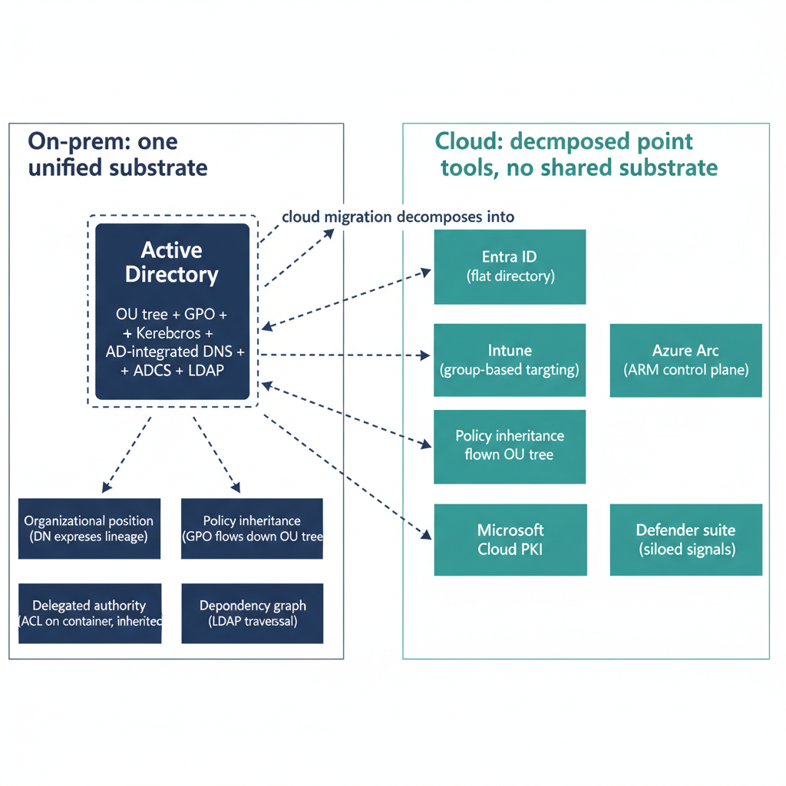

# Chapter 1 — The Governance Gap at the Center of the Microsoft Cloud

## What Active Directory Was, and Why It Mattered

For more than two decades, Active Directory Domain Services served as the single unifying substrate of enterprise and federal IT infrastructure. Its significance was never merely that it authenticated users or applied policy to machines. Its significance was architectural: Active Directory was the one system in which every object, every identity, every machine, every policy, and every administrative delegation lived together, related to one another through a coherent structural model, and expressed the organization's governance posture as a matter of native function. The Organizational Unit was not merely a container for grouping users. It was a positional statement. It told the directory where a user sat in the institution's hierarchy, and that position carried weight — weight expressed through the automatic inheritance of Group Policy, through the scope of delegated administrative authority, through the application of fine-grained security settings, and through the replication of DNS records tied to the domain's infrastructure. A user in the Finance OU of the Washington Division received, automatically and deterministically, a specific set of policies because of where they sat, not because an administrator had enumerated their name against every policy. That is the feature that is missing from the cloud.

The components of that unified substrate were numerous and tightly coupled. The forest and domain provided the outermost administrative boundary and the trust model. The OU tree provided the internal structure — a named, hierarchical arrangement of containers into which every managed identity and every managed machine was placed. GPOs were linked to nodes in that tree and inherited downward through it, allowing administrators to define policy at the domain level, override it at the division level, and specialize it further at the unit level, all without enumerating individual objects. The enterprise Kerberos Key Distribution Center was inseparable from the domain controller. The service locator DNS records that every Kerberos client depended on were published automatically into the AD-integrated DNS zone, which itself replicated with the directory. The enterprise Certificate Authority validated enrollment identity against the directory, issued certificates through auto-enrollment driven by Group Policy, and embedded CRL distribution points whose addresses were themselves resolvable through the AD-integrated DNS. LDAP provided a single query interface that allowed any tool — any auditing system, any management console, any reporting engine — to traverse the entire object graph and understand the organizational context of any identity it encountered. These were not features that coexisted in a suite. They were expressions of a single unified data model, administered through a single inheritance framework, enforcing a single governance posture.

## How Cloud Migration Breaks the Unification

The migration from Active Directory to the Microsoft cloud stack is not, as it is sometimes characterized, a straightforward lift-and-shift of function. It is a decomposition. The individual capabilities that existed as integrated facets of Active Directory are separated into distinct products: Entra ID for identity, Intune for device management, Azure Arc for server governance, Azure DNS for name resolution, Microsoft Cloud PKI for certificate issuance, and a constellation of Defender products for security visibility. Each of these products is genuinely capable within its own domain. Each is the product of substantial engineering investment. Each represents a significant advancement over the on-premises equivalent in specific dimensions — scalability, global availability, integration with modern authentication protocols, and resistance to certain categories of perimeter-based attack. But each of these tools has its own governance model, its own scoping mechanism, its own data model, and its own understanding of what the organization looks like. And critically, none of them shares a common substrate with any of the others.

Entra ID does not know what Intune knows about a device's organizational assignment. Intune does not know what Azure Arc knows about a server's on-premises heritage. Azure Policy does not know what Entra ID Governance knows about a user's lifecycle state. Azure DNS does not know what AD-integrated DNS knew about the organizational context of the machines that registered records in it. Microsoft Cloud PKI does not know what AD CS knew about the certificate templates that were appropriate for a given organizational unit's machines. The Defender products each see a slice of the environment and generate intelligence within that slice, but the correlation of that intelligence across slices requires custom integration work that does not exist natively in any of the products. This is the architecture of the Microsoft cloud identity and governance stack as it actually exists — not as a unified platform, but as a collection of individually capable point tools that do not inherit from one another and do not share a structural model of the organization they govern.

{#fig-01-microsoft-identity-and-governance-stack-diagram-01 fig-alt="Left panel labeled \"On-prem: one unified substrate\" centers on a single Active Directory box (OU tree + GPO + Kerberos + AD-integrated DNS + ADCS + LDAP) with four downward arrows to outputs: Organizational position (DN expresses lineage), Policy inheritance (GPO flows down OU tree), Delegated authority (ACL on container, inherited), Dependency graph (LDAP traversal). Right panel labeled \"Cloud: decomposed point tools, no shared substrate\" shows six disconnected boxes with no connecting lines between them: Entra ID (flat directory), Intune (group-based targeting), Azure Arc (ARM control plane), Azure DNS, Microsoft Cloud PKI, Defender suite (siloed signals). Six dashed arrows fan out from the left-panel AD box to each of the six cloud boxes, labeled \"cloud migration decomposes into\" on the topmost arrow only. Engineering blueprint style, neutral slate background with federal navy (#1F3A5F) for AD and teal (#1A9E8F) for cloud boxes, no human figures, 16:9 landscape." width="85%"}

## The Governance Questions That Cannot Be Answered Without Custom Engineering

Active Directory could answer a specific set of governance questions as a matter of native function. Where does this identity sit in the organization? The LDAP distinguished name answered that question with precision: it expressed the complete path from the object to the domain root through every OU in the hierarchy, and any system that could issue an LDAP query could retrieve that path without additional configuration. What policies does that organizational position imply? The Group Policy resultant set calculation answered that question deterministically: given the object's position in the OU tree and the GPOs linked at each level of that tree, the effective policy was computable by any tool with read access to the domain. Who has delegated authority over this segment of the organization? The ACL on the OU answered that question: the Access Control Entries on the container object expressed precisely which security principals had which permissions over objects within that container, inheriting downward unless explicitly blocked. What is the blast radius of retiring this dependency? The dependency graph of objects — users, computers, groups, certificates, GPOs, trusts — could be traversed through LDAP to identify every consumer of every resource before any change was made.

None of these questions can be answered by the Microsoft cloud stack without custom engineering. There is no cloud object whose attributes express the complete organizational path of an identity. There is no cloud policy engine that can compute effective policy from the intersection of an identity's organizational position and a hierarchy of policy objects linked to that position. There is no cloud delegation model that expresses authority as a right over a subtree rather than as a right over an explicitly enumerated set of objects. There is no cloud tool that traverses the combined dependency graph of Entra ID objects, Intune policies, Azure resources, DNS records, and certificates before a governance change is made. These are not features that are planned for a future product release. They are structural absences that flow from the architectural decision to build a cloud platform as a collection of specialized services rather than as a unified directory.

## Why This Is an Architectural Gap, Not an Operational One

It is important to be precise about the nature of this limitation, because it is frequently mischaracterized. Organizations that encounter it in practice sometimes describe it as a documentation problem: the organization has not adequately mapped its on-premises structure before beginning migration. Others describe it as a training problem: administrators who understand the cloud tools will find ways to approximate the behavior of the on-premises substrate. Neither characterization is accurate. The gap is architectural. It is built into the design of the cloud platform. No amount of documentation can add a structural inheritance model to a flat directory that has no inheritance model. No amount of training can make a policy engine express organizational position as a targeting condition when the policy engine has no concept of organizational position. No amount of operational discipline can make five disconnected tools share a single data model that none of them was built to consume.

This distinction matters for federal agencies in particular, because the consequence of mischaracterizing the gap is that migration programs are planned against an assumed destination state that does not exist. Teams complete the technical migration — they synchronize identities, enroll devices, deploy Arc agents, configure DNS, establish Cloud PKI — and then discover, at the point of decommissioning the on-premises infrastructure, that the governance posture they believed they had reconstructed in the cloud is in fact a collection of individually functional configurations that cannot collectively express what they expressed on premises as a matter of course. The migration is complete in the technical sense. The governance coherence that motivated the original infrastructure is absent from the destination state. That absence is not a remediation item that can be addressed after the fact with additional configuration. It requires either an acceptance of a reduced governance posture or the construction of a custom substrate that the platform does not natively provide.
