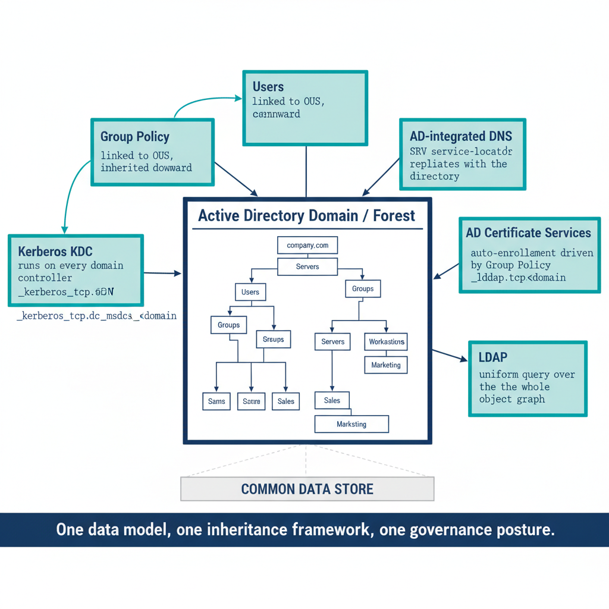

# Chapter 2 — Active Directory Domain Services — The Unified Substrate

::: {.callout-note}
## In this chapter
What Active Directory actually was as an architecture — the domain and forest
boundaries, the OU inheritance model, the Kerberos/DNS service-locator
coupling, LDAP as a universal query surface, and the FSMO/schema machinery —
together with the contemporary limitations that justify migrating away from it.
:::

## Architecture and Native Capabilities

Active Directory Domain Services is a directory service based on the Lightweight Directory Access Protocol (LDAP) and the X.500 directory information model, introduced by Microsoft with Windows 2000 Server and continuously extended through successive Windows Server releases. Its boundaries are precise and layered:

* **The domain** — simultaneously a replication boundary, an authentication boundary, and an administrative boundary.
* **The forest** — a collection of domains sharing a common schema, a common configuration partition, and transitive trust relationships with one another.
* **The Global Catalog** — holds a partial replica of every object in every domain, allowing forest-wide searches without traversing inter-domain referrals.
* **The forest root domain** — holds the Schema Master and Domain Naming Master FSMO roles, which govern schema modification and domain creation respectively, establishing a clear hierarchy of control over the directory's fundamental capabilities.

Within a domain, the **Organizational Unit (OU)** is the primary structural element. Derived from the X.500 `organizationalUnit` class, it exists for two inseparable purposes: to organize objects visually and conceptually, and to serve as the attachment point for governance mechanisms.

* **Group Policy Objects** are linked to OUs.
* **Administrative delegation** is expressed by setting Access Control Entries on OU objects.
* **Fine-grained password policies** (functional level 2008 and above) are applied through Password Settings Objects linked to global security groups — but the OU remains the primary policy-inheritance vehicle for the overwhelming majority of enterprise configuration.

> **Deterministic inheritance:** A GPO linked to a parent OU applies to all objects in all child OUs unless explicitly blocked by the *No Override* or *Block Inheritance* flags. This inheritance flows without any additional configuration. Placing an object in an OU is the act that determines which policies apply to it.

The Kerberos service-locator binding that ties authentication to DNS follows a
fixed record form:

```text
Client needs a domain controller
        │
        ▼
DNS query for SRV record:
   _kerberos._tcp.dc._msdcs.<domain>
        │
        ▼
DNS (AD-integrated zone) returns DC addresses
        │
        ▼
Client contacts KDC → obtains TGT → requests service tickets
```

{#fig-book-01-cpt-02-diagram-01 fig-alt="A central \"Active Directory domain / forest\" box with the OU tree inside it, and labeled arrows radiating to five tightly-coupled facets that all draw from the same store: Group Policy (linked to OUs, inherited downward), Kerberos KDC (runs on every domain controller), AD-integrated DNS (SRV service-locator records, replicates with the directory), AD Certificate Services (auto-enrollment driven by Group Policy), and LDAP (uniform query over the whole object graph). A footer band reads \"One data model, one inheritance framework, one governance posture\". Engineering blueprint style, white background, federal navy (#1F3A5F) for the directory core, teal (#1A9E8F) for the five facets, monospace labels for identifiers such as _kerberos._tcp.dc._msdcs.<domain>, no human figures, 16:9 landscape." width="85%"}

## Authentication, DNS Integration, and the Service Locator Model

Authentication in Active Directory is provided primarily by Kerberos version 5, with NTLM available as a fallback for legacy systems. The Kerberos KDC runs on every domain controller. When a client authenticates, it contacts the KDC to obtain a Ticket-Granting Ticket, which it then presents to obtain service tickets for specific resources. The KDC is located not through static configuration but through a dynamic DNS query, following a fixed record form:

```text
Client needs a domain controller
        │
        ▼
DNS query for SRV record:
   _kerberos._tcp.dc._msdcs.<domain>
        │
        ▼
DNS (AD-integrated zone) returns DC addresses
        │
        ▼
Client contacts KDC → obtains TGT → requests service tickets
```

This service-locator model means AD's authentication infrastructure is **inseparable** from its DNS infrastructure. DNS is not a convenience layered on top of AD; it is a required component of every authentication event. AD-integrated DNS zones are stored in the domain partition (or in dedicated application partitions) within the directory itself, and zone data replicates automatically with the directory replication topology. Dynamic DNS registration lets domain-joined machines register and update their own A and PTR records without administrator intervention, keeping the zone current as machines move and addresses change.

The **LDAP interface** provides a uniform query model for the entire directory. Any object — user, computer, group, OU, GPO link, certificate template, service connection point, schema class definition — is reachable through a standard LDAP query. The distinguished name of any object expresses its complete position in the directory hierarchy, from the object itself through every container and OU to the domain root. Tools that need an object's organizational context query its DN and parse the OU path; tools that need all objects in an OU issue a scoped LDAP search. This uniformity is not incidental — it is the feature that made Active Directory the governance substrate for an entire generation of enterprise tooling. Monitoring systems, security tools, provisioning engines, reporting platforms, and compliance scanners all built against LDAP because it provided a complete and consistent picture of the organization's identity and structural landscape.
## Replication, FSMO Roles, and Schema

Active Directory replication uses a **multi-master model**: every domain controller can accept writes and replicate changes to other domain controllers through a topology managed by the Knowledge Consistency Checker. Replication is governed by site topology, with site links defining the cost and schedule of inter-site replication — near-real-time within a site, scheduled across sites. Five Flexible Single Master Operations (FSMO) roles create exceptions to the multi-master model:

| FSMO role | Responsibility |
| :--- | :--- |
| **PDC Emulator** | Password changes and time synchronization. |
| **RID Master** | Allocates pools of Relative Identifiers to domain controllers for object creation. |
| **Infrastructure Master** | Tracks cross-domain group-to-user references. |
| **Schema Master** | Controls schema modifications. |
| **Domain Naming Master** | Controls domain creation and removal. |

These role holders are dependencies in the domain topology, and their loss creates operational degradation ranging from inconvenient to catastrophic depending on the role and the duration of the outage.

The **schema** defines every object class and attribute in the directory, and schema extensions are permanent: once an attribute or object class is added, it cannot be removed without restoring from backup — and even then its unique OID remains registered. This irreversibility is a significant operational constraint. Organizations that extended the AD schema for third-party products — Lync, Exchange, SCCM, custom applications — carry those extensions indefinitely, and they appear in the schema partition of every domain controller in the forest. The Schema Master must be available for any schema modification, and schema changes replicate to every domain controller in the forest before taking effect on most objects.

## Limitations of Active Directory in the Contemporary Environment

The limitations of Active Directory in contemporary federal IT are substantial and well understood. They fall into four areas:

**Network-perimeter dependency.** AD requires domain connectivity to function as designed. Machines that are not domain-joined receive no GPO; users not connected to the corporate network cannot authenticate through Kerberos; branch offices with poor connectivity experience replication lag and authentication failures when the WAN link to the nearest domain controller degrades. The perimeter-based model AD was built for — a trusted interior behind a firewall, with all managed endpoints inside it — no longer describes the environment federal agencies operate in. Mobile devices, remote workers, cloud-hosted workloads, and partner interconnections have eroded the perimeter, and AD's security model has not adapted to that erosion.

**A catastrophically tiered privilege model.** Domain Admins and Enterprise Admins have unrestricted access to every object in the domain or forest respectively. There is no native mechanism to constrain Domain Admin access to a subset of the directory — membership is either present or absent, and presence confers full control. The blast radius is correspondingly wide: compromise of a single Domain Admin credential, by any means, yields complete control over every identity, machine, policy, and secret in the domain.

* **Golden Ticket** — forges Kerberos tickets using the `krbtgt` account hash.
* **DCSync** — replicates all domain secrets from a compromised account.
* **Pass-the-Hash** — reuses NTLM credential material without requiring plaintext passwords.
* **Kerberoasting** — extracts service-account credentials from Kerberos service tickets.

> Each of these techniques exploits structural features of the Kerberos and NTLM protocols as implemented in AD, and none can be fully mitigated without replacing the underlying authentication architecture. AD is not merely aging; it is a perennial target for adversaries who have invested years in techniques that exploit its structural properties.

**GPO opacity.** For all its power, the GPO model is genuinely opaque. A Group Policy Object is a paired structure — a Group Policy Container in the directory and a Group Policy Template stored in the `SYSVOL` share of every domain controller. A machine's effective configuration is the product of all GPOs applying through site, domain, and OU linkage, filtered by WMI conditions and security-group membership, resolved through resultant-set-of-policy precedence rules, and applied by client-side extensions that interpret binary ADMX-encoded settings. No single tool presents that complete effective configuration in a human-readable, auditable form without running `gpresult` or RSOP on the machine itself. GPOs are not source-controlled by default; there is no native change history beyond the timestamp on the GPO container object. Whether a machine received the intended policy, whether that policy is still current, and whether a GPO changed after last application are not knowable without querying the machine directly — a significant limitation wherever continuous configuration assurance is required.
