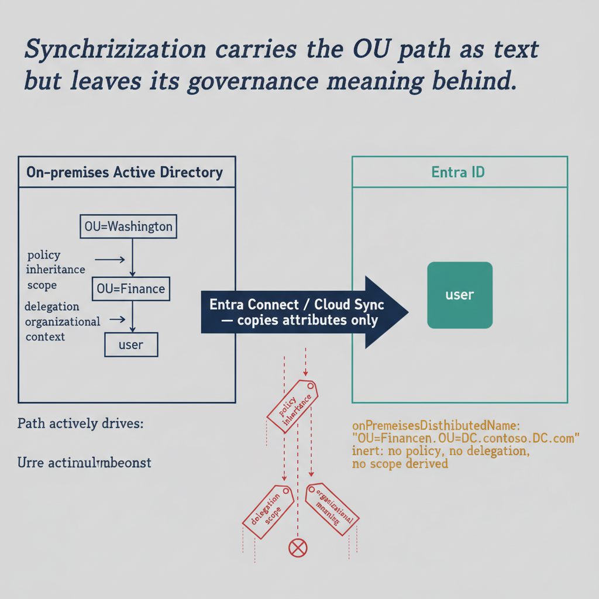

# Chapter 4 — Entra Connect and Cloud Sync — Synchronization Without Structure

::: {.callout-note}
## In this chapter
How Entra Connect and Cloud Sync move identities to the cloud — and the
critical distinction that synchronization copies object *attributes* but not
organizational *structure*: the OU path arrives as an inert string that no
platform capability consumes.
:::

## Architecture and Native Capabilities

Microsoft Entra Connect is the primary synchronization engine that copies identity objects from on-premises Active Directory to Entra ID. It operates through a connector-based architecture: the Active Directory Connector reads objects from one or more on-premises AD forests, transforms them through the Metadirectory using synchronization rules, and the Entra ID Connector writes the result to the cloud tenant. Objects synchronized include users, groups, contacts, and devices. Two filtering controls bound what crosses over:

* **Attribute-level filtering** controls which attributes of each object are included in the synchronized record — organizations can exclude sensitive attributes or include custom ones by configuring the synchronization rules engine.
* **OU-level filtering** scopes which portions of the on-premises directory are included: only objects within the selected OUs are synchronized, allowing administrative, service-account, or staging OUs to be excluded from the cloud tenant.

Entra Connect supports three authentication options for synchronized users:

| Option | How it authenticates |
| :--- | :--- |
| **Password hash synchronization (PHS)** | Copies a cryptographic hash of the user's password hash to Entra ID, allowing cloud authentication without network connectivity back to on-premises infrastructure. |
| **Pass-through authentication (PTA)** | Forwards cloud sign-in attempts through a lightweight agent to on-premises domain controllers, keeping credential validation on premises. |
| **Federation (AD FS)** | Redirects authentication to an on-premises or cloud-hosted claims provider, enforcing on-premises authentication policies for cloud access. |

**Seamless single sign-on**, available with both PHS and PTA, lets domain-joined devices authenticate to Entra ID silently using Kerberos tickets obtained from the domain. **Writeback** features — password, group, and device writeback — propagate certain changes made in Entra ID back to on-premises AD, enabling a degree of bidirectional consistency for specific attribute domains.

**Microsoft Entra Cloud Sync** is a lighter-weight alternative that uses a cloud-hosted provisioning engine with a minimal on-premises agent rather than the full Entra Connect infrastructure. Designed primarily for multi-forest scenarios and to reduce operational complexity, its provisioning scope is configured through the cloud portal and it supports a subset of the full engine's transformation and filtering capabilities. It suits organizations with simpler synchronization requirements, or multi-forest architectures where the Entra Connect agent deployment model is operationally impractical.

{#fig-book-01-cpt-04-diagram-01 fig-alt="Left side labeled \"On-premises Active Directory\" shows a nested OU tree (OU=Washington → OU=Finance → user) where the path actively drives policy inheritance, delegation scope, and organizational context. A wide arrow labeled \"Entra Connect / Cloud Sync — copies attributes only\" crosses to the right side labeled \"Entra ID\", where the same user appears as a flat object whose onPremisesDistinguishedName attribute holds the path as a quoted string, annotated \"inert: no policy, no delegation, no scope derived\". Below the arrow, three small tags — policy inheritance, delegation scope, organizational meaning — are shown dropping away rather than crossing. Engineering blueprint style, white background, federal navy (#1F3A5F) for the AD tree, teal (#1A9E8F) for the Entra object, amber (#D4A017) for the carried-but-inert string, red (#C0392B) for the dropped governance tags, monospace identifiers, no human figures, 16:9 landscape." width="85%"}

## What Synchronization Carries and What It Does Not

> **The synchronization paradox:** Synchronization copies object *attributes*. It does not copy organizational *structure*.

When an Entra Connect run processes a user object in the on-premises AD, it reads the configured attributes of that user — including, by default, the `onPremisesDistinguishedName` attribute, which carries the full LDAP path of the user in the AD directory tree — and writes those attributes to the corresponding user object in Entra ID.

```text
Active Directory (hierarchical structure)
└── OU=Washington
    └── OU=Finance
        └── CN=User01  ──[ sync engine copies attributes ]──▶  Entra ID user object
                                                               └── onPremisesDistinguishedName:
                                                                     "CN=User01,OU=Finance,OU=Washington,DC=corp"
                                                                   (inert string — no policy flows from it)
```

The distinguished name is available as a string property on the synchronized user object, telling any reader who queries it where the user sat in the on-premises OU hierarchy at the time of the last sync. But **that information is inert.** No native Entra ID capability reads `onPremisesDistinguishedName` and derives from it any policy application, scope assignment, or governance posture. The string sits in the attribute, unused by the platform itself.
This is a critical distinction often overlooked during migration planning. The OU path of a user is *preserved* in Entra ID only in the sense that the string is queryable through Graph API. It is *not* preserved in the sense that matters for governance: no policy flows from it, no delegation is derived from it, and no platform capability consumes it as structural information. The OU hierarchy exists in Active Directory; a shadow of its path expression appears as a string value in a synchronized attribute. The governance meaning of that path — the policy inheritance, the delegation scope, the organizational context — does not make the journey. It remains in the on-premises system, and when that system is decommissioned, the governance meaning disappears with it, leaving only the string.

> **The authoritative-source trap:** Synchronization is unidirectional in its authoritative-source model. Synchronized objects are mastered on-premises — the on-premises AD is the source of truth, and changes to synchronized attributes made directly in Entra ID are overwritten on the next cycle.

This creates a dependency loop. An organization decommissioning Active Directory cannot fully migrate management authority to the cloud until synchronization itself is retired — yet the synchronization relationship must be maintained as long as on-premises AD remains the master, and on-premises AD must remain the master as long as synchronization is running. Breaking out requires converting synchronized objects to cloud-native objects: a process that demands careful planning and severs the link between the cloud identity and the on-premises identity, with implications for every application and service that references the on-premises `objectSid` or `objectGuid`.
