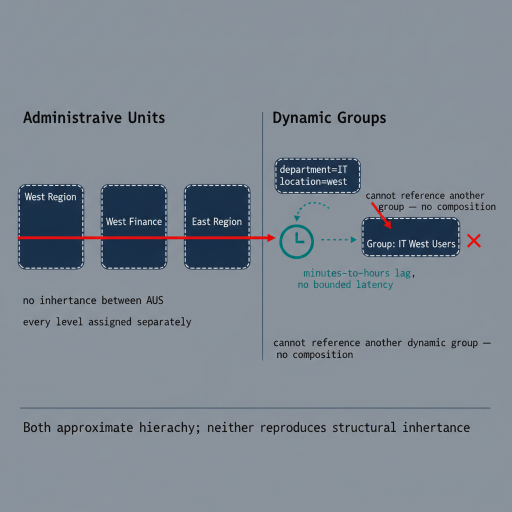

# Chapter 6 — Administrative Units and Dynamic Groups — Partial Compensation for Missing Structure

::: {.callout-note}
## In this chapter
The two Entra ID features most often proposed as substitutes for OU structure
— Administrative Units and dynamic groups — and the specific reasons each is a
*partial* compensation: AUs do not nest or inherit, and dynamic groups are
asynchronous and cannot be composed.
:::

## Administrative Units

Administrative Units (AUs) are scoped containers in Entra ID that allow directory roles to be assigned with a restricted scope. When an administrator is assigned the User Administrator role scoped to an AU, they can manage only the users who are members of that AU — they cannot view, modify, or reset credentials for users outside its membership. AUs can similarly scope the Password Administrator, Authentication Administrator, Groups Administrator, and Helpdesk Administrator roles.

This provides a real delegation mechanism for personnel who should not have tenant-wide access: an agency's regional helpdesk can be given password-reset capability scoped to the AU representing their region's user population, without being able to affect users in other regions. AU membership can be managed two ways:

* **Manually** — direct administrative assignment of individual users, groups, or devices.
* **Dynamically** — membership rules that evaluate user or device attributes against specified conditions, automatically adding or removing objects as their attributes change.

> **The architectural absence:** Administrative Units do not create inheritance between themselves. Each AU is a discrete, independent container. There is no parent-child relationship between AUs, and no way to build an AU hierarchy in which roles assigned to a parent AU flow down to apply within all child AUs.

```text
Active Directory subtree delegation        Entra ID flat Administrative Units
   [Agency Root]                              ┌──────────────┐
        │                                     │ West Region  │ ── role assigned explicitly
        ▼                                     └──────────────┘
   [West Region] ── role assigned here        ┌──────────────┐
        │            covers all children      │ West Finance │ ── role must be assigned again
        ▼                                     └──────────────┘
   [West Finance]                             (no structural relationship, no role flow)
```

Building a multi-level organizational structure with AUs therefore requires a separate AU for each level, independent membership management for each AU, and independent role assignments at each level. There is no native model for expressing that a role assigned at the division level implies a subset of that authority at a unit level within it. When a user's organizational position changes — they move from one division to another — their AU membership must be updated explicitly, either through a manual reassignment or through an attribute change that triggers a dynamic-membership evaluation. The platform does not propagate any consequence of an organizational move beyond the attribute values that are directly updated.

## Dynamic Groups

Dynamic groups automatically maintain their membership based on rules that evaluate user or device attributes against specified conditions — for example, all users whose `department` equals "Finance" and whose `accountEnabled` is true. The Entra ID service evaluates these rules against all objects in the tenant and updates membership whenever relevant attributes change. Rules support a range of operators — equals, not equals, starts with, ends with, contains, not contains, match (regular expression), and others — against a defined set of queryable attributes. Dynamic groups can target application assignment, license assignment, Conditional Access scoping, Intune policy targeting, and Entra ID Governance access-package assignment, making them a central mechanism for policy application in the flat directory.

They carry three structural constraints:

* **Asynchronous processing.** When an attribute changes, the service must re-evaluate every group whose rule references that attribute and update membership accordingly. This is not instantaneous — in large tenants with complex rule sets, updates can lag changes by minutes to hours. During that window, actual membership does not reflect current attributes, and any policy, application assignment, or license grant depending on that membership is not yet accurate.
* **No bounded latency, no staleness alert.** The platform provides no native alert when membership is known to be stale or an update is pending, and no platform-guaranteed maximum latency. Microsoft documents the lag as expected behavior, but it is not bounded in a way that lets organizations make definitive statements about the currency of their policy application at any given moment.
* **No composition.** Dynamic groups cannot reference other dynamic groups in their rules. A rule expressing "members of Group A whose attribute also satisfies condition B" cannot be constructed — rules evaluate directory attributes directly, not group memberships. Nested dynamic logic requires separate groups with separate rules and cannot be expressed as a dependency chain.

{#fig-book-01-cpt-06-diagram-01 fig-alt="Left panel \"Administrative Units\" shows three independent flat boxes (West Region, West Finance, East Region) with a red \"no inheritance between AUs\" bar across them and a note \"every level assigned separately\". Right panel \"Dynamic Groups\" shows an attribute change on a user object flowing through an asynchronous queue clock icon labeled \"minutes-to-hours lag, no bounded latency\" into group membership, with a second note \"cannot reference another dynamic group — no composition\". A footer caption reads \"Both approximate hierarchy; neither reproduces structural inheritance\". Engineering blueprint style, neutral slate background, federal navy (#1F3A5F) for AU boxes, teal (#1A9E8F) for the dynamic-group flow, red (#C0392B) for the failure-mode markers, monospace attribute labels, no human figures, 16:9 landscape." width="85%"}

The consequence is that organizational hierarchies expressed through dynamic groups must be reconstructed at each level with independent rules. Any change to the organizational taxonomy requires reviewing and updating every affected group's rule, with no native tooling to identify which rules must change as a result of a structural reorganization.
