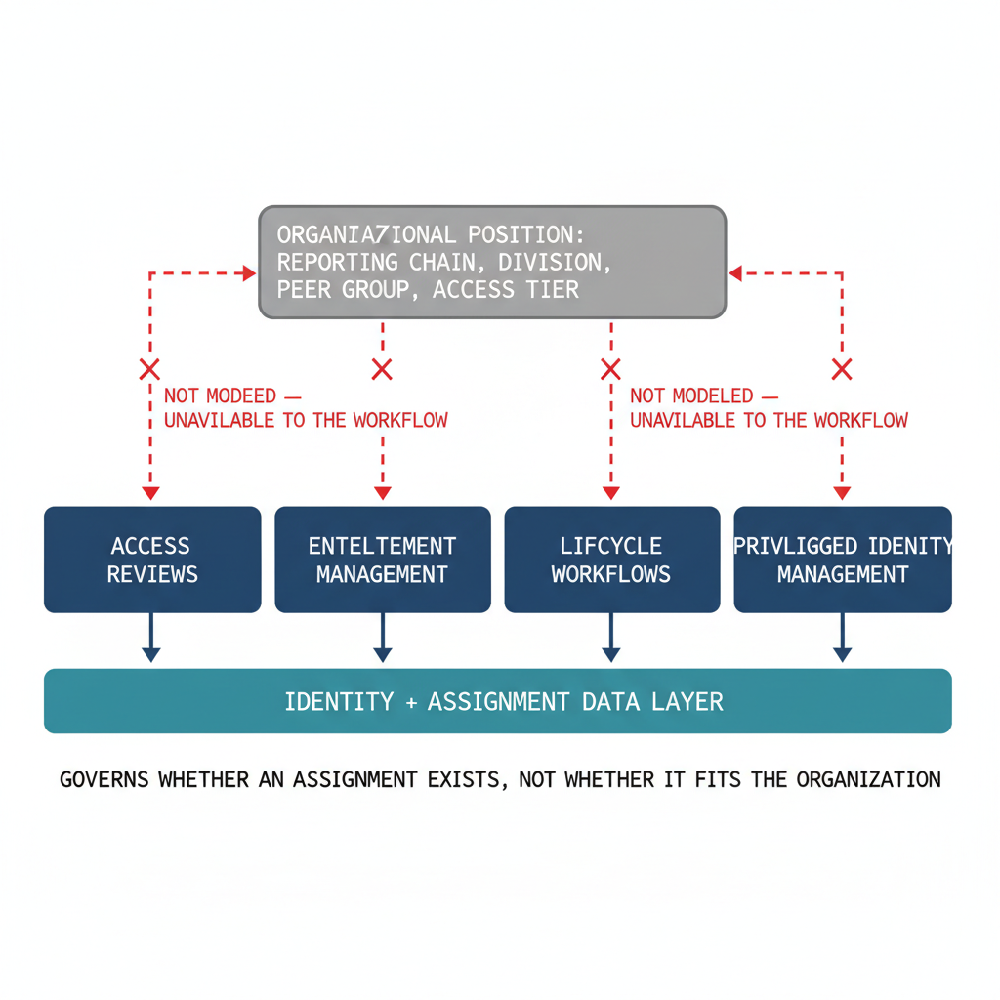

# Chapter 7 — Entra ID Governance — Lifecycle Management at the Identity Level

::: {.callout-note}
## In this chapter
The four capabilities of Entra ID Governance — Access Reviews, Entitlement
Management, Lifecycle Workflows, and Privileged Identity Management — and the
single limitation they share: each operates at the identity-and-assignment
level, with no authoritative model of organizational position to reason from.
:::

## Architecture and Native Capabilities

Entra ID Governance is a licensed capability set that extends the core platform with tools for managing the lifecycle of identities and their access to resources. It encompasses four primary capabilities:

| Capability | What it does |
| :--- | :--- |
| **Access Reviews** | Periodic, structured prompts to designated reviewers to attest that specific users should retain access to specific resources or roles (application access, group membership, directory-role membership, or privileged-role eligibility). On expiry, the platform can act automatically on un-reviewed items — typically removing access — reducing the burden of maintaining least privilege over time. |
| **Entitlement Management** | A catalog and access-package model: administrators define catalogs of resources and bundle them into access packages representing the rights needed for a role or function. Users or groups request packages through a self-service portal, triggering an approval workflow before access is granted. |
| **Lifecycle Workflows** | Automate provisioning and deprovisioning tasks triggered by HR-driven lifecycle events — onboarding, internal transfers, offboarding — through configurable tasks executed when the triggering condition is met. |
| **Privileged Identity Management (PIM)** | Just-in-time activation for Entra ID directory roles and Azure RBAC roles: an administrator is *eligible* for a privileged role without holding it permanently, and must explicitly activate it with justification, optional approval, and a time-bounded window. |

{#fig-book-01-cpt-07-diagram-01 fig-alt="A horizontal row of four capability cards — Access Reviews, Entitlement Management, Lifecycle Workflows, Privileged Identity Management — each drawn over a single \"identity + assignment\" data layer they can read. Above them, a separate greyed-out box labeled \"Organizational position: reporting chain, division, peer group, access tier\" connects to each card with a dashed red line broken by an X labeled \"not modeled — unavailable to the workflow\". A footer note reads \"Governs whether an assignment exists, not whether it fits the organization\". Engineering blueprint style, white background, federal navy (#1F3A5F) for capability cards, teal (#1A9E8F) for the identity layer, red (#C0392B) for the broken organizational-context links, monospace labels, no human figures, 16:9 landscape." width="100%"}

## Limitations of Entra ID Governance

> **The shared blind spot:** Entra ID Governance operates at the identity and role-assignment level, not at the organizational-structure level. None of its four capabilities has an authoritative record of organizational position to reason from.

The limitation shows up distinctly in each capability:

* **Access Reviews evaluate assignments, not appropriateness.** A review asks whether a specific user should retain a specific assignment — but it cannot evaluate whether that assignment is appropriate *given the user's organizational position*, because that position is not modeled. A reviewer attesting to membership of the Global Administrator role sees each member's display name, principal name, and last sign-in date — not their organizational placement, reporting chain, or peer group. The contextual information that would let the reviewer judge whether the assignment is structurally appropriate does not exist as structured data in the directory.
* **Entitlement Management cannot derive the right package.** The access-package model requires administrators to define the appropriate bundles for each role or position, and to create and maintain those definitions manually. There is no mechanism by which the system derives what package is appropriate for a user from their organizational placement — the placement is not modeled, and the inference from position to appropriate access is not a capability the platform provides.
* **Lifecycle Workflows depend on custom HR mapping.** Workflows address the joiner-mover-leaver lifecycle by triggering on attribute values provided by the HR system — but the mapping between HR organizational data and the Entra ID attribute model is a custom integration requirement. HR systems express structure in their own models (cost-center codes, position identifiers, supervisory relationships), and translating those into Entra ID attributes a workflow can consume requires an integration layer each organization must build and maintain.
* **PIM gates activation, not relevance.** PIM manages role activation but does not evaluate the appropriateness of a role relative to the user's organizational context. A PIM-eligible assignment entirely inconsistent with a user's actual function will activate on request as long as the configured approval workflow is satisfied — because the workflow has no access to organizational context and the platform provides no mechanism to supply it.

::: {.callout-note title="The custom HR mapping, supplied"}
The integration layer this chapter identifies as a gap — translating HR organizational data into a directory attribute the governance model can consume — is exactly what the OrgPath substrate provides. The doctrine that the HR system of record is the authoritative source for organizational placement is fixed in [ADR-088](/docs/adr/adr-088-hr-as-orgtree-truth-source.html), and the HR-agnostic provisioning pipeline that implements the mapping is detailed in Book 04, [Chapter 9A — HR-Driven OrgPath Provisioning](Book_04_CPT_09a.qmd).
:::
