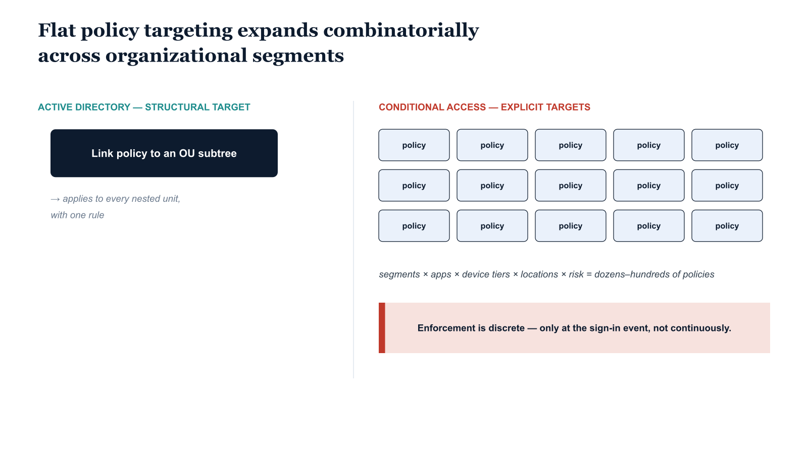

# Chapter 9 — Conditional Access — Signal-Based Policy Without Structural Inheritance

::: {.callout-note}
## In this chapter
How Conditional Access evaluates every authentication request against matching
policies — and two structural limits: enforcement is *discrete* (bound to the
authentication event, not the session), and targeting is *flat* (explicit
users and groups), which drives a combinatorial explosion of policies in large
agencies.
:::

## Architecture and Native Capabilities

Conditional Access is Entra ID's authentication policy engine. It evaluates every authentication request against a configured set of policies and decides whether to allow access, require additional verification, or block the request entirely. The evaluation model is **comprehensive-by-default**: all policies whose assignment conditions match the event are evaluated simultaneously, and grant controls are applied least-privilege — if any matching policy requires MFA, MFA is required regardless of whether others do not.

The model has three moving parts:

* **Assignment conditions** (when a policy matches) — the user/group identity of the principal, the application or service principal being accessed, the device platform and Intune-reported compliance state, the network location (named location or IP range), the sign-in risk level, the user risk level, and the authentication strength of the method used.
* **Grant controls** (what the user must satisfy) — completing MFA, presenting a compliant device, presenting a hybrid Azure AD joined device, using an approved client application, or satisfying a defined authentication strength.
* **Session controls** (enforcement beyond the grant) — sign-in frequency (how long a session remains valid before re-authentication), Conditional Access App Control (proxies sessions through Defender for Cloud Apps for real-time monitoring), and application-enforced restrictions (passes device compliance and domain-join state into the application).

## Limitations of the Conditional Access Policy Model

> **Discrete, not continuous:** Conditional Access policies apply to authentication *events*. A session that passes evaluation at sign-in is not re-evaluated for the duration of that session unless sign-in frequency forces a re-authentication.

Changes to a user's group membership, device compliance state, or risk level that occur after a session is established do not retroactively affect that session — they affect only future authentication events. The enforcement window is therefore discrete: the policy state at authentication time determines session access, and the organization's posture *between* authentication events is governed by controls outside the Conditional Access engine.

The second limit is structural: **Conditional Access has no concept of organizational structure.** Policies target users and groups explicitly. A policy cannot target "all users in division X and all subordinate organizational units" unless a group exists containing exactly those users — and that group must be maintained as the organization evolves.

```text
Active Directory (structural target)      Conditional Access (explicit target)
   Link GPO to:                              Target policy to:
   └── OU=Washington                         ├── Group: Washington-Staff
       └── (applies to all nested units)     ├── Group: Washington-Finance
                                             └── Group: Washington-HR
                                             (every group enumerated explicitly)
```

In a large federal agency, this flat targeting produces a **combinatorial explosion of policies.** The number required to express differentiated rules across organizational segments, application types, device tiers, network locations, and risk levels grows multiplicatively: each additional segment warranting differentiated treatment requires at minimum one more policy, and each additional application type or network boundary multiplies the count further.

{#fig-book-01-cpt-09-diagram-01 fig-alt="Left side shows one Active Directory OU link cleanly covering a nested subtree. Right side shows a grid where rows are organizational segments and columns are application type × device tier × network location × risk level, with a cell at each intersection requiring its own Conditional Access policy — the grid visibly dense, annotated \"dozens-to-hundreds of policies; combined effect hard to verify\". A small inset notes \"report-only mode evaluates one policy in isolation, not the whole set against a user+device\". Engineering blueprint style, neutral slate background, federal navy (#1F3A5F) for the AD subtree, teal (#1A9E8F) for the policy grid, amber (#D4A017) for the verification-difficulty callout, monospace labels, no human figures, 16:9 landscape." width="85%"}

The result in large, complex tenants is a policy set of dozens or hundreds of individual policies whose combined effect is difficult to reason about holistically, impossible to verify for completeness without custom tooling, and challenging to maintain as the organization and its applications evolve. The platform's "report-only" mode helps evaluate a new policy's impact before enforcement — a valuable capability — but it evaluates individual policies in isolation, not the combined effect of the entire policy set against a given user-and-device combination.
