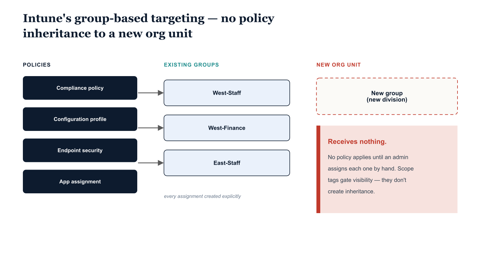

# Chapter 10 — Microsoft Intune — Device Management Without Organizational Inheritance

::: {.callout-note}
## In this chapter
Intune's enrollment channels and Windows configuration surface, and the core
limitation it inherits from the flat directory: every policy is targeted by
explicit group assignment, with no inheritance — so a new organizational unit
receives nothing until each policy is manually assigned to it.
:::

## Architecture and Native Capabilities

Microsoft Intune is Microsoft's cloud-native unified endpoint management platform, providing Mobile Device Management (MDM) and Mobile Application Management (MAM) for Windows, macOS, iOS, iPadOS, and Android. Devices enroll through multiple channels:

* **Windows Autopilot** — zero-touch provisioning of new Windows devices.
* **Company Portal** — user-initiated enrollment on personal or corporate devices.
* **Co-management enrollment** — for devices already managed by Configuration Manager.
* **Bulk enrollment** — provisioning packages or device-enrollment programs for iOS and Android.

Once enrolled, a device receives its assigned configuration profiles, compliance policies, application assignments, and endpoint-security policies, applied through the protocol appropriate to the platform — OMA-DM for Windows, MDM for Apple platforms, the Android Management API for Android Enterprise.

Windows configuration is delivered through three profile types:

| Profile type | What it delivers |
| :--- | :--- |
| **Settings Catalog** | Individual Windows settings through a searchable interface drawing from the same Windows CSP registry as the underlying MDM protocol, organized by category. |
| **Administrative Templates** | The same ADMX-backed settings Group Policy provides, delivered through the MDM channel rather than the Group Policy Client service. |
| **Custom OMA-URI** | Any Windows CSP setting, configured directly by specifying the full CSP path and value — a fallback for settings not yet exposed through the other two. |

Endpoint-security policies deliver purpose-built profiles for Microsoft Defender Antivirus, Windows Firewall, EDR onboarding, Attack Surface Reduction rules, and Account Protection. Application deployment supports Win32 apps (`.intunewin` packages), Line-of-Business apps (MSIX/MSI), Microsoft Store apps, and web links, with deployment intents of Required, Available, or Uninstall applied to user and device groups.

{#fig-book-01-cpt-10-diagram-01 fig-alt="Center shows a set of policy objects (compliance policy, configuration profile, endpoint-security policy, app assignment), each connected by an explicit assignment arrow to existing device groups (Washington-Division, Washington-Finance). A newly created group \"Washington-NewUnit\" sits to the side with dashed empty arrows and a red label \"no policy applies until each is assigned by hand\". A separate lower band shows \"scope tags\" wrapping the policies with a note \"controls admin visibility only — does not cause any policy to apply to the device\". Engineering blueprint style, white background, federal navy (#1F3A5F) for policy objects, teal (#1A9E8F) for existing groups, red (#C0392B) for the unassigned new unit, amber (#D4A017) for the scope-tag band, monospace labels, no human figures, 16:9 landscape." width="85%"}

## Limitations of the Intune Policy Model

> **Entirely group-based, no inheritance:** Every policy — every compliance policy, configuration profile, endpoint-security policy, and application assignment — is deployed by assigning it to one or more Entra ID user or device groups. There is no inheritance model.

A configuration profile assigned to a group representing the Washington Division does **not** automatically apply to members of groups representing units within that division. Each assignment relationship between a policy and a population must be created explicitly. The reorganization cost is direct: when a new organizational unit is established and a new group created to represent it, no existing policy applies to its members, because none has been explicitly assigned. The administrator must identify every policy that should apply and create an explicit assignment for each one — there is no native mechanism for deriving which policies apply to a new segment from its position in a hierarchy, because no hierarchy exists in the targeting model.
Two related mechanisms are sometimes mistaken for inheritance, but are not:

* **Scope tags** limit which administrators can see and manage specific Intune resources by tagging resources and restricting administrator visibility to resources carrying their assigned tags — a regional Intune administrator tagged for the West region cannot see or modify resources tagged for the East. But scope tags do **not** create policy inheritance: tagging a device with a regional scope tag does not cause any policy associated with that region to apply to it. The tag controls administrative access to the resource, not the policy posture of the resource itself.
* **Co-management** with Configuration Manager, used during transition from the on-premises model, introduces a split state in which some policy categories are governed by Intune (device compliance, modern application deployment, Windows Update for Business) while others remain with Configuration Manager (SCCM application deployment, custom script execution, some endpoint-security policies) — and the workload split must be configured and maintained explicitly for every applicable category.

There is no native model in Intune for the concept that devices in one organizational segment should receive a superset of the policies applied to devices in a parent segment. Each policy association must be constructed, verified, and maintained as an independent assignment.
