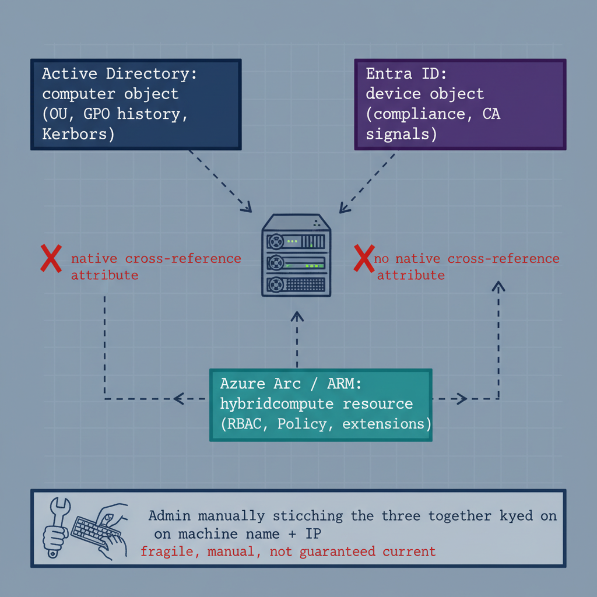
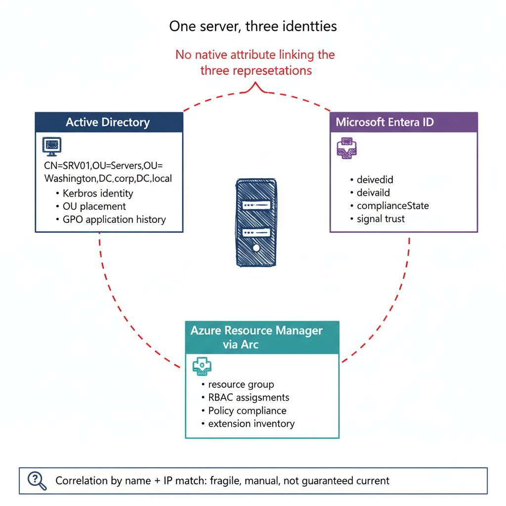

# Chapter 11 — Azure Arc — Hybrid Management Without a Common Identity Model

::: {.callout-note}
## In this chapter
How Azure Arc projects non-Azure servers into the Azure Resource Manager and
governs them through Azure-native tooling — and the identity-fragmentation
problem it creates: one physical server ends up with three unlinked identity
representations across AD, Entra ID, and Arc.
:::

## Architecture and Native Capabilities

Azure Arc extends the Azure control plane to servers that are not hosted in Azure. The Connected Machine Agent, installed on a Windows or Linux server running on-premises, in another cloud, or at an edge location, registers the server as a resource in the Azure Resource Manager (ARM). Once enrolled, the Arc-enabled server appears as a resource of type `microsoft.hybridcompute/machines` and can be governed through Azure Policy, monitored through Azure Monitor, and administered through Azure RBAC — exactly as if it were an Azure virtual machine.

A set of extensions layers management capability onto the enrolled server:

* **Azure Monitor Agent** — collects Windows event logs, performance counters, and custom log sources into a Log Analytics workspace, feeding the same analytics and alerting infrastructure that monitors Azure-native workloads.
* **Defender for Servers** — extends EDR coverage to Arc-enrolled servers through the Defender for Endpoint sensor, providing behavioral threat detection and attack-surface reduction on on-premises and multi-cloud workloads.
* **Azure Policy Guest Configuration** — extends policy enforcement to OS settings, expressing desired state through PowerShell Desired State Configuration (DSC) resources evaluated by a local extension; compliance is reported in the Azure Policy dashboard alongside Azure resources.
* **Update Manager** — centralized patch assessment and update deployment, scheduling patching windows and reporting compliance without the on-premises WSUS infrastructure Configuration Manager traditionally provided.
* **Change Tracking and Inventory** — tracks changes to installed software, Windows services, Linux daemons, registry keys, and files, generating change records in a Log Analytics workspace for audit and investigation.

## Limitations: The Identity Fragmentation Problem

Azure Arc enrolls servers into the Azure Resource Manager — but the hierarchy into which they are enrolled (management groups, subscriptions, resource groups) is an Azure administrative and billing taxonomy, **not** an organizational governance taxonomy. The management-group tree is constructed by Azure administrators for Azure purposes: RBAC delegation, Azure Policy scope, and subscription organization, maintained independently of every other organizational model in every other Microsoft tool.

An Arc-enrolled server that was previously managed by a specific OU in Active Directory carries no awareness of that relationship after enrollment. The Arc agent does not read the machine's OU membership, does not import the GPO settings previously applied to it, and does not replicate the on-premises organizational context into ARM. The server is placed in a resource group by whoever performs the enrollment, and that resource group's position in the management-group hierarchy is the entirety of its governance context within Azure.

> **Three identities, one server:** A single physical server in a federal environment can simultaneously hold three distinct identity representations in three separate systems — and they are not natively linked.

| System | Representation | What it carries |
| :--- | :--- | :--- |
| **Active Directory** | Computer object | Domain membership, OU placement, GPO application history, Kerberos identity. |
| **Microsoft Entra ID** | Device object | Compliance state and Conditional Access signals (via hybrid Azure AD join or direct registration). |
| **Azure Resource Manager (Arc)** | `microsoft.hybridcompute/machines` resource | Azure RBAC assignments, Policy compliance state, extension inventory. |

There is no attribute on the Arc resource that references the AD computer object, no attribute on the Entra ID device object that references the Arc resource, and no native query that traverses all three systems to produce a unified view of a single machine's identity and governance context. Administrators who need the complete governance posture of a server must query each system independently and correlate the results by machine name or IP address — correlation that is fragile, manual, and not guaranteed to be current.

{#fig-book-01-cpt-11-diagram-01 fig-alt="A single server icon at center with three arrows to three separate plane-boxes — \"Active Directory: computer object (OU, GPO history, Kerberos)\", \"Entra ID: device object (compliance, CA signals)\", and \"Azure Arc / ARM: hybridcompute resource (RBAC, Policy, extensions)\". Between the three boxes, dashed connectors are drawn but each is broken by a red X labeled \"no native cross-reference attribute\". A footer band shows an admin manually stitching the three together keyed on machine name + IP, labeled \"fragile, manual, not guaranteed current\". Engineering blueprint style, neutral slate background, federal navy (#1F3A5F) for the AD plane, purple (#5B2D8E) for the Entra plane, teal (#1A9E8F) for the Arc plane, red (#C0392B) for the broken links, monospace identifiers, no human figures, 16:9 landscape." width="85%"}

{#fig-01-microsoft-identity-and-governance-stack-diagram-02 fig-alt="A single physical server icon at the center labeled \"One server, three identities\". Three labeled regions arranged around it with no connecting arrows between the regions — top-left region \"Active Directory\" shows a computer object with the distinguished name CN=SRV01,OU=Servers,OU=Washington,DC=corp,DC=local and a stack of attributes beneath it (Kerberos identity, OU placement, GPO application history); top-right region \"Microsoft Entra ID\" shows a device object with attributes (deviceId, complianceState, signal trust); bottom region \"Azure Resource Manager via Arc\" shows a resource object of type microsoft.hybridcompute/machines with attributes (resource group, RBAC assignments, Policy compliance, extension inventory). A red dashed bracket spans all three regions with the label \"No native attribute linking the three representations\". A small footer panel below shows an administrator query icon with the text \"Correlation by name + IP match: fragile, manual, not guaranteed current\". Engineering blueprint style, neutral slate background, federal navy (#1F3A5F) for AD region, purple (#5B2D8E) for Entra region, teal (#1A9E8F) for Arc region, red dashed accent (#C0392B) for the gap bracket, no human figures, 16:9 landscape." width="85%"}
