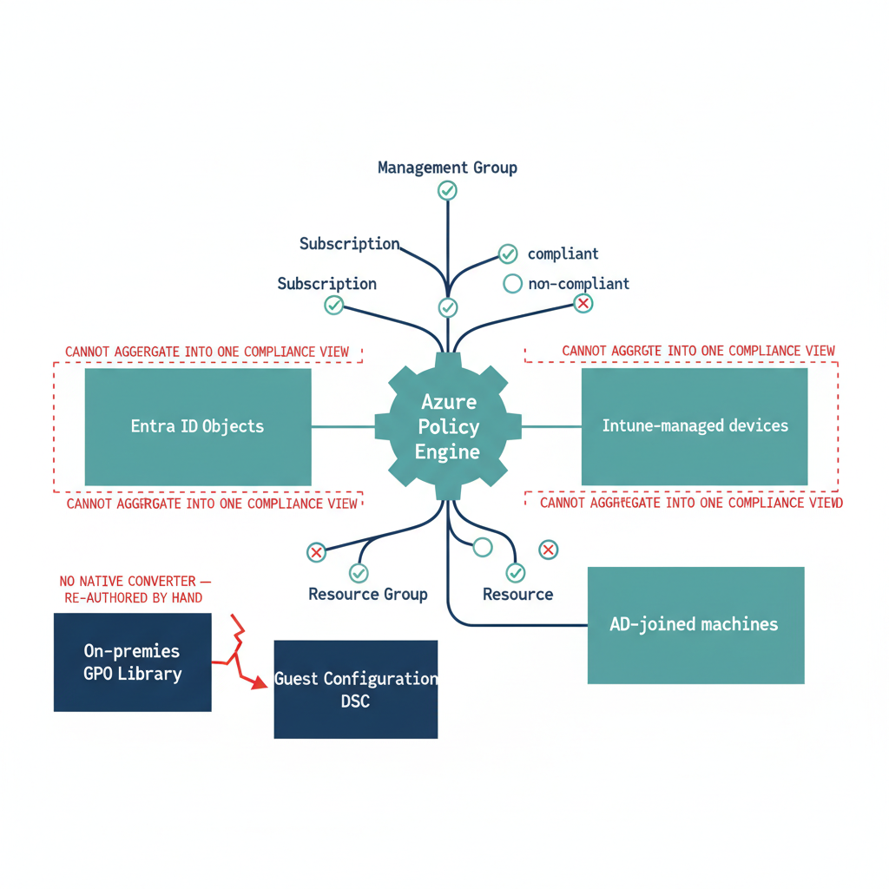

# Chapter 12 — Azure Policy — Enforcement Without Cross-Platform Coherence

::: {.callout-note}
## In this chapter
Azure Policy's JSON rule model, effects, and ARM-hierarchy scoping — and why
its scope is the Azure *administrative/billing* taxonomy rather than an
organizational one, leaving it unable to aggregate compliance across the
identity, device, and on-premises surfaces.
:::

## Architecture and Native Capabilities

Azure Policy is the governance enforcement engine for the Azure Resource Manager ecosystem. Policy definitions express rules in JSON that evaluate the properties of Azure resources against specified conditions and apply effects when those conditions are met or violated. The built-in library covers thousands of configurations drawn from security benchmarks — the Microsoft Cloud Security Benchmark, CIS Controls, NIST SP 800-53, FedRAMP, and others — plus regulatory and operational standards.

Policy effects range in aggressiveness:

| Effect | Behavior |
| :--- | :--- |
| **Audit** | Records non-compliant resources in the compliance dashboard without blocking them. |
| **Deny** | Prevents resource creation or modification that would violate the policy. |
| **Append** | Adds specified fields to the resource payload during creation. |
| **Modify** | Changes resource properties during creation or update. |
| **DeployIfNotExists** | Deploys a related resource or configuration if it does not exist on the target. |
| **AuditIfNotExists** | Audits the absence of a related resource or configuration. |

Policies are grouped into **initiatives** — collections of related policies assigned together as a unit — simplifying management of complex compliance frameworks. Assignment scope follows the ARM hierarchy: management groups, subscriptions, resource groups, and individual resources. An initiative assigned at the management-group level applies to all subscriptions and resource groups within it, and remediation tasks can automatically bring non-compliant resources into compliance by triggering the `DeployIfNotExists` effect against identified gaps. The compliance dashboard presents aggregate compliance percentages per policy and initiative, with drill-down to specific non-compliant resources. The Guest Configuration integration extends this enforcement surface to the OS layer of Arc-enrolled servers, as described in the preceding chapter.

{#fig-book-01-cpt-12-diagram-01 fig-alt="Center shows the Azure Policy engine bound to the ARM scope tree (management group → subscription → resource group → resource) with green compliant/non-compliant indicators. Around it sit three other surfaces — \"Entra ID objects\", \"Intune-managed devices\", \"AD-joined machines\" — each separated from the engine by a dashed boundary marked \"cannot aggregate into one compliance view\". A side note shows the on-premises \"GPO library\" with a broken arrow to \"Guest Configuration DSC\" labeled \"no native converter — re-authored by hand\". Engineering blueprint style, white background, federal navy (#1F3A5F) for the ARM tree, teal (#1A9E8F) for the policy engine, red (#C0392B) for the surface boundaries and broken converter, monospace labels, no human figures, 16:9 landscape." width="85%"}

## Limitations of Azure Policy's Scope and Integration

> **The wrong hierarchy:** Azure Policy operates exclusively on ARM resources, and its scope hierarchy is the Azure administrative/billing taxonomy — not the organizational governance taxonomy.

When a policy is assigned at the management-group level, it applies to all subscriptions and resource groups within that management group — a scope defined by the Azure billing and administrative hierarchy, which may or may not correspond to the organization's actual governance boundaries. The management-group tree must be constructed and maintained independently of every other organizational model, and its structure reflects Azure resource-organization decisions made during adoption — frequently driven by billing and RBAC-delegation needs rather than the agency's organizational governance structure.

The second limitation is the absence of a unified compliance surface:

* **Reporting is confined to the Azure resource hierarchy.** The dashboard reports on Azure resources and Arc-enrolled servers within the assigned scope. It cannot aggregate compliance across a combined surface that includes Entra ID objects, Intune-managed devices, AD-joined machines, and Azure resources in a single view. An organization wanting that unified posture must build it through custom queries in Microsoft Sentinel, Azure Monitor, or the Defender portal — each requiring custom data collection and query development to produce a structurally coherent result.
* **Guest Configuration is not a GPO bridge.** The Guest Configuration capability for Arc-enrolled servers enforces OS settings expressed as DSC configurations, but those configurations must be authored independently of the on-premises GPO library. There is no native tool that converts GPO settings to Guest Configuration DSC resources; each policy area must be re-expressed in DSC by engineers who understand both the GPO setting and its DSC equivalent.
* **No cross-engine integration.** There is no native integration between Azure Policy compliance state and Conditional Access grant decisions, Intune device-compliance status, or Entra ID Governance access-review results.
