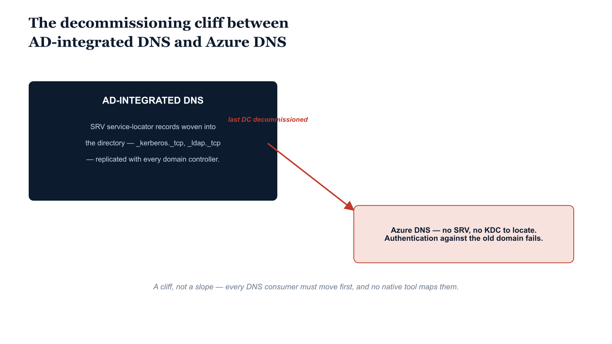

# Chapter 13 — Active Directory DNS and Azure DNS — Two Resolution Models with No Native Bridge

::: {.callout-note}
## In this chapter
The two DNS models — AD-integrated zones woven into the directory and its
service-locator records, versus Azure DNS public/private zones — and why
decommissioning domain controllers is a *cliff* rather than a gradual
degradation, with no native tool to map DNS consumers first.
:::

## AD-Integrated DNS: Architecture and Capabilities

Active Directory–integrated DNS zones store zone data in the AD domain partition or in dedicated application directory partitions, rather than in flat zone files on individual DNS server instances. This integration provides several operational advantages:

* **Directory-coupled replication.** Zone data replicates automatically with the AD replication topology, eliminating the separate zone-transfer mechanism of traditional DNS and ensuring every domain controller hosting the DNS Server role has a consistent, current copy.
* **Dynamic registration.** Domain-joined clients register and update their own A and PTR records automatically through the DNS client service, keeping the zone current as clients receive new IP addresses from DHCP.
* **Scavenging.** Stale records not refreshed within the configured aging window are removed, preventing the accumulation of records that no longer correspond to active clients.
* **Service-locator (SRV) records.** Published by the Netlogon service on domain controllers — records of the form `_kerberos._tcp.dc._msdcs.<domain>`, `_ldap._tcp.dc._msdcs.<domain>`, and others — provide the infrastructure that lets Kerberos clients, LDAP clients, and replication partners discover domain controllers without static configuration.
* **Conditional forwarders.** Allow the AD DNS infrastructure to resolve names in external domains by forwarding queries to designated servers, supporting the split-brain DNS designs and inter-domain resolution patterns common in large federal environments.

## Azure DNS: Architecture and Capabilities

Azure DNS provides two distinct resolution services:

* **Public Zones** — globally redundant authoritative name servers hosted by Microsoft, serving DNS for delegated public domain names with high availability and global anycast distribution.
* **Private Zones** — name resolution within Azure virtual networks, providing automatic name registration for VMs connected to linked VNets and serving as the primary mechanism for resolving private-endpoint names for Azure PaaS services.

The **Azure DNS Private Resolver** provides inbound and outbound resolution endpoints that let Azure virtual networks receive DNS queries from on-premises networks via hybrid connectivity, and forward queries from Azure to on-premises DNS servers through Forwarding Rulesets. This is the primary technical mechanism for bridging the two models during hybrid connectivity scenarios.

## Limitations: The Decomposition of the DNS-AD Fabric

> **A cliff, not a slope:** The AD-integrated DNS model is functionally inseparable from the domain-controller infrastructure. When the last domain controller in a domain is decommissioned, the SRV records every Kerberos client queries to find a KDC become unresolvable, and every authentication attempt against the old domain fails.

Every domain controller hosting the DNS Server role is simultaneously a replication partner for zone data and an authenticator for dynamic registrations. As domain controllers are decommissioned during migration, the DNS infrastructure that every domain-joined machine depends on for service location disappears with them. Complete decommissioning therefore requires that *every* consumer of AD DNS — every application, service, and client device that resolves domain-relative names — be migrated to an alternative resolution model first. There is no native Microsoft tool that comprehensively identifies every DNS consumer before decommissioning begins.

The bridge between the two models is manual and bounded:

* **No import path.** Azure DNS Private Zones do not replicate or import from AD-integrated zones. Records in the AD zone must be manually recreated or imported into Azure DNS through a scripted migration process that neither platform provides natively.
* **SRV records have no cloud equivalent.** The SRV records AD publishes for its service-locator model have no equivalent in a cloud-only identity architecture — there are no Kerberos KDCs, global-catalog servers, or LDAP DCs to locate once the domain is decommissioned, and therefore no SRV records to publish. Applications built with hard-coded dependencies on AD service-locator SRV records will fail to resolve them and must be reconfigured before the AD DNS infrastructure is removed.
* **Private Resolver requires hybrid plumbing.** The bridging model requires Azure hybrid connectivity — an ExpressRoute circuit or a Site-to-Site VPN — plus correct Forwarding Rulesets so on-premises clients can resolve Azure private-endpoint names during the transition. The DNS dependency mapping required to plan this safely is a pre-migration requirement the platform does not assist with natively.

{#fig-book-01-cpt-13-diagram-01 fig-alt="Left side shows AD-integrated DNS fused into the domain controllers — zone data replicating with the directory, SRV records (_kerberos._tcp, _ldap._tcp) published by Netlogon, dynamic registration and scavenging. A vertical red \"decommission the last DC\" line cuts the diagram; to its right, the SRV records drop to \"unresolvable\" and authentication fails. Below, a separate Azure DNS block (Public Zones, Private Zones, Private Resolver over ExpressRoute/VPN) is shown unconnected to the AD zone, annotated \"no native import; records recreated by script; consumers must be mapped first\". Engineering blueprint style, neutral slate background, federal navy (#1F3A5F) for AD DNS, teal (#1A9E8F) for Azure DNS, red (#C0392B) for the decommission cliff and unresolvable records, monospace record names, no human figures, 16:9 landscape." width="85%"}
