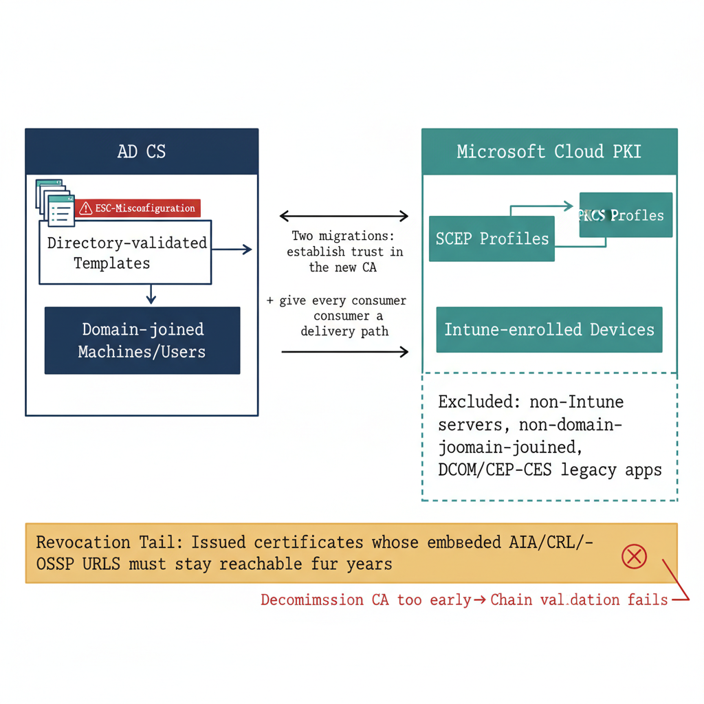

# Chapter 14 — Active Directory Certificate Services and Cloud PKI — Certificate Governance at the Point of Issuance

::: {.callout-note}
## In this chapter
How AD CS issues certificates against directory-validated templates (and the
ESC misconfiguration classes that haunt it), how Microsoft Cloud PKI delivers
certificates through Intune, and the long-lived revocation and delivery
dependencies that make the transition between them a mapping problem.
:::

## AD CS: Architecture and Native Capabilities

Active Directory Certificate Services (AD CS) implements a Public Key Infrastructure integrated with the directory, providing a CA hierarchy that issues certificates to domain-joined machines, users, and services through an enrollment process that uses the directory for identity validation. The hierarchy typically consists of an offline root CA and one or more online subordinate issuing CAs.

**Certificate templates** — stored in the Configuration partition of the AD forest and replicated to every domain controller — define every property of issued certificates: key algorithm and size, key usage and extended key usage (EKU) values, the subject-name source (derived from the directory or supplied by the requester), the validity period, the enrollment permissions controlling which principals may request each template type, and the application policies.

**Auto-enrollment** is the mechanism by which domain-joined machines and users receive certificates automatically: Group Policy delivers the auto-enrollment configuration to clients, which query the CA for all templates they are eligible to receive and request certificates with no user interaction. This model underpins certificate-based authentication, LDAPS on domain controllers, domain-controller authentication certificates, Wi-Fi EAP-TLS authentication, and code signing in managed environments.

> **The ESC liability:** The ESC vulnerability classes — ESC1 through ESC8, documented by SpecterOps researchers — represent the most consequential certificate-template misconfiguration patterns in the AD CS ecosystem.

| Class | Abuse |
| :--- | :--- |
| **ESC1** | Low-privileged users request certificates with arbitrary Subject Alternative Names — enabling impersonation of any identity, including domain administrators. |
| **ESC2** | Low-privileged users request certificates with the Any Purpose EKU. |
| **ESC3** | Enrollment-agent abuse to request certificates on behalf of other users. |
| **ESC4** | Modification of certificate-template settings by unprivileged principals. |
| **ESC5–ESC8** | Exploit combinations of CA object permissions, the `EDITF_ATTRIBUTESUBJECTALTNAME2` flag, CA-officer privilege abuse, and NTLM relay against the AD CS web-enrollment interface. |

These vulnerabilities are endemic because certificate-template permissions accumulate over time without audit, and the AD CS management tooling provides no native risk assessment of the template library.

## Microsoft Cloud PKI: Architecture and Capabilities

Microsoft Cloud PKI is a managed CA service administered through the Intune admin center, introduced as a component of the Microsoft Intune Suite. It provides a cloud-hosted CA hierarchy — a Microsoft-managed root CA with a customer-managed issuing CA beneath it, or a BYOCA model importing an existing on-premises issuing CA — and delivers certificates to Intune-managed devices through two profile types:

* **SCEP profiles** — use the Simple Certificate Enrollment Protocol to let devices request certificates directly from a SCEP endpoint associated with the Cloud PKI issuing CA, with device identity validated through the Intune service.
* **PKCS profiles** — deliver certificates generated by the CA through the Intune service to the device.

Entra ID Certificate-Based Authentication extends the certificate model to Entra ID authentication, letting users authenticate with smart-card-equivalent certificate credentials and satisfying phishing-resistant MFA requirements without hardware tokens.

## Limitations of the PKI Transition

> **Revocation outlives the CA:** Every certificate issued by an enterprise CA embeds, in its AIA and CRL Distribution Point extensions, the URLs of the issuing CA's OCSP responder and Certificate Revocation List. Those URLs must remain reachable for the entire validity period of every issued certificate — one, two, three, or more years.

Any relying party validating a certificate chain attempts to retrieve the CRL or OCSP response from those embedded URLs to confirm the certificate has not been revoked. Decommissioning the on-premises CA infrastructure before all issued certificates have expired causes validation failures for every relying party verifying a chain anchored to the old CA's root. The scope of this problem is not knowable without a comprehensive inventory of every issued certificate, every relying party, and every validity period — and that inventory does not exist natively in any Microsoft tool.

Two further gaps shape the transition:

* **Template-customization depth.** Cloud PKI addresses the operational burden of maintaining CA infrastructure, but does not replicate the full depth of AD CS template customization. The Intune certificate-profile model covers most common certificate types, but organizations with highly specialized configurations — custom EKUs, complex subject-name constructions, unusual validity periods tied to regulatory requirements — may find the available surface does not accommodate their existing template definitions without modification.
* **Delivery reaches only Intune-enrolled devices.** SCEP and PKCS delivery are available only to Intune-enrolled devices. Servers not enrolled in Intune, non-domain-joined systems outside the Intune management boundary, and legacy applications that request certificates directly from the CA through the DCOM or CEP/CES protocols cannot receive certificates from Cloud PKI without additional integration infrastructure.

{#fig-book-01-cpt-14-diagram-01 fig-alt="Left \"AD CS\" block shows directory-validated templates feeding Group Policy auto-enrollment to domain-joined machines/users, with an ESC-misconfiguration warning badge on the template store. Right \"Microsoft Cloud PKI\" block shows SCEP/PKCS profiles delivering certificates only to Intune-enrolled devices, with an excluded set \"non-Intune servers, non-domain-joined, DCOM/CEP-CES legacy apps\". Spanning beneath both, a long horizontal \"revocation tail\" bar shows issued certificates whose embedded AIA/CRL/OCSP URLs must stay reachable for years, with a red marker \"decommission CA too early → chain validation fails\". A note labels the transition \"two migrations: establish trust in the new CA + give every consumer a delivery path\". Engineering blueprint style, neutral slate background, federal navy (#1F3A5F) for AD CS, teal (#1A9E8F) for Cloud PKI, amber (#D4A017) for the revocation tail, red (#C0392B) for the early-decommission failure, monospace labels, no human figures, 16:9 landscape." width="85%"}

The transition from AD CS to Cloud PKI therefore requires both a **CA migration** — establishing trust in the new CA's certificates throughout the environment — and a **certificate-delivery migration** — ensuring every certificate consumer has a path to receive certificates from the new mechanism. There is no native Microsoft tool that maps every certificate consumer before the migration begins.
