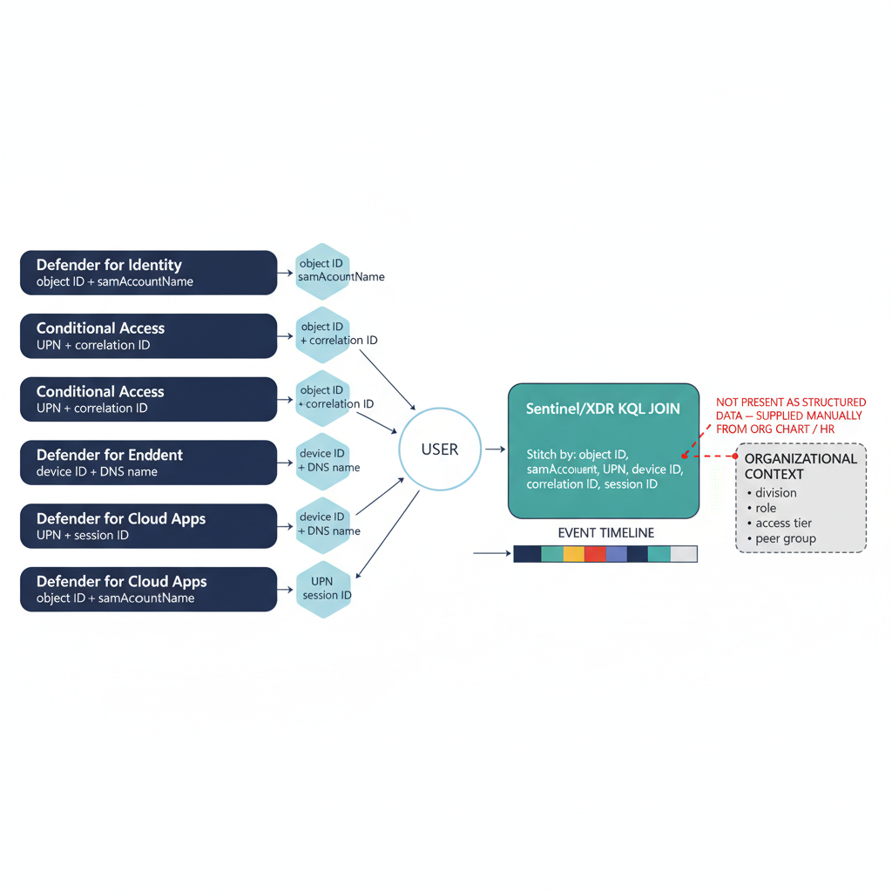

# Chapter 15 — The Defender Suite — Security Intelligence Without Governance Coherence

::: {.callout-note}
## In this chapter
What each Defender product detects within its own domain, and the coherence
gap across the suite: every product expresses the same individual through a
different identifier system, and none expresses activity in terms of
organizational position — so correlation is possible but organizational
reasoning is not.
:::

## Defender for Identity

Microsoft Defender for Identity is a threat-detection product focused exclusively on the Active Directory environment. It installs a sensor on each domain controller — or on a dedicated server receiving a mirrored copy of the DC's network traffic — and reads the authentication and directory events the domain controller generates: Kerberos service-ticket requests and responses, NTLM authentication events, LDAP queries, directory-replication events, and Windows event-log records from the DC's security and system logs.

From this telemetry it builds entity profiles for users, computers, and groups, recording authentication patterns, LDAP query activity, lateral-movement indicators, and directory-access behavior over time, and detects specific attack techniques against those baselines:

* **Kerberoasting** — identified by abnormal NTLM or Kerberos activity patterns.
* **DCSync** — detected by identifying non-DC accounts performing directory replication.
* **Pass-the-Hash / Pass-the-Ticket** — identified through anomalous credential-usage patterns.
* **LDAP reconnaissance** — identified by unusual enumeration queries.

The entity timeline for any user or device provides a chronological record of authentication and directory activity for incident investigation.

{#fig-book-01-cpt-15-diagram-01 fig-alt="Center shows one user; four product lanes — Defender for Identity (object ID + samAccountName), Conditional Access (UPN + correlation ID), Defender for Endpoint (device ID + DNS name), Defender for Cloud Apps (UPN + session ID) — each emit an alert token in its own identifier vocabulary. A Sentinel/XDR KQL join box stitches them by shared fields into an event timeline. To the side, a greyed \"organizational context — division, role, access tier, peer group\" box connects with a dashed red broken link labeled \"not present as structured data — supplied manually from org chart / HR\". Engineering blueprint style, white background, federal navy (#1F3A5F) for product lanes, teal (#1A9E8F) for the KQL join, red (#C0392B) for the missing organizational axis, monospace identifiers, no human figures, 16:9 landscape." width="85%"}

## Defender for Endpoint, Defender for Cloud Apps, and Defender for Cloud

| Product | Coverage |
| :--- | :--- |
| **Defender for Endpoint** | Behavioral threat detection and response on enrolled endpoints (Windows, macOS, Linux, iOS, Android) via a sensor collecting process, network, file, and registry telemetry evaluated against detection rules and ML models. Surfaces attack-timeline reconstructions, device/software inventory with vulnerability exposure scoring, and contributes the device-compliance signal to Intune for Conditional Access. |
| **Defender for Cloud Apps** | Visibility into cloud-service usage: shadow-IT discovery from proxy/firewall log ingestion, governance of OAuth application permissions registered in Entra ID through app-governance policies, and session-level monitoring and control of supported applications through Conditional Access App Control. |
| **Defender for Cloud** | Security-posture management for Azure resources and Arc-enrolled servers: a Secure Score reflecting the proportion of recommendations implemented, and attack-path analysis identifying lateral-movement paths through the Azure resource inventory toward high-value targets. |

## The Coherence Gap Across the Defender Suite

The Defender products individually provide security signal of genuine value within their respective domains. **The limitation is not in the individual products.** It is that the domains do not share a common organizational model, so the signals they generate are not naturally correlatable in organizational terms.

Consider a single user, seen by four products through four different identifier systems:

| Product | How it names the same user/event |
| :--- | :--- |
| **Defender for Identity** | Entra ID object identifier + the account's `samAccountName` (suspicious LDAP reconnaissance). |
| **Conditional Access** | User principal name + the sign-in event's correlation ID (sign-in risk elevation). |
| **Defender for Endpoint** | The device's Entra ID device ID + the machine's DNS name (workstation alert). |
| **Defender for Cloud Apps** | The user's UPN + the application session identifier (anomalous SharePoint download). |

Each signal refers to the same individual through a different identifier, and **none is expressed in terms of the user's organizational placement** — division, role, access tier, peer group — because no system in the stack maintains that organizational model as structured, queryable data.

> **Correlation is possible; organizational reasoning is not.** Joining these signals requires custom KQL work in Microsoft Sentinel or the unified Defender XDR portal, matching shared identifier fields across telemetry streams. The result is a timeline of events for a specific individual — but not an answer to the questions organizational security management actually asks.
The questions that require organizational context — *What is the scope of this activity relative to the organizational structure? Are other users in the same division exhibiting similar patterns? Does the pattern suggest a targeted operation against a specific unit? Is the behavior consistent with the role and access profile of the user's position?* — require the analyst to know that context from sources outside the Defender suite (an org chart, an HR system, a separately maintained access inventory) and to apply it manually to the raw telemetry. The platform does not provide it.
