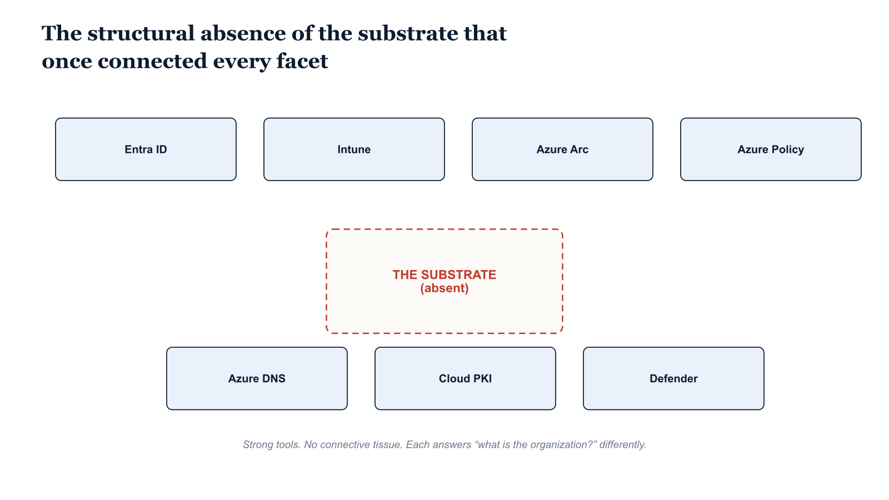

# Chapter 16 — The Aggregate Picture

## What Has Been Described

The fifteen chapters preceding this one have described, in sequence, the components of the Microsoft identity and governance stack as they actually function: what each tool natively provides, where its native capabilities end, and what questions it cannot answer without custom engineering. The picture that emerges from this accounting is not of an inadequate platform. Entra ID is a capable, globally available, protocol-compliant identity service. Intune is a mature unified endpoint management platform with a deep Windows configuration surface. Azure Arc extends the Azure control plane to on-premises and multi-cloud workloads in a technically sound manner. Azure Policy provides enforceable, auditable governance rules for Azure resources. Microsoft Cloud PKI removes significant operational burden from certificate infrastructure management. The Defender suite generates security intelligence of genuine quality within each of its operational domains. These are not weak tools. They are individually strong. The problem that this document has traced is not located in any individual tool.

## The Structural Absence

The problem is located in the absence of the substrate that connects them. Active Directory was imperfect in important ways. Its perimeter-based security model was designed for a threat landscape that no longer exists. Its privileged access model creates catastrophic blast radius at the Domain Admin tier. Its GPO model is opaque and difficult to audit programmatically. Its attack surface is extensively mapped by adversaries who have invested years in techniques that exploit structural properties of Kerberos and NTLM. The case for migrating away from Active Directory as the primary identity and governance substrate is clear and well-founded. But Active Directory was coherent. Every object existed in the same directory. Every governance mechanism shared the same structural model. The OU, the GPO, the DNS record, the certificate template, the computer object, and the user object all related to one another through a single inheritance framework. An administrator who understood the OU tree understood the policy model, the delegation model, the DNS model, and the certificate enrollment model simultaneously, because they were all expressions of the same structure. A governance question about any object in the directory could be answered by traversing the directory through LDAP. The organizational context of any identity was a property of the directory itself, not a custom attribute that had to be maintained through separate integration work.

When that infrastructure is replaced with Entra ID, Intune, Azure Arc, Azure DNS, Microsoft Cloud PKI, and the Defender suite, the individual capabilities arrive but the substrate does not. Each tool brings a different answer to the most fundamental governance question: what is the organizational structure that defines which policies apply, which administrators have authority, and which resources are in scope? Entra ID answers with the flat tenant and the Administrative Unit. Intune answers with explicitly assigned groups. Azure Arc answers with the Azure resource group and management group. Azure Policy answers with the management group hierarchy. Azure DNS answers with the virtual network link. Microsoft Cloud PKI answers with the Intune certificate profile and device group. The Defender suite answers with object identifiers in separate telemetry streams. These answers are not wrong — they are each internally coherent within their own tool's model. But they are different answers, expressed in different data models, with no native mechanism that translates between them or aggregates them into a single structural view of the organization.

## The Honest Accounting

Federal agencies completing the migration from Active Directory to the Microsoft cloud stack frequently discover this gap not at the planning stage but at the point of decommissioning. The migration proceeds tool by tool: identities are synchronized, devices are enrolled, servers are Arc-connected, DNS is partially bridged, Cloud PKI is stood up, Defender products are deployed. Each step is technically successful. Each tool is operating within its design parameters. At the moment the decision is made to decommission the last domain controller, the full scope of what is being removed becomes visible: not just an authentication service, not just a DNS zone, not just a policy engine, but the single structural model that gave each of those functions its organizational meaning. What remains after decommissioning is a collection of individually functional tools that collectively cannot express, without custom engineering, what the on-premises infrastructure expressed as a matter of course: where an identity sits in the organization, what policies flow from that position, who has delegated authority over that segment, and what the blast radius of any change to that segment's governance would be.

This is the honest accounting. The tools are ready. The substrate that connects them is not natively present. Organizations completing this migration must either accept a governance posture that is structurally less coherent than what they are replacing — accepting that policy application will be explicit rather than inherited, that delegation will be flat rather than hierarchical, that organizational context will be a custom attribute rather than a structural property of the directory — or they must construct the missing substrate themselves, building the organizational model, the inheritance logic, the delegation framework, and the cross-tool correlation that the platform does not natively provide. That construction is achievable. It is not trivial. And it is not optional for organizations whose governance obligations require continuous, verifiable, structurally coherent management of identity and policy across the full surface of their IT environment.

{#fig-01-microsoft-identity-and-governance-stack-diagram-03 fig-alt="Top tier: a single wide rounded rectangle labeled \"Organization — what governance must express\" containing four small labels (organizational position, policy inheritance, delegated authority, dependency graph). Bottom tier: six disconnected boxes in a horizontal row labeled \"Entra ID\", \"Intune\", \"Azure Arc\", \"Azure DNS\", \"Microsoft Cloud PKI\", \"Defender suite\", each rendered in a distinct cool-tone color. Between the two tiers, a tall hollow rectangle outlined in dashed red labeled \"Structural substrate — absent, must be constructed\" written across the empty interior; six gray question-mark icons populate the inside of the hollow rectangle. Six dashed gray arrows attempt to descend from the Organization tier through the empty substrate region toward the tools tier, but each arrow breaks at the substrate boundary with a small red X marker labeled \"no native carrier for organizational position\". A small footer panel below the tools tier reads \"Without the substrate: explicit assignment, flat delegation, custom-attribute correlation, no programmatic inheritance\". Engineering blueprint style, neutral slate background, federal navy (#1F3A5F) for the organization tier, dashed red (#C0392B) for the substrate outline, varied cool tones (teal, purple, slate-blue, indigo, steel) for the six tools, no human figures, 16:9 landscape." width="85%"}

This document was prepared as a technical analysis for senior federal IT architects and governance engineers. All platform capabilities and limitations described reflect the native design of the Microsoft identity and governance stack as of the document preparation date. May 2026.
