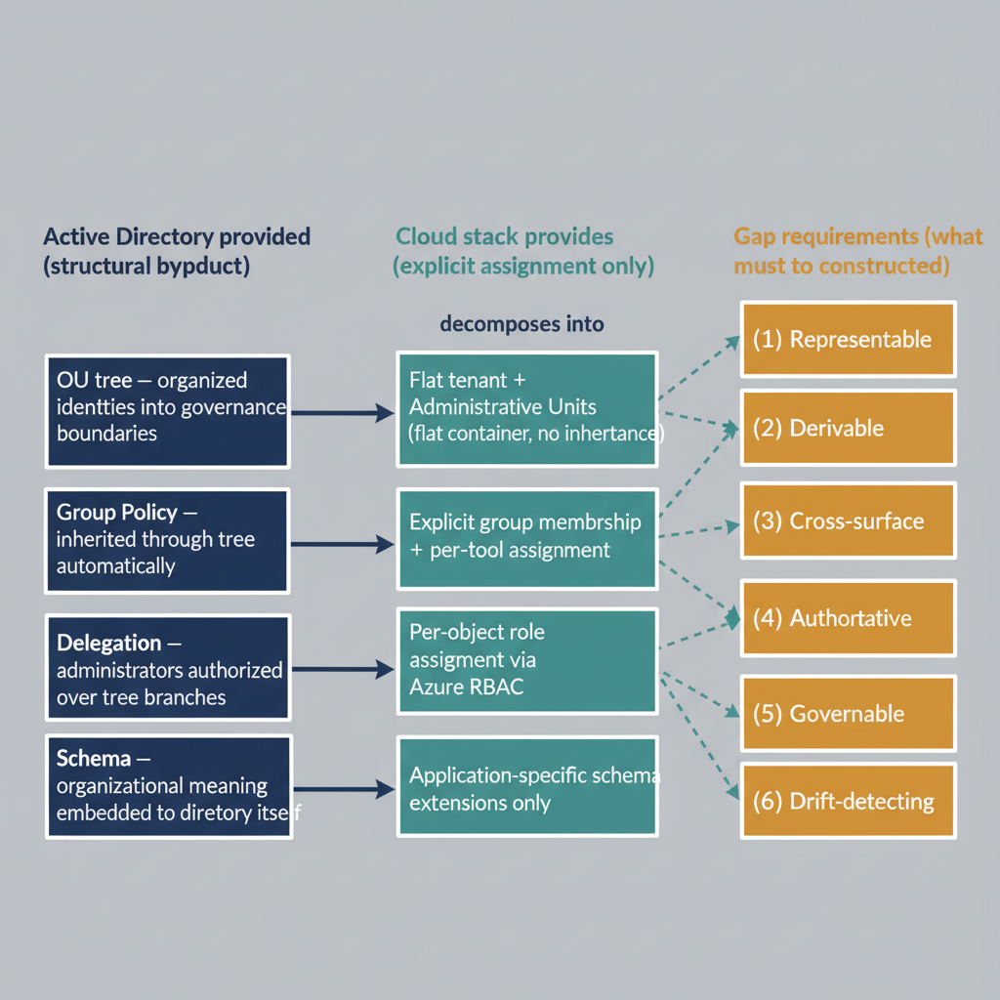
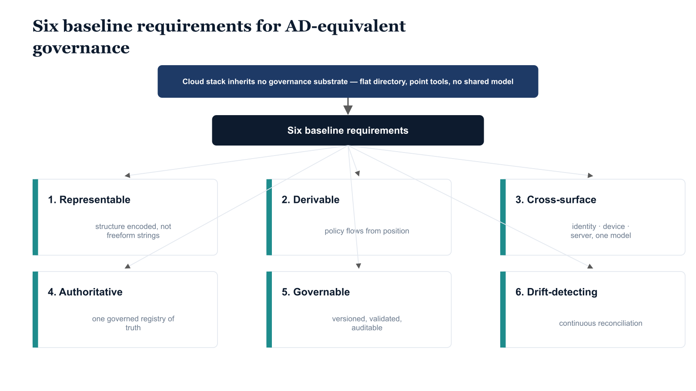

# Chapter 1 — The Gap, Expressed as Requirements

*Restating the problem as a set of requirements.*

## Where the Companion Document Stopped

The companion document to this analysis — *The Microsoft Identity and Governance Stack: Native Capabilities and Inherited Limitations* — established with precision what the Microsoft cloud stack provides natively and where its native capabilities end. It described the tools, their individual strengths, and the structural boundaries beyond which those tools do not reach. This document begins where that one stopped. It takes the gap that was established there and translates it into a requirements language: not what the platform lacks, but what must exist in order to close the gap.

That distinction matters more than it may initially appear. A list of platform limitations invites a search for compensating features — another license tier, another configuration option, another integration that might bridge the distance between what the tool does and what the organization needs. The companion document made clear that the gap in question cannot be closed that way. It is not a collection of missing features remediable by configuration changes or additional licensing. It is a structural absence. The Microsoft cloud stack has no shared substrate that represents organizational structure, communicates it across tools, or causes policy to flow from organizational position. Every tool in the stack governs through explicit assignment. None of them governs through structure. That is the condition this document addresses, and the requirements it establishes are derived from that condition directly.

## The Derivation of Requirements From What Was Left Behind

Requirements do not emerge from abstract principles. They emerge from the gap between what an organization's governance posture was and what its governance posture becomes when the infrastructure that supported it is replaced. Organizations that operated Active Directory for a decade or more did not merely use a directory service. They relied on a governance substrate — a unified, hierarchical, policy-bearing infrastructure whose properties were so thoroughly embedded in routine operations that many of those properties were never articulated as requirements, because they were never absent. The OU tree organized identities into governance boundaries. Group Policy inherited through that tree automatically. Administrators were delegated authority over branches of that tree without manual per-object configuration. Security perimeters were defined by the tree's structure, not by spreadsheets. The governance model was, in a meaningful sense, built into the directory itself.

When an organization moves its identity infrastructure to the Microsoft cloud stack, it does not move the governance substrate. It moves the identities. The directory is replaced with a flat cloud directory. The OU tree is replaced with nothing — or, more precisely, it is replaced with a collection of attributes, groups, and policy assignments that must be manually constructed and manually maintained to approximate what the tree provided automatically. The requirement space this document describes is the space defined by that approximation: what must be constructed, governed, and automated in the cloud-native environment in order to provide the governance properties that Active Directory provided as a structural byproduct of its own design.

{#fig-02-what-must-exist-diagram-03 fig-alt="A left-to-right derivation flow diagram with three labeled vertical columns. Left column header \"Active Directory provided (structural byproduct)\" containing four stacked boxes top to bottom: (1) OU tree — organized identities into governance boundaries; (2) Group Policy — inherited through tree automatically; (3) Delegation — administrators authorized over tree branches; (4) Schema — organizational meaning embedded in directory itself. Middle column header \"Cloud stack provides (explicit assignment only)\" containing four stacked boxes mirroring the left: (1) Flat tenant + Administrative Units (flat container, no inheritance); (2) Explicit group membership + per-tool assignment; (3) Per-object role assignment via Azure RBAC; (4) Application-specific schema extensions only. Right column header \"Gap requirements (what must be constructed)\" containing six numbered boxes: (1) Representable; (2) Derivable; (3) Cross-surface; (4) Authoritative; (5) Governable; (6) Drift-detecting. Solid horizontal arrows from each AD-provided box on the left to its cloud counterpart in the middle column, with a small label \"decomposes into\" on the topmost arrow. Dashed arrows fan from each middle-column box to one or more requirement boxes on the right, indicating which gap requirements derive from each compensated-but-incomplete cloud capability. Engineering blueprint style, neutral slate background, federal navy (#1F3A5F) for the AD column, teal (#1A9E8F) for the cloud column, amber (#D4A017) for the gap requirements column, no human figures, 16:9 landscape." width="85%"}

## Six Baseline Requirements

The chapters that follow develop each of these requirements in depth, establishing the reasoning behind each one and stating it with the precision needed to guide architectural planning. Before developing them individually, it is useful to state them together, as a set, so that their mutual dependencies are visible from the outset.

1. **Representable.** Organizational structure must be encoded in the cloud directory in a governed, machine-readable form — not merely implied by freeform strings in unmaintained attributes. Every tool that needs to evaluate organizational membership must be able to read it structurally.
2. **Derivable.** Policy must be derivable from organizational position, not only from explicit group assignment. The connection between where an identity sits in the organization and what governance rules apply to it must be computable, not manually maintained.
3. **Cross-surface.** The same organizational model must span identity, devices, and servers simultaneously. It cannot be surface-specific, applying to users in one tool and inapplicable to devices in another.
4. **Authoritative.** One version of organizational truth — one governed record from which all position values are derived — not one version per tool and one version per administrator's best recollection.
5. **Governable.** The model must be versioned, validated, and auditable, not inferred from whatever attributes happen to be populated on a given day.
6. **Drift-detecting.** When the real-world state of the environment diverges from the intended governance state encoded in the model, the system must detect that divergence, surface it, and support its remediation.

{#fig-02-what-must-exist-diagram-01 fig-alt="A single root node at the top labeled \"Cloud stack inherits no governance substrate (flat directory, point tools, no shared model)\" connects downward via a single arrow to a middle node labeled \"Six baseline requirements (minimum conditions for AD-equivalent governance)\". From that middle node, six labeled branches fan out to leaf boxes arranged in a row: (1) Representable — structure encoded in directory, not freeform strings; (2) Derivable — policy flows from position, not only explicit assignment; (3) Cross-surface — spans identity / device / server, one model, three surfaces; (4) Authoritative — one version of truth, governed registry, not per-tool guesses; (5) Governable — versioned, validated, auditable; (6) Drift-detecting — continuous reconciliation, deviation surfaced and remediable. Engineering blueprint style, neutral slate with federal navy (#1F3A5F) accents, monospace numerals on requirement boxes, 16:9 landscape." width="85%"}

::: {.callout-note title="Architectural Requirement — Chapter 1"}
These six requirements are not aspirational. They describe the minimum conditions under which a cloud-native governance posture can be considered structurally equivalent to what organizations leave behind when they migrate from Active Directory. A cloud environment that satisfies fewer than all six of these requirements is not merely imperfect — it is structurally incomplete as a governance substrate, and its incompleteness will compound over time as the organization grows, changes, and depends more heavily on the governance model to enforce consistency across an expanding surface area.
:::
