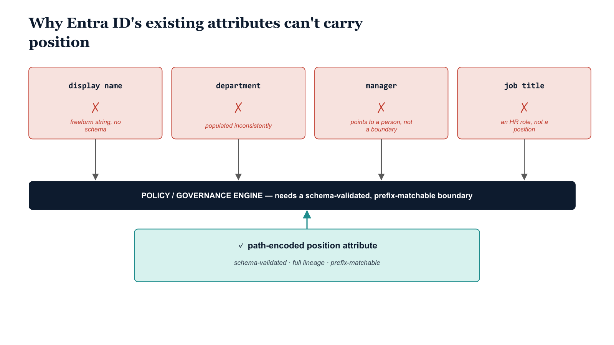

# Chapter 2 — Every Identity Must Know Where It Sits

*The Organizational Position Requirement.*

::: {.callout-note}
## In this chapter
What organizational position meant in Active Directory (governance lineage, not
a label), why the directory's existing attributes — display name, department,
manager, job title — all fail as governance signals, and what a purpose-built
position attribute must be instead.
:::

## What Organizational Position Meant in Active Directory

In Active Directory, an identity's organizational position was not a label applied to a user record as a matter of convenience. It was a placement in a tree that carried with it a structured set of inherited expectations. The OU path of a user object determined which Group Policy Objects applied to that user, which resource access was available through group membership inherited at the OU level, which administrators held delegated authority over that identity, and what the security perimeter around that identity looked like.

The path was not metadata in the informal sense of supplementary information attached to a primary record. It was governance lineage. The OU path encoded the identity's full relationship to the organization's governance structure, from the root domain at the top to the most granular operational unit at the bottom, and every node in that path was a meaningful governance boundary.

This is the property that is entirely absent in a flat directory. The Microsoft cloud directory organizes identity objects into a single flat namespace. There is no container hierarchy. There is no inheritance model built into the directory's structure. Every governance relationship must be encoded explicitly, because no governance relationship can be inferred from where the object sits — because, in a meaningful sense, objects in a flat directory do not sit anywhere. They exist at the same level, differentiated only by their attribute values.

## Why Available Attributes Do Not Satisfy This Requirement

The instinctive response to the absence of an OU hierarchy in the cloud directory is to use the attributes that already exist on user objects to encode organizational context. The display name, the department field, the job title attribute, the manager field — these are the tools administrators reach for when they need to express where a user sits in the organization. They are, without exception, inadequate for the purpose of governance, and understanding why they are inadequate is essential to understanding what the correct solution must look like.

Each of the directly available attributes fails as a governance signal for a different reason:

| Attribute | Why it fails as a governance signal |
|---|---|
| **Display name** | Freeform string controlled by the administrator who created the object or the HR system that synchronized it. Encodes a user's name, not their organizational position; not subject to schema validation. |
| **Department** | Populated inconsistently across multiple HR systems, lifecycle workflows, and generations of management practice. The value on any given object may reflect what the HR system last reported, what an administrator manually typed, or nothing at all. Consistency cannot be enforced through the attribute's native schema. |
| **Manager** | Encodes an individual reporting relationship — points to a single other user object, not an organizational boundary. Reporting relationships and governance segmentation are not the same concept and do not follow the same rules. |
| **Job title** | An HR construct describing a role, not a governance position. The same title can exist across multiple organizational units with entirely different policy requirements. |

None of these attributes encodes governance boundary membership in a deterministic, validated form that a policy engine can consume reliably.

{#fig-book-02-cpt-02-diagram-01 fig-alt="Four attribute cards in a row — display name, department, manager, job title — each shown feeding a policy engine that rejects it with a red X and a one-line reason: \"freeform string, no schema\", \"populated inconsistently, no enforcement\", \"points to one person, not a boundary\", \"an HR role, not a governance position\". Beneath them, a single contrasting green card labeled \"path-encoded position attribute — schema-validated, full lineage, prefix-matchable\" feeds the same engine with a green check. Engineering blueprint style, white background, federal navy (#1F3A5F) for the engine, red (#C0392B) for the failing attribute cards, teal (#1A9E8F) for the valid position attribute, monospace labels, no human figures, 16:9 landscape." width="85%"}

## What the Attribute Must Be

The inadequacy of existing attributes is not a consequence of the attributes being poorly maintained. It is a consequence of those attributes being designed for purposes other than governance segmentation. Improving their maintenance does not change what they fundamentally are. A better-maintained department field is still a freeform string with no schema validation and no structural relationship to the organization's governance hierarchy. What is needed is an attribute — or a structured set of attributes — designed specifically for the purpose of encoding governance lineage, in a form that is both machine-readable and deterministic.

The attribute that satisfies this requirement must encode not just a leaf-level label identifying the user's immediate organizational unit, but the full lineage from the root of the organization to the identity's current position. This lineage must be structured in a way that allows policy engines, reporting tools, and governance workflows to evaluate organizational membership at any level of the hierarchy — from the organization's outermost boundary down to the most granular operational unit — using the same attribute and the same syntax.

A tool that needs to know whether a user belongs to a particular division must be able to answer that question by examining the lineage attribute, without cross-referencing any other record. A tool that needs to know whether a user belongs to any subdivision of a particular department must be able to answer that question using the same attribute, by evaluating whether the lineage string begins with the path prefix corresponding to that department.

The attribute must be structured enough to support these prefix-based evaluations, which means it must be a path-encoded string with a consistent delimiter and a consistent normalization convention, not a freeform label.

::: {.callout-note title="Architectural Requirement — Chapter 2"}
Every user and device identity in the cloud directory must carry an authoritative, machine-readable, deterministic representation of its organizational position. That representation must encode not just a leaf-level label but the full lineage from the root of the organization to the identity's current position. It must be structured in a way that allows policy engines, reporting tools, and governance workflows to evaluate organizational membership at any level of the hierarchy using the same attribute and the same syntax. This requirement rules out freeform attributes, manually maintained department fields, and display name conventions. It requires a governed, schema-validated, machine-readable attribute that encodes organizational lineage in a form that can be consumed deterministically by any tool that needs to know where an identity sits.
:::
