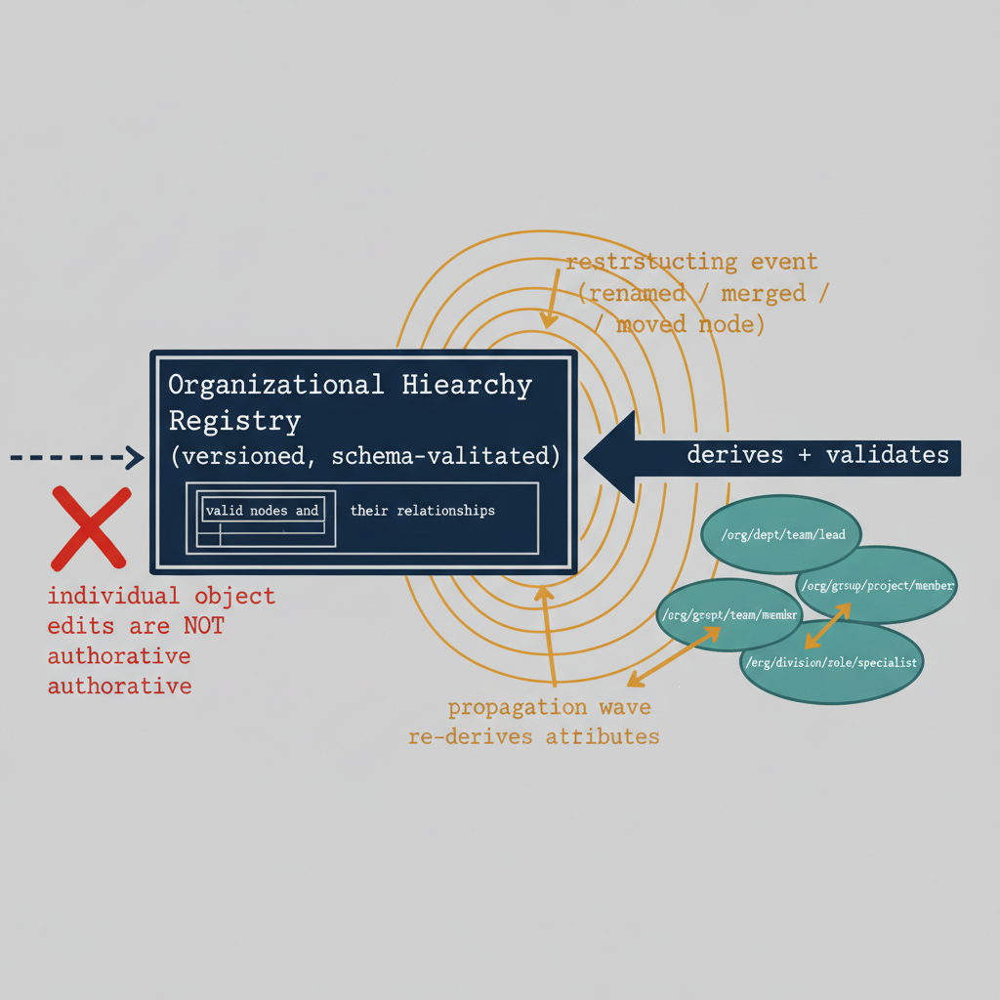

# Chapter 3 — The Hierarchy Itself Must Be a Governed Artifact

*The Authoritative Registry Requirement.*

::: {.callout-note}
## In this chapter
Storing a position on an identity and governing the hierarchy itself are two
separate problems. This chapter establishes the second: the organizational
hierarchy must be a versioned, authoritative **registry** — the schema that
defines which position values are valid — with authority flowing from the
registry outward to the identity objects, never the reverse.
:::

## Two Distinct Problems

Chapter 2 established the requirement that every identity must carry a structured attribute encoding its organizational position. That requirement, standing alone, is insufficient. Storing a hierarchical position on an identity object and governing the hierarchy itself are two separate problems, and the second is at least as important as the first. An attribute value that encodes organizational position is only as reliable as the schema that defines what valid values look like. Without a governed schema — a definitive record of what organizational nodes exist, how they relate to one another, and what values are valid within the path-encoded position string — the attribute degrades into a freeform field. Different administrators populate it differently. Changes are made to individual objects without review. New organizational units are added by some administrators and not others. Values that were once valid become invalid when the organization restructures, but no mechanism exists to identify or update the affected objects. The attribute becomes, over time, another version of the department field problem: better intended but equally ungoverned.

This is not a hypothetical failure mode. It is the predictable outcome of any governance model that stores governed values in a distributed set of identity objects without maintaining a central, authoritative record of what those values should be. The objects are the wrong place to store the definition of validity. They are the right place to store values derived from that definition, once the definition exists and is maintained separately.

## The OU Tree as a Unified Schema and Data Layer

In Active Directory, this problem did not arise in the same way, because the OU tree served simultaneously as the schema and the data. The existence of an OU in a specific position in the tree defined a valid organizational segment. Its position in the tree defined its relationship to its parent and to all child OUs beneath it. Moving an OU changed its relationship to every policy, every delegation, and every child object that existed below it. Adding an OU to the tree was the act of defining a new valid organizational segment. Removing an OU was the act of eliminating one. The set of valid organizational segments was not stored separately from the tree — it was the tree. Administrators could not invent a position value that did not correspond to a real OU, because position values were not attribute strings; they were OU paths, and OU paths existed only if the OUs they referenced existed.

The cloud-native model cannot replicate this unification directly, because it has no native container hierarchy for identity objects. The flat directory stores every user and device object in the same namespace. The position attribute described in Chapter 2 is a string that lives on each object individually. The governance of what strings are valid — and what the relationships between valid strings are — cannot be embedded in the directory's structure, because the directory has no governance-bearing structure to embed it in. This means the schema must be maintained separately, as an explicit, versioned artifact.

## The Registry as the Governing Authority

The organizational hierarchy — the set of valid nodes, their relationships to one another, the rules governing which segments can appear at which levels of the path, and the normalization rules that ensure consistent formatting — must be maintained as a first-class governed artifact. This artifact is properly understood as a registry: a machine-readable record that defines the organizational hierarchy independently of any individual identity's position attribute. The registry is the authority. The position attribute on each identity object is a derived value — derived from the registry at the time the attribute was set, and subject to revalidation against the registry whenever the registry changes.

This relationship between registry and attribute is not merely a technical architecture preference. It is the condition under which the position attribute can be trusted. When an administrator looks at a user's organizational position attribute and sees a path value, the question they need to be able to answer is: is this value still valid, or has the organization restructured in a way that makes this path obsolete? Without a registry, that question cannot be answered definitively, because there is no authoritative record of what the valid paths currently are. With a registry, the question is trivially answerable — the path value either appears in the registry's current set of valid nodes or it does not.

When the organization restructures — when a division is renamed, when two departments are merged, when a new regional branch is established — the change is made to the registry first. The registry's updated definition of the hierarchy then propagates: every identity whose current position attribute references a node affected by the change is identified, and its attribute is updated to reflect the restructuring. The direction of authority runs from the registry outward to the identity objects, not from individual object edits inward toward an inferred structure.

{#fig-book-02-cpt-03-diagram-01 fig-alt="A central \"Organizational Hierarchy Registry (versioned, schema-validated)\" box holds the set of valid nodes and their relationships. A solid arrow labeled \"derives + validates\" flows outward to a cluster of identity objects, each stamped with a path-encoded position attribute. A reverse dashed arrow from the identities back toward the registry is drawn and explicitly broken with a red X labeled \"individual object edits are NOT authoritative\". When a restructuring event hits the registry (renamed / merged / moved node), a propagation wave re-derives the affected identities' attributes. Engineering blueprint style, neutral slate background, federal navy (#1F3A5F) for the registry, teal (#1A9E8F) for identity objects, amber (#D4A017) for the propagation wave, red (#C0392B) for the blocked reverse-authority arrow, monospace path strings, no human figures, 16:9 landscape." width="85%"}

::: {.callout-note title="Architectural Requirement — Chapter 3"}
The organizational hierarchy must be maintained as a versioned, machine-readable governance artifact — a registry of valid organizational nodes, their relationships, their allowed segment values, and the rules governing valid hierarchy paths. Changes to the hierarchy must be made to this registry, not to individual identity attribute values. The registry must be auditable, version-controlled, and authoritative over every attribute value derived from it. No position attribute value on any identity object can be considered valid unless it corresponds to a node currently defined in the registry.
:::
