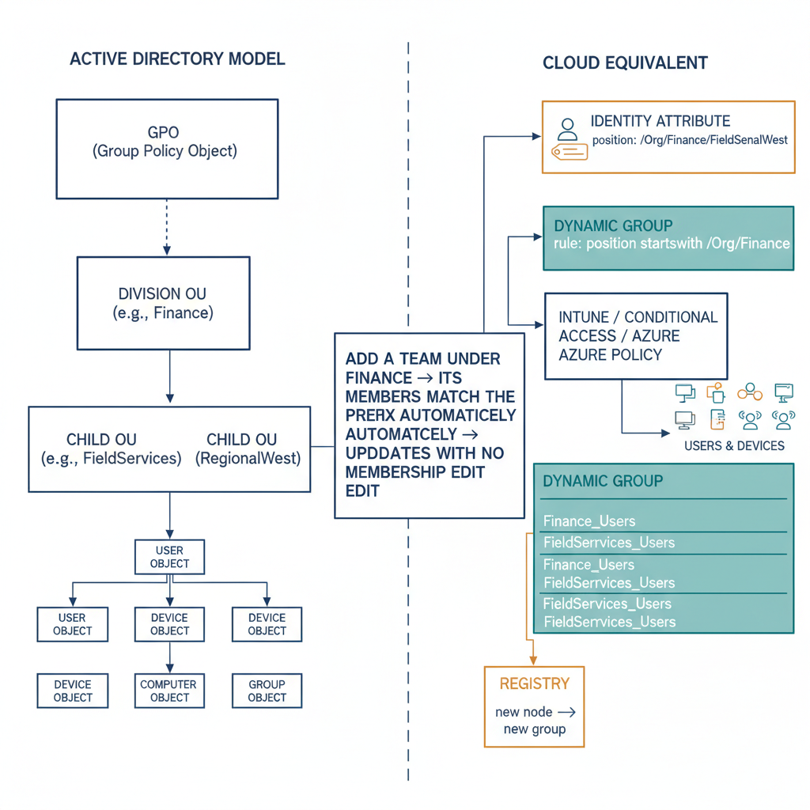

# Chapter 4 — Policy Must Flow From Structure, Not Only From Assignment

*The Policy Inheritance Requirement.*

::: {.callout-note}
## In this chapter
GPO inheritance made policy coverage a function of structure, not of a
membership list an administrator had to keep current. This chapter shows why
explicit assignment cannot replicate that, and how a path-encoded position
attribute plus a **dynamic group library** reconstructs structure-derived
policy targeting in the cloud.
:::

## What GPO Inheritance Provided

The governance property that most organizations miss first, most acutely, and most visibly after migrating from Active Directory is policy inheritance. In the Active Directory model, a Group Policy Object applied to an OU applied automatically to every object in that OU and every object in every child OU beneath it, without additional configuration. A single policy action at the division level cascaded to every user, every device, and every sub-unit within that division.

Adding a new team to the division automatically brought it under the division's policy coverage, because the new team's objects existed beneath the division's OU in the tree, and the policy applied to the tree, not to an explicitly enumerated list of objects. Removing a team from the division removed it from that coverage by the same structural logic. The policy assignment was made once, at the appropriate level of the hierarchy, and the hierarchy did the work of determining scope — automatically, continuously, and without additional administrative action.

This model had important governance consequences beyond mere administrative convenience. It meant that the governance coverage of a policy was determined by the organization's structure, not by an administrator's ability to keep a group membership list current. It meant that gaps in policy coverage could not arise from the simple oversight of failing to add a new team to a group. If the team's objects were in the right place in the tree, they were covered. If they were not covered, it was because their placement in the tree was wrong — which was itself a visible, auditable condition, not a silent gap in a group membership list.

## What Explicit Assignment Cannot Replicate

In the cloud-native model, every policy assignment is explicit. A device configuration profile in Intune assigned to a group applies to the members of that group and no others. A Conditional Access policy scoped to a group applies to the members of that group and no others. An Azure Policy assignment scoped to a resource group applies to the resources in that resource group and no others. There is no inheritance model that propagates policy coverage from a parent scope to a child scope based on structural membership. The scope of every policy is exactly the set of objects explicitly included in its targeting configuration, and that set changes only when an administrator explicitly changes it.

This creates a governance condition that is structurally different from the Active Directory model in a way that is easy to underestimate. In the explicit assignment model, the guarantee of policy coverage is only as strong as the process for maintaining group memberships. When a new team is created within a division, it does not automatically inherit the division's policy coverage.

Someone must identify the relevant policies for that team's members, identify the groups those policies are assigned to, and add the team's members — or a group representing the team — to those assignment groups. If that process is not followed, the new team's members may be subject to fewer policies than the rest of the division, with no visible signal that a gap exists. The gap is not an error that the platform surfaces.

It is simply an omission in a group membership list, which looks, from the platform's perspective, exactly like an intentional configuration choice.

## Structural Position as the Foundation for Policy Targeting

The path from explicit-assignment governance to structure-derived governance in the cloud-native model runs through the combination of the position attribute established in Chapter 2 and the authoritative registry established in Chapter 3. Together, these two elements provide the raw material for a policy targeting mechanism that approximates the inheritance behavior of the OU model, using the primitives available in the cloud-native platform.

The mechanism is the dynamic group. A dynamic group whose membership rule evaluates the organizational position attribute and includes every identity whose position attribute begins with a specific path prefix — that is, every identity at or below a specific node in the hierarchy — is functionally equivalent, from a policy targeting perspective, to a policy applied at that node in an OU tree. Every identity that is placed within that organizational segment, at any depth, is automatically included in the group.

When an identity's organizational position changes — because the individual moved to a different team, or because the team was restructured under a different division — the position attribute is updated, and the dynamic group's membership is recomputed to reflect the new position. The policy coverage updates automatically, as a consequence of the structural placement, without manual intervention.

This mechanism requires a library of dynamic groups that corresponds to every meaningful level of the organizational hierarchy. Each group targets one node in the hierarchy, using a prefix match against the position attribute. Together, the group library expresses the hierarchy in terms that every policy engine can consume. The maintenance of this group library must itself be governed by the registry: when a new node is added to the hierarchy, a corresponding dynamic group must be created; when a node is removed, the corresponding group must be retired; when a node is renamed, the corresponding group's membership rule must be updated. These operations must be driven by registry changes, not by independent administrative action.

{#fig-book-02-cpt-04-diagram-01 fig-alt="Left side shows the Active Directory model — a GPO linked to a division OU cascading automatically to every child OU and object beneath it. Right side shows the cloud equivalent — a position attribute (e.g. /Org/Finance/FieldServices/RegionalWest) on each identity, and a dynamic group whose rule is \"position startsWith /Org/Finance\" automatically capturing every user and device at or below that node; an Intune / Conditional Access / Azure Policy assignment targets that one group. A note reads \"add a team under Finance → its members match the prefix automatically → coverage updates with no membership edit\". The group library is shown maintained by the registry (new node → new group). Engineering blueprint style, white background, federal navy (#1F3A5F) for the AD OU tree, teal (#1A9E8F) for the dynamic group library, amber (#D4A017) for the registry-driven maintenance, monospace path strings, no human figures, 16:9 landscape." width="85%"}

::: {.callout-note title="Architectural Requirement — Chapter 4"}
Policy must be derivable from organizational position, not only from explicit group assignment. The mechanism for this derivation must be the combination of a path-encoded position attribute and a matching dynamic group library, maintained by the organizational hierarchy registry, and evaluated continuously by the directory's membership processing engine. The dynamic group library must express every meaningful level of the organizational hierarchy, so that policy can be scoped to organizational boundaries using the same structural logic across every management surface that supports dynamic group targeting.
:::
