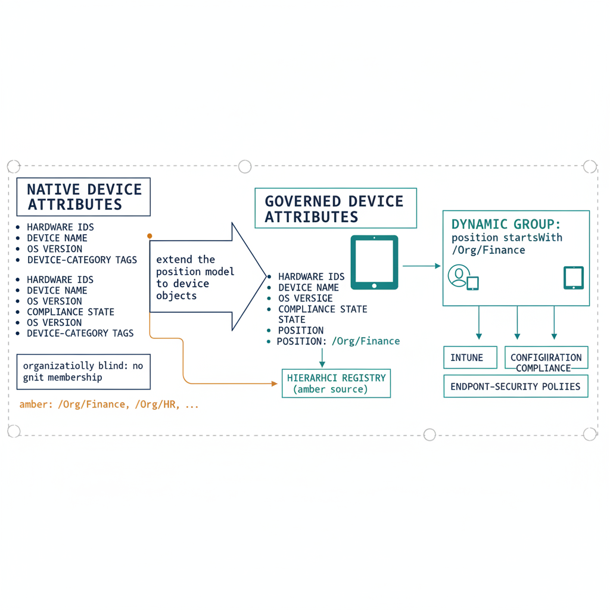

# Chapter 5 — Devices Must Carry Organizational Position, Not Just Compliance State

*The Device Governance Requirement.*

::: {.callout-note}
## In this chapter
In Active Directory a computer's OU placement *was* its governance posture.
Cloud device management is organizationally blind — it knows compliance state
but not organizational unit. This chapter extends the position model to device
identities so device policy targeting derives from the same registry and the
same dynamic group library as users.
:::

## What Device Placement in the Tree Provided

In Active Directory, a computer object's placement in the OU tree was the primary determinant of its governance state. The machine's OU path determined which Group Policy Objects governed its configuration — which security baselines applied, which software was deployed to it, which scripts ran at startup, which administrators had authority over it, and which networks it was permitted to access through network access control policies evaluated at the OU boundary. The machine's identity and its governance posture were unified in its placement. Moving a machine to a different OU changed its governance posture, automatically and completely, without any additional configuration. There was no separate step required to update the machine's policy coverage — the structural placement was the policy coverage.

This meant that in a well-structured Active Directory, a new computer object in the correct OU was immediately under the correct governance coverage. A laptop enrolled in the finance division's OU received finance-division security baselines, finance-division software deployment, and finance-division network access controls from the moment of enrollment, without any administrator needing to identify the correct groups to add it to. The organization's governance intent, expressed in the OU structure and the policies linked to it, was applied automatically to every correctly placed object.

## The Absence of Organizational Context in Cloud Device Management

In the cloud-native model, device governance is driven by Intune policy assignments scoped to groups, and device group membership is either manually maintained or driven by dynamic rules based on device attributes. The critical observation is that none of the native device attributes encode organizational context in a form that is structurally meaningful to a governance model. A device enrolled through Autopilot carries its hardware identifiers, its device name, its operating system version, its compliance state, and whatever device category tags have been assigned to it. What it does not carry, natively, is any representation of the organizational unit it belongs to.

The relationship between a device and its organizational context exists, in most organizations, only in the minds of the administrators who configured the policy assignments, in the name conventions applied to device names, or in the manual group memberships that were created to target policies at specific organizational populations. None of these representations is governed in the sense established by Chapters 2 and 3. Device names are naming conventions, not schema-validated governance attributes. Manual group memberships require maintenance that is subject to the same structural limitations as any explicitly managed group. Device categories are a limited mechanism that does not naturally express the depth or complexity of a real organizational hierarchy.

The result is a device governance model that is functionally capable — Intune can enforce sophisticated configuration and compliance policies — but organizationally blind. The management system can determine whether a device is compliant, but it cannot determine, from native attributes, whether a device belongs to the finance division, the operations group, or the field services team, in a form that can be evaluated programmatically against the organization's governed hierarchy. Device policy gaps cannot be detected by comparing device organizational placement against policy coverage, because device organizational placement is not encoded in the directory in a form that supports such a comparison.

{#fig-book-02-cpt-05-diagram-01 fig-alt="Left \"native device attributes\" column lists what an enrolled device carries — hardware IDs, device name, OS version, compliance state, device-category tags — with a note \"organizationally blind: no governed unit membership\". A wide arrow labeled \"extend the position model to device objects\" leads to the right, where the same device now also carries a path-encoded position attribute (e.g. /Org/Finance) derived from the hierarchy registry, identical in vocabulary to the user attribute. A single dynamic group \"position startsWith /Org/Finance\" is shown capturing both users and devices in that division, feeding Intune configuration / compliance / endpoint-security policies. Engineering blueprint style, white background, federal navy (#1F3A5F) for native attributes, teal (#1A9E8F) for the governed position attribute and shared group, amber (#D4A017) for the registry source, monospace labels, no human figures, 16:9 landscape." width="85%"}

## Extending the Position Model to Device Identities

The solution follows directly from the architecture established in the preceding chapters. The same organizational position model that governs user identities must extend to device identities. A device must carry, in a structured extension attribute on its directory object, an authoritative representation of its organizational assignment — the division, department, or operational unit it belongs to — encoded in the same path-encoded, schema-validated form as the user position attribute.

The derivation of device organizational position must be governed by the same hierarchy registry: the segment vocabulary is identical, the path encoding convention is identical, and the normalization rules are identical. A device in the finance division carries a position attribute whose path begins with the same prefix as every user in the finance division, because both are derived from the same registry node.

This consistency is what allows the dynamic group library established in Chapter 4 to work for device objects as well as user objects. A dynamic group that targets all identities — users and devices — whose position attribute begins with the finance division prefix will automatically include both the users and the devices assigned to that division. Intune configuration profiles, compliance policies, application deployments, and endpoint security settings can be targeted through this group with the same structural logic as Conditional Access policies targeting users. The governance model is unified across the identity and device surfaces, because the position model is shared.

The governance of device organizational position assignment must be defined: when a device is enrolled, what determines its organizational position, and who has authority to change it? The answers to these questions must be encoded in the governance model as explicit rules, not left to administrative judgment at enrollment time. Autopilot deployment profiles can carry organizational position values. Enrollment policies can enforce position attribute population as a condition of successful enrollment. The assignment of a device's organizational position must be as governed as the assignment of a user's organizational position, because both feed the same policy derivation pipeline.

::: {.callout-note title="Architectural Requirement — Chapter 5"}
Every managed device must carry an authoritative, machine-readable organizational position attribute derived from the same hierarchy registry that governs user identities. The attribute must use the same path encoding, the same segment vocabulary, and the same normalization convention as the user position attribute. Device policy targeting must be derivable from this attribute — through the same dynamic group library that governs user policy targeting — and must not depend solely on manually maintained group membership or device naming conventions.
:::
