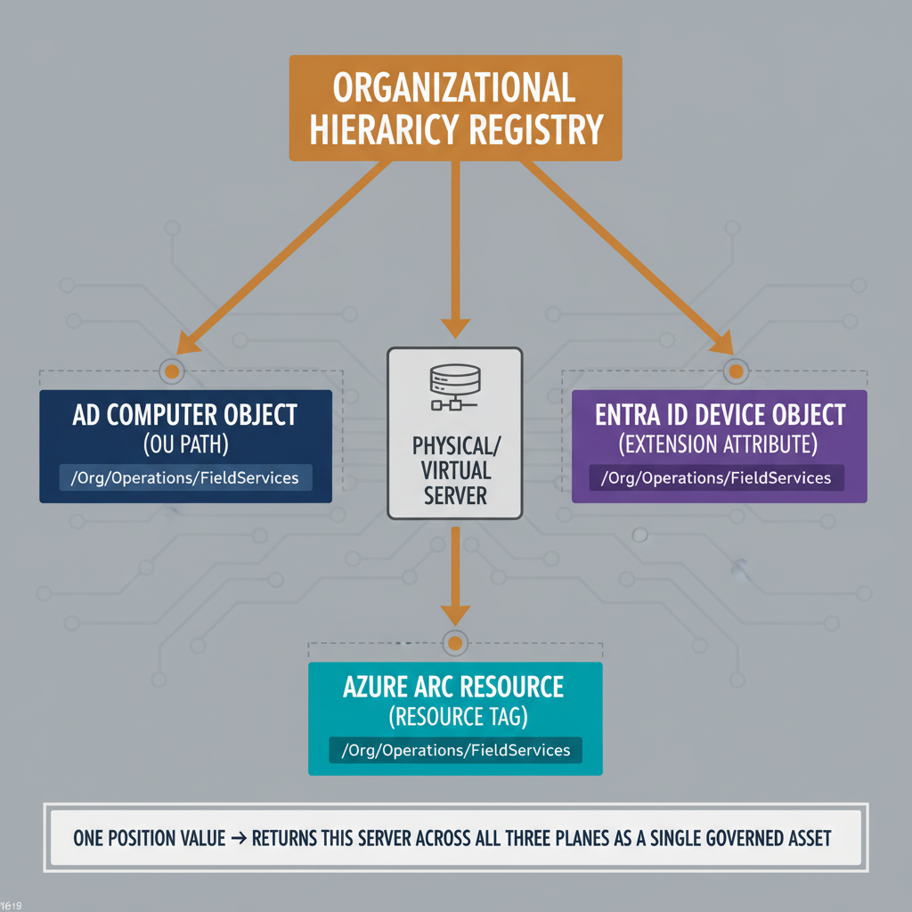

# Chapter 6 — Three Surfaces, One Asset, No Native Linkage

*The Server Identity Problem.*

::: {.callout-note}
## In this chapter
During a multi-year modernization, one server holds three unlinked identities
at once — an AD computer object, an Entra ID device object, and an Azure Arc
resource — each expressing a partial governance view. This chapter establishes
the requirement that a **common organizational position** span all three
surfaces so they can be treated as views of one governed asset.
:::

## The Multi-Surface Reality of Infrastructure Modernization

The device governance requirement established in Chapter 5 addresses the governance of end-user devices — laptops, workstations, mobile endpoints. The problem of server governance is related but distinct, and its complexity at scale is qualitatively different from anything that arises in endpoint management. The distinction emerges from a specific and concrete condition that characterizes large infrastructure modernization programs: during the transition period — which, in organizations of meaningful scale, is measured in years rather than months — a single physical or virtual server simultaneously holds three distinct identity representations in three separate management systems, each of which expresses a partial view of the server's governance state, none of which is natively linked to either of the others.

The three representations divide as follows:

| Representation | Management plane | What it encodes |
| :--- | :--- | :--- |
| **AD computer object** | On-premises Active Directory | Domain membership, OU placement, governing GPOs, security-group membership, administrative delegation — the OU path is the primary governance signal for Group Policy, delegation, and domain authentication. |
| **Entra ID device object** | Cloud identity plane | Intune compliance state, registration status, and cloud RBAC assignments (exists if the server is co-managed or Hybrid Entra Joined). |
| **Azure Arc resource object** | Azure Resource Manager | Presence in the Azure management plane, resource-group placement, tag set, Azure Policy assignments, and Arc-agent-reported patch status. |

The first representation is the Active Directory computer object. This object encodes the server's domain membership, its OU placement, the GPOs that govern it, the security groups it belongs to, and the administrative delegation model that determines who has authority over it. The OU path of this object is the primary governance signal for everything that Active Directory manages — Group Policy, delegation, and domain authentication. The second representation is the Microsoft Entra ID device object, which may exist if the server has been registered for co-management or configured for Hybrid Entra Join. This object encodes the server's compliance state in the Intune model, its registration status, and whatever RBAC assignments have been made against it in the cloud identity plane. The third representation is the Azure Arc resource object in the Azure Resource Manager. This object encodes the server's presence in the Azure management plane, its resource group placement, its tag set, its Azure Policy assignments, and its patch management status as reported through the Arc agent.

## Three Independent Governance Expressions of the Same Asset

These three representations reference the same physical or virtual asset, but they are not connected by any native platform mechanism. They share a hostname and, in some cases, a hardware identifier, but the governance posture they each express is entirely independent. The Active Directory computer object knows what GPOs apply to the server and what OU it belongs to, but it has no visibility into what Azure Policies govern it or what Entra ID roles have been delegated over its cloud identity. The Arc resource object knows the server's patch compliance status, its resource group, and what Azure Policy initiatives are assigned to it, but it has no awareness of the server's domain membership, its OU placement, or the Group Policy Objects that were applied to it before Arc management was added. The Entra ID device object, where it exists, knows the server's compliance state as reported by the management agent, but does not connect that compliance state to either the Arc resource's policy assignments or the Active Directory object's governance lineage.

The consequence of this fragmentation is a specific and significant governance failure that manifests most acutely during the decommissioning phase of an infrastructure modernization program. When an organization prepares to decommission its on-premises Active Directory infrastructure, one of the critical governance questions is whether every server that was previously managed through Active Directory has been successfully onboarded to cloud-native management with equivalent governance coverage. Answering that question requires correlating the three identity representations — finding every Active Directory computer object, confirming that it has a corresponding Entra ID device object and a corresponding Arc resource, and verifying that the governance posture expressed in all three representations is consistent and complete. No native platform tool performs this correlation. The three representations exist in separate management planes, and the work of connecting them is manual, error-prone, and invisible to any governance audit tool that looks at only one plane at a time.

## A Common Organizational Position Across All Three Surfaces

The requirement this situation establishes is an extension of the position model developed in Chapters 2 through 5. When a server is onboarded to cloud-native management, its organizational position — the division, department, or operational unit responsible for it — must be encoded consistently across all three management surfaces, using the same organizational position vocabulary that governs user and device identities. On the Active Directory computer object, this means the OU path already encodes the organizational position, but it must be mappable to the same path-encoded vocabulary used in the cloud-native model. On the Entra ID device object, this means the extension attribute that carries organizational position for endpoint devices must be populated for server objects using the same schema. On the Arc resource object, this means resource tags must carry the organizational position value using the same path-encoded string and the same segment vocabulary, so that the Arc management plane participates in the same governance vocabulary as the identity and device management planes.

When this consistency is achieved, the governance model can treat all three representations as views of a single governed asset rather than as independent identity objects that happen to describe the same hardware. A query against the organizational position vocabulary returns all users, all devices, and all servers assigned to a given organizational unit, because they all carry the same position value expressed in the same terms. A compliance audit for a specific division can verify not only that the division's users and workstations are governed correctly, but also that the division's servers are correctly onboarded and tagged. A security incident response team looking for every asset belonging to a specific organizational unit can query a single attribute and receive a complete picture rather than three partial pictures requiring manual correlation.

{#fig-book-02-cpt-06-diagram-01 fig-alt="Center is a single physical/virtual server. Three surface-boxes around it — \"AD computer object (OU path)\", \"Entra ID device object (extension attribute)\", \"Azure Arc resource (resource tag)\" — each previously unlinked. A shared \"Organizational Hierarchy Registry\" at the top derives the same path-encoded position value (e.g. /Org/Operations/FieldServices) into all three surfaces, drawn as three solid amber arrows landing on each surface, replacing the previously broken cross-surface links. A footer query box reads \"one position value → returns this server across all three planes as a single governed asset\". Engineering blueprint style, neutral slate background, federal navy (#1F3A5F) for AD, purple (#5B2D8E) for Entra, teal (#1A9E8F) for Arc, amber (#D4A017) for the registry-derived shared position, monospace path strings, no human figures, 16:9 landscape." width="85%"}

::: {.callout-note title="Architectural Requirement — Chapter 6"}
When a server is onboarded to cloud-native management, its organizational position must be encoded consistently across all three management surfaces — the on-premises directory, the cloud device directory, and the hybrid server management plane — using the same organizational position model that governs user and device identities. Tags on the Arc resource, attributes on the Entra device object, and the existing computer object OU path must all express the same organizational context through a common vocabulary. The governance model must be capable of treating all three representations as views of a single governed asset, not as independent identity objects requiring manual correlation.
:::
