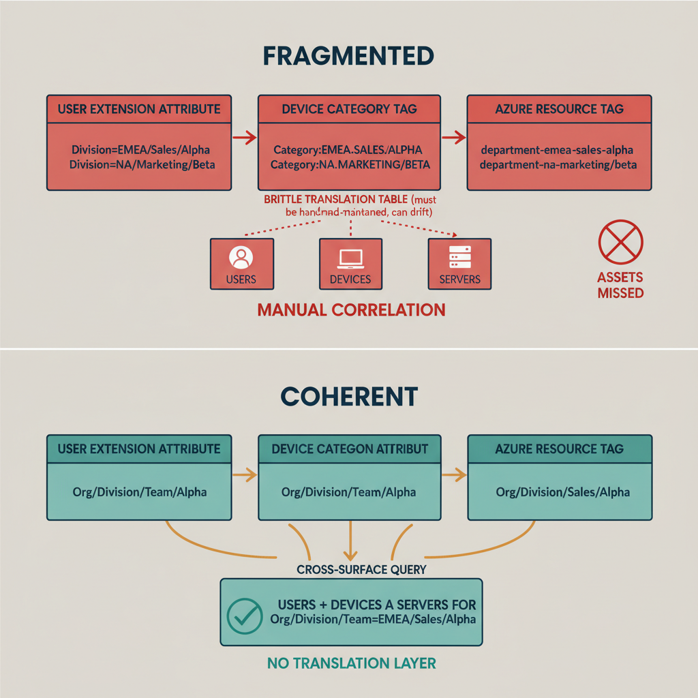

# Chapter 9 — The Governance Model Must Span Every Surface

*The Cross-Platform Coherence Requirement.*

::: {.callout-note}
## In this chapter
Each surface's governance can be made to work in isolation — which is exactly
why the hardest requirement is underestimated. This chapter shows the cost of
fragmented vocabularies across identity, device, and server planes, and
establishes that one **shared vocabulary**, defined once in the registry, is
the foundational condition for unified governance.
:::

## The Harder Requirement

The requirements established in Chapters 2 through 8 describe what must exist at the level of individual governance surfaces and individual governance capabilities. Each requirement, taken alone, is architecturally achievable. A structured position attribute can be defined in a directory schema extension. A hierarchy registry can be maintained in a version-controlled repository. A dynamic group library can be built that maps registry nodes to membership rules. Device objects can carry the same position schema as user objects. Server resources can carry the same vocabulary as an Arc resource tag. Dependency maps can be compiled and maintained. Drift detection can be scheduled and automated. Each of these capabilities, built in isolation, addresses a real governance gap.

The harder requirement is the one that binds all of them together: the governance model must be coherent across all surfaces simultaneously. The organizational position of a user, the device that user works on, and the servers that user's applications run on must all be expressible in the same terms, governed by the same registry, and auditable through the same pipeline. This is the cross-platform coherence requirement, and it is the requirement most likely to be underestimated during architectural planning, because each surface's governance can be made to work in isolation — and working in isolation can feel like working. The integration failure only becomes visible when an organization tries to ask a question that crosses surface boundaries.

## The Cost of Fragmented Vocabularies

To understand why vocabulary coherence across surfaces is a hard requirement rather than a cosmetic preference, consider what happens when organizational position is encoded differently in each management plane. If user organizational position is encoded in a custom extension attribute using a path-encoded hierarchy string, device organizational position is encoded in a device category tag using a different vocabulary and a different delimiter convention, and server organizational position is encoded in an Azure resource tag using a third vocabulary that reflects the resource group hierarchy rather than the organizational hierarchy, then no tool that consumes any one of these values can participate in the same governance conversation as a tool that consumes another. The three encodings describe the same organizational reality — the same divisions, the same departments, the same operational units — but they describe it in three different languages, and translation between them must be custom-built, maintained separately, and updated every time the organizational hierarchy changes.

A security team investigating a credential compromise incident needs to know every asset associated with the compromised identity's organizational unit — every user who might share the same access patterns, every device that might have been accessed from a compromised session, every server that might hold data relevant to the investigation. If organizational unit membership is expressed in three different vocabularies across the three asset types, the investigation requires three separate queries in three separate tools, followed by manual correlation of the results. The correlation is error-prone and slow. Assets will be missed. The investigation scope will be incomplete. None of this is a consequence of any individual tool's limitation — it is a consequence of the governance model's failure to establish a shared vocabulary.

A compliance team auditing policy coverage for a business unit has the same problem in a different context. Verifying that every member of the business unit — every user, every device, every server — is covered by the required policies requires querying each management surface separately, correlating the results against the business unit's membership as defined in each surface's local vocabulary, and reconciling the resulting coverage reports into a single view. If the vocabulary is not shared, the reconciliation requires a translation table that must be maintained separately from all three systems and kept current as the hierarchy changes. The translation table becomes itself a governance artifact that can drift and fail.

{#fig-book-02-cpt-09-diagram-01 fig-alt="Top half \"fragmented\" shows three surfaces — user extension attribute, device category tag, Azure resource tag — each encoding the same division in a different language/delimiter, with brittle translation tables between them marked \"must be hand-maintained, can drift\". A cross-surface query (security incident or compliance audit) is shown fanning into three separate tools requiring manual correlation, marked red \"assets missed\". Bottom half \"coherent\" shows all three surfaces deriving from one \"Hierarchy Registry\" with an identical path-encoded vocabulary, and a single query cleanly returning users + devices + servers for a unit with a green check \"no translation layer\". Engineering blueprint style, white background, red (#C0392B) for the fragmented top, teal (#1A9E8F) and amber (#D4A017) for the coherent registry-driven bottom, federal navy (#1F3A5F) surface labels, monospace path strings, no human figures, 16:9 landscape." width="85%"}

## The Vocabulary as a Shared Foundation

The cross-platform coherence requirement is satisfied only when the organizational position vocabulary — the segment names, the hierarchy structure, the path encoding convention, and the schema validation rules — is identical across every management surface where organizational position is stored. The user extension attribute, the device extension attribute, and the server resource tag must use the same segment names, the same delimiter convention, the same normalization rules for capitalization and whitespace, and the same path structure for encoding the full lineage from the hierarchy root to the leaf node. When this consistency is achieved, any tool that understands the vocabulary can query any surface. There is no translation layer between the user governance model and the device governance model, because they are not different models — they are the same model applied to different object types.

This consistency is achievable only if the vocabulary is defined once, in the authoritative hierarchy registry, and derived from that registry everywhere it is used. If the device team maintains its own device category vocabulary, and the cloud infrastructure team maintains its own resource tagging taxonomy, and the identity team maintains its own extension attribute schema, coherence is structurally impossible regardless of how much manual effort is invested in keeping them aligned. They will drift from one another as each team makes changes to meet its own operational needs. The registry must be the single source of the vocabulary, and the derivation of every position value — on user objects, on device objects, on server resource tags — must be governed by the registry and validated against it.

::: {.callout-note title="Architectural Requirement — Chapter 9"}
The organizational position vocabulary — segment names, hierarchy structure, path encoding convention, and schema validation rules — must be identical across every management surface where organizational position is stored. The user attribute, the device attribute, and the server resource tag must use the same vocabulary, validated by the same registry, so that any tool consuming any of these values can participate in the same governance conversation without translation. Cross-surface governance queries, cross-surface compliance reporting, and cross-surface incident response are possible only when the vocabulary is coherent. This is not a consistency preference — it is the foundational condition for unified governance across a multi-surface cloud-native environment.
:::
