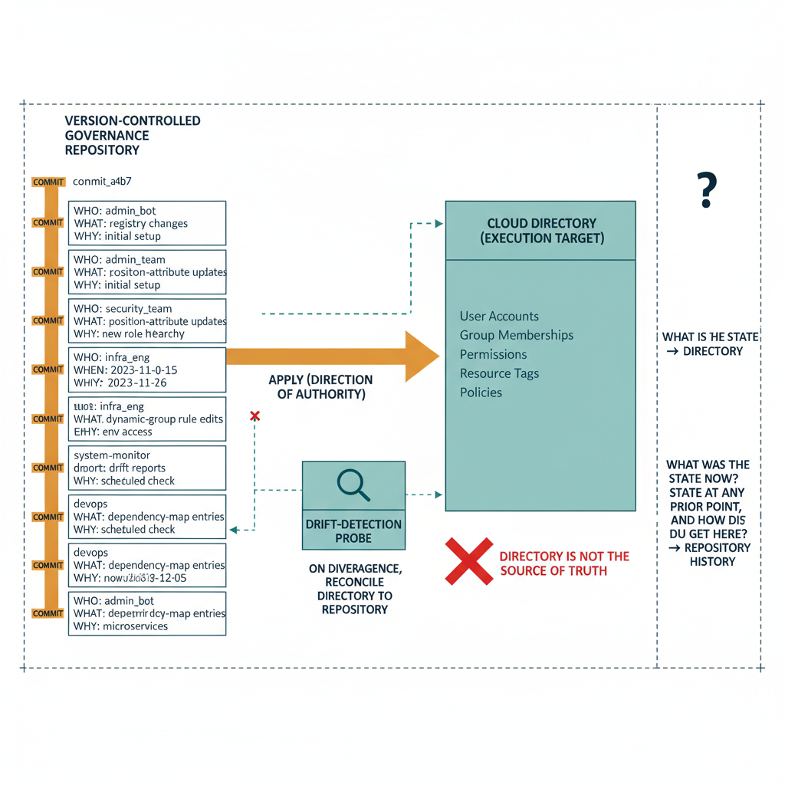

# Chapter 11 — Governance History Must Be a First-Class Artifact

*The Version Control Requirement.*

::: {.callout-note}
## In this chapter
Native audit logs record *events*; governance requires *intent*. This chapter
makes the case for version control as the governance substrate's primary
persistence mechanism — the repository as the authoritative source of truth,
with the cloud directory as a mere execution target whose state is brought
back into alignment with it.
:::

## The Universal Expectation of Historical Recoverability

Organizations that have operated Active Directory for a decade or more have, embedded in their change management records — whether those records are formal ITSM tickets, informal email threads, or something in between — some historical account of how their directory governance changed over time. The quality and completeness of those records varies enormously. Some organizations have rigorous change control processes that require documented justification for every GPO modification, every OU restructuring, and every privileged group membership change. Others have accumulated years of undocumented changes whose authors and rationale are no longer recoverable. The historical record may be incomplete, but the expectation that it should exist is universal. Compliance frameworks assume it. Audit processes depend on it. Incident investigations require it. The ability to answer the question "what was the governance state at this point in the past, and how did it get from there to here" is not a nice-to-have feature of a governance model. It is a baseline expectation that governance programs must be designed to satisfy.

In the cloud-native model, the native audit log — the Entra ID unified audit log, the Azure Activity Log, the Intune device management event log — provides a record of individual administrative actions over a retention window that is typically measured in months. Within that window, it is possible to determine that a specific attribute was changed on a specific date, that a specific policy was modified, that a specific group membership was updated. These records are valuable, but they are event records, not state records. They tell you that a change occurred; they do not tell you what the complete governance state was before the change, what motivated the change, or whether the change was consistent with the organization's governance intent as defined in some authoritative baseline.

## Events Versus Intent

The distinction between events and intent is the critical gap in native audit log coverage. Knowing that a user's organizational position attribute was changed from one value to another on a specific date tells you that a change occurred. It does not tell you whether the change was authorized, whether it was consistent with a planned organizational restructuring, whether the new value is valid according to the current hierarchy registry, or whether it should have triggered corresponding changes to the user's policy group memberships. Answering those questions requires not just an event record but a governance record — a document that captures the intended state at each point in time, the authority under which changes were made, and the relationship between individual changes and the broader governance model they are part of.

The audit log records events. Governance requires intent. The gap between them is not closed by increasing the retention period of the audit log or by adding more detail to individual event records. It is closed by maintaining a separate, governed record of the intended state — a record that captures not just what happened but what was supposed to happen, why it was supposed to happen, and who authorized it. This record is the governance history, and it must be a first-class artifact in the governance substrate, not a derived report generated on demand from audit log events.

## Version Control as the Persistence Mechanism

The persistence mechanism best suited to this purpose is version control. A version-controlled repository provides exactly the properties that governance history requires: every change is committed with a timestamp, an author identity, and a commit message that describes the change and its rationale; the complete history of every file in the repository is preserved indefinitely, not subject to a rolling retention window; any prior state of the repository can be recovered by checking out the state at a specific point in time; changes can be compared across any two points in time using standard diff operations; and the repository is itself a governed artifact — access to it is controlled, changes to it require authorization, and the integrity of its history is protected by the version control system's cryptographic commitment model.

Every change to the governance substrate must be committed to the version-controlled repository. Changes to the hierarchy registry — new nodes, renamed nodes, removed nodes, modified relationships — are committed with a description of the organizational restructuring that motivated them. Updates to identity position attributes that are not already recorded in the registry change that triggered them must be committed as a separate record. Drift detection reports must be committed as timestamped documents. Dependency map updates must be committed as versioned entries. The version-controlled repository is not a backup of the governance data. It is the primary governance record, and the cloud directory is the execution target where the governed state defined in the repository is applied. The direction of authority runs from the repository to the directory, not from the directory to the repository.

{#fig-book-02-cpt-11-diagram-01 fig-alt="Left is a \"version-controlled governance repository\" timeline of commits — registry changes, position-attribute updates, dynamic-group rule edits, drift reports, dependency-map entries — each commit carrying who/what/when/why. A solid arrow labeled \"apply (direction of authority)\" runs from the repository to the \"cloud directory (execution target)\" on the right. A dashed arrow from the directory back to the repository is drawn and broken with a red X labeled \"directory is NOT the source of truth\". A drift-detection probe compares the two and, on divergence, reconciles the directory back to the repository. A side panel separates two questions: \"what is the state now? → directory\" versus \"what was the state at any prior point, and how did it get here? → repository history\". Engineering blueprint style, neutral slate background, amber (#D4A017) for the repository, teal (#1A9E8F) for the directory, red (#C0392B) for the blocked reverse-authority arrow, federal navy (#1F3A5F) labels, monospace commit identifiers, no human figures, 16:9 landscape." width="85%"}

This framing has a consequential implication for the governance architecture: the source of truth is not the cloud directory. The cloud directory is the consumer of the governance record, not its author. When the governance state in the directory diverges from the state defined in the repository — which is precisely what drift detection, as described in Chapter 8, detects — the repository is the authority and the directory must be brought back into alignment with it. The repository is also the record that governance audits, compliance assessments, and incident investigations consult when they need to understand the historical state of the governance model. The directory's current state answers the question "what is the governance state now." The repository's history answers the question "what was the governance state at any prior point, and how did it arrive at its current state."

::: {.callout-note title="Architectural Requirement — Chapter 11"}
The governance substrate must use version control as its primary persistence mechanism. Every change to the hierarchy registry, every update to identity organizational position, every modification to a dynamic group rule, every drift detection report, and every dependency map update must be committed to a version-controlled repository with a record that captures the who, what, when, and why of the change. The repository must be the authoritative source of governance truth. The cloud directory is the execution target where the governed state is applied — it is not the governance record. The history of the governance state must be recoverable at any prior point in time from the repository without reconstruction from audit log events.
:::
