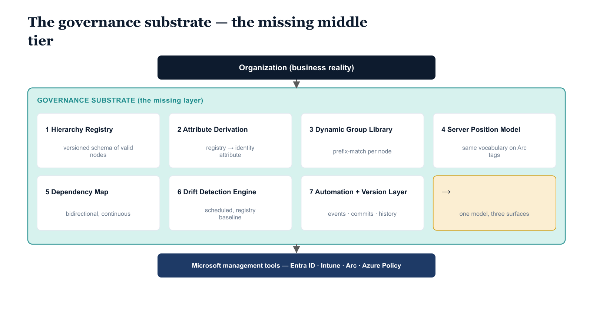

# Chapter 12 — The Substrate That Is Required

*Synthesis: The Shape of What Must Exist.*

::: {.callout-note}
## In this chapter
The synthesis of the eleven requirements into one description of what must be
built: a governance substrate of **seven components** — hierarchy registry,
attribute-derivation pipeline, dynamic group library, server position model,
dependency map, drift-detection engine, and automation/versioning layer —
assembled from platform primitives as the missing layer between the
organization and the tools.
:::

## Restating the Problem with Precision

Eleven chapters of this document have established eleven distinct requirements, each derived from a specific governance property that Active Directory provided and the Microsoft cloud stack does not. Before synthesizing those requirements into a unified description of what must be built, it is worth restating the underlying problem with the clarity that the preceding analysis has earned. Organizations migrating from Active Directory to the Microsoft cloud stack are not simply upgrading their identity infrastructure. They are leaving behind a unified governance substrate — a hierarchical, policy-bearing, authority-delegating, drift-visible infrastructure that provided governance coherence as a structural property of its own design — and arriving at a set of capable, individually functional, structurally disconnected point tools. The tools govern through assignment, not through structure. They have no shared concept of organizational position. They do not share a data model, an inheritance model, or an authority model. They each maintain their own representation of the organization, expressed in their own vocabulary, governing through their own mechanisms, with no native coordination between them. The result is a cloud-native environment that is individually functional at the tool level and collectively incoherent at the governance level.

This collective incoherence is not visible at the beginning of a migration program. In the early stages, the Active Directory infrastructure is still running, and its governance properties are still providing the coherence that the cloud tools cannot yet provide. The incoherence becomes visible as the migration progresses — as more workloads move to cloud management, as the on-premises infrastructure is scaled back, as the organization relies more heavily on the cloud tools to provide governance coverage that was previously provided by the directory hierarchy. By the time the incoherence is fully visible, the organization has invested years of migration effort and is past the point where returning to the previous model is an option. The gap must be closed by building what is missing, not by reversing the migration.

## The Shape of What Must Exist

What must exist is a governance substrate that sits between the organizational hierarchy — which exists as a business reality, independent of any technology, defined by the organization's structure, its reporting relationships, its operational boundaries, and its governance accountability model — and the management tools that enforce governance on identities, devices, and servers. This substrate does not replace any of the Microsoft management tools. It connects them, by providing the shared organizational model that they individually lack. It is the missing layer between the organization and the tools.

{#fig-02-what-must-exist-diagram-02 fig-alt="Top tier is a single box labeled \"Organization (business reality)\". Bottom tier is a single box labeled \"Microsoft management tools (Entra ID, Intune, Arc, Azure Policy, ...)\". The middle tier is a clearly bounded region labeled \"Governance Substrate (the missing layer)\" containing seven numbered component boxes arranged in a 2-by-4 grid: (1) Hierarchy Registry — versioned schema of valid nodes; (2) Attribute Derivation Pipeline — registry to identity attribute; (3) Dynamic Group Library — prefix-match per node; (4) Server Position Model — same vocabulary on Arc tags; (5) Dependency Map — bidirectional, continuously updated; (6) Drift Detection Engine — scheduled, registry baseline; (7) Automation + Version Layer — events, commits, history. Arrows: organization arrow into component (1) labeled \"shape encoded as\"; (1) into (2), (4), (6); (2) into (3), (5); (3) into (6); (6) into (7); (7) back to (1) forming a feedback loop. Three downward arrows from (3), (4), (6) into the tools tier labeled \"targeting groups\", \"tags on Arc resources\", \"drift findings\". Engineering blueprint style, neutral slate, federal navy (#1F3A5F) for substrate, teal (#1A9E8F) for org and tools, 16:9 landscape." width="85%"}

The substrate's first component is the hierarchy registry: the versioned, machine-readable, schema-validated record of the organization's governance hierarchy. The registry defines the set of valid organizational nodes, their relationships to one another, the segment vocabulary that governs how each node is labeled, the path encoding convention that governs how positions in the hierarchy are expressed as attribute strings, and the validation rules that determine whether any given position attribute value is current and valid. The registry is maintained as a version-controlled artifact. Every change to it is committed with a record of who made the change, why, and what organizational event motivated it. The registry is the source of truth for the organization's governance structure — not the HR system, not the directory, not the management tool. Those systems may inform the registry, but the registry is authoritative over every value derived from it.

The substrate's second component is the attribute derivation pipeline: the automated process that takes the registry's current state and derives an organizational position value for every user identity and every device identity in the directory, storing that value in a structured, path-encoded extension attribute that is consistent in format and vocabulary across every identity type. The derivation pipeline runs in response to registry changes — when a node is added, renamed, or restructured, every identity whose current position attribute references that node is identified and its attribute is updated to reflect the change. The pipeline also runs as part of the identity enrollment workflow — when a new user is onboarded or a new device is enrolled, the position attribute is populated from the registry as part of the provisioning process, not as a separate manual step. The pipeline commits its outputs — the set of attribute updates it applied and the registry state from which they were derived — to the version-controlled governance record.

The substrate's third component is the dynamic group library: the collection of Entra ID dynamic groups that expresses the organizational hierarchy in terms that every Microsoft policy engine can consume. Each group targets one node in the hierarchy, using a prefix match against the position attribute to include every identity — user or device — whose organizational position is at or below that node. The group library is maintained by the registry: new nodes generate new groups, removed nodes retire their groups, renamed nodes update their groups' membership rules. The group library is the policy targeting interface. Every Intune policy, every Conditional Access policy, every Azure Policy assignment that should apply to an organizational segment uses the corresponding dynamic group as its scope. Policy is scoped to organizational structure through this library, not through manually maintained assignment groups.

The substrate's fourth component is the server position model: the extension of the organizational position vocabulary to the Azure Arc management plane, through resource tags that carry the same path-encoded position strings as the user and device extension attributes. When a server is onboarded to Arc, its organizational position is encoded in a mandatory resource tag using the same vocabulary, the same delimiter convention, and the same normalization rules as every other position value in the governance model. The Arc tagging convention is governed by the hierarchy registry. Tag values that do not correspond to valid registry nodes are invalid. The server position model allows the governance substrate to treat server assets as participants in the organizational hierarchy, not as separately governed resources with their own independent taxonomy.

The substrate's fifth component is the dependency map: the continuously maintained, machine-readable record of every dependency between infrastructure components and the identities, applications, services, and devices that consume them. The dependency map is the prerequisite for decommissioning decisions. It is updated as new assets are enrolled, as existing dependencies are migrated and resolved, and as the environment changes in ways that add or remove dependency relationships. The map is queryable in both directions and is committed to the version-controlled governance record, so that the history of dependency relationships is preserved alongside the history of the governance model.

The substrate's sixth component is the drift detection engine: the automated, scheduled process that compares the live state of every identity's position attribute against the current registry baseline, identifies deviations by type and severity, and produces a machine-readable drift report that is committed to the version-controlled governance record. The drift detection engine is the mechanism by which the governance substrate remains honest about the real state of the environment over time. It is the answer to the question that no static configuration can answer: is the governance model that was designed and deployed still the governance model that is actually operating today? When the answer is no — when drift is detected — the report surfaces the deviation, classifies it, and provides the information needed for remediation, without requiring a manual audit to discover the discrepancy.

The substrate's seventh component is the automation and event integration layer: the set of interfaces, pipelines, and event triggers that allow every other component to operate without manual initiation for each governance operation. Registry changes trigger attribute updates and group rule modifications. New identity enrollments trigger position attribute derivation. Organizational restructuring events trigger registry updates. Scheduled cron triggers initiate drift detection passes and dependency map validation cycles. Every output of every pipeline stage is committed to the version-controlled governance record automatically, as a byproduct of the pipeline's normal operation. The governance history is not a reporting effort — it is a continuous emission from the governance pipeline, written to the version-controlled record as governance operations execute.

## The Architectural Conclusion

The six requirements stated at the opening of this document — that organizational structure must be representable in the cloud directory, that policy must be derivable from organizational position, that the model must span identity and devices and servers, that the model must be authoritative, that it must be governable, and that it must detect drift — are not aspirational. They are not a vision of an ideal future state toward which organizations should strive while accepting something less in the present. They are the minimum conditions under which a cloud-native governance posture can be considered structurally equivalent to the governance substrate that organizations leave behind when they migrate from Active Directory. An environment that satisfies fewer than all six is not merely imperfect — it is structurally incomplete, and its incompleteness will deepen as the organization grows, changes, and depends more heavily on the governance model to maintain coherence across a surface area that Active Directory once held together by the force of its own hierarchical design.

Nothing in the Microsoft cloud stack natively provides this substrate. The stack provides the primitives from which the substrate can be assembled: directory schema extensions that can carry the position attribute; dynamic group rules that can evaluate the attribute using prefix matching; Azure resource tags that can carry the position vocabulary; version-controlled repositories that can hold the hierarchy registry; automation pipelines that can execute attribute derivation and drift detection without human initiation. The primitives are capable. The substrate that must be built from them is not beyond the reach of a well-governed engineering program. But it requires deliberate architectural commitment — a decision to build the missing layer rather than to manage without it. It requires governed tooling that enforces the registry's authority over every derived value and every policy scope. And it requires sustained operational discipline — the recognition that the governance substrate is not a project deliverable that can be completed and handed off, but an ongoing operational investment that must be maintained with the same rigor as the directory itself, because it is, in every meaningful sense, the governance layer that the directory requires in order to function as an organizational infrastructure rather than merely as an identity store.

The architecture described in this document is achievable. The work it requires is concrete and well-defined. The path through it runs from the hierarchy registry outward — first to the attribute model, then to the dynamic group library, then to the device and server extensions, then to the dependency map, then to drift detection, and finally to the automation and versioning infrastructure that makes the entire model durable. Each step is tractable. The commitment to take the first step — to treat the organizational hierarchy as a governed artifact rather than an implied convention — is the architectural decision upon which every other capability depends, and it is the decision that separates organizations that will govern their cloud environments coherently from those that will manage them in perpetual reactive response to the drift and disconnection that an ungoverned substrate inevitably produces.

::: {.callout-note title="Architectural Conclusion"}
The only path to a cloud-native governance posture that is coherent, auditable, and durable over the full operational life of the organization's modern infrastructure is the deliberate assembly of a governance substrate from the platform primitives available in the Microsoft cloud stack. That substrate — comprising a hierarchy registry, a position attribute derivation pipeline, a dynamic group library, a server position model, a dependency map, a drift detection engine, and an automation and versioning layer — is the architectural answer to the structural absence that the companion document identified. Building it is not optional for organizations that require governance equivalence with the infrastructure they are leaving behind. It is the minimum necessary work.
:::
