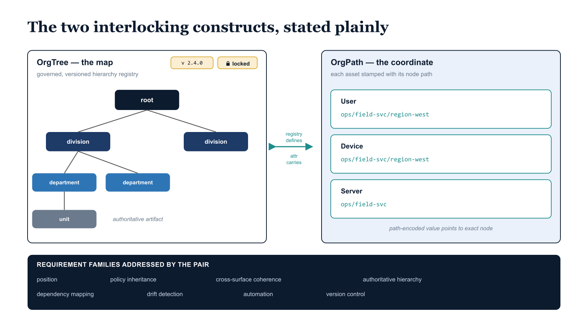

# Chapter 1 — A Response to the Requirements

::: {.callout-note}
## In this chapter
The third and final installment proposes the conceptual model that satisfies
the twelve requirements derived earlier: two interlocking constructs —
**OrgTree** (the governed, versioned registry of the hierarchy) and
**OrgPath** (the validated position attribute stamped on every asset). If
OrgTree is the map, OrgPath is the coordinate on it.
:::

## Position in the Series

This document is the third and final installment in a series of architecture papers concerned with the structural governance gap that opens when an organization replaces its on-premises directory infrastructure with cloud-based identity and management platforms. The first document in the series described what the on-premises directory model provides as a matter of course, and identified what cloud-based platforms do not natively replicate when those on-premises systems are removed. What the on-premises model supplies without being asked includes:

- organizational position,
- policy inheritance,
- cross-platform coherence,
- authoritative hierarchy,
- dependency mapping, and
- integrated identity governance.

The second document, titled *What Must Exist*, derived twelve precise architectural requirements from that analysis: requirements stated in terms of what a governance substrate must provide in order to close the gap, framed without reference to any specific product, vendor, or implementation technology. Each requirement described a structural property that must exist, not a tool that must be purchased or a feature that must be enabled.

This document proposes the conceptual model that satisfies those requirements. The proposal is organized around two interlocking architectural constructs: OrgTree and OrgPath. These constructs are presented here as original architectural proposals. They are not implementations of any existing product, framework, or vendor offering. They are the logical answer that emerges when the twelve requirements of the companion document are taken seriously as a design problem and addressed with disciplined architectural reasoning. The remainder of this document builds that answer, one component at a time, until the complete model is visible and the connection between each requirement and its proposed resolution is explicit and traceable.

{#fig-book-03-cpt-01-diagram-01 fig-alt="Left panel \"OrgTree — the map\" shows a governed, versioned hierarchy registry (root → divisions → departments → units) with a version tag and a lock icon denoting it is an authoritative artifact. Right panel \"OrgPath — the coordinate\" shows individual assets (a user, a device, a server) each stamped with a path-encoded value pointing to its exact node in the tree. A bidirectional bracket labels the relationship \"registry defines valid paths ⇄ attribute carries the instance\". A footer band lists the requirement families addressed by the pair: position, policy inheritance, cross-surface coherence, authoritative hierarchy, dependency mapping, drift detection, automation, version control. Engineering blueprint style, white background, federal navy (#1F3A5F) for OrgTree, teal (#1A9E8F) for OrgPath assets, amber (#D4A017) for the governed-artifact markers, monospace path strings, no human figures, 16:9 landscape." width="100%"}

## The Two Constructs, Stated Plainly

Before the model is developed in depth, it is worth stating the two constructs in the plainest possible terms, because the rest of the document depends on the reader holding a clear intuition of what each one is and how they differ from each other.

| Construct | What it is | What it answers |
| :--- | :--- | :--- |
| **OrgTree** | A governed, versioned registry that defines the organizational hierarchy — the authoritative record of what its valid segments are, what relationships exist between those segments, and what the complete lineage from the top of the organization to each of its constituent parts looks like at any given point in time | What does the organization look like, expressed in terms precise enough for a computer to reason about? |
| **OrgPath** | A structured attribute stamped on every identity, device, and server resource in the managed environment — the positional record that encodes, for each individual asset, exactly where that asset sits within the OrgTree at the time the attribute is applied | Where does this specific asset sit within the governed organizational model? |

> If OrgTree is the map, **OrgPath is the coordinate on that map** — not a label, not a freeform annotation, but a machine-readable, validated expression of position within a governed organizational model.

Every requirement in the companion document is addressed by one or both of these constructs, either directly or in combination with the management surfaces and pipeline processes they inform.

## How This Document Proceeds

The document introduces OrgTree in full before introducing OrgPath, because OrgPath is defined in terms of OrgTree and cannot be understood independently of it. After both constructs have been developed individually, the document describes how they operate together as a closed governance loop. It then addresses the major architectural requirements from the companion document in turn — showing for each precisely how the combination of OrgTree and OrgPath satisfies it:

1. Policy Inheritance,
2. Device Governance,
3. Server Identity,
4. Dependency Mapping,
5. Drift Detection,
6. Automation, and
7. Version Control.

The document closes with a synthesis of the complete model, describing what an organization that has implemented both constructs can do that it cannot do without them, and restating the connection between the proposal and the requirements that motivated it.
