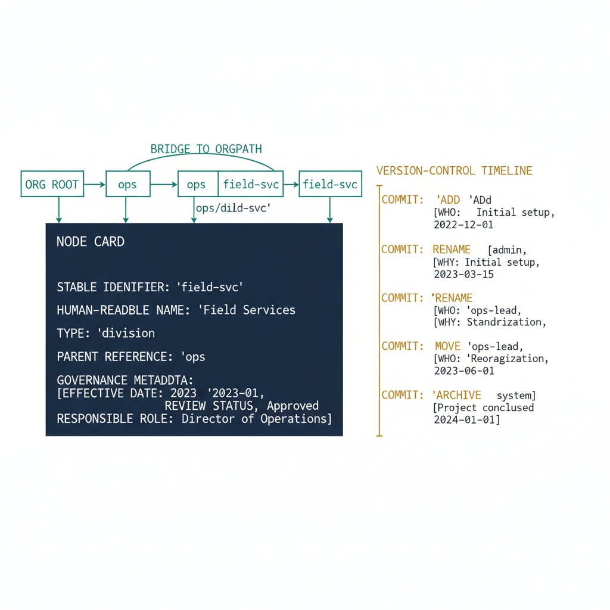

# Chapter 2 — OrgTree — The Governed Definition of Organizational Structure

::: {.callout-note}
## In this chapter
What OrgTree *is* — a governed artifact, not a directory or database — its
internal structure of nodes (stable identifiers, names, types, parent
references, governance metadata), how a node's path from the root bridges to
OrgPath, how it is governed as a version-controlled artifact, and what it is
deliberately *not* responsible for.
:::

## What OrgTree Is

OrgTree describes a tree in the *organizational* sense — a rooted hierarchy in which every node except the root has exactly one parent and may have zero or more children — but it is not any of the things its shape might suggest:

- It is **not a directory.**
- It is **not a database.**
- It is **not a tree data structure** in the computer-science sense.

What it *is* is a versioned, machine-readable record that defines the complete hierarchy of an organization — its divisions, departments, units, teams, functions, regions, sites, and any other segment type the organization uses to describe itself. It is the authoritative answer to one question: what does this organization actually look like, expressed in terms a computer can reason about?

> **OrgTree is a governed artifact** — something authored, approved, committed, and versioned. Its authority derives not from any platform's enforcement mechanism but from the discipline with which it is maintained and the pipeline that derives operational values from it.

That framing — artifact rather than system, service, or feature — is deliberate. Systems can be configured inconsistently; services can drift from their intended state; features can be toggled with no record. An artifact maintained under governance discipline is the same document it was when last approved — or, if it changed, the change is recorded in commit history alongside the reason and the approver. That property is what makes OrgTree usable as the foundation of a governance substrate.

## The Internal Structure of OrgTree

OrgTree consists of nodes and relationships. Each node represents one organizational segment — one named unit of the hierarchy — and carries a set of properties, each serving a specific governance function:

| Property | What it holds | Governance function |
| :--- | :--- | :--- |
| **Identifier** | Unique within the tree, **stable across renames** | OrgPath values derived from it stay valid across renaming events — no mass re-derivation |
| **Name** | The human-readable label | What appears in reports, audit logs, and administrative interfaces |
| **Type** | Division, department, unit, team, site, function, … | Classifies the segment; the set of valid types is itself a governed artifact, defined once and extended deliberately |
| **Parent reference** | Identifier of the node directly above | Establishes position in the tree; with all ancestor references, defines the node's complete lineage from the root |
| **Effective date** | When the node was added or its current form became authoritative | Anchors the node's governance timeline |
| **Review status** | Whether the node was validated in the latest governance review cycle | Prevents nodes from persisting indefinitely without human confirmation that they still map to real structure |
| **Responsible role** | The function or position accountable for the node's accuracy | A clear point of contact for any governance question about that segment |

The **root node** represents the organization as a whole. Every other node is a descendant of the root, connected through the chain of parent references that constitutes the tree.

## Path Encoding and the Bridge to OrgPath

Because OrgTree is a tree, any node can be addressed by its **path from the root** — the ordered sequence of node identifiers from the root down through each successive ancestor to the node itself. This path is the node's organizational lineage: it encodes not merely where the node sits but how it is reached, through which organizational layers it passes on the way from the top of the organization to its specific position.

A node belonging to the Regional West unit — a child of Field Services, a child of Operations, a direct child of the organizational root — has a path that is the concatenated sequence of identifiers for those four nodes, ordered outermost to innermost.

> This path encoding is the bridge between OrgTree and OrgPath: **OrgTree defines the set of valid paths, OrgPath carries the specific path for each managed asset,** and the validity of any OrgPath value can be checked mechanically against the current OrgTree registry.

## How OrgTree Is Governed

OrgTree is maintained as a version-controlled artifact committed to a governed repository. Every structural change is treated as a formal change event:

- **adding** a node,
- **removing** a node,
- **renaming** a node's human-readable label,
- **moving** a node to a different parent,
- **archiving** a node that represents a dissolved organizational unit.

Each change is proposed as a change request through a defined workflow, reviewed against the organization's governance process, approved by the appropriate authority, and committed with a descriptive record that captures:

- the **reason** for the change,
- the **identity of the approver**,
- the **effective date**, and
- the **downstream impact** on OrgPath values and dynamic group membership rules.

> The commit message is not optional administrative commentary; it is the formal record of an organizational structural decision.

This process ensures OrgTree reflects deliberate organizational decisions, not ad-hoc administrative actions. Its version history is, in a meaningful sense, the history of the organization's structure — a chronological record available for audit, compliance review, and incident investigation. When an investigation asks what organizational unit a user or device belonged to at the time of an event, the answer is available by checking the state of the OrgTree registry at the relevant date. This is not a forensic reconstruction; it is the direct consequence of treating organizational structure as a versioned artifact rather than a mutable configuration state.

{#fig-book-03-cpt-02-diagram-01 fig-alt="Center shows a single node card with its governed properties listed — stable identifier (unchanged across renames), human-readable name, type (division / department / unit / team / site / function), parent reference, and governance metadata (effective date, review status, responsible role). Above it, the chain of parent references is drawn from the node up through its ancestors to the organizational root, with the concatenated identifiers forming the node's path (e.g. ops/field-svc/region-west) shown as the \"bridge to OrgPath\". To the side, a version-control timeline shows commits for add / rename / move / archive events, each carrying who/why/effective-date. Engineering blueprint style, white background, federal navy (#1F3A5F) for the node card, amber (#D4A017) for the version-control timeline, teal (#1A9E8F) for the path bridge, monospace identifiers, no human figures, 16:9 landscape." width="85%"}

## What OrgTree Is Not Responsible For

> **OrgTree defines organizational structure — it does not enforce it.**

This boundary must be clearly understood, because the value of OrgTree depends on it being kept clean. OrgTree specifies what organizational nodes exist and how they relate. It does **not**:

- apply policies,
- assign permissions,
- provision identities, or
- configure devices.

Those operations are the responsibility of the governance pipeline that *consumes* OrgTree — the tooling that reads the registry, derives OrgPath values for each identity, and propagates those values to the management surfaces that need them. OrgTree provides the authoritative record of what is true; the pipeline is the mechanism by which that truth is expressed in the live environment. Conflating the two — expecting OrgTree itself to enforce governance rather than to define it — would be a category error, and one that would undermine the clean separation of concerns on which the architecture depends.

::: {.callout-note title="Requirement Addressed — Authoritative Registry"}
The companion document required that the organizational hierarchy itself be a governed artifact: versioned, machine-readable, and authoritative over every attribute value derived from it. OrgTree is that artifact. It is the single governed record that defines what valid organizational positions exist, what the relationships between them are, and what change history exists for every structural decision the organization has made. No other source of organizational truth competes with it. Every OrgPath value, every dynamic group membership rule, and every drift detection result is derived from OrgTree and is only valid in relation to it.
:::
