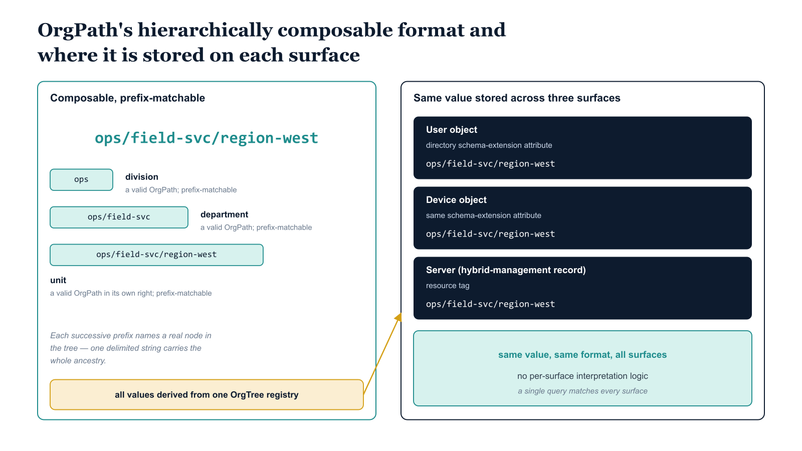

# Chapter 3 — OrgPath — Every Identity’s Coordinate in the Organizational Hierarchy

::: {.callout-note}
## In this chapter
OrgPath as the structured, validated position attribute stamped on every user,
device, and server: what problem it solves (the absence of a machine-readable
position in the cloud model), its deterministic and hierarchically composable
format, where it is stored on each surface, and how the pipeline assigns and
maintains it rather than administrators setting it by hand.
:::

## What OrgPath Is and What Problem It Solves

OrgPath is a structured string attribute that is stamped on every identity object in the managed environment — every user, every device, every server resource — and that encodes, for that specific asset, its precise position within the OrgTree at the time the attribute is applied.

> Where OrgTree is the registry of the hierarchy, **OrgPath is the expression of position within that hierarchy for a specific asset.**

If OrgTree defines that an organization has a division called Operations, and that Operations contains a department called Field Services, and that Field Services contains a unit called Regional West, then the OrgPath of a user assigned to Regional West encodes that complete lineage: Operations, then Field Services, then Regional West, expressed as a path from the organizational root to the user's current position. The OrgPath value does not contain the human-readable names of those nodes; it contains their stable identifiers — the same identifiers that are defined in the OrgTree registry and that do not change when a node is renamed.

The problem OrgPath solves is the absence of a structured, validated, machine-readable position attribute in the cloud identity model. Cloud directories provide freeform attributes, but none of them is fit for governance purposes:

- **department fields** — not validated against any authoritative model of organizational structure,
- **job title fields** — not an encoding of the full lineage from the organizational root, and
- **custom extension attributes** — not maintained by a governed pipeline that ensures consistency across the identity population.

An organization that wants to write a policy targeting all identities in a given division has no native, reliable mechanism to do so using the cloud directory as it is. OrgPath provides that mechanism by making organizational position a first-class, validated, structured attribute — one that a policy engine, a dynamic group membership rule, a drift detection engine, or a compliance reporting tool can evaluate with confidence.

{#fig-book-03-cpt-03-diagram-01 fig-alt="Left panel shows a single delimited path value, ops/field-svc/region-west, with brackets under successive prefixes — \"ops\" (division), \"ops/field-svc\" (department), \"ops/field-svc/region-west\" (unit) — each labeled \"a valid OrgPath in its own right; prefix-matchable\". Right panel shows the same value stored consistently across three surfaces: a directory schema-extension attribute on the user object, the same schema-extension attribute on the device object, and a resource tag on the server's hybrid-management record — all derived from one OrgTree registry. A note reads \"same value, same format, both surfaces — no per-surface interpretation logic\". Engineering blueprint style, white background, teal (#1A9E8F) for the path/prefixes, federal navy (#1F3A5F) for the three storage surfaces, amber (#D4A017) for the registry source, monospace path strings, no human figures, 16:9 landscape." width="85%"}

## Format and Structure

OrgPath is a delimited string — a sequence of node identifiers from the OrgTree, separated by a consistent delimiter, ordered from the root of the hierarchy to the specific node representing the asset's position. The format is **deterministic**: given the same position in the same OrgTree, every asset at that position carries the same OrgPath value. There is no variation in representation for the same position, no alternate formats, and no optional components.

> The determinism of the format is not a stylistic choice; it is an **architectural requirement.**

A policy engine that evaluates OrgPath values must be able to compare them mechanically, without any parsing ambiguity, and it must be able to do so in constant time relative to the length of the path rather than requiring a traversal of the tree at evaluation time.

The format is also **hierarchically composable**: any prefix of an OrgPath value is itself a valid OrgPath representing a higher-level organizational position. This composability is what enables OrgPath to be used for hierarchical policy targeting without requiring a separate attribute for each level of the hierarchy. A rule that matches on a prefix of OrgPath matches every asset at or below the level that prefix represents — from the division level, where the prefix is a single identifier, all the way down to the most granular unit in the hierarchy, where the prefix is the complete OrgPath of that unit. The same attribute, the same syntax, and the same matching logic serve every level of the organizational hierarchy, because the hierarchy is encoded in the structure of the value itself.

## Where OrgPath Is Stored

OrgPath is stored as an extended attribute on each identity object — but the concrete mechanism differs by surface, while the value and its format do not:

| Surface | Storage mechanism | What carries the name | What carries the value |
| :--- | :--- | :--- | :--- |
| **Users and devices** (cloud identity platform) | Directory schema extension — a custom attribute registered to an application, stamped on each object | The attribute is registered once and applied to every identity object in scope | The OrgPath of the user or device, readable through the directory's standard query and management interfaces |
| **Server resources** (cloud hybrid management plane) | Resource tag — a key-value pair attached to the resource record | The tag name is fixed, defined once by the governance architecture and applied consistently across all resource types and resource groups in scope | The OrgPath of the server, derived from the same OrgTree registry and expressed in the same delimited path format |

For user and device identities, directory schema extensions are a supported, standard capability of cloud identity platforms; they do not require any special platform feature to be enabled, and they are accessible to any tool or service that has read access to the directory. For server resources, resource tags are a supported, standard mechanism for annotating managed resources in cloud management platforms; they are queryable, filterable, and reportable using the management plane's native tooling.

> The same OrgPath value, in the same format, expressed on both surfaces, using the same vocabulary defined by the same OrgTree registry — **this uniformity is not coincidental; it is the property that allows the governance model to span management surfaces without requiring surface-specific interpretation logic.**

## How OrgPath Is Assigned and Maintained

OrgPath values are not set manually by individual administrators. Manual assignment would defeat the purpose of the attribute, because manual assignment is the mechanism by which governance states drift: a conscientious administrator sets the value correctly, an oversight is made in a subsequent provisioning event, and within months the attribute population is inconsistent enough to be unreliable as a governance signal. OrgPath values are instead derived from OrgTree by the governance pipeline — a governed, event-driven, auditable process that removes the administrator's discretion from the assignment and replaces it with mechanical derivation from the authoritative registry.

When an identity is onboarded — a new user is provisioned, a new device is enrolled, or a new server is registered — the pipeline performs the following sequence of operations:

1. **Determine** the identity's organizational assignment from an authoritative source: the organization's human resources system for a new user, the provisioning workflow for a new device, or the change management process for a new server.
2. **Validate** that assignment against the OrgTree registry to confirm that the target node exists and is currently in a valid, non-archived state.
3. **Construct** the OrgPath value by traversing the OrgTree from the root to the target node, assembling the sequence of stable node identifiers into the delimited path format.
4. **Stamp** the resulting value on the identity object in the appropriate attribute or tag.
5. **Record** the assignment in the governance repository, including the identity identifier, the OrgPath value assigned, the source of the organizational assignment, the timestamp, and the identity of the pipeline run that performed the operation.

The assignment record is not a log entry that might be overwritten; it is a committed record in the versioned governance repository, and it is permanent.

When an identity's organizational position changes — a user moves to a different department, a device is reassigned to a different division, a server is relocated to a different operational unit — the same pipeline derives the new OrgPath from the new position, validates it against the registry, updates the attribute, and records the change. The previous OrgPath value is preserved in the governance repository as part of the identity's position history. The pipeline does not simply overwrite the attribute and move on; it commits a transition record that captures the prior value, the new value, the reason for the change, and the timestamp. This transition record is the source from which an identity's complete organizational history can be reconstructed.

## What Distinguishes OrgPath from a Freeform Label

The critical distinction between OrgPath and any freeform organizational attribute is validation against the OrgTree registry. A department attribute can contain any string — it is populated by whoever sets it, carries no structural meaning, and cannot be verified against any authoritative model of the organization. The failure modes of a freeform label are familiar:

- Two users in the same organizational unit may carry **different values** in a freeform department field simply because different administrators set the field at different times using different conventions.
- A device may carry a department value that **referred to a unit that no longer exists**, set years ago when the device was provisioned and never updated since.

There is no mechanism to detect this drift, because there is no authoritative model to drift from.

OrgPath is validated: its value is checked against the OrgTree registry on every write, and any value that does not correspond to a valid path in the current OrgTree is rejected at write time. The pipeline never stamps an OrgPath value that the registry does not recognize as valid.

> This validation is what makes OrgPath trustworthy as a governance signal. **It is not a label someone typed. It is a verified coordinate in a governed organizational model,** derived by a pipeline that is accountable to the same registry that validates it.

::: {.callout-note title="Requirement Addressed — Organizational Position"}
The companion document required that every user and device identity carry an authoritative, machine-readable, deterministic representation of its organizational position, encoding the full lineage from the organizational root to the identity's current position, structured so that policy engines and governance tools can evaluate membership at any level of the hierarchy using the same attribute and the same syntax. OrgPath is that representation. Its format is deterministic, its values are validated against the OrgTree registry on every write, its hierarchically composable structure enables evaluation at any level of the hierarchy using prefix matching, and its maintenance is fully automated by the governance pipeline.
:::
