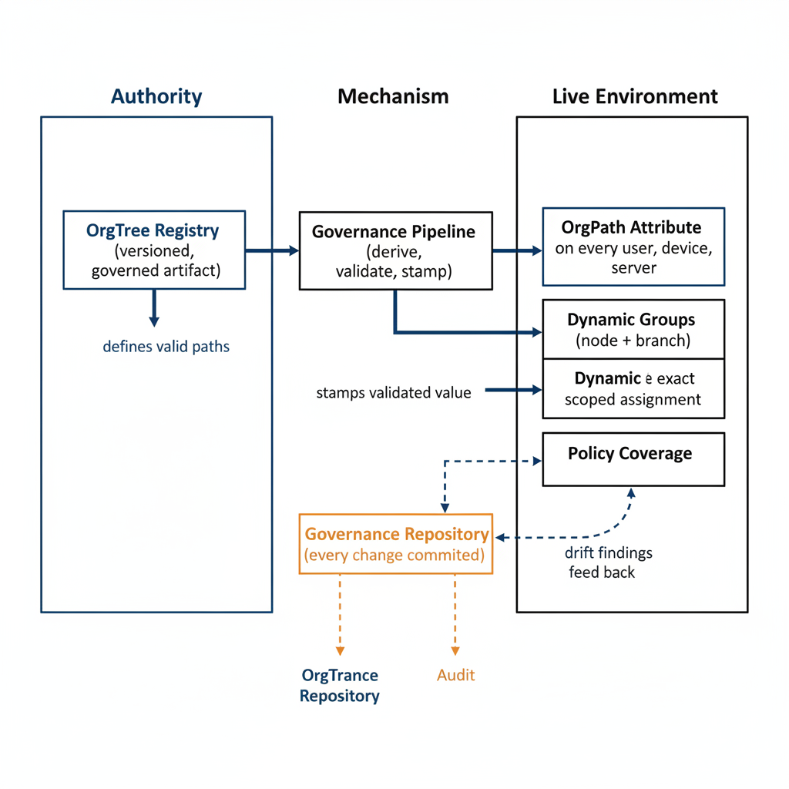

# Chapter 4 — The Registry and the Attribute — A Closed Governance Loop

::: {.callout-note}
## In this chapter
How OrgTree and OrgPath operate together as a single **closed governance
loop**: the registry is the authority, the attribute is the derived instance,
authority flows one direction (registry → attribute), and policy coverage
adjusts automatically when the organization restructures — the cloud-native
equivalent of OU/GPO inheritance.
:::

{#fig-03-proposed-governance-substrate-diagram-01 fig-alt="Lane 1 \"Authority\" contains a single box: OrgTree Registry (versioned, governed artifact). Lane 2 \"Mechanism\" contains: Governance Pipeline (derive, validate, stamp). Lane 3 \"Live Environment\" stacks three boxes: OrgPath Attribute (on every user, device, server), Dynamic Groups (node + branch), Policy Coverage. A separate box below the three lanes labeled \"Governance Repository (every change committed)\". Solid arrows: Registry → Pipeline (\"defines valid paths\"); Pipeline → Attribute (\"stamps validated value\"); Attribute → Groups (\"prefix and exact match\"); Groups → Policy Coverage (\"scoped assignment\"). Dashed feedback arrow: Policy Coverage → Pipeline (\"drift findings feed back\"). Dashed audit arrows: Registry and Pipeline both connect downward to Repository. Engineering blueprint style, white background, federal navy (#1F3A5F) for authority and amber (#D4A017) for repository, 16:9 landscape." width="85%"}

## The Relationship Between OrgTree and OrgPath

OrgTree and OrgPath are not two independent constructs that happen to be useful in proximity. They are two components of a single closed loop, and neither is meaningful without the other. OrgTree defines what the organization looks like: the nodes, the relationships, the lineages, the governance metadata. OrgPath expresses where each asset sits in that definition: the validated, pipeline-derived, attribute-stamped coordinate for each individual identity or resource. Every OrgPath value is derived from OrgTree and is only valid in relation to OrgTree. There is no such thing as an OrgPath value that exists independently of the organizational model it references.

The dependency runs both ways, and it is worth stating each direction precisely:

- **OrgTree is meaningless without OrgPath.** A registry of organizational structure that is not expressed on any asset governs nothing. An organization could maintain a beautifully governed OrgTree registry — perfectly versioned, carefully reviewed, accurately reflecting the real organizational structure — and it would have no governance consequence whatsoever if the positions it defines were not stamped on the identities and resources that the governance model is supposed to cover.
- **OrgPath is meaningless without OrgTree.** A positional attribute that is not validated against an authoritative schema is just a string. Its values cannot be trusted, cannot be verified, and cannot support any governance function that depends on them being accurate.

Together, OrgTree and OrgPath constitute a coherent governance model: the registry defines the schema, and the attribute carries the instance.

> **The schema is authoritative; the instance is derived.**

## The Direction of Authority

OrgTree is the authority in this relationship, and the direction of derived authority flows in one direction only: from the registry to the attribute. When OrgTree changes, OrgPath values derived from affected nodes must be recomputed and reapplied by the governance pipeline.

> This is not an optional reconciliation step — **it is the mechanism by which the governance model remains coherent after organizational change.**

How a given change propagates depends on what kind of change it is:

- **A node is renamed.** If a department node in OrgTree is renamed, every identity whose OrgPath traverses that node receives an updated OrgPath value reflecting the new stable identifier path, if the identifier has changed. In the case where only the human-readable label has changed but the identifier remains stable, the OrgPath values remain valid as-is, but reports and administrative interfaces that display the human-readable label are updated.
- **A node is moved.** If a node is moved to a different parent — a unit previously under Operations is reorganized under Finance — every identity at or below that node receives an updated OrgPath reflecting the new lineage.

In every case the pattern is the same: the OrgTree change is the trigger; the OrgPath update is the consequence; and the governance pipeline is the mechanism that propagates the consequence to the live environment.

This directionality has an important practical implication. It means that the governance pipeline is not merely an assignment mechanism — it is also a reconciliation mechanism. After any change to the OrgTree registry, the pipeline must identify every identity whose OrgPath traverses a changed node, recompute the correct OrgPath value, and apply the update. The scope of a reconciliation run is bounded by the change: a change to a leaf node affects only the identities assigned to that node; a change to a high-level node — a divisional restructuring, for example — may affect a large fraction of the identity population. The pipeline must be capable of executing this reconciliation efficiently, and the governance repository must record both the OrgTree change and the set of OrgPath updates it triggered, as a linked pair of records that document the complete consequence of a structural decision.

## Policy Coverage and Automatic Adjustment

The most significant operational consequence of the closed loop between OrgTree and OrgPath is that policy coverage adjusts automatically when the organization restructures. Because dynamic group membership rules evaluate the OrgPath attribute, and because OrgPath values are updated when OrgTree changes, the set of identities covered by any given policy scoped to a dynamic group adjusts without any administrator manually modifying group membership.

Consider an identity that moves from the Operations division to the Finance division. It does not remain covered by Operations policies. The adjustment cascades through the loop:

1. Its OrgPath changes — the pipeline derives a new value reflecting the Finance lineage.
2. Its group memberships change as the dynamic membership rules are re-evaluated against the new attribute value.
3. Its policy coverage updates to reflect its new organizational position.

No administrator touches a group. No policy is modified. The structural model tracks the organization, and the policy coverage follows the structural model.

This is the property that the companion document identified as missing from the native cloud platform model and that Active Directory provided through its OU structure and GPO inheritance mechanism. In the Active Directory model, moving a computer object from one OU to another caused it to inherit the policies linked to its new OU automatically. The OrgPath model replicates this behavior in a cloud-native environment by using attribute-based dynamic group membership in place of structural OU inheritance — a different mechanism that produces the same governance outcome: position implies policy coverage, and position changes cause coverage to change automatically.

## Schema Validation in Technical Terms

OrgTree maintains, as part of its published state, the complete set of valid node paths — every path from the root to every currently active node in the hierarchy. This set is computed from the tree structure and published alongside the tree definition as part of the registry artifact. The governance pipeline validates every OrgPath write against this set.

> A value is valid if and only if **it corresponds to a node path that currently exists in the published OrgTree.**

A write is rejected when it falls into any of the following cases:

| Rejection case | What the value references |
| :--- | :--- |
| **Removed node** | A node that has been removed from OrgTree |
| **Stale node** | A node that was valid at a previous point in time but has since been merged or archived |
| **Malformed path** | A string that does not conform to the path encoding format of the OrgTree — using the wrong delimiter, containing identifiers that do not exist in the registry, or encoding a path that does not correspond to any root-to-node traversal in the current tree |

When a write is rejected, the pipeline logs the rejection, records the attempted value, and reports the failure for remediation. The live environment never contains OrgPath values that reference an organizational reality that no longer exists in the governed registry.

## The Source Upstream of the Loop

The closed loop described so far runs from OrgTree to OrgPath and back: the registry defines valid structure, the attribute is derived and validated against it, and drift between them is detected and corrected. But the loop has an inlet. The registry does not author the organization's structure; it governs and versions a structure that originates elsewhere. The phrase used throughout this chapter — that OrgPath is "derived from one authoritative source" — refers, within the loop, to OrgTree as the authority over the attribute. One level up, OrgTree is itself fed by the authority over the organization: the human-resources system of record.

This is the system that owns the facts the hierarchy is built from — who is employed, in what position, under which reporting line, in which division, at which location — and that records the events that change those facts as they happen. A worker is hired, promoted, transferred, or separated in the HR system first; the directory has historically been a hand-maintained projection of that truth, which is exactly why directory structure drifts from organizational reality over time. Binding OrgTree to the HR system of record closes that gap at the inlet: structural change enters through the registry's change-request workflow as a governed, reviewed delta, and per-person placement flows from HR through the integration middleware that computes OrgPath before it reaches the directory. The change-request workflow is not a competing source of truth — it is the control that governs HR-supplied change before it is committed.

The loop is therefore best understood as having three stages rather than two: the HR system of record supplies organizational truth; OrgTree governs and versions it; OrgPath carries it, validated, onto every object. Each stage has a single authority, and authority runs strictly downstream — from HR, into the registry, out to the attribute — never the reverse.

::: {.callout-note title="Companion canon — the inlet to the loop"}
The doctrine naming the HR system of record as the authoritative source feeding OrgTree, with the change-request workflow as the governance gate over HR deltas, is fixed in [ADR-088](/docs/adr/adr-088-hr-as-orgtree-truth-source.html). Its transport is the API-driven inbound provisioning path of [ADR-003](/docs/adr/adr-003-api-driven-inbound-provisioning.html). The end-to-end implementation — including reconciliation of an inherited OU estate that has drifted from the true structure — is Book 04, Chapter 9A.
:::

## What the Closed Loop Establishes

The OrgTree-OrgPath system, taken together, establishes a single, governed, validated, continuously maintained model of organizational structure that spans every management surface, is derived from one authoritative source, and drives policy coverage automatically without requiring manual group management or point-in-time configuration effort. This is the architectural baseline that all subsequent requirements are addressed against. The specific requirements treated in the chapters that follow are each best understood as consequences of this baseline: each is a capability that the closed loop between OrgTree and OrgPath makes possible, and each represents a governance function that the cloud platform cannot provide without it.
