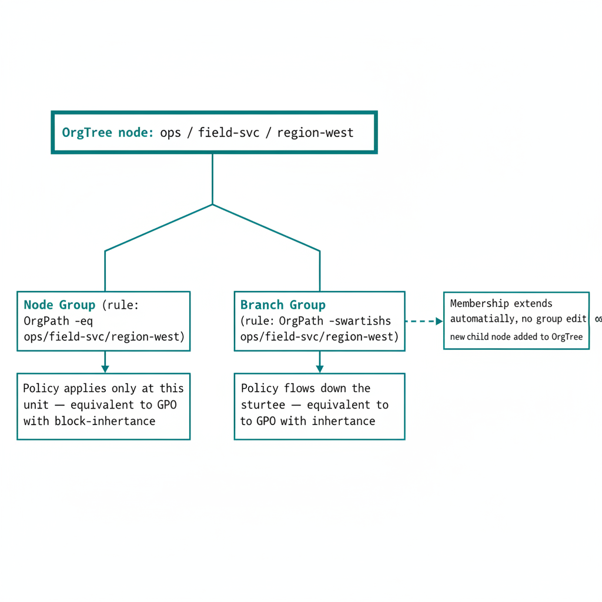

# Chapter 5 — How OrgPath Restores Hierarchical Policy Targeting

::: {.callout-note}
## In this chapter
The two-group pattern that turns OrgPath into policy targeting: a **node group**
(`-eq`, coverage that stops at one unit, like block-inheritance) and a
**branch group** (`-startsWith`, coverage that flows down the whole subtree,
like GPO inheritance) — both maintained by the registry so the policy author's
only job is to assign policy to the right group.
:::

::: {.callout-note title="Requirement Being Addressed — Policy Inheritance"}
The companion document established that policy must be derivable from organizational position, not only from explicit group assignment, and that the mechanism for this derivation must be a position attribute combined with a dynamic group library maintained by the hierarchy registry. Policy authors must be able to target a segment of the organizational hierarchy and have that targeting apply to all identities at and below that segment, without maintaining explicit lists of members.
:::

{#fig-03-proposed-governance-substrate-diagram-02 fig-alt="Root node labeled \"OrgTree node: ops / field-svc / region-west\". Two branches split downward to a left child \"Node Group (rule: OrgPath -eq ops/field-svc/region-west)\" and a right child \"Branch Group (rule: OrgPath -startsWith ops/field-svc/region-west)\". Each child connects further downward to a policy outcome box: left to \"Policy applies only at this unit — equivalent to GPO with block-inheritance\"; right to \"Policy flows down the subtree — equivalent to GPO with inheritance\". A dashed arrow from the right Branch Group laterally to a callout box \"Membership extends automatically, no group edit required\", labeled \"new child node added to OrgTree\". Engineering blueprint style, monospace OrgPath strings, white background, teal (#1A9E8F) accents, 16:9 landscape." width="85%"}

## The Dynamic Group Architecture

For each node in the OrgTree, the governance pipeline maintains two dynamic groups. These two groups are the mechanism by which OrgPath values translate into policy targeting, and their design directly replicates the targeting model that Group Policy Objects provided in the on-premises directory environment.

The two groups differ in exactly one thing — the operator their membership rule uses against the OrgPath value — and that single difference produces two complementary scopes:

| Group | Membership rule | Who it contains | On-premises equivalent |
| :--- | :--- | :--- | :--- |
| **Node group** | OrgPath **exactly matches** the node's path (`-eq`) | Every user and device whose OrgPath is precisely the path ending at that node — not a parent's path, not a child's path, but exactly and only the path that designates that node as the terminal position | A policy linked to an OU with the **"block inheritance"** option applied — coverage that stops at the precise organizational boundary and does not propagate further |
| **Branch group** | OrgPath **starts with** the node's path (`-startsWith`) | Every user and device whose OrgPath begins with the node's identifier — the entire subtree below it (see below) | A policy linked to a top-level OU with **inheritance enabled** — coverage that flows downward through the entire subtree without any additional configuration |

The node group is useful for policies that must be applied to identities assigned specifically to a given unit and not inherited by that unit's ancestors or descendants. A node group for the Regional West unit contains every identity whose OrgPath is precisely the path that ends at Regional West.

The branch group is useful for policies that must cover an entire organizational subtree without requiring the policy author to enumerate every unit within it. A branch group for the Operations division contains every identity whose OrgPath begins with the Operations division identifier, which spans:

- identities assigned directly to **Operations**,
- identities assigned to **any department** within Operations,
- identities assigned to **any unit** within any of those departments, and
- identities assigned to **any team or subunit** at any depth below Operations in the hierarchy.

## Structural Equivalence to GPO Inheritance

The structural equivalence between the branch group model and GPO inheritance is worth examining precisely, because the equivalence is not merely functional but architectural. In the Active Directory model, a policy linked to an OU applied to that OU and every child OU beneath it because OU membership was a structural property of the directory, not a computed membership list. The OU contained the objects; the objects were in the OU; the policy applied to the objects in the OU and in every child OU. The administrator did not maintain a list of which objects were in scope — the scope was defined by the structure of the directory.

In the OrgPath model, branch group membership provides the same guarantee through a different mechanism. Because branch group membership is derived from the OrgPath attribute, and because OrgPath is validated against the OrgTree registry, membership in a branch group is structurally guaranteed: every identity whose OrgPath is at or below a given node is automatically and necessarily included in that node's branch group, because its OrgPath begins with the node's path, and because the membership rule selects on that prefix.

> **The rule does not need to be updated when the hierarchy below the node grows.** Adding a new unit to OrgTree causes a new branch of OrgPath values to become valid; identities stamped with those values are automatically included in every branch group whose node is an ancestor of their position, because the prefix relationship is an arithmetic consequence of the path format, not a list entry that must be explicitly added.

## Maintenance Characteristics

The dynamic group library does not require manual maintenance. Its construction is driven by the OrgTree registry: each structural change to the tree triggers a defined, automatic response in the group library.

| OrgTree change | Pipeline response to the group library |
| :--- | :--- |
| **Node added** | Creates the corresponding node group and branch group, defines their membership rules according to the established pattern, and registers them in the governance repository |
| **Node removed** (organizational unit dissolved or merged) | Archives the groups, deactivates their membership rules, and reports any policies scoped to those groups as requiring review by the policy author |
| **Node renamed or moved** | Updates the membership rules of the affected groups to reflect the new path |

The policy author's only sustained responsibility is to assign policies to the appropriate groups. The group contents maintain themselves as the OrgPath population changes, and the policy coverage maintains itself with them.

This maintenance characteristic is the property that the companion document identified as most consequentially absent from the native cloud platform governance model. Without OrgPath and the dynamic group library derived from it, maintaining structurally coherent policy coverage requires administrators to manually manage group membership as the organization restructures — an operational burden that grows linearly with the rate of organizational change and that produces governance drift when it is imperfectly executed.

> With the OrgPath-driven dynamic group library, that burden is eliminated: **the pipeline manages group structure, the attribute manages group membership, and the policy coverage maintains itself.**
