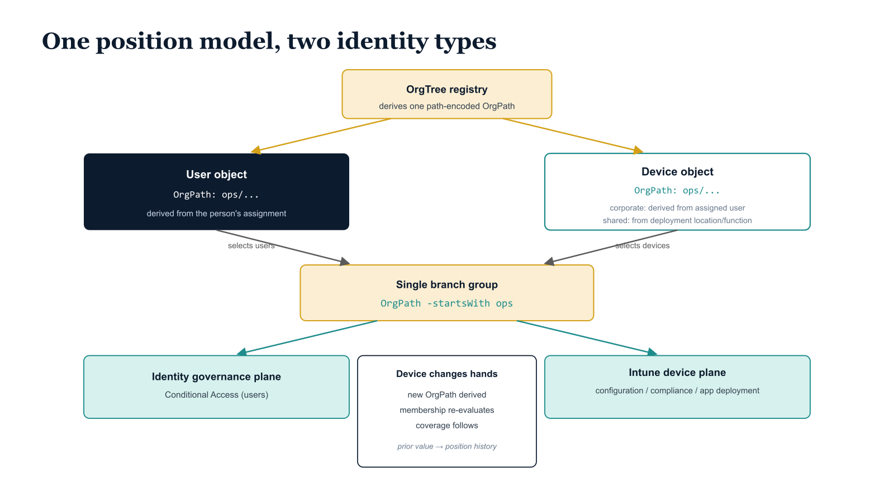

# Chapter 6 — OrgPath for Devices — Extending Structural Governance to the Endpoint

::: {.callout-note}
## In this chapter
Applying OrgPath to device identities with the same schema, derivation, and
validation used for users — so one branch group captures users *and* devices
in a division, device and user policy targeting can never diverge, and a device
that changes hands or moves re-derives its coverage automatically.
:::

::: {.callout-note title="Requirement Being Addressed — Device Governance"}
The companion document required that every managed device carry an authoritative, machine-readable organizational position attribute derived from the same hierarchy registry that governs user identities, and that device policy targeting be derivable from this attribute using the same dynamic group architecture as is used for user policy targeting.
:::

## Applying OrgPath to Device Identities

When a device is enrolled in the endpoint management platform — through a provisioning workflow, an automated enrollment process, or a deployment program — the governance pipeline determines the device's organizational assignment. How that assignment is sourced depends on the kind of device:

| Device kind | Where the assignment comes from |
| :--- | :--- |
| **Corporate-owned** | The organizational unit of the user to whom the device is assigned, or the device's intended deployment context as specified in the provisioning request |
| **Shared** | Its deployment location or function in the OrgTree — a shared device is not assigned to a specific user, but rather deployed to a specific organizational location or function |

{#fig-book-03-cpt-06-diagram-01 fig-alt="A central OrgTree registry derives the same path-encoded OrgPath onto both a user object and a device object (corporate-owned device derives from its assigned user; shared device derives from its deployment location/function). A single branch group \"OrgPath -startsWith ops\" is shown selecting both the users and the devices beneath Operations, and feeding two policy planes at once: identity governance / Conditional Access (users) and Intune configuration / compliance / app deployment (devices). A side vignette \"device changes hands → new OrgPath derived → group membership re-evaluates → coverage follows\", with the prior value written to position history. Engineering blueprint style, white background, federal navy (#1F3A5F) for users, teal (#1A9E8F) for devices, amber (#D4A017) for the registry and shared group, monospace path strings, no human figures, 16:9 landscape." width="85%"}

In both cases, the assignment is validated against the OrgTree registry, the OrgPath value is derived from the device's position in the hierarchy, and the value is stamped on the device's identity object in the directory using the same schema extension attribute format used for user identities.

> The format of the value is identical; the derivation mechanism is identical; the validation logic is identical. **The only thing that differs between a user OrgPath and a device OrgPath is the identity type to which it is applied.**

## Symmetry of the Model Across Identity Types

Because both user and device OrgPath values are derived from the same OrgTree registry, expressed in the same format, and stored in the same schema extension attribute, the dynamic group architecture applies uniformly to both identity types. A branch group defined for a division node selects every identity — user or device — whose OrgPath begins with the division's path. A policy author who assigns a configuration policy to the Operations branch group does not need to know, at the time of assignment, which users and which devices are in scope: the branch group contains all of them, and its contents update automatically as users are provisioned, devices are enrolled, and organizational assignments change. Endpoint management configuration profiles, compliance policies, and application deployment assignments can be scoped to the same groups that scope identity governance and access control policies, because the same attribute and the same membership rules drive both.

> This symmetry is not incidental — it is **the central governance dividend of applying OrgPath uniformly across identity types.**

In environments where device policy targeting is managed separately from user policy targeting — using different group hierarchies, different naming conventions, different governance processes — the two models inevitably diverge over time. A department that has been reorganized has its user policies updated, but its device policies remain scoped to the old group, because the device groups are maintained by a different administrative function that is not in the organizational change notification workflow. With the OrgPath model, this class of divergence cannot occur, because there is exactly one of each thing the two models would otherwise have to keep in sync:

- one source of organizational truth,
- one position attribute,
- one group library, and
- one pipeline that maintains all of them.

The governance model does not know or care whether an identity is a user or a device; it knows its OrgPath, and it applies the appropriate coverage.

## When a Device Changes Hands or Moves

The governance pipeline detects device reassignment events — through the provisioning workflow, the change management process, or the scheduled drift detection run — and responds to them through the same mechanism used for initial assignment:

1. The new organizational assignment is validated against the OrgTree registry.
2. The new OrgPath value is derived and stamped on the device identity object.
3. The dynamic group membership rules re-evaluate the updated attribute value.
4. The device's policy coverage changes automatically to reflect its new position.
5. The previous OrgPath value is recorded in the governance repository as part of the device's position history.

No administrator manually reassigns the device to new groups. The structural model tracks the assignment, and the policy coverage follows the structural model. This is the same behavior as on-premises directory management, where moving a computer object from one OU to another caused it to inherit the policies of its new OU without any additional administrative action.
