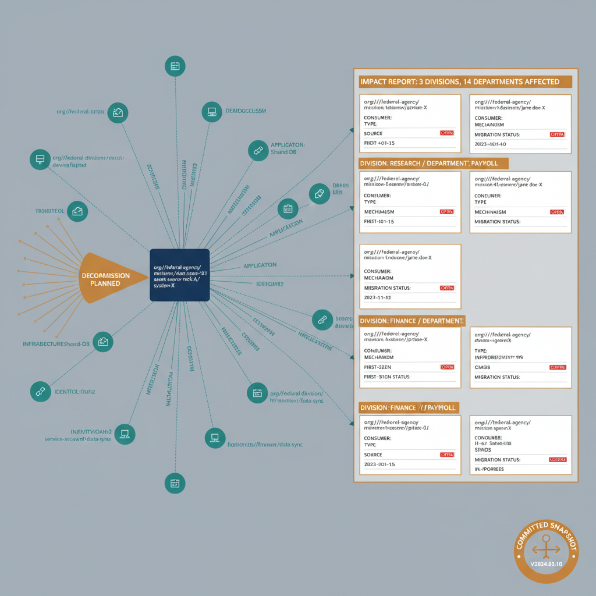

# Chapter 8 — The Dependency Graph — What Must Be Known Before Anything Is Decommissioned

::: {.callout-note}
## In this chapter
How OrgTree/OrgPath supply the organizational *context* for a dependency graph
(not the graph itself): the four dependency categories it records, the fields
each record carries, OrgPath-annotated impact reports organized by division,
and how the graph is initialized from assessment data and kept current.
:::

::: {.callout-note title="Requirement Being Addressed — Dependency Mapping"}
The companion document required that before any infrastructure dependency can be decommissioned, a complete, machine-readable dependency map must exist that identifies every consumer of that dependency, the nature of the dependency, and the migration target for each consumer — organized by organizational position so that the impact of decommissioning can be assessed at the appropriate level of the hierarchy.
:::

## OrgTree and OrgPath as Context for Dependency Relationships

The OrgTree registry and the OrgPath attribute do not themselves constitute a dependency map. A dependency map requires knowledge of which assets communicate with which other assets, over which protocols, for which purposes — information that must be gathered from the network, from directory service registrations, from application configuration records, and from identity and credential audit logs.

> What OrgTree and OrgPath provide is **the organizational context within which dependency relationships are understood** and the vocabulary with which their impact is communicated to the people who must act on them.

A server that provides a service is an asset with an OrgPath value, located at a specific position in the organizational hierarchy. The clients of that service are identities — users, devices, applications — each with their own OrgPath values. When a dependency relationship is recorded in the dependency graph, both the provider and the consumer are annotated with their OrgPath values at the time the relationship is recorded.

When a decommissioning event is planned, the governance pipeline queries the dependency graph for all consumers of the target asset, retrieves their OrgPath values, and produces an impact report organized by organizational position. The report shows which divisions are affected, which departments within those divisions have consumers, and at what level of the hierarchy the impact is concentrated. A decommissioning event that affects consumers distributed across three divisions and fourteen departments is categorically different in its organizational impact from one that affects consumers concentrated in a single unit — and the OrgPath annotation of each consumer makes that difference visible without requiring a manual review of each individual affected identity.

{#fig-book-03-cpt-08-diagram-01 fig-alt="Center is a provider asset (a server) carrying its OrgPath, with edges to many consumers — users, devices, applications, service accounts — each edge labeled by dependency type (protocol / application / infrastructure / identity) and each consumer carrying its own OrgPath. A \"decommission planned\" trigger fans the consumer set into an impact report grouped by division and department, showing concentration (e.g. \"3 divisions, 14 departments affected\" versus \"1 unit\"). Each record card shows provider OrgPath, consumer OrgPath, type, mechanism, discovery source, first-seen date, and migration status (open / in-progress / resolved). A committed-snapshot icon denotes versioning in the governance repo. Engineering blueprint style, white background, federal navy (#1F3A5F) for the provider, teal (#1A9E8F) for consumers, amber (#D4A017) for the impact report and committed snapshot, red (#C0392B) for open dependencies, monospace path strings, no human figures, 16:9 landscape." width="100%"}

## What the Dependency Graph Records

The dependency graph records four categories of dependency, each representing a class of relationship that must be understood and resolved before the provider can be retired:

| Category | Where it arises | Typical examples |
| :--- | :--- | :--- |
| **Protocol** | A client relies on a server-side service for authentication or name resolution (often invisible to the users and devices that depend on them; they operate at the infrastructure layer and are discovered through network traffic analysis and directory service audit logs rather than through application configuration review). | Kerberos ticket-granting, LDAP directory queries, NTLM authentication chains, certificate enrollment against a certificate authority, DNS resolution against a specific server or set of servers. |
| **Application** | A workload relies on a backend service, database, or integration endpoint. | A business application that connects to a database server, a middleware platform that relies on a message queue, an integration service that polls an on-premises endpoint. |
| **Infrastructure** | One infrastructure component relies on another for its own operation. | A monitoring agent that reports to a central collection server, a backup client that writes to an on-premises backup target, an update service that pulls from a local distribution point. |
| **Identity** | A service account or managed identity is the credential under which a dependency relationship is established. | A service running under a domain service account that has specific rights on a target system — the dependency expressed not through network communication alone but through the combination of a credential and a permission. |

Each dependency record in the graph carries the following fields:

| Field | What it records |
| :--- | :--- |
| **Provider OrgPath** | The OrgPath of the asset that provides the service. |
| **Consumer OrgPath** | The OrgPath of the consuming identity. |
| **Dependency type** | The category from the table above (protocol / application / infrastructure / identity). |
| **Protocol or mechanism** | The protocol or mechanism through which the dependency is expressed. |
| **Discovery source** | The source that identified the relationship. |
| **First-recorded date** | The date on which the relationship was first recorded. |
| **Migration status** | Whether the dependency has been resolved by migrating the consumer to a modern equivalent, is in active remediation, or has not yet been addressed. |

The migration status is updated by the pipeline when a resolution event is recorded: when an application migrates from a protocol dependency to a modern authentication mechanism, the dependency record is closed with a resolution timestamp and the migration target is recorded as part of the record.

> The dependency graph is therefore **not a static inventory but a living record of the migration program's progress.**

## Keeping the Dependency Graph Current

The dependency graph is initialized from the assessment data collected during the discovery phase of the modernization program — the output of network and directory assessment tooling that maps existing communication patterns, service registrations, and identity relationships across the environment. This initialization produces a baseline graph that is, at the time of its creation, a reasonably complete representation of the dependencies that exist in the current environment.

It is not a perfect representation. Shadow dependencies may be missing — relationships that are not expressed in any service registration, that communicate through ports that are not logged, or that are established through mechanisms that the assessment tooling does not instrument. The baseline graph is therefore the starting point for an ongoing discovery and validation process, not a finished artifact that is consulted at decommissioning time and trusted to be complete.

The graph is updated continuously as the modernization program proceeds:

- **When a dependency is resolved** — when an application migrates from Kerberos to a modern authentication mechanism, when a server is replaced by a cloud-native equivalent and its consumers are migrated to the new endpoint — the dependency record is closed.
- **When new dependencies are discovered** — when a previously unknown application is found to depend on a domain controller for LDAP queries, when a network traffic analysis run reveals communication between a client and a service that was not in the baseline graph — a new record is created, annotated with OrgPath values for both parties, and assigned for remediation.

The governance repository stores each version of the dependency graph as a committed snapshot, making the history of dependency discovery and resolution part of the permanent governance record.
