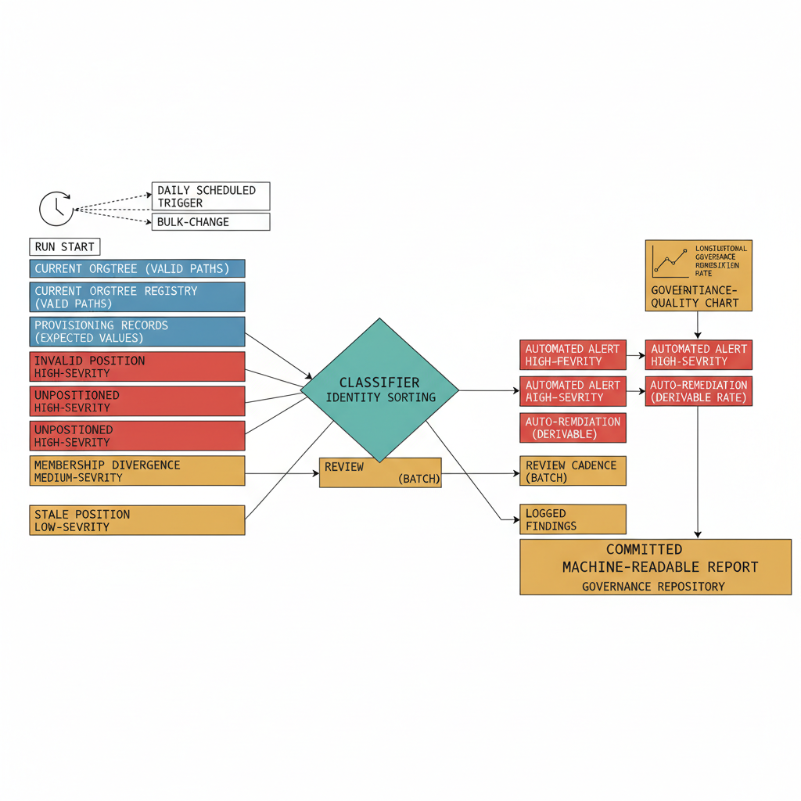

# Chapter 9 — Continuous Validation — Keeping the Governance Model True

::: {.callout-note}
## In this chapter
How drift detection runs in practice — reading the registry and every live
OrgPath value on a schedule, classifying each deviation into four categories
(invalid position, unpositioned, membership divergence, stale position), and
driving severity-based remediation while committing each report as a
longitudinal measure of governance quality.
:::

::: {.callout-note title="Requirement Being Addressed — Drift Detection"}
The companion document required that the governance substrate run drift detection continuously, comparing the live state of every identity's organizational position attribute against the hierarchy registry, surfacing deviations for remediation, and committing the results to a version-controlled governance record after each detection run.
:::

## How Drift Detection Works in Practice

The accuracy of OrgPath values across the identity population is not self-sustaining. Several distinct events can drive the live state out of step with the governed intent recorded in the OrgTree registry:

- **Out-of-band administrative actions** can overwrite attribute values.
- **Platform events** can reset extended attributes — when a device re-enrolls, or when a user object is recreated after a deletion and recovery cycle.
- **Structural changes to OrgTree** can leave identities assigned to nodes that have since been archived or moved.
- **New identities** can be provisioned without OrgPath values assigned — either because the provisioning workflow did not invoke the pipeline, or because the pipeline encountered an error during initial assignment.

Any of these events produces a deviation between governed intent and the actual state of the OrgPath attribute population in the live directory.

> **Drift detection is the process that finds those deviations and reports them for remediation** — the mechanism that keeps the governance model true rather than merely designed.

On a scheduled basis — at minimum daily, and additionally triggered by any change to the OrgTree registry or by any bulk change to the directory's identity population — the drift detection process executes the following sequence:

1. **Read the OrgTree registry** to obtain the complete set of valid organizational paths.
2. **Read the current OrgPath value of every in-scope resource** — every user, device, and server resource — from the directory extension attribute for users and devices, and from the resource tag for server resources.
3. **Read the governance repository's provisioning records** to determine the expected OrgPath value for each identity, based on the most recent pipeline-executed assignment.
4. **Compare each actual OrgPath value** against both the registry and the expected value, classifying each deviation into one of four categories.

The four drift categories, by severity:

| Category | Meaning | Severity |
| :--- | :--- | :--- |
| **Invalid position** | OrgPath value corresponds to no valid path in the current OrgTree (never set properly, set out-of-band bypassing validation, or an incomplete reconciliation run). | High |
| **Unpositioned** | No OrgPath value at all — the identity is outside the dynamic group architecture and exempt from structurally derived policy. | High |
| **Membership divergence** | OrgPath is valid, but the identity's dynamic group memberships don't match what the path implies (evaluation delay or a rule problem). | Medium |
| **Stale position** | OrgPath references a node that has been archived or flagged for removal — assignment not updated for a structural change. | Medium |

The severity ranking is not arbitrary. An **invalid position** is the most severe finding because it signals that the attribute was never properly set, that a value was written by an out-of-band action that bypassed the pipeline's validation, or that OrgTree changed without the pipeline completing its reconciliation run across all affected identities. An **unpositioned** identity is equally consequential: with no OrgPath value at all, it has not been placed in the organizational hierarchy, is invisible to the dynamic group architecture, and is therefore exempt from the governance model. The two medium-severity categories are narrower in scope — a **membership divergence** means the attribute is correct but the policy coverage has not yet been applied, and a **stale position** means the assignment has not been updated to reflect a structural change in the hierarchy.

## What Happens with Drift Detection Results

Each deviation is recorded as a finding in the drift detection report — a machine-readable structured file that is committed to the governance repository at the conclusion of each detection run. The report is a permanent record. For each finding it captures:

- the **identity identifier**,
- the **current OrgPath value** observed in the live environment,
- the **expected OrgPath value** derived from the provisioning record and the current OrgTree,
- the **finding category**,
- the **severity**, and
- the **recommended remediation action**.

Severity drives what happens next:

| Severity | Findings | Response |
| :--- | :--- | :--- |
| **High** | Invalid positions, unpositioned identities | Trigger automated alerts to the governance team; where the pipeline can determine the correct value from the provisioning record, initiate an automated remediation run that reapplies the correct OrgPath value without waiting for human intervention. |
| **Medium** | Membership divergences, stale positions | Collected for batch remediation and included in the governance team's regular review cadence. |
| **Low** | Formatting inconsistencies; values technically valid but using deprecated segment identifiers from an older OrgTree version | Logged for review without triggering immediate action. |

{#fig-book-03-cpt-09-diagram-01 fig-alt="A scheduled trigger (daily, plus registry-change and bulk-change triggers) starts a run that reads three inputs — the current OrgTree registry (valid paths), every live OrgPath value, and the provisioning records (expected values). A classifier sorts each identity into one of four lanes: invalid position, unpositioned, membership divergence, stale position. High-severity lanes (invalid, unpositioned) branch to automated alert + auto-remediation where the correct value is derivable; medium-severity lanes batch into the review cadence; low-severity findings are logged. The run commits a machine-readable report to the governance repository, and a longitudinal chart shows governance-quality over successive reports (valid fraction, introduction vs remediation rate). Engineering blueprint style, white background, federal navy (#1F3A5F) for inputs, teal (#1A9E8F) for the classifier, red (#C0392B) for high-severity lanes, amber (#D4A017) for the committed report and trend chart, monospace labels, no human figures, 16:9 landscape." width="100%"}

The value of the drift detection report extends beyond remediation. Each committed report is a point-in-time measurement of the accuracy of the governance model, and the series of reports committed over time constitutes a longitudinal record of governance quality:

- the **fraction of the identity population** with valid OrgPath values,
- the **rate at which deviations are introduced** relative to the rate at which they are remediated, and
- the **categories of deviation** that are most persistent.

> This record is the evidence base for a governance team's continuous improvement program — and the documentation a compliance review requires to demonstrate that **the governance model is actively maintained rather than merely designed.**
